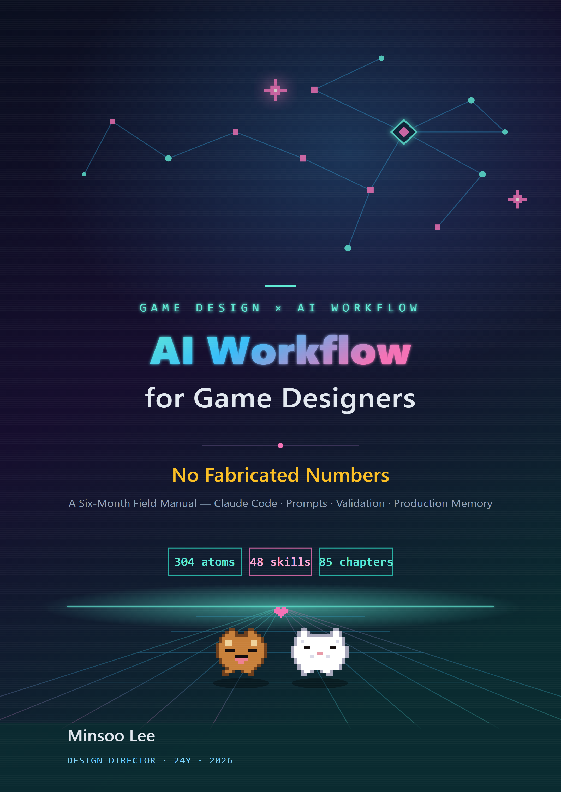

# AI Workflow for Game Designers

> No Fabricated Numbers — A Six-Month Field Manual for Claude Code, Prompts, Validation, and Production Memory

[](LICENSE)
[-blue.svg)](https://github.com/eremes81/game-design-ai-practice)
[-orange.svg)](https://bookk.co.kr/bookStore/6a298be0ff49b1a6034c7703)



A hands-on field manual by a design director with 24 years in the game industry on bringing generative AI (Claude Code) into **daily production work**. Not theory or forecasts — it walks one task at a time from the very first screen (install, accounts, pricing) through systems design, combat, narrative, level design, balance, UX, and live ops, all the way to turning meeting notes into decisions, validation gates, cost management, and copyright.

The subtitle — **"No Fabricated Numbers"** — is this book's promise. Every figure and case in the text comes from real work, not invented examples, and most of the code runs as is on the Python standard library alone.

The book is open to readers outside games, too. Workflows like turning meeting notes into decisions, tracing a decision's ripple effects, and guarding quality with validation gates work regardless of your job. The "Beyond Games" box in each chapter is the bridge, and every chapter also carries a "Solo Scale-Down" for people building alone, with no team.

---

## 🌐 About This Edition

This is the **English edition** of the Korean original, *게임 기획 실무에서 바로 쓰는 AI·클로드 코드 활용법* (BOOKK, 2026 · ISBN 979-11-12-21479-9).

In the spirit of this book's honesty-first principle, here is exactly how this edition was made: it was **translated from the Korean original using the book's own AI workflow** (Claude-assisted translation under a fixed terminology sheet), then reviewed by the author — who is not a native English speaker. All worked transcripts are translations of the original Korean sessions, **not re-runs performed in English**; the untouched Korean originals live in the [Korean repository](https://github.com/eremes81/game-design-ai-practice). Code syntax, identifiers, numbers, and verification values are untouched.

**Native-speaker corrections are very welcome** — if a sentence reads wrong, please open an Issue or a Pull Request.

---

## 📖 Start Reading

- **[Preface · How to Read This Book](manuscript/_front-matter.md)** — start here for the reading routes
- **[1.0 Before You Start — Install, Account, Pricing, and the Terminal Survival Kit](manuscript/part01-foundation/chapter-0-setup-survival-kit.md)** — follow along from the very first screen
- Diagrams are written as ` ```mermaid ` code blocks and **render natively on GitHub**. Click any chapter below and read.

## The Original Print Edition (Korean)

| | |
|---|---|
| Author | Minsoo Lee (이민수) |
| Publisher | BOOKK · paperback (Korean) |
| ISBN | 979-11-12-21479-9 |
| Published | 2026-06-11 |
| Size | 876 pages · 24 parts + appendices A\~N + epilogue |
| Buy | **[BOOKK store (Korean print edition)](https://bookk.co.kr/bookStore/6a298be0ff49b1a6034c7703)** |

This repository is the **English edition (markdown source)** of the same book, released under the license below. The Korean original is at [eremes81/game-design-ai-practice](https://github.com/eremes81/game-design-ai-practice), and the Japanese edition at [eremes81/game-design-ai-practice-ja](https://github.com/eremes81/game-design-ai-practice-ja).

## Full Table of Contents

> **24 parts + appendices A\~N + epilogue · 100 chapters.** Appendices live in [`manuscript/part99-appendix/`](manuscript/part99-appendix), the colophon in [`manuscript/_colophon.md`](manuscript/_colophon.md).

### Part 1 · Foundations

- [1.0 Before You Start — Install, Account, Pricing, and the Terminal Survival Kit](manuscript/part01-foundation/chapter-0-setup-survival-kit.md)
- [1.1 A Game Designer's First Encounter with Claude Code](manuscript/part01-foundation/chapter-1-first-encounter.md)
- [1.2 Model, Token, Harness — The Path a Task's Tokens Travel](manuscript/part01-foundation/chapter-2-model-token-harness.md)
- [1.3 Memory, Permissions, and Settings Infrastructure](manuscript/part01-foundation/chapter-3-memory-permission-setting.md)

### Part 2 · Information Architecture

- [2.1 YAML Frontmatter — Every Document as Data](manuscript/part02-info-architecture/chapter-4-yaml-frontmatter.md)
- [2.2 Per-Page Atoms — The Anatomy of One Decision per Document](manuscript/part02-info-architecture/chapter-5-page-atom.md)
- [2.3 Layer Design — Abstracting Game Systems](manuscript/part02-info-architecture/chapter-6-layer-design.md)
- [2.4 Ontology and the Wikilink Graph — Verifying the Semantic Arrows](manuscript/part02-info-architecture/chapter-7-ontology-graph.md)

### Part 3 · Systems Design

- [3.1 The Systems Designer's Work and Layer Coordinates](manuscript/part03-system-design/chapter-09-system-designer-and-layer.md)
- [3.2 Schema First — The $스키마 Sheet Comes Before the Data](manuscript/part03-system-design/chapter-10-schema-first.md)
- [3.3 Relation Map Visualization — Seeing Dependencies with Your Own Eyes](manuscript/part03-system-design/chapter-11-relation-map.md)
- [3.4 Prompt Patterns for AI-Assisted Systems Design](manuscript/part03-system-design/chapter-12-ai-assist-prompt-patterns.md)

### Part 4 · Combat Design

- [4.1 The Combat Designer and the Layer Stack — Which Cell Does Game Feel Go In](manuscript/part04-combat-design/chapter-13-combat-designer-and-layer.md)
- [4.2 Combat Look & Feel — Pinning Game Feel Down in Data](manuscript/part04-combat-design/chapter-14-look-and-feel.md)
- [4.3 Combos, Cancels, and Input Queues — Enumerate the Paths and Verify Them](manuscript/part04-combat-design/chapter-15-combo-cancel-input.md)
- [4.4 AI-Assisted Combat Simulation and Verification](manuscript/part04-combat-design/chapter-16-ai-combat-simulation.md)

### Part 5 · Narrative

- [5.1 The NarrativeDocs Layer 0–4 Structure](manuscript/part05-narrative-design/chapter-1-narrative-docs-layers.md)
- [5.2 Worldview → Character → Quest Consistency Verification](manuscript/part05-narrative-design/chapter-2-consistency-verification.md)
- [5.3 AI-Assisted Narrative Writing](manuscript/part05-narrative-design/chapter-3-ai-assisted-narrative.md)
- [5.4 Dialogue and Voice Consistency](manuscript/part05-narrative-design/chapter-4-dialogue-voice-consistency.md)

### Part 6 · Content Design

- [6.1 Procedural Content Generation and AI — The One Cell Where the Two Axes Cross](manuscript/part06-content-design/chapter-1-procedural-content-ai.md)
- [6.2 city_hunting_generator — 30 Cities in 4 Weeks](manuscript/part06-content-design/chapter-2-city-hunting-generator.md)
- [6.3 NPC Persona and Squad — From a Mannequin Museum to a Small Society](manuscript/part06-content-design/chapter-3-npc-persona-squad-pipeline.md)
- [6.4 Content Production Workflow — Tying Multiple Generators into One Production Line](manuscript/part06-content-design/chapter-4-content-production-workflow.md)

### Part 7 · Level Design

- [7.1 Procedural Level Design Master](manuscript/part07-level-design/chapter-1-procedural-level-design-master.md)
- [7.2 The Behavior Tree Editor — A Worked Transcript of a Human and AI Editing and Verifying BT json Together](manuscript/part07-level-design/chapter-2-behaviortree-editor.md)
- [7.3 The Dungeon and Field Pattern Library](manuscript/part07-level-design/chapter-3-dungeon-field-pattern-library.md)

### Part 8 · Balance

- [8.1 The Combat Balance Formula — The Seat of the Rulebook Called Determinism](manuscript/part08-balance-design/chapter-1-combat-balance-formula.md)
- [8.2 The Economy Model in Machinations — Catching Inflation with Simulation, Not Meetings](manuscript/part08-balance-design/chapter-2-economy-machinations.md)
- [8.3 Damage Simulator — The Day Spec DPS and Sim Output Diverged](manuscript/part08-balance-design/chapter-3-damage-simulator-2008.md)
- [8.4 AI-Assisted Balance Simulation](manuscript/part08-balance-design/chapter-4-ai-balance-simulation.md)
- [8.5 PvP and Competitive Balance — Win-Rate Matrix, Matchmaking, and Server Authority](manuscript/part08-balance-design/chapter-5-pvp-competitive-balance.md)

### Part 9 · UX/UI

- [9.1 Running the HUD Screenshot Through Lint — Where AI Catches Out-of-Gaze Placement and Failing Contrast](manuscript/part09-ux-ui-design/chapter-1-hud-layout.md)
- [9.2 Skill Button Layout — AI Drafts Three Layouts, lint Rejects Them](manuscript/part09-ux-ui-design/chapter-2-skill-ui-button-column.md)
- [9.3 ArtGuide/06_UI Collaboration — Designers Write md; the Art Team Sees Only html](manuscript/part09-ux-ui-design/chapter-3-artguide-ui-collaboration.md)

### Part 10 · QA

- [10.1 The Integrity-Check Atom — A Cascade That Guards FKs Across 30 Sheets](manuscript/part10-qa-design/chapter-1-integrity-check-atoms.md)
- [10.2 The Decision Verification 3-Layer Sensor — Where Human Review Evidence Lives](manuscript/part10-qa-design/chapter-2-decision-validation-3-layer.md)
- [10.3 The Alpha Gap Report — Gaps Classified in Natural Language, Prioritized by Humans](manuscript/part10-qa-design/chapter-3-alpha-gap-report.md)

### Part 11 · Characters, Pets, and Mounts

- [11.1 Naming Conventions and Skill-to-Art Mapping](manuscript/part11-character-pet-mount/chapter-1-naming-and-skill-art-mapping.md)
- [11.2 Pet and Mount Systems — From 1 Template to 50 Instances](manuscript/part11-character-pet-mount/chapter-2-pet-mount-system.md)

### Part 12 · Art

- [12.1 The AI Art Asset Pipeline — Mass-Generate in Reversible Stages, Stop Before the Irreversible Gate](manuscript/part12-art-direction/chapter-1-ai-art-asset-pipeline.md)
- [12.2 The Seven Areas of ArtGuide (Character, Animation, Monster, NPC, VFX, UI, Environment)](manuscript/part12-art-direction/chapter-2-artguide-7-areas.md)
- [12.3 Design Doc → Concept → In-Game Asset Flow](manuscript/part12-art-direction/chapter-3-spec-to-asset-flow.md)

### Part 13 · Data and KPIs

- [13.1 Hundreds of Free-Text Responses into Topics — AI Does the Clustering, People Do the Diagnosis](manuscript/part13-data-kpi/chapter-1-faq-meta-game-analysis.md)
- [13.2 KPI Definition and Tracking — Humans Define, AI Diagnoses Anomaly Signals](manuscript/part13-data-kpi/chapter-2-kpi-definition-tracking.md)
- [13.3 From Anomalous Metrics to Decisions — AI Proposes Hypotheses, Humans Decide](manuscript/part13-data-kpi/chapter-3-data-driven-decisions.md)

### Part 14 · Mobile

- [14.1 From 30 PC HUD Elements to 10 on Mobile — Constraints as a Rulebook, Compression by AI](manuscript/part14-mobile-platform/chapter-1-mobile-hud-compression.md)
- [14.2 Platform Differences (iOS / Android / PC)](manuscript/part14-mobile-platform/chapter-2-platform-differences.md)
- [14.3 Touch / Mouse Input Design](manuscript/part14-mobile-platform/chapter-3-touch-mouse-input-design.md)

### Part 15 · Live Ops

- [15.1 Live Ops Overview — AI Combines Event Candidates, the Rulebook Filters Them, and a Human Chooses](manuscript/part15-live-ops/chapter-1-live-ops-overview.md)
- [15.2 Event and Season Ops — From One Template to Ten Variation Candidates, Only the Review Is Human](manuscript/part15-live-ops/chapter-2-event-season-ops.md)
- [15.3 100 Feedback Items into Topics — Clustering Goes to the LLM, Priorities Stay with People](manuscript/part15-live-ops/chapter-3-user-feedback-cycle.md)

### Part 16 · The Communicator

- [16.1 Combat TF Operations — Only Decisions Leave the Isolated Workspace as Canon](manuscript/part16-communicator/chapter-1-taskforce-operations.md)
- [16.2 Collaborating with Other Disciplines — Sorting External Requests into 3 Tracks](manuscript/part16-communicator/chapter-2-cross-job-collaboration.md)
- [16.3 One Decision, Three Packages — Framing Deliverables by Discipline](manuscript/part16-communicator/chapter-3-cross-team-artifact-framing.md)

### Part 17 · Meeting Notes

- [17.1 Why Meeting Notes Are the Biggest Pain](manuscript/part17-meeting-notes/chapter-1-concept-and-motivation.md)
- [17.2 An Extraction Pipeline That Mines Decisions from Meeting Notes](manuscript/part17-meeting-notes/chapter-2-extraction-pipeline.md)
- [17.3 Meeting Categories, Captions, and Sync — The Three Axes That Turn Meeting Notes into Assets](manuscript/part17-meeting-notes/chapter-3-categories-and-sync.md)
- [17.4 Turning Meeting Notes into a Decision Database — Five AI Automation Points](manuscript/part17-meeting-notes/chapter-4-ai-meeting-automation.md)

### Part 18 · Decisions and Impact

- [18.1 The Decision-Tracking System](manuscript/part18-decision-impact/chapter-1-decision-tracking-system.md)
- [18.2 Impact Propagation and Tier Classification](manuscript/part18-decision-impact/chapter-2-impact-propagation-classification.md)
- [18.3 Pre- and Post-Decision Impact Tracking Workflow — From Pre-Assessment to Post-Verification](manuscript/part18-decision-impact/chapter-3-pre-post-tracking-workflow.md)
- [18.4 The Document Impact Grep Workflow — Pulling the Impact Scope with impact](manuscript/part18-decision-impact/chapter-4-doc-impact-grep-workflow.md)

### Part 19 · Leads and Team Leadership

- [19.1 Turning the Vision into a Scorecard for Decisions — Running 26 decisions/ Atoms Through an LLM](manuscript/part19-team-lead/chapter-1-vision-and-delegation.md)
- [19.2 Classify Conflicts and Don't Let Meeting Decisions Slip Away — AI Assistance for Meeting Leadership](manuscript/part19-team-lead/chapter-2-conflict-and-meeting-leadership.md)
- [19.3 AI Adoption Strategy and Executive Buy-In — From Conservative to Progressive, and No Doctored ROI](manuscript/part19-team-lead/chapter-3-ai-adoption-strategy.md)

### Part 20 · Team Collaboration

- [20.1 One DD Runs Five People's Worth of Collaboration Memory — The team_memory System](manuscript/part20-team-collab/chapter-1-team-memory-operations.md)
- [20.2 Per-Member Memory — Separating User Compartments and the Shared Compartment](manuscript/part20-team-collab/chapter-2-team-member-memory.md)
- [20.3 The Design Portal — Where the Team Comes In Through a Browser](manuscript/part20-team-collab/chapter-3-portal-web.md)
- [20.4 MCP Project Management — Connecting Collaboration Tools and Documents to the LLM](manuscript/part20-team-collab/chapter-4-mcp-project-management.md)

### Part 21 · Self-Improvement

- [Part 21 · Chapter 1. The Retrospective as the Starting Point of Everything](manuscript/part21-self-improving/chapter-1-retro-as-origin.md)
- [Part 21 · Chapter 2. The Retrospective System and Atom Promotion — Turning Discoveries into Permanent Assets](manuscript/part21-self-improving/chapter-2-retro-system-atom-promotion.md)
- [Part 21 · Chapter 3. Closing the Self-Improving Loop](manuscript/part21-self-improving/chapter-3-closing-the-loop.md)

### Part 22 · Governance

- [22.1 Prompt Engineering — The Game Designer's One-Page Work Order](manuscript/part22-governance/chapter-1-prompt-engineering.md)
- [22.2 The Colleague Who Lies with Confidence — Stopping Hallucinations with a Verification Gate](manuscript/part22-governance/chapter-2-ai-safety-hallucination.md)
- [22.3 AI Cost Management — Enforcing the Token Budget in Code](manuscript/part22-governance/chapter-3-ai-cost-management.md)
- [22.4 Copyright and Ethics — Closing an Output's Rights, Disclosure, and Agreement in One Procedure](manuscript/part22-governance/chapter-4-copyright-ethics.md)

### Part 23 · Extensions and What's Next

- [Part 23 · Chapter 1. The Wrapper, Cascade, and Junction Patterns](manuscript/part23-extension/chapter-1-wrapper-cascade-junction.md)
- [Part 23 · Chapter 2. Adopting Hermes Agent](manuscript/part23-extension/chapter-2-hermes-agent.md)
- [Part 23 · Chapter 3. Tool Curation — Cutting Unused Tools with Data](manuscript/part23-extension/chapter-3-tool-curation.md)
- [Part 23 · Chapter 4. The Puzzle Game I Built Alone — A Critter Sort Field Report](manuscript/part23-extension/chapter-4-personal-game-dev.md)

### Part 24 · Operations Know-How

- [24.1 The Verification System — Catching Consistency, Links, and Staleness in Code](manuscript/part24-ops-deep/chapter-1-verification-system.md)
- [24.2 Mermaid Diagram Automation — Letting Documents Draw Their Own Diagrams](manuscript/part24-ops-deep/chapter-2-mermaid-diagram-automation.md)
- [24.3 Wikilinks and Document Hierarchy — Links and Classification, the Two Entrances to Search](manuscript/part24-ops-deep/chapter-3-wikilink-and-hierarchy.md)
- [24.4 Source Tracking and Data Lineage](manuscript/part24-ops-deep/chapter-4-source-tracking-data-lineage.md)

### Epilogue · Appendices

- [Epilogue — From the Chat Window to the Game Design Room](manuscript/part99-appendix/epilogue.md)
- [Appendix A. Detailed Inventory of the Company PC System](manuscript/part99-appendix/appendix-A-company-inventory.md)
- [Appendix B. Tool Adoption Procedure (Generalizing from Company to Personal Use)](manuscript/part99-appendix/appendix-B-tool-adoption-procedure.md)
- [Appendix C. Permissions and Settings Reference](manuscript/part99-appendix/appendix-C-permissions-settings.md)
- [Appendix D. R&D Document Naming and Frontmatter Standard](manuscript/part99-appendix/appendix-D-naming-frontmatter-standard.md)
- [Appendix E. MCP Server Catalog (A Game Design Perspective)](manuscript/part99-appendix/appendix-E-mcp-server-catalog.md)
- [Appendix F. Case Index (Company / Personal PC)](manuscript/part99-appendix/appendix-F-case-index.md)
- [Appendix G. Operations Script Casebook](manuscript/part99-appendix/appendix-G-operation-scripts.md)
- [Appendix H. Reusing Past Work Materials](manuscript/part99-appendix/appendix-H-past-work-reuse.md)
- [Appendix I. Behavior Tree Editor Case Study (Advanced)](manuscript/part99-appendix/appendix-I-behaviortree-editor.md)
- [Appendix J. Abbreviations and Glossary](manuscript/part99-appendix/appendix-J-glossary.md)
- [Appendix K. Porting to Other LLMs and Harnesses](manuscript/part99-appendix/appendix-K-tool-neutral-porting.md)
- [Appendix L. Team Adoption TCO and Onboarding Worksheets](manuscript/part99-appendix/appendix-L-team-adoption-tco.md)
- [Appendix M. Dimension Vectors and Embeddings — An Intuition for Game Designers](manuscript/part99-appendix/appendix-M-embedding-intuition.md)
- [Appendix N. A 15-Week Course Schedule and Difficulty Guide](manuscript/part99-appendix/appendix-N-course-syllabus.md)


---

## License

This work is licensed under **[CC BY-NC-SA 4.0](LICENSE)** (Attribution-NonCommercial-ShareAlike).

- Noncommercial sharing, translation, and adaptation are allowed with credit to the original author (Minsoo Lee · 이민수) and the source.
- Commercial use requires the author's separate permission.

A few example raster image references (e.g. `char_skill_ui.png`) are placeholders without originals and may show as broken images — in the official print/PDF edition those slots are filled.

ⓒ Minsoo Lee 2026
