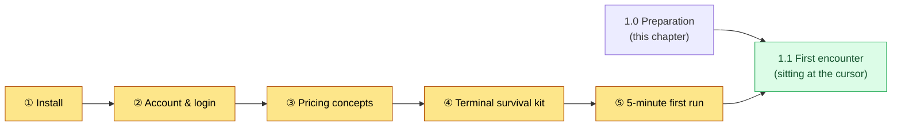
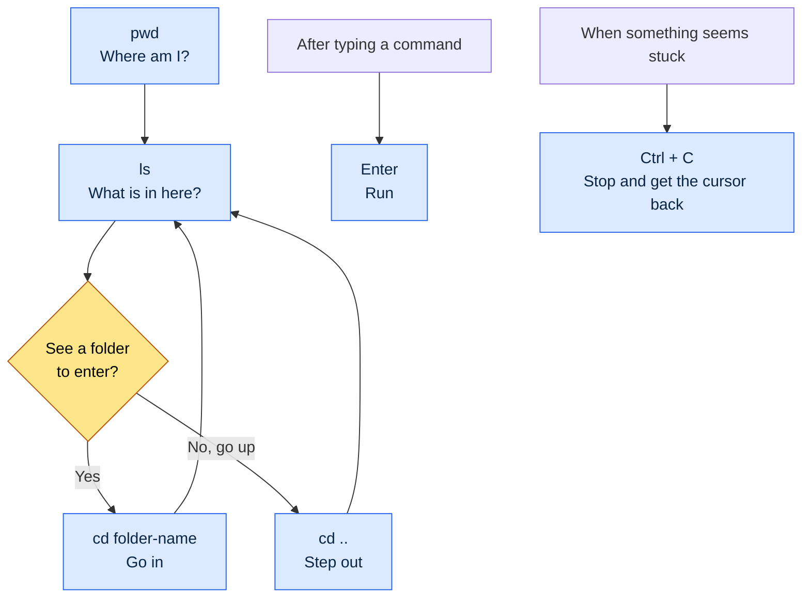
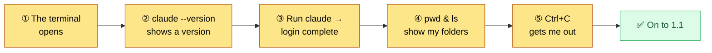

# 1.0 Before You Start — Install, Account, Pricing, and the Terminal Survival Kit

Section 1.1 is the "first encounter." It is where you sit down in front of a blinking cursor and try typing something. But before you can take that seat, a few things need to be in place. The tool has to be installed, you have to be logged in, you should roughly know how the billing works, and you need to be able to type a few characters into a black screen. This chapter sits one step before 1.1.

Most introductory books skip this stage. They write a single line — "open your terminal" — and move on. But that single line is exactly where beginners get stuck. Where is the terminal? What do I need to install? What do I do when red text appears mid-install? Someone who stalls on the first line never reaches 1.1. This chapter has exactly one goal: making sure you do not get stuck on the first line.

The chapter has five parts: installation, account and login, pricing concepts, a terminal survival kit, and a "5-minute first run" checklist. Follow them in order and you will be ready to take the seat in 1.1.



---

## 1.0.1 Install — One Line per OS

For installation, the rule is to follow the official instructions. Tools change often, and installer files from unofficial sources are dangerous. So this book does not print download links; instead, it shows you how to find the official path. Type "Claude Code official docs" or "Claude Code install" into a search engine and Anthropic's official documentation page comes up first. The safest move is to use the install command from that page exactly as written.

Still, it helps to know the big picture. Claude Code — this book uses the official English name throughout — is a tool that runs in the terminal, and it usually installs with a single one-line command. The flow differs slightly by OS.

| OS | What you need | Install flow (conceptually) |
|---|---|---|
| Windows | PowerShell (built in) | Paste the one-line install command from the official docs into PowerShell |
| macOS | Terminal (built in) | Paste the one-line install command from the official docs into the terminal |
| Linux | Terminal | Paste the one-line install command from the official docs into the terminal |

The flow is the same on all three: open the terminal → paste the one line from the official docs → press Enter. There is no need to memorize commands. Copying and pasting from the official docs is the standard way.

If red text (an error) appears during installation, do not panic. The install errors beginners run into are almost always one of two things: a permissions problem, or a missing prerequisite tool (a runtime like Node.js, for example). If red text appears, copy the whole message verbatim and search for it, or ask an AI — nine times out of ten that solves it. An error message is not an enemy; it is a clue.

> How to check whether the install worked: type `claude --version` in the terminal and press Enter. If a version number appears on one line, the install succeeded. If you get something like "command not found," either it is not installed yet or you need to open a fresh terminal. Close the terminal completely, open it again, and check once more.

---

## 1.0.2 Account and Login

Finishing the install does not mean you can use it right away. Claude Code is a tool that borrows Anthropic's AI models, so there is a login step to confirm who is using it.

The flow is simple. Run `claude` in the terminal for the first time and a login prompt appears. Usually a web browser opens automatically, and you log in there with an Anthropic account (if you do not have one, you can create one on that screen). When the login finishes, the browser shows something like "you can return to the terminal now," and the terminal side shows a completion message as well.

Two spots trip up beginners here.

First, the browser may not open automatically. In that case the terminal prints a long address (URL) on one line. Copy that address, paste it into your browser's address bar, and go. You are not blocked — you just do one extra step manually.

Second, account types can be confusing. How the account you used in the web chat (Claude.ai) connects to Claude Code's account and billing may differ depending on the policy at the time. The most accurate guides are the login screen itself and the official docs. Follow what the first-run screen tells you and the login usually goes through without trouble.

Once you have logged in, it stays logged in on that PC. There is no need to do it every time.

---

## 1.0.3 Pricing Concepts — Flat-Rate Subscription vs. Pay-As-You-Go API

The part beginners worry about most is "how much is this going to cost?" There is a vague fear that every character you type adds to the bill. Getting the big picture first shrinks that fear. Billing comes in two broad flavors.

| Method | How you are charged | Analogy | Who it is for |
|---|---|---|---|
| Flat-rate subscription | Fixed monthly amount | A flat-rate phone plan | Beginners, everyday use |
| Pay-as-you-go API | By usage (per token) | An electricity meter | Bulk work, automation, integrations |

A **flat-rate subscription** means paying a fixed monthly amount and using the tool up to a limit. It is like a flat-rate mobile plan. The same amount goes out every month, so it is predictable, and you do not have to think about "how much does each line cost." That is why beginners usually find it easier on the nerves to start with a flat-rate subscription (author's estimate — exact plan tiers and limits change over time, so check the official pricing page). If you hit the limit, you wait for the next cycle or move up to a higher plan.

**Pay-as-you-go API** billing charges in proportion to actual usage (tokens). Like an electricity meter, you are billed for what you use. It suits bulk processing, automation pipelines, and integration with other programs. Used with care it is efficient, but at the beginner stage, before you have a feel for your usage, costs can be hard to predict.

What a token is and why billing is based on it is covered in detail in 1.2 (AI models, tokens, and the harness). For now, remember just one thing: **beginners usually start with a flat-rate subscription.** The monthly amount is fixed, so you can practice without the fear of "what if I get hit with a surprise bill." Plan names, prices, and limits change often, so this book does not print specific numbers. The contents of this book were written as of mid-2026, and pricing, models, and features keep changing after that. The official pricing page is the most accurate source for current values.

> One-line summary: the fear that money drains every time you type → with a flat-rate subscription, it is fixed every month. Starting with flat-rate keeps a beginner's mind at ease.

---

## 1.0.4 Terminal Survival Kit — Making the Black Screen Less Scary

Now for the biggest wall: the black screen. This is why 1.1 opens with "you freeze in front of the blinking cursor." To hands that have worked in GUIs for 24 years, the terminal feels foreign. But the number of commands you need so you do not stall on the first line is small. The six below are enough.

| Command | Read as | What it does | Analogy |
|---|---|---|---|
| `pwd` | "p-w-d" | Shows which folder you are in right now | "Where am I?" |
| `ls` | "l-s" | Lists what is inside the current folder | Opening a folder window |
| `cd 폴더이름` | "c-d" | Moves into that folder (`폴더이름` is Korean for "folder name" — replace it with the actual folder name) | Double-clicking a folder |
| `cd ..` | "c-d dot-dot" | Moves up one folder level | The Back button |
| `Enter` | "enter" | Runs the command you typed | The OK button |
| `Ctrl + C` | "control-c" | Stops whatever is running right now | The Stop button |

(Windows PowerShell accepts `ls`, `cd`, and `pwd` as-is. So do macOS and Linux. That is why these six work regardless of OS.)

Here is what these six do, as a picture. Moving around in the terminal is ultimately just stepping in and out of folders — the same motion as double-clicking a folder or going back in a GUI.



The real reason the black screen feels scary is the sense that "one wrong keystroke will break something." But none of the six commands above breaks anything. `pwd`, `ls`, and `cd` only look or move; they never delete or change files. `Enter` only runs, and `Ctrl + C` only stops. So feel free to type these six anytime, with peace of mind.

Sometimes the screen looks frozen. You typed a command and nothing happens for a while, or the cursor blinks on a different line as if waiting for something more. Press `Ctrl + C` once and you usually get the original prompt back. Just knowing this "stop button" exists makes the black screen far less scary. If you get stuck, escape with `Ctrl + C` and start again.

Finally, when typed characters pile up and the screen gets noisy, you can clear it. Windows PowerShell, macOS, and Linux all clear the screen with the `clear` command. Clearing does not undo anything you did; it only tidies up what is visible.

---

## 1.0.5 The "5-Minute First Run" Checklist

If you have come this far, the preparation is done. Pass the five boxes below within 5 minutes and you have earned the seat in 1.1. If any box blocks you, go back to the matching section (1.0.1–1.0.4).



- [ ] ① I can open a terminal (Windows: PowerShell / macOS: Terminal)
- [ ] ② Typing `claude --version` shows a version number on one line (install confirmed)
- [ ] ③ Running `claude` shows I am logged in (or I completed the login by following the prompts)
- [ ] ④ I can see my current location with `pwd` and the folder contents with `ls`
- [ ] ⑤ When something hangs, I can get out with `Ctrl + C`

With all five boxes checked, the black screen is no longer an unknown wall. The tool is installed, you are logged in, you know the big picture of how billing works, and you can move around the screen and stop things. 1.1 starts on top of this preparation. Go take the seat in front of the blinking cursor and, for the first time, type "summarize what's in this folder."

---

## 1.0.6 Python and pip — To Run the Tools (Only When Needed)

The early parts of this book (Parts 1 and 2) can be followed with natural-language prompts alone. From Part 4 on, however, some chapters run small Python scripts directly (e.g., `pip install pyyaml`, `pip install pyvis`). If Python is new to you, that is fine. There are two paths.


First, **install it yourself.** Download Python from python.org and install it (be sure to check "Add to PATH" on the install screen), then confirm with `python --version` in the terminal. `pip` is the package installer that ships with Python; you fetch the packages you need with one line, like `pip install pyyaml`.

Second, **let the AI handle it (recommended).** The easier path is to delegate the environment setup itself to the AI. Ask in the terminal like this.

```
Check whether Python is installed, and if not, tell me how to install it for my OS.
Then give me a one-line command to install the pyyaml package this chapter needs.
```

(The prompt above, kept in the original Korean, says: "Check whether Python is installed, and if not, tell me how to install it for my OS. Then give me a one-line command to install the pyyaml package this chapter needs.")

The AI inspects your environment and produces the install commands for you. If you get stuck, paste the error message right there and ask "how do I fix this error?" One round of this pattern per tool-running chapter is enough. At any stage where Python and pip feel like too much, that chapter's "Solo Scale-Down" shows a lighter path that goes without code.

---

### Next Chapter Preview
- 1.1 A Game Designer's First Encounter with Claude Code — Sitting at the Cursor and Surviving the First 30 Minutes

---

## Try It Yourself

**setup**
1. Open the terminal for your OS (Windows: PowerShell, macOS: Terminal).
2. Search for "Claude Code official docs" and keep the official install page open.
3. Set a timer for 5 minutes — the goal is to pass the five boxes of the 1.0.5 checklist.

**prompt** (type one line at a time, in order — these are commands, not natural-language questions; the Korean comments say: ① version shown = install succeeded, ② which folder am I in, ③ what is in this folder, ④ go up one level (then `ls` again), ⑤ run Claude Code (follow the login prompts if they appear))
```
① claude --version      # version shown = install succeeded
② pwd                   # which folder am I in
③ ls                    # what is in this folder
④ cd ..                 # go up one level (then ls again)
⑤ claude                # run Claude Code (follow the login prompts if they appear)
```

**verify**
- If ① shows a version number on one line, the install is done. If you get "command not found," close the terminal, open it again, and try once more.
- While looking around and moving with ②, ③, and ④, confirm for yourself that nothing breaks. These three are safe commands that only look and move.
- If ⑤ seems to hang, get out with `Ctrl + C`. If you got out, you have confirmed with your own hands that "there is a stop button."

### Solo Scale-Down

If you are an individual with no team and no company folders, start by learning just the install (①) and escaping with `Ctrl + C`. Confirm "the tool is installed" with `claude --version` and "I can get out even when stuck" with `Ctrl + C`, and half the fear of the black screen is settled on your own within 5 minutes. For pricing, start with a flat-rate subscription and you can practice as much as you like without worrying about cost.
