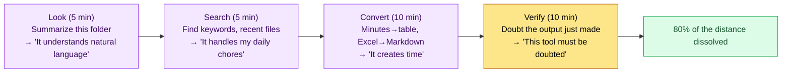

# 1.1 A Game Designer's First Encounter with Claude Code

A black screen comes up. The cursor blinks. In front of it sits a game designer with 24 years in the industry. Hands that have spent 24 years working in PowerPoint and Excel, wikis and Figma, pause for a moment over the keyboard. It looks a little like DOS, from the days of after-school computer classes. Since then, a terminal was something you only ever saw on a programmer's desk. I don't know what to type, and it feels like typing the wrong thing will break something. That hesitation is where this book begins.

Most people close the window right there. Then, in the next meeting, they go back to repeating "we really should be doing something with this." This chapter sits with you through the first 30 minutes without closing that window. The goal is not a grand adoption strategy — it is to put into your hands what to type at that blinking cursor so the distance starts to dissolve.

---

When a game designer first sits down in front of an AI coding tool like Claude Code, fascination and discomfort arise at the same time, in the same seat. The fact that these two feelings collide is itself the first clue to adoption.

The fascination has clear reasons. A data-sheet consistency check that used to eat half a day finishes in minutes; sprawling meeting minutes get summarized into a table of decisions; a game design document (GDD) buried a year ago can be pulled back up with one line of natural language.

The discomfort has equally clear reasons. The black screen, the blinking cursor, the English commands — none of it looks like the everyday workspace. A game designer's day flows on top of GUIs, and typing characters into a black terminal does not sit well with the job's identity. But this discomfort is not a defect in the tool; it is the adaptation cost of a person used to GUIs. Just acknowledging that point clears half the distance already.

This book is about closing that distance. Section 1.1 sits with you at the first encounter and sorts out what to look at, what to try, and what can safely wait.

---

## 1.1.1 Why Now, and Why Game Designers Should Use AI

Game design joined the AI wave later than other roles. People who handle code went first; artists and visual designers came next. Game designers commonly fell into the pattern of repeating "we should try something" while putting it off.

The reasons for putting it off were rational. A game designer's output is not structured the way code is; it is a mix of text, tables, diagrams, meetings, and verbal agreements. AI output looked unreliable, plausible lies were dangerous, and it was doubtful whether AI really understood game systems.

But between 2024 and 2026, three things changed.

First, the reasoning ability of AI models crossed a threshold. They go beyond simple sentence generation to handle complex system design, consistency verification, and impact analysis. Recent Claude-family models can assist with a substantial share of a game design workflow. That does not mean you can hand all of it over: verification and responsibility still belong to humans. (How wide the assistance goes varies greatly by task type and team maturity — author's estimate, unverified.)

Second, the harness matured. A tool like Claude Code is not simple chat. It reads and writes files directly, runs commands, and takes the results back as input. It resembles the way a person works.

Third, operational techniques like memory, atoms, and skills have settled in. Instead of using AI once and throwing the session away, there is now a methodology for accumulating a team's knowledge so the system gets smarter over time. That accumulation is exactly what the later parts of this book cover.

Put these three together, and this becomes a rational moment for game designers, too, to adopt AI. It pays to start before falling further behind.

---

## 1.1.2 What Claude Code Is — How It Differs from Other Tools

The AI tools a game designer usually encounters come in two kinds: chatbot-style tools where you type questions into a chat window (ChatGPT, the Claude web app), and editor-integrated tools that autocomplete inside a code editor (Cursor, Copilot).

Claude Code is a third kind. It runs in the CLI (terminal) and has access to the entire environment a person works in. Here, on one page, is where the three kinds diverge.

<svg viewBox="0 0 720 300" xmlns="http://www.w3.org/2000/svg" font-family="sans-serif" font-size="13">
  <rect x="0" y="0" width="720" height="300" fill="#fafafa" stroke="#ddd"/>
  <!-- column headers -->
  <rect x="200" y="10" width="160" height="34" fill="#eef2f7" stroke="#bbb"/>
  <text x="280" y="32" text-anchor="middle" font-weight="bold">Chatbot</text>
  <rect x="360" y="10" width="160" height="34" fill="#eef2f7" stroke="#bbb"/>
  <text x="440" y="32" text-anchor="middle" font-weight="bold">Editor-integrated</text>
  <rect x="520" y="10" width="180" height="34" fill="#e8f0e6" stroke="#9bbf8f"/>
  <text x="610" y="32" text-anchor="middle" font-weight="bold">Claude Code</text>
  <!-- rows -->
  <text x="10" y="68" font-weight="bold">Input location</text>
  <text x="280" y="68" text-anchor="middle">Web chat window</text>
  <text x="440" y="68" text-anchor="middle">Code editor</text>
  <text x="610" y="68" text-anchor="middle" font-weight="bold">Terminal</text>
  <line x1="10" y1="80" x2="700" y2="80" stroke="#e0e0e0"/>
  <text x="10" y="108" font-weight="bold">File access</text>
  <text x="280" y="108" text-anchor="middle">Upload required</text>
  <text x="440" y="108" text-anchor="middle">Open files</text>
  <text x="610" y="108" text-anchor="middle" font-weight="bold">Entire project</text>
  <line x1="10" y1="120" x2="700" y2="120" stroke="#e0e0e0"/>
  <text x="10" y="148" font-weight="bold">Command execution</text>
  <text x="280" y="148" text-anchor="middle">Not possible</text>
  <text x="440" y="148" text-anchor="middle">Partial</text>
  <text x="610" y="148" text-anchor="middle" font-weight="bold">Free (within permissions)</text>
  <line x1="10" y1="160" x2="700" y2="160" stroke="#e0e0e0"/>
  <text x="10" y="188" font-weight="bold">Output form</text>
  <text x="280" y="188" text-anchor="middle">Text</text>
  <text x="440" y="188" text-anchor="middle">Code suggestions</text>
  <text x="610" y="188" text-anchor="middle" font-weight="bold">File changes &amp; run results</text>
  <line x1="10" y1="200" x2="700" y2="200" stroke="#e0e0e0"/>
  <text x="10" y="228" font-weight="bold">Design-work fit</text>
  <text x="280" y="228" text-anchor="middle">Low</text>
  <text x="440" y="228" text-anchor="middle">Low</text>
  <text x="610" y="228" text-anchor="middle" font-weight="bold" fill="#3a7a2f">High</text>
  <line x1="10" y1="240" x2="700" y2="240" stroke="#e0e0e0"/>
  <text x="10" y="270" font-weight="bold">Analogy</text>
  <text x="280" y="270" text-anchor="middle">Front desk</text>
  <text x="440" y="270" text-anchor="middle">Autocomplete pen</text>
  <text x="610" y="270" text-anchor="middle" font-weight="bold">Next-desk colleague</text>
</svg>

A game designer's work is not code; it is documents, tables, and relationships. Claude Code's strength is that it sees, understands, and manipulates the entire folder a person works in. You do not have to copy and paste material into a chat window every time, the way you do with a chatbot.

In office terms, the chatbot is the front desk. One question, one answer, and you have to bring your materials out again every time. Claude Code is closer to the colleague at the next desk. It knows where the materials are, opens the files with its own hands, and puts the organized result back on your desk. The same Claude does different things well depending on which desk you seat it at.

---

## 1.1.3 The First 30 Minutes — What to Look at, What to Try

Installation and setup are covered in 1.0. Section 1.1 focuses on what to experience in the first 30 minutes to shrink the distance. The first 30 minutes split into four segments, and each segment dissolves another piece of the distance, step by step.



### The First 5 Minutes — Look

Open a terminal and run Claude Code: a black screen appears and the cursor blinks. Many people stop right here, but stopping means missing the first chance to dissolve the distance. Type one sentence in natural language.

```
Summarize what's in this folder
```

One sentence — "Summarize what's in this folder" — neither code nor a command. Claude Code scans the folder structure and answers with a summary of what files are there and what kind of project this appears to be. Type this one line in a folder of design documents and a response comes back roughly like this.

```text
> Summarize what's in this folder

I scanned this folder. It looks like a working folder for game data and design documents.

  File type        Count   Estimated contents
  ─────────────   ────    ───────────────────────────
  .xlsm            12     Data sheets (items, quests, NPCs, etc.)
  .md              34     Design docs and meeting-minute drafts
  .png             88     UI mockups and reference images
  Subfolders        6     /data /docs /ref /meeting /export /tmp

Observations:
  - The /meeting folder has 5 meeting minutes from the past week piled up.
  - item_table.xlsm and quest_table.xlsm appear to share the same
    ID column (an FK candidate).
  - The /tmp folder holds many temporary export files — possible cleanup targets.

What would you like to look at first?
```

(The response, in short: it scanned the folder, identified it as a game-data and design-doc workspace, tabulated the file types — 12 .xlsm data sheets, 34 .md docs and minutes, 88 .png mockups, 6 subfolders — then observed that five recent meeting minutes have piled up, that item_table.xlsm and quest_table.xlsm appear to share an ID column (an FK candidate), and that /tmp holds stray export files; it ends by asking what to look at first.)

From this single response, the fact that this tool understands natural language, not commands, sinks in physically. Receiving an organized picture of what is where, without opening the folder yourself, cuts half the distance on the spot.

### The Next 5 Minutes — Search

Give it a small search. Requests like "show me the 5 Markdown files modified in the last week," or "where are the files that mention the word 'reward'?" The work a game designer used to do daily — opening Find in Files, typing a keyword, scrolling through results — Claude Code takes in natural language and returns organized. The sense that this tool handles your daily chores settles in during the second five minutes.

### The Next 10 Minutes — Convert

Give it a small conversion. Requests like "extract only the decisions from these meeting minutes into a table," or "turn rows 1–10 of this Excel sheet into a Markdown table." A conversion that takes 5–10 minutes by hand getting done in moments turns the earlier sense — the tool replaces search — into a new one: the tool creates time.

### The Last 10 Minutes — Verify

Stopping here is dangerous, because AI tells plausible lies. Make it doubt the output it just produced.

```
Check again whether the table you just made matches the original. Anything missing?
```

The prompt says: "Check again whether the table you just made matches the original. Anything missing?" Claude Code then rereads the original, compares it line by line against its own output, and reports the mismatches. In practice, this segment often produces a screen like this.

```text
> Check again whether the table you just made matches the original. Anything missing?

I re-checked the original (meeting_0603.md) against the table I just made.
I found 3 mismatches.

  ⚠ Omitted    "Tutorial reward cut by 50%" — in line 12 of the original but missing from the table
  ⚠ Mistyped   Owner "Kim OO" → entered in the table incorrectly as "Lee OO"
  ⚠ Ambiguous  "Rediscuss rewards" — unclear in the source whether it is a decision or a hold.
               I placed it under 'decided' on my own judgment; it needs confirmation.

Shall I rebuild the corrected table? Tell me how to handle
the ambiguous item and I will reflect it.
```

(In short, it found 3 mismatches: an omission — "tutorial reward cut by 50%" is in line 12 of the original but missing from the table; a wrong entry — owner "Kim OO" mistyped as "Lee OO"; and an ambiguity — "rediscuss rewards" is unclear in the source as decision or hold; the AI says it placed it under 'decided' on its own judgment and asks for confirmation, offering to rebuild the table.)

The point of the last 10 minutes is that the tool knows how to doubt its own output — and that it does the doubting together with a person. The attitude in that third item, asking back "I made a judgment call here, please confirm," is the safeguard that keeps verification in human hands.

After 30 minutes, 80% of the distance is gone. The remaining 20% shrinks slowly across the chapters that follow.

---

## 1.1.4 Scenes from the Office — Six Months on a Mid-Size Team

On an MMORPG project I run as design director (hereafter "Project A"), the design team (4–5 people) has been running a Claude Code–centered workflow for about six months (Project A's full development team is mid-size, 10–50 people). Here are a few of the scenes.

Let me pull out the single most tangible case as an actual measurement: FK (foreign key) consistency checks across 30-odd data sheets. The task is tracing, by eye, whether the IDs in one sheet are referenced correctly in the others — and as sheets multiply, the combinations grow at a compounding rate.

- **Before**: One designer opens the sheets in turn and cross-checks IDs. One full pass over the 30-odd sheets takes half a day (about 4 hours). When focus breaks midway, rows get missed.
- **After**: A relation-detection tool cross-checks FKs between sheets automatically and outputs only the broken references as a list. One pass takes about 5 minutes.

Half a day to 5 minutes. I will not generalize from this one line. Other tasks save less, or pick up new review time instead. The other scenes from the same six months I record only as directions and ratios.

- Decision extraction from meeting minutes (5–10 items accumulating per week): work a person used to track by searching and scrolling → an automatically extracted table. The tracking burden nearly disappeared.
- GDD drafts: writing time fell to less than half, while review and polish time grew. The total goes down, but the work's center of gravity shifts from 'writing' to 'judgment.'
- Data-sheet relationship maps: a dependency structure repeatedly explained out loud in meetings → generated once as interactive HTML and shared.

My felt sense is that once each of these tools was built, the time it saved over six months accumulates in person-months, not person-weeks (the exact total is unmeasured — an estimate). That time went into deeper design work.

A tool like this works for a long time once built. But 'long' does not mean 'unattended.' It lasts only when an operator and a verification structure come with it; leave the tool in place and let the person walk away, and it rots within two quarters. The later parts of this book cover how each of the tools above gets built and operated.

---

## 1.1.5 Fears and Expectations — Dealt with Honestly

Let's be honest about the fears game designers commonly bring to an AI tool. Facing them instead of looking away is the first step of adoption.

The fear that "AI will replace my job" is half right and half wrong. AI does replace the simple chores — consistency checks, document conversion, search — but it cannot replace decisions, priorities, or the design of player emotion. If anything, the game designer who uses AI well is freed from chores to focus on the essentials. Ask yourself: "In my job, what is the ratio of chores to essence?" If chores are 70%, the 30% of essence stays yours — and the point is that that 30% becomes more important.

The question "who takes responsibility when AI is wrong" comes up just as often. Responsibility for a game designer's decisions always belongs to the game designer. Using AI output as-is without verification is the designer's mistake, not the AI's. Designing the verification procedure alongside the tool is part of adoption. The 'make it doubt its own output' move from the last 10 minutes of 1.1.3 is the smallest seed of that procedure.

The fear "I can't use it because I don't know code well" resolves quickly. Claude Code runs on natural language, so you can start without knowing code, exactly as you are. Because you read the scripts the AI writes together with it, after a few months you find yourself reading and modifying simple scripts. The learning comes along on its own.

"The tools change too fast" is another common worry. Trying to keep up with every model, feature, and trend wears you out. Learn only the one or two features that help your own workflow in depth, and look at the rest when you need it.

One thing to say in advance: even if the response screens in 1.1.3 looked smooth, the real first 30 minutes will mix in answers that miss, summaries of the wrong files, and output that stalls. That is normal. This book is not a smooth success story; it spends more pages on how to re-ask and correct output that went wrong.

---

## 1.1.6 How to Use This Book

This book is organized into 24 parts. You do not have to read it front to back. Pick whichever of the three patterns below fits your situation.

| Pattern | Path | Time |
|---|---|---|
| Adoption pattern | Part 1 (adoption) → Part 2 (information architecture) → 1 part for your own field | 1–2 months |
| Full pattern | Parts 1–2 → field parts (3–15) → process (16–19) → operations (20–24) | 6 months–1 year; suited to teams |
| Problem-solving pattern | Appendix index → backward to the relevant chapter | about 1 week, when you have a problem right now |

If you have no idea which path to pick, split by where you stand. **If you work outside games — in a planning or product role, as a PM, or as a general office professional** — instead of the three patterns above I recommend the "General-Role Path" (Parts 1–2 → Part 17 meeting minutes → Part 16 collaboration → Part 18 decision-making → Parts 21–22 self-improvement and governance) — the core skeleton stands intact even when you skip the game-domain chapters, and each chapter's "Beyond Games" box is the bridge for carrying it over to your own role (index in Appendix F.5). If you are short on time, following just four chapters — 17.1 → 16.2 → 22.1 → 21.1 — is enough. **If you are a non-technical reader just starting out with AI tools**, take the 'adoption pattern,' hold on to one field (your own, or the closest one) all the way through, and for the deeper field parts (4, 8, 11, and the like) just pick up the 'one line for non-specialists' at the start of each, going down into the body only when needed.

Every chapter in this book stops short of academic depth, at the level you can actually operate. The goal is to carry over, as-is, techniques that really ran for six months on a mid-size team, and to walk together the path of starting small and growing big.

---

## 1.1.7 Into the Next Chapter

1.1 was a chapter about shrinking the distance. 1.2 steps one level inside and explains the tool's basic mechanisms in language friendly to game designers. The goal of 1.2 is to make words like model, token, context, and harness nothing to fear. The full setup (memory, permissions, settings.json) comes in 1.3.

---

### Key Takeaways
- The distance you feel at the first encounter is not a tool defect; it is the adaptation cost of someone used to GUIs
- Claude Code is not a chatbot; it is closer to a colleague at the next desk who handles your entire folder
- Run through the first 30 minutes — look, search, convert, verify — once each, and 80% of the distance disappears

### Next Chapter Preview
- Chapter 2. AI Models, Tokens, and the Harness — Basic Mechanisms for Game Designers

---

## Try It Yourself

**setup**
1. Open a terminal (PowerShell on Windows, Terminal on macOS).
2. Move into a folder where your design documents live, then run Claude Code (installation: 1.0).
3. Set a timer for 30 minutes — 5 min (look), 5 min (search), 10 min (convert), 10 min (verify).

**prompt** (one line per segment, in order)
```
① Summarize what's in this folder
② Where are the files that mention the word 'reward'?
③ Extract only the decisions from these minutes into a table
④ Check again whether the table you just made matches the original. Anything missing?
```

(In order: ① "Summarize what's in this folder" ② "Where are the files that mention the word 'reward'?" ③ "Extract only the decisions from these minutes into a table" ④ "Check again whether the table you just made matches the original. Anything missing?")

**verify**
- For ①, check with your own eyes that the folder summary matches the actual folder.
- If ④ reports even one mismatch, that is a success. It means you watched the AI doubt its own output, live.
- An answer that misses is not a failure either. Re-asking — "that answer was wrong, look at just this file again" — is part of the first 30 minutes of practice.

### Solo Scale-Down

If you have no team and no company folder, pick any working folder on your own PC (say, your Downloads folder, or a notes folder) and try just prompts ① and ④ above. Confirm "it understands natural language" with ① and "it can doubt its own output" with ④, and you will have felt this chapter's two core points by yourself, within 5 minutes.
