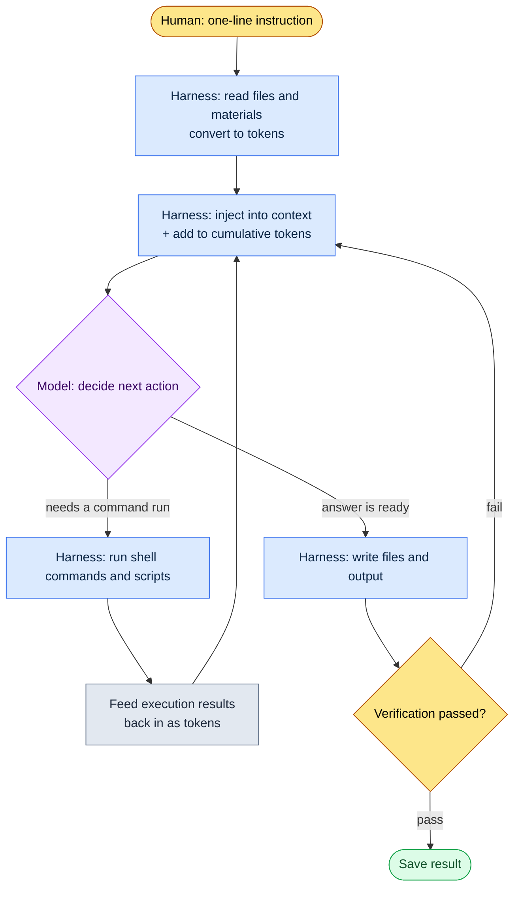

# 1.2 Model, Token, Harness — The Path a Task's Tokens Travel

It starts the moment I finish a task and look at the usage. Five meeting notes from this week have piled up in a folder, and before Monday morning's stand-up I have to distill them into a single page of "only what was decided." I type one line into the Claude Code window: "Pull only the decisions from the meeting notes in this folder and make them into a table." About 0.4 seconds after I press Enter, small gray text flickers near the bottom of the screen.

```
Reading meeting-2026-05-25.md ... (1,840 tokens)
Reading meeting-2026-05-27.md ... (2,310 tokens)
```

That gray text is the subject of this chapter. I toss in a single sentence in Korean; the tool chops it into tokens, reads files into tokens and feeds them to the model, takes the model's answer, and writes it to a file. Every time this round trip runs, a cost is charged, and material piles up in the model's "field of view." This chapter breaks down what happens behind that gray text in a game designer's language. Four words are enough: model, token, context, harness.

> **Terminology Notes**
> - Model: the brain that produces answers. It comes in kinds with different sizes and characters, such as Opus, Sonnet, and Haiku.
> - Token: a small chunk of chopped-up text. Billing, speed, and the model's field of view are all counted in this unit.
> - Context window: the maximum number of tokens the model can hold in its head at once.
> - Harness: the chassis that puts the model to work. Claude Code is one example.

---

## 1.2.1 The Harness Loop — What That Gray Text Really Is

The gray text above is not random logging; it is one box in a fixed cycle. What a harness does, in the end, is spin the same loop fast. It reads files and feeds them to the model; when the model says "run this command," it runs it; and it feeds the result back to the model. The loop keeps spinning until the task is done.



In this diagram, the only boxes a human touches are the top one (instruction) and the bottom one (checking the verification result); the loop in the middle runs autonomously under the harness. The gray text flickered five times while the five meeting notes were being read because the `Read → Inject` boxes ran five laps. In a web chat, I would have had to open five files myself and copy-paste them. The harness takes over that labor — and that is the decisive difference that makes a chatbot and a CLI-style harness different tools.

Each lap of the loop adds to the cumulative token count in the `Inject` box. So without understanding tokens first, neither the cost nor the limits of this loop come into view. Tokens first.

---

## 1.2.2 Tokens — The Real Currency a Task Spends

A token is not a character; it is a chunk the model cuts text into. As a rule of thumb, English runs at about 4 characters per token and Korean at about 2 characters per token (this is an operational approximation, not an official conversion — the actual value is set by the model's tokenizer and varies by sentence). Twenty Korean characters including spaces come to roughly 10 tokens.

Let me follow that meeting-notes task in tokens (the figures below are a single measurement of one run of this task; they vary with the length of the notes and the summary, so read them for orders of magnitude and ratios, not as absolute values).

| Step | What | Tokens (input) | Tokens (output) |
|---|---|---|---|
| Instruction | The one line "pull only the decisions into a table" | \~25 | — |
| Reading notes ×5 | Body of 5 md files | \~10,400 | — |
| Classification rule injection | 1 meeting-category atom (JIT) | \~480 | — |
| Model reasoning, table writing | 12 decisions into a table | — | \~1,600 |
| Verification re-entry | Re-query for 1 omission the linter caught | \~320 | \~210 |
| **Total** | | **\~11,225** | **\~1,810** |

Two things stand out. First, the instruction I typed is 25 tokens, but the task as a whole tops 11,000 tokens of input alone. Almost all of the cost comes not from my sentence but from the material the tool read in. Second, output (1,810) is about one-sixth of input (11,225). Most design automation reads a lot and writes a little, just like this. So if you want to cut costs, taming the volume of input material works far better than polishing the output.

After the task ends, typing `/context` shows how much of the context that session occupied. Unwatched, tokens drain away as unconsciously as printer paper; once made visible, your posture changes. That visibility is where saving starts.

What tames tokens is not an abstract spirit of thrift but concrete techniques for handling input material in small pieces.

1. **JIT injection** — JIT (just-in-time): instead of loading all material up front, pull it in by keyword matching only when needed. The "\~480 tokens of classification rule injection" in the table above is an example. What came in was not the entire meeting-classification rulebook (thousands of tokens) but the single matched atom.
2. **Summary cache** — for long documents, keep an AI-facing summary separate from the human-facing original. The AI reads the summary.
3. **Atom splitting** — keep one decision per file (details in 2.2) and you can pull in exactly the pieces you need, saving tokens.
4. **Context cleanup** — compact when a session runs long. Claude Code supports automatic compaction.
5. **Model selection** — running a simple conversion on a big model makes the same tokens cost more. That is the next section's topic.

Of these, #1, JIT injection, is a device that actually runs in this book's working environment. When a line of input comes in, the `inject_memory.py` hook matches memory atoms by score, picks only the top few to inject, and never blocks the workflow even when it fails (implementation details in 1.3). The token-saving principle — "only the needed material, only the top few, fail quietly" — sits in that one file of code, as is.

---

## 1.2.3 Models — Same Chassis, Different Engines

A model is like a car engine: into the same chassis called Claude Code, you can fit different engines — Opus, Sonnet, Haiku. Swap the engine and the character of the work changes.

<svg viewBox="0 0 640 230" xmlns="http://www.w3.org/2000/svg" font-family="sans-serif" font-size="13">
  <rect x="0" y="0" width="640" height="230" fill="#fafafa" stroke="#ddd"/>
  <text x="20" y="28" font-size="15" font-weight="bold">Model Matching — Depth vs Speed &amp; Cost</text>
  <!-- axes -->
  <line x1="80" y1="190" x2="600" y2="190" stroke="#888" stroke-width="1.5"/>
  <line x1="80" y1="190" x2="80" y2="55" stroke="#888" stroke-width="1.5"/>
  <text x="600" y="224" text-anchor="end" fill="#555">→ Speed · low cost</text>
  <text x="76" y="50" text-anchor="end" fill="#555">Reasoning depth ↑</text>
  <!-- Opus -->
  <circle cx="150" cy="80" r="34" fill="#7b4fbf" opacity="0.85"/>
  <text x="150" y="78" text-anchor="middle" fill="#fff" font-weight="bold">Opus</text>
  <text x="150" y="94" text-anchor="middle" fill="#fff" font-size="11">Large engine</text>
  <text x="150" y="138" text-anchor="middle" fill="#444" font-size="11">Design review · GDD synthesis</text>
  <!-- Sonnet -->
  <circle cx="330" cy="120" r="34" fill="#3a86c8" opacity="0.85"/>
  <text x="330" y="118" text-anchor="middle" fill="#fff" font-weight="bold">Sonnet</text>
  <text x="330" y="134" text-anchor="middle" fill="#fff" font-size="11">Mid-size engine</text>
  <text x="330" y="170" text-anchor="middle" fill="#444" font-size="11">Meeting notes · daily 80%</text>
  <!-- Haiku -->
  <circle cx="510" cy="155" r="34" fill="#2a9d6f" opacity="0.85"/>
  <text x="510" y="153" text-anchor="middle" fill="#fff" font-weight="bold">Haiku</text>
  <text x="510" y="169" text-anchor="middle" fill="#fff" font-size="11">Compact</text>
  <text x="510" y="205" text-anchor="middle" fill="#444" font-size="11">Simple sheet conversion</text>
</svg>

Mapped onto design work, it splits like this. Work that needs deep reasoning and consistency — reviewing a system design, or synthesizing a first draft of a game design document (GDD, the detailed spec) that pulls multiple sources together — goes to Opus. The everyday majority, like extracting decisions from meeting notes or writing daily summaries, goes to Sonnet. Work involving almost no judgment, like simple format conversion of data sheets, goes to Haiku. Running the earlier meeting-notes task on Sonnet followed this rule — picking out decisions and moving them into a table calls for balance and speed more than deep reasoning.

There is a trap everyone falls into early on: the urge to run every task on the best engine, Opus. Follow that urge, and the cost and speed load comes back as an operational burden, and the sense of matching the model to the task never takes root. The real skill of operation is not picking a model in your head every time, but hardening the pattern into automation once it has settled.

- Daily retrospective writing → automatically Sonnet
- System design review → automatically Opus
- Data sheet consistency check → automatically Haiku

These fixed choices are spelled out in settings.json or inside slash commands (details in 1.3). Harden them once, and the chore of choosing every time disappears.

Models ship a new version roughly every half year, and even under the same name, 4.5 and 4.6 are different. When a new version lands, I compare only the five core tasks of my workflow on identical inputs. Try to test everything and you wear out. The differences across five results are enough to decide whether to switch.

---

## 1.2.4 The Context Window — The Ceiling the Loop Fills Toward

I said tokens accumulate in the `Inject` box with every lap of the loop. The ceiling that accumulation runs into is the context window: the maximum number of tokens the model can handle at once. In human terms, it is working memory.

- Claude 4 family: 200K tokens standard, with a 1M-token extended option
- 200K tokens ≈ roughly 400 A4 pages of Korean text

The earlier meeting-notes task accumulated input in the 11,000-token range — about 6% of the 200K ceiling, with plenty of headroom. But if you never switch tasks and drag one session on in the same window, you approach the ceiling. When it fills, old content gets cut, the model starts losing its "memory" of the earlier parts, and automatic compaction kicks in, replacing the previous conversation with a summary.

Four habits keep this ceiling under control.

| Pattern | When |
|---|---|
| Session split | Open a new session when moving to a different topic |
| Explicit compaction | When one task ends, compact down to the essentials |
| Memory externalization | Move frequently used material out into atoms and JIT-inject it as needed |
| Context visibility | Check current usage with `/context` |

The heavy case game designers run into most often is work that needs meeting materials, design docs, and data sheets all at once — that is where the 1M option is useful. But 1M carries cost and speed burdens, so 200K is enough day to day; bring out 1M only when the bundle of material is genuinely large.

---

## 1.2.5 When the Harness Actually Filters Out Falsehoods — The Verification Box

Back to the `Verification passed?` box at the bottom of the loop diagram. Without this box, the model's plausible lies get saved straight to files. A model sometimes presents a confidently wrong answer as if it were correct (a hallucination), and while the frequency drops with each generation, it never reaches zero. So verification stays in place as a permanent box.

In design work, the dangerous hallucinations are specific: citing a data sheet column that does not exist, computing balance with the wrong formula, or summarizing something never decided in the meeting as if it had been decided. In the meeting-notes task, the third is the scariest — an item that was "only discussed and put on hold" quietly climbing into the decisions table.

There are five verification patterns.

1. **Source cross-check** — compare the AI output against the original material again ("check whether this was really in that document").
2. **Round-trip conversion** — convert A→B, then convert B→A back, and check that they match.
3. **Sample review** — a human directly checks 3–5 random items from the output.
4. **Linter automation** — automatically check whether the output violated the set format, ranges, or rules.
5. **Two-model cross-check** — Opus reviews Sonnet's output.

You do not run all five every time; pick one to three based on the risk level of the task. For the meeting-notes task, I paired #4, a linter ("does every decision have an owner, a description, and a deadline?"), with one round of #3, sample review. The last row of the earlier token table — "\~320 tokens of verification re-entry" — is exactly that round trip where the linter caught an omission and asked the model again; in the loop diagram, one extra lap through `fail → Inject`.

If a human verified everything every time, the payoff of adoption would be cut in half, so verification itself is an automation target. For meeting-decision extraction, the linter checks for format omissions; for data sheet conversion, row counts, sums, and foreign key consistency; for GDD auto-generation, missing core sections. Whatever passes, no human needs to look at; only what fails gets looked at. Picture a cabinet stuffed with paperwork where you pull out only the folders with red tags. Designing things so the human gaze lands only where the danger is — that is the purpose of verification automation.

---

## 1.2.6 Where the Four Words Tie into One Task

Now let me lay out that meeting-notes task from start to finish — how the four words string onto a single thread.

| Box | What happens | Which concept |
|---|---|---|
| 1 | Run Claude Code in the meeting-notes folder | Harness |
| 2 | The task is meeting-note analysis, so pick Sonnet | Model |
| 3 | About 11K tokens total, within the 200K window — OK | Token, context |
| 4 | The meeting-classification-rule atom is JIT-injected automatically | Token (saving) |
| 5 | The model outputs 12 decisions as a table | Model, harness loop |
| 6 | The linter flags 1 format omission → re-query and patch | Verification (one extra loop) |
| 7 | Save and commit as `weekly-decisions-2026-W21.md` | Harness |

Done by hand, opening five meeting notes, reading them, picking out only the decisions, transcribing them, and fixing the format takes 30 minutes. Automated, it shrinks to 5 minutes, and within those 5 minutes the only work for human hands is skimming a verification sample once. Human time lands only where it is truly needed — checking that no deferred item wrongly climbed into the decisions. The point is not the 25 minutes saved but the change in where that gaze goes.

---

## 1.2.7 Common Misconceptions

"Opus is always better" is the most common. Ignore cost and speed and it is true, but Opus on simple work is waste. Per-task matching is the answer.

"You always need the 1M context" also comes up often. 200K is enough for most things, and 1M carries a burden, so save it for genuinely large bundles of material.

"Verification is something humans do" is half right. Most of it can be verified automatically, and humans focus on the rest.

"You don't need to mind tokens" holds up to a point for solo work, but once several people use the tool together, the cumulative cost grows fast. Settling visibility and saving patterns from the start is the safer path.

"Harnesses make no difference" is surprisingly common too. The same model splits into what feel like different tools depending on whether it sits in a chatbot or a CLI. The presence or absence of the copy-paste labor we saw earlier is that difference.

---

## 1.2.8 Try It Yourself

Run this chapter's four words yourself on one small task.

**setup**

- With Claude Code installed, prepare a folder holding 2–3 text notes (meeting notes, memos).
- Open Claude Code in that folder.

**prompt**

```
From the notes in this folder, pick only what was "decided"
and build a 3-column table of owner, description, and deadline.
Exclude deferred or still-under-discussion items, and for each row
in the table, also note the file name it came from.
```

(The prompt says: from the notes in this folder, pick only what was decided and build a three-column table of owner, description, and deadline; exclude deferred or still-under-discussion items, and note for each row which file it came from.)

**verify**

- When the task finishes, type `/context` and look at the tokens this session used (you will find the input is larger than you expected).
- Pick a line or two from the table, open the file named there, and check against the original that it really was written as a "decision" (source cross-check).
- Skim once for any deferred item that wrongly made it into the table (sample review).

**Solo Scale-Down**

If you are just starting with the tool, keep only two things from the above. First, hand over the notes folder whole — do not copy-paste the contents yourself (leave that to the harness loop). Second, always get the output table with file names attached, and open the original only for the suspicious lines. Model selection and token visibility can wait until you are comfortable. Not carrying material by hand, and checking output against the original — these two habits alone settle half of the adoption.

---

### Key Takeaways
- The harness spins the read→execute→re-input loop on its own; a human touches only two boxes, instruction and verification
- Almost all of a task's cost comes from the material the tool reads in, not from the instruction I typed
- Swap models to fit the task, and keep the context ceiling and verification under control with automation

### Next Chapter Preview
- Chapter 3. Memory, Permissions, and Settings Infrastructure — A Foundation That Keeps Working Once Set Up
