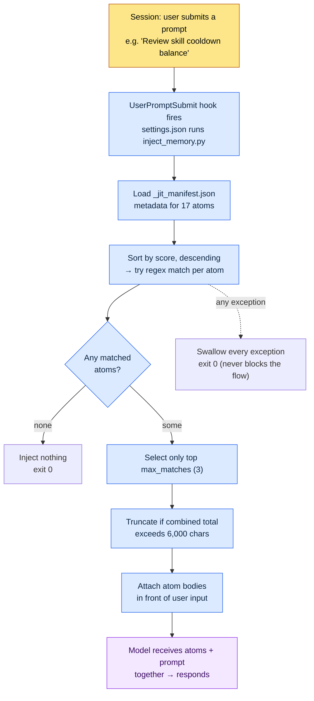

# 1.3 Memory, Permissions, and Settings Infrastructure

I opened a new session and typed, "Let's take a look at skill cooldown balance." Before I pressed Enter, a small line of gray text flashed by at the bottom of the screen: `[memory injected: 2 atoms, 1,842 chars]`. I had not opened a single file, yet the cooldown rules document I had pinned down the week before was already attached in front of the model's input. That is the first sign of a working environment with infrastructure in place. The moment I turn the tool on, the tool remembers me.

For that scene to happen, three things must already be in position: what the AI remembers (memory), what the AI can do without human approval (permissions), and the central switch that turns both on and off (settings.json). The initial setup takes an hour at most, and that hour comes back as time saved every day for the next six months. It is an investment that recovers almost all of itself.

This chapter is a walkthrough that unfolds, in order, the single line of `settings.json` I actually run on my personal PC, the `inject_memory.py` that line calls, and the `_jit_manifest.json` that script reads. Read to the end and you will be able to put your finger on exactly which file and which line make "memory gets injected automatically" happen.

---

## 1.3.1 settings.json — The One Line Where Everything Starts

Conclusion first. On my personal PC, what turns on automatic memory injection is one single block inside `settings.json`.

```json
{
  "hooks": {
    "UserPromptSubmit": [
      {
        "hooks": [
          {
            "type": "command",
            "command": "python ~/.claude/hooks/inject_memory.py"
          }
        ]
      }
    ]
  }
}
```

Spelled out in plain language, the block says this: "Every time the event where the user submits a prompt (`UserPromptSubmit`) fires, run a Python script called `inject_memory.py` once." That is all. The AI is not being clever and remembering things on its own — a script that a human registered cuts in once every time input arrives.

`settings.json` is the central file that controls every behavior of Claude Code, and it splits into two layers.

- `~/.claude/settings.json` — global. Applies to every session. Settings you can share with the team.
- `~/.claude/settings.local.json` — local. Applies only on this PC. Settings specific to a personal machine.

The two are merged when applied. So I keep the hooks and permissions the team should share in `settings.json`, and the absolute paths and personal tool paths that exist only on this home PC in `settings.local.json`. The split avoids git conflicts when collaborating and prevents the accident of personal settings leaking into the team repository.

Besides hooks, a few other entries come up often.

- `effortLevel` — the model's reasoning depth: low / medium / high. For work that needs deep judgment, like drafting a game design document (GDD), I keep it at high.
- `permissions` — the range of commands the AI may run without approval (details in 1.3.4).
- `enabledPlugins` — the list of enabled plugins.

There is one operating habit here that matters more than anything else. A single small typo in `settings.json` can keep the tool itself from starting. One missing JSON comma breaks the parse. So a backup before every change is mandatory. These backup files actually sit on my PC.

```
settings.json.bak_2026-05
settings.local.json.bak_2026-05
```

Take one copy with a date suffix and rollback takes one second. Managing it with git is even better. Like a spare set of old keys in a drawer — you never use it day to day, but a moment always comes, in front of a locked door, when you need it exactly once.

---

## 1.3.2 inject_memory.py — What Actually Happens Inside the Hook

Now we go inside the script that `settings.json` calls. This is the spine of the walkthrough. The code is barely 100 lines, but the heart of it is five actions.



Spelled out, the five actions go like this.

**1) Read the manifest.** The script first opens `~/.claude/projects/C--Users-user/memory/_jit_manifest.json`. This file holds the metadata for each atom — name, path, matching regex, score. On my personal PC, 17 atoms are currently registered.

**2) Sort by score, descending.** Every atom carries a `score` value. The higher the score, the earlier the atom gets its matching attempt. When several atoms hit the same keyword, this score decides who gets priority.

**3) Match with regex.** The user's input string is checked against each atom's `regex` pattern. If the input contains "쿨다운" (cooldown), the atom carrying the pattern `쿨다운|cooldown|GCD` fires. The comparison is case-insensitive.

**4) Cut to at most three.** No matter how many atoms match, anything beyond `max_matches` (3 in my environment) is dropped, keeping only the top three. On top of that, if the combined length of the selected atom bodies exceeds 6,000 characters, the script truncates. Two layers of ceilings serve as the safety device that keeps the input from bloating.

**5) Exit 0 on every exception.** This is the heart of the design. Whether the manifest is broken, the file has vanished, or a regex is malformed, the script quietly swallows the exception and finishes with exit code 0. If the hook dies with a nonzero code, the user's prompt itself can be blocked. The principle — "even if memory injection fails, never block the user's flow of work" — is written into the outermost try/except of the code.

The center of gravity sits on 4 and 5. Number 4 (the ceilings) keeps memory from exploding the token count, and number 5 (swallowing exceptions) keeps the infrastructure from getting in the way of the work. Both are two faces of the same philosophy: automation must never make itself a burden on the human.

---

## 1.3.3 _jit_manifest.json — The Keyword Dictionary That Wakes Atoms

In 1.2 I promised the token-saving principle — only the material you need, only the top few, fail quietly — and deferred the implementation details to this chapter. Those details live in the manifest that `inject_memory.py` reads. It is the heart of JIT (Just-In-Time — loading material only at the moment it is needed), and a single atom entry looks like this.

```json
{
  "atoms": [
    {
      "name": "combat_cooldown_rule_v2",
      "path": "atoms/combat/combat_cooldown_rule_v2.md",
      "regex": "쿨다운|cooldown|GCD",
      "score": 80
    },
    {
      "name": "user_health",
      "path": "memory/user_health.md",
      "regex": "건강|복약|컨디션|약물",
      "score": 95
    }
  ],
  "config": {
    "max_matches": 3,
    "case_insensitive": true
  }
}
```

Four fields define one atom.

- `name` — the atom's unique name.
- `path` — the file path whose body gets read in on a match.
- `regex` — the pattern that defines which keywords in the input wake this atom.
- `score` — sort priority. The higher it is, the earlier the atom matches and the earlier it claims a slot.

The `max_matches: 3` in the `config` block is the source of the "at most three" ceiling we saw in 1.3.2. Edit the manifest by hand and the behavior changes immediately.

One note on scale. My **personal PC** runs light: 17 atoms, one manifest. The company production environment (Project A), by contrast, has 304 team atoms and 48 skills registered as of a May 2026 backup. One hot atom has a score that has climbed to 356.53 (the `view_html_filename_convention` family, which covers file-naming conventions) — it did not start high; the number is a trace accumulated through repeated calls and verification.

What the gap between 17 on a personal PC and 304 at the company tells you is this: the JIT mechanism is the same, but the speed and scale at which material accumulates is proportional to project density. There is no need to build 304 from day one. Start with five core atoms, pin down one or two more each week, and before long the manifest thickens on its own.

> Author's estimate (unverified): the claim that score accumulates with match and verification counts is an interpretation based on operating patterns. The scoring formula itself varies with each environment's manifest design, so an absolute value like the 356.53 above is a measured snapshot of my environment, not a general standard.

This is also the place to restate the principle that memory is kept in two layers.

| Layer | Location | When loaded | Purpose |
|---|---|---|---|
| Global | `~/.claude/memory/` | Every session | Your identity, collaboration rules, language settings |
| Project | `~/.claude/projects/<project>/memory/` | Sessions of that project | Per-project atoms, rules, material |

Keeping global light is the safer side. When global grows heavy, that weight accumulates as a token cost on every single session. In office terms, global is the business-card holder on your desk (the lighter it is, the handier for daily use), and project memory is the folders in the cabinet beside you (it can grow thick per project without weighing on your day). So the auto-loaded global holds only the essentials, while the rich material piles up in project memory and gets woken by JIT only when needed.

---

## 1.3.4 Permissions — A Whitelist That Accumulates the Traces of Your Work

Now the third axis of the infrastructure: permissions. Claude Code can delete files, run commands, and call external APIs. Power comes with risk. The permission system manages that risk.

Permissions split into two kinds: what runs automatically without human approval, and what requires approval every time. Which side holds what is defined in the `permissions` block of `settings.json`.

```json
{
  "permissions": {
    "allow": [
      "Bash(ls:*)",
      "Bash(git status:*)",
      "Bash(git diff:*)",
      "Read(*)",
      "Grep(*)"
    ],
    "deny": [
      "Bash(rm -rf:*)",
      "Bash(git push --force:*)"
    ]
  }
}
```

A shift in perspective is needed here. This `allow` list is not a mere configuration value — it is a **trace of accumulated work**. At first it sits nearly empty, with only reads and searches auto-allowed. Then, after a month or two of repeating the same work, patterns emerge where you think "approving this command every single time is a chore," and you move them into `allow` one by one. The list that grows long is a fingerprint of what I have been repeating with this tool.

My company environment (Project A) holds about 80 auto-allow patterns. It started at 20, and 60 more attached themselves over six months — read those 60 backwards and they reveal what work got repeated over the past half year. Data sheet extraction, relation map generation, schema documentation — the tools you use often become the permissions you allow often.

Four patterns settle in for operating permissions.

- **Start with a whitelist** — begin auto-allow at the minimum and add only when needed. The direction is not opening wide and then narrowing; it is closing tight and then opening.
- **Explicitly block dangerous commands** — commands where one accident is fatal, like `rm -rf` and `git push --force`, go into `deny`. However wide the auto-allow grows, these two stay untouched.
- **Regular cleanup** — re-review `allow` every quarter and trim the permissions you no longer use. Traces that only ever pile up become noise.
- **Separate by domain** — split global permissions from project permissions. Just as a home PC and a work PC carry different policies, every environment has a different allow range.

When an approval popup appears every time, the human wears out. There are devices to cut the fatigue: bulk-registering frequent patterns with a slash command like `fewer-permission-prompts`, granting a temporary allow for a single session only, or — for personal work only — running a full auto-allow mode. I do not recommend that last option in a team environment, though.

The balance between fatigue and safety is yours to tune. Too strict and the work does not roll; too loose and accidents happen. Even if you start loose, with a quarterly cleanup cycle in place the balance settles on its own.

---

## 1.3.5 When a Session Starts — How Memory and Permissions Load Together

How do the three axes we have seen — settings, memory, permissions — operate at the same time in one session? Let's unfold it around a single line of input. The following is a cross-section of what actually happens when I type "Let's review skill cooldown balance."

<svg viewBox="0 0 720 400" xmlns="http://www.w3.org/2000/svg" font-family="sans-serif" font-size="13">
  <rect x="0" y="0" width="720" height="400" fill="#fafafa"/>
  <!-- vertical lanes -->
  <rect x="20" y="20" width="200" height="360" fill="#eef3fb" stroke="#9bb8e0"/>
  <rect x="260" y="20" width="200" height="360" fill="#eef9f0" stroke="#9bd0a8"/>
  <rect x="500" y="20" width="200" height="360" fill="#fdf3ec" stroke="#e0b893"/>
  <text x="120" y="42" text-anchor="middle" font-weight="bold">settings.json</text>
  <text x="360" y="42" text-anchor="middle" font-weight="bold">Memory (JIT)</text>
  <text x="600" y="42" text-anchor="middle" font-weight="bold">Permissions</text>
  <!-- settings lane boxes -->
  <rect x="35" y="60" width="170" height="46" rx="5" fill="#ffffff" stroke="#7aa0d0"/>
  <text x="120" y="80" text-anchor="middle">UserPromptSubmit</text>
  <text x="120" y="97" text-anchor="middle">hook fires</text>
  <rect x="35" y="130" width="170" height="46" rx="5" fill="#ffffff" stroke="#7aa0d0"/>
  <text x="120" y="150" text-anchor="middle">inject_memory.py</text>
  <text x="120" y="167" text-anchor="middle">runs (exit 0 guaranteed)</text>
  <!-- memory lane boxes -->
  <rect x="275" y="130" width="170" height="46" rx="5" fill="#ffffff" stroke="#5fae7e"/>
  <text x="360" y="150" text-anchor="middle">manifest 17 atom</text>
  <text x="360" y="167" text-anchor="middle">score sort·regex</text>
  <rect x="275" y="200" width="170" height="46" rx="5" fill="#ffffff" stroke="#5fae7e"/>
  <text x="360" y="220" text-anchor="middle">top 3·6000 chars</text>
  <text x="360" y="237" text-anchor="middle">ceilings applied</text>
  <rect x="275" y="270" width="170" height="46" rx="5" fill="#ffffff" stroke="#5fae7e"/>
  <text x="360" y="290" text-anchor="middle">cooldown atom</text>
  <text x="360" y="307" text-anchor="middle">attached before input</text>
  <!-- permissions lane boxes -->
  <rect x="515" y="270" width="170" height="46" rx="5" fill="#ffffff" stroke="#cf9560"/>
  <text x="600" y="290" text-anchor="middle">allow / deny</text>
  <text x="600" y="307" text-anchor="middle">checked per tool call</text>
  <rect x="515" y="340" width="170" height="34" rx="5" fill="#ffffff" stroke="#cf9560"/>
  <text x="600" y="361" text-anchor="middle">reads auto · deletes need approval</text>
  <!-- arrows -->
  <line x1="120" y1="106" x2="120" y2="130" stroke="#555" stroke-width="1.5" marker-end="url(#a)"/>
  <line x1="205" y1="153" x2="275" y2="153" stroke="#555" stroke-width="1.5" marker-end="url(#a)"/>
  <line x1="360" y1="176" x2="360" y2="200" stroke="#555" stroke-width="1.5" marker-end="url(#a)"/>
  <line x1="360" y1="246" x2="360" y2="270" stroke="#555" stroke-width="1.5" marker-end="url(#a)"/>
  <line x1="445" y1="293" x2="515" y2="293" stroke="#555" stroke-width="1.5" marker-end="url(#a)"/>
  <defs>
    <marker id="a" markerWidth="8" markerHeight="8" refX="6" refY="3" orient="auto">
      <path d="M0,0 L6,3 L0,6 Z" fill="#555"/>
    </marker>
  </defs>
</svg>

Three lanes meet at one input. settings.json wakes the hook, the hook picks the memory and attaches it to the input, and when the response built that way calls a tool, permissions operate as the final gate. The user typed only one line — "check the cooldown" — yet three pieces of infrastructure take their turns out of sight. This is the internal structure of the moment a tool starts to feel like *my* tool.

---

## 1.3.6 First Setup Guide — Operational Within One Hour

We have seen the theory; now we move our hands. One hour after first installing Claude Code, you can lay the whole picture above onto your own PC. I split it into five segments.

**0–10 minutes: install and confirm it runs.** After installing, run Claude Code from a terminal. In some folder, ask "What's in this folder?" and confirm a response. First check that the tool is alive.

**10–25 minutes: write three global memory files.** For the auto-loaded global layer, three files are enough.

- `MEMORY.md` (5 lines) — one line of identity plus pointers to the other files.
- `user-profile.md` (20–30 lines) — name, role, specialty, contact.
- `feedback-collaboration-style.md` (20–30 lines) — collaboration rules such as language, tone, action first, concise explanations.

Copying my example verbatim is a fine way to start. Refine it as you operate.

**25–40 minutes: basic settings.json setup.** Set `effortLevel` to high, put in the starter permission set (reads and searches automatic; writes and deletes on approval), and take one backup (`settings.json.bak_<date>`). The backup is the single most important line in this segment.

**40–55 minutes: your first five project atoms.** Turn five things into atoms — the decisions you keep forgetting, the information you keep asking for. The folder is `~/.claude/projects/<project>/memory/`. See Chapter 5 for the format. With five, you get results from global auto-load alone, without building a JIT manifest yet.

**55–60 minutes: one test.** Open a new session and throw one question from your own field. Check that global memory auto-loaded and that the response tone follows your collaboration rules.

That is the hour. The JIT manifest and the hook can wait until your atoms pass about 50, when auto-load starts to feel heavy — that is the moment to lay down the `inject_memory.py` from 1.3.2.

---

## 1.3.7 Common Mistakes and How to Avoid Them

The mistakes that recur in the early days group into five, and each stands on the same accident cause.

| Mistake | Accident cause | How to avoid |
|---|---|---|
| Putting too much into global | Every session grows heavy and wastes tokens | Keep global under 5KB; move the details to project memory |
| Auto-allowing every permission | Convenience hiding risk — the first seat of an accident | Auto only reads/searches; writes/deletes on approval (with quarterly cleanup) |
| Editing settings without a backup | A broken settings file keeps the tool itself from starting | Save `settings.json.bak_<date>` automatically before every change |
| Piling atoms into the memory folder without limit | Auto-load presses against the token ceiling | Adopt a JIT manifest from around 50 atoms |
| Mixing team and personal settings in one file | git conflicts, personal settings exposed | Team in `settings.json`, yourself in `settings.local.json` |

You do not need to dodge all five from day one. Global bloat and the missing backup deserve avoidance patterns within the first hour; for the other three, it is more natural to run for about a month and then fit the avoidance devices into the spots where your own accident probability runs highest.

---

## 1.3.8 Closing Part 1

1.1 was where we closed the distance to the tool, 1.2 where we grasped its minimum working mechanism, and 1.3 where we laid the first infrastructure of memory, permissions, and settings. These three chapters form the book's introduction. Finish this far and the basic skeleton for running the tool without stalling is in place.

The key point is that this skeleton is not a static configuration. The atoms in the manifest grow every week, the `allow` list lengthens along the traces of your work, and scores accumulate through verification. Infrastructure is not finished the moment it is laid — it grows together with its user on top of what was laid. The gap that opens between 17 on my personal PC and 304 at the company is the distance of that growth.

From Part 2 we enter information architecture proper. Chapter 4 covers YAML frontmatter, Chapter 5 atoms, Chapter 6 layers, and Chapter 7 ontology, in that order. The atom you saw in 1.3 as just one manifest entry becomes the protagonist of a whole chapter in 2.2. Only after the spine is set can the domain chapters find their own places on the same coordinates.

---

### Key Takeaways
- Automatic memory injection is a structure where one hook line in settings.json wakes inject_memory.py
- The permissions allow list is not configuration but a trace of accumulated work, and it gets cleaned every quarter
- Infrastructure is not done once laid — it is a living skeleton where atoms, permissions, and scores grow together

### Next Chapter Preview
- Part 2 begins: Chapter 4. YAML Frontmatter — Every Document as Data

---

## Try It Yourself

**setup**
1. Open `~/.claude/settings.json` and, before changing anything, take a backup as `settings.json.bak_<date>` (the suffix is today's date).
2. Put `Read(*)`, `Grep(*)`, `Bash(ls:*)`, and `Bash(git status:*)` into `permissions.allow`, and enter `Bash(rm -rf:*)` and `Bash(git push --force:*)` into `permissions.deny`.
3. (Once you have 50 or more atoms) Register `python ~/.claude/hooks/inject_memory.py` under `hooks.UserPromptSubmit`, and write the atom entries (name, path, regex, score) plus `config.max_matches: 3` into `_jit_manifest.json`.

**prompt**
- In a new session, ask a question that deliberately includes a keyword from one of the manifest's atoms. Example: "Review skill balance against the cooldown rules."

**verify**
- Check that a signal like `[memory injected: N atoms]` appears right after the input.
- See whether the intended atom is reflected in the response.
- Deliberately put broken JSON into the manifest, confirm the prompt still goes through unblocked (the exit 0 guarantee), then restore it.

**Solo Scale-Down**
- Start with no hook and no manifest. In a single global `MEMORY.md`, write just 3 lines of identity and 3 lines of collaboration rules, and auto-allow only `Read(*)` and `Grep(*)`. When atoms grow familiar in your hands and approach 50, that is when you add the hook from 1.3.2. Infrastructure starts small and grows along your traces — you do not begin with 304.
