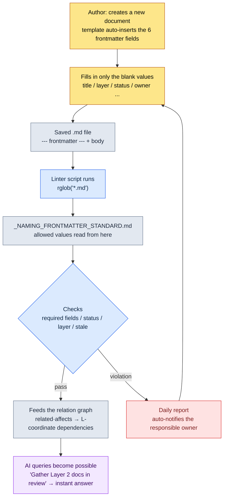

# 2.1 YAML Frontmatter — Every Document as Data

The night before a milestone build, teammate A, a systems designer, asked me on our team messenger: "How many documents touched the reward curve this week? And how far has review gotten?" I didn't know the answer. The documents were somewhere in the folders; who had last touched them, and which milestone they belonged to, lived scattered across individual memory and file-naming conventions. What we did that night was make one convention: six lines entered at the top of every document. From the next milestone on, those six lines made it possible to answer teammate A's question without anyone opening a folder.

A few lines of YAML written between `---` markers at the very top of a document. This is called frontmatter. This convention tells both humans and machines, at the same time, what a document is — without reading a single character of the body. This chapter follows how that one line becomes the entry coordinate for the entire information architecture, with a script that actually runs.

One term up front. This book divides design documents into five **Layers** (Chapter 6 covers them in earnest): L0 = worldview and concept, L1 = system rules, L2 = content, L3 = data, L4 = implementation coordinates. Dependencies flowing top-down is the normal direction. The `layer: 2` that appears in the section below is a coordinate declaration: "this document belongs to the content Layer."

---

## 2.1.1 Why "Documents as Data" Rather Than Just "Documents"

Traditional design documents have lived in Word, PowerPoint, and Google Docs. The body text is optimized for human reading. But the metadata — a document's kind, ownership, status, location — is either dissolved into the body or delegated to folder structures and file-naming conventions. So to learn "which milestone does this document belong to, who is responsible, when was it last reviewed," you have to open the body.

Two limitations compound here. First, a document does not declare its own identity. Its identity lives in people's memory and folder conventions, and those conventions corrode over time. Second, AI has no clues for inferring context. Tell Claude Code "review this document," and it reads the body start to finish, wasting tokens, with no idea where the scope of responsibility ends.

YAML frontmatter solves both at once. Put explicit metadata in the first lines of the document, and both humans and machines can identify it without opening the body. It is like a label on the front of a filing-cabinet drawer: you know what's inside without pulling it open. And this label is more than a classification tool. As we'll see later, the single `layer` field becomes the entry coordinate for procedural generation and automated review.

---

## 2.1.2 A Real Frontmatter — The First 14 Lines of One Document

Instead of an abstract example, here is the frontmatter that Project A's reward-curve document actually carries at its head (only IDs and real names are pseudonymized; the structure is exactly as it runs in production).

```yaml
---
title: "Main Quest Chapter 12 Reward Curve"
layer: 2
status: review
owner: teammate_a
created: 2026-04-15
updated: 2026-05-20
related:
  - quest_main_chapter12
  - reward_curve_milestone_2
affects:
  - L3_BalanceSheet_v2
ip_check: passed
---

# Main Quest Chapter 12 Reward Curve

(body begins)
```

The point is the separation above and below `---`. Above is data the parser reads; below is body text humans read. Markdown renderers usually hide frontmatter, so it does not interrupt reading. One file holds both data (frontmatter) and content (body), becoming a single source of truth.

Watch the two lines `layer: 2` and `affects: [L3_BalanceSheet_v2]`. They declare: "this content (L2) document affects the balance sheet in the data Layer (L3)." From that alone, a tool can draw the L2→L3 dependency as a graph without reading the body. Conversely, if an L3 data document references an L1 system rule via `depends_on` — a reverse dependency pointing from bottom to top — that is a design smell. A tool detects that reverse reference automatically.

Why YAML is easier to write by hand than JSON is simple: indentation expresses structure, quotes are rarely needed, and `#` comments are allowed. It suits designers filling it in themselves.

---

## 2.1.3 Where the Standard Lives — `_NAMING_FRONTMATTER_STANDARD`

Fields can multiply without limit. The more they grow, the heavier the writing burden and the faster the standard collapses. So Project A runs two tiers: a minimal set of core fields common to every document, and domain-specific extension fields.

The common core is six fields.

| Field | Format | Purpose |
|------|------|------|
| `title` | string | Human-readable title. May differ from the file name |
| `layer` | 0–4 | The Layer coordinate from Chapter 6 |
| `status` | draft / review / approved / archived | Document state |
| `owner` | username | The person responsible (exactly one) |
| `created` | YYYY-MM-DD | Creation date |
| `updated` | YYYY-MM-DD | Last modified date |

These six alone tell you a document's freshness, ownership, and position at a glance. Resist the urge to add more for the first month. As you operate, which fields you actually need reveals itself naturally.

Extension fields differ by domain. Systems design favors `depends_on` and `affects`; combat design, `combat_phase` and `anim_target`; narrative, `world_region` and `chapter`; balance, `data_sheet` and `formula_id`. These extension fields must not scatter freely, so a single standard document nails down each field's official name, allowed values, and examples. That document is `_NAMING_FRONTMATTER_STANDARD.md`. Adding a new field has to go through it. And the standard document itself is registered as an atom, managed in the same family as the rule that forces a Layer number prefix on document names (the `docs_layer_numeric_prefix_naming` atom).

An important shift happens here. If the standard is only a document humans read, humans will break it. Make the standard **data that machines read**, and machines enforce it. The next section is the actual code of that shift.

---

## 2.1.4 Worked Transcript — Enforcing the Standard in Code, and the Lesson from a datetime Bug

Now I had Claude Code build "a linter that checks whether every Markdown document in Project A follows the frontmatter standard." There were two core requirements. It had to catch the violations (missing required fields, non-standard status values, layer outside 0–4, documents in review untouched for more than 90 days), and it had to **read allowed values from the standard document instead of hardcoding them**. That separation is the point: change the standard, and the check criteria change without touching the code. (The full script and the steps to run it yourself are in the "Try It Yourself" section at the end of this chapter.)

Then came an incident. Claude's first version computed the date difference in the STALE check as `today - fm["updated"]`, with a comment saying that if a file reads `updated: 2026-05-20`, PyYAML auto-parses it as a `datetime.date`. That is only half true. Run against the real documents, some files threw a traceback.

```
TypeError: unsupported operand type(s) for -: 'datetime.date' and 'str'
```

The cause was human hands. Some authors wrote `updated: 2026-05-20` (parsed as a date); others wrote `updated: "2026-05-20"` with quotes (parsed as a string). Where the standard had not pinned down the date format, people's habits split — and Claude assumed only one side. I rejected the code and asked again: "normalize both notations safely to a date, and also handle the case where `updated` is missing." Claude inserted a helper that checks the input type and normalizes both to `datetime.date` (the fixed block is also in "Try It Yourself").

The real lesson was not the code bug. It was that **people's habits split exactly where the standard had not pinned down the date format**. So I added one line to `_NAMING_FRONTMATTER_STANDARD.md`: `updated: YYYY-MM-DD (따옴표 없이)` — that is, YYYY-MM-DD, without quotes. The linter, in the middle of doing its checks, ended up exposing a hole in the very standard it was checking against.

The fixed script's first output was not clean. I am leaving the messy result exactly as it came out.

```
[NO-FM]   manuscript/legacy/old_combat_notes.md
[MISSING] manuscript/system/quest_flag_table.md: layer
[STATUS]  manuscript/content/town_intro.md: WIP
[LAYER]   manuscript/balance/dps_v2.md: None
[STALE]   manuscript/system/inventory_rules.md: 134d
```

These five lines were the team's actual state in the early days of adoption. Old documents had no frontmatter at all (`NO-FM`), one document was missing `layer`, someone used the non-standard value `status: WIP`, one balance document left `layer` as `None`, and one system-rules document had been asleep in `review` for 134 days. A standard is never followed from day one. The linter merely surfaces that fact every morning.

---

## 2.1.5 From Frontmatter to Script — The Flow

Compressed into a single diagram, the worked transcript above looks like this. It shows how one line written by a human flows all the way into the machine's automated checks.



Two things matter. First, the standard (E) is separate from the script (D). Change the standard, and the check criteria change without touching the code. Second, a violation (H) is not a dead end but a loop back to the writing stage (B). It doesn't blame anyone; it routes the document back so its author fixes their own document.

---

## 2.1.6 A Production Case — Six Months on a Mid-Sized Team

On Project A, which I run as design director, we rolled out frontmatter to the entire design team (four to five people) about six months ago. Adoption did not happen in one stroke; it passed through four distinct stages.

The biggest pushback in week one was "you want me to write this by hand every time?" Memorizing and typing six lines for every new document is tedious. The fix was template auto-insertion. VSCode snippets, Obsidian templates, and the "New Document" button on our design portal all insert an empty YAML block automatically. Authors fill in only the blank values. The pushback disappeared within a week.

At one month, standard collisions erupted. With several people adding fields freely, `owner`, `responsible`, and `author` all appeared at once. Same concept, three spellings — both search and automation broke. The fix was to consolidate every field's official name, allowed values, and examples into the single document `_NAMING_FRONTMATTER_STANDARD.md`, and to make adding any new field go through that document as a rule. The standard stabilized within a month.

At three months, the linter from 2.1.4 came in. Even with a standard, people break it. So a consistency report began generating automatically every morning and landing in the shared channel of our team messenger. Each owner only has to look at their own documents. After automation, standard violations dropped noticeably (author's estimate, not a precise measurement — felt like half or less).

At six months, the combination with AI began to pay off. Once the standard stabilized, queries like these came back with instant answers.

- "Gather every Layer 2 document updated in the last two weeks whose status is review"
- "Draw a timeline of status changes for every document I own"
- "List the other documents this change request affects" — following the `related` and `affects` graph automatically

In the end, frontmatter became a shared vocabulary between humans and AI. When a human writes it, AI understands it; when AI writes it, a human verifies it. Both look at the same keys. But remember the week-one pushback, the one-month collisions, the three-month linter, the six-month combination — six accumulated months produced this result. It did not appear in one stroke.

---

## 2.1.7 Common Mistakes and How to Avoid Them

The mistakes that recur in early adoption group into five. All of them stand on the same root — "places where the standard was left to human willpower alone."

| Mistake | Why It Goes Wrong | How to Avoid It |
|---|---|---|
| Defining too many fields from the start | Authors burn out filling in blanks; quality drops | Start with the core six; after 1–2 months add only the ones you actually use |
| Field names keep changing (`tag`→`tags`→`category`) | Old names linger in accumulated documents; search and automation break | Pair every rename with a migration script. Auto-convert or warn when old names are found |
| Typing it by hand every time | Typos, missing fields, and split date notations (the bug from 2.1.4) become routine | Templates, snippets, "New Document" automation first. Human hands only for meaningful values |
| A standard left alone with no verification | Even with a standard, nobody knows who broke it; natural corrosion sets in | Linter + daily automated report, so violators fix their own documents |
| Forgetting the `layer` field | Without a Layer coordinate, neither cross-discipline visibility nor review gates can form | Make `layer` a required field. The linter detects omissions |

You don't need to block all five from day one. Set up the avoidance patterns for #1 and #3 in week one; fold in #2, #4, and #5 as you operate, starting wherever your own team stumbles most often.

---

## 2.1.8 Starting Small — Making It Stick in Three Weeks

Adopting frontmatter is lighter work than you might expect. Three weeks is enough for it to settle into one team.

In week one, define the core six fields, build the template, and apply it to new documents only, keeping the writing burden minimal. In week two, apply it by hand to the top 20 most-viewed documents, and check in real use which fields are missing. In week three, turn on the linter and the daily report — from then on, the standard is maintained by the strength of tools, not human willpower.

Do not migrate the entire backlog of documents at once. Start with frequently viewed documents and with new documents. After about six months, nearly every document carries frontmatter. Even then, 100% is not the goal. Spending time migrating old documents nobody has ever opened is waste.

---

## Try It Yourself

Run one full cycle yourself, at the smallest possible scale.

**setup**
- Place two or three `.md` documents to be checked in a working folder. Deliberately remove `layer` from some, or insert a non-standard value like `status: WIP`.
- Place a minimal standard document in the same folder.
  ```
  status: allowed = ["draft", "review", "approved", "archived"]
  updated: YYYY-MM-DD (without quotes)
  ```

**prompt** (enter into Claude Code)
> Write a Python script that checks the YAML frontmatter of every .md under this folder. Catch missing required fields title·layer·status·owner, status values outside the allowed list (read it from the standard document), layer values that violate the 0–4 integer rule, and documents in review whose updated is more than 90 days old. Handle `updated` safely whether it comes as a string or as a date, and print violations per file.

**verify**
- Run the script and confirm that every violation you planted gets caught.
- Add `WIP` to the `allowed` list in the standard document and run again. Confirm that `status: WIP` now passes even though you didn't change a single line of code. That is the proof that the standard and the code are separated.
- Include one document with quotes around `updated` and one without, and confirm the `TypeError` from 2.1.4 does not appear.

**Reference: The Full Linter Script**

This is the code Claude first produced in 2.1.4. The STALE check line (`age = (today - fm["updated"]).days`) still contains the datetime bug.

```python
import sys, datetime, pathlib, re
import yaml  # PyYAML

ROOT = pathlib.Path("manuscript")
STANDARD = pathlib.Path("_NAMING_FRONTMATTER_STANDARD.md")
REQUIRED = ["title", "layer", "status", "owner"]

def load_allowed_status(standard_path):
    # Extract the allowed `status` values from the standard document
    text = standard_path.read_text(encoding="utf-8")
    m = re.search(r"status:\s*allowed\s*=\s*\[(.*?)\]", text)
    if not m:
        return ["draft", "review", "approved", "archived"]
    return [s.strip().strip('"').strip("'") for s in m.group(1).split(",")]

def parse_frontmatter(md_path):
    text = md_path.read_text(encoding="utf-8")
    if not text.startswith("---"):
        return None
    end = text.find("---", 3)
    block = text[3:end]
    return yaml.safe_load(block)

def main():
    allowed = load_allowed_status(STANDARD)
    today = datetime.date.today()
    violations = 0
    for md in ROOT.rglob("*.md"):
        fm = parse_frontmatter(md)
        if fm is None:
            print(f"[NO-FM]   {md}")
            violations += 1
            continue
        for field in REQUIRED:
            if field not in fm:
                print(f"[MISSING] {md}: {field}")
                violations += 1
        if fm.get("status") not in allowed:
            print(f"[STATUS]  {md}: {fm.get('status')}")
            violations += 1
        if not isinstance(fm.get("layer"), int) or not (0 <= fm.get("layer") <= 4):
            print(f"[LAYER]   {md}: {fm.get('layer')}")
            violations += 1
        if fm.get("status") == "review":
            age = (today - fm["updated"]).days   # ← this is where it breaks
            if age > 90:
                print(f"[STALE]   {md}: {age}d")
                violations += 1
    sys.exit(violations)
```

The core block that came back after my re-request. It normalizes `updated` safely whether it arrives as a string or as a date.

```python
def as_date(v):
    if isinstance(v, datetime.date):
        return v
    if isinstance(v, str):
        return datetime.date.fromisoformat(v.strip())
    return None

# Replacement for the STALE check inside main()
if fm.get("status") == "review":
    upd = as_date(fm.get("updated"))
    if upd is None:
        print(f"[MISSING] {md}: updated")
        violations += 1
    elif (today - upd).days > 90:
        print(f"[STALE]   {md}: {(today - upd).days}d")
        violations += 1
```

### Solo Scale-Down

You don't need a team. In a personal notes folder, cut the core fields down to three — `title`, `status`, `updated` — and have the linter catch only one thing: "documents whose status is review and whose updated is more than 30 days old." That alone surfaces, once a week, the documents you started reviewing and then forgot. The standard–template–check triangle works at solo scale exactly as it does for a team.

---

### Key Takeaways
- A line of frontmatter is the smallest data brick that identifies a document without reading the body
- Keep the standard in a document, separate from the code, and you can change the check criteria without touching the code
- The single `layer` field becomes the entry coordinate for procedural generation and automated review
