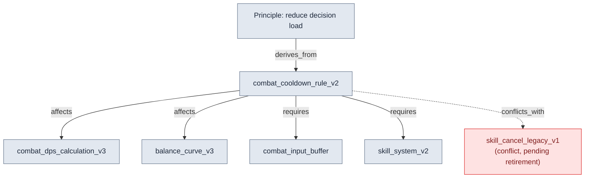
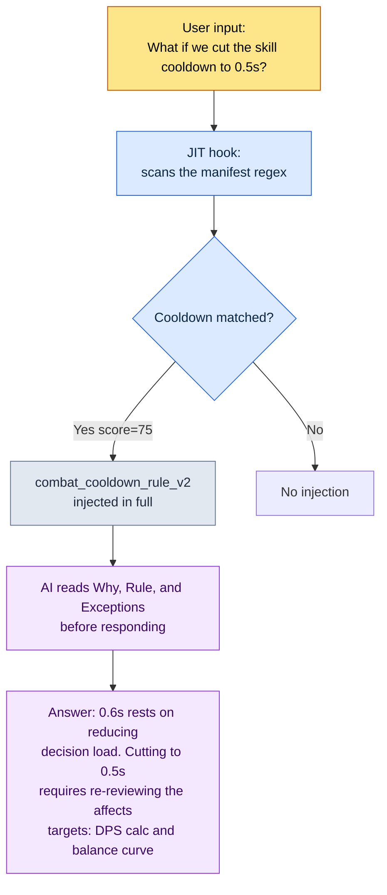

# 2.2 Per-Page Atoms — The Anatomy of One Decision per Document

During a new hire's first week, he asked me over chat: "Is the combat cooldown 0.6 seconds? Which document says so?" I answered, "It's in the skill system GDD (Game Design Document — the detailed spec)." He asked again: "Which section of that GDD? It's 220 lines — class design, then damage curves, then even how the UI displays it." I opened the file and found it for him. Line 137. Then he asked one last question: "But why 0.6 seconds? Was 0.5 not an option?" That answer was in no document at all. I remembered we had decided it in a meeting six months earlier, but the reason was buried somewhere in the meeting notes.

That five-minute conversation contains all three failures of a 220-line consolidated document. You cannot find the location (search failure), there is no reason (lost context), and a human has to mediate every time (no automation). Ask an AI the same question and things get worse: it reads all 220 lines and then mixes damage-curve talk — irrelevant to cooldowns — into its answer.

The prescription in this chapter is simple. **One document holds one decision.** A decision-sized document carved out by this principle is called an atom. Split the 220-line GDD and "the cooldown is 0.6 seconds" becomes one atom, and inside that atom the location, content, reason, exceptions, and relations all sit in one place. Instead of abstractions, this chapter dissects one real atom from end to end: how to name it, what frontmatter to fill in, how to make relations explicit, and how, as a result, the AI picks out exactly that one atom and nothing else.

---

## 2.2.1 Picking One Specimen — `combat_cooldown_rule_v2`

The specimen on the table is one atom actually in operation on Project A. Its name is `combat_cooldown_rule_v2`. The full file follows. It is not long — it holds only one decision. (The file appears verbatim in its original Korean; each key line is quoted in English as the dissection proceeds.)

```markdown
---
name: combat_cooldown_rule_v2
title: "Combat Cooldown Rule — v2"
type: rule
layer: 1
status: approved
owner: Lee Minsoo
created: 2026-03-10
updated: 2026-05-12
applies_to: [skill_system, item_system]
---

# Combat Cooldown Rule v2

Why: To limit the number of skills usable at once, reducing the
burden of split-second decisions and preserving the meaning of combo inputs.

Rule: Every active skill has a global cooldown of 0.6 seconds + an
individual cooldown (defined per skill). While the global cooldown is
running, no active skill can be cast.

How to apply:
- Every new skill definition must specify an individual cooldown
- A cooldown column value of 0 in L3_SkillSheet violates this rule
- The build-stage consistency check detects violations automatically

Exceptions:
- Passive skills are exempt from this rule
- Ultimates use a separate gauge system (See: [[ultimate_gauge_system]])

Relations:
- affects: [[combat_dps_calculation_v3]], [[balance_curve_v3]]
- derives_from: [[principle_decision_load_reduction]]
- conflicts_with: [[skill_cancel_rule_legacy_v1]]
- requires: [[combat_input_buffer_system]], [[skill_system_v2]]
- is_a: rule
- part_of: combat_system_master
```

I will cut this one file into five parts: naming, frontmatter, single decision, relations, traceability. Only when all five are in place does an AI read this atom as "a unit that makes sense on its own."

---

## 2.2.2 Part ① Naming — The Name Itself Is a Coordinate

The file name is `combat_cooldown_rule_v2`. It is not a name picked on a whim; it has a three-segment structure — the domain prefix, the decision body, and the version.

```
combat_         cooldown_rule          _v2
└ prefix        └ decision body        └ version
  (which domain)  (what it decides)      (which revision)
```

The prefix `combat_` is a coordinate that says "this is a decision in the combat domain." Project A's rule atoms are partitioned into domains by prefix: `quest_` (quests), `data_` (data operations), `docs_` (document operations), `meeting_` (meeting notes), `portal_` (the design viewer). The prefix alone tells you whose area of responsibility a decision belongs to and where its influences come from.

When naming wavers, everything wavers. If the same decision exists twice, as `skill-cooldown.md` and as `cooldown_skill_v2.md`, search breaks, and so does the JIT matching that appears later in this chapter. So Project A pinned the naming rule itself down as an atom before anything else. That atom is `atom_naming_convention_v1`, and it mandates snake_case, a required prefix, and a version suffix. And the rule is enforced not by human willpower but by a linter. Commit a file name without a prefix and it gets caught at the build stage.

Beneath the naming lies a larger design that runs through this whole book. The frontmatter's `layer: 1` is the second coordinate. If the prefix says "which domain," the Layer says "which layer of abstraction." Only when the two coordinates combine is the atom's position fixed as a single point on a plane. Here, Layer is just a coordinate (the detailed definition of layers 0–4 is in 2.3). The cooldown rule is "an input rule that governs generation," so it sits on Layer 1. There is even a separate rule that forces this Layer coordinate onto document names as a numeric prefix — `docs_layer_numeric_prefix_naming`. A single name carries two explicit coordinate axes.

The essence of this design is not a compulsion to tidy up. There is a line I repeated to the team: **"The Layers were split for procedural generation in the first place."** When every atom carries an explicit domain coordinate (prefix) and layer coordinate (Layer), an AI can later "take every Layer 1 combat rule as input and auto-generate Layer 2 content." The name is the addressing scheme for that automation.

---

## 2.2.3 Part ② Frontmatter — The Label Machines Read

The YAML block between the `---` markers above the body is the frontmatter. It applies the standard from 2.1 to atoms as-is, and it is a label read not by people but by machines — the build script, the JIT hook, the relation map generator.

| Field | Value | What machines do with it |
|---|---|---|
| `name` | combat_cooldown_rule_v2 | The unique ID that other atoms link to |
| `type` | rule | Per-category stats and filters (rule / concept / decision …) |
| `layer` | 1 | Per-Layer coloring and sorting; the reference axis for reverse-reference detection |
| `status` | approved | Of draft, approved, and archived, only approved gets into the build |
| `applies_to` | [skill_system, item_system] | Impact scope — the systems this rule touches |
| `created`/`updated` | 2026-03-10 / 2026-05-12 | Change tracking; the reference dates for auditing stale atoms |

With these labels filled in, automated checks become possible. For example, if a system rule declared `layer: 1` directly references a data atom (Layer 3) like `[[L3_SkillSheet_row_0042]]` in its body, that is a **reverse reference (L3→L1)** — an upper layer bound to a concrete value in a lower layer. Project A detects this pattern automatically at the build stage, because a rule should reference the format of the data, not a single row of it. Without that one `layer` line in the frontmatter, the check itself cannot exist.

Handling `status: archived` is also frontmatter's job. When a decision changes, the atom is not deleted; it receives `status: archived` plus an `archived_at` date. Build and JIT exclude archived atoms. The record stays, but it leaves active duty. Over six months of operation on Project A, the archive rate was about 15% (author's own measurement). If that ratio sits close to 0%, I read it as a signal that the archival workflow is not working.

---

## 2.2.4 Part ③ Single Decision — Does It Summarize in One Sentence?

The heart of the atom dissection is confirming that the body holds only one decision. The test is simple. **Try to summarize the atom's decision in one sentence.**

> "Every active skill has a 0.6-second global cooldown."

One sentence does it. Pass. If the summary comes out as two sentences — "the cooldown is 0.6 seconds, and during a combo it is reduced by 50%" — that is two decisions. Split it into `combat_cooldown_rule_v2` (base cooldown) and `combat_combo_cooldown_reduction_v1` (combo reduction).

There are two more auxiliary tests for singleness.

**The independent-retirement test.** If you retire this one atom, does the system stay standing? Retire the cooldown rule and combat balance wobbles, but the system still runs. The unit is right. Conversely, if retiring it brings five other atoms down with it, those five are really five fragments of one decision. Merge them into a larger atom.

**The single-reference test.** Can someone elsewhere link just `[[combat_cooldown_rule_v2]]` and have it carry meaning? If it does, the unit is right. If referencing that one line forces a reader through several parts of the body, it has not been split enough.

A body that passes these tests naturally settles into five sections — Why, Rule, How, Exceptions, Relations. Above all, **do not delete the Why.** The answer to the new hire's final question from the opening — "Why 0.6 seconds?" — lives here: "to reduce the burden of split-second decisions and preserve the meaning of combo inputs." When someone proposes "let's cut it to 0.5 seconds" six months from now, this one line becomes the starting point of the debate. An atom whose Why is gone becomes a fossil nobody dares to touch.

---

## 2.2.5 Part ④ Relations — Arrows Make Impact Analysis Possible

The Relations section at the bottom of the atom is what makes this specimen a node in a graph rather than an isolated memo. The key point is that it does not just say "related documents" — it **states the kind of each relation**.



Six kinds of relation each do a different job.

- `derives_from`: which higher principle this decision derives from. The 0.6-second cooldown is a concretization of the principle "reduce decision load."
- `affects`: what is affected when this atom changes. Change 0.6 to 0.5 seconds and the DPS calculation and the balance curve shake. **You can pull the impact scope automatically before making a change.**
- `requires`: what must exist first for this decision to hold. Without the input buffer system, the global cooldown swallows player inputs.
- `conflicts_with`: what it contradicts. It conflicts with the legacy skill-cancel rule, and this link is the signal that "one of the two must be retired."
- `is_a` / `part_of`: classification (rule) and membership (combat_system_master). The skeleton of the graph.

With a plain "Related: [Document A], [Document B]" link, a human has to work everything out one item at a time. With relation types entered as an enum, the machine works it out. "Show me everything affected if I change this atom" becomes an automatic query that follows `affects`, and "find every pair of rules that currently contradict each other" becomes an automatic check that scans `conflicts_with`. The full ontology design of these six enums comes in 2.4; 2.2 only notes that the atom standard applies that enum ahead of time.

The relation arrows are also input to the relation map generator. Project A's `gen_relation_map.py` reads every atom's frontmatter `layer` and Relations section and automatically draws an interactive relation map as HTML, colored by Layer. This is possible only because each atom carries a coordinate (Layer) and arrows (Relations).

---

## 2.2.6 Part ⑤ Traceability — The 30 Minutes One Atom Saved

An atom with all five parts in place is traceable. Who made this decision, when, and why, and what counts as a violation — all in one place. The value of traceability shows most clearly not in statistics but in the incidents it actually prevented.

Project A's `meeting_image_caption_standard` atom is a rule that every image attached to meeting notes must carry a caption stating which screen it shows, why it was attached, and what decision it relates to. Before this atom existed, a screenshot went into a set of meeting notes without a caption, and a week later a team member who saw it spent 30 minutes checking with the author to figure out "what screen is this?" After the atom existed, when the same omission recurred, the build-stage linter caught the caption-less image automatically. Five minutes to fix. 30 minutes became 5.

Another specimen, `skill_listing_budget_wrapper_only_policy`, is a rule that caps global slash command slots at 12: the actual skills live in a separate directory, and only the 12 wrappers are exposed globally. Before it was codified, global slash commands had ballooned to nearly 40 and chewed into the token budget at every session start. Since the atom was defined, an automatic cleanup tool trims the excess at the start of each session. The rule is enforced by tooling, not by human memory.

Project A has about 304 of these atoms accumulated (author's own measurement, at the six-month mark of operation). Looking only at the broad strokes of the distribution, recurrence-prevention rules (rule) take the largest share, followed by one-off decisions pinned down (decision), domain concepts (concept), and collaboration corrections (feedback). One atom saves minutes, but with 304 of them the cumulative savings cross into days. That is why I call atoms an "asset," not "housekeeping."

---

## 2.2.7 From Dissection to Automatic Injection — How JIT Actually Works

So far we have dissected one atom statically. Now watch it in motion. The JIT (Just-In-Time) hook from 1.3 picks only the atoms that match keywords in the input and injects them into context on the spot. The JIT manifest is a JSON file that maps each atom to its matching keywords and a score — here the regex catches both the Korean word for "cooldown" and its English forms.

```json
{
  "name": "combat_cooldown_rule_v2",
  "path": "atoms/combat/combat_cooldown_rule_v2.md",
  "regex": "쿨다운|cooldown|글로벌 쿨다운|GCD",
  "score": 75
}
```

An actual injection flows like this.



The last box is the point. The AI does not merely answer "it was 0.6 seconds." Having read the atom's Why, it gives the rationale; having read `affects` in Relations, it flags ahead of time what will shake if the value changes (the DPS calculation and the balance curve). All five dissected parts — split small, reasons written down, relations made explicit — come alive in the response.

This is where the one-decision-per-document principle reveals itself as the precondition for automation. If this atom had been the 220-line consolidated GDD, the moment the single word "cooldown" matched, class design, damage curves, and UI would all be injected wholesale, the token budget would shrink, and the AI would lose focus over which of five decisions to answer. **The smaller and clearer the atom, the higher the JIT precision. Being finely split is not a virtue of tidiness — it is the precondition for automatic injection.**

The score is the device that protects the context budget. When several atoms match one input, only the top N by score are injected (default: 3). The scoring criteria get settled through operation.

- Safety, security, and health atoms = 95–99 (must never be dropped)
- Core message and philosophy atoms = 90–94
- Core domain rules = 75–89 (the cooldown rule sits here, at 75)
- Reference and history atoms = 30–50

---

## 2.2.8 Personal Atoms and Team-Shared Atoms — Separating the Two Tiers

The dissected specimen `combat_cooldown_rule_v2` is a team-shared atom that earned `status: approved`. Not every atom starts out in that seat. Project A splits atoms into two tiers.

- **Personal atoms** — unconfirmed hypotheses, personal memos, point-in-time snapshots. Only you see them. The standard is loose.
- **Team-shared atoms** — verified rules. The whole team sees them. They must pass naming, structure, and an approval process.

The reason for the separation is psychological. Personal atoms must stay free, so that you can jot down an unverified hypothesis without pressure and retire it a week later. If everything were public to the team from the start, you would think "what if this turns out wrong" and never write it down at all. Conversely, team-shared atoms must be strict, so that everyone trusts and references them.

`combat_cooldown_rule_v2`, too, probably began as a one-line personal memo: "let's test a 0.6-second cooldown." After it was validated in an alpha build, it was promoted to team-shared as a change request, went through review by another designer, and became `approved`. This personal-to-team promotion flow is itself one axis of the self-improving loop by which an atom system gets smarter over time.

---

## 2.2.9 Five Common Mistakes

The mistakes that recur in the early days of atom operation come down to five. All of them grow from the same root: treating atoms as one-off memos instead of assets.

| Mistake | What breaks | How to avoid it |
|---|---|---|
| Creating too many in the first week | Unverified atoms pile up and operation collapses | Start with one or two verified ones; let the count grow naturally |
| Never archiving | Stale atoms keep matching in JIT and produce wrong answers | Quarterly audit; `status: archived` + `archived_at` |
| Too abstract / too specific | "Do good design" cannot be verified; a one-line stray thought is meaningless | Aim for the level of "attack ranges are 0.5/1.5/3.0/5.0 only" |
| Inconsistent naming | Search and JIT matching break wholesale | Create the naming convention atom first and enforce it with a linter |
| Skipping the Why | Over time it becomes a fossil nobody can touch | Enforce the five sections: Why, Rule, How, Exceptions, Relations |

You do not need to dodge all five perfectly in the first month. Mistakes 1 and 4 are solved together by a single naming convention atom, and 2, 3, and 5 fall into line naturally if you run one quarterly audit around the three-month mark.

---

## 2.2.10 On to the Next Chapter

In this chapter we cut one atom into five parts: the name (coordinates), the frontmatter (a machine label), the single decision (the one-sentence test), the relations (impact analysis), and traceability (the 30 minutes it saved). And we saw how all five come alive at once in JIT automatic injection.

Of the two coordinates written into the name, 2.2 only brushed past `layer: 1`. 2.3 takes that Layer head-on. Give every atom a Layer coordinate and, even across disciplines, you start to see where each other's outputs sit. Then 2.4 formalizes, as an ontology, the six relations whose enum names this chapter merely borrowed (affects, derives_from, conflicts_with, requires, is_a, part_of). In the backbone of the information architecture that runs YAML (2.1) → Atom (2.2) → Layer (2.3) → Ontology (2.4), this chapter was the second vertebra.

---

### Key Takeaways
- One atom is the sum of five parts: name, frontmatter, single decision, relations, and traceability
- The one-decision-per-document principle is not a tidying habit — it is the precondition for JIT automatic injection
- The two coordinates written into the name, domain and Layer, become the addressing scheme for procedural generation

---

## Try It Yourself — Build One Atom and Inject It via JIT

**setup.** Create an `atoms/` directory in your working folder, and write the naming convention atom (`atom_naming_convention_v1`) before anything else. Three lines are enough: snake_case, required prefix, version suffix. If you use JIT, put an empty array in `_jit_manifest.json`.

**prompt.** Pick one decision you keep forgetting, and get an atom draft with the prompt below.

> "Turn the following decision into the standard atom format. Decision: 'Active skills have a 0.6-second global cooldown.' Use five sections: Why, Rule, How to apply, Exceptions, Relations. In the frontmatter, include name (snake_case + prefix), type, layer, status: draft, owner, and created. At the end, check whether the decision summarizes in one sentence."

**verify.** Check the atom you receive in three ways. ① Does the decision summarize in one sentence? (If not, split it.) ② Is the Why non-empty? ③ Add one `{"name", "path", "regex", "score"}` line to the manifest, then type that regex keyword as an actual input — does the atom get injected? Pass all three and your first atom is done.

---

## Solo Scale-Down

If you are a solo developer with no team, no linter, and no build pipeline, this entire chapter shrinks down to a single folder in your note app.

- **Naming**: unify file names under one rule, `domain_decision_v1`. Your own eyes stand in for the linter.
- **Single decision**: one decision per note. If you cannot write the title as one sentence, split it into two notes.
- **Why required**: write one line at the top of the note — why it was decided this way. That one line rescues the you of six months from now.
- **Relations**: instead of a formal enum, three markers — `→ 영향:` (affects), `↑ 근거:` (basis), `✕ 충돌:` (conflicts) — keep nine-tenths of impact tracing alive.
- **JIT substitute**: instead of a manifest, open the 1.2–1.3 relevant notes yourself before starting work and paste them in for the AI. That is manual JIT.

The point is not the tools but the habit of the five parts. The first 10 notes are the hardest; once past that hump, your hands make the next 100 on their own.
