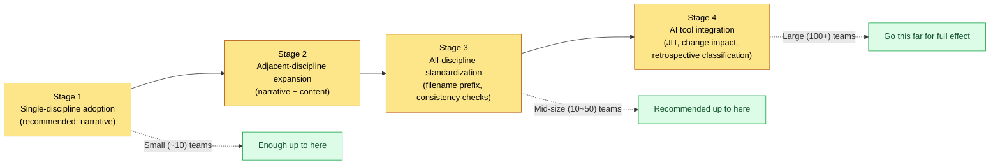

# 2.3 Layer Design — Abstracting Game Systems

It was the quarter our design disciplines were growing from three to eight. A combat designer locked a skill's range at 8m. The same week, a level designer locked a dungeon corridor width at 6m. Each decision was perfectly reasonable inside its own discipline. The problem surfaced three weeks later, in the build. An area-of-effect skill punched through the corridor walls, and enemies died where the player couldn't even see them. It was nobody's mistake. The two simply had no window into each other's decisions.

This chapter is about building that window: letting each discipline keep its own room while a single coordinate tells it what is happening next door. That coordinate system is what this book calls the Layer.

---

## 2.3.1 Siloing — The Enemy We Keep Meeting

Game design splits into finely specialized disciplines: systems, combat, narrative, content, level, balance, UX, QA. Each discipline has its own tools, deliverables, and meetings. As scale grows, each goes deeper into its own territory until nobody knows what the others are doing. This is called siloing.

The cost of siloing only reveals itself with time.

- The skill range decided by combat design doesn't match the corridor width from level design.
- The NPC motivations designed by narrative collide with the quest reward structure from content design.
- The economy cycle tuned by balance design drifts out of sync with the attendance-reward calendar of live operations (live ops).

Lack of skill is not the cause. Everyone made reasonable decisions within their own discipline; there was simply no channel for noticing the decisions of the others. Patch the gap with meetings and meetings explode; patch it with group chat and the signal drowns in noise. The point is not that meetings and chat are worthless — it is to draw a clear boundary between what they can patch and what they cannot.

The solution is to keep each territory intact (preserving discipline specialization) while letting everyone see each other's flow (integrated visibility). The two demands look contradictory, but align them on a shared coordinate system and you achieve both at once. That coordinate system is the Layer. In office terms: everyone keeps their own desk while looking at the same wall clock and the same calendar.

---

## 2.3.2 Defining the Layer — A 5-Tier Abstraction

The Layer this book uses is a 5-tier abstraction, numbered 0 through 4. The higher you go, the more abstract and the more rarely things change; the lower you go, the more concrete and the more often they change.

<svg viewBox="0 0 760 300" xmlns="http://www.w3.org/2000/svg" font-family="sans-serif" role="img" aria-label="5-tier abstraction structure from Layer 0 to 4 and each tier's procedural generation role">
  <defs>
    <marker id="arrowDown" markerWidth="8" markerHeight="8" refX="4" refY="7" orient="auto">
      <path d="M0,0 L8,0 L4,8 z" fill="#555"/>
    </marker>
  </defs>
  <text x="20" y="24" font-size="13" fill="#888">Abstract · Invariant</text>
  <text x="640" y="24" font-size="13" fill="#888">Concrete · Volatile</text>

  <rect x="20" y="36" width="720" height="42" rx="6" fill="#c0392b" opacity="0.9"/>
  <text x="34" y="55" font-size="14" fill="#fff" font-weight="bold">L0 Vision · Core Values</text>
  <text x="34" y="72" font-size="12" fill="#fff">Procedural generation role: context anchor — invariant, the reference point injected on every call</text>

  <rect x="20" y="86" width="720" height="42" rx="6" fill="#e67e22" opacity="0.9"/>
  <text x="34" y="105" font-size="14" fill="#fff" font-weight="bold">L1 Systems · World Skeleton</text>
  <text x="34" y="122" font-size="12" fill="#fff">Procedural generation role: generation input rules — rulebooks, relations, tags (constraints the generator follows)</text>

  <rect x="20" y="136" width="720" height="42" rx="6" fill="#f1c40f" opacity="0.95"/>
  <text x="34" y="155" font-size="14" fill="#333" font-weight="bold">L2 Content · Flow</text>
  <text x="34" y="172" font-size="12" fill="#333">Procedural generation role: where generated bodies accumulate — quests, progression, level curves</text>

  <rect x="20" y="186" width="720" height="42" rx="6" fill="#27ae60" opacity="0.9"/>
  <text x="34" y="205" font-size="14" fill="#fff" font-weight="bold">L3 Implementation · Data Sheets</text>
  <text x="34" y="222" font-size="12" fill="#fff">Procedural generation role: values, IDs, relations — the inputs to simulation</text>

  <rect x="20" y="236" width="720" height="42" rx="6" fill="#2980b9" opacity="0.9"/>
  <text x="34" y="255" font-size="14" fill="#fff" font-weight="bold">L4 Build · QA Artifacts</text>
  <text x="34" y="272" font-size="12" fill="#fff">Procedural generation role: verification gate — build results, bugs, play captures</text>

  <line x1="10" y1="40" x2="10" y2="274" stroke="#555" stroke-width="1.5" marker-end="url(#arrowDown)"/>
</svg>

The role each of the five tiers plays in a procedural generation and automation pipeline appears in the right-hand labels of the diagram above. That mapping is the spine of this chapter. If you see the Layer as nothing more than "well-organized folders," you are seeing only half of it. Each tier corresponds to exactly one stage of the generation pipeline (anchor → rules → body → values → gate) — the last of these being the verification gate, this book's term for what the wider industry would call a quality gate: a checkpoint where a human or a checker verifies output before it moves on.

| Layer | What it holds | Change frequency |
|-------|---------------|-----------|
| Layer 0 | The core experience the game intends to give the player. Compressible into one sentence | Very low (the project's entire lifetime) |
| Layer 1 | The large structure of the game's systems and the skeleton of the world | Low (per milestone) |
| Layer 2 | Play flow, quest lines, progression stages, level curves | Medium (per sprint) |
| Layer 3 | Actual data values, parameters, formulas, variables | High (daily) |
| Layer 4 | Results confirmed in the build, bug reports, play footage | Very high (real time) |

These five tiers are not a game-only concept. The same spine transfers directly to general IT product development. If you have never made a game, use the job-translation table below to map each tier onto your own deliverables (left: the Layers of game design; right: what occupies the same slot in SaaS, apps, or internal systems).

| Layer | Game design | General IT products | Same question |
|-------|-----------|--------------|-----------|
| L0 Core experience | The core experience for the player (one sentence) | Product vision — whose problem, solved how | "Why are we building this?" |
| L1 System rules | System structure, world skeleton | Business and feature rules — domain rules, permission models, core workflows | "What should work, and how?" |
| L2 Content | Quest lines, progression stages, level curves | Releases and roadmap — feature bundles, ship order, milestones | "What ships when?" |
| L3 Data | Data values, parameters, formulas | Spec sheets — API specs, field definitions, config values, thresholds | "What are the exact values and definitions?" |
| L4 Build/QA | Build results, bugs, play footage | Deployment and QA — deploy artifacts, bug reports, monitoring logs | "Does what actually shipped run correctly?" |

Read it exactly as you would for games. The higher tiers change rarely (product vision: once a quarter), the lower tiers change often (config values: daily). The silo accident we saw earlier — the skill range colliding with the corridor width — has exactly the same structure as the general-IT accident where "a backend field definition (L3) and a frontend screen rule (L1) drift apart and blow up right before launch." Only the discipline names differ; the spine is one.

These 5 tiers are not absolute. Depending on scale and domain, 4 tiers may be the right fit, or 6 may be needed. The point is not that the number is 5, but the act itself of defining the tiers explicitly.

A single deliverable can also straddle two Layers. A "skill system GDD (game design document — the detailed specification)" carries both system design (Layer 1) and concrete data (Layer 3) at once. In that case, either split the document, or keep its primary Layer at 1 and pull the data section out into a separate sheet — but whichever way you choose, state explicitly which Layer each part lives in.

---

## 2.3.3 The Meta-Principle — Specialization and Integration at Once

Disciplines spread horizontally; Layers stack vertically. One discipline's work spans multiple Layers. The matrix below shows the distribution's center of gravity for 11 disciplines (columns) × Layers 0–4 (rows), with cell darkness indicating weight. The darkest cell is that discipline's center-of-gravity Layer.

<svg viewBox="0 0 820 320" xmlns="http://www.w3.org/2000/svg" font-family="sans-serif" font-size="11" role="img" aria-label="Specialization-integration matrix with 11 disciplines on the horizontal axis and Layers 0 to 4 on the vertical axis">
  <!-- column headers (disciplines) -->
  <g fill="#333">
    <text x="120" y="30" transform="rotate(-35 120 30)">Systems</text>
    <text x="180" y="30" transform="rotate(-35 180 30)">Combat</text>
    <text x="240" y="30" transform="rotate(-35 240 30)">Narrative</text>
    <text x="300" y="30" transform="rotate(-35 300 30)">Content</text>
    <text x="360" y="30" transform="rotate(-35 360 30)">Level</text>
    <text x="420" y="30" transform="rotate(-35 420 30)">Balance</text>
    <text x="480" y="30" transform="rotate(-35 480 30)">UX/UI</text>
    <text x="540" y="30" transform="rotate(-35 540 30)">QA</text>
    <text x="600" y="30" transform="rotate(-35 600 30)">Character</text>
    <text x="660" y="30" transform="rotate(-35 660 30)">Art</text>
    <text x="720" y="30" transform="rotate(-35 720 30)">Live Ops</text>
  </g>
  <!-- row labels (Layer) -->
  <g fill="#333" text-anchor="end">
    <text x="95" y="74">L0 Vision</text>
    <text x="95" y="124">L1 Systems</text>
    <text x="95" y="174">L2 Content</text>
    <text x="95" y="224">L3 Data</text>
    <text x="95" y="274">L4 Build·QA</text>
  </g>
  <!-- grid cells: x columns at 110,170,...,710 ; y rows at 60,110,160,210,260 ; cell 50x40 -->
  <!-- color helper: dark=#2c3e50 mid=#7f8c9b light=#dfe4ea -->
  <!-- L0 row (y=60) -->
  <g>
    <rect x="110" y="60" width="50" height="40" fill="#dfe4ea" stroke="#fff"/>
    <rect x="170" y="60" width="50" height="40" fill="#dfe4ea" stroke="#fff"/>
    <rect x="230" y="60" width="50" height="40" fill="#2c3e50" stroke="#fff"/>
    <rect x="290" y="60" width="50" height="40" fill="#dfe4ea" stroke="#fff"/>
    <rect x="350" y="60" width="50" height="40" fill="#dfe4ea" stroke="#fff"/>
    <rect x="410" y="60" width="50" height="40" fill="#dfe4ea" stroke="#fff"/>
    <rect x="470" y="60" width="50" height="40" fill="#dfe4ea" stroke="#fff"/>
    <rect x="530" y="60" width="50" height="40" fill="#7f8c9b" stroke="#fff"/>
    <rect x="590" y="60" width="50" height="40" fill="#dfe4ea" stroke="#fff"/>
    <rect x="650" y="60" width="50" height="40" fill="#2c3e50" stroke="#fff"/>
    <rect x="710" y="60" width="50" height="40" fill="#dfe4ea" stroke="#fff"/>
  </g>
  <!-- L1 row (y=110) -->
  <g>
    <rect x="110" y="110" width="50" height="40" fill="#2c3e50" stroke="#fff"/>
    <rect x="170" y="110" width="50" height="40" fill="#2c3e50" stroke="#fff"/>
    <rect x="230" y="110" width="50" height="40" fill="#7f8c9b" stroke="#fff"/>
    <rect x="290" y="110" width="50" height="40" fill="#dfe4ea" stroke="#fff"/>
    <rect x="350" y="110" width="50" height="40" fill="#7f8c9b" stroke="#fff"/>
    <rect x="410" y="110" width="50" height="40" fill="#dfe4ea" stroke="#fff"/>
    <rect x="470" y="110" width="50" height="40" fill="#2c3e50" stroke="#fff"/>
    <rect x="530" y="110" width="50" height="40" fill="#7f8c9b" stroke="#fff"/>
    <rect x="590" y="110" width="50" height="40" fill="#2c3e50" stroke="#fff"/>
    <rect x="650" y="110" width="50" height="40" fill="#7f8c9b" stroke="#fff"/>
    <rect x="710" y="110" width="50" height="40" fill="#dfe4ea" stroke="#fff"/>
  </g>
  <!-- L2 row (y=160) -->
  <g>
    <rect x="110" y="160" width="50" height="40" fill="#7f8c9b" stroke="#fff"/>
    <rect x="170" y="160" width="50" height="40" fill="#7f8c9b" stroke="#fff"/>
    <rect x="230" y="160" width="50" height="40" fill="#2c3e50" stroke="#fff"/>
    <rect x="290" y="160" width="50" height="40" fill="#2c3e50" stroke="#fff"/>
    <rect x="350" y="160" width="50" height="40" fill="#2c3e50" stroke="#fff"/>
    <rect x="410" y="160" width="50" height="40" fill="#dfe4ea" stroke="#fff"/>
    <rect x="470" y="160" width="50" height="40" fill="#7f8c9b" stroke="#fff"/>
    <rect x="530" y="160" width="50" height="40" fill="#dfe4ea" stroke="#fff"/>
    <rect x="590" y="160" width="50" height="40" fill="#7f8c9b" stroke="#fff"/>
    <rect x="650" y="160" width="50" height="40" fill="#dfe4ea" stroke="#fff"/>
    <rect x="710" y="160" width="50" height="40" fill="#2c3e50" stroke="#fff"/>
  </g>
  <!-- L3 row (y=210) -->
  <g>
    <rect x="110" y="210" width="50" height="40" fill="#2c3e50" stroke="#fff"/>
    <rect x="170" y="210" width="50" height="40" fill="#2c3e50" stroke="#fff"/>
    <rect x="230" y="210" width="50" height="40" fill="#7f8c9b" stroke="#fff"/>
    <rect x="290" y="210" width="50" height="40" fill="#7f8c9b" stroke="#fff"/>
    <rect x="350" y="210" width="50" height="40" fill="#2c3e50" stroke="#fff"/>
    <rect x="410" y="210" width="50" height="40" fill="#2c3e50" stroke="#fff"/>
    <rect x="470" y="210" width="50" height="40" fill="#7f8c9b" stroke="#fff"/>
    <rect x="530" y="210" width="50" height="40" fill="#7f8c9b" stroke="#fff"/>
    <rect x="590" y="210" width="50" height="40" fill="#2c3e50" stroke="#fff"/>
    <rect x="650" y="210" width="50" height="40" fill="#dfe4ea" stroke="#fff"/>
    <rect x="710" y="210" width="50" height="40" fill="#7f8c9b" stroke="#fff"/>
  </g>
  <!-- L4 row (y=260) -->
  <g>
    <rect x="110" y="260" width="50" height="40" fill="#dfe4ea" stroke="#fff"/>
    <rect x="170" y="260" width="50" height="40" fill="#7f8c9b" stroke="#fff"/>
    <rect x="230" y="260" width="50" height="40" fill="#7f8c9b" stroke="#fff"/>
    <rect x="290" y="260" width="50" height="40" fill="#dfe4ea" stroke="#fff"/>
    <rect x="350" y="260" width="50" height="40" fill="#dfe4ea" stroke="#fff"/>
    <rect x="410" y="260" width="50" height="40" fill="#7f8c9b" stroke="#fff"/>
    <rect x="470" y="260" width="50" height="40" fill="#dfe4ea" stroke="#fff"/>
    <rect x="530" y="260" width="50" height="40" fill="#2c3e50" stroke="#fff"/>
    <rect x="590" y="260" width="50" height="40" fill="#dfe4ea" stroke="#fff"/>
    <rect x="650" y="260" width="50" height="40" fill="#7f8c9b" stroke="#fff"/>
    <rect x="710" y="260" width="50" height="40" fill="#2c3e50" stroke="#fff"/>
  </g>
  <!-- legend -->
  <g>
    <rect x="110" y="305" width="14" height="12" fill="#2c3e50"/>
    <text x="128" y="315" fill="#333">Center of gravity</text>
    <rect x="220" y="305" width="14" height="12" fill="#7f8c9b"/>
    <text x="238" y="315" fill="#333">Secondary</text>
    <rect x="320" y="305" width="14" height="12" fill="#dfe4ea"/>
    <text x="338" y="315" fill="#333">Minimal/none</text>
  </g>
</svg>

Read a column and you see which Layers one discipline spans; read a row and you see which disciplines gather on one Layer. In the L0 (vision) row, narrative and art direction are darkest — the two disciplines closest to the vision. In the L3 (data) row, systems, combat, level, balance, and character cluster darkly — a signal that this is where they collide with each other, in the data sheets.

Hold this distribution explicitly and another discipline instantly knows where to look — "I need to check combat's Layer 2." The silo walls don't come down; windows get cut into them.

Compress the whole matrix into one sentence: the vertical axis (Layers) was cut to automate generation, the horizontal axis (disciplines) was cut to preserve expertise — and the two meet in a single cell of the grid.

---

## 2.3.4 A Case Study — Real Measurements from an MMORPG Project

On Project A, the MMORPG where I serve as design director, the design team (4–5 people) has been running the Layer system for about six months (the full development team is mid-size, 10–50 people). Let's look at concrete examples.

First, the narrative 5 tiers. The narrative design folder itself is split by Layer.

<svg viewBox="0 0 640 230" xmlns="http://www.w3.org/2000/svg" font-family="sans-serif" font-size="13" role="img" aria-label="Split structure of the narrative folder from Layer 0 to 4">
  <text x="20" y="26" font-weight="bold" fill="#333">NarrativeDocs/</text>
  <g>
    <rect x="40" y="40" width="240" height="30" rx="4" fill="#c0392b" opacity="0.9"/>
    <text x="52" y="60" fill="#fff">Layer0_Vision/</text>
    <text x="300" y="60" fill="#555">The world's core message, 1.1~1.2</text>
  </g>
  <g>
    <rect x="40" y="76" width="240" height="30" rx="4" fill="#e67e22" opacity="0.9"/>
    <text x="52" y="96" fill="#fff">Layer1_World/</text>
    <text x="300" y="96" fill="#555">Regions, factions, era settings</text>
  </g>
  <g>
    <rect x="40" y="112" width="240" height="30" rx="4" fill="#f1c40f" opacity="0.95"/>
    <text x="52" y="132" fill="#333">Layer2_StoryLine/</text>
    <text x="300" y="132" fill="#555">Main quest flow</text>
  </g>
  <g>
    <rect x="40" y="148" width="240" height="30" rx="4" fill="#27ae60" opacity="0.9"/>
    <text x="52" y="168" fill="#fff">Layer3_DialogueSheet/</text>
    <text x="300" y="168" fill="#555">Actual dialogue and name data</text>
  </g>
  <g>
    <rect x="40" y="184" width="240" height="30" rx="4" fill="#2980b9" opacity="0.9"/>
    <text x="52" y="204" fill="#fff">Layer4_BuildVO/</text>
    <text x="300" y="204" fill="#555">Voice-overs shipped in the build</text>
  </g>
</svg>

When a narrative writer changes one branch of the main story at Layer 2, the change ripples into the Layer 3 dialogue sheets — and can have an irreversible effect on the already-recorded Layer 4 voice-overs. Because the Layers are explicit, the blast radius can be traced immediately.

A relation-map generator, `gen_relation_map.py`, runs alongside this. It analyzes foreign-key relations between data sheets, builds an interactive HTML relation map, and expresses each node's Layer as its color (red = L1 systems, yellow = L2 content, green = L3 data). Which Layer depends on which is visible at a glance. When a dependency flows backward — when L3 fires an arrow at L1 — it is almost always a design flaw.

The procedural level generation master document declares its Layer coordinates in its frontmatter.

```yaml
---
title: Procedural Level Design Master v0.1
layer_inputs: [L1.World, L2.StoryLine]
layer_outputs: [L3.LevelData, L4.PlayCapture]
---
```

These two lines declare "this pipeline takes Layers 1 and 2 as input and produces Layers 3 and 4," and the impact-radius calculation on change becomes automatable. The L0 vision needs no explicit mention — it is always an input, because the vision anchor rides along with every generation.

There is also an atom rule that enforces a Layer prefix on document names. One of the team's shared atoms reads:

> **`docs_layer_numeric_prefix_naming`**: Data sheet filenames must carry a Layer-number prefix (`L1_`, `L2_`, `L3_`). A sheet without the prefix gets a warning from the consistency check.

The simpler the rule, the more powerful it is. A plain name sort already groups files by Layer; AI tools know the Layer from the filename alone. And when a human forgets, the consistency check catches it.

---

## 2.3.5 Detecting Reverse References — A Worked Transcript

The previous section (2.3.4) said that "when L3 fires an arrow at L1, it is almost always a design flaw." What happens when you hand this detection to an AI instead of human eyes? Here is one breath of an actual run, transcribed without polish (only company-identifying information anonymized).

**[Full Prompt]**

```
Look at the two attached frontmatters and check whether the Layer dependency direction is normal.
References are only normal when they flow from higher numbers→lower numbers. Warn if reversed.

--- Document A (L1_combat_system.md) ---
title: Combat System Skeleton
layer: L1
refs: [L3_skill_damage_sheet, L2_combat_flow]

--- Document B (L3_skill_damage_sheet.md) ---
title: Skill Damage Sheet
layer: L3
refs: [L1_combat_system]
```

*(The prompt hands Claude two frontmatter blocks and one rule — references may only flow from higher Layer numbers to lower ones — and asks it to check the dependency direction and warn on anything flowing backward.)*

**[Claude's Raw Output — Verbatim, No Summarizing]**

```
I inspected both documents.

Document B (L3_skill_damage_sheet, L3):
  refs → [L1_combat_system]
  Direction: L3 → L1 (concrete → abstract)
  Verdict: Normal. A data sheet referencing the system
        skeleton it follows is the natural direction.

Document A (L1_combat_system, L1):
  refs → [L3_skill_damage_sheet, L2_combat_flow]
  - L1 → L2 : normal (design pointing at a downstream flow)
  - L1 → L3 : ⚠ reverse-direction warning
        The L1 system skeleton directly references the L3
        data sheet. This means "the design document depends
        on specific data values," creating a coupling that
        forces design-doc edits whenever the data changes.

Recommendation: Remove L3_skill_damage_sheet from document A's refs.
      If the system skeleton must know a concrete value, either
      lift that value into L1 as an abstract rule (e.g., "base
      damage = class coefficient × level"), or route via an L2 flow document.

Summary: 1 reverse reference detected (A: L1 → L3).
```

*(Claude judges document B normal — a data sheet referencing the system skeleton it follows — and flags one reverse reference in document A, L1 → L3: a coupling that would force the design doc to change whenever the data changes. It recommends removing the ref, and either lifting the value into L1 as an abstract rule — e.g., "base damage = class coefficient × level" — or routing through an L2 flow document.)*

**[Human Review / Veto]**

The AI's verdict is correct. But the recommendation to "route through an L2 flow document" was too much for this case. What L1 needed to know was the *shape* of the damage formula, not a specific cell in the sheet. So I adopted only the second recommendation (lifting it into an abstract rule) and vetoed the routing suggestion.

**[Follow-Up Request]**

```
Drop the routing suggestion, and show me only the edit diff for
L1_combat_system.md in the direction of "lift only the damage
formula's shape into L1 as an abstract rule." Clean up the refs too.
```

*(The follow-up drops the routing suggestion and asks for only the diff to `L1_combat_system.md` that lifts the damage formula's shape into L1 as an abstract rule, with the refs cleaned up.)*

This one cycle is the home ground of reverse-reference detection. The AI catches the direction violation (automated), a human trims the recommendation to its proper scope (review), and only the narrowed work is requested again (follow-up). On Project A, `gen_relation_map.py` does this at the graph level, and the `portal_layer_change_impact_check` atom fires at change-detection time, forcing an impact-radius check.

Had a person done this comparison by hand, opening both documents, matching the refs, and judging the direction takes several minutes. Once documents number in the hundreds, it becomes practically impossible. Reverse references always slip in quietly, one or two at a time, and only blow up in a build much later.

---

## 2.3.6 Layer Decomposition = The Precondition for Procedural Generation and Automation

The surface purpose of Layer integration is dissolving silos and unifying the language of collaboration (2.3.1–2.3.5). The essential purpose runs one level deeper. Once Layer decomposition takes root, the preconditions for procedural generation and automation are in place.

The case studies in the previous two sections were the stage where humans decide and AI assists with verification and injection. The next stage is where AI drafts a discipline's mass production itself as candidates, and humans adopt them. Layer decomposition is the precondition for that move, for three reasons. (1) AI candidate generation must be able to specify "generate what, on which Layer." (2) Automated consistency checking only works when the dependency direction between Layers is standardized (the reverse-reference detection of 2.3.5). (3) Automatic change-impact calculation requires a coordinate for which Layer a change happened on. All three converge on one statement: without Layer decomposition, automation itself is blocked. At the end of the hand that drew these coordinates, procedural generation was waiting from the very start.

There is no need to go deep before you have seen the discipline parts, so I will only sketch the two stages of application. **Conservative application**: humans decide, and AI automatically assists with consistency checks, change-impact calculation, and just-in-time (JIT) injection — the case studies of 2.3.4 and 2.3.5 live here. The tooling cost is small, the cumulative effect shows around month six of operation, and most mid-size (10–50 person) teams can reach it. **Progressive application** goes one step further: AI generates a discipline's mass production itself as candidates (narrative personas, PCG rulebooks, procedural levels, balance-change candidates, art assets, and so on), and humans decide only "which candidate to adopt." Each discipline's form and tool maturity are covered in that discipline's part.

Progressive application needs three ingredients common to every discipline: (1) Layer separation and labeling infrastructure (frontmatter, atoms, filename prefixes); (2) a candidate generation–evaluation cycle (N AI candidates → automated evaluation → ranking with a reasoned report); (3) a human review gate (only adopted results move on to the next Layer). At no point, however, does the deterministic core (simulation, physics, legal constraints) leave the hands of humans and deterministic code, and every review concludes in a reversible stage — before entering irreversible stages (recording, casting, live exposure, and so on). This reversible/irreversible boundary is a principle shared across all disciplines.

One last note on timing. Conservative application was partially possible even in the 2010s, but progressive application was blocked by three limits: the expressiveness of AI candidate generation, natural-language interpretation in automated evaluation, and the human review burden. With the advance of LLMs, all three entered practical territory, and progressive application came down from a vision on paper to working practice. Here lies the meta-message that runs through this entire book: the progress of AI has raised the feasibility of procedural generation and automation.

---

## 2.3.7 Discipline Coordinates — Where This Book's Discipline Parts Live

Each discipline part of this book states in its introduction which Layers that discipline mainly occupies, and uses Layer coordinates freely within its chapters. Here is the summary in advance (it transposes the centers of gravity from the 2.3.3 matrix into a table).

| Discipline | Primary Layers | Notes |
|------|----------|------|
| Systems design | L1–L3 | Broad, from design skeletons to data sheets |
| Combat design | L1–L3, some L4 | Combo skeletons to damage sheets; build measurements |
| Narrative design | L0–L4 | Runs the full 5-tier structure as folders |
| Content design | Centered on L2 | Progression flow, quest lines |
| Level design | L2–L3 | Includes the procedural generation pipeline |
| Balance design | Centered on L3, measures at L4 | Data values, curves, verification measurements |
| UX/UI design | L1–L3 | Interaction skeletons to screen data |
| QA design | Centered on L4, verifies L0–L3 | Verifies that every Layer made it into the build |
| Characters, pets, mounts | L1–L3 | Systems, world, data |
| Art direction | L0–L1 + L4 artifacts | Vision and world guides + build review |
| Live ops | L2–L4 | Operations cycles, real-time data |

Every discipline touches other Layers too, but knowing the center of gravity reveals the collaboration channels. Balance (L3) and live ops (L2–L4) meet at L3, so they must always work closely together; the two disciplines nearest to vision (L0) are narrative and art direction. These adjacencies surface naturally on the coordinate system.

---

## 2.3.8 Start Small, Grow Big

Try to adopt the Layer system perfectly from day one and you will never start. Bringing it in gradually is the right answer.



- **Stage 1 (single discipline)**: Pick just one discipline (recommended: narrative) and split its folder by Layer. Leave the others alone; run it for a month or two while refining the Layer definitions.
- **Stage 2 (adjacent disciplines)**: Apply it simultaneously to two disciplines whose specialization curves sit close together (e.g., narrative + content), observe the patterns where their Layers interlock, and codify one or two consistency rules as atoms.
- **Stage 3 (all-discipline standardization)**: Give every discipline Layer coordinates, introduce the filename rule (`L1_`, `L2_`, `L3_` prefixes), and automate the relation map and consistency checks.
- **Stage 4 (AI tool integration)**: Use Layer metadata in the JIT hook, calculate change-impact radii automatically, and add Layer classification to the retrospective system.

Each stage takes at least a month, sometimes a quarter. Push too hard and people burn out. Pacing it so the operating burden never exceeds the adoption value — that is the director's job.

Small teams (\~10) need stages 1–2, mid-size teams (10–50) stage 3, and large teams (100+) must go to stage 4 for the full effect. That does not mean small teams can't use it. Only the depth differs; the core value already begins at stage 1.

---

## 2.3.9 Conclusion — The Spine of the Entire Book

The Layer is not a mere folder-organizing technique. It is the meta-principle that binds specialized game design into a single coordinate system AI can reason over — and, beyond that, the shared precondition for procedural generation and automation in every discipline.

- Specialization is preserved — each discipline keeps its expertise and its tools.
- Integration is added — every deliverable aligns on the same coordinate system.
- AI understands this coordinate system and performs automatic injection, consistency checking, and change propagation (conservative application).
- On the same coordinate system, each discipline's progressive application grows in stages.

Every remaining part of this book presupposes this chapter. The discipline parts state each discipline's Layer coordinates in their introductions; the process parts cover operating systems that cut across Layers; and the operations part covers the self-improving cycle of the Layer system itself.

The next chapter (game ontology and knowledge graphs) adds semantic relations on top of the Layers. If the Layer is the coordinate, the ontology is the semantic arrow drawn on those coordinates. Only when the two combine does AI autonomously infer that "this document affects that one."

One thing must be made clear. No automation in this chapter made a decision in anyone's place. In the reverse-reference detection, the machine merely laid out violation candidates; what to accept, and how far, was chosen by a human hand. The Layer is a coordinate system that helps people make better decisions faster — not a device for handing decisions off.

---

### Key Takeaways

- The Layer is a coordinate system that adds integrated visibility while preserving discipline specialization — and the spine of this entire book.
- Each of the five tiers corresponds to one role in procedural generation (anchor, rules, body, values, gate).
- As in reverse-reference (L3→L1) detection, AI catches and humans trim — that is the correct shape of automation.

### Key Atoms of This Chapter (Reference)

- `layer_unified_design_philosophy` — the parent atom of this chapter
- `docs_layer_numeric_prefix_naming` — the filename prefix enforcement rule
- `dead_table_5layer_cleanup` — the cleanup rule for sheets outside the 5 tiers
- `portal_layer_change_impact_check` — automatic change-impact checking

### Next Chapter Preview

- Chapter 7. Game Ontology and Knowledge Graphs — Adding Semantic Arrows on Layer Coordinates
- Chapter 8. The Wikilink System — Reference Patterns Extracted from Operating Know-How

---

## Try It Yourself

**setup** — Pick one discipline folder (recommended: narrative) and split it into five subfolders, from `Layer0_Vision/` to `Layer4_BuildVO/`. Move your existing files into their Layers. For files that are hard to place, use "how often this document changes" as the criterion (the more often it changes, the lower the Layer).

**prompt** — Pick two data sheet frontmatters, paste in the full prompt from 2.3.5 as-is, and have the AI judge the Layer dependency direction. One precise rule is all it needs: "references must flow only from concrete to abstract (higher numbers to lower numbers)."

**verify** — When the AI catches a reverse reference, do not accept its recommendation wholesale; trim it to the right scope yourself (the "Human Review / Veto" of 2.3.5). Re-request a diff for only the direction you adopted. When a name sort shows your files grouped by Layer from top to bottom, the prefix rule has taken hold.

## Solo Scale-Down

The Layer works even when you work alone. With no team there is no cross-discipline silo, but there is a cross-time silo: the you of three weeks ago and the you of today forget each other's decisions. Split your folders into nothing more than Layers 0–4 — one vision page, a few system skeleton pages, a progression flow, data sheets, build notes — and you instantly find which slot your past self put things in. Attach a single line for the AI, "currently working at L2," and it stops dragging in material from unrelated Layers. Trimming down to 4 or 3 tiers is fine. The number is not the point; the act of making the tiers explicit is.
