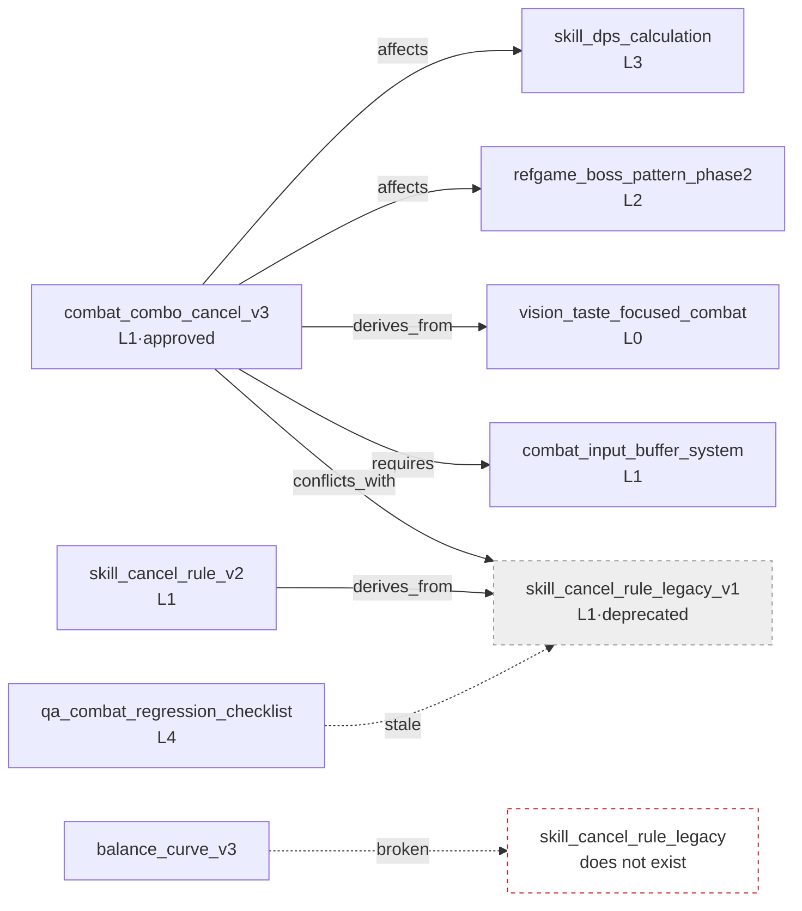

# 2.4 Ontology and the Wikilink Graph — Verifying the Semantic Arrows

Monday morning, a change request comes in. Team member A on the combat team posts one line in the team messenger: "Changing the global cooldown from 0.5s to 0.3s. Does this affect anything?" Normally this is where a 30-minute meeting starts. The owner of the damage formula raises a hand, the owner of the combo-cancel rules cuts in, and someone asks, "Doesn't this hit the boss patterns too?" Nobody holds the whole picture in their head, so the meeting fills up with people digging through their memories.

This time is different. One second after the request goes up, a bot posts an automatic comment: "Changing this atom affects 4 atoms: `skill_dps_calculation`, `combat_combo_cancel_v3`, `refgame_boss_pattern_phase2`, `balance_curve_v3`. Owners: team member B, team member A, team member C." No meeting was held. Four people each checked their own atom, and that was the end of it. (We build this bot ourselves later — 2.4.3.)

This comment is not magic. In 2.3 we gave every atom a Layer coordinate, and in this chapter we add **semantic arrows** on top of it — which decision affects which. A coordinate only says "something is here." Relations like "this affects that," "that must exist first," "these two must never be enabled together" are arrows drawn on top of the coordinates. This chapter covers how to notate those arrows and how to catch broken ones automatically.

> **Terminology Notes**
> - Ontology: a system that explicitly defines concepts and the relations between them. This book uses a lightweight version simplified down to 6–12 relations.
> - wikilink: an inter-document link in the `[[atom_name]]` format. The notation is borrowed from Obsidian, Roam, and similar tools.
> - Backlink: the list of "atoms that point at this atom" — the reverse direction of a forward reference.
> - Orphan node: an atom referenced from nowhere. A signal that it is a deprecation candidate.
> - Broken link: a wikilink pointing at an atom that does not exist. The residue of typos and renames.

---

## 2.4.1 Relations Are Arrows — Why Wikilinks Alone Are Not Enough

In 2.1 we attached metadata with YAML frontmatter, and we scattered wikilinks through atom bodies. That alone already connects the documents into a mesh. The problem is that **the connections say nothing about what they mean**.

```markdown
This decision stands on [[skill_cooldown_rule_v2]].
```

This one line — "this decision stands on `[[skill_cooldown_rule_v2]]`" — says only that the rule is mentioned. Why is it mentioned? Does this decision **need** that rule (requires), was it **derived from** it (derives_from), or does it **conflict with** it (conflicts_with)? A person reading the sentence knows; a machine does not. Ask the AI "does enabling this decision break anything?" and links without meaning cannot answer.

So we put a **relation type** on each wikilink. The relations actually used in game design work are surprisingly few. The following six cover more than 90% of cases.

<svg viewBox="0 0 720 250" xmlns="http://www.w3.org/2000/svg" font-family="sans-serif" font-size="13">
  <rect x="0" y="0" width="720" height="250" fill="#fbfbfd" stroke="#ddd"/>
  <!-- affects -->
  <rect x="20" y="20" width="120" height="44" rx="6" fill="#fff" stroke="#222"/>
  <text x="80" y="40" text-anchor="middle" font-weight="bold">affects</text>
  <text x="80" y="56" text-anchor="middle" fill="#666">influences</text>
  <!-- derives_from -->
  <rect x="160" y="20" width="120" height="44" rx="6" fill="#fff" stroke="#1a66cc"/>
  <text x="220" y="40" text-anchor="middle" font-weight="bold" fill="#1a66cc">derives_from</text>
  <text x="220" y="56" text-anchor="middle" fill="#666">derived from</text>
  <!-- requires -->
  <rect x="300" y="20" width="120" height="44" rx="6" fill="#fff" stroke="#e08a00"/>
  <text x="360" y="40" text-anchor="middle" font-weight="bold" fill="#e08a00">requires</text>
  <text x="360" y="56" text-anchor="middle" fill="#666">must exist first</text>
  <!-- conflicts_with -->
  <rect x="440" y="20" width="130" height="44" rx="6" fill="#fff" stroke="#cc2222"/>
  <text x="505" y="40" text-anchor="middle" font-weight="bold" fill="#cc2222">conflicts_with</text>
  <text x="505" y="56" text-anchor="middle" fill="#666">mutually exclusive</text>
  <!-- is_a -->
  <rect x="590" y="20" width="110" height="44" rx="6" fill="#fff" stroke="#888"/>
  <text x="645" y="40" text-anchor="middle" font-weight="bold" fill="#888">is_a</text>
  <text x="645" y="56" text-anchor="middle" fill="#666">special case</text>
  <!-- part_of -->
  <rect x="300" y="90" width="120" height="44" rx="6" fill="#fff" stroke="#bbb"/>
  <text x="360" y="110" text-anchor="middle" font-weight="bold" fill="#999">part_of</text>
  <text x="360" y="126" text-anchor="middle" fill="#666">part of</text>
  <!-- example wiring -->
  <text x="360" y="175" text-anchor="middle" fill="#333" font-size="14">e.g. combat_combo_cancel_v3 —[affects]→ skill_dps_calculation</text>
  <text x="360" y="200" text-anchor="middle" fill="#333" font-size="14">combat_combo_cancel_v3 —[derives_from]→ vision_taste_focused_combat</text>
  <text x="360" y="225" text-anchor="middle" fill="#333" font-size="14">combat_combo_cancel_v3 —[requires]→ combat_input_buffer_system</text>
</svg>

The atom that freezes these six as an enum is `ontology_relation_enum_v1`. Adding a new relation type means going through change-request review. Even as the set grows, 10–12 is the right ceiling, and starting with just three — affects, derives_from, requires — is plenty. The place to write relations is the atom's YAML frontmatter.

```yaml
---
name: combat_combo_cancel_v3
layer: 1
affects: [skill_dps_calculation, refgame_boss_pattern_phase2]
derives_from: [vision_taste_focused_combat]
requires: [combat_input_buffer_system, skill_cooldown_rule_v2]
conflicts_with: [skill_cancel_rule_legacy_v1]
---
```

A person writes only the forward direction, one line. The reverse direction ("who affects me?") is computed by a tool scanning the whole folder. Write affects on both ends and the synchronization burden doubles; the moment you fix one side and forget the other, the graph starts lying. **One direction by hand, the other direction by tool** — that is the principle running through this entire chapter.

---

## 2.4.2 Worked Transcript — Verifying Wikilink Backlinks and Graph Integrity in One Pass

From here on I reproduce one real session in full. The situation: while replacing the combo-cancel rule v2 with v3, we decided to deprecate `skill_cancel_rule_legacy_v1`. But before deprecating it, we have to check **whether any other atom points at this atom** (backlinks) and **whether the deprecation leaves broken links or conflicts behind** (graph integrity). Grep by hand and you will miss things. I hand it to Claude.

### The Prompt (in Full)

```
The attached atom folder (decisions/) contains atoms, and their frontmatter
should carry relations (affects/derives_from/requires/conflicts_with/is_a/part_of).
The bodies contain wikilinks too. I want to deprecate skill_cancel_rule_legacy_v1
— before deprecating, run 3 checks: 1) backlinks 2) broken links
3) conflicts. Don't guess; actually read the files and answer. If you can't find something, say so.
// backlinks = both YAML relations + body wikilinks / broken links = links that go stale or dangling on deprecation
// conflicts = whether any conflicts_with counterpart is still alive with status: approved
```

*(In English: "The attached atom folder, decisions/, contains atoms; their frontmatter carries relations (affects/derives_from/requires/conflicts_with/is_a/part_of) and their bodies contain wikilinks. I want to deprecate skill_cancel_rule_legacy_v1 — before that, run 3 checks: 1) backlinks 2) broken links 3) conflicts. Don't guess; actually read the files and answer. If you can't find something, say so. // backlinks = both YAML relations and body wikilinks / broken links = links that go stale or dangling on deprecation / conflicts = whether any conflicts_with counterpart is still alive with status: approved")*

### Claude's Output (Raw — Not Summarized, Not Cleaned Up)

*(Claude's output below is translated from the Korean original; identifiers, counts, and structure are unchanged.)*

> I read the 47 files in the decisions/ folder. Here are the results of the 3 checks for `skill_cancel_rule_legacy_v1`.
>
> **1. Backlinks (atoms that point at this atom)**
>
> Atoms pointing at it via YAML relations:
> - `combat_combo_cancel_v3` — `conflicts_with: [skill_cancel_rule_legacy_v1]`
> - `skill_cancel_rule_v2` — `derives_from: [skill_cancel_rule_legacy_v1]`
>
> Atoms pointing at it via body wikilinks:
> - `combat_combo_cancel_v3` body: "solves the input-buffer problem of the legacy `[[skill_cancel_rule_legacy_v1]]`"
> - `qa_combat_regression_checklist` body: "regression item 3 was written against `[[skill_cancel_rule_legacy_v1]]`"
>
> So **4 atoms reference this atom**. (2 via YAML + 2 via body wikilinks; since combat_combo_cancel_v3 appears on both sides, the actual atom count is 3.)
>
> **2. Broken links (what breaks on deprecation)**
>
> Deprecation by itself does not "break" any wikilink — the file stays, and only its status becomes deprecated. However:
> - `qa_combat_regression_checklist` defines a regression item against the deprecated atom, so it becomes **invalid in substance**. That is not a broken link, but it is a stale link. Needs review.
> - If you go as far as **deleting** the file, all 4 references above become broken links.
>
> ⚠️ One ambiguous point: the body of `balance_curve_v3` contains a link `[[skill_cancel_rule_legacy]]` (no `_v1` at the end). Whether this is a typo meant to point at `_v1`, or intentionally refers to a separate atom, I cannot tell from the files alone. There is **no** file named `skill_cancel_rule_legacy` in the folder. So this is most likely an already-broken link. It needs confirmation.
>
> **3. Conflict residue (is the conflicts_with counterpart alive?)**
>
> Atoms tied to `skill_cancel_rule_legacy_v1` by `conflicts_with`: just one, `combat_combo_cancel_v3`.
> - status of `combat_combo_cancel_v3`: **approved** (alive)
>
> → The new rule that conflicted with the deprecation target is in normal approved status. This is fine. It is the natural replacement — the old version retires and the new one survives. **Not a conflict-residue warning.**
>
> ---
> **Summary**: deprecation is safe, but handle two things first.
> (a) The stale link in `qa_combat_regression_checklist` — update regression item 3.
> (b) `[[skill_cancel_rule_legacy]]` in `balance_curve_v3` — suspected typo. May already be a broken link.

### Human Verification and Rejection

Here I did not take the output at face value. (a) is correct — the regression checklist is mine to update. But I stopped at (b). Claude called the `[[skill_cancel_rule_legacy]]` in `balance_curve_v3` a "suspected typo," but I had to look at the folder myself to see whether it really was a broken link. An AI's "I cannot tell" is an honest signal, not a conclusion.

I opened the folder and checked: a file named `skill_cancel_rule_legacy` really did not exist. But the git log showed a commit from 6 months earlier that had done one thing — **renamed** `skill_cancel_rule_legacy` → `skill_cancel_rule_legacy_v1`. The body link in `balance_curve_v3` never got updated then and slipped through. So this was not a typo; it was **a broken link orphaned by a rename**. Claude's "suspected typo" guess was only half right. The cause was not a typo but an unpropagated rename. Had I not caught that difference, I would have fixed only the regression checklist and the broken link would have stayed buried.

### The Follow-Up Request (Reflecting the Confirmed Facts)

```
Confirmed. [[skill_cancel_rule_legacy]] was not a typo — it was a broken link
from a rename 6 months ago (_legacy → _legacy_v1) whose body link never got fixed.

So while we're at it, find every "wikilink pointing at a nonexistent atom"
across the whole folder. By body wikilinks, everything whose target file is missing from the folder.
A table of each file and the broken links inside it.
```

*(In English: "Confirmed. [[skill_cancel_rule_legacy]] was not a typo — it was a broken link from a rename 6 months ago (_legacy → _legacy_v1) whose body link never got fixed. So while we're at it, find every wikilink in the whole folder that points at a nonexistent atom — by body wikilinks, everything whose target file is missing from the folder. A table of each file and the broken links inside it.")*

> I collected every `[[...]]` body wikilink across the 47 files and checked them against the folder's file list. Broken links whose target file does not exist: **3**.
>
> | File containing the link | Broken wikilink | Suspected cause |
> |---|---|---|
> | `balance_curve_v3` | `[[skill_cancel_rule_legacy]]` | rename not propagated (→ `_v1`) |
> | `quest_reward_table_v2` | `[[concept_reward_currency]]` | target atom never written (planned, but no file) |
> | `refgame_boss_pattern_phase2` | `[[skill_global_cooldown]]` | rename not propagated (→ `skill_global_cooldown_rule`) |
>
> Of the 3, the 2 rename cases can be fixed by correcting the target atom name to `_v1` / `_rule`. In the 1 remaining case (`concept_reward_currency`), the target atom itself does not exist — you either write it or remove the link. I did not fix anything automatically — confirm which you intended, then proceed.

All three were real. Grepping by hand, I would almost certainly have missed the broken link in `quest_reward_table_v2`. That link was an intentional forward reference — pointing ahead at an atom not yet written — and after 6 months in which nobody wrote that atom, it had become, in effect, a dead promise.

What this session shows is simple. **Backlink detection and broken-link detection are work the AI is strong at — reading an entire folder and cross-checking it — while cause determination and intent confirmation belong to the human.** The AI goes as far as "this is broken here"; the human goes as far as "why it broke and how to fix it."

---

## 2.4.3 What a Graph Makes Visible — Turning Verification Visual

You could rerun the previous section's checks as a prompt every time, but freeze the same checks into code and they become visible at a glance on a graph. On Project A, a graph tool extending the `gen_relation_map.py` introduced in 2.3 runs as an R&D effort. The core is to read the folder's atoms, build a `networkx` directed graph, and lay four check functions on top.

```python
import networkx as nx

# build_graph(folder): reads the atom folder and builds a DiGraph
#   from nodes (=atoms) and YAML relation edges. (Full source in "Try It Yourself")

def find_cycles(G):                      # circular dependencies
    return list(nx.simple_cycles(G))

def find_orphans(G):                     # inbound 0 = orphan candidate
    return [n for n in G.nodes if G.in_degree(n) == 0]
```

The heart of it is two lines. `simple_cycles` catches circular dependencies (A requires B requires C requires A), and `in_degree(n) == 0` catches orphan nodes — no need to write your own DFS. The remaining two functions are one-liners of the same grain. `find_broken_wikilinks` collects the body `[[...]]` links with a regex and picks out the ones missing from the node list, and backlinks fall out of walking the graph in reverse (full source in "Try It Yourself"). For visualization, color nodes by Layer and edges by relation type, and draw heavily referenced nodes (those with many inbound edges) larger so the hubs stand out. Like folders in a cabinet sorted with color labels, the patterns surface in your field of view before you go hunting for them.

Below is a graph of the actual relations among the atoms covered in the 2.4.2 session. The arrow direction means "the source atom asserts a relation toward the target atom."



The two dashed edges are the problems caught by human verification in 2.4.2. `qa → legacy` is the stale link against a deprecated atom; `balance_curve_v3 → skill_cancel_rule_legacy` is the broken link pointing at a node that does not exist. Drawn as a graph, those two dashed lines stand out among the solid ones. Run everything as text alone and they would have stayed buried somewhere across 47 files, never to be seen.

Four rules run automatically at the verification gate (Layer 4) — this book's term for what the industry calls a quality gate, the stage where automated checks pass or block a change.

- **Circular dependency**: warn when a `requires` chain loops back to itself. Detected with `simple_cycles`.
- **Active conflict**: warn when two atoms tied by `conflicts_with` are both `status: approved`. (The case in 2.4.2 passes because one side is deprecated.)
- **Orphan nodes**: an atom with zero inbound edges and no parent is a deprecation candidate, reviewed quarterly. The atom `graph_orphan_detection_quarterly` codifies that cadence.
- **Layer inversion**: an L1 → L3 affects is normal (a higher-level decision affecting lower-level data); an L3 → L1 affects is suspect. Same principle as the reverse-reference detection in 2.3. Because the atom `docs_layer_numeric_prefix_naming` forces a Layer-number prefix on document names, inversions get a first-pass filter from filenames alone.

Once these four rules harden into code, there is no need to write a prompt each time as in 2.4.2. The moment a change request goes up, the bot rebuilds the graph and posts the list of affected atoms plus any broken links, cycles, and conflicts as an automatic comment. The "4 atoms will be affected" comment at the top of this chapter is exactly this — the bot promised earlier.

---

## 2.4.4 Why Layers — Coordinates Drawn for Procedural Generation

Here we need to pause on why 2.3 and 2.4 belong together. Layer coordinates and relation arrows were not adopted separately; they are two faces of the same purpose.

On the surface, Layers unify the language of collaboration — call one thing "an L1 system decision" and another "L3 data," and people in different disciplines share the same coordinates. But the essential purpose lies elsewhere. **Layers were coordinates drawn for procedural generation.**

L0 vision is the context anchor — immutable, injected into the AI every time. L1 systems are the input rules of generation — rulebooks, relations, and tags live here. L2 content is where the generated body accumulates; L3 data is the simulation input of values, IDs, and relations; L4 build/QA is the verification gate. The relation arrows operate on these coordinates as **constraints on generation**. When the AI creates new content, a `requires` arrow becomes the precondition "this must exist first," and a `conflicts_with` arrow becomes the prohibition "these must not be enabled together."

Disciplines keep specializing (combat, quests, and economy each hold their own expertise), yet every artifact carries a Layer coordinate, so they stay aware of one another. Specialization and integration hold simultaneously on one coordinate system. Once this graph has grown enough, the AI generates candidates while reading the relation arrows as automatic constraints, and the human only confirms violations at the review gate. The worked transcript in 2.4.2 is the miniature of that — the AI read the graph and found the constraint violations (broken links, conflicts), and the human ruled at the gate.

---

## 2.4.5 Domain Concepts Are Nodes Too — A Small Shared Dictionary

The nodes at the start and end of relation arrows are not only decision atoms. Atoms that define domain concepts like "skill," "quest," and "reward" are first-class citizens of the graph. `concept_skill_definition_v1` looks like this.

```markdown
# Skill
Definition: A unit action a character triggers in combat. Comprises input, cooldown, cost, and effects.
Required Properties: input / cooldown / cost / effects
Subtypes: active_skill (is_a) / passive_skill (is_a) / ultimate_skill (is_a)
Not a skill: auto attack [[concept_auto_attack]] / transformation [[concept_transformation]]
```

*(The definition reads: a skill is a unit action a character triggers in combat, comprising input, cooldown, cost, and effects; auto attacks and transformations are explicitly not skills.)*

Write `boss_skill is_a skill` and the parent concept's rules are inherited automatically. Project A has about 19 of these concept-definition atoms, and every decision atom references them. When the vocabulary is unified into one dictionary, the translation burden between meetings, documents, and code disappears. It is keeping one shared dictionary instead of a different one on every desk. The `concept_reward_currency` caught as a broken link in the worked transcript earlier was exactly that — "an entry promised for the dictionary but never written."

---

## 2.4.6 Keep It Light — The Trap of Academic Ontologies

Read this far and the question comes up: "isn't this a formal ontology like OWL/RDF?" No. And it was deliberately built not to be one.

Academic ontologies (OWL, RDF, SKOS) are powerful, but they come with dozens to hundreds of relation types, require dedicated inference engines, and need an ontology specialist on staff to operate. In domains where precise inference is life-or-death — search engines, medicine, law — they are essential. But the inference game design actually needs is only "change impact scope," "prerequisite dependencies," and "conflict detection," and all of it ends at the level of simple traversal — BFS/DFS, walking the graph one step at a time. The previous section catching cycles with one line of `networkx` is the proof. A formal inference engine is overkill.

There is one criterion. **Can a game designer operate it by hand?** Six YAML enums, `networkx` processing, pyvis or D3.js visualization. The moment you cross that line, the tool stops being a tool and becomes one more burden. Lightness is not a compromise; it is design intent.

Five recurring mistakes undermine this. All of them grow from the same root: treating the ontology as an enforced standard.

| Mistake | How to avoid it |
|---|---|
| Defining too many relation types up front | Start with three (affects, derives_from, requires); add only when needed |
| Forcing relations onto every decision | Accept atoms with no relations as normal — empty relations pollute the graph |
| Writing affects in both directions | One direction by hand; compute the reverse automatically with the tool |
| Fixating on OWL/RDF | Stay at an operable level (YAML + enum) |
| Running text-only with no visualization | Ship even a plain HTML view from day one — like the dashed lines in 2.4.3, what you cannot see, you do not fix |

Mistakes 1, 2, and 3 settle into a pattern within the first month of adoption; review 4 and 5 at the three-month retrospective and they fall into line naturally.

---

## 2.4.7 Starting Small, and the Next Chapter

The first month runs at a loss. The burden of writing relations piles up while no visible payoff arrives. So start small. In the first week, use only the three relations affects, derives_from, requires; in weeks 2–4, apply them to 20 core atoms and watch the graph grow. Build one HTML graph view at the level of the previous section in the first month, and from the second month the visualization starts showing its value; by the third month, automated verification (cycles, conflicts, orphans, broken links) is directly cutting meeting time. Enduring that one month of deficit is the fork between adoption succeeding and failing.

Chapter 8, Wikilink, digs into the `[[...]]` notation this chapter treated as arrows, at the operational level — how to use the backlink panel daily, how to update links in bulk on a rename (how to prevent the unpropagated rename of 2.4.2 in the first place), and how to fold the graph view of tools like Obsidian into day-to-day practice. YAML (Chapter 4) → Atom (Chapter 5) → Layer (Chapter 6) → Ontology (Chapter 7) → Wikilink (Chapter 8) — the completed pentagon of the information architecture.

---

## Try It Yourself

**setup.** Pick the folder where your atoms live (e.g., `decisions/`) and get ready to write relation keys in each atom's YAML. Start with just three: `affects`, `derives_from`, `requires`. Unify body links in the `[[atom_name]]` format.

**prompt.** Before any deprecation or rename, throw this at the AI.

```
Read the markdown atoms in this folder. I want to deprecate/change [target_atom].
(1) backlinks: every atom that points at this atom via YAML relations or body wikilinks
(2) broken links: links that break or go stale on change/deletion
(3) conflict residue: any conflicts_with counterpart with status: approved
Check these. Don't guess — actually read the files, and if you can't find something, say so.
```

*(In English: "Read the markdown atoms in this folder. I want to deprecate/change [target_atom]. Check (1) backlinks: every atom that points at it via YAML relations or body wikilinks, (2) broken links: links that break or go stale on change/deletion, (3) conflict residue: any conflicts_with counterpart with status: approved. Don't guess — actually read the files, and if you can't find something, say so.")*

**verify.** Open every spot the AI marked "suspected typo" or "cannot tell" yourself. The **cause** of a broken link — typo, unpropagated rename, or never written — is for the human to rule on, with the git log and the actual folder. Don't let the AI auto-fix; confirm the intent, then fix it yourself.

### The Graph Tool in Full (Excerpted in 2.4.3)

The body text (2.4.3) showed only the two core functions. The full version that builds the graph from the whole folder and runs the four checks follows.

```python
import networkx as nx
import re, yaml, glob, os

REL_TYPES = ["affects", "derives_from", "requires",
             "conflicts_with", "is_a", "part_of"]
WIKILINK = re.compile(r"\[\[([a-zA-Z0-9_]+)\]\]")

def build_graph(folder):
    G = nx.DiGraph()
    files = {}
    for path in glob.glob(os.path.join(folder, "*.md")):
        name = os.path.splitext(os.path.basename(path))[0]
        text = open(path, encoding="utf-8").read()
        fm = yaml.safe_load(text.split("---")[1]) or {}
        files[name] = fm
        G.add_node(name, layer=fm.get("layer"), status=fm.get("status"))
    # YAML relation edges
    for name, fm in files.items():
        for rel in REL_TYPES:
            for tgt in (fm.get(rel) or []):
                G.add_edge(name, tgt, type=rel)
    return G, files

def find_broken_wikilinks(folder, known_nodes):
    broken = []
    for path in glob.glob(os.path.join(folder, "*.md")):
        text = open(path, encoding="utf-8").read()
        for m in WIKILINK.findall(text):
            if m not in known_nodes:
                broken.append((os.path.basename(path), m))
    return broken

def find_orphans(G):
    # inbound 0 and no part_of/is_a parent either
    return [n for n in G.nodes if G.in_degree(n) == 0]

def find_cycles(G):
    return list(nx.simple_cycles(G))
```

### Solo Scale-Down

You don't need the tooling. One atom folder and Claude are enough. When you write a new decision, add just two YAML lines — `requires` and `affects` — and whenever a deprecation or rename comes up, run the prompt above once. Graph visualization is a problem for later. The habit of sweeping for broken links and conflicts right before a change — that single pass is what prevents the biggest deficit in solo operation.

---

### Key Takeaways
- Only when semantic arrows are layered onto the coordinates can "what affects what" be inferred automatically
- The AI does backlink and broken-link detection; the human does cause determination and intent confirmation
- Lightness is not a compromise but design intent — a tool you cannot operate by hand becomes a burden
