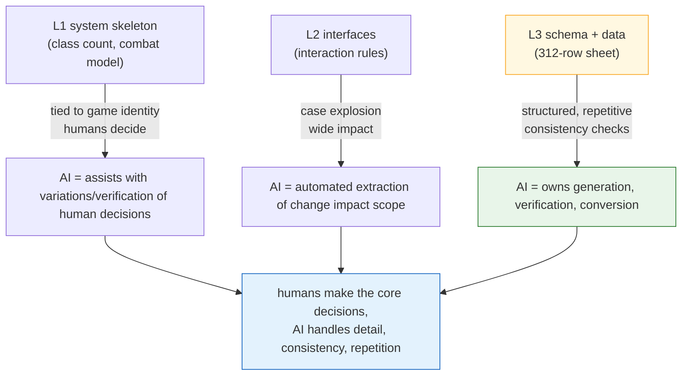

# 3.1 The Systems Designer's Work and Layer Coordinates

Thursday, 4:50 p.m. The skill sheet the balance designer had been filling in had just landed. 312 skills. Each skill has a column called `effect_id` where an effect number goes, and that number points to a row in a separate effect sheet. The two have to line up for the game to run. If they don't, the client calls an empty effect or dies quietly.

I used to check this by hand. One cell in the skill sheet, jump to the effect sheet, confirm the number, jump back. 312 times. Two hours at best. In the last 50 rows, eyes glazing over, I always missed one or two — and those one or two blew up in the QA build.

This chapter is about where those two hours went, and about which coordinate that consistency check occupies on the systems designer's map of work. If you don't fix the coordinates first, you will forever be deciding by gut feel where to plug in AI.

---

## 3.1.1 A Systems Designer Makes Four Things

The systems designer is the person who travels the widest range between the abstract and the concrete. They take the fog called vision and haul it all the way down to the hard numbers in the last cell of a data sheet. Four kinds of deliverables come out of that journey.

**(1) Translating vision into structure.** When the director says "action combat where every hit lands with real impact," the systems designer turns that into a skeleton of skills, combos, cancels, and hitstop. "Player agency over growth" becomes class, skill tree, and equipment systems. It is the first moment fog turns into structure.

**(2) Specifying the interfaces between systems.** Combat, movement, inventory, shops, quests, and guilds all run at once. Does opening the inventory mid-combat grant invincibility? What if a PvP request arrives in the middle of an enhancement? The answers to these cases add up to the feel of a "well-made" game. Every spot where an answer is missing is a spot where players feel friction.

**(3) Owning the data sheets and their schemas.** Coefficients for 312 skills, effects for hundreds of items, behaviors for dozens of monster types. The values they either fill in directly or hand off to the balance and content disciplines. But the **column definitions (the schema)** of the sheets stay in the systems designer's hands. It is the job of building labeled drawers. If the drawers are sloppy, everyone fills them differently and consistency breaks.

**(4) Designing behavior logic.** Character and monster AI comes out in forms like finite state machines (FSM), Behavior Trees (hereafter BT), decision tables, and procedural rules. This material goes to the programmers and becomes code.

The key point is that all four meet on one person's desk. That is why "what do I spend today on" becomes the systems designer's biggest operational decision.

---

## 3.1.2 System Deliverables Have Layer Coordinates

In 2.3 we placed every game-production artifact on a coordinate axis running from L0 (vision) to L4 (build). Now we plot the four deliverables from 3.1.1 directly onto that axis. Few disciplines scatter their deliverables across as many Layers as systems design does.

The following map shows, on a single page, where each deliverable lives on the Layers and whom you meet at each coordinate.

<svg viewBox="0 0 720 360" xmlns="http://www.w3.org/2000/svg" font-family="sans-serif" font-size="13">
  <!-- Layer bands -->
  <rect x="20" y="20" width="680" height="60" fill="#eceff1" stroke="#b0bec5"/>
  <rect x="20" y="80" width="680" height="60" fill="#e3f2fd" stroke="#90caf9"/>
  <rect x="20" y="140" width="680" height="60" fill="#e8f5e9" stroke="#a5d6a7"/>
  <rect x="20" y="200" width="680" height="60" fill="#fff8e1" stroke="#ffe082"/>
  <rect x="20" y="260" width="680" height="60" fill="#eceff1" stroke="#b0bec5"/>
  <!-- Layer labels -->
  <text x="34" y="55" font-weight="bold">L0</text>
  <text x="34" y="115" font-weight="bold" fill="#1565c0">L1</text>
  <text x="34" y="175" font-weight="bold" fill="#2e7d32">L2</text>
  <text x="34" y="235" font-weight="bold" fill="#f9a825">L3</text>
  <text x="34" y="295" font-weight="bold">L4</text>
  <!-- Layer descriptions -->
  <text x="80" y="55" fill="#607d8b">Vision — the systems designer only receives it</text>
  <text x="80" y="108" fill="#0d47a1">System skeleton: defining classes, combat, inventory, guilds</text>
  <text x="80" y="168" fill="#1b5e20">Interfaces: inter-system interaction rules and priorities</text>
  <text x="80" y="228" fill="#e65100">Schema + data: sheet column definitions, some values</text>
  <text x="80" y="295" fill="#607d8b">Build — QA verifies the intent is reflected</text>
  <!-- Collaborator column -->
  <line x1="500" y1="20" x2="500" y2="320" stroke="#90a4ae" stroke-dasharray="4 3"/>
  <text x="512" y="55" fill="#607d8b" font-size="12">↔ Director / narrative</text>
  <text x="512" y="115" fill="#1565c0" font-size="12">↔ Art direction</text>
  <text x="512" y="175" fill="#2e7d32" font-size="12">↔ Other systems designers</text>
  <text x="512" y="235" fill="#f9a825" font-size="12">↔ Balance / content</text>
  <text x="512" y="295" fill="#607d8b" font-size="12">↔ QA</text>
  <!-- responsibility arrow -->
  <line x1="62" y1="90" x2="62" y2="250" stroke="#c62828" stroke-width="2.5" marker-end="url(#ah)"/>
  <defs>
    <marker id="ah" markerWidth="8" markerHeight="8" refX="4" refY="4" orient="auto">
      <path d="M0,0 L8,4 L0,8 Z" fill="#c62828"/>
    </marker>
  </defs>
  <text x="335" y="338" fill="#c62828" font-size="12" font-weight="bold">The segment the systems designer builds directly (L1→L3)</text>
</svg>

This map says two things. First, the systems designer is responsible for the long distance of **receiving** L0 and making it **reach** L4. Second, the segment they build with their own hands is L1–L3, and the collaboration partner changes at each of those three bands. Every band switch changes the collaboration language, so if you are not conscious of the coordinates, meetings keep spinning their wheels.

This does not mean one person touches all of L1–L3, though. On a large team, the L1–L2 owner and the L3 owner split. On a small team, one person covers it all. The coordinates are a map for dividing roles, not an order to dump everything on one person.

---

## 3.1.3 Once the Coordinates Are Set, the Slots for AI Become Visible

The map is drawn; now we color it in. Which coordinates get the biggest return on AI? Not a blanket "automate everything" — you choose by the nature of each coordinate.



The key is that **the lower the coordinate, the larger the share AI can own outright**. L1's "how many classes should we have" is game identity, so a human must hold it. At the other end, L3's "do all 312 rows of foreign keys line up" is structured and repetitive, so AI should take it whole. L2 sits in between — the human makes the decision, while AI backs it by extracting the impact scope: "if we change this rule, how far does it shake?"

This diagram explains why every exercise from 3.1.4 onward starts near L3. It is the spot with the biggest payoff and the smallest risk. A malfunctioning schema tool causes no accident, the relation map only draws pictures, and the consistency check can be vetoed by a human.

---

## 3.1.4 Worked Transcript: Handing the Consistency Check to AI at Coordinate L3

That is it for theory. Now back to that Thursday at the start of 3.1. We have AI check whether the `effect_id` of all 312 skills matches the effect sheet. No summarizing — I transcribe the exchange exactly as it happened.

Data entry follows the `schema-first` principle: a human first defines the **spec sheet**, the Enum and `.proto` come out of it (via a VBA — Excel's macro language — export), and the csv data is filled in last. So the verification prompt also starts with "read the schema first." And it nails down that the source of truth is not the schema document but the **actually exported JSON** (`json_over_schema_doc_as_source_of_truth`). Documents can lie; exported JSON cannot.

### The Prompt (in Full)

> You are our project's data consistency checker.
> The input is two exported JSON files.
> 1) `skill.json` — each skill object has `skill_id`, `name`, and `effect_id` fields.
> 2) `effect.json` — each effect object has `effect_id` and `effect_type`.
>
> Check the following.
> (A) Does every `effect_id` in `skill.json` exist in `effect.json` (foreign key integrity)?
> (B) Orphan effects — present in `effect.json` but referenced by no skill.
> (C) Rows in `skill.json` where `effect_id` is empty or 0.
>
> Rules: do not guess. If a field is not in the JSON, report it as "field missing."
> Output in three sections (A)(B)(C); for each violation, one line with the `skill_id` (or effect_id) and the reason.
> If a section has no violations, write only "no violations" in it.

### Claude's Raw Output (Untouched, Unpolished)

> I have not received the two input JSON files. No file contents are attached to the current message.
> Please resend one of the following:
> - The actual contents of `skill.json` and `effect.json` (pasted or attached as files)
> - Or the paths to the two files
>
> Once I have the contents, I will check in (A)(B)(C) order. I will not fabricate results without the files.

Stopping here was, if anything, the signal of trustworthiness. If a plausible report had come back on empty input, that very neatness would be the red flag. The one that asks "give me the files first" instead of conjuring inspection results out of thin air is the one you can trust. I actually pasted the two JSONs in and asked again (only excerpts appear here, for length).

```json
// skill.json (excerpt)
[
  {"skill_id": 1001, "name": "Heavy Strike",   "effect_id": 5001},
  {"skill_id": 1002, "name": "Spinning Slash", "effect_id": 5002},
  {"skill_id": 1003, "name": "Shield Raise",   "effect_id": 0},
  {"skill_id": 1004, "name": "Poison Coat",    "effect_id": 5099}
]
```

```json
// effect.json (excerpt)
[
  {"effect_id": 5001, "effect_type": "DAMAGE"},
  {"effect_id": 5002, "effect_type": "DAMAGE"},
  {"effect_id": 5003, "effect_type": "BUFF"}
]
```

### Claude's Second Output (on the Real Data)

> **(A) Foreign key integrity — 1 violation**
> - `skill_id: 1004` → `effect_id: 5099` does not exist in `effect.json` (dangling reference)
>
> **(B) Orphan effects — 1 violation**
> - `effect_id: 5003` (BUFF) → referenced by no skill
>
> **(C) Empty/0 effect_id — 1 violation**
> - `skill_id: 1003` → `effect_id: 0`. Could be an intended "no effect" — needs confirmation against the schema whether 0 is a valid value.

### Human Verification and Veto

Two of the three were clear bugs. `5099` was a number the balance designer had written into the skill sheet before adding the row to the effect sheet — the classic out-of-order edit. Caught.

But (C) I **vetoed**. In our project, `effect_id: 0` is a valid agreed-upon value meaning "passive slot, no effect." The AI does not know that, so it raised "needs confirmation" — a sound judgment, but not something to count as a violation. So I moved to the next step: codify this convention as an atom, so that from the next check onward the AI knows 0 is a valid value.

### The Follow-Up Request (Injecting Domain Knowledge)

> Additional rule: `effect_id == 0` is a valid agreed-upon value in our project, meaning "passive, no effect."
> Therefore `effect_id == 0` is not a (C) violation. Report only empty strings, null, and negative numbers as (C) violations.

> **(C) Empty/0 effect_id — no violations**
> (`effect_id: 0` treated as a valid agreed-upon value. No empty/null/negative values.)

This one-line convention is exactly how domain knowledge accumulates. Systems design decisions are relatively permanent, so once you pin one down, the same check runs on the same standard a year later. One more decision card stacked in the cabinet.

In this transcript the human did only **three things** — (1) specified the input order: read the schema first; (2) confirmed that `5099` was a real bug; (3) knew that `0` was valid, and vetoed and corrected the AI's call. The two hours of jumping cell by cell through the other 312 rows are gone. What got automated was the labor of jumping and cross-checking; the three lines of judgment that remain are the core.

---

## 3.1.5 Accumulating Assets: Hardening the Coordinates into Code

You could order up the transcript's check by hand every time, but hardening work that repeats at L3 into tools is systems design orthodoxy. I will cite the two I actually operate — not abstract "Project A tools" but things that genuinely run on my desk.

`gen_relation_map.py` analyzes a sheet's column names and values, auto-detects foreign key relationships, and produces an interactive HTML relation map. Where 3.1.4 had a human drawing the arrow `skill.effect_id → effect.effect_id` in their head, this script draws that arrow as a picture across the entire sheet set. Spots where a dependency runs backward (the danger of L3 data reverse-referencing the L1 skeleton) jump out of the picture instantly.

The `schema-doc` skill parses the xlsm's **$스키마 (schema) sheet** and auto-generates a Markdown schema document. The very schema behind 3.1.4 (C)'s question — "needs confirmation against the schema whether 0 is a valid value" — becomes something a person can read fresh without digging through other files. When the sheet changes, the document follows, which shrinks the chronic disease of documents drifting away from the actual data.

Restating the two tools' positions in coordinates: `schema-doc` guards the **column definitions** at L3, and `gen_relation_map.py` guards the **relationships** between L2 and L3. AI-assisted prompts (verification like 3.1.4) run on top of them. The three are not separate acts — they cover different heights of the same coordinate axis.

You will walk through these tools hands-on in 3.2, 3.3, and 3.4. 3.1 was the map for deciding where to plug things in; the next three chapters do the plugging.

---

## 3.1.6 Gradual Adoption: Start from the Low-Risk Coordinates

Switch on all three tools at once, and the operating burden arrives before the benefit. In my experience the safe order starts from the coordinates where the risk is small (the lower ones).

| Timing (suggested) | Adoption | Coordinate | What happens if it goes wrong |
|---|---|---|---|
| Month 1 | Schema first (3.2) | L3 | A document misses one update, nothing more |
| Months 2–3 | Relation map visualization (3.3) | L2–L3 | A diagram is inaccurate, nothing more |
| Months 3–6 | AI-assisted prompts (3.4) | L1–L3 | Everything passes verification, so a human can veto |

The timeline is not an absolute standard. Depending on team size and existing infrastructure, it could take twice as long or finish in half the time (author's estimate, unverified). What does not change is the **order**. By putting the riskiest decision support last, you touch the most sensitive spot only after the first two tools have already built the team's verification habit.

---

## 3.1.7 Measurement — Honestly

I record the numbers without polish. What follows was observed on the design team (4–5 people; the full dev team is mid-sized at 10–50; about 6 months of operation) of the MMORPG project I run as director ("Project A" below). It is not precise automated instrumentation but the **author's observation** based on work logs and retrospective notes — read it for direction and rough proportions only.

- **Consistency checks**: the 312-row skill↔effect foreign key cross-check took two hours at best by hand (that Thursday at the start of the chapter). With AI verification, excluding input prep, the violation list came back within minutes. What shrank was the jumping-and-cross-checking labor, not the judgment.
- **Onboarding new designers**: with a single relation-map HTML page, we could cut out several of the meetings that used to explain the system dependency structure in words. The exact count varies by person, so I will not claim one (author's observation).
- **Change impact discussions**: instead of groping through meetings over "if we change this rule, what shakes," we switched to getting a draft impact scope from AI first and having a human review it. The meeting did not disappear — the meeting became a **review**.

The point is that the saved time is not time spent not making the game. It flows back into the deep decisions AI cannot take — things like the L1 skeleton. Cut the labor and spend it on judgment — that is this chapter's one-line recommendation.

---

## Try It Yourself: One Consistency Check at Coordinate L3

**setup.** Export two sheets (say, skills and effects) to csv. If you can, convert them to JSON as well (the principle that the export artifact, not the document, is the source of truth). Pick one foreign key pair between the two sheets (e.g., `skill.effect_id → effect.effect_id`).

**prompt.** Use the full prompt from 3.1.4 as is. Do not drop the three key lines — (1) "read the schema/structure first," (2) "do not guess; report what is missing as missing," (3) "if there are no violations, write only 'no violations.'"

**verify.** Go through the AI's violation list line by line, as a human. Fix the real bugs; **veto** the false positives caused by domain conventions (e.g., `0 = 효과 없음` — "0 = no effect") and add that convention to the prompt (or an atom). If the same false positive disappears from the next check, you have banked one more asset.

### Solo Scale-Down

If you are a solo developer with no team and no sheets, two Google Sheets tabs are enough. One tab is "skills," the other "effects." Link the two with a single `effect_id` column. Download the tabs as csv and paste them into the 3.1.4 prompt — dangling references and orphan effects get caught just the same on a 30-row sheet as on 312 rows. Only the scale differs; the coordinate is the same. Start at L3, and once it feels natural, climb one band at a time to relation maps and impact scopes.

---

### Key Takeaways
- The four systems deliverables carry coordinates from the L1 skeleton to the L3 sheets, and the coordinate determines the collaboration partner
- The lower the coordinate (toward L3), the larger AI's share and the smaller the risk
- What gets automated is the jumping-and-cross-checking labor; confirming bugs and vetoing false positives — the judgment — stays with the human
