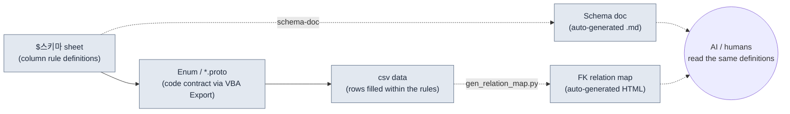

# 3.2 Schema First — The $스키마 Sheet Comes Before the Data

Monday morning. A new designer had filled in 120 rows of the skill sheet; we built them to csv, and 28 red lines appeared in the client log. `class_id` references entry 47, but the class sheet has no 47. In the `element` column, someone wrote `Fire`, someone else wrote `fire`, and one row reads `화염` — "flame," written out in Korean. Tracing 28 red lines by hand, one at a time, eats half an afternoon.

The cause of this incident is not that the data was wrong. It is that **nobody wrote down, before the data was created, the rules the data had to follow.** When the rules live only in someone's head, the rules change the moment the person changes. This chapter covers a workflow that creates the rules — the schema — before the data. And it puts the enforcement of those rules into the hands of tools, as documents, not into human hands.

---

> **Terminology Notes**
> - Schema: the column definitions of a data sheet — name, type, range, foreign keys, description.
> - `$스키마`: a dedicated column-definition sheet kept inside the Excel data file (xlsm). The name is Korean for "$schema." It holds only the rules for the columns, not data rows.
> - FK (foreign key): a column that references the PK (primary key) of another sheet — the way `class_id` points at a row in the Class sheet.
> - proto: a Protocol Buffers definition (`.proto`). The data-structure and Enum contract shared by client and server.
> - Single source of truth: the operating principle of managing each piece of information in exactly one place, so that everyone looks there.

---

## 3.2.1 The Input Order Is the Schema

Read "schema first" as merely "define the columns in advance" and you have caught only half of it. The heart of it is **the order in which things get entered.** The order in which the data-entering hand moves decides whether consistency holds or collapses.

The input order this book recommends is a four-box pipeline.



The solid arrows flowing left to right are the **enforced input order**. Define the `$스키마` first, pull Enums and proto out of it with a VBA (Excel's macro language) Export, and fill in csv data only within that contract. The dotted lines are the artifacts that derive automatically from that input — the schema document (`schema-doc`) and the FK relation map (`gen_relation_map.py`) — and humans and AI read the same definitions through these derivatives.

As long as this order is enforced, most of the 28 red lines from the opening of this chapter are closed off **before the data is filled in.** If the fact that `element` is one of the four values `fire/ice/lightning/none` is pinned down as a proto Enum, both `Fire` and `화염` get caught at input time. If the fact that `class_id` references the Class sheet's PK is stated in the `$스키마`, the missing 47 is caught first by a check, not by the build.

Flip the order — fill the data first and tidy up the schema later — and the schema becomes after-the-fact cleanup. When you rework column rules on top of 1000 already-accumulated rows, the rules end up following the data, and at that moment the source of truth stands upside down.

---

## 3.2.2 Worked Transcript — From `$스키마` to csv in One Pass

Instead of explaining in the abstract, I will run one sheet through the whole pipeline, start to finish. Say we are building a new skill sheet. Below is the complete record of the work, done with AI assistance. I am not summarizing; the places where things went wrong and where a human rejected the output are left in as they happened.

### Step 1 — A Human Writes the `$스키마` by Hand First

No tools, no AI yet. A human defines the column rules directly. This one step is never delegated.

```
# Skill sheet $스키마 (written by a human)
Column         Type       Range/Constraint     FK                  Description
skill_id       int        1000~9999            (PK)                Unique skill ID
name           string     1~30 chars           -                   Display name
class_id       int(FK)    -                    Class.class_id      Usable classes
cooldown       float      0.0~120.0            -                   Cooldown (sec)
damage_coef    float      0.0~10.0             -                   Attack power multiplier
element        enum       fire/ice/lightning/none  -               Element
is_passive     bool       true/false           -                   Passive flag
```

### Step 2 — Ask the AI for a proto Enum Draft (Full Prompt)

The task: carry the `element` enum and the FK structure of the `$스키마` over into a proto contract. This is format conversion, the kind of work you can hand to an AI.

> **Prompt (full text):**
> Below is the column spec of a game data sheet. Convert this spec into a Protocol Buffers (proto3) message and Enum. Rules: (1) define each enum-typed column as a separate enum, and its first value must start with `_UNSPECIFIED = 0`. (2) For FK columns, leave the reference target as a comment. (3) Range constraints cannot be expressed in proto, so leave them as comments only. Do not add any column that is not in the spec.
> ```
> skill_id int PK / name string / class_id int FK→Class.class_id /
> cooldown float 0~120 / damage_coef float 0~10 /
> element enum{fire,ice,lightning,none} / is_passive bool
> ```

### Step 3 — Claude's Raw Output (As Is, Untouched)

```proto
syntax = "proto3";

// Skill sheet data contract
// Note: range constraints (cooldown 0~120, damage_coef 0~10)
//       cannot be enforced in proto. Check them in the linter.

enum SkillElement {
  SKILL_ELEMENT_UNSPECIFIED = 0;
  SKILL_ELEMENT_FIRE = 1;
  SKILL_ELEMENT_ICE = 2;
  SKILL_ELEMENT_LIGHTNING = 3;
  SKILL_ELEMENT_NONE = 4;   // ← human review marker
}

message Skill {
  int32 skill_id = 1;       // PK
  string name = 2;
  int32 class_id = 3;       // FK → Class.class_id
  float cooldown = 4;
  float damage_coef = 5;
  SkillElement element = 6;
  bool is_passive = 7;
}
```

### Step 4 — Human Verification and Rejection

Here the human rejects one thing. The AI placed `none` at the **end** of the enum, as `SKILL_ELEMENT_NONE = 4` — but in the `$스키마`, `none` is the default state meaning "no element." The point of contention is proto's value 0. In proto3, an enum's 0 is the slot that gets filled automatically when no value is provided, so the question is whether to keep 0 reserved as `_UNSPECIFIED` (value never entered) or to fill it with a semantic value like `none` (deliberately element-less). Merge the two into one slot, and a row whose cell was left blank (a mistake) and a row that deliberately chose no element (an intent) both arrive as 0, forever indistinguishable. The AI did keep `_UNSPECIFIED = 0` and `none` separate, but it pushed `none` out to slot 4, leaving the most common default state far from searches and debugging.

The decisions the human made:
- Keep `_UNSPECIFIED = 0` (for detecting omissions).
- Leave `none` where it is, but add to the csv authoring rules: "no-element must be written explicitly as `none`; blank cells are forbidden." Blank = 0 = UNSPECIFIED is treated as an input error.
- Record this decision as one added line in the `element` row's description in the `$스키마`: "No element must also be explicit (none). A blank cell is an error."

The AI's output was not used as is. The format was accepted; the semantic boundary was drawn by a human.

### Step 5 — Export Enum/proto from the Sheet with the VBA Export Button

The verified proto definition is emitted, consistently, by the Excel Export macro (a button on the `$스키마` sheet). No human retypes it in an IDE. The sheet is the source of truth, so the proto comes from the sheet. This order is an extension of the "output is canonical" principle (`json_over_schema_doc_as_source_of_truth`) covered in 3.3 — the document does not explain the code; the sheet gives birth to the code.

### Step 6 — Only Then Fill In the csv Data (AI-Assisted, Retry Included)

> **Prompt (full text):**
> Create 5 csv rows that satisfy the Skill proto and $스키마 above. Constraints: class_id must be one of [1,2,3] (the PKs that currently exist in the Class sheet); damage_coef must be 0.0 for passives (is_passive=true); element must be the literal strings fire/ice/lightning/none; no blank cells.

One row in Claude's first output was off.

```
skill_id,name,class_id,cooldown,damage_coef,element,is_passive
1001,화염베기,1,3.5,2.4,fire,false
1002,빙결의손,2,8.0,3.1,ice,false
1003,체력회복,1,0.0,1.2,none,true     ← rejected: passive but damage_coef≠0
1004,번개창,3,5.0,2.8,lightning,false
1005,방어태세,2,0.0,0.0,none,true
```

Row 1003 violates the rule (`is_passive=true` requires `damage_coef=0.0`). The human rejected it and asked again.

> **Retry (full text):** Row 1003 violates the rules. is_passive=true but damage_coef is 1.2. Passives must be 0.0. Fix only row 1003 and send it again.

> **Claude's revised output:** `1003,체력회복,1,0.0,0.0,none,true`

That the AI did not get everything right on the first try is not a flaw; it is simply something that happens. What matters is that because the schema was already in place, that one deviant row **could be spotted by eye and corrected with a single line.** Without the schema, row 1003 would have been discovered after the build, as an in-game bug where a passive skill deals damage.

The lesson of this whole transcript is simple. When the input order is fixed as `$스키마 → proto → csv`, the AI fills in the format fast and the human reviews only meaning and violations. When the order collapses, the human carries everything, from format all the way to meaning.

---

## 3.2.3 schema-doc — So No One Copies the Schema by Hand

Keeping the `$스키마` inside Excel is convenient for designers, but to AI, git, and external tools it is a closed room. So we run a tool that automatically converts the `$스키마` into Markdown. The slash skill `schema-doc` does this job.

It works in four steps.

1. Parse the `$스키마` sheet of the Excel file (xlsm) (python-calamine, Rust-accelerated)
2. Extract the five elements of each column definition
3. Convert them into a Markdown table
4. Generate `<sheet-name>_schema.md` (the sheet's name plus `_schema.md`) in the same folder

The key point is that **no human writes the schema twice.** Define it once in Excel, and the Markdown is produced by the tool. The two cannot diverge. The trap covered in 3.3 — "make the schema document canonical and it drifts from the actual output" — is avoided here by flipping it: Excel is canonical, the document is derived.

What `schema-doc` generates (for the Skill sheet from the transcript above):

```markdown
# Skill sheet schema  (auto-generated — do not edit directly)

| Column | Type | Range/Constraint | FK | Description |
|---|---|---|---|---|
| skill_id | int | 1000~9999 | (PK) | Unique skill ID |
| name | string | 1~30 chars | - | Display name |
| class_id | int(FK) | - | Class.class_id | Usable classes |
| cooldown | float | 0.0~120.0 | - | Cooldown (sec) |
| damage_coef | float | 0.0~10.0 | - | Attack power multiplier |
| element | enum | fire/ice/lightning/none | - | Element. No element must also be explicit (none); a blank cell is an error |
| is_passive | bool | true/false | - | Passive flag. If true, damage_coef=0 |

_source: Skill.xlsm / generated by schema-doc_
```

Notice how the boundaries the human drew in steps 4 and 6 of 3.2.2 carried straight into the description cells of `element` and `is_passive`. A human wrote one line in the `$스키마`, and now the document, the proto, and the validation all share the same rule. This is what a single source of truth looks like when it actually works.

Once the schema lands as Markdown, it is put to use immediately in three places.

- **AI data generation**: before producing rows, the AI reads this table and generates only rows that respect the seven defined columns, each constraint, and the FKs.
- **Onboarding a new designer**: this one table is faster than three meetings.
- **The linter**: it automatically checks each csv row against this table for violations.

---

## 3.2.4 gen_relation_map.py — A Graph That Shows Whether FKs Are Alive

If the schema is the rules **inside** a sheet, FKs are the rules **between** sheets. The definition that `class_id` references the Class sheet is written in the `$스키마`, but whether that reference is actually alive at this moment requires a separate check.

`gen_relation_map.py` automatically detects the FK relationships across the data sheets and draws them as an interactive HTML relation map. When arrows like Skill's `class_id`→Class and Item's `set_id`→ItemSet gather on one screen, an "FK whose target has disappeared" stands out as a broken arrow. An incident like the missing 47 from this chapter's opening becomes visible **while the data is being filled in** — as a severed line on the relation map, not as a red line in the build log.

The worked usage and visualization of this tool are covered in earnest in 3.3. From this chapter, remember one thing: if the `$스키마` does not state the FKs, there is no graph for the relation map or the consistency check to draw. **Stating FKs is not optional; it is a precondition of schema first.**

---

## 3.2.5 The Five-Step Schema-First Workflow

Generalize the transcript of 3.2.2 and you get five steps. Separate each step's owner from its output, and it becomes clear what a human keeps in hand and what gets handed to tools.

<svg xmlns="http://www.w3.org/2000/svg" width="720" height="300" font-family="sans-serif" font-size="13">
  <rect x="0" y="0" width="720" height="300" fill="#fbfbfb" stroke="#ddd"/>
  <text x="20" y="28" font-size="15" font-weight="bold">Schema-First 5 Steps — Owner × Output</text>
  <!-- columns header -->
  <text x="40" y="62" font-weight="bold">Step</text>
  <text x="230" y="62" font-weight="bold">Owner</text>
  <text x="430" y="62" font-weight="bold">Output</text>
  <line x1="20" y1="72" x2="700" y2="72" stroke="#bbb"/>
  <!-- rows -->
  <text x="40" y="100">1. Schema design</text>
  <rect x="220" y="86" width="120" height="22" fill="#e8f0fe" stroke="#9bb"/>
  <text x="232" y="102">Human</text>
  <text x="430" y="100">$스키마 5 elements · FK definitions</text>
  <text x="40" y="138">2. Auto documentation</text>
  <rect x="220" y="124" width="120" height="22" fill="#e6f4ea" stroke="#9c9"/>
  <text x="232" y="140">schema-doc</text>
  <text x="430" y="138">Schema .md</text>
  <text x="40" y="176">3. Contract extraction</text>
  <rect x="220" y="162" width="120" height="22" fill="#e6f4ea" stroke="#9c9"/>
  <text x="232" y="178">VBA Export</text>
  <text x="430" y="176">Enum / *.proto</text>
  <text x="40" y="214">4. Data draft</text>
  <rect x="220" y="200" width="120" height="22" fill="#fef7e0" stroke="#dca"/>
  <text x="232" y="216">AI + Human</text>
  <text x="430" y="214">csv rows (reject violations · retry)</text>
  <text x="40" y="252">5. Consistency · impact</text>
  <rect x="220" y="238" width="120" height="22" fill="#e6f4ea" stroke="#9c9"/>
  <text x="232" y="254">Linter / Relation map</text>
  <text x="430" y="252">Violation report · FK graph</text>
  <line x1="20" y1="270" x2="700" y2="270" stroke="#bbb"/>
  <text x="40" y="290" font-size="11" fill="#666">Blue = human decision / Green = tool automation / Yellow = AI draft + human review</text>
</svg>

You do not need all five steps in the first month. Running just steps 1 and 2 (schema design + automatic documentation) captures half the value. Attach steps 3–5 gradually, once the operation has settled in. Enforce all five from day one, and the authoring burden will stall the rollout before it takes root.

---

## 3.2.6 What I Measured on Project A

On an MMORPG project I run as design director (hereafter "Project A"), I ran this workflow for about six months. Of the figures below, data-sheet column consistency and new-sheet drafting time are actual measurements aggregated from tool logs and work records; FK breakage frequency is an **author's estimate (unverified)**, back-calculated from build-failure issues.

| Item | Before | After | Basis |
|---|---|---|---|
| Column name consistency | about 60% | about 95% | measured via schema-doc comparison |
| FK breakage frequency | 2–3 per week | 1 or fewer per month | back-calculated from build issues (author's estimate) |
| New sheet drafting time | 4–8 hours | 1–2 hours | measured from work records |
| New designer understanding a sheet | 3 meetings | 1 document read + 1 meeting | onboarding cases (directional only) |

The adoption cost was about 3 days of initial tool development plus about 1 month for the practice to settle in. The operational conclusion: against six months of accumulated benefit, the adoption cost was small. That said, the ratios above are a single case from one team on one project; there is no guarantee they transfer to another team as is.

---

## 3.2.7 The AI–Schema Synergy, and Where It Ends

Once a schema is in place, the reliability of AI data generation jumps. The reason: the schema closes off, in advance, the ambiguous input ranges that give hallucination its opening. Given "make me 20 skills" with no schema, the AI invents plausible columns and fills in values incompatible with your sheets. With a schema, the same request comes back as rows that respect the seven defined columns, each constraint, and the FKs. Even when a violation slips through, as with row 1003 in 3.2.2, you point at one line, ask again, and you are done.

But the boundary is sharp. **Balance values are never delegated to the AI.** If the AI picks `damage_coef` "reasonably," it collides with the game's intent. The AI's share ends at laying out format-correct candidates quickly; "is 2.4 the right coefficient for this skill" is answered by a human. That does not mean AI is useless for balance — curve smoothness, outliers, and range statistics are things AI catches fast. Let the tools measure the numbers; let humans judge whether the numbers are right.

---

## 3.2.8 Common Mistakes and How to Avoid Them

| Mistake | Avoidance |
|---|---|
| Adopting a schema after 1000 rows have piled up | New sheets always start with the `$스키마` |
| `$스키마` and csv drift out of sync | Bind the two to one source with schema-doc automation |
| Not stating FKs | Without explicit FKs, the relation map and consistency checks are meaningless |
| Using proto Enum 0 for a semantic value | 0 is `_UNSPECIFIED` (omission detection); semantic values start at 1 |
| Schema docs read only by humans | Markdown tables + uniform metadata so AI reads them too |

---

## Try It Yourself

**setup**
1. Pick the single most central sheet in your area (skills, items, or monsters).
2. Add a sheet named `$스키마` to that Excel file, and write one line per column with the five elements (name, type, range, FK, description). Do this step yourself, by hand.

**prompt** (use AI only for the proto/csv drafts)
> Convert the $스키마 below into a proto3 message and Enum. The first enum value must be `_UNSPECIFIED = 0`. Comment the reference target for FKs. Range constraints as comments only. Do not add columns that are not in the spec.
> (paste your $스키마 here)

Then:
> 5 csv rows satisfying the proto and $스키마 above. Do not produce rows that violate the constraints. If is_passive=true, damage_coef=0.

**verify**
1. Check the 5 rows the AI gave you against the schema, line by line. If a row violates a rule, ask again with "row N violates the rules; fix only that row" (rejection and retry are a normal part of the process).
2. Export the `$스키마` to `.md` with `schema-doc` (or an equally simple Python script of your own) and confirm that the Excel definition and the document match.
3. If there are FKs, check once that the referenced PKs actually exist.

---

## Solo Scale-Down

If you are starting alone, with no tools and no team, one Excel file and one text editor are enough.

1. Create a `$스키마` as the first tab of your sheet and write the column rules in five elements (15 minutes).
2. Copy that spec as is and ask the AI for "a proto Enum + 5 csv rows" (10 minutes).
3. Check the returned csv against the schema by eye, and fix the one violating row with a retry (10 minutes).
4. Save the `$스키마` text in a text editor as `skill_schema.md`. This is your first single source of truth.

When you move on to the next sheet, repeat the same four steps. Once 5–10 core sheets line up in the same order within a quarter, that is when automation like schema-doc becomes worth attaching.

---

### Key Takeaways
- Enforce the input order `$스키마→Enum/proto→csv`, and violations are closed off before the data is filled in
- Excel is canonical and documents are derived; schema-doc binds the two to one source, so humans and AI read the same definitions
- Balance values are decided by humans; AI handles only format-correct candidates and outlier measurement

### Next Chapter Preview
- 3.3. Relation Map Visualization — Seeing FK Dependencies with gen_relation_map.py
