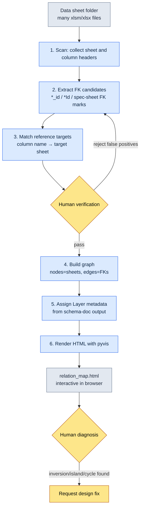

# 3.3 Relation Map Visualization — Seeing Dependencies with Your Own Eyes

A new designer came to my desk during his first week at the company. "I'm about to touch the quest reward table — if I change this, what breaks?" I started to answer, pointing at my monitor, then stopped. The picture was in my head: `RewardTable` hooks into `ItemTable`, `ItemTable` hooks into `ItemEffectTable`, and above them `QuestTable` references the rewards... But the moment I put that picture into words, it lost its shape inside the listener's head. I drew seven boxes on a whiteboard. The arrows started to tangle. Thirty minutes later he nodded and went back to his seat — and the next day he came back with the exact same question.

That scene is what made me write this chapter. A systems designer carries a dependency graph in their head. The problem is that it exists only there. When the person changes, the picture disappears with them. I needed a tool to externalize the picture, and that is why I built `gen_relation_map.py`.

With 5\~10 data sheets, your head is enough. Past 30, human working memory cannot keep up. A project's sheet folder usually crosses that line early. A table that spells out in text which sheet depends on which never turns into a picture, no matter how carefully you read it. This chapter follows, start to finish, the worked process of auto-generating an interactive HTML relation map from foreign key (FK) relationships.

---

## 3.3.1 Four Problems a Relation Map Solves

Before building the tool, let me pin down what actually gets stuck when there is no relation map. Four scenes kept repeating.

**Onboarding a new designer.** A new designer books a meeting to learn the system structure. That is the scene above. Dependencies conveyed by mouth do not survive more than a few days in the listener's head. Click through a single relation map together, and more than half of the picture forms in the first meeting. The decisive difference from a hand-drawn whiteboard sketch is that the picture does not get erased — it stays in place.

**Debating the impact scope of a change.** A system change request comes in. "What does this affect?" A meeting gets scheduled, and even after a long discussion, one or two missed areas surface later. With a relation map, you click the node being changed and follow the inbound edges; the impact scope is right there in front of your eyes. The discussion only needs to settle whether each impact is real, and in what priority order.

**Detecting dependency inversions.** An L3 data sheet referencing an L1 system document is normal. The opposite direction — an upper Layer directly referencing a lower data sheet — is almost always a design flaw. In an FK list written out as text, humans cannot catch this inversion. In the picture, it shows up instantly as a single arrow whose Layer colors run the wrong way.

**Finding orphaned sheets.** Every so often you discover a sheet that nothing references. It is a leftover from an old design, or something that was retired on paper while the file stayed behind. It is like an unlabeled box rolling around in a corner of the office. You need the picture to spot that island.

What the four problems share: every one of them is only solved by seeing the structure with your eyes. Text and tables hit a wall.

---

## 3.3.2 Worked Transcript: From Data Sheets to a Relation Map

Now we follow the real thing. The input is one folder of data sheets; the output is a single interactive HTML page you open in a browser. In between, I record everything the AI did and every point where a human verified or rejected — nothing left out.

### 3.3.2.1 The Overall Flow



The core is the human verification loop between steps 3 and 5. The machine lays down a draft of FK candidates, and a human weeds out the false positives. Skip this loop and the relation map becomes a plausible-looking but wrong picture.

### 3.3.2.2 Where the FKs Come From — Input Order

This tool's accuracy is decided by where it pulls its input from. The schema-first principle set in 3.2 applies as-is. The order of authority for FK information goes like this.

1. **The `$스키마` sheet** — the first source of truth for each data sheet. Type, Enum, and FK targets are specified per column. If an FK is written here, that is first priority.
2. **`*.proto` / Enum definitions** — the schema exported via VBA (Excel's macro language). They fill in types when the spec sheet is empty.
3. **The actual `csv` output** — the real data the sheet exports. Relationships missing from the spec sheet still surface as patterns in the data (for example, if every value in an `npc_id` column falls inside `NPCTable`'s key range, it is effectively an FK).

Let me make one principle explicit here. **The source of truth is the actual JSON/csv output, not the schema document.** Even if the spec sheet says `reward_id` is an FK, if that column is empty in the real data or points at nonsense values, then the spec sheet is wrong. When the two disagree, the tool trusts the data side and records the disagreement itself in a report. This is why schema-doc is not treated as the source of truth.

### 3.3.2.3 Step 1 — Folder Scan and FK Candidate Extraction

The tool's first move is to open every xlsm/xlsx in the folder and collect sheet and column headers. This step is mechanical and not interesting. What is interesting is the rule for picking FK candidates. At first it was simple: if a column name ends in `*_id` or `*Id`, treat it as an FK candidate. But that single rule produced both false positives and misses.

This is where I brought in the AI. I handed over the entire list of column headers and had it infer the FK target sheets. Below are the full prompt I actually sent and the raw output.

> **Prompt:**
> The following is a list of sheet names and column headers from game data sheets. For each column, infer whether it is a foreign key (FK), and if so, which sheet and which column it references. The usual naming convention is `<singular form of target sheet>_id`. However, if you are not confident, mark it "uncertain" and state why. Do not fill gaps with guesses.
>
> ```
> QuestTable: quest_id, title, npc_id, reward_id, prev_quest_id, region_id
> NPCTable: npc_id, name, region_id, faction_id
> RewardTable: reward_id, item_id, count, currency_id
> ItemTable: item_id, name, item_effect_id, grade
> ItemEffectTable: item_effect_id, effect_type, value
> RegionTable: region_id, name, parent_region_id
> ```

> **Claude's raw output (PK rows omitted; FK judgments excerpted):**
>
> **QuestTable**
> - `npc_id` → NPCTable.npc_id (presumably the NPC who gives the quest)
> - `reward_id` → RewardTable.reward_id
> - `prev_quest_id` → QuestTable.quest_id (preceding quest, **self-reference**)
> - `region_id` → RegionTable.region_id
>
> **NPCTable**
> - `region_id` → RegionTable.region_id
> - `faction_id` → **Uncertain**: FactionTable is not in the input list. By the naming convention it should reference FactionTable.faction_id, but since that sheet was not provided, the target cannot be confirmed.
>
> **RewardTable**
> - `item_id` → ItemTable.item_id
> - `currency_id` → **Uncertain**: CurrencyTable is not in the list. Currency types may also be managed as an Enum, in which case this may not be an FK. The spec sheet needs to be checked.
>
> **ItemTable**
> - `item_effect_id` → ItemEffectTable.item_effect_id
> - `grade` → Not an FK (presumed Enum: grade values)
>
> **ItemEffectTable**
> - `effect_type` → Not an FK (presumed Enum)
>
> **RegionTable**
> - `parent_region_id` → RegionTable.region_id (**self-reference**, region hierarchy)
>
> Note: the inferences above are based on column naming conventions; actual data values were not checked. In particular, columns that do not end in `_id`, such as `count` and `value`, were excluded from FK inspection — if hidden references exist there, they will be missed.

The human did three things with this output.

- **Rejection 1:** `faction_id` → The AI marked it uncertain because FactionTable was missing. Correct. In reality, though, `faction_id` was an Enum. Factions are fixed at 6 kinds, so they are managed as an Enum with no separate sheet. Because the AI stopped its judgment instead of inventing a sheet that did not exist, a human could check the spec sheet and confirm it as an Enum. **Excluded from the FKs.**
- **Rejection 2:** `currency_id` → The AI left both possibilities open. Looking at the actual data, a `CurrencyTable` did exist (I had left it out of the input list). **Confirmed as an FK.** This was a human input omission — nothing to blame the AI for.
- **Accepted:** the self-reference detection on `prev_quest_id` and `parent_region_id`. A plain regex rule would have missed these. The AI attaching the meaning — "preceding quest," "region hierarchy" — made verification faster.

The lesson here is clear. Where the AI was most useful was not fast inference but **the restraint to leave unknown slots marked "uncertain."** Had it force-filled the blanks, `faction_id` would have been wired to some wrong sheet, and that false positive would have lived on in the relation map as a fake arrow, misleading the next new designer.

### 3.3.2.4 Step 2 — Graph Construction and Layer Assignment

Once the verified FK list is in hand, `gen_relation_map.py` builds the graph. Sheets are nodes; FKs are directed edges. Node size comes from counting inbound edges — how much do other sheets reference me. The more a sheet is referenced, the bigger the node: that is a hub of the system.

The Layer metadata is pulled from the Markdown schema documents generated by the `schema-doc` skill. The Layer coordinates defined in 3.1 (L0\~L4) are attached to each sheet as labels, and the tool reads them to color the nodes. This link matters. A relation map that does not know about Layers is just boxes and arrows; only when it knows the Layers can it diagnose "inversions" by color.

Here is the tool's internal structure as a code skeleton (core flow only).

```python
# gen_relation_map.py (core flow excerpt)
from pyvis.network import Network

LAYER_COLORS = {          # Layer palette — standardized as a single atom
    "L0": "#2c3e50",      # meta/shared
    "L1": "#2980b9",      # system
    "L2": "#27ae60",      # content
    "L3": "#f39c12",      # data instances
    "L4": "#c0392b",      # derived/cache
}

def build_graph(fk_list, layer_map):
    net = Network(directed=True, height="900px")
    inbound = count_inbound(fk_list)          # aggregate inbound edges
    for sheet in all_sheets(fk_list):
        layer = layer_map.get(sheet, "L0")
        size = 10 + inbound[sheet] * 3        # bigger node for hubs
        net.add_node(sheet, color=LAYER_COLORS[layer],
                     size=size, title=sheet_tooltip(sheet))
    for src, dst, col in fk_list:
        # Detect Layer inversion: warning color when an upper Layer references a lower one
        edge_color = "#e74c3c" if is_reverse(src, dst, layer_map) else "#888"
        net.add_edge(src, dst, title=col, color=edge_color)
    return net
```

`is_reverse` is the small heart of this tool. If an edge's source sheet sits on a higher Layer than its destination (e.g., L1 → L3), the edge is treated as an inversion and painted red. When a person opens the picture and sees a red arrow, that is almost always a place that needs fixing.

### 3.3.2.5 Step 3 — HTML Rendering and the Resulting Structure

The last step is pyvis emitting the interactive HTML. Clicking a node pops a tooltip with that sheet's columns, Layer, and inbound count, and a search box filters by sheet name. This is exactly why it has to be HTML rather than a static PNG — once the node count passes a few dozen, the arrows in a static image tangle into something unreadable. You need to drag nodes apart with the mouse and narrow down to the area you care about by clicking before the pattern emerges.

Here is the structure of the relation map built from the example data above, redrawn as an SVG. Colors mean Layers; a red arrow (absent in this example) would mark an inversion.

<svg viewBox="0 0 720 360" xmlns="http://www.w3.org/2000/svg" font-family="sans-serif" font-size="13">
  <defs>
    <marker id="arrow" markerWidth="10" markerHeight="10" refX="9" refY="3" orient="auto" markerUnits="strokeWidth">
      <path d="M0,0 L9,3 L0,6 Z" fill="#888"/>
    </marker>
  </defs>
  <!-- nodes -->
  <rect x="40" y="30" width="130" height="40" rx="6" fill="#2980b9"/>
  <text x="105" y="55" fill="#fff" text-anchor="middle">RegionTable (L1)</text>
  <rect x="300" y="30" width="130" height="40" rx="6" fill="#27ae60"/>
  <text x="365" y="55" fill="#fff" text-anchor="middle">QuestTable (L2)</text>
  <rect x="560" y="30" width="130" height="40" rx="6" fill="#27ae60"/>
  <text x="625" y="55" fill="#fff" text-anchor="middle">NPCTable (L2)</text>
  <rect x="300" y="150" width="130" height="40" rx="6" fill="#f39c12"/>
  <text x="365" y="175" fill="#fff" text-anchor="middle">RewardTable (L3)</text>
  <rect x="560" y="150" width="130" height="40" rx="6" fill="#f39c12"/>
  <text x="625" y="175" fill="#fff" text-anchor="middle">ItemTable (L3)</text>
  <rect x="560" y="270" width="150" height="40" rx="6" fill="#f39c12"/>
  <text x="635" y="295" fill="#fff" text-anchor="middle">ItemEffectTable (L3)</text>
  <!-- edges -->
  <line x1="300" y1="50" x2="172" y2="50" stroke="#888" stroke-width="2" marker-end="url(#arrow)"/>
  <line x1="560" y1="50" x2="432" y2="50" stroke="#888" stroke-width="2" marker-end="url(#arrow)"/>
  <line x1="625" y1="70" x2="380" y2="150" stroke="#888" stroke-width="2" marker-end="url(#arrow)"/>
  <line x1="365" y1="70" x2="365" y2="150" stroke="#888" stroke-width="2" marker-end="url(#arrow)"/>
  <line x1="560" y1="170" x2="432" y2="170" stroke="#888" stroke-width="2" marker-end="url(#arrow)"/>
  <line x1="625" y1="190" x2="625" y2="270" stroke="#888" stroke-width="2" marker-end="url(#arrow)"/>
  <!-- self-ref -->
  <path d="M170,40 q40,-30 0,-10" fill="none" stroke="#888" stroke-width="2" marker-end="url(#arrow)"/>
  <text x="200" y="20" fill="#666" font-size="11">parent_region_id (self-reference)</text>
</svg>

Looking at node sizes, `RegionTable` is the most referenced (both Quest and NPC point at it). That is the hub. `ItemEffectTable` is a leaf node, so it stays small. For a new designer asking "where do I start if I want to understand this system," the answer is already in the picture, in node-size order.

---

## 3.3.3 What the Picture Diagnoses — Combined with Layers

We defined the Layer coordinates in 3.1. When this chapter's relation map lifts those coordinates into the visual realm, four diagnoses that were impossible with text or tables become possible on a single screen.

- **Layer inversion** — an arrow whose Layer colors flow backward (red). An unnatural structure where a data sheet influences the system design in reverse.
- **Isolated nodes** — islands connected to no edge at all. Candidates for retirement.
- **Hub overload** — a giant node with abnormally many inbound edges. A signal that one sheet carries too much responsibility; consider splitting it.
- **Circular dependencies** — places where the arrows trace a circle. Almost always a design flaw, and they lead to data-loading-order problems.

That said, this does not mean the picture catches every problem. The picture catches **structural flaws**. Whether a given FK is the semantically correct relationship — for example, whether `npc_id` really means "the NPC who gives the quest" or "an NPC who appears in the quest" — is not something the picture resolves. That is the human's domain judgment to make. The tool only sets the stage on which that judgment can operate.

---

## 3.3.4 Without Automatic Updates, It Rots

A relation map is not a make-once artifact. Sheets are added and changed every week. A relation map left to manual updates drifts from the real structure within a month or two, and a map that misleads is worse than no map at all. A team member burned once by a wrong picture stops looking at pictures — that is the most expensive failure.

So updates are wired to automatic triggers.

- **Git pre-push hook** — regenerates the relation map before data sheets are pushed. Always-current is guaranteed.
- **At change-request time** — when a data sheet change request comes in, the before/after relation maps are diffed and attached as a comment. Added edges in green, removed edges in red. The reviewer sees the impact scope as a picture.
- **Nightly batch** — builds a fresh relation map every night and keeps a diff against the previous day.
- **Manual command** — generate on the spot with the `/relation-map` slash command. Used to pull it up live in a meeting.

The generated HTML is auto-deployed to internal static hosting (the design portal). With nothing but a browser — no tool installs — everyone sees the same map. It is like a map kept permanently unfolded next to your desk. Whoever asks, you answer by pointing at the same picture together.

---

## 3.3.5 Common Mistakes and How to Avoid Them

| Mistake | Why it happens | How to avoid it |
|---|---|---|
| Over 100 nodes, the picture tangles | Cramming every domain into one screen | Per-domain filtering, split views per group |
| Layer colors differ from tool to tool | Palette redefined in every codebase | Standardize the palette as a single atom (`LAYER_COLORS`) |
| FK detection only catches `*_id`, causing misses and false positives | Relying on a single regex line | Combine explicit FKs in the spec sheet with real-data value verification |
| The picture exists but nobody looks at it | Not wired into the workflow | Make attaching the picture to change requests and meetings mandatory |
| Built once, never updated, rots | Relying on manual updates | Automatic triggers are a must — manual goes useless within a month |

In operating `gen_relation_map.py`, the row that burned me most often is the third one. Trust the `*_id` rule alone and you miss hidden references like `count` or `value` (the AI in 3.3.2.3 warned about this limit on its own), while falsely flagging the Enum `grade` as an FK. The verification loop that checks both the spec sheet and the real data is the answer to that row.

---

## 3.3.6 Try the Solo Scale-Down First

Trying to handle the company's entire set of data sheets at once is heavy, and you burn out before you ever get to show the value. Start small, with one folder from your own domain.

### Try It Yourself

**setup.**
1. Pick one folder containing 5\~10 data sheets you own.
2. Install the dependencies with `pip install pyvis openpyxl` (for reading Excel, use the `excel-reader` skill or openpyxl).
3. First check whether FKs are specified in each sheet's `$스키마` sheet. If not, just collect the column headers.

**prompt.** Gather the column header list and send the prompt from 3.3.2.3 as-is. The key is the last line — "If you are not confident, mark it uncertain, and do not fill gaps with guesses." That sentence is what blocks fake arrows.

**verify.**
1. Go through the AI's FK candidates line by line. Confirm the lines marked "uncertain" against the spec sheet or the real data.
2. Remove suspected Enum columns from the FKs (ones like `grade` and `effect_type` that look like FKs but carry no `_id`).
3. Check that the self-references (`prev_*_id`, `parent_*_id`) were caught correctly.
4. Draw the graph from the verified list, open it in a browser, and look for red arrows (inversions) and islands (isolation) with your own eyes.

### Solo Scale-Down

If you have no time to build the tool, it is fine to start the first week with a single hand-written mermaid diagram. Write the FKs of 5 sheets directly into mermaid, in the format from 3.3.2.3. Take that one page into a meeting and show it — "this is our system's dependency graph" — and the value proves itself on the spot. Once the value is visible, the automation tool follows naturally. You can let go of the pressure to have a working tool from day one.

Scaling up flows naturally in this order — week 1: a hand-drawn mermaid of your own sheets → week 2: add Layer colors and clicking → month 1: automatic updates (git hook or nightly batch) → month 3: deploy to the internal portal → month 6: a unified relation map of all sheets.

---

## 3.3.7 Connecting to the Next Chapter

3.2 covered the inside of the sheets (schemas); 3.3 covered the outside (relationships). 3.4 layers AI-assisted prompt patterns on top. With schemas and relationships in place, it moves on to practical patterns for how AI assists with consistency checks and impact-scope extraction.

---

### Key Takeaways
- Externalize the dependency graph in your head, and the same picture stays in place even when people change.
- In FK extraction, accuracy comes from the verification loop: the AI lays down a draft and a human weeds out the false positives.
- A relation map without automatic updates rots within a month or two and loses trust.

### Next Chapter Preview
- 3.4. AI-Assisted System Design Prompt Patterns
