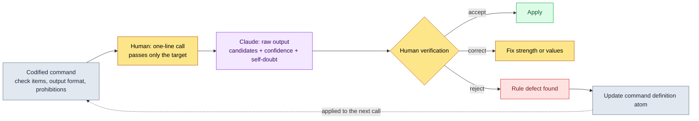
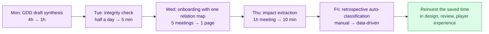

# 3.4 Prompt Patterns for AI-Assisted Systems Design

It was the week right before the alpha build. I added one new class row to the skill sheet and saved. What I did not learn until the build broke the next morning was that the buff ID this class referenced was a row someone had deleted the day before. Tracing back through the broken build to find the cause took two hours. Two hours I would never have spent if I could simply have asked, before that row was deleted, "Is this safe to delete?"

This chapter is about putting that question in the AI's job description. The core is not a knack for writing good prompts. It is making sure you never rewrite the same question from zero — pinning it down. Section 3.2 laid the schema, 3.3 the relation map. Both were the skeleton of the data. This chapter takes the questions a human throws at AI on top of that skeleton and hardens those questions themselves into assets.

Let me nail one thing down first. What AI produces is not an answer — it is a candidate. In every pattern in this chapter, the hand that makes the final decision stays on the human side to the very end.

---

## 3.4.1 Two Places Where Ad-Hoc Prompts Leak

When you first start using AI, you type a fresh natural-language prompt on the spot every time. Something like this.

```
스킬 시트 한번 봐줘. 외래 키 깨진 거 없나 확인하고,
이상한 거 있으면 알려줘. 아 그리고 쿨다운 음수인 것도.
```

*(In English: "Take a look at the skill sheet. Check whether any foreign keys are broken, and tell me if anything looks off. Oh, and negative cooldowns too.")*

This prompt leaks in two places.

First, the check items change every time. Today I remembered "negative cooldowns," but tomorrow I forget. The "duplicate PK (primary key)" check I ran yesterday is missing from today's prompt. A check that depends on human memory drops items exactly as often as the human's condition dips.

Second, the output format changes every time. Write the same intent as "check it," "inspect it," or "look it over," and the AI answers with a table one day and running prose the next. When the format wobbles, you cannot feed the results into any further automated processing.

The fix is to take the prompt out of your hands and put it in a drawer. The memo you used to scribble by hand each time becomes a labeled card you pull from the same drawer. That card is what this book calls a slash command (skill) and an atom.

---

## 3.4.2 Three Forms of Codification and How to Choose

There are three containers for codifying. What goes into which is decided by call frequency and definition stability.

<svg viewBox="0 0 720 300" xmlns="http://www.w3.org/2000/svg" font-family="sans-serif" font-size="13">
  <rect x="0" y="0" width="720" height="300" fill="#fbfbfd"/>
  <line x1="120" y1="40" x2="120" y2="280" stroke="#bbb" stroke-width="1"/>
  <line x1="120" y1="160" x2="700" y2="160" stroke="#bbb" stroke-width="1"/>
  <text x="60" y="35" text-anchor="middle" font-weight="bold">Call frequency</text>
  <text x="60" y="55" text-anchor="middle" fill="#888" font-size="11">High ↑</text>
  <text x="60" y="270" text-anchor="middle" fill="#888" font-size="11">Low ↓</text>
  <text x="410" y="298" text-anchor="middle" font-weight="bold">Definition stability →</text>

  <rect x="150" y="70" width="200" height="70" rx="8" fill="#e8f0fe" stroke="#4285f4"/>
  <text x="250" y="98" text-anchor="middle" font-weight="bold">Slash command (skill)</text>
  <text x="250" y="118" text-anchor="middle" font-size="11" fill="#555">Frequent · stable → /check-sheet</text>
  <text x="250" y="133" text-anchor="middle" font-size="10" fill="#555">One-word call, fixed output format</text>

  <rect x="400" y="70" width="270" height="70" rx="8" fill="#fef7e0" stroke="#f9ab00"/>
  <text x="535" y="98" text-anchor="middle" font-weight="bold">Atom auto-injection (JIT)</text>
  <text x="535" y="118" text-anchor="middle" font-size="11" fill="#555">Frequent · core constraint → keyword trigger</text>
  <text x="535" y="133" text-anchor="middle" font-size="11" fill="#555">No memorizing — joins natural language</text>

  <rect x="150" y="190" width="200" height="70" rx="8" fill="#e6f4ea" stroke="#34a853"/>
  <text x="250" y="218" text-anchor="middle" font-weight="bold">Template file (.md)</text>
  <text x="250" y="238" text-anchor="middle" font-size="11" fill="#555">Occasional · large → call by file</text>
  <text x="250" y="253" text-anchor="middle" font-size="11" fill="#555">Easy to eyeball and edit</text>

  <rect x="400" y="190" width="270" height="70" rx="8" fill="#f1f3f4" stroke="#9aa0a6"/>
  <text x="535" y="225" text-anchor="middle" font-size="12" fill="#777">Occasional · unstable definition →</text>
  <text x="535" y="243" text-anchor="middle" font-size="12" fill="#777">Do not codify yet (stay ad-hoc)</text>
</svg>

Work that is frequent and whose definition has hardened goes into a slash command. Work that is frequent but is really a constraint you must never forget goes into atom JIT auto-injection. Work that is occasional but large goes into a template file. And work whose definition is still shifting stays ad-hoc — do not codify it yet. You do not need all three from day one. Start with one or two slash commands and grow once the value shows.

---

## 3.4.3 Pattern ① Integrity Check — A Worked Transcript

Rather than explain in the abstract, I will walk one pattern through from start to finish: the pattern that automatically asks "Is this safe to delete?" before a single empty row gets deleted. Its name is `/check-sheet`. Inside it, the check items and the output format are codified.

The assets it stands on appear in the measured work logs embedded throughout this book. Data entry follows the schema-first principle (atom `data_entry_schema_first`). The entry order is the `$스키마` (schema) sheet → `Enum/*.proto` (exported via VBA, Excel's macro language) → csv. And the source of truth is not the schema document but the actual JSON output (atom `json_over_schema_doc_as_source_of_truth`). The integrity check simply carries these two principles over into check rules.

### setup — Inside the Codified Command

Open `/check-sheet` and this is the prompt body inside. This is the part you never have to type by hand again.

```
역할: 너는 게임 데이터 시트의 정합성 검사기다.

검사할 시트: {{sheet_name}}
참조 가능한 스키마: $스키마 시트 (컬럼별 타입·범위·FK 대상)
참조 가능한 정본: 같은 시트의 export JSON (스키마 문서보다 우선)

검사 항목 (이 순서로):
1. 외래 키 유효성 — FK 컬럼 값이 참조 대상 시트에 실재하는가
2. 범위 위반 — $스키마에 정의된 min/max를 벗어난 값
3. 필수 컬럼 누락 — required=true 컬럼이 빈 행
4. 중복 PK — 같은 PK가 둘 이상

출력 형식 (반드시 이 표 그대로):
| # | 행 | 컬럼 | 위반 종류 | 현재 값 | 수정 후보 | 확신도 |

규칙:
- 수정 후보는 제안만 한다. 절대 시트를 직접 고치지 않는다.
- 확신도는 높음/중간/낮음 셋 중 하나. 추측이면 낮음.
- 위반이 없으면 "위반 0건"만 출력하고 끝낸다.
```

*(In English: the body assigns the role of an integrity checker for game data sheets, takes `{{sheet_name}}` as the target, points to the `$스키마` sheet for per-column types, ranges, and FK targets, and to the exported JSON of the same sheet as the source of truth that outranks the schema document. It runs four checks, in this order: foreign key validity, range violations, missing required columns, duplicate PKs. The output is pinned to one fixed table — #, row, column, violation type, current value, suggested fix, confidence — and three rules close it out: suggest fixes only, never edit the sheet directly; rate confidence as one of high/medium/low, and if it is a guess, mark it low; if there are no violations, output only "0 violations" and stop.)*

What matters most in this body is the final three rule lines: "do not edit directly," "rate your confidence," "confess guesses as low." Those three lines tie the AI to the seat that pushes candidates, not the seat that hands down answers.

### prompt — The One Line the Human Actually Typed

```
/check-sheet skill_table
```

That is all. You pass one sheet name. You do not rewrite the four check items or the output table format. That is what codifying is worth.

### Claude's Raw Output

Below is the output that came back when I actually ran it. I am not summarizing — the ambiguous parts and the spots where the AI hesitated are included as-is.

```
skill_table 정합성 검사 결과입니다. 총 4건의 위반을 발견했습니다.

| # | 행  | 컬럼        | 위반 종류    | 현재 값 | 수정 후보              | 확신도 |
|---|-----|------------|------------|--------|----------------------|------|
| 1 | 142 | buff_id    | 외래 키 위반 | 9007   | 9070 (오타 추정, 1글자) | 중간   |
| 2 | 142 | buff_id    | 외래 키 위반 | 9007   | 9012 (이름 "맹독" 유사) | 낮음   |
| 3 | 88  | cooldown   | 범위 위반    | -1     | 0 (음수 불가)           | 높음   |
| 4 | 215 | combo_next | 필수 누락    | (빈칸)  | 판단 보류               | 낮음   |

주의 사항 몇 가지를 덧붙입니다.

- 1번과 2번은 같은 행(142)의 같은 컬럼에 대한 서로 다른 후보입니다.
  9007이라는 ID는 buff 시트에 존재하지 않습니다. 9070은 숫자 한 자리
  차이라 오타일 가능성이 있고, 9012는 이름이 "맹독"으로 유사해서
  후보로 올렸습니다. 둘 다 확신은 낮습니다. 사람이 골라야 합니다.

- 4번(215행 combo_next 빈칸)은 애매합니다. $스키마에는 required=true로
  되어 있는데, export JSON을 보니 이 컬럼이 빈 행이 12개 더 있습니다.
  명세서가 최신이 아니거나, "콤보 종결 스킬은 combo_next를 비운다"는
  규칙이 있는데 명세서에 반영이 안 됐을 수 있습니다. 제가 단정할 수
  없어서 "판단 보류"로 두었습니다.

- cooldown 외에 범위 검사를 더 돌리고 싶으면 $스키마의 다른 컬럼
  min/max를 확인해야 하는데, 제가 받은 정보에 range_check 컬럼 일부가
  비어 있어서 cast_time 컬럼은 검사하지 못했습니다.
```

*(In English: the check reports 4 violations. Findings 1 and 2 are two competing fix candidates for the same cell — row 142's `buff_id` is 9007, which does not exist in the buff sheet; 9070 differs by one digit and could be a typo (medium confidence), while 9012 is a buff with the similar name 맹독, "Deadly Poison" (low confidence) — a human has to choose. Finding 3: row 88's cooldown of -1 should be 0, negatives are not allowed (high confidence). Finding 4: row 215's blank combo_next is flagged but left as "judgment withheld" — the spec says required=true, yet the exported JSON shows 12 more rows with this column blank, so either the spec is stale or there is an unwritten rule that combo finisher skills leave combo_next empty. The AI also confesses a limit: part of the range_check information it received was blank, so it could not check the cast_time column.)*

What makes this good output is not that it is tidy — it is that it is honest. It did not flatly declare finding 4 "required, so fill it in"; it exposed its own doubt — "the spec may not be current." It also confessed the limit that it could not see cast_time. If the AI had confidently said "fill it with 0," that could have been the wrong answer that breaks combo finisher skills.

### verify — Human Verification and Rejection

Now the human rules on each line. "Verification comes bundled with the command" means this table comes out automatically — not that no human looks at it.

- **Finding 3 (cooldown -1 → 0)**: Accepted. High confidence, and a negative cooldown is an obvious entry mistake. Fixed immediately.
- **Findings 1 and 2 (buff_id 9007)**: Held. Both low confidence. I decided to open the buff sheet myself and confirm the actual IDs of the 맹독 ("Deadly Poison") family of buffs. Neither AI candidate was accepted.
- **Finding 4 (blank combo_next)**: **Rejected.** The AI's suspicion was right. This skill is a combo finisher, so an empty combo_next is normal. It is not a violation. I rejected the finding — the problem is on the spec side.

That last one is the heart of it. At the exact spot where trusting the AI's output as-is would have wrecked perfectly healthy data, the human rejection kicked in. At the same time, finding 4 exposed a defect in the check rule itself: the spec's `required=true` was wrong.

### Re-Request — The Rejection Fixes the Rule

It does not end there. A rejection is input that makes the next check smarter. The human types on.

```
4번은 위반이 아니야. combo_finisher=true인 스킬은 combo_next가 비는 게
정상이거든. 이 예외 규칙을 검사 항목에 넣어서, 앞으로는 finisher 행의
combo_next 빈칸은 위반으로 잡지 마. 그리고 명세서의 required 정의가
틀렸다고 보이는 항목은 따로 "명세서 의심" 섹션으로 빼서 알려줘.
```

*(In English: "Finding 4 is not a violation. Skills with combo_finisher=true are supposed to leave combo_next empty. Add this exception to the check items, so that blank combo_next on finisher rows is no longer flagged. And when a spec's required definition looks wrong, split those items out into a separate 'spec suspect' section.")*

```
이해했습니다. /check-sheet의 검사 규칙에 예외를 반영하겠습니다.

추가된 규칙:
- combo_next 필수 검사 시, 같은 행의 combo_finisher 값을 먼저 확인.
  combo_finisher=true이면 combo_next 빈칸은 정상으로 처리(위반 제외).

신설 섹션:
- "명세서 의심" — export JSON의 실제 분포가 $스키마 정의와 어긋날 때,
  데이터가 아니라 명세서를 고쳐야 할 후보로 분리해 보고.
  (정본은 JSON이라는 원칙에 따라, 다수 데이터가 명세서를 거스르면
   명세서 쪽을 의심합니다.)

이 변경을 /check-sheet 명령 정의 atom에 기록해 둘까요?
```

*(In English: Claude confirms the exception — when checking combo_next as required, first check the same row's combo_finisher; if true, a blank combo_next is treated as normal — and creates a new "spec suspect" section that reports cases where the actual distribution in the exported JSON contradicts the `$스키마` definition, separated out as candidates for fixing the spec rather than the data, following the JSON-is-the-source-of-truth principle. It closes by asking: "Shall I record this change in the /check-sheet command definition atom?")*

That final line completes the pattern. One rejection does not end as a one-off fix; it gets recorded in the command definition atom and propagates to the next person and the next check. This is the compound interest of codifying. You never filter the same mistake twice.

---

## 3.4.4 Pattern ② Change Impact Extraction — A Worked Transcript

The second pattern erases the two hours from the opening scene. Before changing one row or one decision, it first asks, "How far does this spread?" Its name is `/impact`. The relation map built in 3.3 (the FK-relationship HTML that `gen_relation_map.py` produces) is this pattern's fuel.

### setup — The Codified Search Paths

Inside `/impact`, the answer to "where do you have to dig to find every impact without misses?" is codified as four paths.

```
역할: 너는 변경 영향 범위 추출기다.

변경 대상: {{target}}  (시트명·컬럼·atom_id·시스템 결정 중 하나)

탐색 경로 (넷 다 돌 것):
1. 관계도 인바운드 — gen_relation_map.py 출력에서 {{target}}을
   FK로 참조하는 시트들 (이 시트를 가리키는 화살표)
2. 본문 언급 — sources/manuscript 안에서 {{target}}의 ID·이름이
   직접 등장하는 문서
3. atom affects 관계 — {{target}}과 affects로 연결된 atom들
4. 역참조 — {{target}}을 [[wikilink]]로 가리키는 노트

출력 형식:
| 종류 | 이름 | 연결 근거 | 영향 강도 | 담당 |

규칙:
- 영향 강도는 직접/간접/약 셋이다. 직접 FK는 '직접', 본문 언급은 '간접', 추정은 '약'.
- 누락이 두려우면 약으로라도 올린다. 빠뜨리는 것보다 낫다.
- 우선순위나 작업 지시는 하지 않는다. 목록만 만든다.
```

*(In English: the role is a change impact extractor; the target `{{target}}` is one of a sheet name, a column, an atom_id, or a system decision. It must walk all four search paths: 1) relation-map inbound — sheets that reference the target as an FK in the `gen_relation_map.py` output, i.e., arrows pointing at this sheet; 2) text mentions — documents under sources/manuscript where the target's ID or name appears directly; 3) atom affects links — atoms connected to the target via affects; 4) reverse references — notes pointing at the target via [[wikilink]]. The output is a fixed table — type, name, evidence of linkage, impact strength, owner. Rules: impact strength is one of direct/indirect/weak — a direct FK is "direct," a text mention is "indirect," an inference is "weak"; if you fear a miss, list it at least as weak — better than dropping it; no priorities, no work orders — produce the list only.)*

### prompt

```
/impact buff_id=9012
```

One line asks: "I am considering replacing the Deadly Poison buff (맹독, 9012) with a different effect — what gets shaken?"

### Claude's Raw Output

```
buff_id=9012(맹독)의 변경 영향 범위입니다. 4개 경로를 모두 탐색했습니다.

| 종류    | 이름                | 연결 근거              | 영향 강도 | 담당      |
|--------|--------------------|----------------------|---------|----------|
| 시트    | skill_table         | buff_id FK 직접 참조    | 직접       | teammate_a |
| 시트    | monster_drop        | reward_buff FK 참조     | 직접       | teammate_b |
| 시트    | set_item_effect     | proc_buff FK 참조       | 직접       | teammate_a |
| 문서    | 독계열_밸런스_노트.md  | 본문에 "9012" 직접 언급  | 간접       | (저자)     |
| atom    | poison_stack_rule   | affects: 9012          | 간접       | (저자)     |
| 노트    | 상태이상_설계.md       | [[맹독]] 역참조          | 약       | (저자)     |

몇 가지 덧붙입니다.

- skill_table에서 9012를 참조하는 행은 3개입니다(암살자 클래스 스킬).
  교체하면 이 3개 스킬의 실제 효과가 바뀝니다. 가장 강한 영향입니다.

- monster_drop의 reward_buff는 제가 확신이 좀 약합니다. 컬럼 이름이
  reward_buff인데 일부 행은 buff가 아니라 item을 가리키는 것 같은
  값이 섞여 있어서요. 이 시트는 직접 한 번 열어 확인하시길 권합니다.

- "독계열_밸런스_노트.md"는 9012를 텍스트로 언급할 뿐 FK는 아니라
  간접으로 두었습니다. 다만 밸런스 의도가 적힌 문서라 실제 영향은
  강할 수 있습니다. 강도(간접)와 중요도가 다를 수 있다는 점 유의하세요.

- set_item_effect는 세트 아이템 4종에서 proc_buff로 9012를 씁니다.
  맹독을 빼면 이 세트들의 컨셉이 바뀝니다.
```

*(In English: all four paths were searched and six entries came back — three sheets with direct FK references (skill_table via buff_id, monster_drop via reward_buff, set_item_effect via proc_buff), one document (독계열_밸런스_노트.md, a poison-line balance note that mentions "9012" in its text — indirect), one atom (poison_stack_rule, linked via affects — indirect), and one note (상태이상_설계.md, a status-effect design note linked only by a [[맹독]] reverse reference — weak). The AI adds caveats: 3 skill_table rows (assassin-class skills) reference 9012, the strongest impact, since replacing it changes those skills' actual effects; it is less confident about monster_drop because some reward_buff values seem to point at items rather than buffs, so it recommends opening that sheet yourself; the balance note is only a text mention, but since it records balance intent, its real importance may exceed its "indirect" strength; and 4 set items use 9012 as proc_buff, so removing Deadly Poison changes those sets' concepts.)*

### verify — Human Verification and Rejection

- **skill_table (direct, teammate A)**: Confirmed. Three assassin skills directly affected; needs to be shared with teammate A. Accepted.
- **monster_drop (direct)**: The entry the AI itself doubted. I opened the sheet and checked. Result: the reward_buff column really did have item IDs mixed in, and only 1 row actually referenced 9012. The AI's "weak confidence" confession was accurate. **Corrected the strength downward** from direct to indirect.
- **set_item_effect (direct, teammate A)**: Confirmed. Four sets affected. Accepted.
- **상태이상_설계.md (weak)**: A bare reverse reference, no impact on the body. Kept on the list, excluded from the work scope.

Here too, the AI's honesty helped the verification. Had it flatly declared monster_drop "direct," the impact would have been inflated and an unnecessary coordination meeting would have landed on the calendar. Because the AI handed the ball back to the human — "I recommend you check" — the strength got corrected on the spot.

### Re-Request — From Extraction to Sharing

Once the list is verified, the next human move is delivering it to people.

```
직접 영향 받는 담당자별로 묶어서, teammate_a / teammate_b에게
보낼 짧은 공유 메모 초안 만들어줘. "9012 맹독을 X로 교체 검토 중,
당신 시트 N개 행이 영향" 형식으로. 결정은 아직 안 났으니 통보가
아니라 의견 요청 톤으로.
```

*(In English: "Group the directly affected entries by owner and draft short share memos for teammate_a and teammate_b, in the form 'considering replacing 9012 Deadly Poison with X — N rows in your sheets are affected.' The decision has not been made, so set the tone as a request for opinions, not an announcement.")*

```
담당자별 공유 메모 초안입니다. 통보가 아닌 의견 요청 톤으로 잡았습니다.

[teammate_a 앞]
맹독 버프(9012)를 다른 효과로 교체하는 안을 검토 중입니다. 확정은
아니고 의견을 먼저 듣고 싶습니다. 영향 범위:
- skill_table: 암살자 스킬 3개 행이 9012를 참조 (직접 영향)
- set_item_effect: 세트 아이템 4종이 proc_buff로 9012 사용
교체 시 이 스킬·세트들의 컨셉이 바뀝니다. 반대나 보완 의견 있으면
이번 주 안에 알려주세요.

[teammate_b 앞]
monster_drop의 reward_buff 관련해 확인 부탁입니다. 맹독 버프(9012)
교체를 검토 중인데, 영향 행이 1개로 보입니다(reward_buff 컬럼에
item ID가 섞여 있어 처음엔 더 많아 보였습니다). 실제로 이 1개 행만
맞는지 확인해 주실 수 있을까요?

두 메모 모두 "검토 중·의견 요청"으로 두었고, 확정 통보 표현은
넣지 않았습니다. 보내기 전에 교체 후보 효과(X 자리)를 채우셔야 합니다.
```

*(In English: two memo drafts, both in opinion-request tone. To teammate_a: a replacement of the Deadly Poison buff (9012) is under review, nothing is confirmed and opinions come first; affected — 3 assassin-skill rows in skill_table referencing 9012 (direct impact) and 4 set items using 9012 as proc_buff in set_item_effect; the replacement would change those skills' and sets' concepts; please raise objections or suggestions within the week. To teammate_b: a verification request — the 9012 replacement is under review and only 1 monster_drop row appears affected (it looked like more at first because item IDs are mixed into the reward_buff column); could you confirm that this 1 row is indeed the only one? Claude notes that both memos stay at "under review, opinions requested" with no announcement phrasing, and that the replacement-candidate effect (the X slot) must be filled in before sending.)*

The two hours from the opening scene disappear right here. You ask about the impact before the change, share it with the owners in advance, and coordination finishes before the next morning's build can break. And what the AI made remains, to the end, a memo draft — the finger that hits send is human.

---

## 3.4.5 The Skeleton Both Patterns Share

The two transcripts above follow the same skeleton. Every other pattern rides on it too.



The key is the dotted line at the lower right. A rejection is not the end — it loops back as input that fixes the command itself. The rejected finding 4 in the integrity check became the finisher exception rule, and that rule was recorded in the atom and propagated to the next check. Without this feedback, you re-filter the same wrong answer every week.

Human hands remain in three places: the call (choosing the target), the verification (accept, correct, reject), and the rule improvement (feeding rejections back). In between, the AI does one thing only — pushing candidates.

---

## 3.4.6 The Remaining Patterns — Variations on the Same Skeleton

Carry the same skeleton over to other work and the patterns multiply. I will only mark their places here, without transcripts. They all follow the 3.4.5 skeleton as-is, so the key when building them is not to drop the "codified check items" and the "human verification slot."

| Pattern | One-line call | Candidates the AI pushes | Decisions the human keeps |
|---|---|---|---|
| GDD draft synthesis | `/gdd-new <system>` | Standard 9-section draft, [TBD] for the undecided | Vision, priorities, deletions |
| State machine / Behavior Tree (BT) conversion | `/diagram-state` | Natural language → mermaid + reachability check | State definitions, transition conditions |
| Interface conflict check | `/check-interface <GDD>` | Input/output and time-window conflict cases | Priority rules |
| Balance calculation | `/balance-calc <sheet> <formula-atom>` | Curve values + diff against the current ones | Formula, game intent |
| Retrospective work classification | `/retro-classify <period>` | Layer × discipline distribution + anomaly signals | Classification fixes, interpretation |

One thing to nail down about balance calculation. Even when a curve comes out numerically smooth, whether that smoothness matches the game's intent is a different question. You wanted the stretch right before the boss deliberately steep, and the AI shaves it flat as an "outlier" — that happens. So even with curve verification attached automatically, the last line of a balance calculation closes only after a human has held it up against the intent.

---

## 3.4.7 Five Operating Principles and a Convergence Point

As patterns multiply, you need operating discipline. The five principles below are not rules to memorize — they are design principles you build into the tools themselves.

| Principle | Why |
|---|---|
| One command = one job | Smaller is easier to reuse and debug. Do not cram checking, fixing, and sharing into one `/check` |
| Bundle verification into the command | Put confidence and evidence columns into the output table itself, to lighten the human verification load |
| Keep command definitions as atoms | Like the rejection-to-rule loop in 3.4.3, record the why, the examples, and the change history in an atom |
| Measure usage frequency | Commands called less than once a month are deprecation candidates. Cut by data |
| Human hands touch decisions only | A command goes as far as generating candidates. Automated decisions are forbidden |

One convergence point to close on. On one MMORPG project I ran, the slash commands that stayed stable in systems design converged over time to around 12. That is not a published standard — it is one project's observation (author's experience, unverified). But the direction is clear. You do not grow commands without limit; you add and remove one or two a month and stop at the number that fits in your head. A drawer with 100 labels is the same as a drawer with none.

Do not adopt everything at once. For the first month, codifying one weekly-repeated task into a slash command is enough. Once that one shows its worth, it spreads naturally to two, then three, the next month.

---

## 3.4.8 Closing Out Part 3

3.1 laid down the Layer coordinates of systems design, 3.2 the schema, 3.3 the relation map, and 3.4 put AI-assisted prompts on top of them. Here is how the week changes for a systems designer who has come through all four chapters.



Grunt-work hours shrink, and those hours flow back into deep design and thinking about the player experience. Not refilling the saved time with more grunt work — that is the real reason for bringing in the tools.

Part 4, up next, is combat design. It is systems design's closest sibling, and the tools and patterns of 3.1–3.4 carry over as-is.

---

## Key Takeaways

- The cycle of codifying ad-hoc prompts into slash commands, atoms, and templates is where AI assistance pays back the most.
- Every pattern follows the same skeleton: one-line call → raw output → human verification and rejection → rules fed back.
- The AI pushes candidates; the final hand that accepts, corrects, or rejects stays on the human side to the end.

---

## Try It Yourself

**setup.** Pick one check you repeat every week (for example, sheet integrity). Write down that task's 4 check items and an output table format, and codify them as a single slash command. Make sure the three rules ("do not edit directly / rate your confidence / confess guesses") go into the command body.

**prompt.** Call it by passing only the target, in one line.

```
/check-sheet skill_table
```

**verify.** Rule on the returned table row by row — accept, correct, or reject. When a rejection appears, that is not bad luck; it is a defect in the rule. Send one more line adding that exception to the command definition, so the next call never filters the same mistake twice.

### Solo Scale-Down

If you have no team and no atom system, keep one text block in your notes app instead of a slash command. Title it "sheet check prompt." The contents: the 4 check items from setup above plus the 3 rules. Every time you run a check, copy the block, swap in the sheet name, and paste it to the AI. When something gets rejected, add the exception line to that note block yourself. Whether the tool is a slash command or a single note, the cycle — codify → call → verify and reject → update the rule — turns exactly the same.
