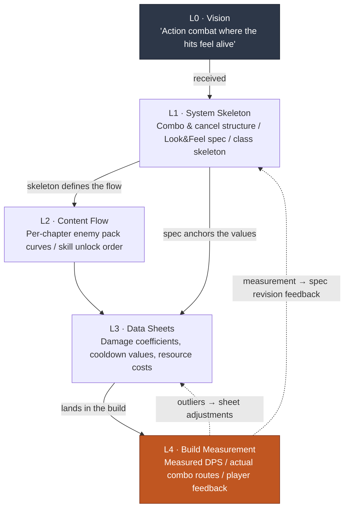

# 4.1 The Combat Designer and the Layer Stack — Which Cell Does Game Feel Go In

> **Learning Goals for This Chapter** (difficulty 🟡 practitioner · prerequisites: basic arithmetic and spreadsheet math): By the end, you will be able to decompose an abstract adjective like game feel into measurable signals, and assign coordinates for which Layer cell each of the combat designer's five deliverables sits in.

A build review meeting. The programmer pulls up the new skill they just hooked in. The character swings a sword; the enemy gets knocked back. Five people are watching. Someone says,

"Hmm... the hit feels a little weak somehow."

The person next to them nods. "Yeah, it's kind of flat."

The programmer asks, "What should I change, and by how much?"

Silence. None of the five people in the room can answer that question with a number. All five felt that "the hits feel weak," but nobody can say "take the hitstop from 3 frames to 5." The meeting spends 40 minutes trading adjectives — "make it heavier," "it lacks impact" — and ends with "let's look at it again in the next build."

This scene compresses every problem in combat design. It is the area players feel most directly, yet the moment you put that feeling into words, all you have left are adjectives. Adjectives can't be measured, and what can't be measured can't be tuned. The combat designer's first job is to pull those adjectives down into numbers.

This chapter decides which cell those numbers go in: where each of the combat designer's five deliverables sits on the Layer stack, and why those coordinates are the precondition for automation. The hands-on tools in 4.2, 4.3, and 4.4 move on top of these coordinates.

> **One Line for Non-Specialists.** You don't need to memorize combat values or frame units in this part. The single thing to take away is this — **"a request that travels as adjectives can be neither measured nor tuned."** The moment you pull "make it heavier" down to "change what, to what value," collaboration starts to move — and that idea applies unchanged to vague feedback in any job outside games. Skim the five deliverables in 4.1.1 lightly; this one idea is all you need to carry forward.

---

## 4.1.1 The Five Things on a Combat Designer's Desk

Summed up in one line, the deliverables a combat designer owns cover "the entire process by which player input is converted into on-screen action." I split that into five chunks.

**First, the combat Look & Feel spec.** A document that translates abstractions like game feel, responsiveness, and weight into measurable values. This is the hardest deliverable in the discipline, and it becomes the yardstick by which the other four are judged.

Look & Feel breaks down into four signals.

- **Hit timing** — how many ms pass from the moment the input button is pressed until a visual or audio response appears on screen
- **Hitstop** — how many frames the screen freezes at the moment a hit lands (typically 1–6 frames)
- **Camera shake** — amplitude, duration, decay curve
- **Effect synchronization** — whether VFX, SFX, and UI feedback trigger on the same frame

Without this spec, the meeting-room scene repeats. With it, the tuning order comes out as "hitstop 3→5 frames, camera shake amplitude +20%."

**Second, the skill, combo, and cancel system.** The rules by which input is converted into action.

- Skill flow: input → cast → activation → recovery
- Combo rules: which skill can follow which skill, and what the bonus is
- Cancel rules: which actions can be canceled into which actions mid-motion
- Input buffer: how wide the window (ms) is for accepting the next input mid-action

**Third, character and monster AI.** NPC behavior logic — Behavior Trees (BT), state machines (FSM (finite state machine)/HFSM), and decision tables. Monster behavior patterns, boss phase transitions, allied NPC cooperation, and crowd simulation all live here.

**Fourth, the damage, resource, and cooldown formulas.** The math that converts player choices into outcomes: damage coefficients, defense mitigation, criticals, elemental modifiers; resource (MP/energy/stamina) consumption and recovery curves; cooldown distribution.

**Fifth, the animation control spec.** The blueprint that determines how design intent actually looks in the build — animation graphs, BTs, IK hookups. This is usually a collaboration with programmers and animators, but if the designer doesn't supply a spec of intent, the intent breaks in the build. Hand over the materials without a blueprint, and a different house gets built.

The key point here is that **all five meet on the same desk.** Change the combo rules (second) and the DPS in the damage formulas (fourth) shifts, which in turn changes the perceived weight in Look & Feel (first). If it isn't explicit which deliverable is the input to which, a single change shakes five places at once. That's why we need coordinates.

---

## 4.1.2 Which Layer Cell the Five Deliverables Sit In

Now I place the five combat deliverables on the L0–L4 coordinates established in 2.3. This mapping is the spine of the chapter.



Restated as a table:

| Layer | Combat design deliverable | Change frequency |
|---|---|---|
| L0 | (received — vision: "action combat where the hits feel alive") | Nearly fixed |
| L1 | Combo & cancel structure / Look & Feel spec / class skeleton | Slow |
| L2 | Per-chapter enemy pack progression curves / skill unlock flow | Medium |
| L3 | Skill damage coefficient sheets, cooldown values, resource costs | Fast |
| L4 | Measured DPS in the build, actually viable combo routes, player feedback | Every build |

What makes combat design distinctive is that **L4 carries more weight here than in any other discipline.** In narrative design, the L1 spec is very nearly the final product; combat is different. Whether "the hits feel good" lives in the territory you can only know by picking up the controller in the build and watching the screen. Even if the spec says "hitstop: 5 frames," whether that actually feels weighty is confirmed only at L4. That's why simulation and automated measurement tools create their biggest value in this discipline (4.4).

But a large L4 doesn't make L1 any less important. Look at the dotted arrows. L4 measurements feed back into the L1 spec. Without a spec, the measurements lose their point of comparison. Only with a 5-frame spec can you get the diagnosis "measured 4 frames — 1 frame missing." The cycle of spec → build → measurement → spec revision passes through all five Layers. The combat designer keeps a hand on this entire cycle — the seat where more Layers spin simultaneously on one desk than anywhere else.

---

## 4.1.3 From Adjectives to Numbers — One Spine of the Real Work

That's enough abstraction. Let's go back to the meeting room and watch, as a worked transcript, the actual process of pulling "the hits feel weak" down into numbers. The tool is a single LLM. The output is not polished, and the parts the human rejected are left in as-is.

This is a reconstruction of the actual flow in which the combat task force (TF) of an MMORPG project I run as design director (hereafter "Project A") turned the Look & Feel of one new melee skill into a spec.

### The Prompt (in Full)

```
Convert this skill's Look & Feel from adjectives into ms and frame values.
Five items: hit timing, hitstop, camera shake, effect synchronization, recovery.
Mark anything you're not sure of as "needs verification in this game."

Skill: greatsword overhead slash (heavy_overhead_slash)
Intent: "a heavy downward smash that staggers the enemy"
Frame rate: 60fps
```

*(Translation: "Convert this skill's Look & Feel from adjectives into ms and frame values. Five items: hit timing, hitstop, camera shake, effect synchronization, recovery. Mark anything you're not sure of as 'needs verification in this game.' Skill: greatsword overhead slash (heavy_overhead_slash). Intent: 'a heavy downward smash that staggers the enemy.' Frame rate: 60fps.")*

### Claude's Raw Output (Not Summarized or Tidied)

> The "weight" of the greatsword overhead slash is built mainly from **the length of the hitstop and the recovery**, plus **the decay of the camera shake**. Item by item:
>
> **1) Hit timing.** The heavier the weapon, the longer the startup from input to activation needs to be for the weight to land. From input to the first visual response (the character beginning to raise the sword), **50–80ms** (3–5 frames) is recommended. Note that the first *visual* response and the first *hit* response are different things. Time to impact depends on the motion length, so it can't be pinned down here — **needs verification against this game's motion lengths**.
>
> **2) Hitstop.** The key variable for a weighty single blow. If light attacks sit at 1–2 frames, the greatsword overhead slash should be **4–6 frames** (roughly 67–100ms). Past 6 frames, "weighty" tips over into "stuttery" and responsiveness suffers.
>
> **3) Camera shake.** Amplitude around 1–2% of screen height, duration 0.2–0.3 seconds, and for decay, **ease-out (fades quickly)** rather than linear. For a heavy blow, a curve with a strong first oscillation that dies down fast feels natural.
>
> **4) Effect synchronization.** VFX (hit effect), SFX (hit sound), and hitstop **must all trigger on the exact same frame as the hit**. Even a 1–2 frame mismatch reads as "flat." UI feedback (damage numbers) can lag 1–2 frames without harm.
>
> **5) Recovery.** Weight comes at the price of long recovery. From the hit landing until the character returns to a vulnerable, actionable state, **20–30 frames** (333–500ms) recommended. But this value varies widely with the game's overall combat tempo (fast action vs. deliberate soulslike) — **needs verification against this game's baseline tempo**.
>
> In sum: "weight = long startup + 4–6 frames of hitstop + ease-out shake + same-frame VFX/SFX/stop + long recovery." These numbers are general recommended ranges, though — **the actual sense of weight can only be finalized by testing it hands-on in the build.**

### Human Verification, Rejection, and Re-Request

The designer does not adopt this output wholesale. They stop at two points.

**Rejection 1 — camera shake amplitude "1–2% of screen height."** This game is mobile-first. On a small screen, 1–2% is barely visible, and there's the mobile motion-sickness issue on top of that. The designer rejects this recommendation and applies a house rule instead: "on mobile, express weight through emphasized hitstop, not shake." The LLM gave a general answer; it doesn't know this game's platform constraints.

**Hold 2 — hitstop "4–6 frames."** This is a hold, not a rejection. The range is right, but the exact value gets decided by feel in the build. The spec reads: "put 4 frames into the build as the default, create 5- and 6-frame variants, and compare all three by hand."

The re-request goes out like this.

```
This is a mobile-first project. Minimize camera shake and rewrite the spec
to express weight through hitstop, recovery, and SFX.
Lay out three hitstop variants — 4/5/6 frames — in a table for build comparison.
```

*(Translation: "This is a mobile-first project. Minimize camera shake and rewrite the spec to express weight through hitstop, recovery, and SFX. Lay out three hitstop variants — 4/5/6 frames — in a table for build comparison.")*

In this second output, the LLM produces a spec table that reflects the mobile constraints. That table goes into the build, and at the next build meeting the designer says, instead of an adjective, "the 4-frame variant is too light — adopt 5 frames." A 40-minute meeting becomes a 5-minute decision.

### What This Transcript Shows

Three things. First, the LLM is good at producing **a first draft that pulls adjectives down into numeric ranges** — this is what breaks the silence in the meeting room. Second, the LLM **does not know this game's constraints** (mobile, tempo, motion lengths) — it can only give general recommendations, so rejecting and adjusting them is the human's job. Third, the LLM itself pinned down, twice, that "this can only be finalized by hands-on testing in the build" — even the tool knows that the final call on weight belongs to human hands at L4.

---

## 4.1.4 Four Places Where AI Recoups Its Adoption Cost

The transcript above showed only one place (spec writing). Across combat design as a whole, AI creates value in four places.

**1) Simulation — the biggest value.** Pre-compute DPS (damage per second) curves, combo routes, and resource consumption without a build. It is overwhelmingly faster than making a build and measuring by hand. We work through this directly with the `simulate_dps` simulator in 4.4.

**2) Auto-generating state machines and BTs.** Convert a natural-language description like "this boss enrages below 50% HP, and while enraged uses a 3-hit chain pattern" into a BT/FSM diagram. Accuracy is high — rule structures are territory LLMs handle well. It saves the time of moving the logic in your head onto a diagram.

**3) Automated analysis of build captures.** Automatically extract hit timing, combo success rates, and damage distribution from play footage. But this is **the hardest of the four to implement** (we weigh it honestly below).

**4) Proposing balance adjustment candidates.** Analyze each row of the data sheet, detect outliers and rough spots in the curves, and propose adjustment candidates. The human only chooses.

Of these four, automated capture analysis (3) has the widest gap between "can be done" and "can be done easily." Books often write "AI extracts everything from the footage automatically," but in practice it isn't that simple. Pixel-based computer vision on footage, off-the-shelf vision APIs, in-game telemetry logs — the accuracy and implementation-cost comparison of the three capture methods is **covered authoritatively in 4.4; refer there.** Here I'll state only the conclusion.

The most realistic path is **in-game telemetry logs.** Have the engine emit events directly, like "frame 1204: skill_overhead lands, damage 340, combo count 3." This is source data, so it's accurate, and it takes a single insertion of logging code. The LLM is used to read those logs and summarize them into natural-language reports ("resource efficiency holds up through 3-hit combos, then drops sharply from the 4th"). Footage remains a secondary aid — humans eyeball only the suspicious cases.

In other words, the realistic form of the "AI auto-analyzes the footage" vision is **telemetry logs + LLM summarization**, not pixel vision. That honest distinction is the starting point for the tool choices in 4.4.

And one thing that does not change across all four places: **AI cannot make the final call that "the hits feel good."** That belongs to the realm of player emotion, and the responsibility for that emotion stays with humans. AI only produces the **supporting evidence** for that emotional judgment, fast. Simulation numbers, BT diagrams, telemetry reports — all of it is material for a human to make the call by feel.

---

## 4.1.5 The Real Reason for Splitting the Coordinates — The Precondition for Automation

So far the reason given was the surface one: "split the deliverables across Layers and collaboration speaks a common language." I explained that combo rules go in L1 and damage sheets in L3 because their change frequencies differ. True, but not the whole story.

The essential reason for splitting the coordinates is that **automation only works on top of them.** The general thesis — Layer decomposition as the precondition for procedural generation and automation — was covered in 2.3, so here I narrow it to how that precondition plays out in three kinds of combat automation.

**First, simulation only runs when "what is input and what can be changed" are kept separate.** If the deterministic core (physics, hitboxes — the L1 skeleton) is mixed in with the changeable spec (damage values, cooldowns — the L3 sheets), the simulator cannot define its "space of change candidates." Core fixed, sheets variable — only with that separation can `simulate_dps` run a sweep like "raise the damage coefficient from 280 to 340 in steps of 20 and plot the DPS curve."

**Second, automated capture analysis is only meaningful when action atoms are labeled.** Only when the spec side has an atom labeled "this frame range is the hit phase of `skill_overhead`" can the signals extracted from telemetry logs be automatically cross-checked against the spec. Without labels, the log is a string of meaningless dots: "something landed at frame 1204."

**Third, LLM combo-sequence generation only works when cancel rules and the input buffer are separated out into external documents.** A bounded request like "within this character's 7 cancelable pairs and a 200ms input buffer, propose 10 five-hit combo sequences" is possible only when the cancel rules aren't frozen inside code but exist as standalone documents.

All three say the same single sentence. **Mix the deterministic core with the spec and automation is blocked; separate them and automation opens up.** The surface purpose of Layer decomposition is a common collaboration language; the essential purpose is to lay the preconditions for automated simulation, capture analysis, and LLM sequence exploration.

### From Conservative to Progressive Application

Once this foundation is laid, combat operations evolve in two stages.

**Conservative application — humans design, automation verifies.** This is where most action and MMORPG combat operations are today. Humans write the combo/cancel specs directly; automation simulates DPS and resources, captures via telemetry, and produces "spec vs. measurement" comparison reports. Humans interpret the gaps, decide on spec revisions, and the cycle returns to spec writing. Design is human; simulation, capture, and comparison are automated.

**Progressive application — AI proposes candidates, humans only adopt.** The next stage. AI automatically enumerates 10–30 sequences within the cancel pairs and the input buffer; automation simulates each sequence's DPS and resources in parallel; the LLM attaches rankings and interpretation ("1st in resource efficiency, medium input difficulty"). What remains in human hands is one decision — "which of these sequences do we adopt as the signature?" — plus the director's calls on build integration and motion capture. Creating a sequence from zero and choosing among 30 are different orders of workload.

For progressive application to take root, three things must be in place: (1) deterministic simulation infrastructure that computes DPS, resources, and survival time in under a second without a build; (2) action atoms whose combo, cancel, and input-buffer rules are separated out into labeled external documents; (3) telemetry-based automated capture analysis. All three are direct products of the Layer decomposition described above.

### Motion Capture Is an Irreversible Step — The Decision Gate

Finally, reversibility. The combat designer's review cycle mixes steps that can be undone with steps that can't, and knowing where that boundary lies matters.

<svg viewBox="0 0 720 230" xmlns="http://www.w3.org/2000/svg" font-family="sans-serif">
  <rect x="0" y="0" width="720" height="230" fill="#fbfbfb"/>
  <text x="20" y="30" font-size="15" font-weight="bold" fill="#1a202c">Reversible ──────────▶ Decision gate ──────▶ Irreversible</text>

  <!-- Reversible step boxes -->
  <rect x="20" y="55" width="150" height="44" rx="6" fill="#c6f6d5" stroke="#2f855a"/>
  <text x="95" y="78" font-size="12" text-anchor="middle" fill="#22543d">Combo &amp; cancel</text>
  <text x="95" y="93" font-size="12" text-anchor="middle" fill="#22543d">spec revision</text>

  <rect x="20" y="110" width="150" height="44" rx="6" fill="#c6f6d5" stroke="#2f855a"/>
  <text x="95" y="133" font-size="12" text-anchor="middle" fill="#22543d">Sim runs &amp; reports</text>
  <text x="95" y="148" font-size="11" text-anchor="middle" fill="#22543d">(results freely discarded)</text>

  <rect x="20" y="165" width="150" height="44" rx="6" fill="#c6f6d5" stroke="#2f855a"/>
  <text x="95" y="188" font-size="12" text-anchor="middle" fill="#22543d">Data sheet</text>
  <text x="95" y="203" font-size="12" text-anchor="middle" fill="#22543d">value tuning</text>

  <!-- Partially reversible -->
  <rect x="220" y="110" width="160" height="44" rx="6" fill="#feebc8" stroke="#c05621"/>
  <text x="300" y="133" font-size="12" text-anchor="middle" fill="#7b341e">Build integration (dev)</text>
  <text x="300" y="148" font-size="11" text-anchor="middle" fill="#7b341e">Partially reversible</text>

  <!-- Gate -->
  <line x1="430" y1="40" x2="430" y2="215" stroke="#e53e3e" stroke-width="2.5" stroke-dasharray="6 4"/>
  <text x="430" y="225" font-size="12" text-anchor="middle" fill="#e53e3e" font-weight="bold">Decision gate</text>

  <!-- Irreversible -->
  <rect x="480" y="80" width="210" height="48" rx="6" fill="#fed7d7" stroke="#c53030"/>
  <text x="585" y="103" font-size="12" text-anchor="middle" fill="#742a2a">Motion capture (signature actions)</text>
  <text x="585" y="119" font-size="11" text-anchor="middle" fill="#742a2a">Capture studio, actors, reshoot costs</text>

  <rect x="480" y="140" width="210" height="48" rx="6" fill="#fed7d7" stroke="#c53030"/>
  <text x="585" y="163" font-size="12" text-anchor="middle" fill="#742a2a">Build integration (live)</text>
  <text x="585" y="179" font-size="11" text-anchor="middle" fill="#742a2a">Hotfix costs, shifts in player perception</text>
</svg>

Motion capture is the thickest irreversible step in combat. Capture studio scheduling, actor booking, reshoot costs — all of it is expensive. So motion capture for signature actions proceeds **only after simulation and automated capture analysis have run long enough to lock the sequence.** Conservative or progressive, the decision gate sits just before motion capture and the live build. Every one of the combat designer's reviews must finish in the reversible steps to the left of that gate to be safe.

---

## 4.1.6 The Scene at the Studio — What Shrank

These are the changes Project A's combat TF measured over six months of running the coordinates and tools above. The figures below are rough averages pulled from the TF's operating records; the accurate way to read them is as **the direction of perceived change**, not as precise measurements.

| Item | Before adoption | After adoption |
|---|---|---|
| Look & Feel meeting time | 2 hours average (subjective debate) | 30 minutes average (anchored to measurements) |
| Combo diagram authoring | 1–2 hours per skill set | 10 minutes per skill set |
| DPS curve verification | Manual measurement after build (≈1 day) | Simulation (≈10 minutes) |
| Balancing a new skill | 3–4 build cycles | 1–2 build cycles |

The direction matters more than the numbers themselves. All four items moved from "subjective debate, manual measurement, build iteration" to "measurements, simulation, automated diagrams." Adjectives went down in the meeting room and numbers went up. That is the one sentence this whole chapter is trying to say — the combat designer's job is to build the bridge from the subjective (game feel, fun) to the objective (numbers, simulation), and AI is the tool that lays that bridge fast. The hand that decides "this feels weighty" at the end of the bridge is still human.

---

## Key Takeaways

- Combat design is the seat where the most Layers spin at once on a single desk, from the L1 spec through the L3 sheets to L4 build measurements.
- The surface purpose of Layer decomposition is a common collaboration language; its essence is the precondition for automation — simulation, capture, and LLM exploration.
- The final call on "the hits feel good" belongs to humans; AI rapidly produces the evidence behind that call.

---

## Try It Yourself — Pulling Adjectives Down into Numbers

**setup.** All you need is one LLM. Pick one skill you have on hand (new or existing). Write its intent as a single adjective line — "heavy," "nimble," "ponderous," something like that.

**prompt.** Fill your skill's details into the skeleton below.

```
You are a combat design assistant. Convert the Look & Feel of the skill
below into a "measurable numeric spec" — in ms, frames, and %, not adjectives.
Mark any item you're not sure of as "needs verification in this game."

Skill: [name]
Intent: "[one adjective line]"
Frame rate: [60fps, etc.]
Items: 1) hit timing 2) hitstop 3) camera shake 4) effect synchronization 5) recovery
```

*(Translation: "You are a combat design assistant. Convert this skill's Look & Feel into a 'measurable numeric spec' — in ms, frames, and %, not adjectives. Mark any item you're not sure of as 'needs verification in this game.' Skill: [name] / Intent: '[one adjective line]' / Frame rate: [60fps, etc.] / Items: 1) hit timing 2) hitstop 3) camera shake 4) effect synchronization 5) recovery.")*

**verify.** Ask two questions of every number in the output. (1) Does this value hold under this game's constraints (platform, tempo, motion lengths)? → If not, state the constraints and re-request. (2) Does this value need to be finalized hands-on in the build? → If so, write 2–3 variants into the spec instead of a single value and compare them in the build. Never adopt as-is any item the LLM itself flagged as "needs verification."

## 4.1.7 Solo Scale-Down

If you're building a game alone, you don't need all five deliverables and all five Layers. Do just two things at minimum. **One, a one-page Look & Feel spec** — for your 3–5 core actions, write down only hitstop, recovery, and synchronization as numbers. A memo written in adjectives will be unreadable even to you six months later. **Two, pull combos and cancels out of the code into a single file** — once the cancel pairs live as data, you can later ask an LLM to "propose 5 combos from these pairs." These two are the minimum coordinates that keep the door to automation open even in solo development.
