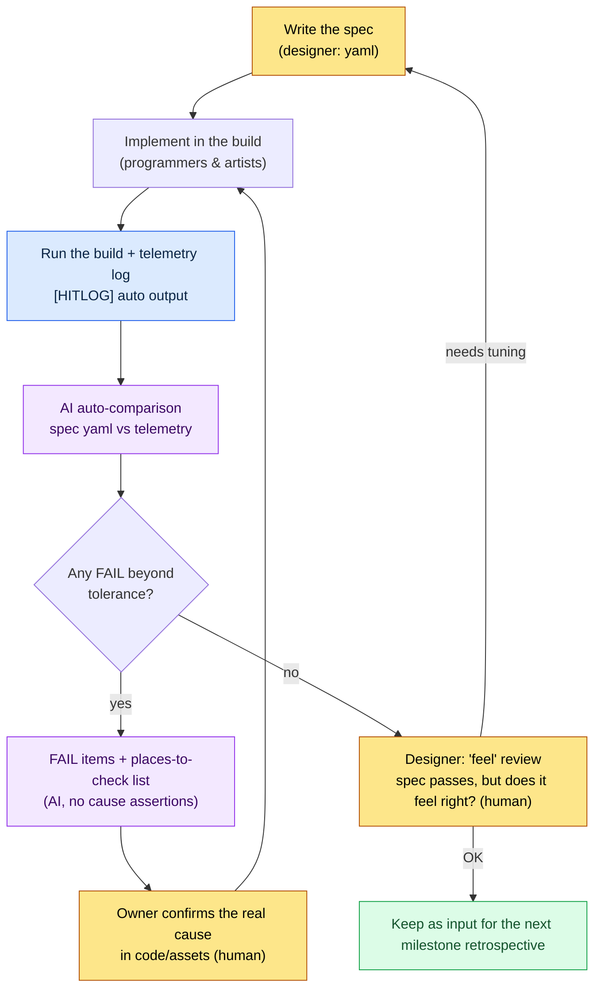

# 4.2 Combat Look & Feel — Pinning Game Feel Down in Data

Five people are gathered in front of the meeting room monitor. The same build, the same skill, the same 30-second clip is playing on screen for the third time. The client programmer speaks first. "Looks fine to me." The artist crosses their arms. "It's weak. Something's missing." The designer next to them cuts in. "The effects are good, but it doesn't stick to your hands." The director watches for a long while and makes the call. "Hmm... let's go just a bit heavier."

And the meeting ends. Nobody wrote down how many milliseconds or how many frames "just a bit heavier" actually is. In the next build, the programmer implements their own understanding of "heavier," and the artist layers on their own. And the following week, in the same meeting room, watching the same clip, the same conversation repeats.

Hit feel, game feel, Look & Feel. These are the most frequently used and least defined words in combat design. Everyone believes they know what they mean, but everyone's mental definition differs, so the discussion ends with nothing to show for it. This chapter is about decomposing that "feel" into measurable numbers — about pulling game feel down from abstraction into data.

---

## 4.2.1 Combat = Look & Feel, Systems = Behavior

Let me draw a boundary first. Combat design splits into two broad branches.

- **Combat systems**: how it behaves. Damage formulas, cooldowns, stack accumulation, status effect rules. That is the territory of the next chapters (4.3 combos and cancels, 4.4 AI simulation).
- **Combat Look & Feel**: how it feels. When the screen responds after you press the button, how long the screen freezes at the moment of impact, whether the effects, the sound, and the rumble fire at the same instant.

This chapter covers only the latter. Whether the damage is 100 or 120 has no direct bearing on game feel. What matters is how the player perceives the moment that 100 damage "lands." Even with an identical damage formula, different hit timing and hitstop make it feel like a completely different game.

Let me be honest about one thing up front. Hit feel is not completed by three numbers alone. The acceleration and deceleration curves of the attack motion (animation), the reaction on the receiving end (hit reaction, hitstun), and the squash-and-stretch deformation that Japanese action games of the '80s and '90s loved — exaggerating the character at the moment of impact with stretching, squashing, afterimages, and smears — all have to come together before "I got hit" registers as a single, unified sensation. **What this chapter focuses on pulling down into measurable numbers** is three of those axes. Motion, reaction, and deformation are areas where animators and artists have the bigger hand, so they belong to later chapters and the art part; here the weight is on the three axes a game designer can pin down in a spec and verify in a build. Those three axes break down like this.

<svg viewBox="0 0 720 250" xmlns="http://www.w3.org/2000/svg" font-family="sans-serif">
  <rect x="0" y="0" width="720" height="250" fill="#fafafa" stroke="#ddd"/>
  <text x="360" y="32" text-anchor="middle" font-size="17" font-weight="bold" fill="#222">The Three Measurable Axes (not all of game feel)</text>
  <!-- axis 1 -->
  <rect x="40" y="70" width="190" height="140" rx="8" fill="#e8f0fe" stroke="#4a76d4" stroke-width="2"/>
  <text x="135" y="100" text-anchor="middle" font-size="15" font-weight="bold" fill="#2a4a9a">Hit timing</text>
  <text x="135" y="128" text-anchor="middle" font-size="12" fill="#444">Input → response</text>
  <text x="135" y="148" text-anchor="middle" font-size="12" fill="#444">When does it respond?</text>
  <text x="135" y="178" text-anchor="middle" font-size="13" font-weight="bold" fill="#2a4a9a">Unit: ms</text>
  <text x="135" y="198" text-anchor="middle" font-size="11" fill="#777">"Is the response fast?"</text>
  <!-- axis 2 -->
  <rect x="265" y="70" width="190" height="140" rx="8" fill="#fde8e8" stroke="#d44a4a" stroke-width="2"/>
  <text x="360" y="100" text-anchor="middle" font-size="15" font-weight="bold" fill="#9a2a2a">Hitstop</text>
  <text x="360" y="128" text-anchor="middle" font-size="12" fill="#444">Moment of impact</text>
  <text x="360" y="148" text-anchor="middle" font-size="12" fill="#444">How long time freezes</text>
  <text x="360" y="178" text-anchor="middle" font-size="13" font-weight="bold" fill="#9a2a2a">Unit: frame</text>
  <text x="360" y="198" text-anchor="middle" font-size="11" fill="#777">"Does it feel heavy?"</text>
  <!-- axis 3 -->
  <rect x="490" y="70" width="190" height="140" rx="8" fill="#e8f6ec" stroke="#3a9a5a" stroke-width="2"/>
  <text x="585" y="100" text-anchor="middle" font-size="15" font-weight="bold" fill="#1a6a3a">Effect sync</text>
  <text x="585" y="128" text-anchor="middle" font-size="12" fill="#444">VFX·SFX·UI·</text>
  <text x="585" y="148" text-anchor="middle" font-size="12" fill="#444">camera·rumble</text>
  <text x="585" y="178" text-anchor="middle" font-size="13" font-weight="bold" fill="#1a6a3a">Unit: frame offset</text>
  <text x="585" y="198" text-anchor="middle" font-size="11" fill="#777">"Does it fire as one event?"</text>
  <!-- plus signs -->
  <text x="247" y="148" text-anchor="middle" font-size="26" fill="#999">+</text>
  <text x="472" y="148" text-anchor="middle" font-size="26" fill="#999">+</text>
  <text x="360" y="240" text-anchor="middle" font-size="12" fill="#666">These three are what gets measured — motion, hit reaction, deformation are art/animation territory (separate)</text>
</svg>

When someone in the meeting room says "it's weak," that weakness comes from one of the three. Is the response late (timing)? Is there no sense of impact (hitstop)? Are things firing out of step (synchronization)? Decompose the question into the three axes, and "it's weak" finally becomes a sentence you can fix.

That said, the cause of "weak" does not always live in these three axes. Here is the full list of what makes up Look & Feel, with a line drawn around what this chapter takes responsibility for.

| Look & Feel component | What it is | In this chapter |
|---|---|---|
| **Hit timing** | ms from input to first response. The first suspect | Measured and specced (axis 1) |
| **Hitstop** | How long time freezes at the moment of impact to give weight | Measured and specced (axis 2) |
| **Camera shake** | The screen recoil that accompanies a hit | Measured and specced (part of axis 3) |
| **VFX/SFX timing** | Whether effects and sound sync to the hit frame | Measured and specced (part of axis 3) |
| Attack motion (animation) | Acceleration/deceleration of the swing, the curves of anticipation and follow-through | Mentioned (art/animation territory) |
| Hit reaction, hitstun | The flinch and stagger on the receiving end | Mentioned (next chapters, art part) |
| Deformation (squash and stretch) | Exaggerated stretching and squashing at the moment of impact (afterimages, smears) | Mentioned (art part) |
| Controller rumble | Physical feedback delivered to the hands | Measured and specced (part of axis 3) |

The top four bundle into this chapter's three axes and become the targets of measurement and specification. The middle three (motion, reaction, deformation) must not be missing, but they are art/animation territory that a designer alone cannot close out with numbers, so I only make clear that they exist. If the motion is stiff or the target just stands there unfazed, hit feel will not land even with all three axes dialed in.

---

## 4.2.2 Hit Timing — From Input to Response

There is a reason timing comes first among the three axes. When players doubt the game feel, the first thing that snags is the sense that "the response is late," and no matter how flashy everything else is, sluggish input brings it all down in that instant. So timing gets fixed first.

The first axis of game feel is time. From the instant the button is pressed (0ms) to the instant the screen first responds — how many ms does it take? Humans are astonishingly sensitive to this latency. The difference between 60ms and 120ms is something "you can't explain in words, but your hands know."

A single attack is not one simple point; it is multiple events laid out across time. Put one basic attack on a timeline and it looks like this.

<svg viewBox="0 0 720 270" xmlns="http://www.w3.org/2000/svg" font-family="sans-serif">
  <rect x="0" y="0" width="720" height="270" fill="#fafafa" stroke="#ddd"/>
  <text x="360" y="28" text-anchor="middle" font-size="16" font-weight="bold" fill="#222">Basic attack, first hit — timeline (warrior / skill_id 1001)</text>
  <!-- timeline axis -->
  <line x1="60" y1="220" x2="680" y2="220" stroke="#333" stroke-width="2"/>
  <!-- ticks: 0,100,150,250,350 ms mapped 60..680 over 0..380ms => scale (680-60)/380=1.63px/ms -->
  <g font-size="11" fill="#555">
    <line x1="60" y1="215" x2="60" y2="225" stroke="#333"/><text x="60" y="245" text-anchor="middle">0ms</text>
    <line x1="223" y1="215" x2="223" y2="225" stroke="#333"/><text x="223" y="245" text-anchor="middle">100</text>
    <line x1="305" y1="215" x2="305" y2="225" stroke="#333"/><text x="305" y="245" text-anchor="middle">150</text>
    <line x1="468" y1="215" x2="468" y2="225" stroke="#333"/><text x="468" y="245" text-anchor="middle">250</text>
    <line x1="631" y1="215" x2="631" y2="225" stroke="#333"/><text x="631" y="245" text-anchor="middle">350</text>
  </g>
  <!-- input -->
  <line x1="60" y1="60" x2="60" y2="220" stroke="#4a76d4" stroke-width="2" stroke-dasharray="4 3"/>
  <text x="62" y="55" font-size="11" fill="#2a4a9a">Input (0)</text>
  <!-- casting motion bar 0..100 -->
  <rect x="60" y="70" width="163" height="20" rx="4" fill="#c9d8f5" stroke="#4a76d4"/>
  <text x="141" y="84" text-anchor="middle" font-size="11" fill="#2a4a9a">Casting motion 0~100</text>
  <!-- hitbox 100..150 -->
  <rect x="223" y="98" width="82" height="20" rx="4" fill="#f5d6c9" stroke="#d4764a"/>
  <text x="264" y="112" text-anchor="middle" font-size="10" fill="#9a4a2a">Hitbox 100~150</text>
  <!-- vfx 100..250 -->
  <rect x="223" y="126" width="245" height="20" rx="4" fill="#d6e8d9" stroke="#3a9a5a"/>
  <text x="345" y="140" text-anchor="middle" font-size="11" fill="#1a6a3a">Visual effects 100~250 (fade after 50ms delay)</text>
  <!-- damage at 110 -->
  <line x1="76" y1="154" x2="76" y2="172" stroke="#d44a4a" stroke-width="0"/>
  <circle cx="239" cy="164" r="6" fill="#d44a4a"/>
  <text x="248" y="168" font-size="10" fill="#9a2a2a">Damage applied 110 (10ms after visuals → perceived as simultaneous)</text>
  <!-- afterdelay 150..350 -->
  <rect x="305" y="182" width="326" height="18" rx="4" fill="#eee" stroke="#aaa"/>
  <text x="468" y="195" text-anchor="middle" font-size="10" fill="#777">Recovery 150~350 (until next input is accepted)</text>
</svg>

The most important number in this diagram is the 100ms at which the hitbox first turns on. It means hit detection for the attack begins 100ms after the button press. This value determines the perceived speed of the game feel.

Recommended ranges vary by genre and character, but rough baselines exist.

| Type | Recommended input→response | Notes |
|---|---|---|
| Instant response (light attacks) | 60\~120ms | The core range for attacks that "stick" to your hands |
| Heavy response (big skills) | 200\~400ms | Deliberate startup for the sake of weight |
| Charging (long charge-up) | 500\~2000ms | Intentional wait, handled separately |

These ranges are not absolute standards. As an **author's estimate (unverified)**: casual mobile tends to drift about ±50ms toward input leniency, while console fighting games tend to tighten further. What matters more than the numbers themselves is that the team shares a baseline — "we agreed our light attacks are 90ms." Only with a baseline can you look at a build and call it "right" or "wrong."

But there is a trap here. The human eye cannot tell 90ms from 110ms. At 60fps one frame is about 16.67ms, and this 20ms difference is barely more than a single frame. Whether "feels a bit slow?" in the meeting room is right or wrong can never be settled by eye. That is why measurement is needed.

---

## 4.2.3 Extracting Timing from the Build — An Honest Comparison

The spec says "hitbox 100ms." How do you confirm the build actually turns it on at 100ms? Automation splits three ways (video analysis, off-the-shelf vision tools, in-game telemetry); the precision and difficulty comparison of the three is treated canonically in 4.4. Here I will state only the conclusion. The first thing to lay down in practice is **in-game telemetry**. The reason is simple. Rather than inferring from video which frame the VFX "appeared" on screen, having the code print a single `[HITLOG]` line on the frame it fires the `OnHit` event is incomparably more accurate and cheaper. Save video analysis for external footage with no input overlay (e.g., analyzing a competitor's game); for our own build, telemetry goes in first.

A telemetry log looks like this.

```
[HITLOG] frame=6  t_ms=100  evt=hitbox_on    skill=1001 char=warrior
[HITLOG] frame=6  t_ms=100  evt=vfx_trigger  skill=1001
[HITLOG] frame=6  t_ms=100  evt=sfx_trigger  skill=1001
[HITLOG] frame=7  t_ms=117  evt=damage_apply skill=1001 dmg=124
[HITLOG] frame=7  t_ms=117  evt=ui_dmgnum    skill=1001
[HITLOG] frame=6  t_ms=100  evt=cam_shake    skill=1001 amp=0.4
```

The designer's job is to check this log against the spec, line by line. It is mostly unit conversion and mechanical matching — a human repeating it by eye gets tired and makes mistakes, but an LLM does not tire. In the next section, I put it to work.

---

## 4.2.4 Worked Transcript — Checking the Telemetry Log Against the Spec

I pasted in both the spec yaml and the build's telemetry log, and told the AI to compare the two and find where they diverge. Below is the full prompt, Claude's raw output, and the entire human verification process. Nothing is summarized; it is reproduced as is.

### First Prompt

```
Below are the 'hit timing spec' for one combat skill and the telemetry
log pulled from the actual build. Organize the items where the build diverges from the spec into a table.

[Spec]
character: warrior
skill_id: 1001
fps: 60
events:
  hitbox_on:    {expect_ms: 100, tol_frame: 0}
  vfx_trigger:  {expect_ms: 100, tol_frame: 0}
  sfx_trigger:  {expect_ms: 100, tol_frame: 1}
  damage_apply: {expect_ms: 110, tol_frame: 1}
  ui_dmgnum:    {expect_ms: 100, tol_frame: 2}
  cam_shake:    {expect_ms: 100, tol_frame: 1}

[telemetry log]
[HITLOG] frame=6  t_ms=100  evt=hitbox_on    skill=1001
[HITLOG] frame=6  t_ms=100  evt=vfx_trigger  skill=1001
[HITLOG] frame=8  t_ms=133  evt=sfx_trigger  skill=1001
[HITLOG] frame=7  t_ms=117  evt=damage_apply skill=1001
[HITLOG] frame=9  t_ms=150  evt=ui_dmgnum    skill=1001
[HITLOG] frame=6  t_ms=100  evt=cam_shake    skill=1001

60fps (1 frame = 16.67ms). Convert expect_ms to frames, compare against
the log's frame values, and mark anything whose difference exceeds tol_frame as FAIL.
```

### Claude's Raw Output (Verbatim)

> First, I will convert the spec's expect_ms values to frames. At 60fps, frame = round(ms / 16.67).
>
> - hitbox_on: 100 / 16.67 ≈ 6.0 → frame 6
> - vfx_trigger: 100 → frame 6
> - sfx_trigger: 100 → frame 6
> - damage_apply: 110 / 16.67 ≈ 6.6 → frame 7 (rounded)
> - ui_dmgnum: 100 → frame 6
> - cam_shake: 100 → frame 6
>
> Here is the comparison against the actual frames in the log.
>
> | Event | Expected frame | Actual frame | Diff (frames) | Tolerance | Verdict |
> |---|---|---|---|---|---|
> | hitbox_on | 6 | 6 | 0 | 0 | PASS |
> | vfx_trigger | 6 | 6 | 0 | 0 | PASS |
> | sfx_trigger | 6 | 8 | +2 | 1 | **FAIL** |
> | damage_apply | 7 | 7 | 0 | 1 | PASS |
> | ui_dmgnum | 6 | 9 | +3 | 2 | **FAIL** |
> | cam_shake | 6 | 6 | 0 | 1 | PASS |
>
> Two items exceeded their tolerance.
> - **sfx_trigger**: the sound is 2 frames (about 33ms) behind the visual hit. Exceeds the 1-frame tolerance. Players are likely to feel that "the sound is slightly out of sync."
> - **ui_dmgnum**: the damage number appears 3 frames (about 50ms) late. Exceeds the 2-frame tolerance. This can come across as "I landed the hit, but the number shows up late."
>
> damage_apply at frame 7 matches the spec's frame 7 (converted from 110ms), so it is normal. However, the fact that damage_apply is 1 frame after hitbox_on (frame 6) may need confirmation as to whether this is intended design.

### Human Verification — I Rejected One Cell

I did not take the output on faith. There were two verification points.

**Verification 1 (rounding boundary — passed).** The 110ms conversion for damage_apply looked suspicious. 110 / 16.67 = 6.598…. Rounded, 7 is correct. But what if the spec's intent had been "frame 6 — the same frame as 100ms"? I checked directly: the spec deliberately set `damage_apply: expect_ms 110`, a 10ms offset from vfx (100). So the frame 7 conversion was accurate. The AI passed.

**Verification 2 (the last sentence — rejected).** The AI's closing remark — "the fact that damage_apply is 1 frame after hitbox_on may need confirmation as to whether this is intended design" — was noise. The spec already states the intent with expect_ms 110, and the AI turned that into a "needs confirmation" question. Given the spec, the answer should be closed within the spec; instead it manufactured an unnecessary question. I did not adopt that sentence.

I re-requested, including the reason for the rejection.

### Second Prompt (Re-request)

```
damage_apply has its intent pinned in the spec as 110, so drop the 'needs confirmation' comment.
// meaning: do not ask back about items whose answer is closed within the spec
Keep only the two FAILs (sfx, ui_dmgnum), and instead of asserting causes,
give me a checklist of 'code/resource locations to check'.
```

### Claude's Second Output (Verbatim)

> Here is the verification checklist for the two FAIL items. No causes are asserted; only the places to check are listed.
>
> **sfx_trigger (+2 frames late)**
> - [ ] Is the sound trigger bound to the same event as `hitbox_on`, or is it hooked to a separate animation notify?
> - [ ] Does the audio asset itself have leading silence — an empty stretch at the head of the file can present as latency
> - [ ] Was the playback call issued on the same frame but pushed back by output latency (platform audio buffer)?
>
> **ui_dmgnum (+3 frames late)**
> - [ ] Is the damage number UI structured to update on a separate tick after `damage_apply` (frame 7)?
> - [ ] Is UI updating batched at the end of the next frame (deferred render queue)?
> - [ ] Is there an extra delay value on the start frame of the number pop-up animation?
>
> What can be asserted: both items exceed the spec's tolerance and are later than the visual hit (frame 6). What cannot be asserted: which of the causes above is responsible — unknowable until code/assets are checked.

This second output I adopted as is. Not inventing causes, and converting them into "places to check," was exactly the form I wanted. I handed the checklist directly to the sound owner and the UI owner. For sound, 33ms of leading silence in the audio asset was the culprit (checklist item 2). For UI, it was the next-frame update structure (item 1).

This is where the division of labor becomes clear. **The AI mechanically compares spec against log and catches the FAILs; the human (a) rejects the unnecessary counter-questions the AI generates and (b) confirms the real cause of each FAIL in the code.** Ask the AI to assert causes and it will produce plausible lies, so it is safer to stop it at "places to check."

---

## 4.2.5 Hitstop — The Weight of a Hit

The second axis is the stop. The effect of freezing — or briefly slowing — game time at the very instant a hit lands. This determines the intensity of the "I connected" sensation. It is the most powerful game-feel tool in fighting games and action RPGs. Too long and it feels sluggish; too short and there is no weight.

Recommended ranges (at 60fps) are below. These figures are rough conventions in action games; absolute values are tuned per game.

| Type | Recommended frames | Converted |
|---|---|---|
| Light hit | 1\~2 frames | 16\~33ms |
| Medium hit | 3\~5 frames | 50\~83ms |
| Heavy hit (finisher) | 6\~12 frames | 100\~200ms |
| Critical / weak-point hit | above values + 2\~3 frames | — |

Each character and skill must get different values. Give everything the same number and the weight differences vanish — every attack eventually converges on the same tone. This is the point that leads into one of 4.2's three Key Takeaways.

"Who stops" is also a design choice.

| Option | Effect | Fits |
|---|---|---|
| Attacker only | Weight on the attacker's side; the victim's knockback/knockdown continues | Action |
| Victim only | Victim pauses briefly; attacker moves freely | Combo-friendly |
| Both | Strongest sense of weight | Fighting-game tradition |

The spec is entered like this.

```yaml
character: warrior
skill_id: 1001
hit_stop:
  attacker: 2          # frames
  victim: 4
  critical_multiplier: 1.5   # 1.5x on critical (rounded)
```

Hitstop is the axis where game-feel verification is hardest — spec numbers alone cannot settle "right or wrong." Telemetry can catch whether it actually stopped for 4 frames, but whether 4 frames is appropriate has to be judged by a human, hands on the build. The AI guarantees conformance to the spec; the human judges whether the spec value itself is right.

---

## 4.2.6 Effect Synchronization — Does Everything Fire on the Same Frame?

The third axis is simultaneity. When VFX (visual effects), SFX (sound), UI (damage numbers), camera (shake), and rumble (controller) all start on the same frame, the player's brain binds them into "one event." Even a 1\~2 frame misalignment reads as "something's off"; at 3\~5 frames it reads as "looks like a bug." The sfx 2 frames late and the ui 3 frames late that FAILed in the earlier worked transcript were exactly this axis's problem.

The five synchronization targets and their tolerances:

| Element | Trigger point | Tolerance |
|---|---|---|
| VFX (visual effects) | Hit frame | ±0 (must be simultaneous) |
| SFX (sound) | Hit frame | ±1 frame (16ms) |
| UI damage numbers | Hit frame | ±2 frames |
| Camera shake | Hit frame | ±1 frame |
| Controller rumble | Hit frame | ±2 frames |

The key point is that **all five** belong in the spec. The common mistake is to spec only the VFX and leave the other four to "they'll line up somehow." If it is not in the spec, build verification has no baseline — even if telemetry captures it, there is nothing to compare against. Only when all five are in the spec does the automated comparison close.

For the automated comparison, the worked transcript from the previous section applies as is. If the telemetry log records the trigger frames for all five, the AI checks them against the spec and reports only the items beyond tolerance. No human has to eyeball 100 skills on every build. What remains separate, though: the AI catches deviations from the spec, while the human catches the territory where "the spec all passes, but it still doesn't feel right."

---

## 4.2.7 From Spec to the Next Build — The Full Loop

Now to connect the pieces into a single flow. Once this loop starts turning, the meeting room's "just a bit heavier" gets translated into "hitstop victim 4→6 frames."



In this loop, the boxes the AI owns (D, F) and the boxes humans own (A, G, H) divide cleanly. The AI is strong at mechanical comparison and checklist generation; humans are strong at setting baselines, confirming causes, and making the final call on feel. Automation does not remove the human — it releases them from the half-day of "counting frames by eye" they used to spend each cycle, so they can focus on the feel alone.

The last box in the loop (I) matters. This measurement data is not used once and thrown away; it feeds back in as input for the next milestone retrospective. When a pattern like "last quarter's game-feel FAILs clustered in sfx synchronization" survives as data, next quarter you fix the audio pipeline first.

---

## 4.2.8 Where Measurement Cut the Debate Short — Operational Observations

These are the changes I observed over roughly six months of running the loop above on a mobile MMORPG project where I served as director (hereafter "Project A"). The figures below are not precision instrumentation; they are the **author's operational observations (estimates included)**, based on meeting-minute timestamps and build verification records. Read them for direction and ratio. Do not cite the absolute values as a benchmark.

| Item | Before | After | Nature |
|---|---|---|---|
| Time per Look & Feel meeting | Dragged on | Cut to less than half | From meeting minutes; perceived |
| Build verification (many skills) | Nearly a full day | Sharply reduced | Effect of automated telemetry comparison |
| Resolving "weak hit feel" feedback | Several build cycles | 1\~2 cycles | Small sample; direction only |
| Spec-to-build conformance | Around half | Mostly conformant | Became measurable after telemetry |

The essence is the qualitative change, not the numbers. When "it's weak" came up in the meeting room, the immediate follow-up became "which axis? Timing? Hitstop? Sync?" — and when no answer came, we pulled up the telemetry together. **That a measurable, objective standard gave the debate a destination** is the biggest change of those six months. "Just a bit heavier" walked out of the meeting room undefined far less often.

---

## 4.2.9 Common Mistakes and How to Avoid Them

| Mistake | Avoidance |
|---|---|
| Verifying the build before there is a spec | Spec first. Without a baseline, "right or wrong" is impossible |
| Reaching for video analysis first | For our own build, telemetry first. Video analysis is for external footage only |
| Having the AI assert FAIL causes | Stop at the "places to check" checklist. A human confirms the cause in code |
| Speccing only VFX and dropping the other four | All five (VFX, SFX, UI, camera, rumble) go in the spec |
| Copying one character's spec to every character | Differentiate per character and skill. Identical values converge game feel into one tone |
| Spamming hitstop on every hit | Only on meaningful hits. Overused, it feels sluggish |
| Accepting the AI's counter-questions as is | Reject "needs confirmation" comments on items already closed within the spec |

---

## Try It Yourself

This is the procedure for laying down a minimal version of this loop in your own project.

**setup**
1. Pick one skill to verify (a basic attack is recommended).
2. Plant one log line at each of the six trigger points in code (hitbox_on, vfx, sfx, damage_apply, ui_dmgnum, cam_shake): `[HITLOG] frame=X t_ms=Y evt=... skill=...`.
3. Write the spec yaml (an events block with expect_ms + tol_frame). Use this chapter's first prompt example as a template.

**prompt**
4. Run the build once and collect the telemetry log.
5. Paste the spec yaml and the telemetry log together into the AI and instruct it: "Compare the build against the spec using 60fps frame conversion and give me only the FAILs as a table. Do not assert causes — give a 'places to check' checklist." (the form of this chapter's second prompt)

**verify**
6. Recompute one cell of the AI's frame conversion yourself (ms / 16.67, rounded). If even one cell is wrong, distrust the whole thing.
7. If the AI asks back about items closed within the spec, or asserts causes, reject and re-request.
8. Hand the FAIL checklist to the owners and confirm the real causes in code and assets.

### Solo Scale-Down

If you are a solo developer with no team and no telemetry infrastructure, scale it down like this. Screen-record the build at 60fps, with a key input overlay turned on so the moment of input is visible. Record one use of the skill you want to verify, then count frames yourself in a video editor: the frame the button was pressed, and the frame the screen first changed. Give the two frame numbers and the spec's expected value to the AI and say "convert to ms at 60fps and compare against the spec" — and even without telemetry, the one core axis (hit timing) gets verified. Full five-way synchronization is out of reach, but pinning down even the single input→response axis moves half of the game-feel debate onto objective ground.

---

The next chapter moves from a single hit to a sequence of hits. Combos, cancels, input queues — the rules that make one hit flow naturally into the next.

---

### Key Takeaways
- Game feel is the sum of three axes — hit timing, hitstop, and effect synchronization; fix only one and the others stay shaky.
- An in-game telemetry log is more accurate and cheaper than video analysis — for our own build, telemetry goes in first.
- The AI catches FAILs by checking against the spec; the human rejects the counter-questions and confirms causes in code.

### Next Chapter Preview
- 4.3. Combos, Cancels, and the Input Queue
