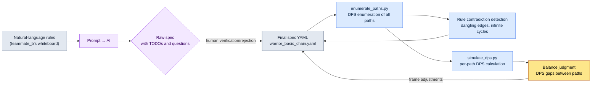

# 4.3 Combos, Cancels, and Input Queues — Enumerate the Paths and Verify Them

Combat designer B was standing at the meeting-room whiteboard, drawing boxes with a marker. Basic 1, Basic 2, Basic 3, and a heavy-attack branch peeling off to the side. Around the seventh arrow, someone asked: "So after the heavy attack into the launcher, if you cancel into dodge, can you get back to Basic 1?" B stopped the marker. The graph on the whiteboard didn't show that path. Whether it could be drawn and simply hadn't been, or whether the rules made it impossible — B couldn't answer on the spot either.

This is the real problem of combo design. In your head, a combo looks like a simple trunk: 1-2-3, then branch into the heavy attack. But once cancels and an input queue enter the picture, the trunk becomes a graph. Add just a few cancel edges to six nodes and the paths you can actually walk multiply into dozens. A human cannot unfold all those dozens of branches mentally. So the balance incident — "this path is too strong" — gets discovered only after it has gone into a build.

This chapter has one goal: a workflow that **enumerates every combo path automatically, without drawing them by hand, and verifies each one**. Turn rules written in natural language into a spec, enumerate the paths from the spec, and run the enumerated paths through simulation. Along the way I'll show, raw and unedited, how far the AI takes you and where it lies.

---

## 4.3.1 A Combo Is a Graph, Not a Table

Write a combo as a table and it reads like this: "Basic 2 follows Basic 1, Basic 3 follows Basic 2." Neat rows and columns. But this table lies, because a table assumes a straight line. In actual combat, the player branches from Basic 2 into the heavy attack, cancels the heavy attack into a dodge, and presses Basic 1 again right after the dodge. Those branches and cycles hide between the rows of the table.

So the true shape of a combo is a **directed graph**. Actions are nodes; connections are edges. Each edge carries an input window (when input is accepted) and an input key. Nodes carry a duration in frames, and some nodes carry a bonus condition (a damage multiplier that applies only if specific nodes were visited along the way).

Here is one basic combo set for a warrior character drawn as a graph — six nodes, cancel branches included.

<svg viewBox="0 0 720 300" xmlns="http://www.w3.org/2000/svg" font-family="sans-serif" font-size="13">
  <defs>
    <marker id="arrow" markerWidth="10" markerHeight="10" refX="8" refY="3" orient="auto" markerUnits="strokeWidth">
      <path d="M0,0 L8,3 L0,6 Z" fill="#444"/>
    </marker>
  </defs>
  <!-- main chain -->
  <rect x="20" y="40" width="110" height="40" rx="6" fill="#e8f0fe" stroke="#3367d6"/>
  <text x="75" y="65" text-anchor="middle">Basic 1 (21f)</text>
  <rect x="200" y="40" width="110" height="40" rx="6" fill="#e8f0fe" stroke="#3367d6"/>
  <text x="255" y="65" text-anchor="middle">Basic 2 (24f)</text>
  <rect x="380" y="40" width="110" height="40" rx="6" fill="#e8f0fe" stroke="#3367d6"/>
  <text x="435" y="65" text-anchor="middle">Basic 3 (30f)</text>
  <rect x="560" y="40" width="140" height="40" rx="6" fill="#fce8e6" stroke="#c5221f"/>
  <text x="630" y="65" text-anchor="middle">Finisher ×1.5</text>
  <!-- branch -->
  <rect x="200" y="150" width="110" height="40" rx="6" fill="#fef7e0" stroke="#e8a000"/>
  <text x="255" y="175" text-anchor="middle">Heavy (33f)</text>
  <rect x="380" y="150" width="110" height="40" rx="6" fill="#fef7e0" stroke="#e8a000"/>
  <text x="435" y="175" text-anchor="middle">Launcher (28f)</text>
  <rect x="200" y="240" width="110" height="40" rx="6" fill="#e6f4ea" stroke="#137333"/>
  <text x="255" y="265" text-anchor="middle">Dodge (18f)</text>
  <!-- edges main -->
  <line x1="130" y1="60" x2="200" y2="60" stroke="#444" marker-end="url(#arrow)"/>
  <text x="165" y="52" text-anchor="middle" font-size="11">10~21f</text>
  <line x1="310" y1="60" x2="380" y2="60" stroke="#444" marker-end="url(#arrow)"/>
  <text x="345" y="52" text-anchor="middle" font-size="11">12~24f</text>
  <line x1="490" y1="60" x2="560" y2="60" stroke="#444" marker-end="url(#arrow)"/>
  <text x="525" y="52" text-anchor="middle" font-size="11">14~30f</text>
  <!-- branch edges -->
  <line x1="255" y1="80" x2="255" y2="150" stroke="#444" marker-end="url(#arrow)"/>
  <text x="300" y="118" text-anchor="middle" font-size="11">Heavy 6~24f</text>
  <line x1="310" y1="170" x2="380" y2="170" stroke="#444" marker-end="url(#arrow)"/>
  <line x1="255" y1="190" x2="255" y2="240" stroke="#444" marker-end="url(#arrow)"/>
  <text x="300" y="218" text-anchor="middle" font-size="11">Dodge cancel</text>
  <!-- loop back -->
  <path d="M200,260 C90,260 75,140 75,80" fill="none" stroke="#137333" stroke-dasharray="5,4" marker-end="url(#arrow)"/>
  <text x="110" y="160" text-anchor="middle" font-size="10" fill="#137333">Re-enter Basic 1 after dodge</text>
</svg>

Two things make this decisively different from the whiteboard. First, every edge carries an explicit input-window frame range. The branch label "Heavy 6\~24f" means the heavy-attack input is accepted from frame 6 through frame 24 after Basic 2 starts. Second, there is the dashed dodge-to-Basic-1 re-entry edge — the very path B couldn't answer about in the meeting room. Make it explicit in the graph, and "exists / doesn't exist" becomes unambiguous.

Drawn by hand, this graph is six nodes and seven or eight edges. With twenty characters and three or four combo sets per character, you are looking at hundreds of graphs. Hands cannot keep up. So you write the graph down as a **text spec**, and generate both the picture and the verification from it automatically.

---

## 4.3.2 Humans Read the Spec, Machines Parse It

Let's move the graph above into a YAML spec. The core is three blocks: nodes (`nodes`), edges (`edges`), and bonuses (`bonuses`). Cancel rules are treated as just another kind of edge — interrupting an action to go to a different node is, in the end, an edge.

```yaml
# warrior_basic_chain.yaml
character: warrior
combo_id: basic_chain

nodes:
  - { id: basic_1,  name: 기본1,   duration_frames: 21 }
  - { id: basic_2,  name: 기본2,   duration_frames: 24 }
  - { id: basic_3,  name: 기본3,   duration_frames: 30 }
  - { id: heavy,    name: 강공격,  duration_frames: 33 }
  - { id: launch,   name: 띄우기,  duration_frames: 28 }
  - { id: dodge,    name: 회피,    duration_frames: 18, cancels_recovery: true }

edges:
  - { from: basic_1, to: basic_2, input: light, window: [10, 21] }
  - { from: basic_2, to: basic_3, input: light, window: [12, 24] }
  - { from: basic_2, to: heavy,   input: heavy, window: [6, 24] }
  - { from: heavy,   to: launch,  input: heavy, window: [10, 33] }
  - { from: heavy,   to: dodge,   input: dodge, window: [0, 33], type: cancel }
  - { from: basic_3, to: dodge,   input: dodge, window: [0, 30], type: cancel }
  - { from: dodge,   to: basic_1, input: light, window: [8, 18] }   # re-entry

bonuses:
  - { on: basic_3, requires_path: [basic_1, basic_2], damage_multiplier: 1.5 }
```

(The `name` fields keep the original Korean display names — 기본1 is Basic 1, 강공격 the heavy attack, 띄우기 the launcher, 회피 the dodge.)

This spec serves two readers at once. A human reads `window: [6, 24]` and understands "the heavy attack starts being accepted midway through Basic 2"; a machine parses the same line and uses it for the graph drawing and the path enumeration. One source yields both human understanding and machine verification.

The frame values above (`21`, `24`, `[6, 24]`) are not measurements — they are example values I constructed for this chapter's explanation (unverified). In a real project, these values come from the lengths of the montages your animators build and the notify timings in the build. When you first write the spec, you enter the designer's intended values; once a build exists, you capture it and correct the spec with measured values — that correction loop is covered in 4.4.

---

## 4.3.3 Worked Transcript — From Natural Language to Spec

I give the rules B drew on the whiteboard to the AI in natural language and have it convert them into the spec YAML. No summarizing — the full prompt, Claude's raw output, and the human verification/rejection are reproduced exactly as they happened.

### The Prompt (Full Text)

```
다음은 전사 캐릭터의 콤보 룰이다. 이걸 콤보 명세 YAML로 변환해라.

규칙:
- 기본 공격은 1, 2, 3타로 이어진다. 가벼운 공격 키.
- 기본2 도중에 강공격 키를 누르면 강공격으로 빠질 수 있다.
- 강공격 다음에 강공격을 한 번 더 누르면 적을 띄운다(띄우기).
- 강공격은 언제든 회피로 캔슬 가능.
- 기본3도 회피로 캔슬 가능.
- 회피 직후에는 가벼운 공격으로 기본1을 다시 시작할 수 있다.
- 기본3은 기본1과 기본2를 모두 거쳤을 때만 데미지가 1.5배.

명세 형식:
- nodes(id, name, duration_frames), edges(from, to, input, window, type),
  bonuses(on, requires_path, damage_multiplier)
- 캔슬 엣지는 type: cancel로 표시.
- 프레임 값은 내가 안 준 건 너가 정하지 말고 TODO로 비워 둬라.
```

(The prompt, kept in the original Korean above, says: "These are the combo rules for a warrior character. Convert them into a combo spec YAML." It then lists the rules — the 1-2-3 light-attack chain; a heavy-attack branch available during Basic 2; heavy followed by heavy launches the enemy (launcher); the heavy attack can always be canceled into dodge; Basic 3 can also be canceled into dodge; right after a dodge, a light attack restarts Basic 1; Basic 3 deals 1.5× damage only if both Basic 1 and Basic 2 were passed through — defines the spec format with cancel edges marked `type: cancel`, and ends with one constraint: for any frame value I didn't provide, don't decide it yourself; leave it as TODO.)

That last line is the crux. I explicitly told it not to invent frames I hadn't given. It enforces rule 3 of the v3 standards (numeric honesty) at the prompt level.

### Claude's Raw Output (Unedited)

````
명세로 변환했습니다. 프레임 값은 제공되지 않아 TODO로 남겼습니다.

```yaml
character: warrior
combo_id: basic_chain
nodes:
  - { id: basic_1, name: 기본1, duration_frames: TODO }
  - { id: basic_2, name: 기본2, duration_frames: TODO }
  - { id: basic_3, name: 기본3, duration_frames: TODO }
  - { id: heavy,   name: 강공격, duration_frames: TODO }
  - { id: launch,  name: 띄우기, duration_frames: TODO }
  - { id: dodge,   name: 회피,   duration_frames: TODO }
edges:
  - { from: basic_1, to: basic_2, input: light, window: TODO }
  - { from: basic_2, to: basic_3, input: light, window: TODO }
  - { from: basic_2, to: heavy,   input: heavy, window: TODO }
  - { from: heavy,   to: launch,  input: heavy, window: TODO }
  - { from: heavy,   to: dodge,   input: dodge, window: TODO, type: cancel }
  - { from: basic_3, to: dodge,   input: dodge, window: TODO, type: cancel }
  - { from: dodge,   to: basic_1, input: light, window: TODO }
bonuses:
  - { on: basic_3, requires_path: [basic_1, basic_2], damage_multiplier: 1.5 }
```

확인이 필요한 부분:
1. "회피 직후 기본1 재시작"을 dodge -> basic_1 엣지로 넣었는데, 이게
   회피의 후딜 중에 입력받는 건지 회피가 완전히 끝난 뒤인지 불명확합니다.
2. 띄우기(launch) 다음에 이어지는 공중 콤보가 있는지 규칙에 없습니다.
   띄우기가 콤보의 끝인지 확인이 필요합니다.
3. 회피를 노드로 둘지 엣지(캔슬 동작)로만 둘지 모호합니다. 일단 노드로
   뒀습니다 — 회피 자체가 지속 시간을 갖는 액션이라고 봤습니다.
````

(In the raw output above, Claude returns the YAML with every frame value left as TODO and closes with three questions: 1 — it modeled "restart Basic 1 right after the dodge" as a `dodge -> basic_1` edge, but it's unclear whether input is accepted during the dodge's recovery or only after the dodge fully ends; 2 — the rules say nothing about an aerial combo after the launcher, so is the launcher the end of the combo?; 3 — it's ambiguous whether dodge should be a node or only an edge (a cancel action); it chose node for now, on the grounds that a dodge is itself an action with a duration.)

Let's evaluate. The good: it didn't invent a single frame — everything is TODO. It honored the prompt's constraint. And the three questions at the end are all genuinely ambiguous points — especially question 1 (re-entry input timing), which is exactly the hole B couldn't answer on the spot in the meeting room. The AI found the hole before the humans did.

The debatable: making dodge a node, in question 3, is a judgment call. A dodge is both a "cancel action" and an "action with a duration," so both readings are valid. The AI picking one side and then reporting the ambiguity is honest, but this is a design decision — a human has to make it.

### Human Verification/Rejection

I answer the three questions and reject part of the output.

- **Question 1 (re-entry timing):** Input is accepted during the dodge's recovery (8–18f). It's a recovery cancel into Basic 1, not a re-entry after the dodge plays out to the end. → Adopted, `window: [8, 18]`.
- **Question 2 (after the launcher):** Within this chapter's scope, the launcher ends the combo. Aerial combos are split off into a separate set. → AI's judgment adopted.
- **Question 3 (dodge = node):** Keep it as a node, but add the `cancels_recovery: true` attribute to make explicit that it's an action that cuts recovery. → Partially adopted, attribute added.

And one thing gets **rejected**. The AI didn't put `type: cancel` on the `dodge → basic_1` edge — and in nature it is a cancel, since it cuts the dodge's recovery to enter. But here I treat it as "normal entry after the dodge" and keep it a regular edge, because for this character the distinction between a recovery cancel and a normal link makes no difference in game feel. A case of a human overriding the AI's classification with a domain judgment.

### The Follow-Up Request

```
좋다. 다음을 반영해 최종 명세를 다시 내라:
- dodge에 cancels_recovery: true 추가.
- dodge -> basic_1 엣지의 window는 [8, 18].
- 나머지 프레임은 여전히 내가 안 줬으니 TODO 유지. 단 위 그래프 예시값
  (basic_1=21, basic_2=24, basic_3=30, heavy=33, launch=28, dodge=18)을
  쓸 거니까 그 값으로 채워라. 이건 미검증 예시값이라고 주석으로 박아라.
```

(The follow-up, in Korean above, says: good — now produce the final spec with `cancels_recovery: true` added to dodge; `window: [8, 18]` on the `dodge -> basic_1` edge; the remaining frames are still ones I didn't give, so they stay TODO in principle — but since we'll use the example values from the graph above (basic_1=21, basic_2=24, basic_3=30, heavy=33, launch=28, dodge=18), fill them in with those values and pin a comment marking them as unverified example values.)

The result of this follow-up is the YAML in 4.3.2. It wasn't done in one shot: prompt → raw output → verification/rejection → follow-up. That cycle is what gives the spec its credibility. The AI marks what's ambiguous, and the human decides with domain knowledge — neither alone is enough.

---

## 4.3.4 Enumerate the Paths Automatically

Since the spec is a graph, enumerating combo paths becomes a **graph traversal** problem: a depth-first search (DFS) that finds every path from the start node to an end node (or the finisher). A human can't do this in their head; code does it in an instant.

Inside my team's isolated workspace `95_BattleTF` lives a small script responsible for this enumeration. It reads the spec YAML, extracts every path, and verifies that each path is legal under the rules (that every edge exists). The core logic looks like this.

```python
# 95_BattleTF/enumerate_paths.py (excerpt)
import yaml

def load_graph(path):
    spec = yaml.safe_load(open(path, encoding="utf-8"))
    adj = {}
    for e in spec["edges"]:
        adj.setdefault(e["from"], []).append(e)
    return spec, adj

def enumerate_paths(adj, start, max_depth=8):
    results = []
    def dfs(node, path, edges):
        # end node (no outgoing edges) or depth limit: finalize the path
        outs = adj.get(node, [])
        if not outs or len(path) >= max_depth:
            results.append((list(path), list(edges)))
            return
        for e in outs:
            if e["to"] in path:        # cycle guard: each node once per path
                results.append((list(path), list(edges)))
                continue
            dfs(e["to"], path + [e["to"]], edges + [e])
    dfs(start, [start], [])
    return results
```

Run it starting from `basic_1`, and out pour the paths you could never fully unfold by hand. A sample:

| # | Path | Note |
|---|---|---|
| 1 | Basic 1 → Basic 2 → Basic 3 | Textbook 3-hit chain; finisher bonus satisfied |
| 2 | Basic 1 → Basic 2 → Heavy → Launcher | Branch combo |
| 3 | Basic 1 → Basic 2 → Heavy → Dodge → Basic 1 → … | Cycle entry |
| 4 | Basic 1 → Basic 2 → Basic 3 → Dodge → Basic 1 → … | Reset after the finisher |

Paths 3 and 4 are the important ones. Because of the dodge re-entry edge, the combo **cycles**. These cyclic paths are exactly what people failed to see on the whiteboard. Without the cycle guard in the DFS (each node at most once per path), the enumeration falls into an infinite loop — a trap I actually hit the first time I ran the code and it hung. If the graph has cycles, the enumerator must have a guard.

The enumeration stage produces two artifacts. First, the list of every path that is legal under the rules. Second, **rule contradiction detection** — if the spec has a `dodge → basic_1` edge but the `dodge` node definition is missing, the enumerator flags it as "an edge pointing to an undefined node." That dangling reference is the single most common mistake when specs are written by hand.

---

## 4.3.5 Run the Enumerated Paths Through Simulation

A path list alone doesn't tell you which path is too strong. Each path has to go into a DPS simulator. My team's `simulate_dps` plays that role — it takes a path (a node sequence), each node's damage and frames, and the bonus rules; computes total damage and total elapsed frames; and produces damage per second (DPS).

```python
# 95_BattleTF/simulate_dps.py (excerpt, assumes 60fps)
def simulate(path_nodes, node_dmg, node_frames, bonuses):
    total_dmg = 0
    total_frames = 0
    visited = []
    for nid in path_nodes:
        dmg = node_dmg.get(nid, 0)
        # bonus: apply the multiplier once every requires_path node was visited
        for b in bonuses:
            if b["on"] == nid and all(r in visited for r in b["requires_path"]):
                dmg *= b["damage_multiplier"]
        total_dmg += dmg
        total_frames += node_frames[nid]
        visited.append(nid)
    seconds = total_frames / 60.0
    return {"dmg": total_dmg, "frames": total_frames,
            "dps": round(total_dmg / seconds, 1) if seconds else 0}
```

Pipe the entire enumeration output from 4.3.4 through this, and per-path DPS falls out as a table. Below is a run with example node damage values (basic hit 100, heavy attack 180, launcher 140 — all unverified values constructed for illustration).

| Path | Total Damage | Total Frames | DPS |
|---|---|---|---|
| Basic 1→Basic 2→Basic 3 (finisher ×1.5) | 100+100+150 = 350 | 75 | 280.0 |
| Basic 1→Basic 2→Heavy→Launcher | 100+100+180+140 = 520 | 106 | 294.3 |
| Basic 1→Basic 2→Basic 3→Dodge→Basic 1 | 350+0+100 = 450 | 144 | 187.5 |

This table changes the discussion. The intuition "doesn't the heavy branch look stronger than the textbook 3-hit chain?" becomes a number: "heavy path DPS 294 vs. textbook 280 — a 5% edge." If the 5% edge is intended, it passes; if not, you lengthen the heavy attack's frames to bring the DPS down. And you make that call **before** a build exists, at the spec stage.

The whole workflow on one page:



The spec (D) sits at the center, and enumeration (E), contradiction detection (F), and simulation (G) all branch off of it. When a contradiction is caught or the balance is off, you go back to the spec and fix it. The whiteboard had no such loop — which is why the whiteboard's combo turned out to be wrong only after it went into a build.

---

## 4.3.6 Cancels and Input Queues — Two Levers That Widen and Narrow the Paths

So far we've looked at the combo graph and path enumeration. Cancels and the input queue are the two levers that tune this graph — and they point in opposite directions.

**Cancels add edges.** Every cancel rule you add puts another edge on the graph, and the number of enumerated paths multiplies. So cancels are not "the more generous, the better." The looser the cancels, the more the paths explode, and the higher the odds that an unintended strong path (like the cyclic path in the previous section) slips in. This is why the fighting-game tradition keeps cancels strict and why action RPGs keep them generous — the genre decides how many paths to allow. There is no absolute correct window value.

When you handle cancels, always separate them explicitly. Leave them as one blanket "cancel into anything" rule, and the enumerator generates cancel edges between every pair of nodes — the paths grow out of control.

| Cancel Type | Spec Representation | Effect on Paths |
|---|---|---|
| Action cancel | specific node → specific node, type: cancel | Adds only selected branches |
| Dodge cancel | many nodes → dodge, window: [0, dur] | An escape hatch from almost every node |
| Guard cancel | many nodes → guard | Entry into guard, usually limited to recovery |
| No cancel | no outgoing cancel edges | Committed to the end once started (super armor) |

**The input queue doesn't narrow the paths — it makes them actually walkable.** (This is the system fighting games call input buffering.) Without the queue, the player would have to hit each edge's input window (say, `[12, 24]`) with frame-level precision. Human reaction times make that nearly impossible. The queue stores an input pressed before the window into a buffer, then fires it automatically the moment the window opens. In other words, the queue doesn't change the graph's paths; it puts shoes on the player so a human can walk the graph.

```yaml
input_queue:
  window_start_ratio: 0.5   # buffer the next input from 50% of action progress
  expire_frames: 10         # how long a buffered input stays valid
  priority: latest          # on simultaneous inputs, the last one wins
```

The balance of the three parameters is the crux. If `window_start_ratio` is too small, inputs from early in the action get buffered too, and unintended follow-up actions pop out. If `expire_frames` is too short, the queue becomes meaningless and you're back to demanding precision; too long, and an input pressed ages ago fires late — the "why did my character suddenly move?" incident. A recommended starting point is `expire_frames` 5–15 and `window_start_ratio` around 0.5 — but that is a starting line to adjust for genre and character weight, not a correct answer.

One operational note: do not give every character its own input-queue parameters. Keep one global default and override only the characters whose weight is genuinely different (giant boss types and the like). Manage twenty characters' queue values separately and you can no longer tell which differences are intended and which are mistakes.

One more thing to pin down. So far we've treated edges as "exists / doesn't exist" — but even when an edge exists, **how the action actually transitions from that node to the next** is a separate decision. There are three core options for linking combo actions. They are beyond this book's depth, so I won't cover them in code, but leaving them unmentioned would make the spec only half the picture.

- **Cancel notify:** From what point do you cut the current animation and accept the next input? The edge windows above (`window: [10, 21]`) are exactly the expression of this notify. Move the notify earlier and the combo speeds up (you move on before the hit finishes playing); push it later and each hit lands heavier. The window's start value, in other words, is not just a number — it's a feel decision: do we show this hit through to the end, or hand off to the next one quickly?
- **Anim blending:** Blend smoothly between the two nodes — interpolate over a few frames from the heavy attack's end pose into the launcher's start pose. The link is smooth and natural, but the blend region tends to open gaps in hit detection, and the crisp, snappy feel disappears.
- **Frame skip:** Skip the remaining frames of the current animation, no blending, and start the next node immediately. The link is brisk and responsive, but poses can visibly pop. The "cancel feel" of fighting and action games is usually this one.

Given the same edge, these three produce opposite game feel. At the spec stage, you usually fix only the edge's existence and its window, and decide the transition method (blending vs. frame skip) in the build, together with the animators. Still, reserving a one-line field in the spec — `transition: blend` / `transition: skip` — means nobody has to ask "how did we decide this edge transitions, again?" at the build stage. The transition method is the combo graph's hidden third axis.

---

## 4.3.7 Build Verification Is a Separate Job (a 4.4 Preview)

Every verification so far happened **on the spec**. The path enumeration, the DPS simulation, the contradiction detection — all of it targeted the YAML. But the spec's frame values are the designer's intent, not measurements from the build. The actual length of the montage the animator made, the frame where the build's notify actually fires, the window where the input queue actually operates in the engine — those have to be captured and measured from the build.

Automatically extracting the five signals (hit-start frame, recovery, cancel window, input queue, hitstop) from build footage is hard to implement; realistically, the most trustworthy source is in-game telemetry — have the build log "this action accepted this input at this frame," then check that log against the spec (see 4.4 for a comparison of capture methods). That comparison loop is the subject of 4.4. When a window that was `[12, 24]` in the spec measures `[14, 26]` in the build, you correct the spec to the build's measured values.

---

## 4.3.8 Common Mistakes and How to Avoid Them

| Mistake | Why It's Dangerous | How to Avoid It |
|---|---|---|
| Writing combos as a straight-line table | Branches and cycles hide between rows and get missed | Spec as a graph (nodes + edges); don't draw by hand |
| Lumping cancels into "cancel anything" | Enumerated paths explode; strong paths slip in | Specify action/dodge/guard cancels separately |
| No cycle guard in the enumerator | Infinite loop at the dodge re-entry | Guard: each node once per path |
| Mistaking spec frames for measurements | Intent values and build values differ | Mark values as intent; correct via build capture (4.4) |
| Per-character input-queue values | Can't tell intended differences from mistakes | Global default + override only a few |
| Trusting AI-filled frames as-is | Made-up numbers enter the spec | Enforce "values I didn't give = TODO" in the prompt |

---

### Key Takeaways
- A combo is a graph, not a line — so the paths get enumerated by code, not by a person.
- Cancels are the lever that multiplies the paths; the input queue is the shoes that let players walk them.
- The same edge produces opposite game feel depending on the transition method (cancel notify, anim blending, frame skip).
- Verifying on the spec and verifying on the build are different jobs, and for the latter, telemetry is the realistic option.

---

## Try It Yourself — A Mini Pipeline for Combo Path Enumeration

This is the minimum procedure you can run along with by hand. All you need is Python and `pyyaml`.

**setup.** Create one working folder and put the spec file and the two scripts inside.

```
combo-mini/
  warrior_basic_chain.yaml   # the spec from 4.3.2
  enumerate_paths.py         # the DFS enumerator from 4.3.4
  simulate_dps.py            # the simulator from 4.3.5
```

After `pip install pyyaml`, paste the YAML from 4.3.2 into the spec file as-is.

**prompt.** Leave the natural-language-to-spec step to the AI. Use the prompt from 4.3.3 as-is, and make sure to include the final constraint.

```
프레임 값은 내가 안 준 건 너가 정하지 말고 TODO로 비워 둬라.
캔슬 엣지는 type: cancel로 표시하고, 모호한 부분은 질문으로 따로 빼라.
```

(The two lines say: for frame values I didn't give, don't decide them yourself — leave them as TODO; mark cancel edges with `type: cancel`, and pull anything ambiguous out as separate questions.)

These two lines block the AI from fabricating numbers and making arbitrary calls. A human then fills in the TODOs and the question list in the resulting spec.

**verify.** Once the spec is complete, verify it twice.

```bash
python enumerate_paths.py warrior_basic_chain.yaml   # all paths + contradictions
python simulate_dps.py    warrior_basic_chain.yaml   # per-path DPS table
```

In the enumeration output, check (1) that cyclic paths don't grow without bound, and (2) that there are no dangling edges pointing at undefined nodes. In the DPS output, check that the gaps between paths fall within your intended range. If a gap is too large, fix the frames/damage in the spec and run it again.

### Solo Scale-Down

If you don't have time to build the tools, finish the spec writing and the path enumeration in a single AI conversation. Give it the natural-language rules and pack this into one prompt: "Convert these into a combo spec YAML, then list every possible path from the start node depth-first, cutting each cycle after one pass. Flag any edge that points to an undefined node." The AI does the spec conversion, the enumeration, and the contradiction detection in one go. For the DPS simulation, hand it the node damage as a table and follow up with "compute each path's total damage and frames and give me a table." You lose precision, but you see much farther than a whiteboard. The core doesn't change — don't unfold combos in your head; have them enumerated, and look.
