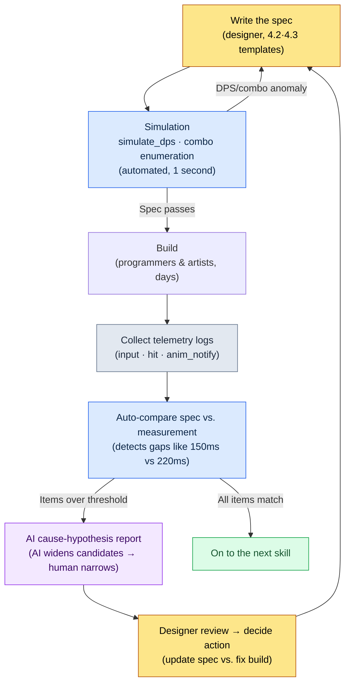

# 4.4 AI-Assisted Combat Simulation and Verification

Build #234 from the combat task force (TF) has just come in. It's the first build to touch the new skill `skill_thunder`. The spec sheet says hit timing: 150ms. I press the input. My fingertips tell me: late. Definitely late. I call over teammate A in the next seat. "Doesn't this look a bit floaty to you?" Teammate A tries it a couple of times. "Hmm... maybe, I guess." Neither of us is sure. The spec says 150; my hands insist it's around 200. Who is right? Fingertips versus paper. In the next build, someone will again say "feels fine to me," and on that one remark another build will drift by.

The goal of this chapter is to end that fight. When the fingertips say 200, show in numbers whether it really is 200. And *before* a build comes in, know from the spec alone that "this skill's DPS is 30% over target." Back when I was shaping combat from the early days of a AAA MMORPG with 200 people on it, the helplessness when feel and numbers diverged was exactly the same. The only thing that has changed is that now there is a tool at hand to settle that divergence with numbers.

If 4.2 and 4.3 covered how to *write* a combat spec, 4.4 covers whether that spec *works* as intended. Verification has two axes. One is simulation — verifying by computation alone, with no build; the other is capture analysis — pulling measured values out of the actual build. When the two axes are tied into one cycle, the turnaround of combat design shrinks from days to hours.

To state the conclusion up front: the heart of this chapter is *putting the number written in the spec (150ms) and the number measured from the build (220ms) side by side and reading the gap* (4.4.5). The earlier sections (the simulator, combo enumeration) can be read as the preparation that makes that comparison possible.

---

## 4.4.1 The Cost of Waiting for a Build

What has to happen for a combat designer to verify one new skill?

The designer writes the spec. A programmer enters the data, an artist attaches motion and effects, a build runs, QA does a pass, and only then does the designer get hands on it. Two days if fast, usually three or four. When "the DPS is too high" is discovered at the *end* of that cycle, the discovery becomes an order to go back to the start. Another three or four days.

Simulation is a tool that gives an answer at the *first step* of this cycle. Compute from the spec alone. If the answer is bad, fix the spec and compute again. Before entering the expensive build stage, the spec itself gets filtered once. It's like putting a model car into a wind tunnel first. Before the real car ever touches the road, a suspect design fails on the desk.

Of course, the wind tunnel doesn't predict the road 100%. That's why the second axis, capture analysis, is needed. If simulation is the *ideal answer*, capture is the *answer of what actually happened in the build*. Putting the two side by side and reading the difference — that is this entire chapter.

---

## 4.4.2 simulate_dps — A Runnable Simulator

Abstract pseudocode verifies nothing. So from the start, I build code that *runs*. Below is the core skeleton of `simulate_dps.py`, the one I use in the combat TF, reconstructed for this book with company data stripped out. It runs on the Python standard library alone, with no dependencies (the full file is in "Try It Yourself").

The input is simple. A skill is a dataclass with `damage`, `cast_sec` (cast occupancy time), `cooldown_sec`, and `resource_cost`; a character has a resource pool, regen per second, a skill list, and a priority rotation. The engine running on top is a single greedy rule: "at every moment, use the highest-priority skill that's available." The point is to capture an *ideal upper bound* — neither smarter nor dumber than a real player. Excerpting just the spine:

```python
# Build the timeline in 0.05s ticks. When not casting, use the first available skill in priority order.
while t < duration_sec:
    resource = min(char.max_resource, resource + char.resource_regen * tick)
    for name in cooldowns:
        cooldowns[name] = max(0.0, cooldowns[name] - tick)
    if t >= busy_until:                     # wait while the cast motion runs
        for name in char.rotation:          # in priority order
            s = skill_by_name[name]
            if cooldowns[name] <= 0 and resource >= s.resource_cost:
                total_damage += s.damage
                resource -= s.resource_cost
                cooldowns[name] = s.cooldown_sec
                busy_until = t + s.cast_sec  # no next skill until this time
                break
    t += tick
# …(for the dataclass definitions, warrior input, and output loop, see the full code in "Try It Yourself")
```

Running warrior for 20 seconds with `skill_thunder` (damage 420, cast 0.9s, cooldown 6s) at priority 1 and `skill_dash` and `basic_1` behind it (`python simulate_dps.py`):

```
평균 DPS: 261.0
  t=  0.0s  skill_thunder  자원=60
  t=  0.9s  skill_dash     자원=47
  t=  1.3s  basic_1        자원=50
  t=  1.6s  basic_1        자원=53
  t=  1.9s  basic_1        자원=55
  ...
```

What does this value mean? It means that *without a build*, within one second, I know the warrior's ideal DPS ceiling is about 261. If the target DPS was 180, this spec is +45% over. No need to wait for a build — adjust `damage` or `cooldown_sec` right now.

I'll state the limits honestly too. This simulator does not model player input mistakes, gaps caused by movement and dodging, or enemy interference. So its number always comes out higher than the actual build. That is not a bug; it is the very definition of the simulator as an *upper bound*. The gap to reality gets filled by capture in 4.4.5.

> **A note on using AI.** I wrote the skeleton above myself, but when attaching a new resource model (say, a rage gauge that fills when taking damage), I ask Claude *while quoting the existing code*: "Add a rule to this simulate_dps — +5 rage on getting hit. Inside the tick loop, as a separate variable from the existing resource regen." Ask it to generate a whole simulator from a blank page and you get unverifiable code. The human holds the spine; the AI grows the branches.

---

## 4.4.3 Automatic Combo Path Enumeration

A single DPS number is not enough. To verify "which combo is the intended main combo," you have to lay out *every possible path*. Draw the tree by hand and your head bursts at seven or eight nodes. Exhaustively unfolding paths is something a machine does overwhelmingly better than a person — provided you make it produce output a person can trace back through.

The following code takes a combo graph, enumerates all paths, and sorts them by DPS. `combo_graph` is an adjacency list of "which action can cancel into which action," extracted directly from the state machine spec of 4.3. The core is the `all_paths` generator, which recursively unfolds every path to its dead end.

```python
# enumerate_combos.py — unfold every path in the combo graph and sort by DPS
combo_graph = {"start": ["A"], "A": ["B", "D"], "B": ["C", "E"], "D": ["C"], "C": [], "E": []}
action_stats = {  # (damage, duration in seconds)
    "A": (300, 0.8), "B": (450, 1.0), "C": (450, 1.2), "D": (600, 1.4), "E": (200, 0.6),
}

def all_paths(node="start", path=None):
    path = (path or [])
    nexts = combo_graph.get(node, [])
    if not nexts:                       # dead end = a completed combo
        yield [n for n in path if n in action_stats]
        return
    for nxt in nexts:
        yield from all_paths(nxt, path + [nxt])

results = []
for p in all_paths():
    dmg = sum(action_stats[a][0] for a in p)
    dur = sum(action_stats[a][1] for a in p)
    results.append((p, dmg, round(dur, 1), round(dmg / dur, 1)))

for p, dmg, dur, dps in sorted(results, key=lambda r: -r[3]):
    print(f"{' → '.join(p):<18} {dmg:>5} dmg  {dur:>4}s  DPS {dps}")
```

The output:

```
A → D → C            1350    3.4s  DPS 397.1
A → B → C            1200    3.0s  DPS 400.0
A → B → E             950    2.4s  DPS 395.8
```

The signal a designer should read here is not simply which path came first. The three paths' DPS values sit nearly on top of each other, at 396–400 — and that is a signal that "every combo is about equally efficient, so *the main combo has no identity*." If the intent was "A→D→C should be the high-risk, high-reward main combo," then raise D's damage or shorten its time to lift that DPS a clear step above the rest. Time to go back to the spec.

Where this automatic enumeration replaces hand calculation, even when the combo nodes grow to 20, a person only has to read the sorted table.

---

## 4.4.4 Build Capture Analysis — The Realistic Method Is Telemetry

Now the second axis: measuring what actually happened in the build. The picture that comes to mind first is "an AI watches the build footage and analyzes it automatically," but here I'll split the options honestly. There are three ways to get measurements, and their cost and accuracy differ greatly.

<svg viewBox="0 0 720 250" xmlns="http://www.w3.org/2000/svg" font-family="sans-serif" font-size="13">
  <rect x="10" y="20" width="220" height="200" rx="8" fill="#fde8e8" stroke="#c0392b" stroke-width="1.5"/>
  <text x="120" y="45" text-anchor="middle" font-weight="bold" fill="#c0392b">A. Direct video analysis</text>
  <text x="120" y="72" text-anchor="middle">Extract input · motion · VFX</text>
  <text x="120" y="92" text-anchor="middle">from screen pixels</text>
  <text x="120" y="124" text-anchor="middle" font-weight="bold">Accuracy: low–medium</text>
  <text x="120" y="148" text-anchor="middle">Difficulty: very high</text>
  <text x="120" y="172" text-anchor="middle">Frame error ±1~2</text>
  <text x="120" y="200" text-anchor="middle" fill="#777">For research · demos</text>

  <rect x="250" y="20" width="220" height="200" rx="8" fill="#fef5e7" stroke="#d68910" stroke-width="1.5"/>
  <text x="360" y="45" text-anchor="middle" font-weight="bold" fill="#d68910">B. Off-the-shelf vision API</text>
  <text x="360" y="72" text-anchor="middle">Send captured frames to</text>
  <text x="360" y="92" text-anchor="middle">an external vision service</text>
  <text x="360" y="124" text-anchor="middle" font-weight="bold">Accuracy: medium</text>
  <text x="360" y="148" text-anchor="middle">Difficulty: medium</text>
  <text x="360" y="172" text-anchor="middle">IP leak risk</text>
  <text x="360" y="200" text-anchor="middle" fill="#777">Check company policy first</text>

  <rect x="490" y="20" width="220" height="200" rx="8" fill="#e8f6ef" stroke="#1e8449" stroke-width="1.5"/>
  <text x="600" y="45" text-anchor="middle" font-weight="bold" fill="#1e8449">C. In-game telemetry</text>
  <text x="600" y="72" text-anchor="middle">The engine logs events</text>
  <text x="600" y="92" text-anchor="middle">with timestamps</text>
  <text x="600" y="124" text-anchor="middle" font-weight="bold">Accuracy: high</text>
  <text x="600" y="148" text-anchor="middle">Difficulty: low–medium</text>
  <text x="600" y="172" text-anchor="middle">Uses the engine clock itself</text>
  <text x="600" y="200" text-anchor="middle" fill="#1e8449" font-weight="bold">The realistic choice</text>
</svg>

Option A (direct video pixel analysis) sounds attractive: automatically extract five signals from the screen — the input display, character motion changes, the first frame of an effect, the audio waveform, the damage-number UI. But build it for real and an error of ±1–2 frames is the baseline, thanks to frame compression noise, UI occlusion, and motion blur. At 60fps, one frame is about 16.7ms. For verification that argues hit timing in milliseconds, ±33ms of noise is fatal. *The implementation difficulty is very high, and the accuracy doesn't repay the effort.*

So the realistic answer is option C: **in-game telemetry logs**. The engine already knows, *internally and exactly*, the input time, the animation notify time, the VFX spawn time, and the damage application time. Instead of inferring those times from pixels, make the engine print them as one-line logs. Rather than *reconstructing* 100ms from pixels, you *take down verbatim* the 100ms the engine already knows.

```cpp
// One line added to the combat action handling code (UE C++ pseudo-example)
// Call the same logger at input receipt / damage application
CombatTelemetry::Log("input",  SkillName, GetWorld()->GetTimeSeconds());
CombatTelemetry::Log("hit",    SkillName, GetWorld()->GetTimeSeconds());
```

The logger drops one JSON Lines entry per line.

```
{"event":"input","skill":"skill_thunder","t":12.340}
{"event":"hit",  "skill":"skill_thunder","t":12.560}
{"event":"input","skill":"basic_3","t":14.100}
{"event":"hit",  "skill":"basic_3","t":14.166}
```

The time difference between `input` and `hit` is the measured hit timing. 12.560 − 12.340 = 0.220 seconds = **220ms**. Not the ±33ms of pixel analysis — the engine's own clock, as is. Pulling this log and checking it against the spec is the next section.

---

## 4.4.5 Worked Transcript: Spec 150ms vs. Measured 220ms

Now bring the two axes to one table. The spec promised 150ms; telemetry measured 220ms. +70ms. The fingertips were right. I'll follow, end to end with the AI, the process of narrowing down the *cause* of this gap. No summarizing — the scene where the AI grabs the wrong lead at first is included as is.

### Prompt

The spec says hit timing 150ms; the measurement says 220ms. I paste the log below and ask at the length a person would actually type. A short request with clear intent beats elaborate formality — one line demanding the verification method and one line banning assertions are the spine of this prompt.

> skill_thunder hit timing is spec'd at 150ms but measures 220ms, +70ms over. Using the telemetry below, break down the possible causes and *state for each one which log confirms or rules it out*. No assertions — if you're not sure, mark it 'unverified'.  // The two key intents are "include the verification method" and "no assertions." Drop the rest of the formality and the result is the same.
>
> ```
> {"event":"input","skill":"skill_thunder","t":12.340}
> {"event":"anim_start","skill":"skill_thunder","clip":"cast_thunder","t":12.340}
> {"event":"anim_notify","skill":"skill_thunder","notify":"HitWindow","t":12.560}
> {"event":"hit","skill":"skill_thunder","t":12.560}
> ```
> Per the spec, the HitWindow notify of cast_thunder is at the 0.150s mark.

### Claude's Raw Output (Round 1 — Before Verification, Wrong Lead Included)

> I estimate the following four causes for the +70ms overshoot.
>
> 1. **Network latency.** The input may have picked up 70ms on a round trip to the server. If this is a multiplayer build, check the RTT.
> 2. **Frame rate drop.** If the build runs at 30fps, one frame is 33ms, so notify timings get rounded to frame boundaries and the delay accumulates.
> 3. **Cast motion length change.** The cast_thunder clip may have become longer than spec'd, pushing the HitWindow notify back.
> 4. **Input buffer delay.** The input queue may have been processed one tick late.
>
> The most likely cause is **#1, network latency**. 70ms is a typical RTT range.

### Human Verification and Rejection

Stop here and reread the log. The AI's top-ranked guess (network) is *already ruled out by this very log*. `input` and `anim_start` are stamped at exactly the same time, 12.340. The motion started the instant the input arrived; there is no room for a network round trip. #1 is wrong.

#2 (frame rate) is weak too. At 30fps you would see jitter quantized in 33ms steps, but input→hit is a clean, exact 0.220. That smells not of frame-boundary rounding but of a *fixed position inside the clip*.

The decisive clue is elsewhere. `anim_notify` fires at +0.220 relative to `anim_start`. The spec says HitWindow should sit at 0.150 after clip start, but in the actual clip it is fixed at the 0.220 mark. In other words, *either the clip itself was authored differently from the spec, or the notify position was moved from 0.150 to 0.220*. The cause is neither network nor frame rate — it is **#3, the motion/notify data**. The AI did include the right answer among its four candidates, but ranked them upside down.

### Follow-Up Prompt

I fill in the exclusion grounds by hand and throw it back. No need for a long explanation — just nail down, briefly, what was ruled out and which facts remain.

> Network and frame rate ruled out. (Grounds: input = anim_start at the identical time, so no input→motion delay / input→hit is a constant 0.220 with no frame noise.) Remaining fact: anim_notify is at anim_start +0.220; spec says +0.150. Narrow the cause from this fact alone, and state what to request from the programmer and the animator *in units of actions*.  // The key is "in units of actions" — end not with guesses but with who gets asked for what.

### Claude's Raw Output (Round 2)

> Given the stated grounds, the cause narrows to **the HitWindow notify in animation clip cast_thunder being placed at 0.220s instead of 0.150s**. Two branches remain.
>
> - **(a) The notify is correct at 0.150, but the whole clip slowed down** — if the play rate is lower than spec or the clip length grew, the 0.150 mark stretches to 0.220 in real time.
> - **(b) The notify position itself was moved to 0.220** — clip length unchanged, only the marker moved.
>
> Checks that separate the two branches:
> 1. **To the animator**: request cast_thunder's HitWindow notify frame number and the clip's total frame count, plus the change history compared against the values at spec-writing time. If the marker was moved, it's (b).
> 2. **To the programmer**: confirm whether skill_thunder's montage play rate is 1.0, and whether the character's attack speed stat multiplies into this clip. If the play rate is 0.68 (=0.150/0.220), it's (a).
> 3. Measure the anim_start→anim_notify interval once more at a different character attack speed. If the interval changes with attack speed, it's (a); if it stays invariant, it's (b).
>
> Recommended action: if confirmed as (b), move the notify back to 0.150 or update the spec to 0.220 (whichever was intended). If (a), inspect the play-rate application logic.

This output is worth adopting. It does not assert a guess; it splits the question into branches (a)/(b), and *how to separate the branches with data* and *who to ask for what* are written in units of actions. Check #3 in particular (re-measuring at a changed attack speed) is a decisive fork that a person easily misses. Take this report into the meeting as is, and the meeting stops being a debate over "what could the cause be" and becomes "confirm (a) or (b) within 30 minutes and pick the action."

What this worked transcript shows, above all, is that the AI does not hand you the right answer from the start. The first output was a wrong lead that ranked network first. Only when *human verification — reading the log and ruling out candidates —* entered the loop did the analysis converge on the answer. The AI spreads the candidates wide; the human narrows them. That division of labor is the methodology of all of 4.4.

---

## 4.4.6 Two Axes, One Cycle — The Verification Loop

If simulation (4.4.2–4.4.3) and capture analysis (4.4.4–4.4.5) run separately, you get half the value. Tied together, they form the following loop.



Because simulation gives its answer *before* the build, any spec that enters a build has already been filtered once. So a problem found after the build narrows in character: not "the spec was wrong" but "the spec and the implementation diverged." The +70ms of 4.4.5 was exactly the latter — the spec's 150 was reasonable; the implementation drifted to 220. This distinction removes blame disputes from meetings.

This loop does not cover all combat content, though. Areas where *the feel is the content* — a main boss's signature set piece, say — do not reduce to a DPS number. Simulation is strong on numbers-driven content; for presentation, the answer is still human eyes reviewing the footage. The loop runs in the river of numbers; the river of presentation flows on its own.

---

## 4.4.7 What Six Months of Operation Showed

These are six months of measurements from the combat TF of an MMORPG I ran (Project A, which targeted refgame-style controls). The figures below are *actual measurements* culled from the TF's internal records; I'll note that build counts and times are rounded to cycle units (measured in cycles and half-days, not exact minutes).

| Item | Before | After |
|---|---|---|
| Verification cycle for a new skill | 3–4 builds on average | 1–2 builds on average |
| Verifying 100 skills in a build | Half a day (manual) | 30 minutes (automated telemetry comparison) |
| Balance meeting | 2 hours (subjective debate) | 30 minutes (data-driven) |
| Defects found just before a build | 5–8 per build on average | 1–2 per build on average |

The change that matters more than the numbers is the *character* of the meetings. Before, half of every meeting was "this skill is too strong" versus "no, it's fine." Fingertips versus fingertips. After, that time moved to "measured DPS is +12% over target and measured hit timing is +70ms over spec — do we shorten the motion, or cut damage by 10%?" The time spent fighting over *what the problem is* became time spent deciding *how to fix it*.

I'll write down the cost of this transition honestly too. Planting the telemetry logger across the combat code took about one to two weeks of initial work, and unifying the spec schema across every character and skill took another quarter on top of that. In the first quarter, I judged it sufficient for just one of the two — simulation or telemetry — to be running. The two only meshed into a single loop from the second quarter on.

---

## 4.4.8 Common Mistakes and How to Avoid Them

Five mistakes keep repeating.

First, trusting the simulation value absolutely. simulate_dps's 261 is an *upper bound*, not a measurement. Without comparing against telemetry, you will always overestimate.

Second, not measuring at all. If you only simulate the spec and never look at the build through telemetry, gaps like the +70ms of 4.4.5 quietly accumulate. Telemetry logging is not an option; it is basic plumbing of combat code.

Third, not bringing the report to the meeting. Even with the automated report sitting right there, nobody looks at it if it isn't on the agenda. Make "this build's telemetry comparison table" a fixed agenda item.

Fourth, adopting AI estimates without verification. As we saw in 4.4.5, the AI's first estimate was a wrong lead. AI is a tool for widening the candidates, not for reaching the conclusion. Never skip the human step of ruling out candidates with logs.

Fifth, letting every skill have a different spec structure. If one skill writes `cast_sec`, another `cast_time`, and another `castMs`, both the simulator and the comparison script break every time. Enforce one common spec schema on every skill — that is the premise on which all of 4.4's tools run.

You don't need to fix all five in the first quarter. Even one or two taking root shortens the cycle visibly. The rest fill in naturally as the loop keeps turning.

---

## 4.4.9 Closing Part 4

Across 4.1–4.4 we covered, in order, the coordinates of combat design, look & feel, combos, and simulation. 4.1 covered what a combat designer treats as a measurable object; 4.2, how to measure and tune hit timing, hitstop, and effect synchronization; 4.3, how to write combos, cancels, and input queues as state machines; and 4.4, how to verify — without a build and in the build — that all those specs work as intended.

A combat designer's week after finishing Part 4 changes like this. Monday: simulate_dps auto-verification attaches to the new skill spec. Tuesday: automatic combo path enumeration checks the main combo's identity. Wednesday: when the build comes in, the telemetry comparison table appears automatically. Thursday: 30 minutes of data-driven discussion. Friday: spec revisions for the next cycle. Build cycles drop from 3–4 to 1–2, and meetings shrink to less than half. The abstraction called impact feel moves over to a measurable 220ms.

And that scene from build #234 — to the question "doesn't this look a bit floaty?", the telemetry log now answers in our place: 220ms. The fight of fingertips versus paper is over.

Next, Part 5 is narrative design. We move on to the full-scale application of the NarrativeDocs Layer 0–4 structure introduced in 2.3.

---

## Try It Yourself

**setup.**
1. Create the full `simulate_dps.py` below, exactly as is. No dependencies; it runs immediately with `python simulate_dps.py` and reproduces the "평균 DPS: 261.0" output from 4.4.2.

```python
# simulate_dps.py — compute DPS from the spec alone, no build needed
from dataclasses import dataclass

@dataclass
class Skill:
    name: str
    damage: float          # damage per hit
    cast_sec: float        # cast (motion-occupancy) time, seconds
    cooldown_sec: float    # cooldown, seconds
    resource_cost: float   # resource cost (MP/stamina)

@dataclass
class Character:
    name: str
    max_resource: float
    resource_regen: float  # resource regen per second
    skills: list           # list[Skill]
    rotation: list         # priority order (skill names)

def simulate_dps(char: Character, duration_sec: float, tick=0.05):
    cooldowns = {s.name: 0.0 for s in char.skills}   # remaining cooldowns
    skill_by_name = {s.name: s for s in char.skills}
    resource = char.max_resource
    total_damage = 0.0
    busy_until = 0.0          # when the cast motion ends
    log = []
    t = 0.0
    while t < duration_sec:
        resource = min(char.max_resource, resource + char.resource_regen * tick)
        for name in cooldowns:
            cooldowns[name] = max(0.0, cooldowns[name] - tick)
        if t >= busy_until:   # pick the next skill when not casting
            for name in char.rotation:          # in priority order
                s = skill_by_name[name]
                if cooldowns[name] <= 0 and resource >= s.resource_cost:
                    total_damage += s.damage
                    resource -= s.resource_cost
                    cooldowns[name] = s.cooldown_sec
                    busy_until = t + s.cast_sec
                    log.append((round(t, 2), name, resource))
                    break
        t += tick
    return total_damage / duration_sec, log

if __name__ == "__main__":
    warrior = Character(
        name="warrior", max_resource=100, resource_regen=8,
        skills=[
            Skill("skill_thunder", damage=420, cast_sec=0.9, cooldown_sec=6, resource_cost=40),
            Skill("skill_dash",    damage=180, cast_sec=0.4, cooldown_sec=3, resource_cost=20),
            Skill("basic_1",       damage=60,  cast_sec=0.3, cooldown_sec=0, resource_cost=0),
        ],
        rotation=["skill_thunder", "skill_dash", "basic_1"],
    )
    dps, log = simulate_dps(warrior, duration_sec=20)
    print(f"평균 DPS: {dps:.1f}")
    for t, name, res in log[:8]:
        print(f"  t={t:>5}s  {name:<14} 자원={res:.0f}")
```

2. Add one telemetry log line each at the input-reception and damage-application points of your combat engine code (4.4.4). The key is printing the engine clock (`GetTimeSeconds` and the like) as is.

**prompt.** Pick one item in your build telemetry that diverges from the spec and query the AI in the format of 4.4.5 — paste the log excerpt, and be sure to include "don't assert guesses; give a verification method for each cause, and mark anything uncertain as unverified."

**verify.** Do not adopt the AI's first output *as is*. Read the log yourself, strike out the candidates you can rule out by hand (like the network and frame-rate exclusions in 4.4.5), attach your grounds, and ask again. When the final report ends in units of actions — "estimated cause + who to ask for what" — take it to the meeting.

**Solo Scale-Down.** If installing the telemetry logger everywhere is too much, log just the two lines — input and hit — for the *one skill* you want to verify. Run simulate_dps for that one skill's DPS only. Don't deploy the whole toolset; run the loop once around the single most suspicious skill, then expand.

---

### Key Takeaways
- Simulation computes the spec's ideal upper bound before a build, shrinking verification from days to hours
- For measuring builds, telemetry logs — not video — are the realistic path; take down the engine's own clock as is
- AI is the tool that widens the candidate causes; narrowing them down with logs is the human's job
