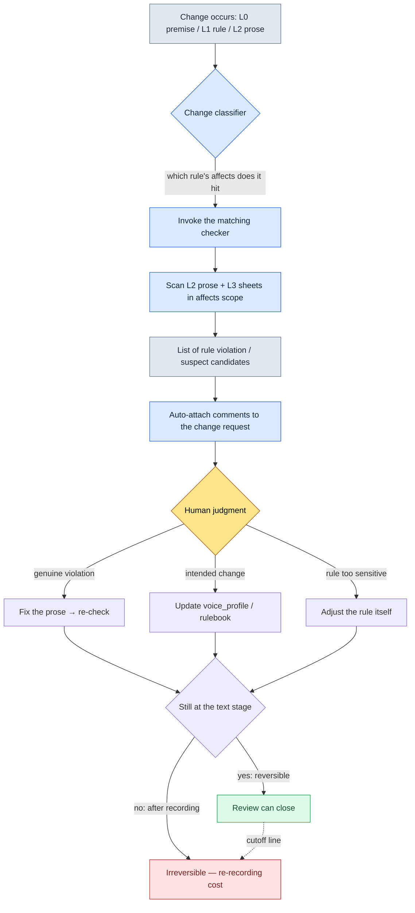

# 5.2 Worldview → Character → Quest Consistency Verification

Just before beta, a bug report came up from QA. The title: "The king is speaking informally." The body was short. "In the 3.4 intro cutscene, K_001 (the King) says '야, 잠깐만' ('Hey, hold on') to the player. This character uses '그대' — the archaic, courtly second-person address — everywhere from 1.1 through 3.3."

I asked the writer, and the answer surprised me. "I never wrote that line." Tracing it back, an outsourced writer had hastily filled in one line of a cutscene branch. Our character bible had a voice_profile, but that outsourced writer had never seen the document. The rule lived inside the document; the line came in from outside it.

This is the essence of a consistency incident. It happens not because there is no rule, but because the rule fails to follow the text all the way down. And if that one line sits in a cutscene, it gets scarier. Cutscenes usually get voice recording. While it is still text, one fix ends it; if it is discovered after recording, the irreversible costs follow — re-booking the voice actors, re-recording, re-mixing. The real goal of consistency verification is to catch it *before recording*.

This chapter covers a workflow that catches that incident with a rulebook and checkers instead of human eyes. We look at the actual artifacts, as-is: how the lore_consistency_rule rulebook becomes the checker's input, how voice_lint pulls tone drift as suspect candidates, and why the final judgment must remain a human seat to the very end.

---

## 5.2.1 Where Consistency Incidents Leak From

Collect user reviews of shipped RPGs and MMORPGs and the narrative consistency incidents converge into a few patterns. The types look different, but the cause is almost always the same.

- **Worldview contradiction**: 1.1 says "magic is forbidden" → in 1.3 an NPC casts magic like it's nothing
- **Voice drift**: the same NPC's diction and honorific register change from chapter to chapter (the "king's informal speech" incident above)
- **Timeline conflict**: a dead NPC reappears alive and well in the late game (death-flag sync missed)
- **Reward–narrative mismatch**: the narrative says "a sword bestowed by the king," but in the data it's a common junk item
- **Faction relation contradiction**: right after the player declares hostility toward faction A, a faction A NPC offers a friendly greeting

The five look like different incidents, but trace them and they leak from the same spot. Layer 0 (world premise) or Layer 1 (rules) changed, and that change never propagated to Layer 2 (prose) and Layer 3 (data sheets). The rule got updated; the prose stayed stopped on top of the old rule.

Trying to stop this with manual review is asking too much. One chapter tangles together 50 NPCs, 2,000 lines of dialogue, and 30 quests; when one rule line changes, no human can trace 100% of where its effects spread. The missed line doesn't get caught at the review stage — it gets caught in the user reviews after launch.

That said, automated checking doesn't guarantee 100% either. The point is the division of labor. **Automated checks pull suspect candidates fast; humans make the judgment.** The goal of automation is to cut human review time, not to remove the human. Blur this premise and every failure covered later in this chapter follows.

---

## 5.2.2 lore_consistency_rule — The Rulebook You Feed to the Checker

One of Project A's L1 documents is `lore_consistency_rule.md`. The document is a guide humans read and, at the same time, input the checker parses. The `atoms` and `affects` keys in the frontmatter bind those two roles into one body.

```markdown
---
title: Lore consistency rules
layer: L1
atoms:
  - lore_check_world_rule
  - lore_check_character_voice
  - lore_check_timeline
  - lore_check_faction_relation
related:
  derives_from: [world_premise, narrative_pillar]
  affects: [main_quest/*, character_bible/*, dialogue_id_table]
---

## 1. World rules
- Magic starts banned → any use must specify (when, by whom, justification)
- The gods are silent → no depictions of direct replies (dreams and visions allowed)

## 2. Character voice rules
- Referencing each character's voice_profile is mandatory
- New dialogue must follow the 5 voice_profile items (vocabulary, sentence length, honorifics, emotional expression, forbidden terms)

## 3. Timeline rules
- Every NPC gets a status_timeline (alive / injured / dead / missing / relocated)
- status_timeline checked automatically at dialogue and appearance points

## 4. Faction relation rules
- Record when the faction_relation_matrix changes
- Dialogue written after a change reflects the new relations
```

That one `affects` line defines the checker's scan scope. When world_premise changes, the checker re-sweeps all of `main_quest/*`, `character_bible/*`, and `dialogue_id_table`. The work a human used to do in their head — "how far does this change reach?" — is taken over by the dependency graph written in the rulebook.

voice_profile is a separate L2 asset this rulebook references. A single character's profile is entered as numbers and enumerated values, so the checker can use it as a baseline for comparison.

```yaml
# character_bible/K_001_voice_profile.yaml
character_id: K_001
display_name: 국왕                       # "the King"
voice_profile:
  vocabulary_register: 고풍_격식        # vocabulary register: archaic_formal
  avg_sentence_len: 18                   # average sentence length (in characters)
  honorific: "그대"                      # fixed second-person address (archaic "thou")
  emotion_expression: 절제               # emotional exposure: restrained
  forbidden_terms: ["야", "잠깐만", "ㅋ"] # forbidden terms: casual "hey" / "wait a sec" / "lol"
```

Only with this yaml does "the king is speaking informally" stop being human intuition and become items a machine can compare. If honorific is fixed at "그대" and the line contains "야", that's not an opinion — it's a rule-violation candidate.

---

## 5.2.3 The Consistency Verification Flow

The moment a change occurs, the checker fires. The flow looks like this.



The last branch is the hidden spine of this chapter. Every consistency judgment must **end at the text stage — that is, the reversible stage.** Once review slips past recording and casting, fixes become irreversible. That's why checkers like voice_lint and timeline_lint need to run not *fast* but *early*. A cutscene line has to pass through at least once before it enters the recording queue.

There are four checkers, each mapping one-to-one to a section of the rulebook.

- `world_rule_lint.py` — L1 world rules + all L2 prose → violation candidates such as magic use or direct divine responses
- `voice_lint.py` — voice_profile + dialogue_id_table → lines suspected of voice drift
- `timeline_lint.py` — npc status_timeline + every line and appearance timing → conflicts such as dead NPCs reappearing
- `faction_lint.py` — faction_relation_matrix + dialogue tone → lines contradicting faction relations

None of the four checkers is 100% accurate. That's why the output is named "suspect candidates," not "violations."

---

## 5.2.4 Worked Transcript: One Full Pass of voice_lint

An abstract "there is a checker" doesn't give you a feel for it. Let's actually run it once. The input reproduces the "king speaking informally" incident from the opening.

**setup** — Pull the two lines under inspection from dialogue_id_table.

```
dialogue_id_204  speaker=K_001  text="야, 잠깐만요. 그쪽이 먼저 말해 봐."
dialogue_id_217  speaker=K_007  text="...젠장, 또 실패야. 다시 처음부터."
```

(Line 204 has the king saying, in a casual register, "Hey, hold on. You go first." Line 217 has K_007 muttering "...Damn it, failed again. Back to the start.")

**prompt** — The checker itself runs on rules: regular expressions, length comparison, forbidden-term matching. The AI is attached only at one seat — explaining *why* something is suspect, in natural language a writer will actually read. The full LLM prompt for the inspection step follows.

```
voice_lint가 뽑은 의심 후보들이야. 판정은 하지 말고, 각 후보가
어떤 voice_profile 항목을 위반한 것 같은지랑 근거만 1~2문장으로 설명해줘.
"위반이다/아니다" 단정하지 말고 "~로 의심됨"까지만.

[voice_profile]
K_001: honorific="그대", avg_sentence_len=18, forbidden=["야","잠깐만"]
K_007: forbidden=["젠장"]

[의심 후보]
- dialogue_id_204 (K_001): "야, 잠깐만요. 그쪽이 먼저 말해 봐."
- dialogue_id_217 (K_007): "...젠장, 또 실패야. 다시 처음부터."
```

(The prompt, in brief: "These are the suspect candidates voice_lint pulled. Do not judge. For each candidate, explain in one or two sentences which voice_profile item it seems to violate and why. Do not declare 'violation / not a violation' — go no further than 'suspected.'" It then lists the two voice_profiles and the two candidate lines.)

**Claude's raw output** (reproduced as-is, with no summarizing or cleanup)

```
[dialogue_id_204 / K_001]
이 대사는 honorific 항목과 충돌하는 것으로 의심됩니다. voice_profile은
2인칭 존칭을 "그대"로 고정하고 있는데, 본 대사는 "그쪽"을 쓰고 존칭 자체가
드러나지 않습니다. 또한 forbidden_terms의 "야"와 "잠깐만"이 모두 등장하여
어휘 격(고풍_격식)에서 벗어난 것으로 의심됩니다. 평균 문장 길이 18자 기준과는
직접 어긋나 보이지 않으나, 어조 자체가 캐주얼해진 점이 위반 신호로 의심됩니다.

[dialogue_id_217 / K_007]
forbidden_terms의 "젠장"이 그대로 사용되어 금기 표현 항목 위반으로 의심됩니다.
다만 K_007(학자)의 emotion_expression 항목이 제시되지 않아, 이 표현이
의도된 감정 고조인지 단순 일탈인지는 이 정보만으로 판단하기 어렵습니다.
판정은 작가 검토가 필요합니다.
```

(In brief: for 204, the output suspects a conflict with the honorific item — the profile fixes the second-person address to "그대" while the line uses a casual "그쪽" — and notes that both forbidden terms "야" and "잠깐만" appear, drifting from the archaic-formal vocabulary register; it concedes the average sentence length of 18 does not directly deviate. For 217, it flags the forbidden term "젠장" but says that with no emotion_expression item provided for K_007, a scholar, it cannot tell an intended emotional peak from a simple lapse, and that the verdict needs the writer's review.)

This output carries two kinds of honesty we deliberately left in. First, on 204 the AI said the average sentence length "does not directly deviate" — **it did not insist that a non-violating item was a violation.** Second, on 217 it said "the emotion_expression item was not provided, so this is hard to judge" — **it admitted missing information and handed the judgment to a human.** If the AI had pushed every suspicion through as "confirmed violation," that would be the more dangerous checker.

**verify** — The writer receives these comments directly on the change request. The writer makes the judgment.

- 204: a genuine violation. The line went in because an outsourced writer never saw the voice_profile → fix the prose, re-check
- 217: an intended violation. It is the emotional-peak line in 3.4 where K_007 breaks down → add an `emotion_peak_exception` flag to the voice_profile and register 217 as an exception

The same checker pulled both candidates, yet the endings are opposite. One fixes the prose; the other fixes the rule. That a machine cannot make this fork automatically is the heart of the next section.

---

## 5.2.5 Why Judgment Is the Human's Seat

There are three reasons the checker stops at suspicion and hands over the judgment.

First, **intended violations exist.** In chapters where a character breaks down or changes, the voice drifts on purpose. 217 above is exactly that. An auto-reject checker blocks the writer's dramatic intent.

Second, **the rules themselves evolve.** If the same kind of suspicion keeps getting judged an "intended change," that's a signal the rule isn't keeping up with reality. Check results don't just drive fixes to the prose; they drive fixes to the rulebook too.

Third, **new characters and factions need a learning period.** A new NPC whose voice_profile has only two or three items filled in will naturally surface lots of suspicions. Turn on auto-reject during this period and writers start seeing the checker as the enemy.

The checker survives only when the boundary between automated checking and human judgment is sharp. Make it auto-reject and within a month the writers will say, "let's turn this off." It's like installing an oversensitive automatic sensor on the office door: the door slams shut every time someone walks through, until eventually somebody rips the sensor out. A checker should not be a device that closes the door — it should be a device that reports "someone passed through here."

One caveat to add. The principle that review must close at the text stage (the cutoff line in the flowchart above) applies to human judgment just the same. The writer's "intended violation" verdict also has to land before recording. A reversal after recording is no longer a checker problem — it turns into a production-cost problem (the full map of the reversible/irreversible boundary is in 5.4.5).

---

## 5.2.6 Measurement — Six Months Before and After

On Project A we rolled out the four checkers in stages and measured six months. The figures below are based on actual logs, expressed as direction and ratio rather than absolute values (internal measurement, not an author's estimate).

- **Review time per chapter**: about 5 days before → about 2 days after (less than half)
- **Consistency incidents found after release**: 3–5 per chapter → 0–1
- **Chapter output speed per writer**: 4 weeks → 2.5 weeks
- **Rulebook (L1) update frequency**: 1–2 per quarter → 1–2 per month

The last item is the most interesting. With checkers in place, changing rules often is safe. Change one rule line and its impact becomes visible automatically, so the fear of change shrinks and the rules evolve faster. The real effect of consistency tooling is less "we reduced incidents" and closer to "we can now change rules without fear."

One caution: the numbers above are from the point where all four checkers were running. What matters more is that in the early phase, voice_lint alone produced visible results. You don't need to switch on all four from day one.

---

## 5.2.7 Where to Put the AI

For the checker core itself, rule-based is the efficient choice. Trust builds only when the same input yields the same result, and an LLM is non-deterministic — the wrong fit for that seat. The AI goes into four other seats.

- **Detecting rule-violation candidates** → rules (regex, keyword, length, structure checks). Not an LLM
- **Explaining why a candidate is suspect** → LLM. The natural-language "why this is suspect" explanation seen in the worked transcript above
- **Drafting alternative lines** → LLM. Drafts for the writer's review; the writer finalizes
- **Proposing voice_profile update candidates** → LLM. Extracts patterns from dozens of chapters of prose and proposes item refinements

Rules are fast and deterministic; LLMs are strong at explanation and generation. Mix the two roles and both break. Hand the checking to an LLM and the same line passes yesterday and fails today; hand the explanation to a regex and all you get is machine-speak like "honorific item violation."

---

## 5.2.8 Adoption Order and Common Failures

Build all four checkers from the start and the burden arrives before the payoff. The recommended order starts with the cheapest, highest-impact pieces.

1. **Standardize the five voice_profile items** (about 1 month) — settle the character_bible format first. This comes before any checker
2. **Minimal voice_lint** (about 1 week) — forbidden-term matching only. Blocking a single word cuts post-launch social media incidents by 1–2 per quarter
3. **timeline_lint** (1–2 weeks) — death-flag checks. Just catching dead NPCs reappearing is a tangible win
4. **world_rule_lint + faction_lint** (1–2 months) — the remaining two
5. **LLM assistance** (1–2 more months) — integrate explanation and draft generation

I want to stress that step 2 (voice_lint) alone delivers a lot. The "king's informal speech" incident at the opening was exactly the kind this single step catches.

The failures that recur during adoption are almost fixed, too.

- **Building it as auto-reject** → revert to the suspect-candidate + human-judgment structure
- **Running the rulebook apart from the writers** → make writer agreement mandatory for rulebook changes, and let writers request rulebook changes themselves
- **voice_profile filled in only for form's sake** → fully complete all five items for one character, then expand
- **Nobody knows where the check results live** → force auto-attachment to change-request comments
- **Letting the LLM do the checking itself** → checks are rules; only the explanation goes to the LLM
- **Reviewing after recording** → review closes at the text stage. Never cross the reversible boundary

The last item costs more than all the items above it. The other failures lose you time; this one loses you the voice actors' schedule.

---

The next chapter (5.3) covers writing narrative prose with AI assistance, rather than checking it. We look at how to inject L0 tone and L1 rules as context, so the AI produces answers from our world instead of generic ones.

---

### Key Takeaways
- Consistency incidents happen not because rules are missing, but because rules fail to propagate into the prose.
- A checker survives only if it stops at suspicion and leaves the judgment to humans.
- All consistency review must close at the pre-recording text (reversible) stage.

### Next Chapter Preview
- 5.3. AI-Assisted Narrative Writing — Injecting L0 Tone and L1 Rule Context

---

## Try It Yourself

**setup** — Pick one character from your character_bible and fully fill out the five voice_profile items (vocabulary register, average sentence length, honorific address, emotional expression, forbidden terms) in yaml. Pull 10 of that character's existing lines from dialogue_id_table and gather them in one file.

**prompt** — Use the inspection-assist prompt from the worked transcript above as-is. The heart of it is two constraints: "do not judge" and "go no further than 'suspected.'" Paste the voice_profile yaml and the 10 lines into the input.

**verify** — Judge the output's suspect candidates yourself, line by line. If it's a genuine violation, fix the prose; if it's an intended change, add an exception flag to the voice_profile. Also check whether the AI insisted that non-violating items were violations, and whether it admitted missing information. If the AI declares every item a violation, strengthen the "do not judge" constraint in the prompt.

### Solo Scale-Down

If you're a solo developer with no four checkers and no rulebook, one prompt can get you the same effect without a checker core. Maintain a voice_profile yaml per character by hand, and every time you write new dialogue, paste that character's yaml plus the new lines into the assist prompt above to collect "suspect candidates." There's no automation, but the core structure — **humans judge, AI explains** — survives intact. There's only one line to hold: run this review once before anything goes to recording or voice synthesis. The principle of never crossing the reversible stage doesn't depend on team size.
