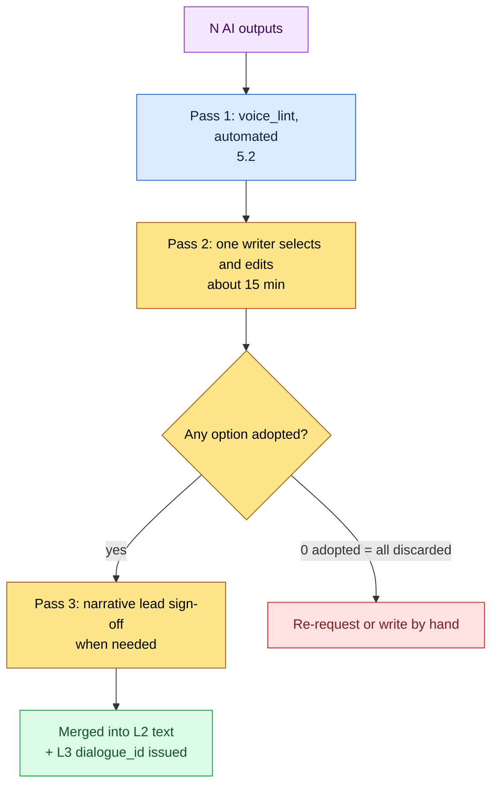
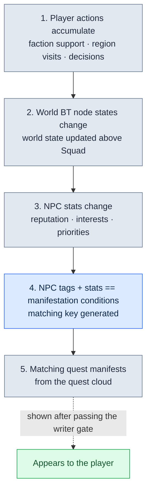

# 5.3 AI-Assisted Narrative Writing

It was the day I was drafting the first lines for a new side NPC. Into an empty chat window I typed, "Give me five lines for a village blacksmith NPC." Five seconds later the screen showed, "Hero, entrust thy weapon to me." Not a sentence that merely felt familiar — a sentence I could practically name the source of. The same prompt would have returned the same answer for a different game on a different team. What I realized in that moment was not that the model was weak. It was that I had told the model nothing about our game.

AI writes generic fantasy sentences well. What it cannot write is our world's sentences. The difference comes down to one thing: context injection. Send the L0 tone and the L1 rules along with every request, and the line the AI produces shifts from "a sentence I've seen somewhere" to "a sentence from this game." This chapter covers the practice of running that injection as four layers, and at the end it marks the progressive application that lifts the same principle to world-simulation scale — the world BT (Behavior Tree) plus the quest cloud — as the front line of R&D.

---

## 5.3.1 What Happens When the Context Is Empty

In narrative work, AI assistance is the area adopted fastest and the area that loses trust fastest. The failure pattern is almost always the same.

Throw in "five quest-opening lines" and back come five generic fantasy variants starting with "Hero, our village..." Ask it to "polish this character's dialogue" and the voice flattens out — every NPC converges on a similar register. Ask for "a chapter 1 synopsis" and you get the average of every RPG synopsis the model has ever seen.

The problem is not the model; it is that the context is empty. A model outputs the average of its training data. If you don't want the average, you have to give it cues that pull it away from the average. The subject of this chapter is how to build those cues and how to inject them.

On the MMORPG project I run (Project A from here on), narrative AI assistance stacks four layers of context in order. The structure from 5.1 — NarrativeDocs decomposed into Layers 0–4 — is reused here, as is, as the unit of injection.

<svg viewBox="0 0 720 300" xmlns="http://www.w3.org/2000/svg" font-family="sans-serif">
  <rect x="20" y="20" width="680" height="46" rx="6" fill="#1f2d3d"/>
  <text x="40" y="40" fill="#fff" font-size="14" font-weight="bold">Layer A · System prompt</text>
  <text x="40" y="58" fill="#9fb3c8" font-size="11">Writer persona · prohibitions (rarely changes, defined once)</text>

  <rect x="20" y="78" width="680" height="46" rx="6" fill="#27496d"/>
  <text x="40" y="98" fill="#fff" font-size="14" font-weight="bold">Layer B · L0 vision</text>
  <text x="40" y="116" fill="#bcd4e6" font-size="11">world_premise · narrative_pillar · tone_manifesto (≈7,000 tok, cached)</text>

  <rect x="20" y="136" width="680" height="46" rx="6" fill="#2e6171"/>
  <text x="40" y="156" fill="#fff" font-size="14" font-weight="bold">Layer C · L1 rules (selective injection)</text>
  <text x="40" y="174" fill="#cfe8df" font-size="11">Only the _summary sections of job-relevant rules (cached)</text>

  <rect x="20" y="194" width="680" height="46" rx="6" fill="#3e885b"/>
  <text x="40" y="214" fill="#fff" font-size="14" font-weight="bold">Layer D · L2 adjacent text</text>
  <text x="40" y="232" fill="#e3f2e8" font-size="11">Same character's previous lines · same chapter synopsis (verbatim, changes every time)</text>

  <rect x="180" y="254" width="360" height="36" rx="6" fill="#c0392b"/>
  <text x="200" y="277" fill="#fff" font-size="13" font-weight="bold">Task instruction: "3 line options for K_007 at this point"</text>

  <line x1="360" y1="66" x2="360" y2="78" stroke="#888" stroke-width="2"/>
  <line x1="360" y1="124" x2="360" y2="136" stroke="#888" stroke-width="2"/>
  <line x1="360" y1="182" x2="360" y2="194" stroke="#888" stroke-width="2"/>
  <line x1="360" y1="240" x2="360" y2="254" stroke="#888" stroke-width="2"/>
</svg>

I don't inject all four layers every time; I pull only the layers the job needs. For a draft of one character's next line, A + B (tone only) + D (that character's 10 most recent lines) is enough. For a new side-quest synopsis, C (the quest structure rules) gets added. For four options of a branch outcome, C (the branching rules) + D (the full text leading up to the branch) gets heavy. It's like reaching into the file tray on my desk and picking out — sized to the job — a persona sheet, a one-line world premise, a page of the rulebook, and a bundle of adjacent text.

---

## 5.3.2 One Worked Transcript — K_007's First Emotional Line

Instead of explaining in the abstract, I follow one real request from start to finish. The job: draft three line options for the scene where one recurring character — a scholar-type NPC, internal ID `K_007` — has to show emotion for the first time. Starting with the full prompt.

**The prompt I sent (Layer A + B (tone) + D + task instruction + output format):**

```
[System]
You are the narrative writer for Project A. No stock RPG phrases like "hero"
or "the chosen one". Follow the tone of the previous lines below. Don't invent
lore you don't know — say "can't judge from this context". You only draft; I decide.

[L0 tone — tone_manifesto excerpt]
The register of this world is restraint. Characters do not speak emotion easily.
Emotion shows as cracks, not outbursts. Ellipses and short sentences.

[Reference — K_007's previous 5 lines (chronological, verbatim)]
1. "...That's the first I'm hearing of it."
2. "Is there a record? If not, we should be skeptical."
3. "Let's not move until we're certain."
4. "That is all I have to say."
5. "...I'm sorry. Was I too cold?"

[Situation]
A fellow NPC has returned wounded. The scholar must show emotion for the first time.

Exactly 3 options, each within 25 characters. End each option with a
(reaction type: anger/sadness/denial) label, and skip explanations and preamble.
```

(In English, the prompt reads: the system block says — you are the narrative writer for Project A; no stock RPG phrases like "hero" or "the chosen one"; follow the tone of the previous lines below; don't invent lore you don't know — say "can't judge from this context"; you only draft, I decide. The L0 tone excerpt: the register of this world is restraint; characters do not speak emotion easily; emotion shows as cracks, not outbursts; ellipses and short sentences. Then the scholar's five previous lines, verbatim and in chronological order — 1 "...That's the first I'm hearing of it." / 2 "Is there a record? If not, we should be skeptical." / 3 "Let's not move until we're certain." / 4 "That is all I have to say." / 5 "...I'm sorry. Was I too cold?" — the situation: a fellow NPC has returned wounded, and the scholar must show emotion for the first time; and the format: exactly three options, each within 25 characters, each ending with a label (reaction type: anger/sadness/denial), no explanations or preamble.)

**Claude's raw output (verbatim — no summarizing, no retouching):**

```
1. "...Why did you carry that alone? Like a fool." (reaction type: sadness)
2. "I should have checked the records. I— I missed it." (reaction type: denial)
3. "It's okay. It's all okay. So stop—" (reaction type: denial)
```

The point is what happens next — we don't stop here. The writer reads the three options and verifies them. Option 1 — "...왜 그걸 혼자 떠안았어요. 바보같이." ("...Why did you carry that alone? Like a fool." — labeled sadness) — gets the tone right. The crack that previous line 5 opened with "...죄송합니다. 제가 너무 차가웠나요." ("...I'm sorry. Was I too cold?") is carried forward by a single word, "바보같이" ("like a fool"). A candidate for adoption. Option 2 ("기록을 봤어야 했는데. 제가, 제가 놓쳤어요." — "I should have checked the records. I— I missed it.") stammers, and the stammer sits slightly off from the scholar's restraint. On hold. Option 3 ("괜찮아요. 다 괜찮아요. 그러니까 그만—" — "It's okay. It's all okay. So stop—") has the wrong label: repeating "it's okay" is not denial but something closer to avoidance, and our voice_profile has no pattern of this scholar processing emotion through avoidance. Rejected.

**The re-request (sent back with the rejection reason stated):**

```
Option 3 rejected. The "it's okay" repetition isn't this scholar's pattern. This character
processes emotion not as avoidance but as 'self-blame over a failed fact-check'. Option 1 is adopted.
In place of options 2 and 3, give me two new options with a different grain from option 1. No stammering, within 25 characters.
```

(In English: option 3 rejected — the "it's okay" repetition isn't this scholar's pattern; this character processes emotion not as avoidance but as self-blame over a failed fact-check. Option 1 is adopted. In place of options 2 and 3, give me two new options with a different grain from option 1. No stammering, within 25 characters.)

**Claude's second output:**

```
2. "Records don't lie. I just didn't look." (reaction type: self-blame)
3. "...Sit down. The wound first. Words later." (reaction type: sadness)
```

This time both passed. Option 2 — "기록은 거짓말 안 해요. 내가 안 본 거예요." ("Records don't lie. I just didn't look." — labeled self-blame) — reuses the scholar's core vocabulary, "기록" ("records"; see previous line 2, "Is there a record?"), as the vehicle for self-blame. Option 3 — "...앉아요. 상처부터. 말은 나중에." ("...Sit down. The wound first. Words later.") — shows, in restrained imperatives, the scholar's pattern of pressing emotion down into action. The final picks: option 1 plus the new options 2 and 3. These three lines pass the automated `voice_lint` review from 5.2, get merged into the L2 text, and receive a `dialogue_id` from L3.

This one transcript holds everything in this chapter. Tone injection (L0) saved option 1; the verbatim adjacent text (L2) let the model pick the scholar's word "기록" back up at the re-request; the enforced output format blocked the chatter; and the writer's rejection gate caught option 3's wrong label. The AI made not a single final decision.

---

## 5.3.3 Layer A — The System Prompt: One Line Decides Everything

This is the persona definition laid down on top of everything else. Define it once and almost never change it. The system block in the transcript above is the actual artifact. Of its five lines, the last one ("you draft, the writer decides") matters most. Leave it out and the AI confidently produces sentences that pose as "final," and the writer ends up grading instead of reviewing. The third line ("don't invent lore you don't know — answer that it can't be judged from the context") matters second-most. Without it, the model fills the blanks with plausible lies. In narrative, a plausible lie comes back a few days later as a lore conflict.

---

## 5.3.4 Layer B — The L0 Vision and Where the Cache Goes

L0 is small (about 4.5 pages by the count in 5.1). Injecting all of it nearly every time is feasible. Estimated against the Korean text, `world_premise.md` runs about 2,500 tokens, `narrative_pillar.md` about 1,500, and `tone_manifesto.md` about 3,000 — roughly 7,000 tokens combined. (These figures are the author's estimates, unverified. They shift with the tokenizer and with document revisions.)

Sending 7,000 tokens fresh with every request adds up. So I turn on prompt caching. Both Anthropic and OpenAI support it, and on a cache hit the input-token cost drops sharply. The key is to separate, inside the message, what changes from what doesn't.

```python
messages = [
    {"role": "system", "content": SYSTEM_PROMPT},
    {"role": "user", "content": [
        {"type": "text", "text": L0_FULL,      "cache_control": {"type": "ephemeral"}},
        {"type": "text", "text": L1_SELECTED,  "cache_control": {"type": "ephemeral"}},
        {"type": "text", "text": L2_ADJACENT},   # changes every time — not cached
        {"type": "text", "text": TASK_INSTRUCTION},  # changes every time
    ]},
]
```

L0 and L1, tagged with `cache_control`, are cache targets; the L2 adjacent text and the task instruction change every time, so they are not cached. Always grouping the cached blocks at the front of the message is what decides the hit rate. If a changing block slips in front, every cache behind it is invalidated. Getting this order wrong is the most common reason caching is on and the bill doesn't go down.

> The details on cache hit rates and cost-saving figures are covered in the Part 22 chapter on cost. Here, the one principle to remember is: push what changes to the back.

---

## 5.3.5 Layer C — Don't Inject the L1 Rules Whole

The L1 rulebook is big. Put all of it in and the context blows up — and worse, the model loses the point. Pick only the rules relevant to the job, and of those, only the `_summary` sections.

For main-quest branch outcomes, pick `dialogue_branching_rule` and `faction_relation_matrix`. For new NPC dialogue, that NPC's `voice_profile` and `tone_manifesto`. For a new lore-dictionary entry, `lore_consistency_rule` and `world_premise`. For a side-quest skeleton, `quest_template` and `reputation_model`. Selection is done either by hand or by automatic extraction along the wikilink graph (Part 7); when extracting automatically, favor recall over precision. The damage from one missing rule is far greater than the damage from one extra rule.

Instead of injecting the full rulebook text, keep a `_summary` section at the head of each rulebook file and inject only that.

```markdown
---
title: Branching rules
layer: L1
---

## _summary
- Branches occur only at chapter ends
- Branches have 2~3 options. 4 or more prohibited
- A branch choice affects reputation by +/-1; an ending branch by +/-3
- Every branch outcome must show its result within 24 hours
- Branches cannot be undone (expose UI recommending a separate save)

## 1. Rules for when branches occur
(detailed explanation, for operators' reference — not injected into the LLM)
...
```

Five lines of `_summary` do more for LLM output quality than fifty lines of body text. Models follow short, assertive rules better. Long explanations scatter the model's attention, and scattered attention comes back as rule violations.

---

## 5.3.6 Layer D — Never Summarize the Adjacent Text

Previous lines, adjacent quests, the synopsis of the same chapter — this is the most volatile context. For a character's new dialogue, inject that character's previous 10 lines in chronological order; for a mid-chapter quest, the chapter synopsis plus one-line summaries of the other quests in that chapter; for a branch-outcome ending, the full text leading up to the branch plus the choice text. Inject too much and the LLM outputs the average; inject too little and you get generalized output. The workable zone is somewhere between 1,500 and 3,000 tokens (author's observation, unverified).

One core rule: adjacent text goes in verbatim — never processed, never summarized. In the transcript above, the scholar's five previous lines went in untouched, and that is exactly why the model, at the re-request stage, could pick out the precise word "기록" ("records") and reuse it as the vehicle for self-blame. Had those five lines been summarized as "the scholar is cautious and cold," every one of the writer's fine-grained choices would have vanished, and the model would have drifted back to the average. Summarizing doesn't reduce information; it erases decisions the writer has already made.

---

## 5.3.7 The Writer Review Workflow — Using the Discard Rate as a Metric

AI output is always a draft. Review passes through a fixed gate.



It is also normal for the writer to pick zero out of N — to discard everything. As option 3 was rejected in the transcript above, a rejection is not a failure; it is proof the gate worked. So I measure the discard rate per writer and per character, and use it as the metric for context-injection quality.

A discard rate of 0–20% means stable operation with sufficient context — leave it alone. 20–50% is the normal operating range — just monitor. If it climbs to 50–80%, recheck whether an L1 rule was left out of the selection. Past 80%, the problem is not any individual rule but the system prompt and persona themselves being off — rewrite Layer A. The discard rate is tallied per writer once a week and shared in the retrospective.

That said, the discard rate is not an absolute metric. A character changing fast (say, at a turning point like K_007's first show of emotion in the transcript above) can run a high discard rate and still be healthy. The number is the start of a conversation, not a verdict.

---

## 5.3.8 Security — How to Stop Context Leaks

L0 and L1 are the game's core IP. If sending them as is to an external LLM API feels uncomfortable, the options diverge. Using an external API as is, under a no-training agreement, is fastest but needs legal review. Swapping company names and proper nouns for placeholders before sending adds processing cost and damages naturalness. Self-hosting an open model keeps the data safe but carries a heavy quality and operations burden. A hybrid — keep L0 in-house and send only drafts outside — is complex to operate.

My Project A uses the first option (external API plus a no-training agreement). We tried the second and dropped it: placeholder substitution flattened the text into the shape of "the ○○ scholar of the ○○ kingdom spoke about ○○" and wrecked output quality. Anonymization killing quality is a trade-off that recurs throughout this book (see the anonymization chapter in Part 1). In narrative the damage is especially severe, because proper nouns are the tone.

---

## 5.3.9 Common Failures and Their Fixes

Throw a task instruction with no system prompt and you get the average. Lay down the persona and the prohibitions first. Inject all of L0 every time without caching and the cost bleeds. Group the cache blocks at the front. Stuff the whole L1 rulebook in and the model loses the point. Extract only the `_summary` sections. Summarize the adjacent text and the writer's choices get erased. Quote the originals verbatim. Skip the output format and a good share of responses open with "Here are three candidates:" — followed eventually by the incident where a writer mistakes that preamble for actual copy. Specify count, length, labels. Use AI output as final and the review gate collapses. Always pass it through the writer gate. Don't measure the discard rate and the tool's health depends on people's impressions. Tally it weekly and share it in the retrospective.

---

## 5.3.10 From Conservative to Progressive Application

Everything so far has been the conservative application: the writer injects context with care, and the AI only drafts, line by line. The unit of work is small — "three options for this character's next line," "a synopsis for this quest." It is stable, but it has limits in production scale and dynamic responsiveness.

One thing is worth marking first. Procedural generation, world simulation, and dynamic quests are visions game designers have been sketching on paper for the last 20–30 years. Deterministic, rulebook-driven PCG handled the numeric territory — dungeon rooms, weapon options, spawn distributions — but never reached natural-language text, character personas, narrative branching, or NPC dialogue. A large share of design stayed on paper. The advances in LLMs and image models from 2024 to 2026 pulled that territory into implementable range. The core meaning of AI progress is not model scores; it is that designs long stuck on paper became feasible. That said, a possibility opening up and a system settling into something operable are different problems.

### Layer Decomposition Was the Precondition for Procedural Generation

The Layer 0–4 decomposition in 5.1 was not mere tidying; it was the precondition for procedural generation. Which stage of the generation pipeline each of the five layers maps to (L0 anchor → L1 rulebook → L2 text → L3 numbers → L4 gate) was covered in §6.6 and 5.1.11. The point is single: on top of one monolithic document, a generator cannot decide where to start reading or where to write; not knowing where L0 sits, its context blurs; L1 and L2 collide inside one file and the production line collapses. Layer decomposition comes first, and procedural generation runs on top of it. Here, that precondition is applied to the mass-production stage of narrative AI assistance.

### The Skeleton of the Progressive Application — The Quest Cloud

Three elements come together. First, NPC Personas are procedurally generated. Main NPCs stay in the writer's hands, but side NPCs are mass-produced by the generator and Squad pipeline from 6.2–6.3. Each Persona carries a `voice_profile` plus tags (occupation, faction, disposition, role). Second, the world BT sits above Squad. Where a Squad bundles the behavior of one hunting ground's NPC group, the world BT sits above it, takes accumulated player-action metrics, and updates the state of the world as a whole. Which factions the player helped, which regions they frequented, which decisions they made — these shake the world BT's node states, and the shaken nodes propagate into the stats (reputation, interests, priorities) of the NPCs in their sphere of influence. Third, quests follow a cloud model. Every quest except the main quest is procedurally generated and floats free, each carrying tags (who, where, why, when) and manifestation conditions. No quest is pinned to a specific NPC.

Manifestation passes through five stages.



As a metaphor: quests are not books shelved in a library but clouds drifting overhead. When an NPC reaches a certain state, the cloud that fits it descends within reach. In this structure the AI is no longer an assistant writing one line; it handles three things at once — the natural-language text (descriptions, dialogue) of the procedurally generated Personas and quests; the vocabulary shifts when world BT state lands on an NPC (the same `voice_profile` holds, but the topics move with the world state); and the suspicion classifier at the verification stage (should this quest be allowed to manifest on this NPC?).

### The Irreversibility Boundary — Review Must End at the Text Stage

Even in the progressive application, the reversible/irreversible boundary (5.4.5) stays fully alive. If a cloud-manifested quest's dialogue flows into the voice pipeline without passing review, no code rollback can bring it back. So the safety mechanism of the progressive application is placing every review gate (`voice_lint`, the suspicion classifier, the writer gate) in front of the irreversibility boundary. With automated mass production added on, these gates have to be harder than in the conservative application.

### Where to Stop, and Why Not to Stop

This book does not cover the finished form of the progressive application. That is a book of its own, and the infrastructure assumptions differ by company and project. Only two things need remembering. First, a team that can't run the conservative application can't run the progressive one either. If the review gate doesn't turn in the conservative application, the cloud runs away in the progressive one. For the operation to survive, five things must be in place together: procedural generation infrastructure; tooling to define and test world BT nodes; automatic suspicion classification of manifested quests plus the writer gate; simultaneous tracking of manifestation rate, discard rate, and player satisfaction; and automatic recall and replacement of wrongly manifested quests. Drop any one of the five and the system gets scrapped within a quarter — consistency incidents explode past what human review can keep up with.

Second, the progressive application is not a tool for scaling up mass production; it is a tool for scaling up dynamic responsiveness. Aim only at volume and the cloud fills up with generic-RPG average, and players meet a world that "looks more varied but is more empty." That doesn't make this road purely dangerous, either. This territory is the front line of game design R&D. The spot where procedural generation, simulation, and LLMs meet is where a genuinely new game form is most likely to appear. Few companies will adopt it tomorrow, but it is worth keeping in view as one direction for the next 5–10 years.

---

## 5.3.11 Try It Yourself: One Chapter End to End

Here is the procedure for reproducing this chapter's conservative application as is.

**setup.** Merge the three L0 files (`world_premise.md`, `narrative_pillar.md`, `tone_manifesto.md`) into one text and put it in an `L0_FULL` variable. Write the system prompt exactly as the five lines in the transcript above, and do not drop the last line ("you draft, the writer decides"). Collect the previous 10 lines of the character you're drafting for, verbatim, as plain text.

**prompt.** Assemble the message in the order `[시스템] → [L0 톤] → [참고: 직전 대사 원본] → [상황] → [출력 형식]` (system → L0 tone → reference: previous lines verbatim → situation → output format). In the output format, always state "exactly N options / max length per option / labels / nothing else." Put `cache_control` on L0 and L1 only, and push the changing blocks to the back of the message.

**verify.** Verify the N options you receive, line by line. Check that the tone continues from the previous lines, that the labels match the actual reactions, and that no pattern your character never uses (avoidance, stammering, and so on) has crept in. For options you reject, state the reason and re-request. Adopting zero is normal; record it in the discard rate. Only options that pass go through `voice_lint`, get merged into L2, and receive a `dialogue_id` from L3.

**Solo Scale-Down.** Without an API, caching, or `voice_lint`, the core still holds. One ChatGPT or Claude chat window is enough. Paste the character's previous 5–10 lines at the very top every time, always attach the three lines of output format, and for any answer you reject, write down the reason and re-request. Instead of caching, keep the same conversation thread and the earlier context stays in place. For the discard rate, a sheet of paper with a hand tally like "adopted 12 / out of 30 this week" is plenty. The tools are smaller, but the skeleton — four-layer injection and a review gate — works the same for a solo writer.

---

### Key Takeaways
- Drop even one of the four context layers (system, L0, L1, adjacent text) and the output converges to the average
- Caching lives or dies on separation: group the unchanging L0 and L1 at the front and push the changing text to the back
- Only when the review gate and the discard rate are working does the progressive application (the quest cloud) stay out of runaway

### Next Chapter Preview
- 5.4. Dialogue and Voice Consistency — extracting and updating `voice_profile` with AI, and putting the voice through review
