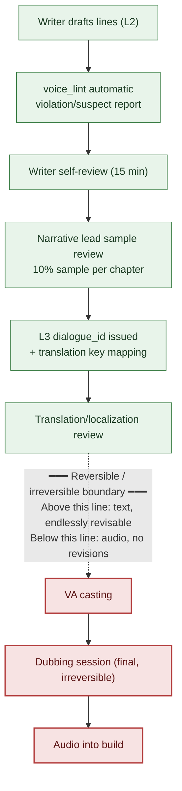

# 5.4 Dialogue and Voice Consistency

A recording booth. The director, headphones on, raises a hand to give the cue. The voice actor reads a line for a scholar NPC: "와, 진짜 대박이네요" — "Wow, that's seriously awesome." The director's hand freezes. This is a character who has not used the interjection "wow" once across 5 chapters — a scholar who never utters profanity or modern slang, who trails off at the end of his sentences rather than finishing them. And yet there the line sits, right in the script.

Two costs land at the same time here. First, if the line gets fixed, the actor has to read it again — and the session fee and the studio clock are already running. Second, and scarier, is the case where the director fails to catch the line at all. Once the recording wraps and the audio goes into the build, that scholar talks that way in the game forever. Recorded audio cannot be rolled back with a one-line edit the way text can. You would need the same actor, in the same condition, in the same booth, all over again.

This chapter is about the dotted line in front of that booth. Above the line everything is text, revisable without limit; below the line everything is audio, beyond fixing. Every dialogue review must finish above that line. For that to happen, "this is how this person talks" has to be recorded in a file rather than in someone's head, and every new batch of dialogue has to be checked against that file automatically. I call the file `voice_profile`, and the checking tool `voice_lint`.

---

## 5.4.1 Where the Voice Starts to Drift

Of all narrative-consistency incidents, character voice drift blows up the most often. Only after launch do the reports arrive: "why did this NPC suddenly change the way they talk?" The cause is nearly the same every time.

When the writer changes, the same NPC becomes a different person. Even when the writer stays, six months later they forget their own tone. Writing new lines without opening the character's previous lines breaks the context. If the voice rules live only in the writer's head and never in a document, they don't transfer to the next person. And then the fifth cause — the one that has grown fastest over the past two years: throw "write some lines for this NPC" at an LLM with no character information, and the AI returns dialogue that is average, inoffensive, and therefore nobody's voice.

That fifth cause is the side effect of adopting AI. Context injection from the previous chapter (5.3) is the prescription, but if the context you inject is thin, there is nothing to inject. That context is the `voice_profile`. This chapter walks one full cycle: build the file, check new dialogue against it automatically, and close everything out before the recording booth.

---

## 5.4.2 voice_profile — A Voice Pinned Down in Five Fields

On Project A, every NPC has a `voice_profile` with five fields: vocabulary range (word groups used often / word groups never used), sentence length (average and maximum character count), forms of address (first and second person, ratio of honorific — formal — speech, titles), emotional expression (direct, indirect, or suppressed), and taboo expressions (words and phrasings never used). All five fields must carry concrete examples. An abstract description like "a grave scholar" alone gets read differently by everyone. The next writer will imagine that scholar their own way.

Here is the actual profile format for the scholar NPC `K_007`. This file is, directly, the input to `voice_lint`.

```markdown
---
title: K_007 Scholar voice_profile
layer: L1
character_id: K_007
atoms:
  - voice_profile_k_007
related:
  derives_from: [character_bible/k_007.md]
  affects: [dialogue_id_table (all K_007 dialogue)]
---

## 1. Vocabulary
- Frequent: "record", "evidence", "circumstances", "inference", "data", "case"
- Never: "feeling", "gut sense", "fate", "God's will", "the heart's voice"

## 2. Sentence Length
- Average: 18 characters
- Maximum: 35 characters (anything longer splits into two sentences)
- Frequent short cutoffs: "...No." "The records first."

## 3. Forms of Address
- First person: the humble "저"
- Second person: title first ("Captain", "Commander"). Name only after closeness.
- Honorific speech 100% (except flashback scenes)
- Interjections almost never. When present: "...ah."

## 4. Emotional Expression
- Almost no direct expression (anger, joy)
- Expressed through silence and trailing off ("...if that is how it is going to be.")
- Grief: dodged by changing the subject ("...let's talk about something else.")

## 5. Taboo Expressions
- All profanity
- Modern interjections "wow", "whoa", "awesome"
- Two or more Sino-Korean terms of 3+ syllables in a single sentence
- Mysticism vocabulary such as "fate" and "prophecy"
```

*(In English, the profile reads: 1. Vocabulary — frequent: "record," "evidence," "circumstances," "inference," "data," "case"; never: "feeling," "gut sense," "fate," "God's will," "the heart's voice." 2. Sentence length — average 18 characters, maximum 35 (anything longer splits into two sentences); frequent short cutoffs like "...No." "The records first." 3. Forms of address — first person: the humble "저"; second person: title first ("Captain," "Commander"), name only after closeness; honorific speech 100% (except flashbacks); interjections almost never, and when present, only "...ah." 4. Emotional expression — almost no direct expression of anger or joy; shown through silence and trailing off ("...if that is how it is going to be."); grief dodged by changing the subject ("...let's talk about something else."). 5. Taboos — all profanity; the modern interjections 와/헐/대박 ("wow"/"whoa"/"awesome"); two or more long Sino-Korean terms in a single sentence; mysticism vocabulary such as "fate" and "prophecy.")*

The heart of this format is that every abstract slot has an example line attached. Not "suppresses emotion" but the actual line `"...그런 식이라면."` — "...if that is how it is going to be." That is what lets the next writer, the translator, and `voice_lint` all look at the same standard.
Viewed again through the eyes of translation and localization, the five fields split into two kinds. **Language-dependent** properties (vocabulary range, sentence length, the surface forms of the address system) must be re-specified for every target language; **language-independent** properties (whether the character suppresses emotion or expresses it directly, what they refuse to say to the very end — attitude) must hold no matter which language the lines move into. Hand this distinction over along with the localization assignment, and you stop a translator from shaking the character's attitude while swapping out surface vocabulary.

---

## 5.4.3 The Worked Transcript: Drawing the Profile from the Lines

Writing 50 NPCs × 5 fields = 250 entries from a blank page drifts into abstraction. With not one actual line on the page, "this character is a cold scholar" tells nobody what that coldness is. So the order is flipped: only the 5–7 main NPCs get full profiles from the start; everyone else waits until 20–30 lines of dialogue have accumulated, and the profile is reverse-extracted from those lines.

Below is the actual worked transcript of pulling a profile draft after 25 lines of `K_007` dialogue had piled up. Nothing is summarized, and the spots where the AI got things wrong are left in.

**[The writer's prompt, in full]**

```
The following are 25 lines of dialogue for character K_007.

1. "Let's start with the records."
2. "...The circumstances don't line up."
3. "It's only an inference. There's no evidence."
4. "I know that case as well."
5. "...No. The data says otherwise."
   (... lines 6~23 quoted in full, no omissions ...)
24. "...If that is how it is going to be, I will step out."
25. "Let's talk about something else."

From these, pull five things: frequently used vocabulary (only what actually appears),
average sentence length, honorific and address patterns, the mode of emotional
expression, and expression ranges never used once. For each item, cite 2~3 numbered
lines as evidence, and do not use subjective impressions like "grave" or "cold".
```

*(The prompt lists K_007's 25 lines in full — "Let's start with the records." / "...The circumstances don't line up." / "It's only an inference. There's no evidence." / "...If that is how it is going to be, I will step out." / "Let's talk about something else." — then asks for five things: frequently used vocabulary (only what actually appears), average sentence length, honorific and address patterns, the mode of emotional expression, and expression ranges that never appear. Each item must cite 2–3 numbered lines as evidence, and subjective impressions like "grave" or "cold" are banned.)*

**[Claude's raw output — not cleaned up]**

```
1. Frequently used vocabulary
   - "record" (line 1), "circumstances" (line 2), "inference/evidence" (line 3),
     "case" (line 4), "data" (line 5)
   → Concentrated on fact-and-evidence nouns.

2. Average sentence length
   - About 14.6 characters across the 25 lines. Longest 21 characters (line 24).
   → Mostly short declaratives.

3. Honorifics and address
   - First person "저" (lines 3, 24). Polite "-습니다/-요" sentence endings.
   - No second-person address appears in these 25 lines.
     → The address pattern cannot be determined from this sample alone. (Writer confirmation needed)

4. Emotional expression
   - No direct emotion words. Refusal handled as "I will step out" (24),
     grief/avoidance handled as the subject change "Let's talk about something else" (25).
   → Suppressed, indirect type.

5. Ranges never used once
   - Interjections, profanity, and mysticism vocabulary: all unobserved.
   ※ But "unobserved" is no guarantee of "taboo".
      The sample is small at 25 lines; the absence may be coincidental.
```

*(The output, in English: 1. frequent vocabulary concentrates on fact-and-evidence nouns — "record," "circumstances," "inference/evidence," "case," "data" — each cited by line number; 2. average length about 14.6 characters across the 25 lines, longest 21 (line 24) — short declaratives; 3. first person "저" with polite "-습니다/-요" endings, but no second-person address appears in these 25 lines — "the address pattern cannot be determined from this sample alone (writer confirmation needed)"; 4. no direct emotion words — refusal handled as "I will step out" (24), grief/avoidance as the subject change "Let's talk about something else" (25) — suppressed and indirect; 5. interjections, profanity, and mysticism vocabulary all unobserved — with the caveat that "unobserved" is no guarantee of "taboo," since 25 lines is a small sample and the absence may be coincidental.)*

Two things deserve a close look here. First, the AI stopped at item 3. It drew its own limit — "cannot be determined from this sample alone." No second-person address appeared in the 25 lines, so it refused to infer one. That is honest output. Had the AI filled in "second person: presumably 'Captain,'" that would be a hallucination, and once inside the profile, contamination. Second, in item 5 the AI attached its own disclaimer. "Unobserved ≠ taboo" is the key warning. The absence of interjections in 25 lines may be pure chance.

**[The writer's verification and veto]**

The writer adopted items 1, 2, and 4. For item 3, the address pattern, the writer opened the character_bible and filled in "title first ('Captain'), name only after closeness" by hand — a human fills the slot the AI left empty. For item 5, exactly as the AI warned, the writer did not promote "unobserved" straight to "taboo." Instead, checking against the character's design, the writer confirmed only "modern interjections, profanity, mysticism" as taboo and put the rest of the unobserved vocabulary on hold.

**[The writer's follow-up request]**

```
I'm confirming "fate" and "prophecy" as taboo. Pull 10 more mysticism words with overlapping meanings.
But since K_007, as a scholar, might quote them in a rebuttal or critique context,
mark that exception case in one line as well.
```

*(The follow-up: "I'm confirming 'fate' and 'prophecy' as taboo. Pull 10 more mysticism words with overlapping meanings. But since K_007, as a scholar, might quote them in a rebuttal or critique context, mark that exception case in one line as well.")*

This last follow-up is the important one. Broaden a taboo mechanically and you also block legitimate lines — the scholar deriding superstition with "fate, of all things." So the exception context is defined together with the taboo. The AI widens the candidates; the writer draws the boundary. Only after this full loop does `voice_profile_k_007` get confirmed and pinned at L1.

Forcing evidence citations ("cite by line number") and banning subjective adjectives ("no 'grave'") cuts AI hallucination and gives the writer a surface to verify. The profile is not something the AI writes — the AI lays down a draft, and the writer pins it.

---

## 5.4.4 voice_lint — Automatic Checks on Every New Line

Once the `voice_profile` exists as a file, every new batch of dialogue can be checked against it automatically. Of the five possible checks, the two that earn their keep in practice are taboo vocabulary matching (does a word hit the taboo list?) and vocabulary range violation (does it fall into the never-used word group?). Sentence-length deviation, missing honorifics, and frequent-vocabulary ratio throw too many false positives, so they run only as auxiliary checks. Flag every flashback line that bends the average length, and the writer goes numb to warnings.

`voice_lint` takes a chapter's batch of new lines and produces a report like this.

```
voice_lint result (ch04 new dialogue: 32 lines, profile=voice_profile_k_007)
─────────────────────────────────────────────
[VIOLATION] dialogue_id_412 — K_007
  Content: "Wow, that's seriously awesome!"
  Reason: taboo words "wow", "awesome" (profile §5)
  → Writer review required

[SUSPECT] dialogue_id_421 — K_007
  Content: "That fate is hard to accept."
  Reason: taboo word area "fate" (profile §5)
        But the 'rebuttal/critique context' exception may apply — writer's call
  → Writer review required

[CLEAN] 30 lines
─────────────────────────────────────────────
Summary: 1 violation / 1 suspect / 30 clean
```

*(The report covers 32 new lines in ch04 against `voice_profile_k_007`. One violation — dialogue_id_412, "Wow, that's seriously awesome!", taboo words 와 and 대박 (profile §5), writer review required. One suspect — dialogue_id_421, "That fate is hard to accept.", touching the taboo word area "fate" (profile §5) but possibly covered by the rebuttal/critique exception — writer's call, writer review required. 30 lines clean. Summary: 1 violation / 1 suspect / 30 clean.)*

Violations are red, suspects are yellow. Both must pass the writer's judgment to get through. And one absolute principle applies here — `voice_lint` never rejects automatically (an extension of the 5.2 principle). Look at `dialogue_id_421` above. "Fate" is taboo, but if the scholar is rebutting a superstition, it can be a legitimate quotation. A tool cannot make that call. An auto-rejecting lint walls off every one of these delicate spots — and robs the writer of the chance to refine the tone on top of it. Lint is a flashlight that marks the suspect spots, not a lock on the door.

---

## 5.4.5 Review Gates — The Dotted Line Between Reversible and Irreversible

The spine of this chapter is this single diagram. As one line of dialogue travels from the writer's hands to the actor's mouth, review gates are laid at every stage. And through the middle of that flow runs a thick dotted line.



Green marks the reversible stages, red the irreversible ones. Everything above the dotted line (green) is text. If a line bothers you, fix it at the keyboard; the cost is a few minutes of the writer's time. Below the line (red) is audio. The moment the actor reads that line in the booth and the audio enters the build, the line is frozen as an asset. To change it you must rebook the same actor, the same condition, the same studio — and the session fee, the studio, and the director's time all cost exactly what they did the first time. On a tight schedule, an additional session with the same actor often cannot be booked at all.

So a single rule governs the entire workflow — **every review gate finishes above the dotted line.** Recording is not a review stage. It is the stage that freezes fully reviewed output into an asset. If a "this line sounds off" doubt surfaces below the line, that is not a place to review further — it is a signal that an upstream review was skipped. The flashlight must sweep everything above the line. The booth is not a place that is allowed to be dark; it is a place that must not be.

In the middle of the diagram, the lead's sample review is pegged at a "10% sample per chapter." That ratio is the balance point between review time and accuracy (the author's operating figure — an unverified estimate). Drop below 5% and incidents start leaking; push above 20% and one lead becomes the bottleneck. Because lint has already filtered out violations and suspects, the sample is drawn from the lines that passed lint — human eyes concentrate on the context errors a tool cannot catch (for example, a "fate" quotation that looks legitimate but is in fact the character breaking).

---

## 5.4.6 Characters Change — Version Control for the Profile

A character who talks the same way to the very end stalls the plot. A scholar who has lived through a comrade's death and still speaks in exactly the pre-loss tone reads as fake. When the change is intended, the `voice_profile` versions up along with it.

```markdown
---
character_id: K_007
voice_profile_versions:
  - v1: ch01~ch05 (early — suppressed emotion, short-sentence scholar)
  - v2: ch06~ch10 (after a comrade's death — emotional expression more frequent)
  - v3: ch11~ (after the awakening — direct speech appears)
---
```

*(The versions: v1, ch01–ch05 — the early suppressed-emotion, short-sentence scholar; v2, ch06–ch10 — emotional expression grows more frequent after a comrade's death; v3, from ch11 — direct speech appears after the awakening.)*

Each version is a separate profile file, and `voice_lint` reads the chapter number of the dialogue under inspection to choose which version to apply. Hold ch07 dialogue up against v1's "suppressed emotion" rule and every perfectly sound change line lights up as a suspect. Change is not a bug; it is design.

Three signals raise a version. When the writer shakes the tone deliberately, they propose a new version and align with the lead. When `voice_lint`'s suspect count keeps climbing for one character, the writer is shifting the tone without noticing — a signal that the version update is due. When a change event (death, awakening, betrayal) is added to the character_bible, a profile-update alert fires. That said, a character who changes every chapter loses coherence, so a realistic count is 2–4 versions per character.

> **[Directional signpost — reading the space between characters as a voice space (still premature)]** Where `voice_lint` uses rules to protect consistency *within* one character, a "voice space" — embedding each character's full set of spoken lines as a single point — looks at whether the distance *between* characters stays wide enough. If the points drift into a cluster, that is a direct measurement of the voice flattening and convergence that §5.3.1 and §5.4.1 pointed to. But do not fix the distance threshold as an absolute number; read it only as a directional signpost that says "clustering is underway," and it is not a verdict gate that replaces `voice_lint` (the idea sits in the same spot as the dimensional-vector compression of §8.2.7, and the conceptual intuition is laid out as a single map in Appendix M — a signpost, not a prescription).

---

## 5.4.7 Consistency Units That Multiply with Localization and VA

Once dialogue is translated into multiple languages and voiced by actors, the units under management multiply. One Korean line splits into English and Southeast Asian languages, and each of those carries its own tone.

The most frequent leak in translation consistency is the same expression being translated differently from chapter to chapter (caught by a translation-memory consistency check). After that come the character's `voice_profile` not being reflected in the translation (fix: attach a per-character translation guide) and new vocabulary missing from the glossary (fix: a glossary lint). The translation guide is generated automatically from the `voice_profile` — "this character: 100% formal speech, no interjections, mysticism vocabulary taboo" is stamped onto the head of the translation brief. The translator carrying that scholar into English sees the same boundaries.

VA (voice actor) review is the review at the last text-reversible stage, just before the work touches what lies below the dotted line. Tone consistency (the intensity of anger and grief) is checked by the director and narrative; pronunciation accuracy (proper nouns) by the glossary owner; breathing and breaks (profile instructions like "frequent short cutoffs") by the director. Results are logged pass/reject in `voice_review_log.md` (L4) and consulted at the next character's casting.

Rejections are settled, wherever possible, before casting and recording. A script error discovered inside the booth collapses that day's session outright and shakes the schedule of the next one. That does not make dragging out review while postponing the recording the answer, either. If reviews keep jamming right in front of the booth, the upstream workflow (writer, lead) is what is running late — not the recording schedule.

---

## 5.4.8 Six Months of Measurement and Cost

On Project A, I tracked six months before and after introducing `voice_profile` + `voice_lint`. The absolute counts are the author's estimates (unverified); trust only the direction and the ratios.

| Item | Before | After | Direction |
|---|---|---|---|
| Voice incidents per chapter (post-launch) | 5–8 | 1–2 | about 1/4 |
| Chapters for a new NPC's voice to settle | 3 chapters | 1 chapter | 1/3 |
| NPCs managed per writer | about 15 | about 40 | about 2.5x |
| Translation consistency incidents (per chapter) | 10–15 | 2–4 | about 1/4 |
| Voice review time (per chapter) | 3 days | 1 day | 1/3 |

The most meaningful row is NPCs managed per writer. "About 2.5x" does not mean writers were cut; it means the same writer can carry more NPC variety per chapter. The world gets more crowded.

Looking at the cost structure, operating cost is far smaller than adoption cost. Writing the `voice_profile`s took the writer 2 weeks for the 7 mains; the `voice_lint` tool took 1–2 weeks of development and 1 day a month of maintenance. On the operating side: 15 minutes of writer self-review per chapter, about 2 hours of lead sample review (the 10% sample), and 1–2 days per character for profile updates in change chapters. Operating cost has to stay small for a system to survive. A tool that is heavy to operate gets quietly retired within a quarter.

---

## 5.4.9 Common Failures

| Pattern | Prescription |
|---|---|
| Profile holds only abstract description ("grave") | Force actual example lines in all 5 fields |
| Aiming to write all 50 NPCs in full from the start | 7 mains in full + reverse-extract the rest from accumulated lines |
| Auto-rejecting voice_lint | Violation/suspect flags + writer judgment. Only a human rejects |
| Broadening taboos mechanically | Record the exception context with each taboo ("quotable in rebuttal") |
| Profile not updated when the character changes | Version it (v1, v2, v3); apply by chapter number |
| Profile not handed to translation | Auto-generate the translation guide from the profile |
| Trying to fix dialogue after recording | Recording is irreversible. Reviews end above the dotted line |
| Compressing review into the recording schedule | Solve it by improving the upstream workflow |
| Keeping the profile in your head | File it, no exceptions. Heads are lost when writers change |

---

## Try It Yourself — One voice_lint Cycle

This is the minimum procedure for one full pass with a single profile when a new chapter's dialogue comes in.

**setup**
1. Open the target character's `voice_profile_<id>.md`. If it doesn't exist, gather 20–30 of the character's existing lines.
2. Prepare the new lines as a plain-text batch in `id / 캐릭터 / 내용` (id / character / content) format.

**prompt**

```
This is §5 (taboo expressions) of K_007's voice_profile.
[paste the taboo list]

32 new lines of ch04 dialogue.
[paste in id / content format]

Classify each line as [VIOLATION] (directly contains a taboo word) / [SUSPECT] (touches a
taboo area, but an exception context is possible) / [CLEAN]. Table the violations and
suspects with id, content, and reason. I make the call, so don't reject anything automatically.
```

*(The prompt pastes the §5 taboo list from K_007's voice_profile and ch04's 32 new lines, then asks the AI to classify each line as [위반] violation (directly contains a taboo word) / [의심] suspect (touches a taboo area, but an exception context is possible) / [정상] clean — violations and suspects tabled with id, content, and reason — and ends with "I make the call, so don't reject anything automatically.")*

**verify**
1. Look at the violations ([위반]) first. If one is clear-cut, fix the text (it is above the dotted line, so it's free).
2. Judge the suspects ([의심]) by context. A legitimate quotation passes; anything else gets fixed.
3. Send 10% of the passing lines to your lead as a sample to filter context errors once more.
4. Only after every judgment is in, issue dialogue_ids and push to the recording queue. No further checking in front of the booth.

**Solo Scale-Down** — If you're a solo developer who can't build the tool, write only one field of the `voice_profile` per character: §5 (taboo expressions). Every time you write new lines, paste that taboo list at the head of your prompt and tell the AI, "flag only the lines that hit this list." No tool, one line of prompt, and you get 80% of what lint gives you. Run this single pass before handing off to recording (or TTS), and the dotted line in front of the booth holds.

---

### Key Takeaways
- Of the five causes of voice drift, AI flattening has grown the fastest, and the prescription is not flimsy context but a voice_profile loaded with examples.
- voice_lint only flags violations and suspects — rejection belongs to a human — and every taboo is defined together with its exception context.
- All review ends above the dotted line in front of the recording booth — audio below the line cannot be rolled back the way text can.

### Next Chapter Preview
- 6.1. Procedural Content Generation and AI — Where They Meet
