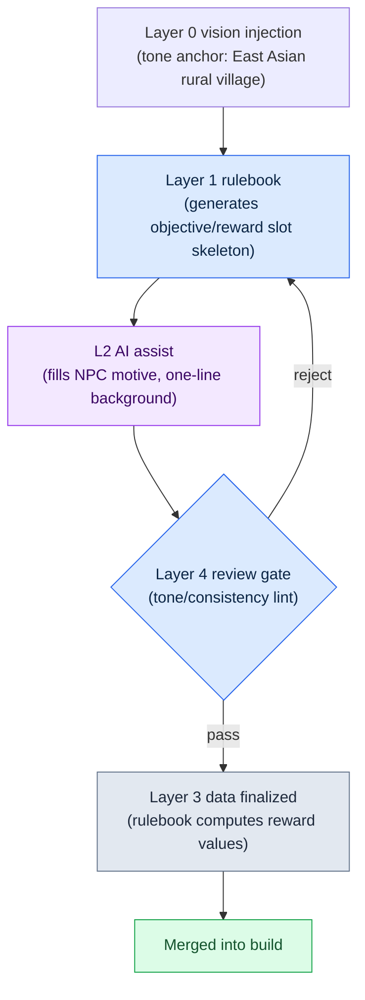

# 6.1 Procedural Content Generation and AI — The One Cell Where the Two Axes Cross

Monday morning, design meeting. A single line on the whiteboard: "1,000 side quests by launch." Someone starts tapping a calculator. One writer spending a day per quest: four years. Put five writers on it and it is still close to a year. The air in the room goes heavy. I have been sitting in this room for 24 years, and I know that in front of that number, people always split into the same two camps. One side says "cut the volume"; the other says "stamp them out with tools." And almost always, the decision was both.

Procedural content generation (PCG) is the old answer on the "stamp them out with tools" side. Dungeon room layouts, weapon option combinations, and enemy spawn pools have been automated with rulebooks and probability tables for twenty years. What is new is not PCG itself — it is that large language models (LLMs) and generative models have taken the seats where natural language, images, and narrative go.

But what this book wants to say is not "attach AI to PCG." Everyone does that. The question is *where* you attach it. Take one piece of content: unless you pin down, in a single cell, which intensity of automation and which layer of structure it meets at, you end up with a tool that has no seat. This chapter shows how to draw that cell as a coordinate, and what it looks like when one piece of content actually makes a full lap around the pipeline on that cell.

---

## 6.1.1 Where PCG Stood Still

Traditional PCG is strong at determinism. The same input produces the same output, and you can verify it. That is why dungeon room graphs, weapon option prefixes and suffixes, and enemy spawn distributions settled in early. "Flaming Sword +5" was coming out automatically twenty years ago.

The problem was always the seat right next to it. The rooms got placed, but the names, looks, and short backstories of the NPCs inside them stayed in writers' hands. "Flaming Sword +5" came out, but the one-line hook — "the last sword the king lost" — did not. A quest generator could draw combinations of objectives and rewards, but "why am I doing this quest" was still written by a person.

On large games, this seat was always the bottleneck. The ratio of mass-producible work to work that needed human hands was roughly 4 to 6, and that 6 ate most of the schedule. Even when the production line cranked out the 4 quickly, if the 6 could not keep up, the whole cycle was capped at that speed.

That is exactly where LLMs and image models come in. The mass-producible range extends into the natural-language, narrative, and visual territory that rulebooks could never handle. That does not mean handing the seat over to AI wholesale. AI gives a slightly different answer every time, and when the context is empty, it spits out the generic-RPG average. So you need to design the *junction point*. And the junction point is defined by two coordinate axes.

---

## 6.1.2 The First Axis: Automation Intensity (L0–L3)

The vertical axis is *the ratio in which you mix* humans, rulebooks, and AI. At the MMORPG studio where I work (hereafter "Project A"), we cut it into four levels.

**L0 — fully handcrafted.** Every word and every decision comes from human hands. Main quest text, signature character dialogue, branching endings. The seats where consistency and narrative depth tie directly into the game's identity.

**L1 — rulebook automation.** Traditional PCG's seat. Deterministic algorithms — rulebooks, probability tables, BSP (binary space partitioning) — produce the output, and humans only review it. Dungeon room layout, weapon option combinations, and enemy spawns are the representatives.

**L2 — rulebook + AI assist.** The rulebook sets the skeleton and AI fills in the details. Side quest synopses, common-NPC names and short backstories, hunting-ground blurbs. Humans are responsible only for the input metadata and the final review gate.

**L3 — AI first + human review.** AI writes the body and humans step in only to review. Attractive, but non-determinism, hallucination, and the risk of consistency damage all gather here.

The key is L2. It combines L1's stability with L3's production power, and blocks the weaknesses of both with a verification gate — a quality gate where a human or an automated checker verifies the output before it moves on. L3 is the level everyone is tempted to adopt early, but I have watched it get scrapped within a quarter or two, more than once, as the review load explodes. When 70 out of 100 items come back flagged as suspect, it costs more than having a person write all 100 from scratch.

---

## 6.1.3 The Second Axis: Layer Structure (L0–L4)

The vertical axis alone will not make a production line run. The content *itself* has to be decomposed into layers before automation has a seat to take. This is the Layer decomposition covered in Part 5, and in the content domain it is the horizontal axis. The general explanation — that the five layers each correspond to one role in procedural generation (anchor, rulebook, body, numbers, gate) — was covered in §2.3.6; here I plug it straight into the content production line. Layer 0 vision is the tone and worldview anchor (injected on every generation); Layer 1 systems is the generation rulebook (rules, probability tables, tag taxonomy); Layer 2 content is the body where generated output accumulates (side quests, NPC backstories, city blurbs); Layer 3 data is numbers, IDs, and relations (rewards, spawns, curves); and Layer 4 build/QA is the verification gate (lint, consistency checks, writer review).

These two axes tell different stories. The vertical axis says "how much do humans touch this"; the horizontal axis says "which part of the content is this." But they only carry meaning as a product. Only when you pin a piece of content to the intersection of the two axes — to *one cell* — does "who makes this, which part, and how" actually get decided.

---

## 6.1.4 The Two Axes on One Page — The Automation × Layer Matrix

Now I overlay the two axes I have been describing in prose onto a single grid. Horizontal: the content's Layer. Vertical: automation intensity. The label in each cell is the content that actually occupies that cell on Project A. The darker the cell, the closer it sits to the production line's center of gravity.

<svg viewBox="0 0 760 440" xmlns="http://www.w3.org/2000/svg" font-family="sans-serif" font-size="12">
  <rect x="0" y="0" width="760" height="440" fill="#ffffff"/>
  <!-- Axis titles -->
  <text x="380" y="22" text-anchor="middle" font-size="14" font-weight="bold">Automation intensity (vertical) × Layer structure (horizontal)</text>
  <text x="380" y="416" text-anchor="middle" font-weight="bold">→ Layer structure (which part of the content is this)</text>
  <text x="18" y="220" text-anchor="middle" font-weight="bold" transform="rotate(-90 18 220)">↑ Automation intensity (how much humans touch it)</text>
  <!-- Column headers -->
  <g text-anchor="middle" font-size="11" font-weight="bold">
    <text x="190" y="52">L0 Vision</text>
    <text x="310" y="52">L1 Systems (rulebook)</text>
    <text x="430" y="52">L2 Content (body)</text>
    <text x="550" y="52">L3 Data</text>
    <text x="670" y="52">L4 Build/QA</text>
  </g>
  <!-- Row headers -->
  <g text-anchor="end" font-size="11" font-weight="bold">
    <text x="124" y="92">L0 Handcrafted</text>
    <text x="124" y="172">L1 Rulebook</text>
    <text x="124" y="252">L2 Rulebook+AI</text>
    <text x="124" y="332">L3 AI-first</text>
  </g>
  <!-- Grid cells: x=130..730 (5 cols, 120 wide) y=60..380 (4 rows, 80 high) -->
  <!-- Row L0 handcrafted -->
  <rect x="130" y="60" width="120" height="80" fill="#dfe7f3" stroke="#7a93c0"/>
  <text x="190" y="104" text-anchor="middle" font-size="10">Tone line written by hand</text>
  <rect x="250" y="60" width="120" height="80" fill="#f4f6fa" stroke="#c8c8c8"/>
  <rect x="370" y="60" width="120" height="80" fill="#eef1f6" stroke="#c8c8c8"/>
  <text x="430" y="98" text-anchor="middle" font-size="10">Main quests</text>
  <text x="430" y="112" text-anchor="middle" font-size="10">Signature dialogue</text>
  <rect x="490" y="60" width="120" height="80" fill="#f4f6fa" stroke="#c8c8c8"/>
  <rect x="610" y="60" width="120" height="80" fill="#f4f6fa" stroke="#c8c8c8"/>
  <!-- Row L1 rulebook -->
  <rect x="130" y="140" width="120" height="80" fill="#f4f6fa" stroke="#c8c8c8"/>
  <rect x="250" y="140" width="120" height="80" fill="#b9cae6" stroke="#5b78ad"/>
  <text x="310" y="178" text-anchor="middle" font-size="10">Dungeon room layout</text>
  <text x="310" y="192" text-anchor="middle" font-size="10">Option/spawn odds tables</text>
  <rect x="370" y="140" width="120" height="80" fill="#f4f6fa" stroke="#c8c8c8"/>
  <rect x="490" y="140" width="120" height="80" fill="#eef1f6" stroke="#c8c8c8"/>
  <text x="550" y="184" text-anchor="middle" font-size="10">Reward curve computation</text>
  <rect x="610" y="140" width="120" height="80" fill="#f4f6fa" stroke="#c8c8c8"/>
  <!-- Row L2 rulebook+AI (center of gravity) -->
  <rect x="130" y="220" width="120" height="80" fill="#f4f6fa" stroke="#c8c8c8"/>
  <rect x="250" y="220" width="120" height="80" fill="#eef1f6" stroke="#c8c8c8"/>
  <text x="310" y="264" text-anchor="middle" font-size="10">Define generation rulebook</text>
  <rect x="370" y="220" width="120" height="80" fill="#7fa0d4" stroke="#385583"/>
  <text x="430" y="258" text-anchor="middle" font-size="10" font-weight="bold" fill="#ffffff">Side quest skeleton</text>
  <text x="430" y="274" text-anchor="middle" font-size="10" fill="#ffffff">NPC short backstory/blurb</text>
  <text x="430" y="289" text-anchor="middle" font-size="9" fill="#ffffff">★ Center of gravity</text>
  <rect x="490" y="220" width="120" height="80" fill="#f4f6fa" stroke="#c8c8c8"/>
  <rect x="610" y="220" width="120" height="80" fill="#eef1f6" stroke="#c8c8c8"/>
  <text x="670" y="264" text-anchor="middle" font-size="10">lint/consistency checks</text>
  <!-- Row L3 AI-first -->
  <rect x="130" y="300" width="120" height="80" fill="#f4f6fa" stroke="#c8c8c8"/>
  <rect x="250" y="300" width="120" height="80" fill="#f4f6fa" stroke="#c8c8c8"/>
  <rect x="370" y="300" width="120" height="80" fill="#e6ddec" stroke="#a98ec0"/>
  <text x="430" y="344" text-anchor="middle" font-size="10">Patch note drafts</text>
  <rect x="490" y="300" width="120" height="80" fill="#f4f6fa" stroke="#c8c8c8"/>
  <rect x="610" y="300" width="120" height="80" fill="#eef1f6" stroke="#c8c8c8"/>
  <text x="670" y="344" text-anchor="middle" font-size="10">Writer review gate</text>
</svg>

This grid is the heart of this chapter. Judgments that used to be scattered through prose — "main quests are L0," "side quests are L2," "rewards belong to the rulebook" — converge into *one coordinate*. When a new piece of content comes up in a meeting, one question is enough: "which cell is this?" Once the cell is fixed, its vertical coordinate tells you who touches it, and its horizontal coordinate tells you which part it is.

Read the grid for a while and two things stand out. First, the center of gravity (the dark cell) sits at the L2 row × Layer 2 column. Side quest skeletons and NPC backstories live there. That is the heart of the production line. Second, a piece of content does not live in only one cell. A side quest's body (Layer 2) sits in the L2 cell, but its reward values (Layer 3) drop down to the L1 cell. Even within the same quest, *different parts live in different cells*. That is why the two axes are kept separate.

---

## 6.1.5 A Mini Pipeline Running on a Single Cell

Now watch one piece of content make an actual lap on the center-of-gravity cell — L2 row × Layer 2 column, the side quest skeleton. The flow looks like this.



Let me walk this flow once as a worked transcript. Say we are making one odd-job quest for a rural village.

**Step 1 — the Layer 1 rulebook draws the skeleton.** The rulebook is deterministic. It comes out with nothing but the slots filled.

```
[Quest skeleton — rulebook output]
Region: 향촌_3
Requester role: herbalist
Objective type: collect (medicinal herbs x6)
Obstacle: wolf spawn (night)
Reward slot: { gold: ?, exp: ?, item: gathering sickle }
```

**Step 2 — ask the AI for the details.** Here is the full prompt. (The Layer 0 vision is fed in first, as context.)

> You are a quest writer for an MMORPG set in an East Asian fantasy rural village. Tone anchor: "humble countryside, with superstition and fear underneath." Take the skeleton below and write a one-line motive for the requester, an NPC name, and the two-sentence request shown to the player. Never make up reward values (the system decides them). Output JSON.
> Skeleton: { region: 향촌_3, requester: herbalist, objective: collect 6 medicinal herbs, obstacle: wolves at night, reward item: gathering sickle }

**Step 3 — Claude's raw output.** (Reproduced as-is, not summarized.)

```json
{
  "npc_name": "삼월 어멈",
  "motive": "With wolves howling every night her herb patch is being ruined, and she cannot bring herself to go dig up the last of the herbs.",
  "quest_text": "When night falls, the wolves tear up my herb patch. I am too frightened to set foot out there, so please dig up just six roots of medicinal herb at the foot of the mountain in my stead.",
  "reward": { "gold": 120, "exp": 300 }
}
```

Stop here for a moment. The AI added a `reward` field *without being asked to*. This is a live demonstration of why the first and second axes have to stay separate. Reward values (Layer 3) are the L1 rulebook's seat, not the AI's (L2). Hand them to the AI and the numbers wobble on every call, and the reward curve collapses.

**Step 4 — human verification and veto.** The reviewer does two things. (1) *Deletes* the `reward` field — that is a cell for the rulebook to fill. (2) Checks the tone. The NPC name "삼월 어멈" (Granny Samwol), the one-line motive — wolves wreck her herb patch every night, so she cannot bring herself to go dig the last herbs — and the two-sentence player-facing request all fit the rural-village tone. Pass. If the AI had inserted an out-of-setting phrase like "a commission from the mages' guild," it would be rejected here and sent back to the skeleton stage.

**Step 5 — Layer 3 data finalized.** The rulebook refills the deleted reward slot. It is a deterministic formula tied to region level and objective difficulty. `gold: 85, exp: 240`. Not the 120 and 300 the AI emitted arbitrarily — values that sit on the curve.

This one lap is the standard cycle of the center-of-gravity cell. Rulebook for the skeleton, AI for the flesh, a human for the gate, and the rulebook again for the numbers. All 1,000 pieces of content run this same cycle. Because the cell is fixed, nobody re-litigates "who makes this" every time.

---

## 6.1.6 Five Questions for Choosing a Cell

Five questions help decide which cell of the grid a new piece of content belongs in. Write them down and answer them together every time a mass-production item comes up in a meeting, and cell placement becomes consistent within a quarter.

One: how heavy is the production load? How many do you need by launch? If N is over 100, the L0 row is close to impossible.

Two: how strong is the consistency requirement? If cross-content consistency is the core of the experience, the review gate (Layer 4) has to be strong; if variety is the core, there is room to climb to a higher automation row.

Three: can you tolerate non-determinism? Is this a domain where a slightly different result every time creates richness, or one where the same result is the core of trust?

Four: what does review cost? Whether it is 5 minutes or 30 minutes per piece sets the length of the operating cycle.

Five: what does an incident cost? Can you freely scrap and rewrite, or does one slip ship straight into a player-facing incident?

Throw these five at side quests and the answers converge in one direction: more than 1,000 needed (L0 impossible), consistency requirement lower than main quests, non-determinism acceptable, review 5–10 minutes, incident cost low (each one can be scrapped individually). With all five pointing the same way, the L2 row × Layer 2 cell is the natural fit. Throw the same five at main quests and they converge the opposite way: 50 quests, the highest demands on consistency and narrative depth, non-determinism unacceptable, review cost high, incident cost very high — that is the L0 cell.

---

## 6.1.7 Four Common Pitfalls

Even with the grid drawn, teams fall into the same traps. Four of them repeat.

First, **starting from the L3 row.** Set out with the expectation that "AI will just handle all 100" and review explodes. Settle the L1 cell first, climb to L2, and apply L3 carefully, to a small subset only. In the mini pipeline above, the single motion of a human deleting the reward field is a small demonstration of why the L3 row is dangerous.

Second, **delegating to AI wholesale, with no rulebook.** "Make me 100 side quests" summons the generic-RPG average. Only when the Layer 1 rulebook sets the skeleton first and the AI fills in the flesh on top of it do you get *your* game's content. Writing a rulebook is the most laborious and least fun job in PCG, but skip it and everything mass-produced above it sinks down to the average.

Third, **an empty review gate (Layer 4).** When AI output flows into the build automatically, consistency incidents follow directly. Whatever the cell, a human gate is mandatory.

Fourth, **choosing tools on cost alone.** LLM API prices drop every quarter; the cost of a consistency incident does not. A tool decision should weigh API cost plus the combined cost of consistency and review time.

---

## 6.1.8 Measurement — Six Months After Moving to the Center-of-Gravity Cell

On Project A, we moved side quests from the L0 cell to the L2 cell and measured the six months that followed. In the numbers below, the absolute values are the author's estimate (unverified); what was observed in actual measurement is the direction and ratio of the change.

| Item | L0 period | After the L2 move |
|---|---|---|
| One quest per writer | \~4 hours | \~50 minutes (30 min metadata + 5 min AI + 8 min review) |
| Weekly output | 5 | 30–40 |
| Scrap rate | nearly 0% | \~20% |
| Consistency incidents (per quarter) | 3–5 | 5–8 (normal after reinforcement) |
| Writer satisfaction (out of 10) | 8 | 6 → 7 (after the policy fix) |

The scrap rate rose to 20%, but with production speed at 6–8x, net throughput grew 4–5x. Consistency incidents rose slightly, to 5–8 per quarter, but with the review gate and the rulebook reinforced, they returned to the normal range within the quarter.

The biggest change was not in the numbers but in the people. At first the writers said they felt like "reviewers on an assembly line," and satisfaction dropped from 8 to 6. To recover it, we added a policy that explicitly guarantees writer time on main quests and on signature side quests (1–2 per city). We pinned it down so that the production line would not be a thing that sucks up writer time, but a tool that sends that time back to the main content. Six months later, satisfaction was back at 7.

One thing to take from this measurement: a decision to move cells has to carry throughput, writer-time allocation, and satisfaction together. Watch throughput alone and the production numbers succeed — and the people leave.

---

## 6.1.9 Layer Decomposition First, PCG on Top

The general thesis — that Layer decomposition is the precondition for procedural generation — is in §2.3.6. Here I only look at how it shows up on the PCG grid. On a team where the horizontal axis (Layer 0–4) is blurry, no cell runs stably. If nobody knows where the Layer 0 vision lives, every generator runs with an empty tone anchor and produces the generic-RPG average. If the Layer 1 rulebook and the Layer 2 body are mixed in one file, fixing one line of a rule means touching dozens of places in the body at the same time. If Layer 3 data is typed into the body, one reward-curve adjustment costs a writer a week — this is why the mini pipeline above keeps rewards in a separate slot.

So what to check before adopting PCG is not tool choice but *whether the horizontal axis is decomposed*. On a team with the five layers in place, attaching an L1 generator costs one writer one quarter. On a team where the five layers are tangled, the same adoption gets scrapped within two quarters on consistency incidents.

The five layers do not need to be perfect from day one. Separate gradually, keep the interfaces narrow. In the first quarter, splitting off just one Layer 0 tone line and one Layer 1 rulebook opens a seat for a generator to come in. That is not license to postpone forever, though. If the Layer 2 body and the Layer 3 data stay one lump to the end, even the concrete tool of the next chapter will have nowhere to sit.

---

## 6.1.10 Next Chapter Preview

The next chapter dissects one concrete tool that occupies the grid's center-of-gravity cell: `proj_city_hunting_generator`, which mass-produces per-city hunting grounds. We will see how input metadata, the rulebook skeleton, the AI body, and the verification gate are tied into a single cycle — and how this chapter's mini pipeline scales up to the size of a real tool.

---

### Key Takeaways
- Automation intensity (vertical, L0–L3) and Layer structure (horizontal, 0–4) only carry meaning as a product.
- The production line's center of gravity is the L2 row × Layer 2 cell: the side quest skeleton.
- Horizontal decomposition comes first; PCG only runs on a single cell on top of it.

---

## Try It Yourself — Putting One Piece of Content on One Cell

**setup.** Pick one candidate for mass production (for example, side quests). Split the Layer 0 tone line and the Layer 1 rulebook skeleton (slot definitions) into separate files. Leave the reward-value slot empty on the rulebook side.

**prompt.** Feed the vision in as context, then give the skeleton, and state explicitly: "do not make up reward values; output JSON." You can adapt the Step 2 prompt above as-is.

**verify.** Check three things. (1) If the AI inserted a reward field on its own, delete it (L3 is the rulebook's seat). (2) If there are out-of-setting words, reject back to the skeleton stage. (3) Only for what passes, let the rulebook fill in the reward values and put it in the build.

**Solo Scale-Down.** You do not need a team. Write one rulebook (five slots) and one tone line yourself, as plain text files. Run ten quests through the cycle above and count how many you reject in review. If the rejection rate goes past 30%, the cell is wrong — tighten the rulebook skeleton, or drop one row down (L1) and look again. When the rejection rate stabilizes, that is the signal that the cell works at your scale.
