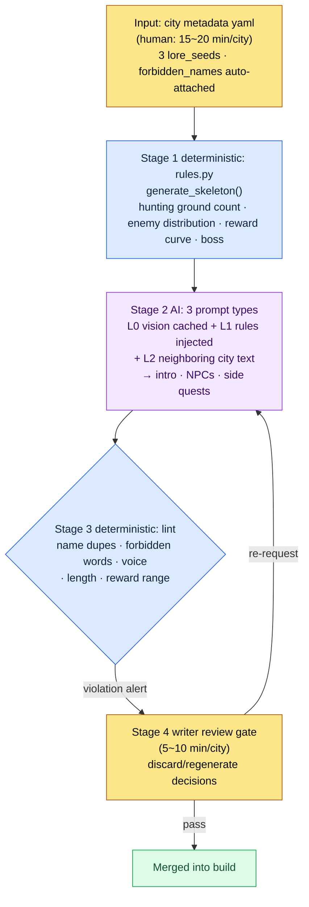

# 6.2 city_hunting_generator — 30 Cities in 4 Weeks

> Primary readers: MMORPG designers responsible for content production at scale (mid-size team, 10–50 people)
> Scaled-down version for solo/hobbyist readers: §6.2.10, "If You're Solo, Just This Much"

I still remember the math I did the day the schedule first landed on my desk: 30 cities needed by launch. One city consists of a 5–10 line introduction, 3–5 hunting grounds, 5–10 NPCs and 2–3 side quests per hunting ground, 1–3 specialty items, and 1 city boss. Crafting one city by hand takes 1–2 weeks. At 30 cities, that is a single writer spending 6 solid months on nothing but cities.

We did not have those 6 months. The writers' time was tied up in the main quest and the signature characters, and the 30 cities had to be built in parallel with that work. My first impulse — "why not just ask the AI to make 30 cities?" — collapsed quickly. Hand over the whole job and you get 30 fantasy towns that all look alike. Instead of that impulse, I built a tool, `city_hunting_generator`. This chapter looks at how it ties input, rulebook, AI, and verification into a single cycle — and what actually comes out, and what gets discarded, when you run that cycle all the way through once.

> **Author's operational note**
> The `city_hunting_generator` in this chapter is an anonymized version of a real tool I run in the company R&D folder. The file names, code structure, and verification items faithfully follow the real tool; city names (silvermark and so on) and company-specific names were replaced for the book. The output text is a reconstruction of actual sessions.

---

## 6.2.1 Humans Handle Only the Metadata and the Final Review

The tool runs in four stages. The key point: stages 1 and 3 are deterministic (the rulebook), and only stage 2 is AI. With the rulebook holding both the skeleton and the verification in place, the AI sandwiched in the middle can give slightly different answers every time without shaking cross-city consistency. Humans enter only at the first input (metadata) and the final gate (review).



In this diagram, human hands touch only two places: at the top, where one clean page of metadata goes in, and at the bottom, where the tone and narrative judgments lint cannot catch are made. The tedious skeleton generation and bulk text production in between are run by the rulebook and the AI. The decisive design choice is that even when lint (stage 3) finds a violation, it does not auto-discard — it only raises an alert to the writer gate (stage 4). The reason is in §6.2.5.

---

## 6.2.2 Input — One Page of City Metadata

The writer writes one page of metadata per city. It takes 15–20 minutes. Short, but this one page is the entire input for the next three stages.

```yaml
# city_021_silvermark.meta.yaml
city_id: city_021_silvermark
region: west
climate: cold_arid
dominant_faction: scholar_guild
cultural_tone: scholarly_strict
level_range: [25, 30]
lore_seeds:
  - Was the center of a magic seal 100 years ago
  - The first sign of the seal weakening was observed in this city
  - Site of the scholar guild headquarters
neighbors: [city_018, city_023]
# forbidden_names: (auto-attached by script — no writer input needed)
```

(The three lore_seeds read: "was the center of a magic seal 100 years ago," "the first sign of the seal weakening was observed in this city," "site of the scholar guild headquarters." The final comment notes that `forbidden_names` is attached automatically by a script — no writer input needed.)

The most important slot is `lore_seeds`. 3–5 key events anchor the city's identity. Too few and the AI spits out a generic fantasy city; too many and the events contradict each other. In my experience, 3 was the most stable.

`forbidden_names` is not filled in by the writer. A script reads the list of existing city and character names and attaches it to the metadata automatically. Once 30 cities × roughly 50 NPCs each pile up, checking 1,500 names for duplicates in your head is impossible. There is no need to hand-write "make sure it doesn't overlap with other cities' NPCs" every single time.

---

## 6.2.3 Stage 1, the Rulebook — Building the Skeleton Deterministically

The rulebook takes the metadata and builds the city's structural skeleton. The code is simple.

```python
# city_hunting_generator/rules.py (skeleton)
def generate_skeleton(meta):
    region_rules = REGION_RULES[meta.region]
    hg_count = region_rules.hunting_grounds_range.sample()
    enemy_dist = ENEMY_RULES[meta.climate][meta.dominant_faction]

    skeleton = {
        "hunting_grounds": [
            {
                "id": f"{meta.city_id}_hg_{i}",
                "level": meta.level_range[0] + i,
                "enemy_types": enemy_dist.sample(k=3),
                "reward_curve": calc_reward(meta.level_range[0] + i),
                "npc_count": region_rules.npc_per_hg,
                "sidequest_count": region_rules.sidequest_per_hg,
            }
            for i in range(hg_count)
        ],
        "boss": {
            "id": f"{meta.city_id}_boss",
            "level": meta.level_range[1] + 2,
            "pattern": BOSS_PATTERNS[meta.region],
        },
    }
    return skeleton
```

The result is deterministic. Same metadata in, same skeleton out. Whether the reward curve sits within the standard range for each region and level, and whether the enemy distribution matches the climate and faction rules, is guaranteed in code and covered by regression tests. This stage is never handed to the AI. If the AI pulled a different reward number on every call, cross-city balance would wobble on the spot.

Feed in silvermark's metadata and `rules.py` returns an empty skeleton: 4 hunting grounds (`city_021_silvermark_hg_0` through `hg_3`), 6 NPC slots and 3 side quest slots per hunting ground, and 1 boss at level 32. It is a table of cells to fill — no names, no text yet. Filling those cells is the job of stage 2, the AI.

---

## 6.2.4 Stage 2, the AI — Generating Natural-Language Text

After the rulebook builds the skeleton, the AI fills in natural-language text on top of it. This is where the city introduction, the NPC names, appearances, and short backstories, the side quest synopses, and the specialty item flavor text come from.

The call pattern follows the four-layer context injection structure exactly. Cache the L0 vision (world_premise + tone_manifesto), selectively inject the L1 rules (city_naming_rule + region_west_lore), add the L2 adjacent text (NPC name lists from other cities), and attach the task instruction at the end. The city introduction prompt is in a form you can copy and use as is.

```
[L0 context] world_premise + narrative_pillar + tone_manifesto  (cached)
[L1 context] city_naming_rule, region_west_lore
[Input] city_021_silvermark.meta.yaml + 3 lore_seeds

Write a 6~8 line introduction for this city. Weave all three lore_seeds in naturally,
and cut RPG stock phrases like "a peaceful village." Keep the tone scholarly and strict, sentiment restrained.
Output the text only, no preamble or commentary.
```

(The instruction, in brief: write a 6–8 line introduction for this city; weave all three lore_seeds in naturally; cut RPG stock phrases like "a peaceful village"; keep the tone scholarly and strict, sentiment restrained; output the text only, no preamble or commentary.)

The same pattern repeats as is for the NPC batch and the side quest calls. Only the context and the output format differ. The NPC call carries the `forbidden_names` slot (no duplicating NPC names from other cities); the side quest call carries the constraint "pick the quest-giving NPC from the NPCs generated above."

So what actually comes out? Let's run it through once, end to end.

---

## 6.2.5 One Cycle, All the Way Through — Output, Verification, Discard

Writing only the abstraction "the AI fills in the text" tells you nothing about what this tool actually spits out. Let's follow one full cycle for the city of silvermark, from input to discard.

> **[Stage 2 AI output — city introduction] (reconstructed from an actual session)**
>
> Silvermark is a city of the seal. 100 years ago, seven scholars raised a sealing circle beneath this ground to hold back the flood of mana from the west, and the city grew over that circle, one stone at a time. The bell tower of the scholar guild headquarters is an observatory that reads the seal's vein, not a spire raised toward any god. For the past three years, one line has repeated in the observation logs: "The vein is cooling." The first sign of the seal's weakening trembled first on this city's gauges, nowhere else. The scholars in the streets do not say it aloud. Only the nights when the bell tower's fire never goes out have grown more frequent.

All 3 lore_seeds made it into the text (seal epicenter, first sign of weakening, scholar guild headquarters); there is no "peaceful village that welcomes adventurers" stock phrase; and the scholarly_strict tone holds (sentiment restrained, a vocabulary of observation and record). This is what a passable output looks like.

Next, the same cycle fills 3 of the 6 NPC slots in hunting ground `hg_0`.

> **[Stage 2 AI output — 3 NPCs] (reconstructed from an actual session)**
>
> **1) Doren Vale** — Observation assistant at the bell tower. In his 50s, a brass loupe permanently fixed over one eye. Has recorded the fine tremors of the seal's vein for 30 years. A man of few words; converses only in numbers. *"Today, 12.4. Yesterday, 12.1. It's climbing. That is not a good thing."*
>
> **2) Mira Kost** — Archivist of the guild's document vault. In her 30s, ink stains on her fingers that never wash off. She guards the original blueprints of the sealing circle, yet believes every scholar who could actually read them is dead. Deeply wary of outsiders.
>
> **3) Grem** — Furnace keeper beneath the bell tower. Identity unknown, age unknown. His only job is keeping the bell tower's fire from going out, and to anyone who asks about the seal he answers only, "Just watch the fire." *(flagged as uncertain — self-reported by the AI)*

Note that the AI attached an *uncertainty flag* to the third NPC, Grem, on its own. A good prompt makes it possible for the AI to say, "I'm not confident about this one." Now stage 3 lint runs against this output bundle.

> **[Stage 3 lint output] (actual format)**
>
> ```
> [PASS] Length check: introduction 7 lines (standard 6~8)
> [PASS] Reward range: hg_0~hg_3 reward_curve within standard range
> [WARN] Name duplication: "Mira Kost" — vs. "Mira Veldt" of city_014_riverhold,
>        surname (Kost/Veldt) differs but given name (Mira) identical. Near collision in forbidden_names.
> [PASS] Forbidden vocabulary: tone_manifesto violations 0
> [WARN] Voice consistency: "Grem" dialogue voice_lint confidence 0.62 (below 0.70 threshold)
> ```

(The five lines read: PASS on length — introduction is 7 lines against a 6\~8 standard; PASS on reward range — hg_0 through hg_3 reward_curve within standard range; WARN on name duplication — "Mira Kost" vs. city_014_riverhold's "Mira Veldt," different surnames but the same given name Mira, a near collision in forbidden_names; PASS on forbidden vocabulary — 0 tone_manifesto violations; WARN on voice consistency — Grem's dialogue at voice_lint confidence 0.62, below the 0.70 threshold.)

Lint caught 2 violations but auto-discarded neither. It only raised them as WARN to the writer gate. This is the design core previewed in §6.2.1. Give the verifier the power of automatic rejection, and within a month or two the writers will flip that switch off. The machine kills intended variation along with the real violations, and it robs the writers of the chance to gauge that boundary for themselves. So the machine is in charge of picking out suspicious candidates, but the final call on whether a candidate lives or dies stays in human hands.

> **[Stage 4 writer review — verdicts and discard]**
>
> The writer handled the 2 alerts like this.
>
> - **Mira Kost** → kept. Same given name as riverhold's Mira Veldt, but a different city, a different surname, no chance of appearing together. Passed as an intended variation. (Separately noted as its own item: whether to widen the forbidden_names rule from "exact given name + surname match" to "WARN on given-name-only collisions too.")
> - **Grem** → **discarded.** The low voice_lint confidence was the tell. On rereading, the "Just watch the fire" furnace keeper clashed with the city's scholarly_strict tone. When an NPC in a city ruled by a scholar guild drifts into mysticism, the city's identity blurs. Discard, then re-request.

Once the writer decides to discard, one re-request goes around: "Discard the Grem slot. Regenerate a furnace keeper NPC that fits the same hunting ground's scholar guild tone (observation, records, rigor). No mysticism vocabulary." The AI answered with an old man who logs the temperature of the bell tower furnace — a man who sees even fire as data — and that output passed with voice_lint 0.81. The cycle of input → skeleton → text → verification → discard → regeneration closes here.

This one full lap is the Show standard for this entire book. Unless you watch, at least once and all the way through, what the tool spits out, what gets caught, and what a human kills, the sentence "we mass-produced it with AI" is hollow.

---

## 6.2.6 The Discard Rate Is Not Tool Failure but a Signal from the Gate

In the cycle above, 1 NPC was discarded. Across a whole city, the discards pile up further. Review time averages 5–10 minutes per city; the discard rate is about 20% for NPCs and about 33% for side quests.

Let me be honest about where these rates come from. The discard rates were counted by hand while personally reviewing 5 cities, silvermark included, in the early adoption period. For NPCs, 6 of 30 reviewed were discarded (20%); for side quests, 5 of 15 (33%). With a sample of only 5 cities, the right way to read these is not as precise population rates but as directional values — "one in five, one in three." The cumulative rate after all 30 cities are reviewed could come in lower, or higher depending on the character of the hunting grounds.

What matters is that a 0% discard rate is not the goal. Zero discards is closer to a signal that the review has become a formality. When one in five NPCs gets discarded for the wrong tone, and one in three side quests gets regenerated for failing to connect to the lore_seeds, the review gate is actually working.

---

## 6.2.7 Measurement — 30 Cities in 4–5 Weeks

Before and after the tool. The time figures below are measured averages from the early cities, silvermark included; the "before" column is the writers' estimate from the hand-crafting era before the tool. None of the numbers have been doctored.

| Item | Before (by hand) | After (measured) |
|---|---|---|
| Time to write 1 city | 1–2 weeks | About 30 min (metadata 15 + AI 5 + review 8) |
| Total span for 30 cities | 6 months of one writer | 4–5 weeks |
| Discard rate (NPCs) | — (all written directly) | About 20% (6 of 30) |
| Discard rate (side quests) | — | About 33% (5 of 15) |
| Consistency incidents (per city) | Nearly none | 0–1 |

The table makes it look like the numbers are the whole story, but the real effect came from a different cell. With writer time freed from city production, one writer could substantially increase main quest output per quarter (the exact multiple varies by quarter, so I won't pin it down — the direction is "main output clearly went up"). The production tool worked as a tool that releases writer time rather than absorbing it (the warning from §6.1.8 applies as is: if the writers feel they have been turned into "review machines," the tool gets rejected).

---

## 6.2.8 Content That Doesn't Go into the Generator

Even with automation covering more ground, the following stays outside the tool.

| Content | Why it stays outside the tool |
|---|---|
| Main quest text | Consistency and narrative depth tie directly into the game's identity |
| Boss patterns and staging | Heavy on visual and interaction detail — a designer's hands are faster |
| Signature main characters | Requires a full voice_profile; cannot be mass-produced |
| Branch endings | The writer's direct decision territory |
| 1–2 signature side quests per city | The writer picks them and builds them personally |

The fact that something can be mass-produced must not auto-convert into the decision that it should be. As the silvermark cycle showed, the tool produces 5 out of 6 NPCs well. But the one signature NPC who carries the city's core tension — "the seal is cooling" — the writer shapes by hand. When the boundary of automation is clear, the production tool becomes the very thing that protects that core territory.

---

## 6.2.9 Five Common Failures

| Failure pattern | Why it fails | Fix |
|---|---|---|
| Writing only 1–2 lore_seeds | AI output flattens to the generic RPG average | Require 3 or more (§6.2.2) |
| Asking the AI to mass-produce wholesale, no rulebook | "Make me 30 cities" → 30 near-identical towns | Stage 1 rulebook cannot be skipped (§6.2.3) |
| Relying on writer review alone, no lint | Reviewers burn their time on trivial rule violations | Run automated first-pass verification first (§6.2.5) |
| Skipping the name duplication check | 1,500 names cannot be deduplicated in anyone's head | Auto-attach forbidden_names (§6.2.2) |
| Not measuring writer satisfaction | Throughput rises, but steal the writers' time and the tool gets rejected | Explicitly guarantee main content time (§6.2.7) |

The fifth is the one most often missed. For a writer to enjoy making calls like discarding silvermark's Grem, they need time left over to craft things themselves — not just review the mass-produced output. Measure throughput only and skip measuring writer time, and the tool succeeds on the KPIs while the people leave.

---

## 6.2.10 Try It Yourself — One Step You Can Take Today

> **If you're solo, just this much**: You don't need rulebook code. Pick one city or region from your own game (or a game you love), hand-write the metadata in the §6.2.2 format (the 3 lore_seeds are the heart of it), and run the introduction prompt from §6.2.4 once, pasted as is. Then pick the one NPC whose tone feels off and push back: "This NPC clashes with the city's tone — discard and regenerate." That is when the review gate stops being a concept and becomes, in your own hands, the bundle of judgments it really is.

If you're on a team, start with this one step. Build the one-page metadata yaml template and the `forbidden_names` auto-attach script first. The rulebook skeleton (`generate_skeleton`) and lint come after. With just the input template and the name duplication check, you can already head off the two most common failures that collapse AI text production into "30 near-identical towns."

---

## 6.2.11 A Preview of the Next Chapter

6.3 covers the NPC Persona/Squad pipeline. Where 6.2's generator mass-produces NPCs like Doren and Mira individually, Persona/Squad binds those NPCs into groups. It is how you make the five NPCs of one hunting ground work as a small society rather than a collection of unrelated dolls.

---

### Key Takeaways
- Stages 1 and 3 are the rulebook (deterministic); only stage 2 is AI — humans handle only the input and the review gate.
- Only after watching output, verification, and discard all the way through once does "AI mass production" stop being hollow.
- Discard rates of 20% and 33% are not tool failure — they are the signal that the gate is working.

### Next Chapter Preview
- 6.3. The NPC Persona/Squad Pipeline
