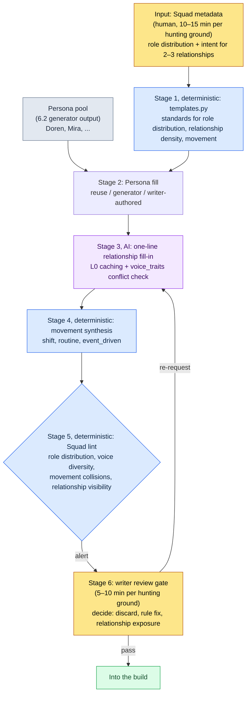

# 6.3 NPC Persona and Squad — From a Mannequin Museum to a Small Society

> Primary readers: MMORPG designers who own NPC and hunting-ground content (mid-size teams of 10–50)
> Scaled-down version for solo/hobbyist readers: §6.3.10 "If You're Solo, Just This Much"

I remember the day I used the 6.2 generator to mass-produce five NPCs for one hunting ground and put them in the game. Names, appearances, short backstories — all filled in. I placed them by dropping coordinates. But when I actually walked through that hunting ground, it felt strangely dead. Five people shared the same space and never once mentioned each other. Two of them stood overlapping on the same rock. Someone needed to play the merchant, but all five were scholars. Doren and Mira were each perfectly fine NPCs on their own; bundled together, they were a collection of mannequins.

This is the mannequin-museum state. Every individual NPC is built, but the group is not alive. This chapter covers the pipeline that binds those five into a small society. The core decomposition is Persona and Squad. To use an office analogy: a Persona is an employee's business card, and a Squad is one team's org chart. Stack fifty business cards with no org chart and the company does not run. And the spine of this chapter is the final stage — running one full cycle with the AI to verify that the bundled group talks and moves like people who actually know each other.

> **Author's Operating Note**
> The Squad pipeline in this chapter is an anonymized version of the NPC Persona/Squad tool I run in my company's R&D folder. The yaml structure, the checks, and the voice_lint thresholds faithfully mirror the real tool; the city and NPC names are swapped for the book, the same as in 6.2. The output text is reconstructed from real sessions.

---

## 6.3.1 Persona Is the Business Card, Squad Is the Org Chart

A Persona is an individual NPC's identity. It holds the name, appearance, voice_profile, and role. What the 6.2 generator produces is Personas. Doren Vale and Mira Kost are each one Persona.

A Squad is the unit that binds those Personas into a group. It defines how five people are distributed across roles in one hunting ground, how they relate to each other, and how they move.

| Unit | What it holds | Who makes it |
|---|---|---|
| Persona | name, appearance, voice_profile, role | generator (6.2) |
| Squad | role distribution, relationships, movement | Squad pipeline (this chapter) |

If you do not separate the two, you get blocked in two ways at once. Mass-produce only Personas and you get a mannequin museum; try to build Squads first and you have no Personas to fill them with. Separating them keeps each unit simple to operate. Separation is not severance, though. The point is to lay reuse and verification paths between the two units, and that is the main business of this chapter.

This Persona→Squad decomposition is not mere housekeeping; it opens a longer road. Only when NPC groups are formalized into roles, relationships, and numbers can you later reach dynamic reactivity — where world state (accumulated player behavior) perturbs NPC values and those values become quest trigger conditions. This chapter only points at the entrance to that progressive application; what it covers head-on stops at conservative mass production gated by human review.

---

## 6.3.2 Input — One Page of Squad Metadata

The Squad skeleton starts from one page of metadata per hunting ground. Same philosophy as the city metadata in 6.2: a human pins down only the role distribution and the intended relationships, and the rulebook and the AI do the filling.

```yaml
# city_021_hg_3.squad.yaml
squad_id: city_021_hg_3_squad
hunting_ground: city_021_silvermark_hg_3
type: hunting_ground_residents
size: 5
roles:
  - role: quest_giver
    count: 1
    voice_traits: [authoritative, scholarly]
  - role: lore_keeper
    count: 1
    voice_traits: [scholarly, withdrawn]
  - role: merchant
    count: 1
    voice_traits: [practical, dry]
  - role: bystander
    count: 2
    voice_traits: [varied]
relationships:
  - between: [quest_giver, lore_keeper]
    type: mentor_and_former_student
  - between: [merchant, bystander_1]
    type: regular_customer
movement_pattern: stationary_with_shifts
```

The most important slot is `relationships`. With zero relationships, the five stay strangers forever. With too many (five or more for a five-person squad), players have too much to keep track of and the relationships drown each other out. In my experience, 2–3 core relationships per five-person Squad is the most stable. `voice_traits` is the device that gives the five distinct voices. Fill all five with `scholarly` and the verification stage flags it as voice homogenization.

---

## 6.3.3 Stages 1 and 2 — Rulebook Skeleton and Persona Fill

The rulebook sets the standard for the Squad skeleton first. Default values for size, role distribution, relationship density, and movement pattern are coded in per hunting-ground region and type.

```python
# npc_squad/templates.py (excerpt)
SQUAD_TEMPLATES = {
    ("west", "hunting_ground_residents"): {
        "size_range": (4, 6),
        "role_distribution": {
            "quest_giver": 1,
            "merchant": 1,
            "lore_keeper": (0, 1),
            "bystander": (1, 3),
        },
        "relationship_density": 2,        # recommended relationship count
        "movement_pattern": "stationary_with_shifts",
    },
    ("east", "outpost_squad"): {
        "size_range": (3, 4),
        "role_distribution": {
            "commander": 1,
            "scout": 1,
            "support": (1, 2),
        },
        "relationship_density": 1,
        "movement_pattern": "patrol_loop",
    },
}
```

This stage is deterministic. For a western-residents Squad, the accident of five quest_givers and nothing else is impossible at the code level. If a role distribution steps outside the rules, it gets blocked on the spot.

Next, each slot is filled with a Persona. There are three paths. If the pool has a Persona that fits, reuse it (appearance weight +1); if not, generate a new one with the 6.2 generator; and if it is a key figure in the main quest, a writer writes it by hand. For silvermark's hg_3 Squad, the quest_giver and lore_keeper slots were filled with Mira and Doren, already mass-produced in 6.2, and the merchant and two bystanders were newly generated. Up to this point it is the same cycle as the 6.2 generator. The real work of this chapter comes next: verifying that the bundled group actually behaves like a group.

---

## 6.3.4 One Cycle, End to End — Relationship Fill-In, Movement, and Consistency Checks

If I only wrote, abstractly, that "the AI fills in the relationships," you would have no idea what this pipeline spits out. So let us follow the back half of one cycle for the silvermark hg_3 Squad, end to end — from generating the relationship text to discarding and re-requesting.

### Stage 3 — AI Relationship Fill-In

The relationship tag entered in the Squad skeleton (`mentor_and_former_student`) is an abstraction; it is invisible in the game. Stage 3 turns it into a one-line description to be planted in NPC dialogue and events. The prompt is in copy-paste-ready form: it hands the AI the L0/L1 context, the two Personas, and the relationship tag, then asks for a one-to-two-line background usable in game dialogue — the two speech styles must not clash, scholarly-strict tone, no mysticism, no "old friends" clichés, body text only.

```
[L0 context] world_premise + tone_manifesto  (cached)
[L1 context] city_021_silvermark.lore (ruled by the scholars' guild, scholarly_strict)
[Persona 1] quest_giver — Mira Kost, guild archive librarian, 30s, ink stains
[Persona 2] lore_keeper — Doren Vale, bell-tower observation assistant, 50s, speaks only in numbers
[Relationship tag] mentor_and_former_student

Describe the relationship between these two (mentor and former student) in just 1~2 lines,
as background usable in game dialogue. Doren is numbers, Mira is documents — keep the two
speech styles from clashing. Strict scholarly tone, no mysticism, no clichés like "old friends". Body text only.
```

> **[Stage 3 AI Output — Relationship One-Liner] (reconstructed from a real session)**
>
> Twenty years ago, Doren taught Mira the notation used in the seal-array observation records. Now their positions are reversed: Mira copies the readings Doren takes into the archive ledgers. Every Tuesday the two of them argue, briefly, over the one cell where the readings and the ledger disagree.

This output is good. `mentor_and_former_student` became concrete; Doren's "numbers" and Mira's "documents" were tied into one scene (copying readings into a ledger) without clashing; and the scholarly_strict tone held. The same prompt is repeated for the merchant–bystander_1 `regular_customer` relationship.

### Stage 4 — Movement Synthesis

An NPC standing in one spot all day becomes a mannequin again. The rulebook fills in the movement pattern. stationary is a fixed position (guards, bosses); stationary_with_shifts nudges the position every 8 hours (the common case); routine_loop runs on a timetable (residents); event_driven moves only on triggers (quest NPCs). This is deterministic, so the AI is not called.

### Stage 5 — Squad Consistency Lint (This Pipeline's Gate)

Now we test whether the five, bundled, actually behave like a group. Where the 6.2 lint looked at individual NPCs, this lint looks at group consistency.

> **[Stage 5 Squad Lint Output] (actual format)**
>
> ```
> [PASS] Role distribution: quest_giver 1 · lore_keeper 1 · merchant 1 · bystander 2 (rule satisfied)
> [PASS] Relationship density: 2 (recommended 2, satisfied)
> [WARN] Voice diversity: scholarly family 3/5 — quest_giver·lore_keeper·bystander_2
>        have voice_profile cosine similarity 0.83 (exceeds 0.80 threshold). Homogenization risk.
> [WARN] Movement collision: merchant·bystander_1 coordinates overlap within 1.5m radius, 14:00~16:00 window
> [FAIL] Relationship visibility: 2 relationships defined, but 0 mentions of any other member in the 5 NPCs' dialogue.
>        Relationships exist only in data — in-game visibility 0.
> ```

The lint caught three items: a voice-diversity WARN (3 of 5 voices in the scholarly family, cosine similarity 0.83 against a 0.80 threshold), a movement-collision WARN (merchant and bystander_1 overlapping within a 1.5m radius in the 14:00–16:00 window), and a relationship-visibility FAIL (2 relationships defined, 0 mentions of any other member in the five NPCs' dialogue — the relationships exist only in data). None of the three is discarded automatically; all three go up to the gate — the machine surfaces the suspects, but a human decides what lives and what dies. Same design as §6.2.5.

> **[Stage 6 Writer Review — Verdicts and Discards]**
>
> The writer handled the three alerts like this.
>
> - **Voice homogenization (WARN)** → discard bystander_2. Even in a scholars' city, five people all talking like scholars makes the hunting ground monotonous. Re-generate bystander_2 as an odd-jobs worker with a `practical, dry` tone. (The quest_giver and lore_keeper both being scholars is the city's identity, so that stays.)
> - **Movement collision (WARN)** → fix the rule. Push the merchant's shift start offset by +2 hours to clear the 14:00 overlap. No AI call — just a movement-parameter adjustment.
> - **Relationship visibility 0 (FAIL)** → the one that matters most. If you define two relationships and they never show up in the game, that data is dead data. The writer decided to pick one core relationship (Doren–Mira) and plant it in dialogue.

Two of the three closed via a rule fix or regeneration; the last FAIL is the heart of this pipeline. The writer requested one additional dialogue-branch line for Doren — a single line in which the relationship with Mira slips out in passing, an aside rather than exposition, in a scholar's tone.

```
Insert just one line into Doren's dialogue where the relationship with Mira slips out in passing.
Not expository — as an aside. Scholarly tone, one line of dialogue only.
```

> **[Re-request Output]**
>
> *"That diagram is in the archive. Ask Mira. ...Twenty years ago I was the one teaching her how to read them. These days it's the other way around."*

The moment this one line goes in, the relationship between the two NPCs moves from the data sheet onto the game screen. Input (Squad metadata) → skeleton → Persona fill → relationship fill-in → movement → consistency check → discard and visibility decisions: one full cycle closes here.

This one loop is this chapter's standard of Show. The sentence "we bound the NPCs into a society with Squads" is hollow unless you have watched, at least once, a human close a relationship-visibility-0 FAIL with a single line of dialogue.

---

## 6.3.5 The Full Persona→Squad Flow

Here is the cycle above in a single diagram. The key points: stages 1, 2, 4, and 5 are deterministic (rulebook and lint), only stage 3 is AI, and human hands touch only the input at the top and the gate at the bottom.



Human hands touch only two places: the spot at the top where role and relationship intent is set, and the spot at the bottom where someone judges the tone and narrative that lint cannot catch. In between, the rulebook runs the skeleton, the movement, and the checks, and the AI writes the relationship text.

---

## 6.3.6 Three Devices That Make Relationships Visible in the Game

The `관계 노출` (relationship visibility) item is the most frequent FAIL in the stage 5 lint, because relationships tend to live only in the data. There are three devices for pulling a relationship into the game.

First, **dialogue mentions**. As with Doren's line in §6.3.4, an NPC mentions another member in one line. Cheapest, and the most effective.

Second, **route crossings**. Every Tuesday, Doren and Mira can be observed together in the archive, inside the game. A player who happens to see it thinks, "are those two connected?" If the stage 4 movement agrees with the relationship, this comes out naturally.

Third, **branch conditions**. Refuse the quest_giver's request and the lore_keeper's affinity drops with it. This third device is the entrance to the progressive application mentioned in §6.3.1 — the point where a relationship goes beyond mere description and starts affecting game state.

You do not need all three. In a five-person Squad, exposing just the 2–3 core relationships through the first and second devices already changes how the hunting ground feels. Overdo it and players have too much to memorize. At review, the writer picks which relationships to expose and leaves the rest as data.

---

## 6.3.7 Measurement — Honestly

I compare before and after adopting the tool. No fabricated figures. The times and rates are values I counted while personally reviewing the first several hunting grounds, including silvermark; the "before" column is a writer's estimate from the handcraft era.

| Item | Before (manual, estimated) | After (measured) |
|---|---|---|
| Bundling one hunting ground's Squad | about 3–4 hours | about 25 minutes (12 min metadata + 5 min AI + 8 min review) |
| Relationships exposed (dialogue/routes) | 0–1 per hunting ground | 1–2 exposed out of 2–3 core |
| Movement collisions (2+ NPCs at same coordinates) | 2–3 per hunting ground | blocked up front by lint, 0–1 |
| Voice-homogenization discards | — (no check) | 0–1 of 5 regenerated |

The sample is small — a handful of hunting grounds — so read these as directional values, not precise population rates. The biggest change does not fit in the table. Because the lint's `관계 노출` FAIL forcibly shoves "this hunting ground shows zero relationships" in the writer's face, mass-produced content shipping as a mannequin museum became structurally rarer. The point that 0% discards and 0 exposures are not the goal (§6.2.6) holds here as well. The Squad pipeline should absorb most of the bundling work, while leaving the writer time to shape the parts that matter by hand — like Doren's final line.

---

## 6.3.8 The Persona Pool — When the Same Character Appears in Multiple Cities

Once Squads stabilize, the Persona pool follows naturally as an operation. The same Persona can appear in multiple cities. An NPC from the scholars' guild being run into in three or four cities is, if anything, natural. The world does not look smaller; it looks connected.

```yaml
persona_pool:
  - id: persona_doren_vale
    voice_traits: [terse, numeric]
    appearance_count: 3
    appearance_cities: [city_021, city_018, city_023]
    signature: false
  - id: persona_mira_kost
    voice_traits: [scholarly, withdrawn]
    appearance_count: 2
    signature: false
```

Reuse rates have a healthy range.

| Reuse rate | State |
|---|---|
| Under 20% | NPC volume explodes; identification burden |
| 30–50% | healthy operating range |
| 70% or more | NPC staleness; diversity damage |

That said, put one NPC in too many cities and players go "oh, this person again." Cap a Persona's appearances at 5 cities. Boss rooms and signature characters are no-reuse (`signature: true`). From a Persona's second appearance on, visual variation (lighting, props) is mandatory. This 30–50% range is not a precise number but an operating guideline — adjust it for your team and game scale.

> **[Signpost — If You Saw the Persona Pool as a Distribution (Still Premature)]** For a team whose pool has grown to hundreds of NPCs, there is one step further — a signpost in the same spirit as the "dimension vector" section in §8.2.7 (not a prescription; for the conceptual intuition, see Appendix M). The voice_lint in §6.3.4 already measures the "closeness" of two Personas via cosine similarity (values like 0.83). Put the same embeddings over the whole pool, and staleness can be diagnosed as distribution density rather than a writer's impression — "scholarly voices piled up in one corner" becomes visible as the point density of that region. That opens a path: instead of stamping yet another similar scholar into a low-density region, you fill the gap with a variation interpolated between two nearby Personas, patching diversity that way. Two cautions, in the same breath. A Persona produced by interpolation easily becomes a "dead midpoint," an awkward blend of two NPCs — in the end a human has to bring the voice back to life. And the staleness range above (30–50%) is an operating guideline, not a precise figure; the moment you convert it into embedding distance, looseness risks passing itself off as precision — the distance value is a signal that aids the writer's judgment, not the judgment itself.

---

## 6.3.9 Six Common Failures

| Failure pattern | Why it fails | Remedy |
|---|---|---|
| Mass-producing Personas, ignoring Squads | all 50 NPCs exist, yet the hunting ground is dead | adopt a Squad-skeleton rulebook (§6.3.3) |
| Free-form generation without role-distribution rules | distribution accidents — five merchants, zero scholars | enforce role_distribution (§6.3.3) |
| Relationship tags with no one-line description | the relationship stays abstract, invisible in the game | stage 3 AI relationship fill-in (§6.3.4) |
| No relationship-visibility check | relationships defined, 0 exposed in dialogue or routes | stage 5 `관계 노출` lint (§6.3.4) |
| No movement-collision check | 2 NPCs in the same spot at the same time, frequent after launch | automatic coordinate/time-slot check (§6.3.4) |
| Reuse rate of 0% or 70%+ | 0% explodes production volume; 70%+ goes stale | pool operation + appearance cap (§6.3.8) |

The fourth is the one most often missed. Defining a relationship and making it visible in the game are different jobs, and without a check the latter is almost always dropped. If the lint had not shoved relationship visibility 0 in our faces as a FAIL for silvermark hg_3, Doren and Mira would have been mentor and student only on the data sheet.

---

## 6.3.10 Try It Yourself — One Step You Can Take Today

> **If you're solo, just this much**: You don't need a rulebook or a lint. Pick 3–5 NPCs in one location of your game (or a game you love), and write down their roles and 2 relationships by hand, in the §6.3.2 format. Then paste the relationship prompt from §6.3.4 as-is to get a one-line description, and finally ask yourself: "Where in the game's dialogue is this relationship visible right now?" If the answer is nowhere, that is exactly the lint's `관계 노출 0` (relationship visibility 0) FAIL. Close that FAIL by hand — slip a one-line mention of another member into one NPC's dialogue — and what Squad verification actually catches sinks in for good.

If you're on a team, start with this one step. Build one Squad metadata yaml form and, from the stage 5 lint, **just the one-line `관계 노출` check** (grep each NPC's dialogue text for other members' names and roles). The role-distribution check and the movement-collision check come after. Even with only the relationship-visibility check, you block the most common failure first: a mass-produced hunting ground shipping as a mannequin museum.

To sum up as setup → prompt → verify — **setup**: define roles and relationships in the Squad metadata yaml and lay the skeleton with templates.py. **prompt**: request the one-line relationship in the §6.3.4 format, enforcing no voice_traits clashes and no stock phrases. **verify**: run the stage 5 lint, confirm the `관계 노출` FAIL, and close it yourself by planting one core relationship in dialogue.

---

### Key Takeaways
- A Persona is a business card, a Squad is an org chart — only by separating them does a mannequin museum become a society.
- "We bound them into a society" stays hollow until you watch relationship fill-in, movement, and consistency verification run end to end at least once.
- The heart of this pipeline is a human closing the `관계 노출 0` FAIL with a single line of dialogue.

### Next Chapter Preview
- 6.4 The Content Mass-Production Workflow — Binding Persona, Squad, and City Generation into a One-Week Cycle
