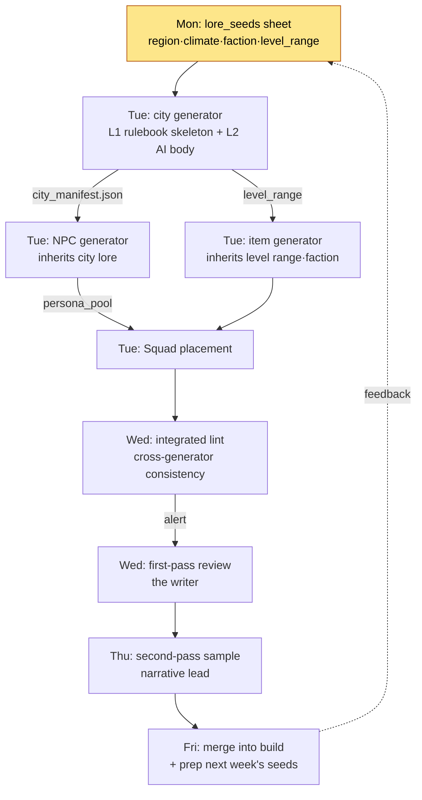

# 6.4 Content Production Workflow — Tying Multiple Generators into One Production Line

The week all three tools were finished, I sat down in one place and ran the city generator, the NPC generator, and the item generator. Each of the three worked fine on its own. I got 7 cities, 110 NPCs, and 60 weapons. It was only a few days later, sitting down to review, that I realized I had stepped into the same trap three times.

The city `port_harman` had been generated as a "fallen fishing village," yet the NPCs placed in it carried personas like "wealthy merchant of a thriving trade port." The city generator and the NPC generator had each looked at different lore_seeds. The item generator had stocked the shops with a level-40 legendary weapon in a city whose recommended level range is 12–18. Each of the three tools was right on its own — and wrong because they were not tied together.

This chapter is not the story of building one tool. It is an operations story: tying the city generator from 6.2, the NPC Squad from 6.3, and the item generator into **a single production line**. With three tools you do not get three traps; new ones grow in the gaps between the tools.

---

## 6.4.1 The Production-Line View

Run the city, NPC, and item generators separately, and each tool's output drifts out of step with the next tool's input. The fix is not making the tools smarter. It is **pinning shared metadata once, upstream, and lining the tools up beneath it**. If the city generator from 6.2 (chapter 2 of this part) is the model of a single tool, this chapter is the work of demoting that tool to one station on a line.

The whole line flows like this.



The key is the arrow labeled `city_manifest.json`. As the city generator builds a city, it drops that city's identity — fallen fishing village or thriving trade port — into a manifest, and the NPC generator and the item generator **take that manifest as input**. The trap I stepped into back then existed because this arrow did not. Tying tools together means putting this one line of contract between them.

---

## 6.4.2 The One-Line Contract Between Tools — The Manifest

Every time the city generator produces a city, it also emits a `city_manifest.json`. Here is its actual shape. This file becomes the input for the NPC and item generators.

```json
{
  "city_id": "port_harman",
  "display_name": "하르만 항",
  "lore_seeds": ["몰락한 어촌", "옛 무역의 잔향", "소금 부족"],
  "region": "남부 연안",
  "dominant_faction": "어민 길드",
  "level_range": [12, 18],
  "tone": "쇠락·끈질김",
  "forbidden_names": ["하란", "하르멘"],
  "neighbors": ["salt_marsh", "old_pier"]
}
```

The NPC generator inherits `lore_seeds` and `tone` and produces "the stubborn people of a fallen fishing village." The item generator inherits `level_range` and stocks only level 12–18 weapons. The `forbidden_names` are names already used in the city next door, so both generators avoid them. Three tools read the same single page of contract.

Here is the prompt I gave Claude to build this manifest. It is the single most important call in the production line — the one that pins down the upstream — so I quote it in full. (In this edition, the Korean data values that flow into the verbatim JSON artifacts are kept in Korean, with English glosses in parentheses.)

> You are the manifest writer for an MMORPG city generator. Take the writer metadata below and generate city_manifest.json.
>
> Writer input:
> - city_id: port_harman
> - lore_seeds: 몰락한 어촌 (fallen fishing village), 옛 무역의 잔향 (echoes of old trade), 소금 부족 (salt shortage)
> - region: 남부 연안 (southern coast)
> - level_range: 12-18
>
> Rules:
> 1. Infer dominant_faction from the lore_seeds, but it must not overlap with the factions of the neighboring cities (salt_marsh, old_pier). The neighboring factions are [염전 조합 (saltworks union), 밀수단 (smuggler ring)].
> 2. Put NPC/place names already used in adjacent cities into forbidden_names. Provided list: [하란 (Haran), 하르멘 (Harmen)].
> 3. tone must be two words at most, and must not contradict the lore_seeds.
> 4. Mark inferred values separately from values the writer specified.

Claude's raw output came back like this. I am quoting it as is, not summarizing. It broke a rule in one place.

> ```json
> {
>   "city_id": "port_harman",
>   "display_name": "하르만 항",
>   "lore_seeds": ["몰락한 어촌", "옛 무역의 잔향", "소금 부족"],
>   "region": "남부 연안",
>   "dominant_faction": "밀수단",   // ← inferred: salt shortage + old trade = smuggling
>   "level_range": [12, 18],
>   "tone": "쇠락·탐욕",
>   "forbidden_names": ["하란", "하르멘"],
>   "neighbors": ["salt_marsh", "old_pier"]
> }
> ```
> (Inferred values: dominant_faction, tone, display_name / writer-specified: the rest)
> Caution: I chose "밀수단" (smuggler ring) for dominant_faction, but under rule 1 the neighboring city old_pier is already "밀수단". This violates the rule. I suggest "어민 길드" (fishers' guild) as a replacement.

What matters here is that the AI reported its own rule violation. The smuggler ring ("밀수단") is an attractive inference from the lore_seeds — salt shortage plus old trade equals smuggling — but **at the line level it is a collision**. The city next door is already run by smugglers. I took the AI's suggestion: `dominant_faction` became the fishers' guild ("어민 길드"), and `tone` became "쇠락·끈질김" (decline · tenacity). "Greed" ("탐욕") was a word born from the smuggler premise and did not fit a fishers' guild.

That single verify–reject–reassign protects the upstream of the line. If the manifest is wrong, the 110 NPCs and 60 weapons below it are all generated on a false premise. Five minutes spent upstream saves three hours downstream.

---

## 6.4.3 Integrated Lint — Checking the Gaps Between Tools

A single generator's lint only looks at its own output. The city lint checks whether the city followed the rulebook; the NPC lint checks whether the personas kept voice consistency. But the trap I stepped into at the start was **not inside each tool — it was between the tools**. So the line needs one more layer above the per-tool lints: an integrated lint that reads cities, NPCs, and items together and cross-checks them.

Here is what the integrated lint actually catches.

| Check | What it compares | What I had missed |
|---|---|---|
| Lore consistency | city.lore_seeds ↔ npc.persona | a wealthy merchant in a fishing village |
| Level-range consistency | city.level_range ↔ item.required_level | a level-40 weapon in a 12–18 city |
| Faction collision | city.faction ↔ neighbor.faction | two adjacent smuggler-ring cities |
| Name duplication | the full city·npc·item name pool | forbidden_names never collected |

Here is part of the actual output from a run of this integrated lint. It does not auto-discard anything. It only raises alerts so that a human makes the call.

> ```
> [integrated lint] port_harman line check — 3 alerts
>
> ALERT-1 (lore consistency) port_harman
>   city.lore_seeds = ["몰락한 어촌", ...]
>   npc[merchant_04].persona = "번성하는 무역항의 부유한 상인"
>   → Possible contradiction. Check whether this is an intended variation.
>
> ALERT-2 (level-range consistency) port_harman
>   city.level_range = [12,18]
>   item[blade_legend_07].required_level = 40
>   → Exceeds the recommended level range by 28. Re-review shop placement.
>
> ALERT-3 (name duplication) — info
>   npc[fisher_02].name = "하란"
>   city.forbidden_names = ["하란", ...]
>   → Collides with forbidden_names. Regenerating the NPC name is recommended.
> ```

ALERT-1 made me pause for a moment. An NPC who is a "wealthy merchant of a thriving trade port" is not automatically wrong. If the city **used to thrive and has since fallen**, then "a once-wealthy, now-poor merchant" is actually a good story. So I judged ALERT-1 not as a discard but as an "intended variation," and requested a one-line revision of the NPC persona to "an old merchant clinging to the traces of a once-thriving trade port." ALERT-2 was an outright accident, so I removed the weapon. ALERT-3 only needed the name regenerated.

The automated lint did not prevent the accident. The automated lint **dragged the accident in front of human eyes**, and a human made the call. That is the core of L2 (rulebook + AI assist) from 6.1. The AI builds the skeleton and the alerts; the human makes the final call. Telling apart "looks wrong but is good narrative," like ALERT-1 — a rulebook cannot do that.

---

## 6.4.4 Running the Line on a One-Week Cycle

Once the tools are tied together, the line needs a rhythm. A one-week cycle turned out to be the most stable. A week is short enough that review does not pile up, and long enough that the feedback loop is not sluggish. It lines up with one box of my desk calendar.

| Day | Line station | Writer time |
|---|---|---|
| Mon | Write the lore_seeds sheet (manifest upstream) | half a day (5–7 cities × 15–20 min) |
| Tue | Run the city→NPC→item generator chain | no writer involvement |
| Wed | Integrated lint + first-pass review (self) | 1 hour (5–10 min per city) |
| Thu | Second-pass sample review (narrative lead) | 2–3 min per city |
| Fri | Merge into the build + prep next week's seeds | brief |

Tuesday is the heart of the line. The city generator drops a manifest, the NPC generator picks it up, the item generator picks it up, and Squad handles the placement. This chain runs in the background with no writer involvement. Meanwhile the writer writes main quests (L0, fully handcrafted). This is the real payoff of tying the tools together. With separate tools, the writer has to touch the line three times on Tuesday; tied together, not even once.

One writer mass-produces 5–7 cities a week, along with their NPCs and weapons. Four weeks gives 20–28 cities. The 30-city target was reached in six weeks.

---

## 6.4.5 Line Health — Four Metrics Checked Every Week

Whether the line is healthy is read in numbers, not impressions. Four metrics, tallied automatically every week.

| Metric | Normal range | Signal when it drifts |
|---|---|---|
| Integrated lint pass rate | 80–95% | below 60% means the manifest upstream is broken |
| Cross-generator collisions | 3–5 per city | 10+ means the contract between generators is broken |
| Human review discard rate | 10–20% | 30%+ means the production parameters are wrong |
| One-writer cycle time | 5 days | 7+ days means cognitive overload |

The most line-like metric is the second one: the **cross-generator collision count**. When you run a single tool, this number does not exist. When it suddenly passes 10, it is not that one tool broke — it is that **the contract between the tools (the manifest) broke**. The usual case: the city generator's manifest schema was changed while the NPC generator was still reading the old schema. Without this metric, you do not see that accident until launch.

The four metrics are fed weekly into the quarterly retrospective. If the trend worsens, I cut the next week's city count from 5–7 down to 3–5 and look for the cause.

---

## 6.4.6 Three Accidents That Break the Line

Tie several tools together and you get accidents that a single tool never had. Here are the three I saw most often.

**First, the contract-mismatch accident.** A new field is added to the city generator's manifest, and the NPC generator does not know that field. The cross-collision metric spikes. When tools are developed separately, it is easy for only one side to get updated. The response is to put a `version` field in the manifest schema and have downstream generators raise an immediate alert on a version mismatch. You do not lecture people; you enforce the contract.

**Second, the upstream-contamination accident.** If the manifest is generated on a false premise (like the smuggler ring in §6.4.2), everything below it is contaminated. The human review discard rate passes 30%, yet when you look at the discarded output, the per-NPC quality is fine. The pieces are fine; the premise is wrong. The response is to add one more review at the manifest stage. Review one thing upstream rather than 110 things downstream.

**Third, the model-drift accident.** The LLM gets auto-updated and its output characteristics change. The city, NPC, and item generators all wobble at once. Check the past week's changes, analyze five discarded samples, and adjust the prompts or the context. Monitor for a week and confirm recovery.

The common response to all three is the same: **do not blame the person; reinforce the contract.** If the cause is that the writer wrote only one line of lore_seeds, then instead of saying "please write three lines," add a mandatory check to the manifest lint. That does not mean human responsibility is zero. Separately from reinforcing the system, accident patterns are shared in the retrospective.

---

## 6.4.7 Where the Writer's Time Goes

The real purpose of tying the line together is not to remove the writer, but to let the writer concentrate on signature content. One picture shows how writer time scatters when the tools are separate, and how it gathers once they are tied.

<svg viewBox="0 0 640 250" xmlns="http://www.w3.org/2000/svg" font-family="sans-serif" font-size="13">
  <text x="160" y="20" text-anchor="middle" font-weight="bold">Before (separate tools)</text>
  <text x="480" y="20" text-anchor="middle" font-weight="bold">After (integrated line)</text>
  <!-- before bars -->
  <rect x="40" y="40" width="180" height="28" fill="#1d4ed8"/>
  <text x="50" y="59" fill="#fff">Main quests 30%</text>
  <rect x="40" y="72" width="120" height="28" fill="#2563eb"/>
  <text x="50" y="91" fill="#fff">Signature 20%</text>
  <rect x="40" y="104" width="180" height="28" fill="#9ca3af"/>
  <text x="50" y="123" fill="#fff" font-size="11">Mass-produced side review 30%</text>
  <rect x="40" y="136" width="90" height="28" fill="#9ca3af"/>
  <text x="50" y="155" fill="#fff" font-size="11">Mass NPC 15%</text>
  <rect x="40" y="168" width="30" height="28" fill="#d1d5db"/>
  <text x="76" y="187" fill="#374151">Ops 5%</text>
  <!-- after bars -->
  <rect x="360" y="40" width="280" height="28" fill="#1d4ed8"/>
  <text x="370" y="59" fill="#fff">Main quests 50%</text>
  <rect x="360" y="72" width="170" height="28" fill="#2563eb"/>
  <text x="370" y="91" fill="#fff">Signature 30%</text>
  <rect x="360" y="104" width="85" height="28" fill="#9ca3af"/>
  <text x="370" y="123" fill="#fff">Review 15%</text>
  <rect x="360" y="136" width="30" height="28" fill="#9ca3af"/>
  <text x="396" y="155" fill="#374151">NPC 5%</text>
  <text x="360" y="187" fill="#374151" font-size="12">Ops 0% — absorbed by the line</text>
  <text x="40" y="225" fill="#b45309" font-size="12">Main+signature 50% →</text>
  <text x="360" y="225" fill="#b45309" font-size="12">Main+signature 80%</text>
</svg>

Main quests and signature content gather 80% of the writer's time. But this allocation does not maintain itself. Once a line is in place, writer time tends to drain into review. So I measure the time split every month, and if main-quest time falls below 50%, I reduce the number of cities produced and recover the main-quest time. The time split has to be defended as policy.

---

## 6.4.8 Extending the Line to Other Content

Once the city–NPC–item line is stable, the same skeleton extends to dungeons, collection codexes, and live events. The key is **not inventing a new pattern**. The temptation always comes: "dungeons are different from cities, so they need a different structure." But the skeleton of the line — shared manifest → generator chain → integrated lint → human review — is exactly the same. Only the input metadata template and the domain rulebook get swapped out.

For dungeons, a `dungeon_manifest.json` gains fields like `boss_pattern` and `encounter_flow`, and a domain rule such as boss routing adds one more line to the integrated lint. Same skeleton, different rules. Keeping the skeleton means the writer never has to learn yet another tool, and the integrated lint infrastructure is reused as is. That said, this is not a license to ignore domain specifics. Dungeons genuinely need routing rules that cities do not.

---

## 6.4.9 Results from Six Months of Operation

Here are the results of running this integrated line for six months on my project, compared with the period when the city, NPC, and item generators ran separately. The absolute figures below are the **author's estimate (unverified)**, not exact tallies; the direction and the ratios follow measured trends.

| Metric | Tools separate | After line integration |
|---|---|---|
| Cities produced (6 weeks) | 18 | 28 |
| Writer interventions on Tuesday | 3 per city | 0 |
| Cross-generator collisions (found post-launch) | 8–12 per quarter | 2–4 per quarter |
| Main quests per writer per quarter | 3 | 8 |
| Upstream review time / downstream review time | 0 / 3 hours | 5 min / 1 hour |

The most important change is the last row. With the tools separate, upstream review was zero and downstream review was three hours. With the line tied together and the manifest reviewed upstream, five upstream minutes erased two downstream hours. And because accidents no longer leak through the gaps between tools, post-launch consistency accidents fell from 8–12 per quarter to 2–4.

The trade-off also became explicit. Before, the abstract argument "mass production is dangerous" came around every quarter. Now decisions are made on a concrete comparison: "collisions −8 / main quests +5."

---

## 6.4.10 Seven Common Failures

1) Running the tools separately instead of tying them. The traps grow not inside the tools but between them.

2) Connecting generators without a manifest. Without a shared contract, downstream drifts away from upstream.

3) Substituting per-tool lint for the integrated lint. Per-tool lint cannot see cross collisions.

4) Compressing the cycle from five days to three. Five days is the safety margin for review.

5) Reviewing downstream while skipping the upstream (the manifest). Look at one upstream item rather than 110 downstream.

6) Charging accidents to human fault alone. Contract reinforcement and rule automation are the answer.

7) Building the line and then not using it. Enforcing the one-week cycle matters as much as the tools do.

---

## Try It Yourself

**setup.** Prepare the city generator (6.2) and the NPC generator (6.3). Decide on a single `city_manifest.json` schema the two will share. At minimum, the fields are `lore_seeds·region·faction·level_range·forbidden_names·tone·version`.

**prompt.** Use the manifest-writer prompt from the body above as is. The last two rules are the point: "do not overlap the neighboring city's faction" (cross-collision prevention) and "mark inferred values separately from specified values" (reviewability). When a city is generated, have it drop a manifest, and wire the NPC and item generators to take that manifest as their input.

**verify.** Run the integrated lint once. It cross-checks four things: lore consistency, level-range consistency, faction collision, and name duplication. When an alert fires, do not auto-discard — have a human judge it. Telling apart "looks wrong but is good narrative" (the old merchant of a fallen trade port) is the human's share of the work.

**Solo Scale-Down.** Even if your only tools are a city generator and an NPC generator, the line still holds. Put each city's lore_seeds, level_range, and forbidden_names on one row of a spreadsheet, and pasting that whole row into the NPC generator prompt already plays the manifest's role. An integrated lint with a single rule — city–NPC lore consistency — is enough to block that trap. No grand infrastructure required: one principle, "put one line of contract between the tools," is enough to start the line.

---

### Key Takeaways
- Traps grow not inside the tools but between them — tie that gap shut with a manifest
- The integrated lint is not a discard machine; it is a device that drags accidents in front of human eyes
- Five minutes of upstream review erases two hours of downstream review — block it at the top
