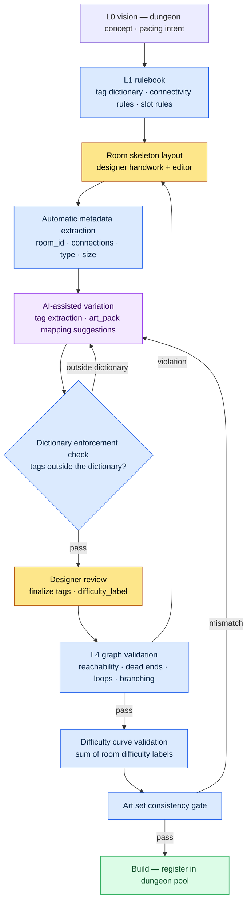

# 7.1 Procedural Level Design Master

The exit of room 47 in the dungeon was sealed. The build had passed. QA had passed. It was the third day of live service when a screenshot appeared on the community boards: a player standing in front of a wall, one room short of the boss. That room had been copy-pasted from a hand-built room two quarters earlier, and somewhere in the copying, one eastern corridor kept its visuals but lost its connection data. Nobody verified it. There was no tool to verify it with.

This chapter is the story of building a structure that blocks that accident automatically, at the build stage. The heart of it is not the craft of drawing spaces — it is the practice of running the data attached to those spaces as rules.

---

A level design workshop is closer to a drafting room. Each blueprint comes from someone's hands, but consistency, reuse, and verification across blueprints are decided by how the blueprint cabinet is run. Anyone can build one hand-crafted dungeon. Running a hundred dungeons with a consistent difficulty curve and a graph free of dead ends is not a matter of craft — it is a systems problem.

On Project A — the MMORPG where I work as design director (targeting Korea and Southeast Asia, a mid-size team of 10–50, mobile-first) — this system has a name: a single document called `Procedural_Level_Design_Master`. This chapter covers what that document unifies, how far AI gets to touch it, and where AI stops. Underneath this chapter sits my experience leading design on a mobile roguelite RPG where the dungeon was generated fresh every run — running procedural space as rules.

## 7.1.1 Two Paths — Generate the Space, or Operate Its Metadata?

Level automation splits in two directions. One is generating the space itself procedurally. Classic PCG (Procedural Content Generation) lives here: BSP partitioning (Binary Space Partitioning, a classic technique that recursively bisects a space to place rooms), wave function collapse, drunkard's-walk grids. The other is operating the space's metadata — room tags, connectivity, difficulty labels, event slots.

Classic PCG is strong at the first. In genres where "a new map every run" is the core of the game — roguelikes, sandboxes — the first is the right answer. MMORPGs are different. Players run the same dungeon dozens of times. They run it until the route is memorized. So the dungeon needs to be a fixed, hand-polished space, and the place for automation is not the space itself but **the metadata that makes that space operable**.

Why metadata is the spine of operations becomes clear deliverable by deliverable.

| Deliverable | Without metadata |
|---|---|
| A pool of dozens of dungeons | No way to search which room is where; no reuse |
| Difficulty curve validation | No per-room difficulty labels, so no curve can be drawn |
| Automatic quest and boss placement | No event slot metadata, so coordinates are entered by hand |
| Art team sync | No room type → art set mapping, so visuals drift apart |
| Measuring player routes and dwell time | No room-ID-based telemetry |

A dungeon without metadata builds, but it cannot be operated. It is a library full of books with no index. That is why this chapter focuses on "operating spatial metadata."

## 7.1.2 What the Master Document Unifies

`Procedural_Level_Design_Master` binds four standards into one document: the room metadata format, the room tag dictionary, the connectivity rules, and the validation checklist. Start with what happens when these four are scattered. When five designers each reference the format from a different file, one writes the `type` field as `combat`, another as `Combat`, another as `battle_room`. Search breaks, statistics break, and eventually automation breaks.

Sorted by Layer, each of the four standards has an obvious home. The format, the dictionary, and the rules belong to the rulebook that governs generation (L1); the generated room bodies are content (L2); sheet values are data (L3); validation sits at the build/QA gate (L4).

<svg viewBox="0 0 720 300" xmlns="http://www.w3.org/2000/svg" font-family="sans-serif" font-size="13">
  <rect x="20" y="20" width="680" height="44" rx="6" fill="#1e3a5f" stroke="#0f1f33"/>
  <text x="36" y="40" fill="#fff" font-weight="bold">L0 Vision</text>
  <text x="120" y="40" fill="#cfe2ff">Level concept · pacing intent (immutable anchor, injected into every generation/validation)</text>
  <text x="120" y="56" fill="#9fc0e8" font-size="11">— art_pack tone, difficulty intent</text>

  <rect x="20" y="76" width="680" height="44" rx="6" fill="#2a5d3a" stroke="#173a22"/>
  <text x="36" y="96" fill="#fff" font-weight="bold">L1 System</text>
  <text x="120" y="96" fill="#d6f5df">Rulebook — room meta format · tag dictionary · connectivity rules</text>
  <text x="120" y="112" fill="#a8dcb8" font-size="11">— the slot the Master document binds</text>

  <rect x="20" y="132" width="680" height="44" rx="6" fill="#5d4a2a" stroke="#3a2e17"/>
  <text x="36" y="152" fill="#fff" font-weight="bold">L2 Content</text>
  <text x="120" y="152" fill="#f5e6cf">Room bodies with metadata attached (generated · polished spaces)</text>

  <rect x="20" y="188" width="680" height="44" rx="6" fill="#4a2a5d" stroke="#2e173a"/>
  <text x="36" y="208" fill="#fff" font-weight="bold">L3 Data</text>
  <text x="120" y="208" fill="#ead6f5">Room size · connection sheets · event slot IDs · enemy data</text>

  <rect x="20" y="244" width="680" height="44" rx="6" fill="#5d2a2a" stroke="#3a1717"/>
  <text x="36" y="264" fill="#fff" font-weight="bold">L4 Build · QA</text>
  <text x="120" y="264" fill="#f5d6d6">Graph validation · difficulty curve validation · art set consistency gate</text>
</svg>

When I say the master document unifies the four standards, I do not mean "cram all the body text into one file." I mean "collect the rules in the L1 slot." That is what lets the automation that comes later sit on top of the Layer boundaries (what happens when the separation collapses is covered in 7.1.11).

## 7.1.3 The Room Metadata Format — the Input Slot Where Automation Attaches

Each room follows the format below. This format is the input interface for automation.

```yaml
room_id: dungeon_021_room_07
dungeon: dungeon_021_silvermark_library
type: combat_room          # combat / puzzle / lore / safe / boss
size: medium               # small / medium / large
difficulty_label: hard_for_level_28
tags: [scholar_theme, vertical_layout, water_hazard]
connections:
  - target_room: dungeon_021_room_06
    type: door
    direction: south
  - target_room: dungeon_021_room_08
    type: passage
    direction: east
event_slots:
  - slot: enemy_spawn_1
    constraints: [scholar_enemy, level_28]
  - slot: lore_object_1
    constraints: [scholar_lore]
movement_complexity: 4     # 1~5
estimated_clear_time_sec: 90
art_pack: scholar_library_v2
```

Every field has at least one automation consumer. `type` feeds dungeon pool statistics and difficulty calculation; `tags` feeds search, reuse, and art set mapping; `connections` feeds graph validation (dead-end checks); `event_slots` feeds automatic quest and boss placement. A field with no consumer does not go into the format. It only adds input cost without adding value.

## 7.1.4 The Room Tag Dictionary — Small and Orthogonal

Tags are the metadata's search keys. Let them multiply without limit and search breaks. Put 200 labels on a cabinet of drawers and you can no longer find what is where. So we run 5 categories × roughly 6 enums per category — about 30 in total.

| Category | Enums | Examples |
|---|---|---|
| theme | 8 | scholar_theme, ruins_theme, forest_theme … |
| layout | 5 | vertical_layout, horizontal_corridor, open_arena … |
| hazard | 6 | water_hazard, fire_hazard, falling_hazard … |
| interaction | 4 | puzzle_required, lever_activation … |
| narrative | 7 | flashback_trigger, dialogue_zone … |

A room never carries more than 5 tags; 3–4 is normal. Adding a new tag means passing a four-step gate: it must be a candidate for use in 5 or more rooms per quarter, it must be inexpressible as a combination of existing tags, its use in search or art set mapping must be clear, and it must still be on 5 or more rooms after a month in operation. The last condition is the key one. A tag created on impulse, used once, and abandoned pollutes the dictionary.

## 7.1.5 The Procedural Level Pipeline — From Rulebook to Validation

How the standards so far connect into one flow — that connecting line is the skeleton this chapter rests on. It is a pipeline that starts at the rulebook, passes through AI-assisted variation, and ends at guardrail validation.



Three properties of this pipeline are worth pinning down. First, the rulebook (L1) sits upstream of all generation. Second, AI varies only within the dictionary the rulebook defines — the F gate sends out-of-dictionary output back. Third, validation (H, I, J) is fixed as a gate just before the build, so violations are blocked by code rather than depending on anyone's attention. The room 47 accident happened because there was no H gate.

## 7.1.6 Connectivity Rules — Guardrails Verified as a Graph

The `connections` field in the room metadata turns the whole dungeon into one directed graph. Once it is a graph, validation is automatic.

| Check | On violation |
|---|---|
| Start room → boss room reachable | Blocked as a build failure |
| Dead end (1 exit + non-safe_room) | alert — designer review |
| Bidirectional link consistency (A→B exists but no B→A) | Auto-corrected |
| Loop length — short 2–3-room loops | alert |
| Branching width — 4 or more simultaneous branches | Designer review |

The measurement script takes the following shape: a thin wrapper that lays dungeon vocabulary over standard graph algorithms (longest path, average out-degree, loop count, shortest path).

```python
# level_graph_metrics.py
def measure(dungeon):
    graph = build_graph(dungeon.rooms)
    return {
        "depth":            longest_path_length(graph),
        "branching_factor": avg_out_degree(graph),
        "loop_count":       count_loops(graph),
        "dead_ends":        count_dead_ends(graph),
        "boss_reachability": shortest_path(graph.start, graph.boss),
    }
```

The five metrics come out in a form comparable across dungeons. We use them as diversity metrics for the dungeon pool. But diverse metrics do not mean a fun dungeon. Metrics exist to block accidents, not to guarantee fun. Zero dead ends guarantees no fun at all. Fun comes from a designer's insight; graph validation just holds up the floor so that insight does not get buried under accidents.

## 7.1.7 Worked Example — Handing tags Extraction to AI, Rejecting It, and Asking Again

Of all the automation, the part people most often want to take their hands off is `tags` entry. Tagging 100 rooms is tedious, and even a human gets confused looking at room screenshots alone. Repetitive work with clear judgment criteria is exactly the kind of place where AI is good at carrying the first draft. This section lays out the workflow I actually ran — the prompt, the AI output that got rejected, and the human's follow-up request — with nothing retouched.

**First prompt:**

```
[Input]
- Room screenshot: (attached)
- Room area: 18m × 12m, ceiling height 9m (two-story vertical structure)
- Placed enemies: scholar_phantom × 3, water_elemental × 1
- Adjacent room type: lore_room (west), combat_room (east)
- A shallow pool of water inside the room

Pick 3~5 tags that fit this room, only from the dictionary below. Don't invent tags
outside the dictionary; output the tag enums only, comma-separated.

[Tag dictionary, 30 entries]
theme: scholar_theme, ruins_theme, forest_theme, cave_theme,
       crypt_theme, swamp_theme, mechanical_theme, celestial_theme
layout: vertical_layout, horizontal_corridor, open_arena,
        maze_layout, bridge_layout
hazard: water_hazard, fire_hazard, falling_hazard,
        poison_hazard, crush_hazard, dark_hazard
interaction: puzzle_required, lever_activation, key_gate, hidden_passage
narrative: flashback_trigger, dialogue_zone, lore_object_zone,
           ambush_setup, ritual_site, vista_point, rest_anchor
```

**Claude's first output (raw, untouched):**

```
scholar_theme, vertical_layout, water_hazard, ambush_setup, two_story_layout
```

Two problems are exposed right here. One: `two_story_layout` is not in the dictionary. The model got pulled by the input phrase "two-story vertical structure" and invented a word outside the dictionary. Two: the tags hit the cap of five, yet `vertical_layout` and `two_story_layout` overlap in meaning — two slots spent on the layout category.

**The human's rejection call.** `two_story_layout` violates dictionary enforcement, so it is an automatic reject (the pipeline's F gate). `ambush_setup` is a closer call — three enemies are placed, but from the screenshot it is ambiguous whether this is an ambush composition or just a combat room. The model may have over-interpreted. With the adjacent rooms both lore/combat, the case for a narrative ambush trigger is weak. Rejected.

**Second request:**

```
two_story_layout isn't in the dictionary and overlaps with vertical_layout. Drop it.
Drop ambush_setup too — having enemies doesn't make it an ambush.
// (intent: narrative tags only when narrative intent is explicit; plain combat is already expressed by type)
You don't have to fill the empty slots. 3~4 is normal. Tag it again.
```

**Claude's second output:**

```
scholar_theme, vertical_layout, water_hazard
```

This time it is down to three, all inside the dictionary, with no category duplication. The human accepted the result. That is how the room format's `tags: [scholar_theme, vertical_layout, water_hazard]` got finalized.

The lesson of this worked example is two lines long. First, AI overfits to one detail of the input ("two-story") and steps outside the dictionary — the dictionary enforcement gate has to catch that at the code level. Second, AI tends to fill empty slots — unless you state "you don't have to fill them," it will try to use all five. Both failures are common, and both fixes are only stable when enforced not by the prompt but by the rulebook (dictionary + cap).

## 7.1.8 Metadata at Scale — Who Fills It In, Who Reviews It

Filling in one room's metadata by hand takes a designer 5–10 minutes. One dungeon (20–30 rooms) is 2–5 hours; 100 dungeons is 200–500 hours (author's estimate, unverified — an upper bound computed as average entry time per room × room count). Fill it all by hand and the designer becomes a metadata entry slave.

So the work is split by area, each with its own filler.

| Area | Filled by |
|---|---|
| room_id · dungeon · connections | Automatic editor extraction (L3) |
| type · size | Auto-classified from room area and connection count |
| tags | AI assist + designer review (7.1.7) |
| event_slots | Rulebook per room type |
| difficulty_label | Auto-computed by summing the enemy data in the room |
| art_pack | Room type · dungeon theme mapping |

What designers finalize by hand comes down to reviewing `tags` and giving final sign-off on `difficulty_label`. Tools fill in the rest; people review. The point of the automation is to pull designers out of data entry and send them back to the judgment calls — pacing, signature rooms, reuse policy.

## 7.1.9 Room Reuse and Its Pitfalls

The biggest payoff of the master standard is room reuse. With 30 rooms searchable by tag, you can assemble 5–10 dungeons out of combinations. But as the reuse ratio climbs, dungeons go stale. So reuse ships with guardrails attached.

| Guardrail | Definition |
|---|---|
| A room appears in at most 5 dungeons | Appearance count tracked automatically |
| Visual variation required on second appearance | Lighting and prop changes |
| No reuse of boss rooms or signature rooms | Enforced by flag |
| Track negative feedback on reused rooms | Player telemetry |

Reuse is a means of cutting cost, not a goal. The moment the reuse rate itself becomes a KPI, the player experience flattens. At 0% (every room new), production cost explodes; past 70%, dungeons stop being distinguishable from one another. In my experience the 30–40% band is the balance point between cost and variety (a directional observation — the precise threshold differs by project).

## 7.1.10 Common Failures and Fixes

| Pattern | Fix |
|---|---|
| Five people read the metadata format five different ways | Unify it at L1 with the Master document |
| Tags multiply to 50–100 | The 30-tag dictionary + the four-step gate |
| Builds ship without dead-end checks | Make graph validation a build gate |
| Designers hand-enter all metadata | Editor extraction + AI assist |
| AI generates out-of-dictionary tags | Auto-reject at the dictionary enforcement gate |
| Reuse at 0% or 70%+ | The 30–40% band + variation guardrails |

## 7.1.11 Layer Decomposition Is the Precondition for Procedural Level Generation

The structure of 7.1.2–7.1.6 — laid out so far as rulebook, generation, validation — is itself a product of Layer decomposition. The general thesis that Layer decomposition is the precondition for procedural generation and automation (L0 anchor → L1 rulebook → L2 body → L3 values → L4 gates; as one lump, generation collapses) was covered in §6.6. Here I apply it to operating level metadata.

Without this separation, room layout, BSP, pacing, and narrative triggers all mix into one file, and every time you move a single room, the pacing intent, the event slots, and the connectivity graph break together. It is the drafting room, the materials warehouse, and the inspection room piled onto one desk — pull out one blueprint and the materials invoice and the inspection sheet come out with it. The AI assist in 7.1.7 worked because of the Layers, too: room IDs and connectivity are filled from the editor (L3 auto-extraction), tags from AI (L1 dictionary enforcement), difficulty_label from summation (L3→L4). Automation sits on Layer boundaries; sit it on a single lump and accidents multiply within the first quarter and the tool itself gets thrown out.

That said, this does not mean you need the full five-drawer cabinet in perfect shape from day one. Separate gradually; keep interfaces narrow. In the first quarter, separating just the L1 rulebook (tag dictionary + connectivity rules) and the L3 sheet (room metadata sheet) already creates a place for automation to enter. The L0 pacing intent and the L4 validation gates get filled in over the quarters that follow. Once the standards are unified, automation has a place to land — and the more automation lands, the more the designer's attention shifts from hand-working one room at a time to judging pacing, signature rooms, and reuse.

---

### Key Takeaways

- The new place for level automation is not the space itself but the operation of the space's metadata.
- Validation must be fixed as a build gate, not left to human attention, or accidents leak into live service.
- AI variation is allowed only within the dictionary the rulebook defines; out-of-dictionary output is rejected by code.

---

## Try It Yourself

**setup.** Pick one dungeon and build a YAML sheet where each room carries only four fields: `room_id · type · connections · tags`. First pin the tag dictionary — 5 categories, about 30 enums — on a single sheet of paper.

**prompt.** Feed in a room screenshot + area + enemy types + adjacent room types, and ask: "pick only 3–5 tags from this dictionary, no tags outside the dictionary, don't fill empty slots" (the exact prompt from 7.1.7).

**verify.** (1) If the AI output contains a tag outside the dictionary, reject it and ask again. (2) Build a graph from `connections` and check start→boss reachability and dead ends — if even one violation turns up, mark that room as unbuildable.

### Solo Scale-Down

If you are a solo developer with no tooling infrastructure, start the master document as a single markdown page. Thirty lines of tag dictionary, five lines of connectivity rules, five lines of validation checklist — that is enough. For graph validation, if you have 10 rooms or fewer, drawing arrows on paper and eyeballing for dead ends gets you 80% of the effect. The core is not the tool but the habit itself: attach data to rooms, and check that data with rules. Add the tools when you pass 50 rooms and checking by hand becomes too heavy.

### Next Chapter Preview

- 7.2 Behavior Tree Editor — running AI behavior trees, the domain adjacent to levels, on rulebooks and metadata
