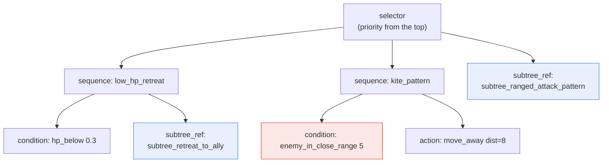
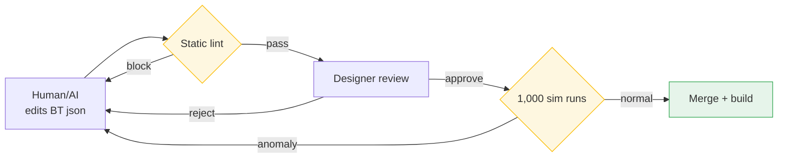

# 7.2 The Behavior Tree Editor — A Worked Transcript of a Human and AI Editing and Verifying BT json Together

An apprentice mage was glued to the player, swinging a sword. I had designed that NPC as a ranged magic caster. Its HP was paper-thin — one melee hit and it was dead — yet it had no intention of keeping its distance. The build log showed no errors. I reopened the Behavior Tree in the editor; the nodes were all wired up correctly. After an hour of staring at it, I found the cause. The distance condition on the retreat branch was `0.5` instead of `5`. The NPC was supposed to flee when an enemy came within 5 meters, but at 0.5 meters — practically point-blank — the retreat branch never fired.

One number. In the graphical node editor, that number was visible only when you expanded the node's inner panel, and it left nothing in the change history. There was no way to trace who changed that value, or when. From that day on, my Project A started handling Behavior Trees as json rather than graphics. This chapter is the record of one cycle in which a human and AI edit that json together and a machine verifies it automatically.

---

## 7.2.1 Where the Behavior Tree (BT) Slips Out of Your Hands

The Behavior Tree is the de facto standard structure for defining an enemy NPC's combat, movement, and reactions. A selector tries branches in priority order; a sequence chains conditions and actions in order. The structure itself is simple. The problem is scale.

On my Project A, a single enemy NPC's BT ran roughly 50–200 nodes, and we operated more than 100 NPCs. Multiply those out and the total BT node count reaches tens of thousands. At that scale there comes a moment when no human can answer the question, "If I change this retreat pattern, which NPCs are affected?" It is like having a hundred notebooks spread open on your desk: fix one line in the first volume, then try to trace by eye where it bleeds into the other ninety-nine.

When I moved from graphical BTs to json, I demanded four things.

<svg viewBox="0 0 720 250" xmlns="http://www.w3.org/2000/svg" font-family="sans-serif">
  <rect x="0" y="0" width="720" height="250" fill="#fafafa" stroke="#ddd"/>
  <rect x="30" y="30" width="300" height="80" rx="8" fill="#e8f0fe" stroke="#4285f4"/>
  <text x="180" y="58" text-anchor="middle" font-size="15" font-weight="bold" fill="#1a73e8">Store as text (json)</text>
  <text x="180" y="82" text-anchor="middle" font-size="12" fill="#444">Track every changed line via git diff</text>
  <text x="180" y="100" text-anchor="middle" font-size="12" fill="#444">"One number" incidents stay in history</text>

  <rect x="390" y="30" width="300" height="80" rx="8" fill="#e6f4ea" stroke="#34a853"/>
  <text x="540" y="58" text-anchor="middle" font-size="15" font-weight="bold" fill="#188038">Standardized node metadata</text>
  <text x="540" y="82" text-anchor="middle" font-size="12" fill="#444">Search and reuse via category·tags</text>
  <text x="540" y="100" text-anchor="middle" font-size="12" fill="#444">"Find similar BTs" becomes a one-line query</text>

  <rect x="30" y="140" width="300" height="80" rx="8" fill="#fef7e0" stroke="#fbbc04"/>
  <text x="180" y="168" text-anchor="middle" font-size="15" font-weight="bold" fill="#b06000">subtree references (reuse by reference)</text>
  <text x="180" y="192" text-anchor="middle" font-size="12" fill="#444">One common pattern shared by many BTs</text>
  <text x="180" y="210" text-anchor="middle" font-size="12" fill="#444">Fix one place, not copy-paste → applies everywhere</text>

  <rect x="390" y="140" width="300" height="80" rx="8" fill="#fce8e6" stroke="#ea4335"/>
  <text x="540" y="168" text-anchor="middle" font-size="15" font-weight="bold" fill="#c5221f">Automatic change-impact visibility</text>
  <text x="540" y="192" text-anchor="middle" font-size="12" fill="#444">Which BTs a subtree edit reaches</text>
  <text x="540" y="210" text-anchor="middle" font-size="12" fill="#444">A script computes it, not human guesswork</text>
</svg>

The built-in BT editors in commercial game engines integrate easily and offer strong visual debugging. They do, however, tend to store BTs as binary assets, which weakens text diffs and change-impact tracking. Project A assumed a live game operating more than 100 BTs, so we chose to develop our own json BT format and editor. Let me be clear: this is not the right answer for every team. If you operate fewer than 50 BTs, sticking with the engine's built-in editor is almost always cheaper. I come back to the justification for in-house development at the end of this chapter.

---

## 7.2.2 BT json — One Enemy's Behavior as Text

Start with what the result looks like. Below is part of the BT for a ranged-support NPC of the Scholars' Guild. Two things are key: every behavior is text, so git can track it line by line, and common patterns are referenced via `subtree_ref`.

```json
{
  "bt_id": "bt_scholar_archer_v3",
  "category": "ranged_combatant",
  "tags": ["scholar_faction", "ranged", "support"],
  "description": "Scholars' Guild ranged support type. Keep distance + retreat first.",
  "root": {
    "type": "selector",
    "children": [
      {
        "type": "sequence",
        "name": "low_hp_retreat",
        "children": [
          {"type": "condition", "fn": "hp_below", "param": 0.3},
          {"type": "subtree_ref", "id": "subtree_retreat_to_ally"}
        ]
      },
      {
        "type": "sequence",
        "name": "kite_pattern",
        "children": [
          {"type": "condition", "fn": "enemy_in_close_range", "param": 5},
          {"type": "action", "fn": "move_away", "param": {"distance": 8}}
        ]
      },
      {"type": "subtree_ref", "id": "subtree_ranged_attack_pattern"}
    ]
  }
}
```

Unfolded as a diagram, the tree is a selector trying three branches from the top. Note that the bug from the opening — whether the `param` of `enemy_in_close_range` is `5` or `0.5` — becomes a single line you can see at a glance in json.



| Element | Role |
|---|---|
| `bt_id` | Key for git diff and change tracking |
| `category` / `tags` | Unit of search and reuse |
| `subtree_ref` | Reference to a common pattern (fix one place → update many BTs) |
| `description` | Shared with designers and scenario writers |

The node painted red, `enemy_in_close_range 5`, is the one that ate an hour of a human's time in the opening. In json, a single code review catches it.

---

## 7.2.3 The subtree Library — Reference Instead of Copy-Paste

Across the behaviors of more than 100 enemies, recurring chunks appear: "retreat behind an ally," "retreat to cover," "ranged attack pattern," and the like. Copy-paste those into every BT, and fixing one piece of retreat logic means hand-hunting a hundred places. So common patterns are split off into separate subtree files and only referenced via `subtree_ref`.

```
subtree_library/
├── retreat_patterns/
│   ├── subtree_retreat_to_ally.json
│   ├── subtree_retreat_to_cover.json
│   └── subtree_retreat_random.json
├── attack_patterns/
│   ├── subtree_ranged_attack_pattern.json
│   ├── subtree_melee_combo.json
│   └── subtree_aoe_attack.json
└── reaction_patterns/
    ├── subtree_react_to_ally_death.json
    └── subtree_react_to_player_taunt.json
```

Set up this way, "who is affected if I change this subtree?" becomes the output of a script, not a human's guess. The impact tracker is simple: open every BT and collect the `bt_id` of each BT that references the subtree in question.

```python
# bt_impact_tracker.py
import json, glob

def has_subtree_ref(node, target_id):
    if isinstance(node, dict):
        if node.get("type") == "subtree_ref" and node.get("id") == target_id:
            return True
        for child in node.get("children", []):
            if has_subtree_ref(child, target_id):
                return True
    return False

def find_affected_bts(subtree_id):
    affected = []
    for bt_file in glob.glob("bts/*.json"):
        bt = json.load(open(bt_file, encoding="utf-8"))
        if has_subtree_ref(bt["root"], subtree_id):
            affected.append(bt["bt_id"])
    return affected

# usage
affected = find_affected_bts("subtree_ranged_attack_pattern")
# → ["bt_scholar_archer_v3", "bt_ranger_v2", "bt_sniper_v1", ...]
```

On Project A we wired this function into the pull request (PR) stage. When someone touches a subtree file, the list of affected BTs is automatically posted as a PR comment. Before the merge, the reviewer sees that "one changed line in a retreat pattern alters all 12 ranged enemies."

---

## 7.2.4 Worked Transcript — One Cycle of AI Drafting a New BT

This is where the chapter carries the most weight. I hand the BT draft for a new enemy NPC, an "apprentice mage," to AI, then reproduce — unpolished, exactly as it happened — one cycle of a human verifying, rejecting, and re-requesting that output. There is a reason I do not smooth it over: what the AI got wrong on its first output, and the texture of that failure, is everything this chapter is trying to convey.

### Step 1 — The Human's Prompt (Full Text)

```
[Enemy NPC concept]
Apprentice mage of the Scholars' Guild. Low HP, high magic damage.
Avoiding melee comes first. Retreat behind an ally, then attack with magic.

[category] ranged_combatant

[Reference BT] bt_scholar_archer_v3
(Similar structure. But replace the bow attack with a magic attack)

[Defined function enum]
condition: hp_below, enemy_in_close_range, ally_nearby, mana_below
action: move_away, cast_spell, retreat, wait
subtree_ref id (available list):
- subtree_retreat_to_ally
- subtree_ranged_attack_pattern   # Bow-based. Not for magic
- subtree_magic_attack_pattern

Write only the BT root node json for this concept. Use subtree_ref as much as possible, keep direct nodes minimal,
functions only from the enum above. Do not add behaviors not in the concept. json only, no explanation.
```

### Step 2 — Claude's First Output (Verbatim, Unedited)

```json
{
  "bt_id": "bt_scholar_apprentice_v1",
  "category": "ranged_combatant",
  "tags": ["scholar_faction", "magic", "fragile"],
  "description": "Scholars' Guild apprentice mage. Avoid melee + retreat behind ally + magic attack.",
  "root": {
    "type": "selector",
    "children": [
      {
        "type": "sequence",
        "name": "low_hp_retreat",
        "children": [
          {"type": "condition", "fn": "hp_below", "param": 0.4},
          {"type": "subtree_ref", "id": "subtree_retreat_to_ally"}
        ]
      },
      {
        "type": "sequence",
        "name": "avoid_melee",
        "children": [
          {"type": "condition", "fn": "enemy_in_close_range", "param": 6},
          {"type": "action", "fn": "move_away", "param": {"distance": 10}}
        ]
      },
      {
        "type": "sequence",
        "name": "mana_recover",
        "children": [
          {"type": "condition", "fn": "mana_below", "param": 0.2},
          {"type": "action", "fn": "wait", "param": {"frames": 120}}
        ]
      },
      {"type": "subtree_ref", "id": "subtree_ranged_attack_pattern"}
    ]
  }
}
```

### Step 3 — Human Verification and Rejection

I ran the output through lint (covered in the next section) and read it with my own eyes. Three things snagged.

1. **The last branch is wrong.** `subtree_ranged_attack_pattern` is a bow-based attack pattern. Even though the enum comment said "not for magic," the AI pulled in the bow pattern with the similar name. The apprentice mage should use `subtree_magic_attack_pattern`. — **Rejected.**

2. **It added behavior not in the concept.** The `mana_recover` branch (`mana_below` → `wait 120frame`) is a behavior with not a single line in the concept. The prompt nailed down "do not add behaviors not specified," yet the AI apparently judged that "a mage would naturally manage mana" and slipped it in. Plausible, but a spec violation. — **Rejected.**

3. **The retreat threshold is suspect.** `hp_below 0.4` starts retreating earlier than the reference BT (`0.3`). The apprentice mage is indeed more fragile, so it could be intentional. But the AI never gave a rationale, so this is the designer's call. — **On hold, pending designer confirmation.**

### Step 4 — The Human's Follow-Up Request

```
Fix just three places. The last branch, subtree_ranged_attack_pattern, is the bow pattern,
so swap it for subtree_magic_attack_pattern; the mana_recover branch is not in the concept, so delete it entirely;
and revert hp_below 0.4 to the reference BT (0.3) — if there is a rationale for 0.4, put it in the description in one line.
Keep the rest as-is, json only.
```

### Step 5 — Claude's Second Output (Revised)

```json
{
  "bt_id": "bt_scholar_apprentice_v1",
  "category": "ranged_combatant",
  "tags": ["scholar_faction", "magic", "fragile"],
  "description": "Scholars' Guild apprentice mage. Avoid melee + retreat behind ally + magic attack. Low HP, so retreat threshold kept at 0.3 (same as archer).",
  "root": {
    "type": "selector",
    "children": [
      {
        "type": "sequence",
        "name": "low_hp_retreat",
        "children": [
          {"type": "condition", "fn": "hp_below", "param": 0.3},
          {"type": "subtree_ref", "id": "subtree_retreat_to_ally"}
        ]
      },
      {
        "type": "sequence",
        "name": "avoid_melee",
        "children": [
          {"type": "condition", "fn": "enemy_in_close_range", "param": 6},
          {"type": "action", "fn": "move_away", "param": {"distance": 10}}
        ]
      },
      {"type": "subtree_ref", "id": "subtree_magic_attack_pattern"}
    ]
  }
}
```

The second output passed lint; in designer review we nudged the `avoid_melee` distance `6` down a notch to `5` to match the archer, then sent it on to the simulation gate. The lesson here is clear. AI fills in a BT's skeleton fast, but it commits two accidents almost every time: pulling in the wrong subtree with a similar name, and slipping in plausible extra behavior with no spec behind it. Only human eyes and the lint gate catch these two. That is why AI output is a draft, not a final.

---

## 7.2.5 Automated lint — The Machine Catches What Humans Miss, First

BTs connect directly to the player experience. Ship the bug where an enemy will not flee at point-blank range, and it comes back as review scores. So before the merge, the machine checks first.

| Check | On violation |
|---|---|
| Unreachable node | alert (a branch the selector can never reach) |
| Infinite loop risk | block (a repeating sequence with no exit condition) |
| `subtree_ref` target missing | block |
| Action/condition function outside the enum | block |
| Node count explosion (>500) | alert (recommend splitting the BT) |
| Response-time variance across BTs in the same category | alert (suspected balance regression) |

The last row is what makes this lint unusual. If the five BTs grouped under the same `ranged_combatant` drift far apart in average simulated response time, that is a signal that someone silently broke one enemy's balance. It is a device that catches, with statistics, the "vibe" that static checks cannot.

After static lint comes simulation verification. Run the BT 1,000 times in a simulator — no actual game build required — and pull the statistics.

| Metric | Normal range |
|---|---|
| Average survival time (vs. a standard player) | Per-category baseline |
| Attack pattern diversity (entropy) | 0.6 or higher |
| Retreat/approach behavior ratio | Per-category baseline |
| Average frames per action | 60 frames or fewer |

Without baking a build, you can see within 5–10 minutes whether this BT dies too fast or keeps repeating a single behavior. If an anomaly shows, fix the json and re-run the sim. The real gain of going json is that this cycle shrinks from days to minutes.



---

## 7.2.6 Measurement — What Shrank

Here is Project A before and after adoption, as a table. The absolute figures vary with team size and game genre, so they are the author's estimates (unverified). The direction and the ratios, however, are exactly what we observed in live operation.

| Item | Before (engine built-in BT, direct) | After (json + editor) |
|---|---|---|
| Writing a new enemy's BT | 1–2 days | 2–4 hours |
| Assessing BT change impact | Guesswork and experience | Automatic (subtree impact list) |
| Verification after a change | Real build required | 5–10 min simulation |
| Operating 100 enemy NPCs | 3 designers full-time | 1–2 designers |
| Post-launch BT incidents (abnormal behavior) | 10–15 per quarter (author's estimate) | 2–4 per quarter (author's estimate) |

What matters most is that the last two rows moved at the same time. Normally, cut headcount and quality drops. Here, the number of designers went down and incidents went down with it — because the machine took over the change-impact tracking and verification that people had been doing by hand. The value of automation lies less in "faster" than in this "smaller and better at once."

---

## 7.2.7 Build In-House, or Borrow?

If this chapter leads you to conclude "we should build a json BT editor too," that is the wrong takeaway. Project A chose in-house development because a specific set of conditions lined up.

| Option | Pros / Cons |
|---|---|
| Use the engine's built-in BT as-is | Easy integration / weak json conversion and diffs |
| Adopt an external BT library | Standardization benefits / learning curve, customization limits |
| In-house json BT editor + runtime | Best freedom and traceability / high development cost |

Project A picked option 3 for four reasons.

- Diff and git tracking were mandatory — the built-in BT is a binary asset, so the "one number" incident from the opening could not be traced.
- Subtree referencing and automatic impact tracking were core to operations — features standard BT tools are weak at.
- We had to run simulation verification in a runtime decoupled from the build.
- We assumed AI-assisted authoring — a text (json) format is overwhelmingly friendlier to a large language model (LLM).

Development cost: 1–2 months. It pays back only when operated BTs reach 100–300 and the live ops period runs long. At a scale of 30–50, it does not pay back. The return on investment (ROI) of in-house development materializes only when both scale and operating period are assured. If your team is small, take only the principles from this chapter — store as json, reference via subtrees, pass AI output through the lint-plus-review gate — and run your tooling on top of the built-in editor or an external library.

---

## 7.2.8 Common Failures

| Pattern | Remedy |
|---|---|
| Managing BTs only as binary assets | Store them as json to keep git tracking alive |
| Copy-pasting the same pattern into every BT, no subtrees | Split it into a subtree library and reference it |
| Tracking BT impact by hand | Wire the impact analysis script into PRs |
| Verifying only in real builds, no simulation | Run a simulator decoupled from the build |
| Using AI-output BTs without review | Pass them through the triple gate: lint + designer + simulation |
| Never measuring in-house development ROI | Build in-house only at 100+ BTs in live ops |

---

### Key Takeaways

- Store BTs as json so the "one number" incident lands in a git diff and can be traced.
- Subtree referencing and automatic impact tracking keep 100-NPC operation out of copy-paste hell.
- AI fills in a BT's skeleton fast, but humans catch the wrong references and the out-of-spec behaviors.

---

## Try It Yourself

This is the smallest cycle a small team can try today.

**setup** — Write out the BT of one enemy NPC you currently operate as json, by hand (`bt_id`, `category`, `tags`, `root`). Pull one common retreat or attack pattern out into `subtree_library/` and reference it with `subtree_ref`.

**prompt** — Hand a similar new enemy to AI. Use the prompt skeleton from the worked transcript above as-is: concept + category + reference BT + available function enum + "no behaviors not specified" + "json only."

**verify** — Merge AI output only after it passes three gates: (1) a lint that filters out functions outside the enum and nonexistent subtrees, (2) human eyes, (3) a simulation or a short in-game check. Always confirm whether the AI slipped in "a wrong subtree with a similar name" or "plausible out-of-spec behavior."

### Solo Scale-Down

If you have no capacity to build an editor, your tools are a text editor, git, and one 30-line `bt_impact_tracker.py` — that is enough. Export a BT built in the engine's editor to json once, commit it to git, and split only the subtrees into separate files to reference. Hook the impact tracking script into a commit hook, and even working alone you can see which enemies change when you touch a retreat pattern — as output, not as a guess. This one habit alone shrinks the opening's "one number, one hour" down to a single line in code review.

---

### Next Chapter Preview

- 7.3 The Dungeon and Field Pattern Library — combining room metadata with subtree patterns to bundle levels into operational units.
