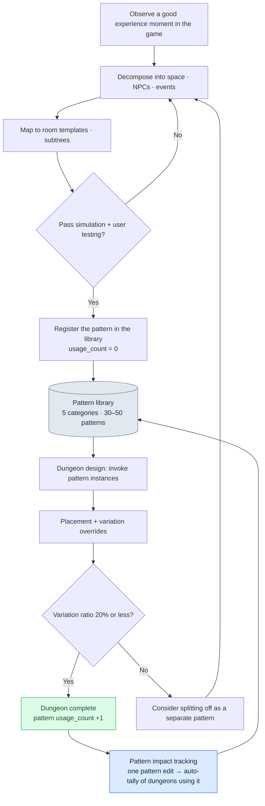

# 7.3 The Dungeon and Field Pattern Library

At a dungeon review, a junior level designer put one of their dungeons up on the screen. A narrow corridor, a fast enemy closing in from behind, a dodge decision at the junction. It was a well-made dungeon. The problem was that it was subtly different from what we had already built in eleven other dungeons. The enemy's pursuit speed, the timing of the trap going off, the moment the junction appears. Not one of them was the same. The junior designer believed they had built an experience with the same name — "pursuit dungeon" — but the sensation players received differed from dungeon to dungeon.

What we decided that day was simple. Define the "corridor pursuit" experience precisely, once, and pin that definition down. The next time someone builds a pursuit dungeon, they don't compose it from scratch — they pull out the codified definition and use it. That was the beginning of the pattern library.

If the room is the unit of space and the Behavior Tree is the unit of behavior, the pattern is the operational unit that binds space, behavior, and events into one. When a single pattern is reused across several dungeons, the production load drops — and more importantly, the experience players receive stays consistent across dungeons.

---

## 7.3.1 The Pattern as an Operational Unit

Think of a recipe in a cookbook — the analogy is exact. One recipe card holds the ingredients, the cooking steps, the heat level, and a photo of the finished dish. Even when the restaurant changes, following the same recipe produces the same taste. Each restaurant is allowed a little variation, though. A pattern is the same. Space (the rooms), behavior (the BT subtrees), incidents (the events), outcomes (reward and difficulty), and the designer's statement of intent go in as one bundle.

<svg viewBox="0 0 720 250" xmlns="http://www.w3.org/2000/svg" font-family="sans-serif" font-size="13">
  <rect x="10" y="10" width="700" height="230" fill="#fafafa" stroke="#ccc"/>
  <text x="360" y="35" text-anchor="middle" font-size="15" font-weight="bold">Pattern = a bundle of five elements</text>
  <rect x="40" y="60" width="120" height="60" rx="6" fill="#e3f0ff" stroke="#5a8fd0"/>
  <text x="100" y="85" text-anchor="middle" font-weight="bold">Space</text>
  <text x="100" y="105" text-anchor="middle" font-size="11">Room metas 1~3</text>
  <rect x="180" y="60" width="120" height="60" rx="6" fill="#e9f7e9" stroke="#6aa86a"/>
  <text x="240" y="85" text-anchor="middle" font-weight="bold">Behavior</text>
  <text x="240" y="105" text-anchor="middle" font-size="11">BT subtrees 1~2</text>
  <rect x="320" y="60" width="120" height="60" rx="6" fill="#fdf3e0" stroke="#d0a05a"/>
  <text x="380" y="85" text-anchor="middle" font-weight="bold">Events</text>
  <text x="380" y="105" text-anchor="middle" font-size="11">event slots</text>
  <rect x="460" y="60" width="120" height="60" rx="6" fill="#fde9ec" stroke="#d05a6e"/>
  <text x="520" y="85" text-anchor="middle" font-weight="bold">Outcome</text>
  <text x="520" y="105" text-anchor="middle" font-size="11">Reward · difficulty rules</text>
  <rect x="600" y="60" width="90" height="60" rx="6" fill="#f0e9fd" stroke="#8a5ad0"/>
  <text x="645" y="85" text-anchor="middle" font-weight="bold">Intent</text>
  <text x="645" y="105" text-anchor="middle" font-size="11">Description</text>
  <text x="360" y="160" text-anchor="middle" font-size="13" font-style="italic">"Corridor pursuit pattern" = narrow corridor + fast-enemy BT + trap event + dodge reward</text>
  <line x1="100" y1="180" x2="620" y2="180" stroke="#999" stroke-width="1"/>
  <text x="360" y="210" text-anchor="middle" font-size="12">→ Once verified, reproduces the same experience across 5~10 dungeons</text>
</svg>

Once a pattern is defined, the same experience can be built consistently in every dungeon — the way a recipe proven once delivers the same taste across many restaurants. Still, even with the same recipe, each restaurant keeps a little variation. How that variation is managed is half of pattern operations. The overrides covered later are where it lives.

---

## 7.3.2 The Pattern Composition Flow

The heart of a pattern library is this: patterns are codified into a rulebook first, and dungeons are then generated by combining them. The designer does not compose a dungeon on a blank screen; they pick verified patterns, place them, and vary only a part.



The left half of this flow (observe → decompose → map → verify → register) is the process of making a pattern; the right half (invoke → place and vary → complete → track) is the process of consuming one. Making happens rarely; consuming happens often. When the library is run well, this asymmetry turns into production efficiency.

---

## 7.3.3 The Five Base Categories

My Project A is in the action-RPG lineage, so it sorts patterns into five categories. This taxonomy is genre-dependent. A horror game would weight ambushes and narrative beats differently; a puzzle game would put environment-driven combat at the center. Don't treat the taxonomy itself as absolute — decide first what your game's core experiences are, then draw the categories.

| Category | Core experience | Examples |
|---|---|---|
| pursuit | Pursuit and escape | Corridor pursuit, canyon escape |
| ambush | Ambush and surprise | Ambush on room entry, blind-spot ambush |
| puzzle_combat | Environment-driven combat | Levers and traps + combat |
| boss_phase | Boss phases | Boss phase 1–3 patterns |
| narrative_beat | Narrative beats | Flashback trigger, ally arrival |

Within the five categories, the pattern count stays roughly between thirty and fifty. There is a reason for that number. Past a hundred patterns, a designer can no longer hold the whole library in their head. At that moment the library becomes a warehouse that takes time to search, and the designer chooses to compose from scratch instead. Once the library starts being shunned, the original goal — consistency — collapses. That is why consciously managing the cap on pattern count matters as much as category design.

---

## 7.3.4 The Format for Pinning a Pattern Down

A single pattern is pinned down as one YAML file. Below is the format actually used on Project A, anonymized. The company-specific asset names and dungeon numbers are masked, but the field structure and the way it is operated are unchanged.

```yaml
---
pattern_id: pattern_corridor_pursuit_v2
category: pursuit
description: A fast enemy pursues from behind in a narrow corridor; the player makes a dodge decision at the junction
tags: [horizontal_corridor, scholar_theme_compatible]
rooms:
  - room_template: corridor_long
    size: medium
    connections_required: 2
  - room_template: junction_3way
    size: small
    connections_required: 3
npc_behaviors:
  - subtree_ref: subtree_aggressive_chase
    count: 2
  - subtree_ref: subtree_ranged_support
    count: 1
events:
  - type: trap_activation
    trigger: room_1_midpoint
  - type: enemy_spawn
    trigger: room_1_entry
difficulty_modifier: 1.2   # 1.2x load relative to a standard room
reward_modifier: 1.3
clear_time_estimate_sec: 60
art_pack_compatible: [scholar_library, generic_dungeon]
narrative_slots:
  - slot: dialogue_during_chase
    constraints: [short_dialogue, fear_emotion]
usage_count: 12            # used in 12 dungeons
last_modified: 2026-05-18
deprecated: false
---
```

This one file defines a piece of each of twelve dungeons at once. That is where the weight of the single line `usage_count: 12` comes from. Editing this pattern means twelve dungeons are affected simultaneously — so touching a pattern file carries a different weight than fixing one room.

References like `subtree_aggressive_chase` and `subtree_ranged_support` point directly to subtrees defined in the Behavior Tree editor of 7.2. The key is that a pattern only references the BT rather than embedding it. Fix a BT, and every pattern referencing that BT follows automatically. Space (room templates) and behavior (subtrees) are managed in their own libraries; the pattern serves only as the combination table that ties the two together. Numbers like `clear_time_estimate_sec` and `difficulty_modifier` are operational values from my environment, not universal constants. Measure them yourself, with your own game's simulation and user testing, and fill them in.

---

## 7.3.5 Instantiating a Pattern into a Dungeon

When designing a dungeon, you do not compose patterns from scratch. You invoke one from the library, specify where it goes, and cover only what differs in this dungeon with overrides.

```yaml
---
dungeon_id: dungeon_021_silvermark_library
pattern_instances:
  - instance: corridor_pursuit_1
    pattern_id: pattern_corridor_pursuit_v2
    placement:
      - room_id: dungeon_021_room_03
        as: corridor_long
      - room_id: dungeon_021_room_04
        as: junction_3way
    overrides:
      - field: npc_behaviors.0.subtree_ref
        value: subtree_scholar_chase   # scholar-theme variant
      - field: events.0.trigger
        value: room_1_2nd_third         # fine-tune trigger position
---
```

Here dungeon 021 uses the "corridor pursuit" pattern as is, but swaps the pursuing enemy from the generic one to a scholar-theme variant, and moves the point where the trap goes off from the middle of the corridor slightly back. 80% of the pattern stays; only 20% is varied.

That ratio has grounds drawn from operating experience. Too little variation (near 0%) and the dungeons feel stale, as if copied from one another. Too much (past 50%) and it is no longer the same pattern. You believe you invoked the same pattern, but the actual experience is completely different — right back to the situation of the dungeon that junior designer brought in. So we keep an operating rule: when one instance's overrides exceed half of the pattern's fields, that is not variation; it is the signal of a new pattern. It's time to split it off as its own.

---

## 7.3.6 What Shakes When You Change One Line

Edit `pattern_corridor_pursuit_v2` and twelve dungeons are affected. Track that by hand and you will, without fail, miss one or two. So we keep a small tool that automatically sweeps the relationships between patterns and dungeons.

```python
# pattern_impact.py
import json
from glob import glob

def find_dungeons_using(pattern_id):
    affected = []
    for d in glob("dungeons/*.json"):
        dungeon = json.load(open(d, encoding="utf-8"))
        for inst in dungeon.get("pattern_instances", []):
            if inst["pattern_id"] == pattern_id:
                affected.append({
                    "dungeon": dungeon["dungeon_id"],
                    "instance": inst["instance"],
                    "has_overrides": bool(inst.get("overrides")),
                })
    return affected
```

In the list this function returns, the key is the `has_overrides` flag. Dungeons without overrides use the pattern as is, so they are safe to update automatically. Dungeons with overrides may have variations of their own that collide with the pattern edit, so they need an additional human review.

Instead of a human feeling out the weight of each edit one by one, the tool reports within 5 minutes: "this edit affects 12 dungeons, and 4 of them carry variations, so look at those directly." Reducing the fear of changing a pattern is this tool's real value. When the blast radius is invisible, designers avoid touching patterns at all, and the library goes stagnant.

---

## 7.3.7 How Patterns Are Born, and Where AI Fits

Let me face the question I get most often here head-on. "Can't we just have AI write the patterns too?"

The answer is clear. No. Writing a single pattern has the designer's insight as its spine. What makes a good pursuit experience, why the junction has to be there, why the trap has to fire at the 2/3 point of the corridor rather than the middle for the tension to hold — these are the judgments of someone who has handled the game directly and watched how players respond. Have AI compose patterns from scratch, and every pattern converges to a bland, average shape. The library fills up with "patterns that aren't wrong" while "patterns that get remembered" disappear.

That doesn't mean AI has nothing to do. Of the five steps of pattern authoring, AI is a powerful assistant at two of them.

| Step | Output | AI's role |
|---|---|---|
| 1. Observe a good experience moment in the game | Notes | Designer alone |
| 2. Decompose that moment into space, NPCs, events | Draft yaml | Designer alone |
| 3. Map to existing room templates and subtrees | Candidate mappings | AI assist (candidate recommendation) |
| 4. Simulation + user testing | Verification | AI assist (running the simulation) |
| 5. Register in the library | usage_count = 0 | Designer alone |

Step 3 is the heart of AI assistance. When a designer writes down a draft — "a fast enemy pursues from behind in a narrow corridor" — it is inefficient for a human to comb through room template and subtree libraries that have already grown to dozens of entries each to find what fits that intent. This is where you have AI recommend mapping candidates. Below is the prompt actually in use, anonymized.

```
[Input]
- The designer's draft pattern yaml (attached below)
- Room template library (list of names + tags + sizes)
- subtree library (list of names + behavior summaries)

Pick and recommend room templates and subtrees from the library to implement this pattern.
2~3 each, with a fitness score of 1~5 and a one-line rationale based on tags and size.
Don't invent anything that isn't in the library — recommendations only; if everything is 3 or below, tell me new authoring is needed.
```

Here is the output Claude actually returned for this prompt. I reproduce it without touching a single character, so you can see exactly where it hesitates and where it asserts.

```
Room template candidates:
1. corridor_long  (fitness 5)
   Rationale: tag horizontal_corridor matches; size medium fits the "narrow corridor" intent.
2. corridor_narrow_short  (fitness 3)
   Rationale: narrow, but too short to secure pursuit distance. Not enough room to place a junction.
3. hall_wide  (fitness 1)
   Rationale: a wide hall is the exact opposite of the "narrow corridor" intent. The pursuit pressure does not hold.

subtree candidates:
1. subtree_aggressive_chase  (fitness 5)
   Rationale: rear-pursuit behavior is defined, with a movement-speed weight.
2. subtree_ranged_support  (fitness 3)
   Rationale: not pursuit itself, but one unit can be placed as pressure support.
3. subtree_patrol_basic  (fitness 2)
   Rationale: patrol behavior does not match the pursuit intent. No pursuit-transition node after the trigger.

Junction room template:
I could not find an entry in the library that satisfies both the 3way junction
and the small size condition at the same time. junction_3way is the closest, but its size tag is empty,
so the fitness cannot be confirmed. Designer confirmation is needed.
```

The last paragraph is the most valuable part of this output. The AI said it was "not certain" about the junction room template, and it did not invent an answer that wasn't there. Receiving this report, the designer discovered that the size tag of `junction_3way` really was empty, and filled in that metadata first. Had the AI ignored the empty tag and assigned a fitness score of 5, the designer would have adopted it on misplaced trust.

This is the correct shape of AI assistance. The AI spreads out candidates and marks uncertainty; the choice and the responsibility stay with the designer. When every mapping comes back with low fitness, a separate task — writing a new template — is created, and that writing is once again a human's job.

> **[Directional signpost — compressing patterns into an "experience vector" (still premature)]** Read this as a research trend, not a prescription. §7.3.1 already calls a pattern a "recipe." A pattern is close to a coordinate value — room meta, behavior subtree, event, difficulty/reward_modifier, and clear_time bundled as one. Compress that bundle into an "experience vector," and instead of combing through the flow above entry by entry when every fitness score comes back low, you could locate the new pattern as an empty region of the compressed space; the deprecated verdicts of §7.3.8 could likewise be reinforced by reading near-duplicates as coordinate distance. Three caveats attach. difficulty/reward_modifier are, as §7.3.4 says, my operational values — the axis scales differ per game, so the compressed space cannot be transplanted as is; interpolation goes only as far as "flagging" the blank, not "generating" the pattern; and actually composing the pattern on top of that flag still does not cross this section's principle that the designer's insight is the spine. The idea sits in the same spot as the dimensional-vector compression of §8.2.7, and the conceptual intuition is in Appendix M — left as territory for a team with foundations well laid to look into a few years from now.

---

## 7.3.8 Retiring Unused Patterns

A library is harder to empty than to fill. Operate one for about a year and patterns pile up that were made but almost never used. Leave them and the cost of searching the library climbs, and designers have to wade past dead options every time they pick a pattern. So we retire them regularly.

| Condition | Action |
|---|---|
| No usage_count increase for 6 months | Classified as a deprecated candidate |
| Retirement decided at the review meeting | Marked `deprecated: true` |
| Dungeons already using it | Preserved as is (historical preservation) |
| New dungeons | Use of that pattern prohibited |

The key point is that deprecation is not deletion. Dungeons already using the pattern stay as they are. Touching dungeons running in a live service is riskier than blocking a new pattern. `deprecated: true` is only a sign that says "don't start using this from now on," not an order to erase the past.

Just as you pull the unused tools out of a desk drawer once a quarter and sort them, put a once-a-quarter retiring pass for the library on the calendar. Without that schedule, the library swells in one direction only, and at some point it becomes a warehouse designers turn away from.

---

## 7.3.9 Measuring the Effect Honestly

These are the changes I observed over one year of operating the pattern library on my Project A. The time figures in the table below are estimates from my environment (unverified); only the direction and the relative ratios were actually observed.

| Item | Before | After | Notes |
|---|---|---|---|
| Design time per dungeon | About 2 weeks | About 1 week | Author's estimate; the direction is clear |
| Experience consistency across dungeons | High variance | Stable | Based on user evaluation; qualitative |
| Average dungeons using each pattern | — | About 8 | The key metric of production efficiency |
| New designer onboarding | About 2 months | About 3 weeks | Author's estimate; the biggest felt effect |
| Grasping the impact of a pattern change | 1–2 days by hand | Automated 5-minute report | Effect of introducing pattern_impact.py |

The most striking change is the second-to-last row: onboarding new designers. The pattern library unintentionally took on the role of a design textbook. Once a new designer could read "this is how this game builds its pursuit experience" from a single pattern file and understand it, the time a senior spent sitting beside them explaining dropped sharply. The problem of the mismatched dungeons that junior designer first brought in was, in the end, resolved by the library itself.

The figure "about 8 dungeons using each pattern on average" means the same pattern was reused eight times, and that is the honest yardstick of production efficiency. But this value of 8 is bound to my game's dungeon scale and pattern design. In a game with few dungeons, or one that demands a wholly different concept every time, this value comes out far smaller.

---

## 7.3.10 The Decision Not to Build a Library

Finally, honesty demands a point that overturns this entire chapter. A pattern library is not a cure-all. There are clearly environments where the cost of building and operating one is never recovered.

| Condition | Recommendation |
|---|---|
| Fewer than 5 dungeons | Hands are enough; no library needed |
| One designer | Your head is the library |
| Single launch, no live ops | Few reuse opportunities to begin with |
| A completely different concept every time | Low reuse ratio; ROI never recovered |

The library's ROI (return on investment) is recovered only when three conditions hold together: there is live ops, there are three or more designers, and the dungeon count passes twenty. That is why a live-service MMORPG is the archetypal fit. If your project lands on any row of the table above, stop before building a library and think again. A tool has value only where there is a problem — and for a five-dungeon project, a pattern library costs more than the problem.

---

## 7.3.11 Common Failures and Remedies

| Symptom | Remedy |
|---|---|
| Patterns exceed 100 and designers can't memorize them | Trim to 30–50; retire deprecated ones quarterly |
| Pattern impact tracked by hand (omissions occur) | An automatic tracking tool like pattern_impact.py |
| Overrides exceed 80% (no real reuse) | Variation too large → split into a separate pattern |
| Pattern authoring delegated wholesale to AI | Authoring is designer insight; AI assists only at steps 3 and 4 |
| usage_count not measured | Automatic tally + review in the quarterly retrospective |
| No library explanation for new designers | Include a library tour in onboarding materials |

The second and fourth rows of this table trip teams up most often. Skip automating impact tracking and designers grow afraid of editing patterns, so the library hardens; delegate authoring to AI and the library converges to the average. Both failures kill the library's lifeblood — the reuse of verified experiences.

---

## 7.3.12 Closing Part 7

Part 7 stacked the level discipline up in three tiers. 7.1 set the standards for room metadata, tags, and connectivity (space); 7.2 covered the json-based Behavior Tree editor, subtrees, and simulation (behavior); and this chapter arrived at the pattern library, which bundles those two together with events for reuse (the operational unit). The through-line of all of Part 7 is this: in an operation that handled space and behavior separately, the same decision in the same place wobbled into a different shape every week — and that problem was solved by pinning it down in the bundle called a pattern.

This flow meshes directly with Layer integration. The vision — the spatial tone of the whole game — sits on top; below it sit the systems, the level generation rules and BT rules; rooms, BTs, and the pattern library form the content layer; dungeon instances and pattern usage statistics accumulate as data; and lint, simulation, and user telemetry verify it all at build/QA. Among these five layers, the pattern library is the spine of the content layer — and at the same time the connecting link that follows the system rules above it and generates the data statistics below it.

---

### Key Takeaways
- A pattern is the operational unit that bundles space, behavior, and events; handle the three separately and the same experience wobbles differently every week
- 80% reuse + 20% variation is the recommended ratio; when variation passes half, that is the signal of a new pattern
- Pattern authoring is the place for designer insight; AI goes only as far as recommending mapping candidates and assisting simulation

### Next Chapter Preview
- 8.1 Operating CombatBalance · CombatFormula — The Two-Document Split of Balance Design

---

## Try It Yourself — Pin Down One Pursuit Pattern

### setup
1. Create two directories, `patterns/` and `dungeons/`, in your working folder.
2. Prepare a file each for your room template names and subtree names, one name per line of text. (If you don't have a library yet, starting with 5 made-up names each is fine.)
3. Save `pattern_impact.py` from the body text as is.

### prompt
The designer writes the draft pattern yaml directly (this part is the human's job). Then hand only the mapping to the AI. Use the mapping prompt from the body text as is, attaching your own draft and the two library lists as input. Do not leave out the two key constraint lines.

```
- Do not invent new templates that are not in the library. Recommendations only.
- If all fitness scores are 3 or below, state explicitly that new authoring is needed.
```

### verify
1. Check line by line that the AI did not invent template names that are not in the library.
2. See whether each fitness score carries a rationale based on tags and size. Do not trust a score without a rationale.
3. Instantiate the pattern into 2 or more dungeons, run `find_dungeons_using("pattern_...")`, and confirm that exactly those two dungeons are caught.

### Solo Scale-Down
If you are building a small game alone, a library system is overkill. Instead, pick the one dungeon segment you like most and write that experience down as a single yaml file — that alone is enough. When you build the next dungeon, open that one file, copy it, and change only 20%. The essence of a pattern library — the reuse of verified experiences — works even in a single file. When the scale grows, add the categories and the tracking tool then.
