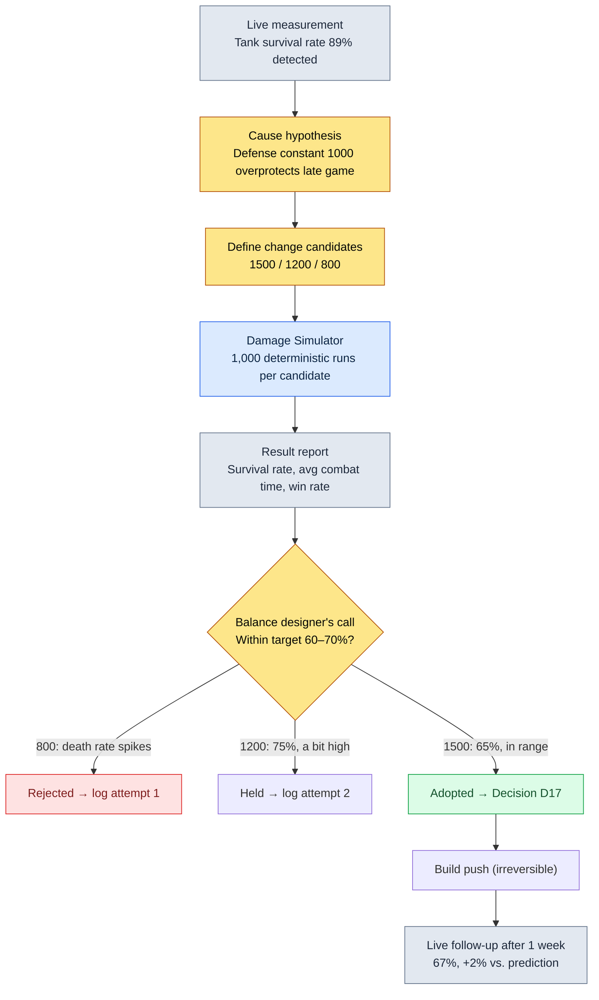

# 8.1 The Combat Balance Formula — The Seat of the Rulebook Called Determinism

> **Learning Goals for This Chapter** (difficulty 🟡 practitioner · prerequisites: basic arithmetic and spreadsheet math): Separate combat balance into a formula seat and a numbers seat, and use two properties — determinism and traceability — to tell how far AI can be trusted and where humans must lock things down as a rulebook.

At 2 a.m., an alert came in: the tank class's survival rate on the live server had hit 89%. No tank was failing to finish a boss, and far too many tanks simply weren't dying. I open the data sheet looking for traces of whoever touched it. One line of the defense factor catches my eye: `DEF / (DEF + 1000)`. Nowhere in the sheet does it say when, by whose hand, or on what grounds that 1000 came down from 1200. A hunt begins — through chat logs, through build history — that ends only when it reaches the memory of a balance designer who left the company three years ago.

Anyone who has run combat balance on a live game goes through this scene at least once. And the real cause of the scene is not that the number 1000 was wrong. It is that the number lived in the **formula**'s seat, while the **history** of the formula changing existed nowhere. The combat balance formula is the domain of a game that must be the most deterministic, and the most traceable. Why these two properties become the reason AI must not be let into this seat is the spine of this chapter.

> **One line for non-specialists.** If the z-scores, simulations, and curves in this part feel unfamiliar, that's okay. The single thing to take away is this — **"Where a rule (a formula) must return the same output for the same input, AI does not go in."** The judgment that separates the seats that need determinism from the seats that need exploration carries straight over to any job that handles rules that must not be wrong — accounting policies, settlement logic, contract clauses. You can take the math itself slowly, starting at 8.1.2.

---

## 8.1.1 The Formula Is a Rulebook

Do game design long enough and two kinds of documents settle into your hands: the ones that change often, and the ones that almost never do. In combat balance, the side that almost never changes is the formula. "How is damage calculated" gets touched once or twice a quarter; "what is this character's attack power" gets touched five or six times a week. Bind two flows of such different frequency into one file, and the hands that open it daily end up tearing the paper that should only open once in a while.

On Project A, which I run, combat balance is split into two seats: the formula's seat (called `CombatFormula` here) and the numbers' seat (`CombatBalance`). Here is one line that lives in the formula's seat, quoted as is.

```
final_damage = base_damage × dmg_multiplier × (1 − defense_factor) × variation

  base_damage    = skill_base × ATK × skill_coeff
  defense_factor = DEF / (DEF + 1000)
  variation      = uniform(0.95, 1.05)
```

This formula is a rulebook. Think of a board game's rules. The rules say "move as many spaces as the die shows"; they do not say "this round, if your luck is good, you may go a bit farther." Same input, same output — always. That is determinism. Put in an attack of 180, a defense of 80, and a skill coefficient of 2.1, and the same damage must come out no matter when, where, or how many times you compute it. If the same input ever produces a different output, you don't have a balance tool — you have a slot machine.

This single property, determinism, is the first reason AI must not enter this seat. We will come back to it shortly. First, let's look at what a formula has to look like to deserve the name rulebook.

The core of a combat formula does not end with one damage line. At least three lines live as a set.

```
# Damage
final_damage = base_damage × dmg_multiplier × (1 − defense_factor) × variation

# Critical hit
crit_damage  = final_damage × crit_multiplier
crit_chance  = base_crit + (LUK × 0.1)            # cap 50%

# Healing
heal         = base_heal × healing_power × (1 − sickness_factor)
```

There is a reason these three lines are written as a code block rather than prose. Natural language leaves room for interpretation. "Higher defense reduces damage" does not say whether the reduction is linear or curved, or where it stops. `DEF / (DEF + 1000)` reads exactly one way. A rulebook's job is to drive the room for interpretation down to zero.

---

## 8.1.2 The Curve Defines the Determinism

The single line of the defense factor, `DEF / (DEF + 1000)`, holds this game's entire balance philosophy. Graph it and you can see why. The horizontal axis is defense; the vertical axis is the fraction of incoming damage it removes.

<svg viewBox="0 0 640 320" xmlns="http://www.w3.org/2000/svg" font-family="sans-serif">
  <rect x="0" y="0" width="640" height="320" fill="#ffffff"/>
  <!-- axes -->
  <line x1="70" y1="270" x2="610" y2="270" stroke="#333" stroke-width="1.5"/>
  <line x1="70" y1="270" x2="70" y2="30" stroke="#333" stroke-width="1.5"/>
  <!-- y gridlines -->
  <line x1="70" y1="150" x2="610" y2="150" stroke="#e0e0e0" stroke-width="1"/>
  <text x="40" y="275" font-size="12" fill="#666">0%</text>
  <text x="34" y="155" font-size="12" fill="#666">50%</text>
  <text x="34" y="55" font-size="12" fill="#666" >~91%</text>
  <text x="300" y="300" font-size="13" fill="#333">Defense DEF →</text>
  <!-- x ticks -->
  <text x="60" y="288" font-size="11" fill="#666">0</text>
  <text x="190" y="288" font-size="11" fill="#666">1000</text>
  <text x="320" y="288" font-size="11" fill="#666">2500</text>
  <text x="470" y="288" font-size="11" fill="#666">5000</text>
  <text x="585" y="288" font-size="11" fill="#666">10000</text>
  <!-- DEF/(DEF+1000) curve: x in [0,10000] mapped to [70,610]; y reduction in [0, ~0.909] mapped to [270, 50] -->
  <path d="M70,270 C 110,180 160,140 200,135 C 280,124 360,98 470,78 C 540,66 580,58 610,52"
        fill="none" stroke="#c0392b" stroke-width="2.5"/>
  <!-- diminishing-return marker at DEF=1000 (50%) -->
  <circle cx="200" cy="135" r="4" fill="#c0392b"/>
  <line x1="200" y1="135" x2="200" y2="270" stroke="#c0392b" stroke-width="1" stroke-dasharray="4 3"/>
  <text x="208" y="128" font-size="11" fill="#c0392b">50% damage reduction at DEF=1000</text>
  <!-- linear ghost for contrast -->
  <line x1="70" y1="270" x2="430" y2="50" stroke="#95a5a6" stroke-width="1.5" stroke-dasharray="5 4"/>
  <text x="430" y="48" font-size="11" fill="#95a5a6">(if linear — not adopted)</text>
  <text x="120" y="240" font-size="11" fill="#c0392b">Steep early on</text>
  <text x="470" y="100" font-size="11" fill="#c0392b">Flattens late (diminishing returns)</text>
</svg>

The curve approaches its asymptote slowly. At 1000 defense it cuts damage exactly in half, and beyond that, no amount of defense ever reaches 100%. The impossibility of invincibility is built into this one line. Had it been linear, like the gray dashed line, 1000 defense would block all damage, and anything above that crosses into the nonsense territory of negative damage — healing from getting hit. That is why linear was not adopted.

Now go back to the 2 a.m. incident. Suppose someone raises this 1000 to 1200. The whole curve shifts right. The same defense now blocks less damage, so every tank in the game gets weaker and damage dealers' damage per second goes up. **One constant in the formula shakes the entire game.** The blast radius is nothing like changing a single number — one character's attack power. That difference is why formulas and numbers must live in separate seats, and why a formula change must always carry its history.

---

## 8.1.3 Every Formula Change Carries a History

The 2 a.m. hunt was hell for exactly one reason: there was no change history. On Project A, changing a formula is not the act of editing a line of code — it is **the act of recording one decision**. A separate document named `CombatFormula_Decisions` travels alongside the formula, and an entry reads like this.

```markdown
## Decision D17 (2026-04-22)
- Change: defense_factor from DEF/(DEF+1000) → DEF/(DEF+1500)
- Reason: Tank survival rate 89% in the high-level range (LV40+) (live measurement). Cause of boss fights dragging on.
- Attempt 1: Simulated with 800 → tank death rate spiked, many full wipes within 1 minute of boss entry → rolled back
- Attempt 2: Simulated with 1200 → survival rate 75% → decent but above target (60~70%)
- Attempt 3: Adopted 1500 → simulated survival rate 65% (within target range)
- Affected atoms: combat_defense_formula, combat_tank_class_balance
- Follow-up measurement (1 week): live survival rate 67% (+2% vs. simulated prediction of 65%, within range)
```

This one entry answers the "why is it like this" question six months later. More important, attempts 1 and 2 survive. When the record shows why 800 failed and why 1200 was not adopted, the next person does not repeat the same mistakes. When a new balance designer joins, a stack of these decision logs is the best onboarding material there is.

One thing needs saying honestly here. The simulation figures in attempts 1–3 above (the death rates, the 75% and 65% survival rates) are the **author's estimates (unverified)**, shown to illustrate the flow of operations. Every real game has its own curve and its own target range. But the **structure** — every change carries attempts, every attempt carries simulation evidence, every adoption is followed by a live measurement — is exactly how real operations run. Leave even one cell of that structure empty, and the empty cell comes back as a 2 a.m. hunt.

Here are the three seats — formula, numbers, history — at a glance.

<svg viewBox="0 0 660 280" xmlns="http://www.w3.org/2000/svg" font-family="sans-serif">
  <rect x="0" y="0" width="660" height="280" fill="#ffffff"/>
  <!-- CombatFormula -->
  <rect x="30" y="40" width="180" height="120" rx="8" fill="#fdecea" stroke="#c0392b" stroke-width="1.5"/>
  <text x="120" y="66" font-size="14" text-anchor="middle" fill="#c0392b" font-weight="bold">CombatFormula</text>
  <text x="120" y="88" font-size="11" text-anchor="middle" fill="#333">Formula (rulebook)</text>
  <text x="120" y="110" font-size="11" text-anchor="middle" fill="#666">Changed 1~2 times/quarter</text>
  <text x="120" y="130" font-size="11" text-anchor="middle" fill="#666">Determinism · AI off-limits</text>
  <text x="120" y="150" font-size="11" text-anchor="middle" fill="#666">Impact: entire game</text>
  <!-- CombatBalance -->
  <rect x="240" y="40" width="180" height="120" rx="8" fill="#eaf2fb" stroke="#2c6fbb" stroke-width="1.5"/>
  <text x="330" y="66" font-size="14" text-anchor="middle" fill="#2c6fbb" font-weight="bold">CombatBalance</text>
  <text x="330" y="88" font-size="11" text-anchor="middle" fill="#333">Numbers (sheet)</text>
  <text x="330" y="110" font-size="11" text-anchor="middle" fill="#666">Changed 5~10 times/week</text>
  <text x="330" y="130" font-size="11" text-anchor="middle" fill="#666">Passes simulation gate</text>
  <text x="330" y="150" font-size="11" text-anchor="middle" fill="#666">Impact: that character</text>
  <!-- Decisions -->
  <rect x="450" y="40" width="180" height="120" rx="8" fill="#eafaf1" stroke="#27865a" stroke-width="1.5"/>
  <text x="540" y="66" font-size="14" text-anchor="middle" fill="#27865a" font-weight="bold">_Decisions</text>
  <text x="540" y="88" font-size="11" text-anchor="middle" fill="#333">Decision history (log)</text>
  <text x="540" y="110" font-size="11" text-anchor="middle" fill="#666">1 entry per change</text>
  <text x="540" y="130" font-size="11" text-anchor="middle" fill="#666">Reason · attempts · follow-up</text>
  <text x="540" y="150" font-size="11" text-anchor="middle" fill="#666">Key onboarding material</text>
  <!-- arrows -->
  <line x1="210" y1="100" x2="240" y2="100" stroke="#888" stroke-width="1.5" marker-end="url(#ah)"/>
  <line x1="120" y1="160" x2="120" y2="200" stroke="#27865a" stroke-width="1.5" marker-end="url(#ah)"/>
  <line x1="540" y1="160" x2="540" y2="200" stroke="#27865a" stroke-width="1.5" stroke-dasharray="4 3"/>
  <path d="M120,205 L540,205" stroke="#27865a" stroke-width="1.5" fill="none"/>
  <path d="M540,205 L540,162" stroke="#27865a" stroke-width="1.5" fill="none" marker-end="url(#ah)"/>
  <text x="225" y="225" font-size="11" text-anchor="middle" fill="#27865a">One formula change → one decision log entry (reason · attempts · follow-up attached)</text>
  <defs>
    <marker id="ah" markerWidth="8" markerHeight="8" refX="6" refY="3" orient="auto">
      <path d="M0,0 L6,3 L0,6 Z" fill="#888"/>
    </marker>
  </defs>
</svg>

---

## 8.1.4 How One Formula Change Actually Flows

Now let's follow how D17 was decided, from the beginning. This is how a deterministic rulebook moves in practice.



Look carefully at the simulator's role in this flow. The `Damage Simulator` runs each of the three candidates 1,000 times. Those 1,000 runs are not the same input repeated 1,000 times. The ±5% randomness of `variation = uniform(0.95, 1.05)` inside the formula, plus the separate randomness of critical hit chance, makes every round come out differently. You run 1,000 rounds to see the **distribution**: average survival rate, worst case, the spread of combat duration.

What matters is that the simulator itself must be deterministic. Given the same random seed, all 1,000 rounds must reproduce without a single digit out of place. Only then can D17's one line — "1500 produced 65%" — be reproduced and verified identically six months later. A simulator that returns different results every time turns the decision log into a lie.

I first built this damage simulator in 2008. Back then it was an Excel macro; on Project A today it is encapsulated as the `balance-sim` skill. In 18 years the tool's shell has changed, but the rulebook inside has never once been probabilistic. That is the point.

---

## 8.1.5 Why AI Is Strictly Off-Limits for Reward Curves and Formulas

Now we arrive at what this chapter most wants to say. At a time when AI is entering nearly every seat in game design, there is exactly one seat it must never enter: the deterministic core of combat formulas and reward curves.

An LLM is probabilistic by nature. Ask it the same question and the answer shifts a little every time. That is the source of its power for good writing and ideas, and it is fatal in the rulebook's seat. Make an LLM answer "how much damage does a character with 80 defense take?" and it may say 92 today and 94 tomorrow. That is a board game whose dice change meaning every time you turn a page of the rules.

Reward curves are more dangerous still. "XP required from level 30 to 31," once set, governs the progression speed of hundreds of thousands of players at once. Let even a ±2% wobble in, and some players grow slower than the person next to them doing the exact same hunts. Fairness collapses. Determinism is another word for fairness. So reward curves are set by human hands, entered into the sheet, and never again left to probability.

This does not mean banishing AI from the balance domain entirely. The boundary is the point.

| Area | AI | Why |
|---|---|---|
| Computing damage and healing formulas | Strictly off-limits | Deterministic core. Break "same input = same output" and you have a slot machine |
| Reward and XP curves | Strictly off-limits | Governs hundreds of thousands of players' progression at once; any wobble collapses fairness |
| Simulator internals | Strictly off-limits | If runs can't be reproduced, the decision log becomes a lie |
| Detecting anomalies in simulation results | Allowed | z-score detection of "this character is out of range" across 1,000 results |
| Exploring change candidates | Allowed | Bounded exploration like "propose 5 candidates within base_atk ±10%" |
| Drafting decision log entries | Allowed | Meeting notes → draft Decisions entry (human review) |
| Summarizing follow-up reports | Allowed | Natural-language summaries of live data |

The line is clear. **AI lives only outside the deterministic core.** The inside — computing and simulating — is the rulebook; the outside — analyzing, proposing, putting things into words — is AI's seat. Cross the line once, and the same input starts producing different results; from that moment, the balance tool loses trust.

This boundary has the same structure as the economy systems we will see in 8.2. There too, the resource production and consumption formulas are deterministic, and detecting inflation patterns is AI's seat. The entire balance discipline moves on the same skeleton.

---

## 8.1.6 One Step Further — A Progressive Setup Where z-Scores Propose Candidates

So far this has been the conservative application: humans create the candidates and the simulation verifies them. Go one step further, and even creating candidates can be handed to tools. The rulebook, though, still belongs to humans and to determinism.

Anomaly detection is the starting point. From the 1,000-round simulation results, look at the distribution of each character's win rate and survival rate, and measure how many standard deviations each sits from the mean — the z-score. Characters with z above 2 are flagged automatically as "outside normal range." The 2 a.m. tank would have been caught by this detection too.

For detection to lead to candidate proposals, two more things are needed. First, **a defined change space**. Put a column like `tunable_range` in the CombatBalance sheet to state explicitly within which range each number may be touched. Second, **parallelized simulation**. Running 10 candidates × 1,000 rounds = 10,000 rounds within the build gate window — the automated quality-gate step a build must pass before it ships — takes parallel infrastructure.

With these three in place — z-score detection, a defined change space, parallelized simulation — the decision left in the balance designer's hands narrows to one: which candidate to adopt. Creating candidates from zero and choosing among five are very different burdens. Here too, AI touches only candidate proposals and report interpretation; the computation inside the simulation and the adoption decision remain the seats of determinism and of humans.

One last point: reversibility. Editing the sheet and running the simulation are both reversible — you can undo them as much as you like. The single irreversible seat is the build push. The moment players see a number that went live, it lives on as community reaction; roll it back and the trace still remains. That is why every sign-off finishes just before the build push, while everything is still reversible.

---

## Try It Yourself — Handling One Formula Change Safely

**setup.** Create a `CombatFormula` document that separates the combat formula from prose and records it only as code blocks, plus an empty `CombatFormula_Decisions` log document next to it. Split the numbers out into a separate sheet (`CombatBalance`).

**prompt.** Use AI only for **analysis and drafts**, never for the formula change itself. For example, hand it the simulation result CSV and ask like this.

```
From the attached 1,000-run simulation results, compute the z-score of each
character's win rate and organize characters with z>2 into a table. For each
character, estimate — with evidence — which number (attack/defense/skill coefficient)
is most likely the cause of the anomaly. Do not fix the numbers themselves — propose candidates only.
```

**verify.** Do not take AI's candidates on faith. Enter the candidate numbers into the `CombatBalance` sheet yourself, and rerun 1,000 rounds with `Damage Simulator` (or `balance-sim`) using the same seed. Check two things: (1) does the simulation result land in the target range, and (2) does one more run with the same seed reproduce it without a single digit out of place? If both pass, adopt — and the moment you adopt, write the rationale, the attempts (including rejected candidates), and the predicted values into `_Decisions`. One week after the build push, append the live measurement to that log.

### Solo Scale-Down

Even as a solo developer with no team and no simulator, the same skeleton works. Record the formula as code blocks in code comments or a single `.md` file, and put a `## 변경 이력` (change history) section at the bottom of that file. Whenever you change even one formula constant, write one line with the date, the reason, and the value before the change. A 30-line Python loop is enough of a simulator. Fix the random seed, feed character numbers into the formula, run it 1,000 times, and print just the average win rate — that alone moves you from "I changed it on gut feel" to "I changed it on evidence." Use AI only to read that output CSV and summarize which characters look abnormal. The one thing you must never do, at any scale, is have an LLM compute a single line of the formula.

---

### Key Takeaways

- A combat formula is a rulebook that returns the same output for the same input; the moment that determinism breaks, the balance tool becomes a slot machine.
- Every formula change must carry a decision history — rationale, attempts, follow-up measurement — or no one can answer the "why is it like this" question six months later.
- AI lives only outside the deterministic core (anomaly detection, candidate proposals, reports) and never enters formula computation or reward curves.
