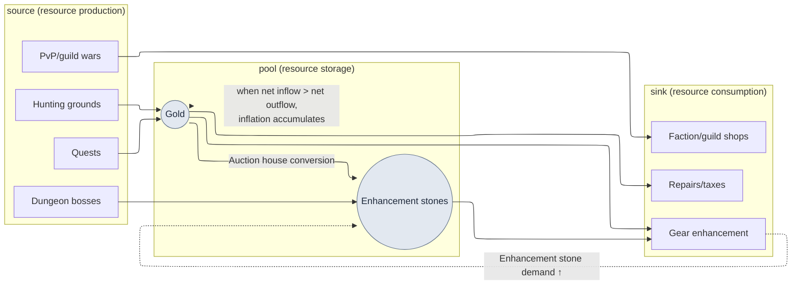

# 8.2 The Economy Model in Machinations — Catching Inflation with Simulation, Not Meetings

> Primary audience: MMORPG balance/systems designers responsible for a live economy (mid-size teams of 10–50)
> Scaled-down version for solo/hobbyist readers: §8.2.10, "If You're Solo, Just This Much"

The first place I learned that gold was leaking was not an invoice — it was the auction house. Two months after launch, the price of enhancement stones crept up; a month later it had doubled. I called a meeting to find the cause, and everything that came out of that room was a feeling. Someone said the new dungeon rewards were too generous. Someone said hunting-ground efficiency had gone up. Someone said it was simply that we had more high-level players now. All of it was plausible, so nothing got decided. We burned an hour on guesses and ended with "let's look at more data next week."

The problem is that there is never just one resource. Gold, enhancement stones, reputation, honor, and soul stones each have sources (ways in) and sinks (ways out), and those paths feed each other. The boss that drops enhancement stones drops gold too. The gear you buy with gold burns enhancement stones. With five resources tangled into dozens of flows, no mental calculator can honestly produce even a single resource's one-week balance. This chapter is about moving that tangle into a **Machinations node model**, and about passing economy change decisions through a **simulation gate** — the economy's version of a quality gate, where the pass/fail verdict comes from a simulation run instead of meeting-room guesswork. The general theory of economy design is well covered in other books; this chapter stays focused on *running that theory as an AI workflow*.

> **Author's Note on Actual Operations**
> The case in this chapter is an anonymized version of an economy pilot document (`Economy_Machinations_Pilot`) and an economy research workspace that I run in my company's R&D folder. The resource types, the source/sink structure, and the four-stage Pilot faithfully reflect actual operations; company-specific names and raw figures have been replaced for the book or stated only as ratios and directions. The AI output text is a reconstruction of real sessions.

---

## 8.2.1 An Economy Is Not 'Five Resources' but 'Dozens of Flows'

Write the economy's resources in a table and you get five rows — it looks simple. The trap is not the resources but the number of **flows** connecting them.

| Resource | source (in) | sink (out) |
|---|---|---|
| Gold | Hunting, quest rewards, auction house sales | Gear purchases, enhancement, repairs, taxes |
| Enhancement stones | Dungeon bosses, events | Gear enhancement, fusion |
| Reputation | Side quests | Faction shop, class change |
| Honor | PvP, guild wars | PvP shop, guild facilities |
| Soul stones | Boss kills | Character resurrection, skill learning |

Five resources — but the sources and sinks together number twenty-some, and on top of that the resources convert into one another (the auction house where gold buys enhancement stones is both a gold sink and an enhancement-stone source). The moment flows feed each other, a question like "what happens to enhancement stone prices if we release 5% more gold" has no answer from looking at one resource alone. This is where economy balance differs decisively from character balance (8.1). Character balance closes in a single formula; an economy is a **dynamic system that accumulates over time** — even if the one-week balance is near zero, let it accumulate for 26 weeks and the auction house collapses.

So the essence of economy work is not "picking the numbers well" but **"watching, in simulation, how the flows accumulate over time."** And building and revising that simulation model by hand is tedious, and something gets missed every time. Repetitive, omission-prone drafting whose review must stay firmly in human hands — this is exactly the grain of work where the division of labor between AI and humans draws itself most cleanly.

First, the skeleton of the economic loop this chapter deals with, in a single diagram.



The dotted lines are the heart of this chapter. The enhancement sink pulls up demand for enhancement stones and pushes their price (`UP -.-> S`), and when gold's net inflow exceeds its net outflow, the surplus piles into the pool week after week and accumulates as inflation. Tracking these two dotted lines by hand calculation is impossible — which is why you need a model.

---

## 8.2.2 Machinations — A Tool That Turns an Economy into a Node Graph

Machinations is a tool that draws economic flows as a node graph and runs simulations on top of it. This is where the mermaid diagram of §8.2.1 becomes a model you can actually run.

| Node | Role | In the diagram above |
|---|---|---|
| Pool | Resource store | Gold, enhancement stones |
| Source | Resource production | Hunting, quests, bosses |
| Drain | Resource consumption | Enhancement, repairs, shops |
| Converter | Resource conversion | Auction house (gold→enhancement stones) |
| Trigger | Conditional activation | Events, rank-up rewards |

Model the economy with these nodes and run the simulation 1,000 times, and you get a distribution rather than a single result — something like "median gold price at 26 weeks: +X%; top 10% of users: +Y%." That said, Machinations is no panacea, and adopting it is itself a cost.

| Limitation | Remedy |
|---|---|
| Runs separately from the game code, so the two drift out of sync | Calibrate monthly/quarterly against real telemetry (§8.2.6) |
| Readability collapses as the node graph grows | Split into per-resource subgraphs; start with a single resource (§8.2.4) |
| The simulation uses a simplified user model | Calibrate with real behavior distributions; set an error threshold |
| Interpreting the results depends on domain knowledge | Standardize the gate that turns simulation numbers into decisions (§8.2.5) |

So Machinations is not a tool you adopt unconditionally. It pays off when three conditions overlap: **five or more resources + resource conversion flows + live ops**. A simple economy of two or three resources is perfectly fine in Excel, and in that case the operating burden of Machinations arrives before the benefit does.

---

## 8.2.3 [Worked Transcript] Drafting a Single-Resource Gold Model with AI

A tool description alone cannot tell you what this actually produces. Here is one full cycle of moving gold — gold alone — into a Machinations model, followed from the input prompt all the way to the human veto. The input prompts can be copied and used as-is; the outputs are reconstructions of real sessions.

### Stage 1 — Input: Gold Flows as a Table a Machine Can Read

First, pull gold's sources and sinks out of the data sheets into a table. This is extraction, not writing from scratch. The yaml below lists gold's three sources and four sinks; the comments note that the auction tax is the one sink that truly recovers gold, and that user-behavior distributions (kills per hour, quest completion rate) are still empty — so the AI must flag any assumptions it makes.

```yaml
# gold_flows.yaml — gold single-resource flows (excerpt from the current data sheets)
resource: gold
sources:
  - id: hunting        # hunting-ground drops
    trigger: per_kill
    note: per-level-band drop curve follows the reward_curve rule
  - id: quest_reward   # quest rewards
    trigger: per_complete
  - id: market_sell    # auction house sales
    trigger: per_trade
sinks:
  - id: gear_buy       # gear purchases
  - id: enhance        # enhancement costs
  - id: repair         # repairs
  - id: tax            # auction house tax (a sink, and the key gold recovery)
# user behavior distributions (kills per hour, quest completion rate) still empty → make the AI flag any assumptions it makes
```

### Stage 2 — The Prompt: Ask for the Model, but Force Assumptions and Format

```
The attached gold_flows.yaml holds the 3 sources and 4 sinks of gold as a single resource.
Draft the node specification for moving this into a Machinations model.

Rules:
1) Classify each flow by node type (Source/Drain/Pool/Converter).
2) For each node, propose a formula for 'expected weekly flow per user';
   whenever a user-behavior assumption is needed (kills per hour,
   quest completion rate, etc.), state it on its own line marked '★assumption'. Do not hide assumptions in the body.
3) Separate total source inflow from total sink outflow and compute the one-week net balance (net).
4) Reflect that the auction house tax (tax) is the only sink that permanently
   removes gold from the economy, and distinguish that the other sinks
   (enhancement, repairs) merely move gold to NPCs — not recovery.
5) ★-flag every assumption you are 'not confident' about and hand it to a human decision.

Output format: a table (node | type | weekly flow formula | assumption | confidence). No other commentary.
```

The prompt (in Korean above) lays down five rules: classify each flow by node type (Source/Drain/Pool/Converter); propose a formula for each node's expected weekly flow per user, putting every user-behavior assumption on its own line marked "★assumption" rather than burying it in the text; compute the one-week net balance with total source inflow and total sink outflow separated; reflect that the auction tax is the only sink that permanently removes gold from the economy, while the other sinks (enhancement, repairs) merely move gold to NPCs; and ★-flag every assumption it is not confident about, handing those to a human decision. Output format: a table only — node | type | weekly flow formula | assumption | confidence.

What actually takes up space in this prompt is not the instruction to build the model but the rules about where and how to record assumptions. Give AI free rein in economy modeling and it spits out plausible numbers with the assumptions buried. Then, when the model is wrong, you cannot point to *where* it is wrong. **Forcing the user-behavior assumptions out of the body text and onto their own marked lines** — that is where the entire weight of this request rests. An assumption you can see is an assumption you can verify.

### Stage 3 — Claude's Output (Reconstructed, Excerpt)

```
| Node         | Type      | Weekly flow formula                     | Assumption        | Confidence |
|--------------|-----------|----------------------------------------|------------------|-------|
| hunting      | Source    | kills/h × avg drop × weekly play hours  | ★15h/wk, 80 kills/h| Mid  |
| quest_reward | Source    | daily quests × reward × 7 × completion rate | ★completion rate 0.7 | Mid |
| market_sell  | Source    | (user-to-user transfer — not net gain)  | 0 net contribution to the economy | High |
| gear_buy     | Drain     | purchase frequency × avg price           | ★1.2/wk          | Low   |
| enhance      | Drain     | enhancement attempts × cost per attempt  | ★8/wk            | Mid   |
| repair       | Drain     | hunting hours × repair rate              |                  | High  |
| tax          | Drain     | trade volume × tax rate (★only permanent recovery sink) | ★tax rate 5% | High |
| ── Net balance | net     | Σsource − Σsink ≈ +(positive for mid-activity) | with the assumptions above | ★Low |

★Assumption warning: market_sell is user↔user gold movement, contributing 0 to the economy's total.
Adding it as a source double-counts inflation. Needs separate handling in the model.
★Not confident about: the gear_buy frequency (1.2/wk) is a guess. Without real purchase telemetry
the sink may be under-/over-estimated → human decision needed.
```

In brief, the table classifies the seven nodes and proposes weekly flow formulas with ★ assumptions — 15 hours of play per week, 80 kills per hour, a 0.7 quest completion rate, 1.2 gear purchases per week, 8 enhancement attempts per week, a 5% auction tax — and marks the net balance itself as low-confidence. It closes with two warnings: that `market_sell` is user-to-user gold movement contributing zero to the economy's total (adding it as a source double-counts inflation), and that the `gear_buy` frequency is a guess that needs a human decision.

The most valuable part of the output is not the table but **the two lines at the bottom — the "★가정 경고" (assumption warning) and "★확신 못 하는 점" (points it is not confident about)**. The AI reported two weaknesses in its own model on its own. A good prompt makes the AI say, "I don't trust this assumption."

### Stage 4 — Verification and Veto (The Human's Seat)

Do not feed this output into the model as-is. One of the two ★ flags the AI reported was, in fact, a defect that would have broken the model.

The AI initially classified `market_sell` (auction house sales) as a Source. But an auction house sale is **user A's gold transferring to user B** — it does not create new gold in the economy. Add it to source inflow and you count inflation twice. The AI did flag this itself in the ★ assumption warning, yet in the table body it still left the node sitting in the Source column — it reported the problem without removing it from the model: an output that was only half right. This was also partly a data defect on the human side: the input yaml never specified the nature of `market_sell` (user-to-user transfer vs. new creation).

So I send a follow-up request.

```
market_sell is a user↔user gold transfer, not an economy-level source (fixing
an input omission). Remove this node from the source total and instead reflect
it in the model only as 'the auction house tax (tax) permanently recovering a
fraction of the transferred amount'. Recompute the net balance, and show in one line how excluding market_sell changed net.
```

(The follow-up, in Korean above, says: `market_sell` is a user-to-user gold transfer, not an economy-level source — an input omission, now corrected. Remove the node from the source total and reflect it in the model only as "the auction tax permanently recovering a fraction of the transferred amount." Recompute the net balance, and show in one line how excluding `market_sell` changed it.)

The AI answered with a revised model: `market_sell` removed from the sources, only the tax kept as a sink. The net balance came out lower than the first estimate — revealing that with auction house sales wrongly counted as a source, we had been overestimating inflation. **This one round trip is the whole point.** Build the model by hand from scratch and it takes half a day, and the person who made the node-classification mistake is the worst-placed person to catch it; with an AI draft + forced assumption disclosure + one veto, it is under an hour, and because a human adjudicates the ★ flags the AI itself reported, defects like double-counting get caught before they ever enter the model (author's estimate — the time saved varies with team and resource count, so read this less as absolute values and more as the structural difference between "by hand from scratch" and "draft + review").

---

## 8.2.4 One Resource at a Time — Rolling It In Through a Four-Stage Pilot

Closing one gold model does not license modeling every resource at once. My own rollout did not load everything in one go either. It followed four stages: start from a single resource, pass verification and calibration, then expand.

| Stage | Scope | Key gate |
|---|---|---|
| 1. Single-resource (gold) modeling | 3 sources, 4 sinks; the §8.2.3 session | Node classification, explicit assumptions |
| 2. Simulation vs. reality | One simulated week of net vs. one week of telemetry | Pass/fail against the error threshold |
| 3. Model precision calibration | Add user behavior distributions (low/mid/high activity) | Re-measure error per segment |
| 4. Resource expansion (all five) | Add enhancement stones, reputation, honor, soul stones in stages | Verify conversion flows (auction house) |

The comparison in stage 2 is the heart of these four stages. When simulation and reality disagree, what is wrong is the model, not the game. Make decisions on a misaligned model and those decisions come back as live incidents. So expansion (stage 4) happens only after the verification of stages 2 and 3 has passed. Break this order — skip single-resource verification and load all five at once — and you can no longer even isolate which resource's model is wrong.

---

## 8.2.5 The Simulation Gate — Putting a Barrier in Front of Economy Change Decisions

Once the model passes verification, stand a **simulation gate** in front of every change decision that affects the economy. This is where decisions that used to pass on meeting-room "feel" start passing on simulation results instead.

| Decision type | Simulation required |
|---|---|
| Adding a new source or sink | Mandatory |
| Changing resource conversion rates (auction house exchange rates, etc.) | Mandatory |
| Designing rewards for a new dungeon or event | Mandatory |
| Price changes (±10% or more) | Mandatory |
| Verifying a new class's efficiency | Mandatory |
| UI changes and other non-economy work | Exempt |

To see how the gate actually works, here is one decision passing through it, on the gold model verified in §8.2.3.

> **[Simulation Gate — Event Reward Decision] (Reconstruction of the Actual Format)**
>
> ```
> [Proposal]   Weekend event: daily login reward +500 gold
> [Gate]       new source added → simulation mandatory
> [Sim results, 1000 runs]
>   - weekly gold net balance: +6,900 → +10,400 (+50%)
>   - 26-week cumulative median gold price ~+28% (inflation warning: exceeds ±10%)
>   - top 10% active users: ~+41% (large segment variance)
> [Verdict]    FAIL — exceeds the stable range (±10%/long-term)
> [Correction] attach a simultaneous sink to the event source: event-limited shop (gold recovery)
>              re-simulate → 26-week cumulative +9% (PASS)
> ```

(The gate record, in Korean above: a weekend event proposing +500 gold in daily login rewards is a new source, so simulation is mandatory. Over 1,000 runs, the weekly gold net balance jumps from +6,900 to +10,400 (+50%); over 26 weeks the median gold price accumulates roughly +28% — an inflation warning, past the ±10% line — and the top 10% of active users reach about +41%. Verdict: FAIL. The corrected proposal attaches a simultaneous sink — an event-limited shop that recovers gold — and re-simulates at +9% over 26 weeks: PASS.)

The value of the gate is in the last two lines. If "let's hand out +500" had been a meeting-room guess, it would have passed as "probably fine." The simulation gate converts that decision into 26 weeks of +28% inflation and shows it to you, and it forces the correction: **if you add a source, attach a sink along with it**. Judging economy changes by simulation pass/fail instead of guesswork — that is the entire gate.

One trap worth flagging here, because people fall into it constantly: segment variance. Even when the mid-activity user sits at +28%, the top 10% sits at +41%. The users who earn the most gold accumulate inflation the fastest, so the simulation must run per segment, not just on the average. Look only at the average and you miss the price collapse driven by high-activity users.

---

## 8.2.6 The Model Evolves Monthly on Post-Launch Telemetry

For the simulation gate to be trusted, the model must not drift from the actual game. The game changes every week, so the model has to be recalibrated to keep up. After launch, check the model against real telemetry monthly (quarterly in periods with few changes).

```
Model calibration cycle (monthly)
─────────────────────────────────
1. Extract one month of real user telemetry (flows aggregated per resource)
2. Compute measured source/sink flows per segment (low/mid/high activity)
3. Compare item by item against the Machinations simulation
4. Items with error >15% = adjust model parameters (that item's ★assumption was wrong)
5. Re-simulate after adjustment → use as next month's gate baseline model
```

(The monthly cycle, in Korean above: extract one month of real user telemetry, aggregated as flows per resource; compute measured source/sink flows per segment — low/mid/high activity; compare item by item against the Machinations simulation; for any item with error >15%, adjust the model parameters — that item's ★ assumption was wrong; re-simulate and use the adjusted model as next month's gate baseline.)

Step 4 is the core. A high-error item is a signal that one of the "★ assumptions it was not confident about," which the AI reported back in §8.2.3, has diverged from reality. For instance, if the AI's guessed `gear_buy` frequency (1.2 per week) measures at 2 per week in telemetry, replace the assumption with the telemetry value. Stop this calibration and the model drifts slowly away from the game, until one quarter the simulation gate "passed something that inflated live anyway." At that moment, trust in the simulation itself collapses retroactively. Calibration is not a side chore of operations — it is the regular cycle that keeps the gate alive.

---

## 8.2.7 Progressive Application — Anomaly Detection, Change Spaces, Parallel Simulation

Everything up to here is the 'conservative application' of economy modeling: a human proposes a change, the model verifies it, and the result decides. One step further, the three axes of progressive application seen in 8.1.6 — z-score detection, defined change spaces, parallel simulation — open up on this economic infrastructure in exactly the same way.

**First, anomaly detection.** Instead of a human eyeballing the error comparison in the monthly calibration cycle (§8.2.6), code picks out and surfaces the items whose model-vs-measured deviation crosses a threshold. You no longer learn that enhancement stone prices doubled by watching the auction house; an alert saying "enhancement stone source flow has deviated +30% from the model" arrives before the meeting does.

**Second, defining a change space.** Instead of the binary "release +500 in rewards / don't," define the change space — a reward range (0 to +1000) and a range of accompanying sinks — and you can search that space for combinations that keep inflation within ±10%. Humans set the "from where to where"; the search for the optimal combination inside it is automated.

**Third, parallel simulation.** Instead of running one proposal 1,000 times, run dozens of candidates from the change space in parallel, 1,000 runs each, and compare the distributions in a single pass. The meeting room where proposals were debated one at a time becomes a comparison of simulation results across a candidate matrix.

The common idea is to move the seat where a human *proposes* changes to one where code *searches* a change space. But this is strictly for after the conservative application (§8.2.3–8.2.6) runs stably and the model has been verified against telemetry. Auto-search a change space with an unverified model, and a wrong model will confidently hand you a wrong optimum.

> **[Radical Application — Compressing the Economy into a 'Dimension Vector' and Searching There] (Still Premature)**
>
> This goes one step beyond progressive application. Read it as a research direction, not a claim (if dimension vectors and embeddings are new to you, look first at the one-page 'map' in Appendix M — all five 'signposts' in this book run on top of that picture, and what follows will read easily). The economy model we have built to this point is a high-complexity system — five resources tangled in dozens of flows — and even the change-space search of §8.2.7 ultimately works by pinning each of those dozens of flows as a parameter and iterating. The radical idea is to **compress that complexity itself into a dimension vector**, then look for solutions in the compressed space.
>
> A seemingly distant analogy supplies the clue. Cooking recipes — a domain usually held up as qualitative and ungraspable — were handled in one study (Epicure — Radzikowski & Chen, 2026, arXiv:2605.22391; demo at epicure.kaikaku.ai) by distilling 1,790 standard ingredients from 4.14 million recipes across 11 sources and compressing the relationships between ingredients into vectors of several hundred dimensions. The point is that even a qualitative target like "taste," once the relationships between ingredients are converted into coordinates, makes similar recipes cluster close together in vector space — and you can interpolate between them to search for new combinations. Epicure itself demonstrates this kind of interpolated search in the compressed space, rotating one ingredient toward a particular cuisine to find its counterpart.
>
> The economy works on the same principle. Express the economy's state as a vector whose dimensions are its sources, sinks, and conversion flows, and "a stable economy within ±10% inflation" becomes a region of that space. Then, instead of putting proposals through the simulator one at a time, a path opens to search for solutions directly in or near that stable region. The parallel simulation of §8.2.7, which compares candidates by running every one of them, could narrow down to a single search over the compressed space.
>
> Why "still premature"? First, deciding what to take as a dimension (which flows are independent and which are dependent) is itself a hard domain problem. Second, compression by its nature throws information away, and a live incident can erupt in a dimension you threw away. Third, all of this means anything only when the conservative application's telemetry verification (§8.2.6) is solid — if the pre-compression model is misaligned with the game, compression will simply compress that error neatly along with everything else. So this section is a **signpost**, not a prescription. The work for today is to run the conservative application honestly; dimension vectors remain a research area for teams with that foundation to look into a few years from now.

---

## 8.2.8 Measurement — Where Meetings Gave Way to Simulation

Here is before-and-after, around the tool's adoption. The times and frequencies below capture the direction we felt in early operations; read them for which way things moved, not as precise absolute values.

| Item | Before (meetings, hand calculation) | After (simulation gate) |
|---|---|---|
| Economy change decision → applied | 2–4 weeks (guessing, repeated re-discussion) | 1–3 days (one simulation verification) |
| Inflation incidents | 1–2 per quarter (found after the fact) | 0–1 per quarter (blocked in advance by the gate) |
| Frequency of adding sources/sinks | 1–2 per quarter (conservative out of fear) | 1–2 per month (simulation guarantees safety) |
| Economy meeting frequency | 3–4 per week | 1–2 per week |

The last row means more than the numbers. Meeting frequency dropped because simulation replaced debate. When "I think enhancement stones are headed for inflation" becomes "the simulation says +28% over 26 weeks," the hour spent arguing over guesses becomes a five-minute results share. This is exactly the concept codified in my own system's retrospectives (the atom `automation_signal_value_over_time_savings` — the value of automation is signal exposure, not time saved). The real output of the simulation gate is not the hours saved; it is that the seat guesswork used to occupy in meetings is now occupied by numbers.

One thing I keep honest, though. The "1–2 per quarter → 0–1" row is not a precise measurement; it is the direction of an operational impression. What counts as an inflation incident depends on definition (how many ± percent of price movement you call an incident), so read it less as absolute counts and more as the structural shift from "found after the fact" to "blocked in advance."

---

## 8.2.9 Common Failures

| Pattern | Why it fails | Remedy |
|---|---|---|
| Modeling every resource at once | Cannot isolate which resource's model is wrong | Start with a single-resource Pilot (§8.2.4) |
| Accepting the AI model's assumptions without review | Defects like auction house double-counting go straight in | Force explicit assumptions + human veto (§8.2.3) |
| Economy changes without a simulation gate | Recovering from inflation after the fact costs a fortune | Define mandatory simulation items (§8.2.5) |
| Simulating only the average, ignoring segments | Misses the price collapse driven by high-activity users | Per-segment simulation (§8.2.5) |
| No post-launch telemetry calibration | Model drifts from the game; trust in the gate collapses | Monthly/quarterly calibration cycle (§8.2.6) |
| Auto-searching a change space with an unverified model | A wrong model confidently produces a wrong optimum | Progressive only after conservative is stable (§8.2.7) |

The second one is missed most often. As with the auction house double-counting in §8.2.3, AI will confidently produce a plausible model while merely ★-flagging the weak points of its own assumptions and leaving the defect in the body. If no human adjudicates those ★ flags, the wrong model passes — and every simulation decision built on top of it is wrong together.

---

## 8.2.10 Try It Yourself — One Step You Can Take Today

> **If You're Solo, Just This Much**: You don't need Machinations or telemetry. Pick one resource from your own game (or a game you love), write its sources and sinks on paper, paste in the prompt from §8.2.3 as-is, and get a draft one-week net balance model. Then pick one of the assumptions the AI marked with ★ and push back: "I don't trust this assumption — justify it again." You will feel, firsthand, what an economy model really is — a bundle of assumptions — and how the conclusion flips when one of those assumptions is wrong.

If you're on a team, start with this one step. Not every resource — pick **the single most troublesome resource** (usually gold or enhancement stones), build only the single-resource model of §8.2.3 first, and put the simulation gate of §8.2.5 on one kind of economy change decision (say, event rewards). One resource plus one decision type is already enough to replace the argument over guesses with a single line of numbers.

Summed up as setup → prompt → verify — **setup**: extract one problem resource's sources and sinks into yaml. **prompt**: request a node model draft in the §8.2.3 format, forcing user-behavior assumptions to be marked with ★. **verify**: a human personally vetoes and re-requests against the ★ assumptions the AI reported and the node classifications (especially user-to-user transfer vs. new creation).

---

### Key Takeaways
- An economy is not five resources but dozens of flows accumulating over time — which is why it needs simulation.
- Force AI model drafts to state their assumptions explicitly, and have a human veto those assumptions.
- Judge economy changes by the simulation gate's pass/fail, not by meeting-room guesswork.

### Next Chapter Preview
- 8.3 Damage Simulator (2008–) — How an 18-Year-Old Simulation Tool Gets Reused in the AI Era
