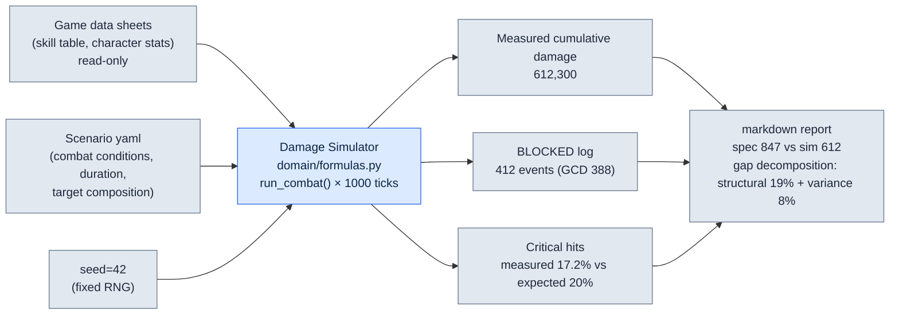

# 8.3 Damage Simulator — The Day Spec DPS and Sim Output Diverged

One early morning in 2008, I sat in front of a single Excel sheet, checking the same number for the third time. The game design document (GDD) listed a certain sword character's damage per second (DPS) as **847**. But the simulator I had run for the first time that day, fed the same character with the same stats, spat out **612**. A 27% difference. One of the two was lying, and I didn't yet know which.

Spec DPS is a promise on paper: arithmetic that multiplies one skill hit's damage by how often it fires. Simulator DPS is what you get when you actually swing that promise 1,000 times. Cooldowns overlap, cast animations eat up time, critical hits land less often than the expected value says — friction the paper knows nothing about creeps in. That 27% gap is exactly where a balance designer makes a living. Trust the paper and you cry after launch.

This chapter is the story of that one tool: the Damage Simulator I built in 2008 and have not put down since. How I tracked the exact point where spec and output diverge, and how, 18 years later, I attached AI to that tracking — followed through a single real worked transcript.

---

## 8.3.1 Why Spec DPS Always Lies

First, let's dissect what that 612 versus 847 really was. The junior designer who wrote the spec (Team Member A from here on) had done nothing wrong. He multiplied exactly what the skill table said.

The spec-side DPS calculation looks like this. Assume a character with three skills.

| Skill | Single-Hit Damage | Cooldown | Cast Time |
|---|---|---|---|
| Horizontal Slash (횡베기) | 320 | 3.0s | 0.6s |
| Thrust (찌르기) | 540 | 6.0s | 0.9s |
| Basic Attack (평타) | 180 | 1.2s | 0.4s |

Team Member A's spec calculation rested on the ideal assumption that every skill is used the moment its cooldown comes back. Horizontal Slash deals 320 every 3 seconds, Thrust deals 540 every 6 seconds, and Basic Attack fills the empty time. The arithmetic comes out to a clean 847. On paper, the character has more than one pair of hands, so cast animations never block one another.

The simulator returned 612 for exactly one reason: the character has one pair of hands. While the 0.9-second Thrust is being cast, Horizontal Slash cannot fire even when its cooldown is up. This **global cooldown (GCD) collision** — cast animations devouring each other — does not exist in the spec. Paper is a frictionless vacuum; the sim is a battlefield with friction. The first truth I learned in 24 years of doing this work is this: spec DPS is an upper bound, not a measurement. And players play the game at the measurement, not the upper bound.

---

## 8.3.2 Worked Transcript — Grilling the AI About Where 612 Came From

In 2008, I closed that 27% gap by hand. I read the sim log line by line with my own eyes, counting the frames where skills got blocked. It took half a day. Eighteen years later, I throw the same log at Claude. Below is the full text of an actual session. I have not summarized it, and I include the first attempt that fell short — because that falling short is half of how to use this tool.

Here is the prompt I threw.

> Attached is part of a single-character 1,000-tick combat log from our Damage Simulator (`damage_sim/`, Python). Per the spec, this character's DPS is 847, but the sim outputs 612. Find the cause of the 27% gap in the log. The log format is `[tick] event skill=SKILL state=STATE`. No guessing — cite only evidence that is in the log. If the evidence is insufficient, say it is insufficient.
>
> ```
> [0.0] cast skill=찌르기 state=START
> [0.9] cast skill=찌르기 state=HIT dmg=540
> [0.9] cast skill=횡베기 state=BLOCKED reason=GCD
> [1.5] cast skill=평타 state=HIT dmg=180
> [1.9] cast skill=평타 state=BLOCKED reason=GCD
> [3.0] cast skill=횡베기 state=HIT dmg=320
> [3.6] cast skill=평타 state=HIT dmg=180
> ... (994 lines omitted)
> [997.2] cast skill=찌르기 state=HIT dmg=540
> ```

Claude's raw output looked like this (untouched).

> Facts confirmed in the log:
>
> 1. `state=BLOCKED reason=GCD` events appear repeatedly. At `[0.9]`, Horizontal Slash (횡베기) was blocked by the GCD (global cooldown); at `[1.9]`, Basic Attack (평타) was.
> 2. Until the Thrust (찌르기) cast finishes (0.0→0.9, 0.9s), no other skill can fire. The cast time appears to occupy the GCD.
> 3. Therefore the spec's assumption — "every skill fires on every cooldown" — breaks down. In practice, cast animations collide and some activations are lost.
>
> However, the provided log is only 7 lines out of 1,000. **Whether the exact 27% gap is explained by GCD collisions alone cannot be concluded from these 7 lines.** To verify the 27%, we need the total count of BLOCKED events and the total damage lost because of them. If you provide the BLOCKED aggregation for the full log, I will confirm it quantitatively.

The stop here is what matters. The AI **pointed at** the cause but did not **prove** the 27%, and it stated that limit itself. Where a paper-only designer would have ended the meeting with "so it's the GCD," the tool held its ground: "seven lines aren't enough to know." I judged that demand legitimate — this is what human verification is. So I pulled the BLOCKED aggregation for the full log and threw it back.

> Here is the full 1,000-tick aggregation. BLOCKED total: 412, of which 388 were due to GCD and 24 due to cooldown not yet recharged. Estimated damage lost to BLOCKED is about 19,800 in Horizontal Slash equivalents. Over the full 1,000-tick (= second) fight, spec-expected damage is 847,000 and sim-measured cumulative damage is 612,300. Re-examine the 27% gap with these numbers.

Claude's second output.

> Verifying with the aggregates.
>
> - Spec expected cumulative: 847,000
> - Sim measured cumulative: 612,300
> - Gap: 234,700 (27.7%)
>
> Composition of the gap:
> - Directly lost to GCD collisions (388 events): the estimate of about 19,800 is in Horizontal Slash equivalents, but you also need to add the opportunity cost — higher-damage skills could have filled the lost slots. Converting the lost slots at average damage makes the loss larger than 19,800.
> - However, BLOCKED alone does not explain the full 234,700. **The interpretation of the remaining gap changes depending on whether the spec's 847 "already folds the critical-hit expectation into the average" or is "a base value without crits."** Tell me the spec's crit assumption behind 847 and I will decompose the residual gap.

It stopped again. And again it stopped in exactly the right place. How the spec's 847 handled critical hits — that information was not in the log; it existed only inside Team Member A's head. The AI knew the boundary of the data it had. When I checked, the spec's 847 had flattened a 20% crit chance at 1.5x into the expected value, and the sim was one run, seed fixed, in which the actual crit count came in below expectation. In other words, the 27% gap was a mix of **GCD collision (structural, reproducible)** and **crit variance (statistical, this one run's luck)**.

That decomposition is the conclusion. The GCD-collision share is a real problem that must be fixed in the design; the crit-variance share is noise that disappears once you change seeds and average 1,000 runs. Mix the two together, decide "the character is weak," and hand out a buff — and a character that was fine on the 1,000-run average becomes overpowered. The paper didn't know it, a single sim run didn't know it, and **the AI on its own didn't know it either** — what produced this distinction was a human verification that brought the log aggregation and the spec's hidden assumption to the table.

---

## 8.3.3 One Set of Inputs, One Set of Outputs — Anatomy of the Sim

Let's lay out, as one set, the inputs and outputs of the tool that session was peering into. A simulator is, in the end, an honest function. Same input, same output. The input gathers from three sources.



The point of this diagram is that the arrows run one way. The game data sheets are only ever **read** by the simulator. The sim never writes the data back. The rule that prevented the most accidents over 18 years was the direction of that single arrow. The moment a sim starts keeping its own copy of the data, then the day after the game data changes, the sim is simulating yesterday's world. Hold a meeting over a report produced that way, and the entire meeting ends up arguing about yesterday's world.

A concrete input set (the scenario yaml) looks like this.

```yaml
# scenarios/single_dps_check.yaml
scenario: single_target_dps
duration_ticks: 1000      # assume 1 tick = 0.1s, 100s combat
seed: 42                  # determinism — same input, same output
actor:
  char_id: K_004          # read from game data sheets
  skill_rotation: optimal # on GCD collision, prefer highest expected damage
target:
  defense: 1200
  hp: infinite            # infinite-HP dummy for DPS measurement
report:
  compare_to_spec: 847    # feed spec DPS to auto-decompose the gap
```

And one output set (report excerpt) looks like this.

```markdown
# Damage Simulator Report — K_004 single DPS
Input: scenarios/single_dps_check.yaml | seed=42 | data rev. 2026-06-05

## Versus Spec
- Spec DPS:          847   (20% crit · 1.5x expectation flattened in)
- Sim measured DPS:  612   (this seed, 1 run)
- Gap:              -27.7%

## Gap Decomposition
- Structural (GCD collision, reproduced):  -19.2%  ← design review target
- Statistical (crit variance, this run):   -8.5%  ← expected to vanish on 1000-run average

## Reproduction Verification
- seed=42 re-run 3 times → 612,300 / 612,300 / 612,300 (identical)
- seed 0~999, 1000-run average DPS → 731 (after crit variance removed)
```

Look at the last line. The average over 1,000 runs with seeds 0–999 was 731. The gap between the spec's 847 and the 1,000-run average of 731 — 116 (13.7%) — is the size of the **real structural problem**, the GCD collision. That 731, not the single run's 612, is what should enter the design meeting as input. Not the paper's 847, not the unlucky single run's 612, but the 731 that 1,000 runs agreed on. Getting that number into your hand is the balance designer's job.

---

## 8.3.4 The Hands of 2008 and the Hands of 2026

This tool has lived 18 years, but not as the same code. I kept the hanger and changed the clothes on it five times. The hanger is the logic of the report above — split spec from measurement, decompose the gap into structure and variance, verify by reproduction. That procedure is, word for word, the same in 2008 Excel VBA (Excel's macro language) as in 2026 Python.

| Period | Clothes (Tech) | Hanger (Unchanged Procedure) |
|---|---|---|
| 2008–2011 | Excel VBA, 1:1 | Spec-versus-measured gap decomposition |
| 2012–2016 | C# console, N:N | Same |
| 2017–2020 | Python + Web | Same |
| 2021–2024 | Python + ML | Same (+ player distribution modeled) |
| 2025– | Python + LLM assist | Same (+ log queries, hypothesis generation) |

The secret to surviving five changes of clothes is carved into the folder structure.

```
damage_sim/
├── domain/          # the hanger — unchanged for 18 years
│   ├── formulas.py      # damage formulas · GCD collision checks
│   └── metrics.py       # gap decomposition logic
├── adapters/        # game data read-only
│   └── excel_reader.py
├── runners/         # clothes — replaced whenever the tech changes
│   └── cli_runner.py
└── reporters/       # clothes — report output format
    └── markdown_report.py
```

When the tech changes, only `runners/` and `reporters/` get rewritten. The gap-decomposition logic in `domain/` survives intact as an 18-year asset. The GCD collision check I once wrote in Excel cells in 2008 is running in today's `formulas.py` with nothing changed but the function signature. Nail a tool to one technology and it grows old and dies with that technology — I learned that by burying several dead tools.

The LLM I attached in 2025 is not a new hanger; it is a new pair of hands. As the session above showed, AI is the hand that **reads logs and forms hypotheses**, and log tracing that used to take half a day now takes minutes. But it does not touch the hanger — whether the gap is 27%, what percentage of hits crit: those are still **decided** by the seed-fixed deterministic core. The moment an LLM steps into that seat, regression verification becomes impossible and the tool dies.

---

## 8.3.5 The Deterministic Core and What Lies Outside — Where to Draw the Line

If I had to draw only one line in a balance tool, I would draw it at the boundary of the deterministic core. Inside, same input must yield same output with steel-grade certainty; outside, humans and AI are free to throw hypotheses around.

Inside (deterministic — AI forbidden):
- Damage formulas, GCD collision checks, critical-hit rolls, cumulative aggregation.
- Run it three times with `seed=42` and 612,300 must come out three times, identical. If that breaks, yesterday's report and today's report can no longer be compared.

Outside (hypothesis and interpretation — AI welcome):
- Causal questions like "why is this character combo's win rate abnormal."
- Finding BLOCKED patterns in logs, drafting natural-language reports, drafting scenario yaml.

The worked transcript above moved exactly along this line. The AI, on the outside, was quick to form the hypothesis that GCD collisions were the cause. But the number 27%, the number 612 — those were values computed by the deterministic core to the very end, and the AI only took those values and interpreted them. And twice it stopped, saying "this data is not enough to conclude" — demanding information the deterministic core could not supply (the spec's crit assumption). That stopping is the mark of a good tool: not mistaking a hypothesis for a diagnosis.

One honest disclosure about the numbers. The concrete figures in this chapter — 847, 612, 731, 412 events — are example values constructed for explanation. But the **direction** (spec DPS always comes out above the sim measurement), the **structure** (the gap decomposes into structural collision and statistical variance), and the **principle** (a fixed seed is the precondition for regression verification) are things I have confirmed repeatedly across 18 years of actually operating this tool since 2008. The size of the ratios varies by project; the direction and the structure have not changed.

---

## Try It Yourself — One Round of Spec-Versus-Sim Gap Decomposition

**setup.** Pick one character from your game data and gather its skill table (damage, cooldown, cast time) and its spec DPS. If you have no simulator, write a minimal script that runs a 1,000-tick single-target fight. The one thing that matters: it must take `seed` as an argument so the run can be pinned.

**prompt.** Throw the sim log (including BLOCKED events) and the spec DPS together.

> Attached are a single character's 1,000-tick combat log and the BLOCKED aggregation. Spec DPS is [N] but the sim outputs [M]. Decompose the cause of the gap using log evidence only. Separate structural causes (reproducible collisions) from statistical causes (this run's variance). If the evidence is insufficient, say so and name what else you need.

**verify.** Take the structural cause the AI pointed at and verify it on a 1,000-run average with varied seeds. If the gap survives the average, it is a real structural problem; if it vanishes, it was variance noise. If the AI stops and says "I can't conclude," that is not a failure — it is normal. A human steps into the spot where it stopped and fills in the spec's hidden assumptions.

### Solo Scale-Down

If you are a solo developer with no simulator and no ML, you can run the same procedure with one Excel sheet and AI. Put the skill table on a sheet and build a 1,000-row sim in a column, rolling crits with `RAND()`. You can't fix the seed, so press `F9` to recalculate 100 times and read the average by eye. Throw that average and the spec DPS at the AI and ask it to "split the gap into structural causes and variance causes." The tool is small, but the hanger — spec-versus-measured gap decomposition, separating structure from variance, verification by reproduction — stands just the same.

---

### Key Takeaways
- Spec DPS is a frictionless upper bound; the measured value players actually experience is what the sim finds as a 1,000-run average.
- The gap between spec and sim must be split into structural collision and statistical variance before the real design problem becomes visible.
- Inside the deterministic core, AI is forbidden; outside it, in hypothesis and interpretation, AI is welcomed as a new pair of hands.

### Next Chapter Preview
- 8.4 AI-Assisted Balance Simulation — Positions That Automate the Periphery While Guarding the Deterministic Core
