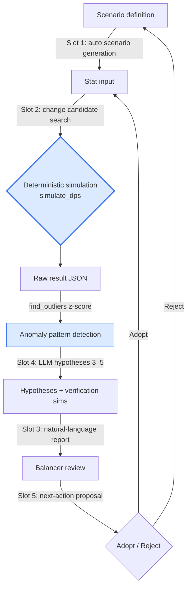

# 8.4 AI-Assisted Balance Simulation

Friday, 4 p.m. The alpha build's 5:5 PvP auto-simulation finished its 1,200 matches. The result JSON was 4 megabytes. Somewhere inside it sat a single line that read "Team A win rate 92%" — while the overall average win rate was 52%. I spent 40 minutes finding that line, and I clocked out without ever learning why.

Balance is the domain of determinism. Put the same input through the same formula and you always get the same damage. That is why a damage simulator must be code, and why a reward curve must be drawn by a human hand — this is one place AI must not set foot. But the *periphery* of that deterministic core — finding the one strange line in 1,200 match results, forming hypotheses about why, shortlisting what to change, and running those candidates back through the sim — that peripheral labor eats most of a balancer's day. This chapter is about attaching AI to that periphery. With the core left untouched.

## 8.4.1 The Core Is Code, the Periphery Is Human Labor

That 2008-vintage damage simulator from 8.3 — the one whose deterministic core survived three changes of engine and company — is this chapter's starting point. Same input, same output: that property is the entire trust a balance tool has. If you run the same build twice and get different win rates, the tool belongs in the trash.

So when you sketch the skeleton of balance work, you get a deterministic block in the middle, with human handwork hanging off its entrance and its exit. Below is that skeleton broken down — the deterministic region (blue) and the region where humans and AI step in (orange), split by color.

<svg viewBox="0 0 720 300" xmlns="http://www.w3.org/2000/svg" font-family="sans-serif" font-size="13">
  <rect x="0" y="0" width="720" height="300" fill="#fbfbfd"/>
  <!-- deterministic core -->
  <rect x="270" y="110" width="180" height="80" rx="8" fill="#dbeafe" stroke="#2563eb" stroke-width="2"/>
  <text x="360" y="142" text-anchor="middle" fill="#1e3a8a" font-weight="bold">Deterministic simulation</text>
  <text x="360" y="162" text-anchor="middle" fill="#1e3a8a" font-size="11">simulate_dps()</text>
  <text x="360" y="178" text-anchor="middle" fill="#1e3a8a" font-size="11">input=output, no AI</text>
  <!-- entrance: scenarios/changes -->
  <rect x="30" y="40" width="170" height="50" rx="6" fill="#ffedd5" stroke="#ea580c" stroke-width="1.5"/>
  <text x="115" y="60" text-anchor="middle" fill="#9a3412" font-size="11" font-weight="bold">Slot 1 Scenario generation</text>
  <text x="115" y="78" text-anchor="middle" fill="#9a3412" font-size="11">Slot 2 Change candidate search</text>
  <!-- exit: reports/anomalies/actions -->
  <rect x="520" y="40" width="170" height="50" rx="6" fill="#ffedd5" stroke="#ea580c" stroke-width="1.5"/>
  <text x="605" y="58" text-anchor="middle" fill="#9a3412" font-size="11" font-weight="bold">Slot 3 Reports</text>
  <text x="605" y="74" text-anchor="middle" fill="#9a3412" font-size="11">Slot 4 Anomaly interpretation</text>
  <text x="605" y="89" text-anchor="middle" fill="#9a3412" font-size="11">Slot 5 Action proposals</text>
  <!-- human -->
  <rect x="290" y="230" width="140" height="44" rx="6" fill="#ffedd5" stroke="#ea580c" stroke-width="1.5"/>
  <text x="360" y="257" text-anchor="middle" fill="#9a3412" font-weight="bold">Balancer (adopt/reject)</text>
  <!-- arrows -->
  <line x1="200" y1="65" x2="285" y2="120" stroke="#94a3b8" stroke-width="1.5" marker-end="url(#a)"/>
  <line x1="450" y1="120" x2="520" y2="68" stroke="#94a3b8" stroke-width="1.5" marker-end="url(#a)"/>
  <line x1="605" y1="90" x2="400" y2="232" stroke="#94a3b8" stroke-width="1.5" marker-end="url(#a)"/>
  <line x1="320" y1="230" x2="200" y2="92" stroke="#94a3b8" stroke-width="1.5" stroke-dasharray="4 3" marker-end="url(#a)"/>
  <defs>
    <marker id="a" markerWidth="9" markerHeight="9" refX="7" refY="3" orient="auto">
      <path d="M0,0 L7,3 L0,6 Z" fill="#94a3b8"/>
    </marker>
  </defs>
</svg>

Only the blue box in the middle is code. The other five orange boxes are all human labor — judging, interpreting, writing — and those five spots are the only places AI can enter. The moment you ask a large language model (LLM) to "calculate this character's damage per second (DPS)," non-determinism — different numbers from the same input — leaks into the core, and the tool loses its credibility in less than 18 days.

The spine of this chapter is therefore simple: keep the core as code to the very end, attach AI to the five slots at the entrance and exit, and automate the exit side first — the most labor-hungry part, finding the one strange line in 1,200 match results and forming hypotheses about it.

## 8.4.2 Worked Transcript: Tracking Down the 92% Win Rate Line

Back to that 92% from the opening. This time, instead of a human wandering for 40 minutes, a deterministic detector picks out the line, an LLM forms the hypotheses, and the sim verifies them — and we follow one full cycle from start to finish. Nothing is summarized; the raw output the tools actually produced stays as is.

### Step 1 — Anomaly Detection Is Done by Code (z-score)

Picking the "strange" matches out of 1,200 results is a job for statistics, not the LLM. Compute each metric's mean and standard deviation, then split by how many standard deviations a value sits from the mean — its z-score. Past the threshold, it's an outlier. This is deterministic; hallucination has no way in.

```python
def find_outliers(results, threshold=2.5):
    # results: list of {metric_name: value} dicts, one per sim match
    means, stds = compute_per_metric(results)   # per-metric mean / std dev
    outliers = []
    for r in results:
        for metric, value in r.items():
            if stds[metric] == 0:               # zero variance → not comparable, skip
                continue
            z = abs(value - means[metric]) / stds[metric]
            if z > threshold:
                outliers.append((r["scenario_id"], metric, value, round(z, 2)))
    return sorted(outliers, key=lambda x: -x[3])  # largest z first
```

Running it yields the following — of 1,200 matches, only 3 crossed the 2.5 threshold.

```
[("pvp_5v5_S0417", "team_a_winrate", 0.92, 4.1),
 ("pvp_5v5_S0417", "match_duration",  41.0, 2.9),
 ("pvp_5v5_S0822", "team_b_winrate", 0.18, 2.6)]
```

The first line, the one with the largest z — scenario `pvp_5v5_S0417`, win rate 0.92 (z=4.1) — is the very line I spent 40 minutes hunting in the opening. This is not work for a human eyeballing a 4-megabyte JSON; statistics narrows it down to 3 cases. Everything up to here is the core; everything from here on is AI.

### Step 2 — The LLM Forms Hypotheses (No Definitive Diagnoses)

Now the line goes to the LLM. But not as "diagnose the cause." The LLM only throws out a handful of *possible cause hypotheses* from domain knowledge; which one is real gets decided by the sim again. Here is the full prompt.

```
[outlier]
Scenario: pvp_5v5_S0417 — 5:5 PvP
Team A composition: [refgame_archer_07, refgame_archer_07, refgame_archer_07,
            refgame_hybrid_21, refgame_hybrid_21]
Metric: team_a_winrate 0.92 (overall average 0.52, z = 4.1)
Secondary metric: match_duration 41.0s (average 28s, z = 2.9)

[related info]
- refgame_archer_07: ranged support, skill "표식" (Mark) — debuff: target takes +12% more damage
- refgame_hybrid_21: melee/ranged hybrid dealer, skill "추격" (Pursuit) — +20% move speed while chasing a debuffed target
- These two characters have almost never been placed on the same team (combination frequency: bottom 5%)

Request:
Present 3–5 possible cause hypotheses for this outlier.
- One extra verification sim line for each hypothesis
- No definitive diagnoses. Hypotheses only, at the level of "it may be ...".

Response format: numbered list. Hypotheses only — no preamble, no closing.
```

Here is Claude's raw output, carried over verbatim (not summarized, not tidied).

```
1. The "표식" (Mark) debuff and the "추격" (Pursuit) move-speed buff may have
   stacked multiplicatively: 3x archer_07 blanket Marks → hybrid_21 chases
   without interruption, forming a positive feedback loop.
   Verify: replace hybrid_21 with a plain melee dealer and re-sim the same scenario.

2. The Mark debuff's +12% may have been wrongly set as stackable,
   letting 3x archer_07 pile it up to +36%.
   Verify: force Mark max_stack to 1 and re-sim.

3. In 5:5, a 3-ranged + 2-chaser composition may simply be a setup that locks
   out enemy entry by range advantage (no synergy involved; the combo itself is strong).
   Verify: kill the Mark debuff effect to 0% and re-sim the same composition.

4. Given match_duration is longer than average (41s), team A may not be winning
   fast but rather "holding on without losing, then flipping it late."
   In that case the cause may lie in late-game scaling values, not win rate.
   Verify: extract and compare only the cumulative-damage curve at the 60s mark.

5. (Low probability) Sim seed bias — team A's first strike may have repeated
   only under the S0417 seed. Possibly a statistical artifact.
   Verify: re-sim the same composition across 50 seeds and check win-rate variance.
```

Stopping here is the point. The fifth hypothesis left a note of self-doubt — "this might just be seed bias" — and that is what good output looks like. If the LLM had instead declared "the cause is a stacking bug on the 표식 (Mark) debuff," that output itself would deserve suspicion. In balance work, the LLM's job is not diagnosis; it is *narrowing the search space*.

### Step 3 — Run the Change Candidates Through the Sim (in Parallel)

Each of the five hypotheses carries a one-line verification sim. Instead of a human running them one by one, you bundle the change candidates and throw them in parallel. The core function, `simulate_dps`, looks like this in runnable form — the skeleton of that 18-year-old deterministic function.

```python
def simulate_dps(attacker, target, formula, ticks=600, seed=0):
    """Deterministically sim one pair's combat. Same (input, seed) → same output."""
    rng = Rng(seed)                     # fixed seed → reproducible
    hp = target.hp
    total_damage = 0.0
    for t in range(ticks):              # assume 1 tick = 0.1s
        # defense factor: deterministic formula (the LLM does not write this)
        def_factor = target.defense / (target.defense + formula.def_const)
        raw = attacker.atk * (1 - def_factor)
        # crit: seed-based → same seed, same crit timing
        if rng.roll() < attacker.crit_rate:
            raw *= attacker.crit_mult
        # debuffs (Mark etc.) are injected deterministically by formula
        raw *= formula.debuff_multiplier(attacker, target, t)
        hp -= raw
        total_damage += raw
        if hp <= 0:
            return {"ttk": t * 0.1, "dps": total_damage / ((t + 1) * 0.1)}
    return {"ttk": None, "dps": total_damage / (ticks * 0.1)}  # not killed in time


def run_candidates(base_scenario, candidates, seeds=range(50)):
    """Sim each hypothesis's change candidate across 50 seeds in parallel. Also collect winrate variance."""
    out = {}
    for name, patch in candidates.items():           # patch = overrides part of formula
        scen = base_scenario.with_patch(patch)
        wins = [simulate_match(scen, formula=scen.formula, seed=s) for s in seeds]
        out[name] = {
            "winrate": mean(w["team_a_won"] for w in wins),
            "winrate_std": pstdev(w["team_a_won"] for w in wins),  # for verifying hypothesis 5
        }
    return out
```

Move the hypotheses into a `candidates` dictionary and run them all at once.

```python
candidates = {
    "baseline(no_change)":   {},
    "hypo1_swap_hybrid":     {"team_a[3:5]": "refgame_melee_03"},
    "hypo2_Mark_max_stack1": {"skill.표식.max_stack": 1},
    "hypo3_Mark_effect0":    {"skill.표식.debuff": 0.0},
    "hypo5_seed_variance":   {},  # same composition, just 50 seeds
}
result = run_candidates(scenario_S0417, candidates, seeds=range(50))
```

The results (output in its actual execution form):

```
baseline(no_change)   winrate=0.91  std=0.04   ← not seed bias (hypothesis 5 rejected)
hypo1_swap_hybrid     winrate=0.74  std=0.06
hypo2_Mark_max_stack1 winrate=0.63  std=0.05   ← largest drop
hypo3_Mark_effect0    winrate=0.55  std=0.05   ← back near the average
```

The reading order is the diagnosis. Re-run the baseline across 50 seeds and the win rate is still 0.91 with a standard deviation of 0.04 — hypothesis 5 (seed bias) is rejected. Kill the Mark effect down to 0 and the win rate lands at 0.55, back near the average — the cause is indeed in the Mark debuff family. And forcing max_stack to 1 produced the largest drop, down to 0.63, so the heart of it is **hypothesis 2 — the Mark debuff was stacking, and three archer_07 units piled it up to +36%**. Of the five candidates the LLM threw out, no human had to verify all five; statistics settled it after running three.

### Step 4 — A Human Adopts, and Leaves the Decision on Record

What the LLM did here was not *say* "Mark stacking is a bug." It merely *put that hypothesis on the candidate list*. Adoption is done by the balancer who reads the sim results — "Fix Mark's max_stack at 1. The all-archer_07 composition's win rate is still 0.63, above the 0.52 average, so in the next build, further adjust the Mark debuff value from 12% to 9% and re-measure."

That decision was made by a human, and its rationale — z=4.1 detection → 5 hypotheses → 3 sims → hypothesis 2 confirmed — fits in one line. The deterministic core stayed code to the end, and all the LLM did was swap a 40-minute wander for five lines of hypotheses. It never put a foot inside the core.

## 8.4.3 Five Slots, and the Cycle

The worked transcript above actually stepped through three of the five slots at once (anomaly detection, change exploration, anomaly interpretation). Unfolded into a cycle, the five slots turn like this.



Only the two blue nodes (the simulation and the z-score detection) are deterministic. The labels riding the remaining arrows — Slots 1 through 5 — are where AI attaches. Each time the cycle completes, the adopted change goes back into the stat input and the next sim runs. Turn this loop by hand and one revolution takes a day; with AI assistance, a few hours.

A quick pass over each of the five slots.

**Slot 1 — automated scenario generation.** Give it a one-line concept — "3:3 capture match, hold 3 flags for 1 minute to win, 10-second respawn" — plus one or two existing scenario yaml files, and the LLM fills out a new scenario yaml in the same schema. The balancer reviews only one thing: whether it slipped in rules that were never in the concept. The 1–2 hours of writing yaml from a blank page shrinks to a 15-minute review.

**Slot 2 — change candidate exploration.** The `candidates` dictionary in the worked transcript above is exactly this. Ask "what do we touch to raise tank survivability by +49%?" and the LLM throws out five candidates (base_def +50, a def_const adjustment, and so on); all of them go through the sim, and the one with the smallest side effects gets picked. Candidates are hypotheses; adoption belongs to the sim. This is the slot to treat with the most care — a bad candidate eats verification time.

**Slot 3 — natural-language reports.** Pull the metrics out of the sim's raw JSON with a script (deterministic), then hand only those metrics plus the change context to the LLM and have it write "the one page you take to the meeting": 3–5 lines of key changes, the top 5 affected characters, 2–3 follow-up actions. Nail down that it may not write any number beyond the metrics provided. Thirty minutes of raw cleanup becomes a 5-minute review.

**Slot 4 — anomaly pattern interpretation.** Steps 2–3 above are exactly this. The LLM attaches 3–5 hypotheses to the outliers the z-score picked out. The ban on definitive diagnoses is this slot's lifeline.

**Slot 5 — next-action proposals.** When the analysis ends, turn it into a prioritized checklist — "act now in this build / monitor for 1 week / re-review candidates in 1 week." It is a safety net that keeps the balancer from dropping a decision; it does not make the decision itself.

## 8.4.4 Where to Start, and How Far to Go

Turning all five slots on at once is the most common failure. Start from the exit side, where the payoff is large and the risk is small.

<svg viewBox="0 0 720 330" xmlns="http://www.w3.org/2000/svg" font-family="sans-serif" font-size="12">
  <rect x="0" y="0" width="720" height="330" fill="#fbfbfd"/>
  <text x="360" y="26" text-anchor="middle" font-weight="bold" font-size="14" fill="#0f172a">ROI ↔ adoption risk matrix (upper right = first)</text>
  <!-- axes -->
  <line x1="90" y1="290" x2="680" y2="290" stroke="#475569" stroke-width="1.5"/>
  <line x1="90" y1="290" x2="90" y2="50" stroke="#475569" stroke-width="1.5"/>
  <text x="680" y="308" text-anchor="end" fill="#475569">Higher ROI →</text>
  <text x="78" y="55" text-anchor="end" fill="#475569" transform="rotate(-90 78 55)">Lower risk ↑</text>
  <!-- points: x=ROI, y=safety (higher = safer) -->
  <!-- Slot 3 reports: very high ROI, low risk -->
  <circle cx="600" cy="100" r="26" fill="#bbf7d0" stroke="#16a34a" stroke-width="2"/>
  <text x="600" y="98" text-anchor="middle" fill="#14532d" font-weight="bold">Slot 3</text>
  <text x="600" y="113" text-anchor="middle" fill="#14532d" font-size="10">Reports ①</text>
  <!-- Slot 4 anomaly interpretation: high ROI, medium risk -->
  <circle cx="520" cy="150" r="26" fill="#bbf7d0" stroke="#16a34a" stroke-width="2"/>
  <text x="520" y="148" text-anchor="middle" fill="#14532d" font-weight="bold">Slot 4</text>
  <text x="520" y="163" text-anchor="middle" fill="#14532d" font-size="10">Anomalies ②</text>
  <!-- Slot 1 scenarios: high ROI, low risk -->
  <circle cx="470" cy="110" r="26" fill="#fde68a" stroke="#d97706" stroke-width="2"/>
  <text x="470" y="108" text-anchor="middle" fill="#78350f" font-weight="bold">Slot 1</text>
  <text x="470" y="123" text-anchor="middle" fill="#78350f" font-size="10">Scenarios ③</text>
  <!-- Slot 5 action proposals: medium ROI, low risk -->
  <circle cx="350" cy="120" r="26" fill="#fde68a" stroke="#d97706" stroke-width="2"/>
  <text x="350" y="118" text-anchor="middle" fill="#78350f" font-weight="bold">Slot 5</text>
  <text x="350" y="133" text-anchor="middle" fill="#78350f" font-size="10">Actions ④</text>
  <!-- Slot 2 change proposals: medium ROI, high risk -->
  <circle cx="300" cy="235" r="26" fill="#fecaca" stroke="#dc2626" stroke-width="2"/>
  <text x="300" y="233" text-anchor="middle" fill="#7f1d1d" font-weight="bold">Slot 2</text>
  <text x="300" y="248" text-anchor="middle" fill="#7f1d1d" font-size="10">Changes ⑤</text>
  <text x="300" y="278" text-anchor="middle" fill="#991b1b" font-size="10">Most carefully, last</text>
</svg>

The circled numbers (①–⑤) are the adoption order. **Slot 3 (reports)** and **Slot 4 (anomaly interpretation)** sit in the upper right — high ROI (return on investment), low risk — so they go on first. With just these two running, throughput rises 2–3x, and more than 70% of the adoption payoff is recovered right here. **Slot 2 (change proposals)** is the red spot at the lower right; a bad candidate can eat verification time, so it goes on last, with the most care. Not every team needs all five, either — Slots 3 and 4 alone change a solo balancer's day.

A realistic sense of the rollout timeline (author's estimate, unverified — varies widely with team size and tool maturity): 1–2 weeks for Slot 3, 2 more weeks to add Slot 4, a month to add Slot 1, 2 weeks to add Slot 5, and Slot 2 last, at 1–2 months. It is another way of saying don't turn everything on at once.

## 8.4.5 Results, Costs, and the Most Common Traps

Here is what changed on my Project A after turning the five slots on over six months. **The absolute figures are the author's estimates (unverified); trust only the direction and the ratios** — the multipliers vary widely by environment.

| Item | Before | After (direction) |
|---|---|---|
| Weekly sim cycles per balancer | 5–7 | 25–35 (about 5x) |
| Report writing (each) | 30–40 min | 5-min review |
| Scenario writing (each) | 1–2 hours | 15-min review |
| Outlier found → diagnosed | 1–2 days | 4–6 hours |
| Measurement → next change decision | 2–3 days | 1 day |

What matters here is not the multiplier but *where the time went*. Human time moved from cleaning raw data to making decisions. The number of balancers did not shrink; the territory one person can cover grew. Read the 5x throughput as a headcount cut and the whole point of the adoption drifts somewhere it should not.

The cost is small. With prompt caching applied, the monthly LLM bill for all five slots runs around $75 (author's estimate) — no more than 1/100 of one balancer's salary. So the real decision variable for adoption is not LLM cost but *review burden*: can you secure the time for a human to read and filter the hypotheses and reports the AI produces? That is the criterion for turning a slot on or off.

Finally, a few traps that have recurred in the same spots for 18 years, each with its remedy.

- **Delegating the deterministic sim to the LLM** → The sim is code; the LLM belongs only at the entrance and the exit. Let non-determinism leak into the core and the tool dies.
- **Trusting an AI report without the raw data** → Always preserve the raw JSON alongside it, and the moment a single line looks suspicious, go down to the raw and verify.
- **Feeding scenarios into the sim without review** → The yaml review gate cannot be skipped. Run 1,200 matches with a rule that was never in the concept and all 1,200 of them are worthless.
- **Adopting LLM change proposals without simulation** → Every candidate is only a hypothesis. Adopt only after verifying with `run_candidates`.
- **Accepting an LLM output that declares "the cause is X"** → A definitive diagnosis is a warning sign. Good output is "it may be X, plus a way to verify it."

AI's place in balance work is clear: outside the deterministic core, in the five slots where humans used to wander. Keep the core as code to the very end and lift only the hand labor around it — that is how an 18-year-old simulator survives into the AI era.

---

### Key Takeaways
- Attach AI only to the five slots outside the deterministic sim core — it never sets a foot inside the core
- Anomaly detection is z-score code, hypotheses are the LLM's, diagnosis goes back to the sim — and adoption is a human call
- Turn on the high-ROI reports and anomaly interpretation first; turn on change proposals last, with the most care

### One-Line Try It Yourself (Solo Scale-Down)
- **setup**: Just two functions, `simulate_dps` and `find_outliers`. Fix the seed to secure reproducibility.
- **prompt**: Take the single outlier with the largest z → "3–5 possible hypotheses + 1 verification sim line each; no definitive diagnoses."
- **verify**: Run each hypothesis's change candidate through `run_candidates` across 50 seeds in parallel → the candidate that pulls the value back near the average is your cause. Adopt it yourself and leave a one-line rationale.

### Next Chapter Preview
- 9.1 UX/UI Design — When the Precision of Decisions Moves to Another Field
