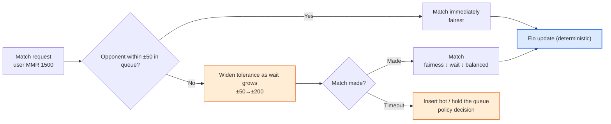
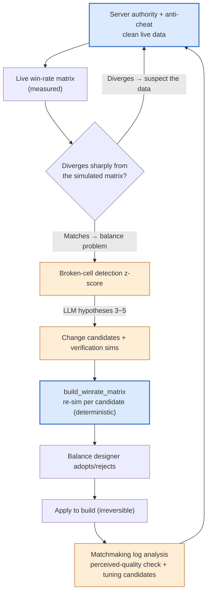

# 8.5 PvP and Competitive Balance — Win-Rate Matrix, Matchmaking, and Server Authority

The four chapters of this part so far have all fought a single enemy. How many seconds it takes to kill one boss, whether the tank survives 89% of the time, whether gold is leaking. All of it was a story of damage, survival, and income against a **single target**. In PvP, though, the enemy is a person. People don't move in fixed patterns the way a boss does, two players on the same class have different hands, and above all, *they aim at each other's weaknesses*. This is why it's common for a game's PvE balance to run deep while its PvP sits completely empty. Chapters 8.1 through 8.4 took the single-target DPS (damage-per-second) curve all the way to the end, but the web of counters — "scissors beats paper" — hasn't been drawn even once.

This chapter fills that gap. It covers three things — the **win-rate matrix** that captures matchups between classes and compositions, **matchmaking and MMR**, which decide who gets paired with whom, and **server authority and anti-cheat**, which can turn every one of those numbers into a lie. And the boundary that has run through this entire part holds here unchanged: combat formulas are deterministic; matchmaking and matchup detection get AI assistance. Not one step out of line.

---

## 8.5.1 The One Thing That Makes PvP Different from PvE

In PvE, a character's strength is an **absolute value**. If the swordsman's DPS is 800, it's 800, and the boss simply takes that 800. In PvP, strength is **relative**. The swordsman's 800 is enough against an archer, but against a shield bearer who reduces incoming damage by 30%, it gets cut to 560 and may fall short. The same character's strength changes *depending on who the opponent is*. This one fact makes PvP balance a fundamentally different problem from PvE.

So the unit of PvP balance is not one character's number but **a pairwise relationship**. The win rate of "swordsman vs. archer" and the win rate of "swordsman vs. shield bearer" each exist separately, and gathering all of these relationships produces a single table. The same class list runs along both axes, and each cell holds "the probability that the row beats the column." That is the **win-rate matrix**. Where PvE has the DPS curve, PvP has this matrix.

<svg viewBox="0 0 660 300" xmlns="http://www.w3.org/2000/svg" font-family="sans-serif" font-size="13">
  <rect x="0" y="0" width="660" height="300" fill="#ffffff"/>
  <text x="330" y="28" text-anchor="middle" font-weight="bold" font-size="14" fill="#0f172a">PvE is absolute, PvP is relational</text>
  <!-- PvE side -->
  <rect x="30" y="60" width="120" height="60" rx="8" fill="#eaf2fb" stroke="#2c6fbb" stroke-width="1.5"/>
  <text x="90" y="86" text-anchor="middle" fill="#2c6fbb" font-weight="bold">Swordsman</text>
  <text x="90" y="106" text-anchor="middle" fill="#333" font-size="11">DPS 800</text>
  <line x1="150" y1="90" x2="210" y2="90" stroke="#888" stroke-width="1.5" marker-end="url(#ph)"/>
  <rect x="210" y="60" width="120" height="60" rx="8" fill="#f3f4f6" stroke="#6b7280" stroke-width="1.5"/>
  <text x="270" y="86" text-anchor="middle" fill="#374151" font-weight="bold">Boss</text>
  <text x="270" y="106" text-anchor="middle" fill="#333" font-size="11">takes 800 as-is</text>
  <text x="180" y="150" text-anchor="middle" fill="#2c6fbb" font-size="11">PvE: strength = absolute value</text>
  <!-- PvP side -->
  <rect x="30" y="190" width="120" height="50" rx="8" fill="#fdecea" stroke="#c0392b" stroke-width="1.5"/>
  <text x="90" y="220" text-anchor="middle" fill="#c0392b" font-weight="bold">Swordsman 800</text>
  <line x1="150" y1="200" x2="210" y2="200" stroke="#16a34a" stroke-width="1.5" marker-end="url(#ph)"/>
  <rect x="210" y="180" width="120" height="34" rx="6" fill="#dcfce7" stroke="#16a34a" stroke-width="1.2"/>
  <text x="270" y="202" text-anchor="middle" fill="#14532d" font-size="11">Archer → 800 (effective)</text>
  <line x1="150" y1="215" x2="210" y2="232" stroke="#dc2626" stroke-width="1.5" marker-end="url(#ph)"/>
  <rect x="210" y="222" width="120" height="34" rx="6" fill="#fee2e2" stroke="#dc2626" stroke-width="1.2"/>
  <text x="270" y="244" text-anchor="middle" fill="#7f1d1d" font-size="11">Shield bearer → 560 (short)</text>
  <text x="200" y="284" text-anchor="middle" fill="#c0392b" font-size="11">PvP: strength = depends on the opponent</text>
  <!-- matrix hint -->
  <rect x="400" y="60" width="230" height="196" rx="8" fill="#fbfbfd" stroke="#94a3b8" stroke-width="1.2"/>
  <text x="515" y="84" text-anchor="middle" fill="#0f172a" font-size="12" font-weight="bold">→ Win-rate matrix</text>
  <text x="515" y="106" text-anchor="middle" fill="#475569" font-size="11">P(row beats column)</text>
  <text x="430" y="140" fill="#475569" font-size="11" font-family="monospace">       Arch  Shld  Mage</text>
  <text x="430" y="162" fill="#16a34a" font-size="11" font-family="monospace">Sword  .58   .42   .50</text>
  <text x="430" y="184" fill="#475569" font-size="11" font-family="monospace">Arch   --    .55   .47</text>
  <text x="430" y="206" fill="#475569" font-size="11" font-family="monospace">Shld   --    --    .61</text>
  <text x="515" y="238" text-anchor="middle" fill="#94a3b8" font-size="10">(numbers are examples — not measured)</text>
  <defs>
    <marker id="ph" markerWidth="8" markerHeight="8" refX="6" refY="3" orient="auto">
      <path d="M0,0 L6,3 L0,6 Z" fill="#888"/>
    </marker>
  </defs>
</svg>

Reading the table on the right is simple. If the "swordsman vs. shield bearer" cell reads 0.42, the swordsman beats the shield bearer 42% of the time — the matchup favors the shield bearer. If every cell sits near 0.50, the balance is perfect, but a game like that is no fun. You need **cyclical counters**, rock-paper-scissors style, for class choice to mean anything. The problem comes when that cycle breaks somewhere and a cell appears in which one class beats everyone. If the tank at 2 a.m. was PvE's accident, "shield bearer above a 60% win rate against every class" is PvP's.

One thing I want to nail down up front. The numbers filling these cells (0.58, 0.42, and so on) are all **examples, not measurements.** Every game differs in class count, in skills, in target balance line. What to trust in this chapter is not the numbers but the structure — *how the matrix gets filled, how it gets audited, and where AI attaches to that audit*.

---

## 8.5.2 Simulation Fills the Matrix, AI Reads It

Filling one cell of the win-rate matrix uses exactly the same tool as the deterministic simulation in 8.4. Auto-simulate "swordsman vs. archer" 1,000 times, count how many the swordsman won, and that's the cell's win rate. With N classes there are N×N cells; run each cell 1,000 times and a table fills in. This simulation is code all the way down — given the same seed, it must reproduce the same matrix without a single character off. Only then is "the shield bearer got stronger in this build" not a lie.

There is one trap here that belongs to PvP alone. In a PvE sim, the enemy (the boss) follows a fixed pattern, but in a PvP sim **the opponent has to choose actions too.** You need a bot policy on both sides that decides how the swordsman fights. And if that bot is dumb, the entire matrix becomes a lie — pit two bots with terrible control against each other and you get a matrix where "the class that fires skills at random" wins, while in the hands of actually skilled players the result can be the exact opposite. So a PvP matrix must always carry a caveat: "what level of play does this bot imitate?" Bots are usually written as heuristics (use a skill the moment it's off cooldown, retreat below 30% HP, and so on), and the heuristic itself is deterministic.

Here is the skeleton of a bot policy in runnable form — a function that picks the same action for the same input, with no room for hallucination to creep in.

```python
def bot_decide(me, enemy, cooldowns, t):
    """Deterministic bot policy. Same (state) -> same action. Not built by an LLM."""
    # 1) Survival first: evade/retreat if HP is below 30%
    if me.hp_ratio < 0.30 and cooldowns["escape"] <= 0:
        return Action("escape")
    # 2) Matchup skill: prioritize the mark unless the enemy is debuff-immune
    if cooldowns["mark"] <= 0 and not enemy.has("debuff_immune"):
        return Action("mark", target=enemy)
    # 3) Range management: open distance when a melee enemy closes in (ranged classes)
    if me.is_ranged and dist(me, enemy) < me.kite_range:
        return Action("reposition")
    # 4) Otherwise: the highest-damage skill that is off cooldown
    return best_ready_damage_skill(me, cooldowns)


def simulate_pvp_match(class_a, class_b, formula, seed=0):
    """Deterministically simulate one 1:1 match. Damage uses the formula from 8.1 as-is."""
    rng = Rng(seed)
    a, b = spawn(class_a), spawn(class_b)
    for t in range(MAX_TICKS):
        for me, foe in ((a, b), (b, a)):
            act = bot_decide(me, foe, me.cooldowns, t)
            apply_action(act, me, foe, formula, rng)   # formula = deterministic damage formula
        if a.hp <= 0 or b.hp <= 0:
            break
    return {"winner": "a" if b.hp <= 0 else "b" if a.hp <= 0 else "draw",
            "duration": t * TICK}
```

Filling an entire matrix is just the outer loop that runs this function 1,000 times per cell.

```python
def build_winrate_matrix(classes, formula, n=1000):
    matrix = {}
    for ca in classes:
        for cb in classes:
            if ca == cb:
                continue
            wins = sum(
                simulate_pvp_match(ca, cb, formula, seed=s)["winner"] == "a"
                for s in range(n)
            )
            matrix[(ca, cb)] = wins / n          # rate at which ca beat cb
    return matrix
```

Up to here is the core, code to the end. AI attaches not to *building* this table but to *reading* it. With N = 8 there are 56 cells, and a human scanning 56 win rates by eye for "where is it broken" is the same labor as the 4 MB JSON at 2 a.m. Picking out the odd cells is exactly what 8.4's z-score detection already does.

```python
def find_broken_cells(matrix, low=0.40, high=0.60):
    """Deterministically shortlist cells that deviate far from the balance line (0.5)."""
    broken = []
    for (ca, cb), wr in matrix.items():
        if wr > high or wr < low:
            broken.append((ca, cb, round(wr, 2)))
    return sorted(broken, key=lambda x: abs(x[2] - 0.5), reverse=True)
```

Once detection narrows the field, you hand that cell to the LLM. Same discipline as 8.4 — **no definitive diagnoses; hypotheses and verification sims only.** For example, give it the single line "shield bearer vs. mage 0.68 (largest z in the matrix)" and ask for 3\~5 possible causes, each with a one-line verification sim, like this.

```
[Broken cell]
Shield bearer → mage win rate 0.68 (balance line 0.50, largest z in the matrix)
Side data: average duration of this match 38s (overall average 22s)

[Related info]
- Shield bearer: -30% damage taken passive "Iron Wall", silence skill "Shield Bash" (2s)
- Mage: 70% of all damage concentrated in a skill with a 1.5s cast
- This matchup's frequency ranks high in the measured queue (popular pairing)

Request: 3~5 hypotheses for possible causes of this matchup collapse + 1 verification sim line each.
No definitive diagnoses. Stay at the level of "it may be...".
```

The LLM only throws hypotheses that narrow the search space, along the lines of "the -30% from the Iron Wall passive (철벽) and the 2-second silence may overlap into a positive feedback loop where the mage dies without ever landing its core cast / verify: cut the silence duration to 1 second and re-sim the same cell." Which one is actually true gets decided by running `build_winrate_matrix` again per candidate. That the match duration is 1.7 times the average — the LLM weaving that clue into the hypotheses, the kind of connection a human scanning 56 cells would easily miss, is the time AI earns at this spot.

---

## 8.5.3 Matchmaking: The Other Balance That Decides the Matchup

Even with a perfectly tuned win-rate matrix, the real reason a player feels "I lost" lies somewhere else: **who they got matched against.** When a player at skill 1500 meets one at 2200, the result is already decided even if the class matchup is 5:5. So matchmaking is not a mere server feature — it is **part of balance**. If the matrix is in charge of fairness between classes, matchmaking is in charge of fairness between skill levels.

Most competitive games keep an MMR (Matchmaking Rating). It is a hidden score that rises when you win and falls when you lose, and players with similar scores get paired. The score update is a deterministic formula — the Elo rating system is the most widely used, and being a public standard, it is one of the few formulas this book is allowed to quote.

```
# Elo: public standard update formula (not a made-up value)
expected_a = 1 / (1 + 10 ** ((rating_b - rating_a) / 400))
new_rating_a = rating_a + K * (score_a - expected_a)
#   score_a: 1 on a win, 0 on a loss
#   K: update strength constant (set by the game; usually chosen in the 16~40 range)
#   400, 10: constants fixed in the Elo definition
```

The formula itself is deterministic, and it is no place for AI. But matchmaking carries one *tension* that deterministic formulas alone cannot resolve: the **fairness ↔ wait-time** trade-off. Pair only opponents with the exact same score and the match is fair, but when no such opponent is in the queue, the player waits 10 minutes. Allow a generous score gap and matches come fast but unfair. The tension sharpens in late-night hours, on unpopular classes, and in high-rating brackets.



Only the blue node (the Elo update) is deterministic. The orange nodes — when and by how much to widen the tolerance, what to do on timeout — are where AI assistance reaches. Even here, though, AI does not make *real-time matching decisions*. That is server logic that must be fast and reproducible, so it belongs to rule-based code. What AI attaches to is **the analysis used to tune those rules**: summarizing "in last week's matchmaking logs, which rating brackets, time slots, and classes had poor match quality (win-rate skew, wait times)," and proposing candidates for "which segment's wait time shrinks if the tolerance curve changes this way." It is 8.4's position 3 (reports), position 4 (anomaly interpretation), and position 2 (exploring change candidates), with the stage moved to matchmaking logs.

It's worth marking where matchmaking entangles with the win-rate matrix. If the matching algorithm only equalizes scores and ignores class, broken matchup cells get exposed as-is. If the cell where the shield bearer beats the mage 68% of the time is still alive and matchmaking keeps pairing the two, mage players stack up perceived defeats even heavier than the matrix number suggests. So the matrix audit and the matchmaking-log analysis do not run separately — they are *the entrance and the exit of the same cycle*: fix the broken cell in the matrix, then check in the matchmaking logs how often that cell actually got paired.

---

## 8.5.4 Server Authority: The Precondition for Balance

Everything so far — the matrix, MMR, the sims — has quietly rested on one assumption: **that the results clients report are true.** In PvE this is rarely a problem. You're killing a boss alone; who would you cheat? But in PvP there is an opponent, winning raises your score, and so **a motive to cheat exists.** The moment a client shows up that forges damage, forges position, and ignores cooldowns, the deterministic formula of 8.1 is deterministic only on paper. On the live server, someone's swordsman is dealing twice what the formula says.

So the first balance rule of a competitive game comes before the matrix: **never let the client decide outcomes.** Damage calculation, cooldown checks, hit checks — every computation that touches balance is the server's authority. The client sends inputs only (move where, use which skill), and whether that input fits the formula, whether the cooldown has elapsed, whether the target is in range — the server re-verifies all of it. A client-sent "damage 999" gets ignored; only the value the server computes from the formula is applied.

<svg viewBox="0 0 680 270" xmlns="http://www.w3.org/2000/svg" font-family="sans-serif" font-size="12">
  <rect x="0" y="0" width="680" height="270" fill="#ffffff"/>
  <text x="340" y="26" text-anchor="middle" font-weight="bold" font-size="14" fill="#0f172a">Server authority = the sole enforcer of the balance formula</text>
  <!-- client -->
  <rect x="40" y="80" width="160" height="110" rx="8" fill="#fdecea" stroke="#c0392b" stroke-width="1.5"/>
  <text x="120" y="106" text-anchor="middle" fill="#c0392b" font-weight="bold">Client</text>
  <text x="120" y="128" text-anchor="middle" fill="#333">sends inputs only</text>
  <text x="120" y="148" text-anchor="middle" fill="#666" font-size="11">"use skill 1, coords (x,y)"</text>
  <text x="120" y="170" text-anchor="middle" fill="#991b1b" font-size="11">cannot decide outcomes</text>
  <!-- arrow -->
  <line x1="200" y1="120" x2="290" y2="120" stroke="#888" stroke-width="1.5" marker-end="url(#sh)"/>
  <text x="245" y="112" text-anchor="middle" fill="#666" font-size="10">input</text>
  <line x1="290" y1="155" x2="200" y2="155" stroke="#16a34a" stroke-width="1.5" marker-end="url(#sh)"/>
  <text x="245" y="172" text-anchor="middle" fill="#16a34a" font-size="10">verified result</text>
  <!-- server -->
  <rect x="290" y="70" width="200" height="130" rx="8" fill="#dbeafe" stroke="#2563eb" stroke-width="2"/>
  <text x="390" y="96" text-anchor="middle" fill="#1e3a8a" font-weight="bold">Server (authority)</text>
  <text x="390" y="118" text-anchor="middle" fill="#1e3a8a" font-size="11">verifies cooldown/range</text>
  <text x="390" y="138" text-anchor="middle" fill="#1e3a8a" font-size="11">damage = formula (8.1)</text>
  <text x="390" y="158" text-anchor="middle" fill="#1e3a8a" font-size="11">deterministic · enforcement</text>
  <text x="390" y="184" text-anchor="middle" fill="#1e40af" font-size="11">ignores "damage 999"</text>
  <!-- anticheat / logs -->
  <rect x="540" y="80" width="110" height="110" rx="8" fill="#ffedd5" stroke="#ea580c" stroke-width="1.5"/>
  <text x="595" y="106" text-anchor="middle" fill="#9a3412" font-weight="bold" font-size="12">Anomaly logs</text>
  <text x="595" y="128" text-anchor="middle" fill="#9a3412" font-size="11">impossible inputs</text>
  <text x="595" y="146" text-anchor="middle" fill="#9a3412" font-size="11">pattern detection</text>
  <text x="595" y="170" text-anchor="middle" fill="#9a3412" font-size="11">AI assist allowed</text>
  <line x1="490" y1="135" x2="540" y2="135" stroke="#888" stroke-width="1.5" marker-end="url(#sh)"/>
  <defs>
    <marker id="sh" markerWidth="8" markerHeight="8" refX="6" refY="3" orient="auto">
      <path d="M0,0 L6,3 L0,6 Z" fill="#888"/>
    </marker>
  </defs>
</svg>

When server authority collapses, the entire balance effort becomes a lie. However precisely you tune the win-rate matrix, if one class is forging damage on live, that matrix is a promise on paper. So anti-cheat is not a separate security chore — it is **a question of how trustworthy your balance data is**. When live win rates diverge sharply from the simulated matrix, the first thing to suspect should be not "is the formula wrong" but "is this data clean."

Here AI's place becomes clear once again. The cheat verdict itself — "this input is void" — is the work of deterministic rules. An input that moved 30 meters in 0.1 seconds is physically impossible, so a rule blocks it. The same input must yield the same verdict, and you cannot afford wrongful suspensions, so a probabilistic LLM cannot sit there. On the other hand, **shortlisting anomalous patterns as *candidates*** is within AI assistance's reach: combing server logs for candidates like "this account's hit-rate distribution sits z-something away from the human distribution" or "this group of accounts shares the same abnormal pattern," and putting them up for human review. Port the table from 8.1 over to PvP, and the boundary looks like this.

| Area | AI | Why |
|---|---|---|
| Server damage, hit, and cooldown verdicts | Never | Deterministic core. If same input = same verdict breaks, fairness collapses |
| Elo/MMR score updates | Never | Public-standard deterministic formula. Shake it and rankings become lies |
| Cheat-ban verdicts themselves | Never | No wrongful suspensions allowed. Same evidence = same verdict |
| Win-rate matrix simulation | Never | If it can't reproduce, "this class got stronger" becomes a lie |
| Detecting and interpreting broken matchup cells | Allowed | z-score shortlists the cells, LLM hypothesizes (no definitive diagnoses) |
| Matchmaking-log quality analysis and tuning candidates | Allowed | Proposes change candidates for the wait/fairness trade-off (sim-verified) |
| Extracting suspected-cheat pattern candidates | Allowed | Candidates for human review only. Ban decisions are human + rules |

The line is identical to 8.1, word for word. **AI lives only outside the deterministic core.** The enforcing inside — damage, scores, bans — is the rulebook; the outside, which detects, interprets, and pushes candidates, is AI's place.

---

## 8.5.5 Tying It into One Cycle

The three topics — matrix, matchmaking, server authority — are not three jobs running separately. They are three segments of a single competitive-balance cycle. Server authority guarantees clean data, that data drives the matrix audit, the matchmaking logs confirm how the audit's results actually land in the live queue, and sims verify candidates again before they go into the build.



The blue nodes (server authority, sim recomputation) are deterministic; the orange nodes (detection, hypotheses, matchmaking analysis) are AI assistance. The most common failure in this cycle is skipping the C branch. When the live matrix diverges from the sim and you reach straight for the formula, you end up chasing cheat-polluted data and nerfing a perfectly healthy class. This one branch — suspecting data cleanliness first — plays the same role in PvP that 8.1's "change history" did. Skip it, and 2 a.m. comes back.

Finally, a few traps from 18 years around PvP balance, each with its prescription.

- **Trusting the matrix while the bot policy is dumb** → Always state the bot's level, and calibrate against live measured win rates when you can. A bot matrix gives *direction* only; absolute values come from live measurement.
- **Matching on score alone while ignoring class matchups** → If a broken cell is alive, matchmaking exposes it. Tie the matrix audit and the matchmaking analysis into the same cycle.
- **Blaming the formula the moment live win rates diverge** → Suspect data cleanliness first (cheats, bugs). Nerf on polluted data and you wreck a healthy class.
- **Delegating cheat detection to an LLM** → Ban verdicts are deterministic rules. The LLM goes only as far as *candidate extraction*. A wrongful suspension cannot be undone.
- **Flattening every cell toward a 0.50 target** → Perfect balance kills the meaning of class choice. The goal is *cyclical counters*, not 0.50 in every cell.

AI's place in PvP is the same as in PvE: detection, interpretation, and candidates outside the deterministic core — damage, scores, bans, sims. Guard the core with code and server authority, and shave off only the hand labor of a person scanning 56 cells and wandering through matchmaking logs — this chapter is the final proof that this whole part moves on one skeleton.

---

## Try It Yourself — Auditing a Single Win-Rate Matrix

**setup.** Extend 8.4's `simulate_dps` into a 1:1 `simulate_pvp_match`, plus a `bot_decide` (deterministic heuristics) to drive both bots. First confirm that a fixed seed reproduces the same matrix. Pull the damage formula straight from 8.1, unchanged, and record in one line what level of play the bot imitates.

**prompt.** Use `find_broken_cells` to shortlist the cells outside the balance band (0.40\~0.60), then hand only the one cell with the largest z to the LLM.

```
For the attached broken cell (shield bearer vs. mage 0.68, match duration 38s vs. average 22s),
propose 3~5 hypotheses for possible causes and 1 re-sim line to verify each.
Related skill/passive info is attached below. No definitive diagnoses — "it may be..." only.
Do not edit the numbers directly; propose candidates only.
```

**verify.** Don't take the AI's hypotheses on faith. Feed each hypothesis's change candidate into `build_winrate_matrix`, re-sim with the same seed, and check both that the cell returns toward 0.50 *and that no other cell breaks* (a PvP change tends to wreck the next cell over while fixing this one). Adopt only candidates that satisfy both conditions, and as in 8.1, leave the rationale, the rejected candidates, and the predicted values in the decision log. One week after the build ships, append the live measured win rate to that log.

### Solo Scale-Down

Even a solo prototype with only two classes and no server keeps the same skeleton. A 2×2 matrix is enough, and the sim is 8.1's 30-line loop plus a single line of bot policy (use the biggest damage skill off cooldown). For server authority, just uphold the principle — "the client doesn't get to decide outcomes" — in your code structure; full anti-cheat isn't needed before you have users. Skip MMR at first too, and just run 1,000 matches to check whether the matrix tilts past 60% to one side. Use AI only to read the result and summarize "which matchup broke and why it might have." The one line to hold at any scale: damage and win/loss are decided by code and the server — never by the LLM.

---

### Key Takeaways

- In PvP, strength is a relationship, not an absolute value. The unit is not one character's number but one cell of the win-rate matrix, and the goal is cyclical counters, not 0.50 in every cell.
- Deterministic simulation fills the matrix; z-score and AI shortlist the broken cells and form the hypotheses. The fairness↔wait trade-off in matchmaking and cheat patterns follow the same boundary — enforcement is code and server; detection and candidates are AI.
- Server authority is the precondition for balance. When live win rates diverge from the sim, suspect data cleanliness before the formula.

### Next Chapter Preview
- 9.1 UX/UI Design — When the Precision of Decisions Moves to a Different Field
