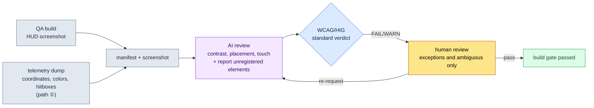

# 9.1 Running the HUD Screenshot Through Lint — Where AI Catches Out-of-Gaze Placement and Failing Contrast

> Primary reader: the UX designer responsible for HUD and UI (on a mid-size team of 10–50)
> Condensed version for solo/hobbyist readers: §9.1.8, "If You're Solo, Just This Much"

The day we put a new debuff alert on the HUD in a QA build, the designer said it "read fine." The next day, the player forums said "I died because I couldn't see the debuff." The alert sat in the center of the screen, pale yellow text on a gray background. It was visible on the designer's monitor — and invisible on a 6-inch phone with combat explosion effects covering the screen. The real problem was that this wasn't the first time. Every build, every screen, the same kind of accident repeated under "it'll probably be fine this time."

This chapter focuses on the one piece of work that breaks that cycle: **a lint gate — a quality gate, in CI terms — that takes a single finished HUD screenshot as input and automatically detects whether any P0 element has drifted out of the zones the eye actually reaches (the top status band and the two bottom action corners), and whether text contrast clears the readability threshold.** The general principles of HUD design — priority tables, gaze flow, platform splits — are already well covered in other books, so this chapter spends its pages only on the *review loop that enforces those principles automatically on every build*. The point is to make AI look at a screen and say, in coordinates and numbers, "this text is at 2.0:1 contrast, which fails WCAG 4.5:1." It replaces the "it looks fine to me" argument with code and standards.

---

## 9.1.1 Review Criteria Are Published Standards, Not Feelings

HUD reviews reach a different conclusion with every reviewer because the criterion is subjective: "it reads fine" versus "it doesn't." Fortunately, much of readability and accessibility has already been nailed down in numbers by standards bodies. There is nothing to make up.

| Review item | Standard threshold (source) | Automatable verdict |
|---|---|---|
| Body text contrast | 4.5:1 or higher (WCAG 2.1 SC 1.4.3) | Yes — computed from foreground/background color values |
| Large text (18pt+) contrast | 3:1 or higher (WCAG 2.1 SC 1.4.3) | Yes |
| Non-text (icons, gauges) contrast | 3:1 or higher (WCAG 2.1 SC 1.4.11) | Yes |
| Minimum touch target size | 44×44 pt (Apple HIG) / 48×48 dp (Material) | Yes — from element size |
| Thumb reach zones | Under a **two-handed landscape grip**, the bottom-left and bottom-right corners rate "easy" (left thumb = movement, right thumb = skills). The industry-standard thumb-zone model | Partial — via zone rules |

Only the last row (thumb reach) is an industry convention rather than a quantitative pass line; the four rows above it are pass lines published by W3C, Apple, and Google. Contrast is the clearest of all. WCAG even publishes the formula: take the relative luminance of the two colors and compute `(L1+0.05)/(L2+0.05)`. Put pale yellow (#D4C84A) text on a gray (#888) background into that formula and you get about 2.0:1 — below 4.5:1, an unambiguous fail by the standard. "It was visible on the designer's monitor" is not a rebuttal that survives here.

One thing needs to be stated plainly. For MMORPGs and RPGs, the mobile screen standard is **landscape**. The reasons are information density and controls. At the same screen size, a landscape grip fits more always-on information per screen than portrait, and both thumbs can operate the left side (movement) and the right side (skills) simultaneously. A one-handed portrait grip suits casual puzzle and idle games; it does not suit an MMORPG with heavy concurrent information and two-handed controls. So every gaze and placement verdict in this chapter assumes a two-handed landscape grip. The screen divides into a horizontal status band along the top, two bottom action corners on the left and right, the central game area between them, and a bottom-center slot bar below the game area (consumables, auto-use items, quick slots).

These five rows are the **review rulebook** this chapter hands to AI. Only when you can say "the debuff text is at 2.0:1 contrast, violating SC 1.4.3" — not "the debuff seems kind of hard to see" — do human review and AI review produce the same verdict.

Putting the platform baselines side by side with PC clarifies the starting point of the review. Project A is mobile-first with PC as the secondary platform, so the rulebook carries both.

| Criterion | PC (secondary platform) | Mobile (primary platform, landscape) |
|---|---|---|
| Screen and input | 27-inch+ / 1px mouse precision, hover, hotkeys | 6.x-inch landscape / two thumbs, no hover |
| Concurrent always-on info | Handles 30–50 kinds | 12–16 kinds is the limit (author's estimate, unverified) |
| Gaze and control reach | The entire screen (the cursor reaches anywhere) | Only the top status band, the bottom-left/right corners, and the bottom-center slot bar are "easy" |
| Precision | 1px clicks | 44pt minimum touch target (HIG) |
| Main review risk | Cognitive load from information overload | Small screen + finger occlusion + center burial |

On PC, mouse precision, hover tooltips, and a large display mean gaze and controls reach even a dense screen. Mobile in landscape beats portrait but still holds less than PC; pressable elements are tied to the two thumb corners, and with no hover, P0 information must stay permanently visible. So the essence of mobile HUD review is not "does it look nice" but **"is every P0 element where the eye reaches (the top band or the two corners), and does the text clear the standard contrast ratio?"** Nailing that verdict to a standard, so it doesn't wobble from person to person, is this chapter's job.

---

## 9.1.2 [Worked Transcript] Running One HUD Screenshot Through Lint

Here is one full cycle of how this actually runs. What follows is a faithful reproduction of a combat HUD review session from my project (a mobile-first MMORPG, "Project A" from here on). The input prompts can be copied as-is; the outputs are reconstructions of the real session.

### Step 1 — Input: Throw the Screenshot and the Element Manifest Together

Throw in only a screenshot and AI "guesses" at the screen. So I attach a manifest of what the build already knows — per-element coordinates, colors, and classifications. This is not something you write fresh; you only extract it from build artifacts (the realities of extraction are compared honestly in §9.1.4).

```yaml
# hud_capture_manifest.yaml — bundled with the QA build screenshot
screen: { w_pt: 844, h_pt: 390 }   # 6.x-inch landscape, in pt (landscape grip)
elements:
  - id: hp_bar        # HP bar
    class: P0
    rect_pt: [12, 18, 150, 16]      # x, y, w, h — top left
    fg: "#FF5A5A"  ; bg: "#1A1A1A"
  - id: skill_slot_1  # skill slot (right thumb)
    class: P0
    rect_pt: [760, 300, 40, 40]     # ← bottom-right corner, note the size
    fg: "#FFFFFF"  ; bg: "#202830"
  - id: debuff_alert  # debuff alert (added yesterday)
    class: P0
    rect_pt: [400, 180, 70, 24]     # ← screen center, note the position
    fg: "#D4C84A"  ; bg: "#888888"   # ← note the contrast
  - id: minimap
    class: P1
    rect_pt: [744, 20, 80, 80]       # top right
    fg: "#A0C0FF"  ; bg: "#101820"
```

*(Korean comments in the manifest: the file header reads "bundled with the QA build screenshot"; 체력바 = HP bar; 스킬 슬롯 (우엄지) = skill slot, right thumb; 디버프 알림 (어제 추가) = debuff alert, added yesterday; 우상단 = top right. The arrow notes flag what to watch: the corner slot's size, the alert's center position, and its contrast.)*

### Step 2 — The Prompt: Ask for a Review, but Force the Standard and the Format

```
The attached screenshot is Project A's combat HUD (two-handed landscape grip), and the yaml holds per-element coordinates, colors, and classes for that screen. Cross-check the two and review.
Compute WCAG contrast from fg/bg and write out the numbers — FAIL below 4.5:1 for text, 3:1 for icons and large text.
WARN if a P0 element leaves the top status band or the bottom-left/right corners and floats in the screen center (the center gets buried under combat effects).
FAIL any interactive element under 44pt, or outside the thumb corners and the bottom-center slot bar.
Report anything visible on screen but missing from the manifest, and pass anything you're not sure about to me marked "ambiguous."
Table only (element | check | measured value | verdict | notes), no prose.
// (intent: P0 = information that must be found within 0.5 seconds / consumables, auto-use, and quick slots belong at the bottom center)
```

*(The prompt, in brief: the attached screenshot is Project A's combat HUD — two-handed landscape grip — and the YAML holds per-element coordinates, colors, and classes; cross-check the two. Compute WCAG contrast from fg/bg and show the numbers — FAIL below 4.5:1 for text, 3:1 for icons and large text. WARN if a P0 element leaves the top status band or the bottom corners and floats in the screen center (the center gets buried under combat effects). FAIL any interactive element under 44pt or outside the thumb corners and the bottom-center slot bar. Report anything visible on screen but missing from the manifest, and pass anything uncertain to me marked "ambiguous." Table only — element | check | measured value | verdict | notes — no prose. The trailing comment states the intent: P0 = information that must be found within 0.5 seconds; consumables, auto-use, and quick slots belong at the bottom center.)*

Note that more lines went into how to output the results than into the review rules themselves. Give AI free rein and it produces compliments like "overall this looks clean." So I nail down five things in advance: **the calculation (WCAG contrast), the pass lines (4.5:1 and 44pt), the output format (a table), the obligation to show measured values, and an escape hatch — "if you're not sure, hand it to a human."** Those five nails turn compliments into measurements.

### Step 3 — Claude's Output (Reconstructed, Raw)

```
| element     | check     | measured value            | verdict | result notes                          |
|-------------|-----------|---------------------------|---------|---------------------------------------|
| hp_bar      | contrast  | #FF5A5A/#1A1A1A = 5.7:1   | PASS    | non-text gauge, meets 3:1             |
| hp_bar      | placement | top left (12,18)          | PASS    | P0, top status band                   |
| skill_slot_1| touch     | 40×40 pt, bottom-right corner | FAIL | below HIG 44pt, short by 4pt (corner OK)|
| skill_slot_1| placement | bottom right (760,300)    | PASS    | right-thumb reach corner              |
| debuff_alert| contrast  | #D4C84A/#888888 = 2.0:1   | FAIL    | below 4.5:1 for body text (SC 1.4.3)  |
| debuff_alert| placement | screen center (400,180)   | WARN    | P0 yet centered — buried under combat effects |
| minimap     | contrast  | #A0C0FF/#101820 = 9.8:1   | PASS    |                                       |
| minimap     | placement | top right (744,20)        | PASS    | P1, allowed on right of top status band |

Additional report:
- The manifest lists 4 elements, but one more blinking yellow icon shows
  at the bottom left of the screenshot (estimated coords ~70,330). Suspected
  manifest omission. (Ambiguous — can't tell from the screen alone what it is)

Summary: 2 FAIL (skill_slot_1 touch, debuff_alert contrast), 1 WARN (debuff_alert
placement), 1 ambiguous (unregistered icon).
```

*(Output columns: 요소 = element, 검사 = check, 측정값 = measured value, 판정 = verdict, 비고 = notes. The checks are 대비 = contrast, 배치 = placement, 터치 = touch. The "additional report" (추가 신고) at the bottom flags one extra blinking yellow icon at the bottom left — estimated coordinates \~70,330 — that is missing from the four-element manifest, marked "ambiguous (애매) — can't tell from the screen alone what it is." Summary line: 2 FAIL — skill_slot_1 touch, debuff_alert contrast; 1 WARN — debuff_alert placement; 1 ambiguous — the unregistered icon.)*

The most valuable part of this output is not the pass/fail table but the **"additional report" and the "ambiguous" entry at the very bottom**. AI caught a blinking icon on screen that the manifest didn't list, and handed it to a human because it could not determine what it was. A good prompt makes it possible for AI to say "this one, I don't know."

### Step 4 — Verification and Rejection (The Human's Place)

Do not accept this output as-is. The AI's review itself gets one round of human review. In this session, one verdict was in fact overturned by a human.

The contrast FAIL and placement WARN on `debuff_alert` are correct. Pale yellow on gray violates the standard exactly as §9.1.1 showed, and putting a P0 alert in the center of a landscape screen is the classic mistake of letting combat effects bury it. So far, AI was right.

The problem is the touch FAIL on `skill_slot_1`. AI took the manifest's `40×40 pt` at face value and ruled "below 44pt" — but in the actual build, this slot draws at 40pt while its **touch hitbox extends 6pt on every side**, making the real tap area 52pt. The manifest's `rect_pt` carried only the *drawn rectangle*, not the *hitbox* — a defect in the input data, not a misjudgment by AI. AI judged precisely within the data it was given (the corner-position verdict was correct), and the human knew a build fact the code didn't: the hitbox expansion. This FAIL, the human strikes down.

So two things happen at once: fix the manifest extraction script so it dumps hitboxes too (repairing the data defect), and re-request from AI.

```
skill_slot_1 draws at 40pt visually, but its hitbox extends 6pt on every side, so the real tap area is 52pt (hit_rect added to the manifest). Re-check touch against this.
Leave the debuff_alert FAIL/WARN as-is, and propose 3 color combinations that clear 4.5:1 contrast (keep the yellow family, darken the background). Also give one coordinate to move it from the center to the right side of the top status band.
```

AI corrected `skill_slot_1` to PASS against the 52pt hitbox, returned three color combinations for the debuff that darken the background to #2A2A00 and reach 7.8:1, and gave one coordinate that moves the alert to the right side of the top status band (around 600,18). One round trip, done. **Sweep the screen by eye every build and the same accidents repeat; run the screenshot plus manifest through lint and the contrast, placement, and touch violations drop out as numbers, leaving humans to judge only the exceptions code doesn't know (hitboxes) and the ambiguous cases (unregistered icons)** (one screen takes a dozen-plus minutes by hand, a few minutes with this loop — author's estimate, an unverified hypothesis; read it less as absolute times and more as the structural difference between "sweeping by eye" and "measuring against a standard").

---

## 9.1.3 Landscape HUD Gaze and Placement — Why the Center Is Dangerous

Capture in a single diagram why `debuff_alert` earned its WARN in the session above and where P0 information belongs, and every placement verdict afterward gets faster. On a phone held in landscape, the screen divides into four places: the **horizontal status band at the top** (where the gaze lands first and fingers never go — read-only), the **two bottom corners** left and right (where both thumbs rest — left thumb = movement, right thumb = skills), the **central game area** between them (where combat happens), and the **bottom-center slot bar** below the game area (consumables, auto-use items, quick slots and skill slots). In the figure below, green and amber are where P0 elements and slots are safe; red is the game center where P0 alerts get buried.

<svg viewBox="0 0 660 340" xmlns="http://www.w3.org/2000/svg" role="img" aria-label="Gaze zones and P0/P1 placement map of a mobile landscape HUD">
  <!-- phone outline (landscape) -->
  <rect x="20" y="30" width="620" height="280" rx="30" ry="30" fill="#0f1117" stroke="#3a3f4b" stroke-width="3"/>
  <rect x="34" y="44" width="592" height="252" rx="14" ry="14" fill="#11151d"/>
  <!-- top status band (green — first gaze priority, read-only) -->
  <rect x="34" y="44" width="592" height="56" fill="#14532d" opacity="0.55"/>
  <path d="M44 52 H616" fill="none" stroke="#22c55e" stroke-width="2.5" stroke-dasharray="6 4"/>
  <text x="330" y="92" fill="#bbf7d0" font-family="sans-serif" font-size="12" text-anchor="middle" font-weight="bold">Top horizontal status band — first gaze priority (HP · MP · target, read-only)</text>
  <!-- central danger zone (red): game area, a P0 placed here gets buried under effects -->
  <rect x="180" y="100" width="300" height="138" fill="#7f1d1d" opacity="0.4"/>
  <text x="330" y="158" fill="#fecaca" font-family="sans-serif" font-size="13" text-anchor="middle">Center — game area (effect overload)</text>
  <text x="330" y="178" fill="#fecaca" font-family="sans-serif" font-size="11" text-anchor="middle">P0 alerts get buried — where debuff_alert was flagged</text>
  <!-- bottom-center slot bar (amber — consumables, quick slots, auto-use; below the game area) -->
  <text x="330" y="240" fill="#b45309" font-family="sans-serif" font-size="11" text-anchor="middle" font-weight="bold">Bottom center — consumables · quick slots · auto</text>
  <rect x="248" y="248" width="164" height="42" rx="8" fill="#f59e0b" opacity="0.5" stroke="#f59e0b" stroke-width="2" stroke-dasharray="5 4"/>
  <circle cx="298" cy="270" r="11" fill="#fbbf24"/><text x="298" y="274" fill="#000" font-size="8" text-anchor="middle">Potion</text>
  <circle cx="330" cy="270" r="11" fill="#fbbf24"/><text x="330" y="274" fill="#000" font-size="8" text-anchor="middle">Auto</text>
  <circle cx="362" cy="270" r="11" fill="#fbbf24"/><text x="362" y="274" fill="#000" font-size="8" text-anchor="middle">Slot</text>
  <!-- bottom-left thumb corner (green) -->
  <path d="M34 296 L34 146 A150 150 0 0 1 184 296 Z" fill="#14532d" opacity="0.7"/>
  <path d="M34 146 A150 150 0 0 1 184 296" fill="none" stroke="#22c55e" stroke-width="2.5" stroke-dasharray="5 4"/>
  <text x="92" y="254" fill="#bbf7d0" font-family="sans-serif" font-size="13" text-anchor="middle" font-weight="bold">Left thumb</text>
  <text x="92" y="274" fill="#bbf7d0" font-family="sans-serif" font-size="12" text-anchor="middle">Move</text>
  <!-- bottom-right thumb corner (green) -->
  <path d="M626 296 L626 146 A150 150 0 0 0 476 296 Z" fill="#14532d" opacity="0.7"/>
  <path d="M626 146 A150 150 0 0 0 476 296" fill="none" stroke="#22c55e" stroke-width="2.5" stroke-dasharray="5 4"/>
  <text x="568" y="254" fill="#bbf7d0" font-family="sans-serif" font-size="13" text-anchor="middle" font-weight="bold">Right thumb</text>
  <text x="568" y="274" fill="#bbf7d0" font-family="sans-serif" font-size="12" text-anchor="middle">Skills</text>
  <!-- actual element markers -->
  <rect x="60" y="60" width="60" height="10" rx="3" fill="#ef4444"/><text x="90" y="68" fill="#fff" font-size="8" text-anchor="middle">HP</text>
  <rect x="60" y="78" width="60" height="10" rx="3" fill="#3b82f6"/><text x="90" y="86" fill="#fff" font-size="8" text-anchor="middle">MP</text>
  <rect x="300" y="56" width="44" height="20" rx="4" fill="#0ea5e9" opacity="0.8"/><text x="322" y="70" fill="#fff" font-size="8" text-anchor="middle">Target</text>
  <rect x="560" y="54" width="48" height="40" rx="6" fill="#0ea5e9" opacity="0.7"/><text x="584" y="78" fill="#fff" font-size="8" text-anchor="middle">Map P1</text>
  <circle cx="330" cy="204" r="13" fill="#facc15" opacity="0.5"/><text x="330" y="208" fill="#000" font-size="6" text-anchor="middle">Debuff?</text>
  <circle cx="92" cy="220" r="17" fill="#22c55e"/><text x="92" y="224" fill="#000" font-size="9" text-anchor="middle">Move</text>
  <circle cx="556" cy="222" r="14" fill="#22c55e"/><text x="556" y="226" fill="#000" font-size="9" text-anchor="middle">Skill</text>
  <circle cx="592" cy="210" r="13" fill="#22c55e"/><text x="592" y="214" fill="#000" font-size="9" text-anchor="middle">Skill</text>
  <circle cx="600" cy="272" r="12" fill="#22c55e"/><text x="600" y="276" fill="#000" font-size="8" text-anchor="middle">Skill</text>
</svg>

The rule is simple. **P0 information (HP, MP, critical alerts) goes inside the green — the top horizontal status band or the two bottom corners.** Those are the paths the gaze hits first or where the thumbs always rest. Conversely, **the game center (red) is where combat itself happens** — put a P0 alert there and the moment effects flood the screen, the information is buried. One caution: the game center and the **bottom center** are not the same. The game center is dangerous, but the **bottom-center slot bar (amber) below it is where consumables, auto-use items, quick slots, and skill slots live.** It sits between the two thumbs so that what I use, or what gets consumed automatically, stays in view at a glance. And the mapping is threefold: **read-only information (HP/MP/target health) at the top**, **pressable elements (movement, skills) in the two bottom corners**, **consumables and slots at the bottom center** — these are the finger and gaze zones. This one diagram explains why the debuff alert took a WARN in §9.1.2: a P0 element that must be seen within 0.5 seconds was placed, of all places, in the game center where it is least visible. The fix that moved it to the right side of the top status band sent it straight back into this diagram's green.

---

## 9.1.4 How to Extract the Coordinates — Implementation Honesty

This chapter's lint stands on the premise that clean per-element coordinates and colors come in. But *where and how you extract those coordinates* is, in practice, the most consequential fork in the road. It's the part books usually fudge, so here is an honest comparison of the three paths. There is no single right answer; it splits by team situation.

| Path | What it does | Strength | Weakness / reality |
|---|---|---|---|
| ① In-game telemetry log | The build itself dumps the coordinates, sizes, and colors of the widgets the UI framework draws | Coordinates are **exact** (not estimates); hitboxes and anchors come out too | A dump hook must be planted in UI code. Requires programmer collaboration. Once in place, the most trustworthy |
| ② Off-the-shelf vision API | Feed the screenshot to an OCR/object-detection API and extract text and box coordinates | No build changes needed; works on external screenshots too | Coordinates are **approximations**; weak at classifying non-text such as gauges and icons. Sending data out = leak risk for an unreleased build |
| ③ Build it yourself (pixel analysis) | Read the screenshot directly and extract color boundaries and boxes heuristically | Minimal dependencies; sufficient for contrast math | Knows nothing of element *meaning* (is this P0?). Useful only when cross-checked against a manifest. Maintenance burden |

The relationship among the three paths explains this chapter's worked transcript exactly. In §9.1.2, **the contrast checks were accurate because the color values (fg/bg) came in exactly via ① or ③**, and **the touch FAIL was overturned by a human because the hitbox was missing from the manifest** (② and ③ cannot see hitboxes; only ① can). In other words, *contrast* can be caught from pixels alone, but *touch hitboxes* cannot be caught without ① telemetry. Know this limit going in, and you know where to draw the line on how far to trust AI review results.

My project's choice is the structure of **① telemetry as the source of truth, with AI as the reviewer cross-checking the screenshot against the telemetry manifest**. AI catches what shows on screen but isn't in the manifest (the unregistered blinking icon of §9.1.2); humans catch what's in the manifest but wrong on screen. Either one alone leaves blind spots on both sides.



Human hands touch only two places: feeding in a clean telemetry dump (the front), and judging the exceptions code and standards can't catch (hitboxes) and the ambiguous cases (unregistered elements) at the back. The tedious contrast math and placement cross-checks in between, AI and the standards grind through.

---

## 9.1.5 From Rulebook to Code — Automatic Gates for Contrast, Touch, and Corners

Having AI redo the arithmetic every time costs tokens and time. **Items that resolve deterministically — contrast, touch size, corner reach — get hit by code first.** AI steps in only for what code can't catch: interpreting what the screen means, spotting unregistered elements. The two are not in competition; they divide the work.

```python
# hud_lint.py — standards validation for the HUD manifest (skeleton)
# input: telemetry manifest (per-element rect/hit_rect/fg/bg/class/interactive)
# output: list of WCAG/HIG + two-handed reach violations

def _luminance(hex_color):           # WCAG relative luminance
    r, g, b = (int(hex_color[i:i+2], 16) / 255 for i in (1, 3, 5))
    f = lambda c: c/12.92 if c <= 0.03928 else ((c+0.055)/1.055) ** 2.4
    R, G, B = f(r), f(g), f(b)
    return 0.2126*R + 0.7152*G + 0.0722*B

def contrast_ratio(fg, bg):          # WCAG contrast ratio
    L1, L2 = sorted((_luminance(fg), _luminance(bg)), reverse=True)
    return (L1 + 0.05) / (L2 + 0.05)

def in_thumb_corner(e, w, h):
    """Is this in a bottom-left/right corner a thumb reaches under a two-handed landscape grip?"""
    x, y = e["hit_rect"][0] / w, e["hit_rect"][1] / h
    bottom = y > 0.55
    left_corner  = bottom and x < 0.30   # left thumb = movement
    right_corner = bottom and x > 0.70   # right thumb = skills
    return left_corner or right_corner

def lint(elements, screen_w, screen_h):
    issues = []
    for e in elements:
        # rule A: contrast ratio (text 4.5:1 / non-text & large text 3:1)
        need = 4.5 if e["kind"] == "text" else 3.0
        cr = contrast_ratio(e["fg"], e["bg"])
        if cr < need:
            issues.append(f"[A] {e['id']}: contrast {cr:.1f}:1 < {need}:1 (WCAG SC 1.4.3)")
        # rule B: touch target — based on the hitbox (not the visual size)
        if e.get("interactive"):
            tap = min(e["hit_rect"][2], e["hit_rect"][3])   # ← hit_rect, not rect
            if tap < 44:
                issues.append(f"[B] {e['id']}: tap {tap}pt < 44pt (HIG)")
            # rule C: interactive elements must sit in the two thumb corners (bottom left/right)
            if not in_thumb_corner(e, screen_w, screen_h):
                issues.append(f"[C] {e['id']}: interactive element placed outside the two-handed thumb corners "
                              f"(x={e['hit_rect'][0]}, y={e['hit_rect'][1]})")
    return issues
```

*(In the code's Korean strings and comments: rule A is contrast — 대비 = contrast; rule B is the touch target checked against the hitbox, not the visual size — 탭 = tap; rule C requires interactive elements to sit in the two thumb corners — the message reads "interactive element placed outside the two-handed thumb corners." The docstring of `in_thumb_corner` asks: is this in a bottom-left/right corner that a thumb reaches under a two-handed landscape grip?)*

This code ends the meeting-room skirmish of "isn't this text a little hard to read?" When code prints `[A] debuff_alert: 대비 2.0:1 < 4.5:1 (WCAG SC 1.4.3)` ("대비" = contrast), there is nothing left to debate. You fix it. Two lines deserve attention: rule B reads `hit_rect`, not `rect`, and rule C passes interactive elements only in the two bottom corners, left and right — the lesson from §9.1.2 where a human overturned AI (the hitbox), and the reach limits of a two-handed landscape grip, both written into code. The key to the landscape verdict is that it checks the left-thumb corner (movement) and the right-thumb corner (skills) separately, rather than a single "thumb arc" threshold. An exception a human catches once, code catches from then on. That leaves AI a deliberately narrow role: "skip what code already passed; report only what shows up on screen alone — unregistered elements, visual overlap, clipping." What resolves deterministically goes to code, what needs on-screen interpretation goes to AI, and the exceptions that require knowing the build go to humans — that division is the heart of it.

---

## 9.1.6 Where This Chapter's Numbers Come From

The numbers in this chapter have only three kinds of sources. Contrast 4.5:1, touch 44pt, and 48dp are the official values of WCAG SC 1.4.3, the HIG, and Material; pale yellow #D4C84A on a #888 background coming out to about 2.0:1 is a computed value — those color values plugged into the published formula (§9.1.1, §9.1.5). "A dozen-plus minutes per screen by hand, a few minutes with the loop" and "12–16 kinds of always-on landscape information" are unverified author's estimates and are labeled as such in the body. The rest — contrast FAIL counts per build, undersized touch hitboxes, thumb-corner violations, telemetry mis-tap rates — are values you can count directly from build logs. Outcome metrics like player complaint counts, where causation can't be pinned on the HUD alone, were not promoted to KPIs.

---

## 9.1.7 Common Failures

| Pattern | Why it fails | Prescription |
|---|---|---|
| Eyeball review on the designer's monitor | Misses the 6-inch screen and combat-effect conditions, so contrast accidents repeat | Make screenshot lint a build gate (§9.1.2) |
| Throwing only a screenshot at AI with "review this" | It guesses coordinates and returns approximate verdicts — not trustworthy | Attach the telemetry manifest (§9.1.4) |
| Judging touch targets by visual size | Misses hitbox expansion and FAILs perfectly fine buttons | Check against `hit_rect` (§9.1.5) |
| Placing P0 alerts in the screen center | Buried under combat effects — "died because I couldn't see it" | Move to the top status band or the two corners (§9.1.3) |
| Placing control buttons at the screen's mid-left or top | Thumbs can't reach them in a two-handed landscape grip | Move to the bottom-left/right corners (§9.1.5, rule C) |
| Designing around a one-handed portrait grip | Two-handed landscape is the MMORPG standard; neither the information nor the controls fit | Switch to two-handed landscape (§9.1.1) |
| Debating contrast as "I can see it / I can't" | Conclusions differ from person to person | Use the computed WCAG 4.5:1 value (§9.1.1) |

The fourth one repeats most often. When a new alert gets added in a hurry, the only empty space is the screen center, so that's where it lands — and that center is exactly where the game happens.

---

## 9.1.8 Try It Yourself — One Step You Can Take Today

> **If you're solo, just this much**: You don't need telemetry or a manifest. Take one landscape HUD screenshot of your own game (or a game you love), eyedropper the foreground/background colors of the two or three smallest pieces of text or icons, jot them down by hand, and run §9.1.2's prompt once. Pick one contrast figure AI computed and re-verify it yourself with an online WCAG contrast calculator — you'll feel firsthand how "I can see it / I can't" turns into a number. If AI lets a P0 element sit in the screen center, push back: "look again at why the center is dangerous."

If you're on a team, start with this one step. Agree with a programmer on the telemetry hook that dumps widget coordinates, colors, and hitboxes from the UI framework (path ①), and put just the `contrast_ratio` function from §9.1.5 into the build. The contrast formula is a published standard, so there's no arguing with it, and that one function alone makes contrast FAILs drop out as numbers on every build. Layer `in_thumb_corner` on next, and code starts catching control elements that stray from the corners under a two-handed landscape grip. Interpretation — placement, unregistered elements — goes on top of that, with AI.

---

### Key Takeaways
- HUD review criteria are published standards, not feelings (WCAG 4.5:1, HIG 44pt).
- Run the screenshot plus the telemetry manifest through AI to detect contrast, placement, and unregistered-element issues.
- Under a two-handed landscape grip, pressable elements go in the two bottom corners and read-only information in the top status band — the center gets buried.

### Next Chapter Preview
- 9.2 Four Skill Slot Columns or Eight — a case where one decision's simultaneous effects on cognition, combat, platform, and screen real estate are untangled by measurement
