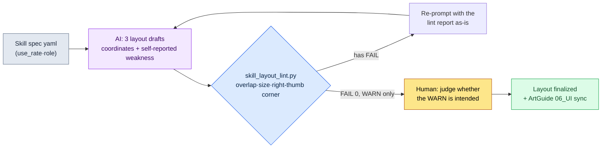

# 9.2 Skill Button Layout — AI Drafts Three Layouts, lint Rejects Them

> Primary audience: UX and combat designers on mobile-first action games and MMORPGs (mid-size teams)
> Scaled-down version for solo/hobbyist readers: §9.2.7 "Solo Scale-Down"

Where and how do you lay out a new class's six skills on a mobile screen? Whenever this question reached a meeting, the first 30 minutes always went the same way. Someone would draw six circles on the whiteboard, someone else would say "the thumb can't reach that," and a third person would counter, "move them up and they cover the minimap." All three were right, and no conclusion came. At the next meeting, the same whiteboard got drawn again.

The problem is that drawing layout drafts and checking whether those drafts follow the rules are tangled together inside one person's head. The person who drew a draft has a hard time rejecting it. This chapter pulls those two apart. **The tedious work of drafting multiple layouts goes to AI, and code rejects any draft that violates the overlap, thumb-corner, and touch-size rules.** The human stands only at the spot where, among the drafts the code has passed, one gets picked for "game feel." If 9.1 built the rulebook for the whole HUD (heads-up display), this chapter is one full cycle of applying that rulebook, end to end, to skill buttons — the single piece your hands touch most.

---

## 9.2.1 Why Skill Buttons Are Hard — Information You Press, Not Information You Read

Most elements on a HUD are read-only. Nobody taps the HP bar. That is why, in the thumb-corner diagram of §9.1, HP, MP, and target health could sit in the unreachable top reading zone. Skill buttons are the exact opposite. They must be pressed precisely, on a 0.1-second scale, and in combat your eyes are on the enemy, so your finger finds the position from *memory*. Shift the position even slightly and a mistap happens right there.

For mobile MMORPGs, the landscape two-handed grip is the standard: pressable elements go in the two bottom corners, and consumables/slots in the bottom center (§9.1 covers why landscape is the standard and what the three zones are). Within that standard, skills almost all land in the **bottom-right corner cluster the right thumb can reach** (the left thumb is tied up with movement at the bottom left). One distinction applies — active skills pressed on a 0.1-second scale belong in this bottom-right cluster, but consumables, auto-use items, and quick slots go in a separate slot bar at the bottom center, between the two thumbs. This chapter covers active skill buttons only, and every coordinate check assumes the landscape two-handed grip.

So skill button placement is bound by three deterministic rules at once — minimum touch target (44pt per Apple's Human Interface Guidelines, HIG), spacing between adjacent buttons (8dp per Google's Material Design), and thumb reach (skills go in the right thumb's bottom-right corner). All three are already in the rulebook built in §9.1.1 as items judgeable by coordinates and size, so the public-standard numbers follow that rulebook (44pt touch and 8dp spacing are certified figures; only the right-thumb corner is an industry-common model). These three become the **primary input to the lint** that rejects AI layout drafts in this chapter. When the code says "skill_3 is 40pt, below the HIG 44pt minimum" instead of "isn't this button a bit small?", the 30 minutes at the whiteboard disappear.

Putting the platform baselines side by side with PC makes the starting point clear. PC is precise and high-volume; mobile landscape is restricted to the two-handed corners (see the §9.1 rulebook for the full comparison table). Looking at skill input alone, the difference is plain — on PC, hotkeys let skills sit anywhere on screen: fingers stay on the keyboard, so reach is a non-issue and many slots are possible. Mobile landscape has no hover and no hotkeys, so skills must be laid in the **bottom-right corner the right thumb reaches**, in frequency order (with a limit of 6\~8 exposed at once), and the most-used skill must sit on the inner side of the corner (the most reachable spot). So the essence of mobile skill layout is not "a pretty arrangement" but **"frequency-ordered priority placement inside the right-thumb corner, plus rulebook review."** And drawing multiple drafts is tedious when done by hand, and the standard drifts every time. Tedious, fickle repetitive work — exactly the spot where AI outlasts a human.

---

## 9.2.2 [Worked Transcript] Layout Drafts for a New Class's Six Skills — Having AI Draft Three Options

I will show one full cycle — from input through draft rejection to the end — of placing the six active skills of the new "Shaman" class on mobile. What follows faithfully reproduces a new-skill UI session from my own project (a mobile-first MMORPG, "Project A" below). The inputs and prompts can be copied as-is; the outputs are reconstructed from the actual session.

### Step 1 — Input: Skill Specs as a Machine-Readable Table

Turn the six skills' use frequency and basic character into yaml. The use rates are values pulled from combat logs in the data sheet, so nothing here is newly made up.

```yaml
# skill_set_shaman.yaml — new class 'Shaman', 6 active skills
screen: { w: 2400, h: 1080, dpr: 3 }   # based on a 6.x-inch landscape screen, pt = px / dpr
skills:
  - id: s1_quickbolt    # basic attack, most frequent
    use_rate: 0.41      # share of use in combat (extracted from logs)
    role: spam          # rapid tapping
  - id: s2_hex          # debuff, frequent
    use_rate: 0.22
    role: core
  - id: s3_totem        # placeable, moderate
    use_rate: 0.14
    role: core
  - id: s4_heal         # heal, occasional but urgent
    use_rate: 0.11
    role: panic         # instant in emergencies
  - id: s5_curse        # AoE debuff, occasional
    use_rate: 0.08
    role: situational
  - id: s6_ultimate     # ultimate, rare
    use_rate: 0.04
    role: burst
```

The key slots are `use_rate` and `role`. The most-pressed `s1_quickbolt` (41%) and `s4_heal` (panic) — which must be found within 0.2 seconds in an emergency — have to sit where the right thumb reaches best (the inner bottom-right corner). The rarely used `s6_ultimate` (4%) can sit at the corner's edge, a bit farther out. This priority is the entire input for the AI layout in the next step.

### Step 2 — Prompt: Force Three Drafts and Get Coordinates as Numbers

```
The attached yaml is a new class's 6 active skills. Make 3 skill button layout drafts for a landscape two-handed grip screen. Lay the skills in the bottom-right corner the right thumb reaches (the left hand is tied up with movement at the bottom left).
The three drafts must follow different philosophies — e.g., a corner fan, a 2-row grid, frequency-weighted. For every button give x,y,w,h in px (screen 2400x1080, dpr 3, pt=px/3).
Put frequently used or role=panic skills on the inner side of the corner where the right thumb reaches well; touch targets at least 132px (44pt), adjacent spacing at least 24px (8dp).
For each draft you must also write one line of design intent and one weakness you see — a draft with no weakness is not allowed. Per draft, only (layout philosophy|coordinate table|design intent|self-weakness), no explanations.
```

The part of this prompt I worked on harder than the placement instructions is the part that forces the output format and the weakness disclosure. Without numeric coordinates I cannot run the lint, so I pinned down px output, and I made the AI submit "one weakness of this draft" alongside, so it states its own limits first. Ask it freely to "make a pretty UI" and what comes back is the average layout of a generic mobile RPG, in words, with no picture.

### Step 3 — Claude's Output (Reconstructed from the Actual Session, Excerpt)

```
== Draft A: bottom-right corner fan ==
Layout philosophy: 6 buttons fanned around the right thumb's pivot. Frequency order, inner→outer.
| id          | x    | y   | w   | h   | pt   |
|-------------|------|-----|-----|-----|------|
| s1_quickbolt| 2160 | 912 | 168 | 168 | 56pt |
| s2_hex      | 2016 | 852 | 132 | 132 | 44pt |
| s3_totem    | 2052 | 996 | 132 | 132 | 44pt |
| s4_heal     | 1884 | 924 | 132 | 132 | 44pt |
| s5_curse    | 1920 | 780 | 120 | 120 | 40pt |
| s6_ultimate | 1788 | 840 | 120 | 120 | 40pt |
Design intent: the frequently used s1 goes largest, on the easiest-to-reach inner bottom-right corner.
Self-weakness: s5,s6 at 40pt may fall short of HIG. Right-thumb reach is iffy at the fan's outer edge.

== Draft B: 2-row grid (2x3) ==
Layout philosophy: 2-row x 3-column grid at the bottom right. Visual alignment first.
| id          | x    | y   | w   | h   |
|-------------|------|-----|-----|-----|
| s1_quickbolt| 2208 | 912 | 132 | 132 |
| s2_hex      | 2052 | 912 | 132 | 132 |
| s3_totem    | 1896 | 912 | 132 | 132 |
| s4_heal     | 2208 | 756 | 132 | 132 |
| s5_curse    | 2052 | 756 | 132 | 132 |
| s6_ultimate | 1896 | 756 | 132 | 132 |
Design intent: all buttons the same size; the alignment is clean.
Self-weakness: the upper row (s4,s5,s6, y=756) sits at the upper boundary of the right-thumb corner, so reach is iffy.
         The emergency heal s4 is on the upper row, so it may be slow to find in a crisis.

== Draft C: frequency-weighted fan ==
Layout philosophy: s1 as a large central circle, the rest wrapped around the right thumb's pivot in frequency order.
| id          | x    | y   | w   | h   |
|-------------|------|-----|-----|-----|
| s1_quickbolt| 2184 | 900 | 180 | 180 |
| s2_hex      | 2028 | 852 | 144 | 144 |
| s3_totem    | 2052 | 996 | 132 | 132 |
| s4_heal     | 1908 | 912 | 144 | 144 |
| s5_curse    | 1932 | 792 | 120 | 120 |
| s6_ultimate | 1812 | 972 | 120 | 120 |
Design intent: the hand goes to s1 naturally, and the emergency s4 is enlarged and kept on the inner corner.
Self-weakness: being a fan, button spacing is uneven. Proximity collision risk between s2-s5 and s4-s6.
```

That all three drafts reported a self-identified weakness is the core of this output. A flagged "possible 40pt shortfall," B "emergency heal on the upper row," C "proximity collision risk." The AI pointed first at the weak spots of its own drawing. But this is only self-reporting; the real verdict comes from the code.

### Step 4 — lint: The Code Rejects All Three Drafts

Compare the three drafts by eye and the taste fight starts again — "B looks cleaner, though." So I feed all three, as-is, into `skill_layout_lint.py` from §9.2.3. The results came out like this.

```
[Draft A] bottom-right corner fan
  [FAIL] B-size  : s5_curse 40pt < 44pt (below HIG)
  [FAIL] B-size  : s6_ultimate 40pt < 44pt (below HIG)
  [WARN] C-corner: s6_ultimate x=1788 — corner's left boundary, right-thumb reach 'medium'
  → passed 4/6, critical violations 2

[Draft B] 2-row grid (2x3)
  [FAIL] C-corner: s4_heal     y=756 (0.70h) < 0.55h not below → above the right-thumb corner
  [FAIL] C-corner: s5_curse    y=756 (0.70h) < 0.55h not below → above the right-thumb corner
  [WARN] role    : s4_heal(panic) y=756 — emergency skill on the upper row
  → passed 4/6, critical violations 2

[Draft C] frequency-weighted fan
  [FAIL] A-overlap: s2_hex ∩ s5_curse gap 18px < 24px (below 8dp)
  [FAIL] A-overlap: s4_heal ∩ s6_ultimate gap 12px < 24px (below 8dp)
  → passed 4/6, critical violations 2
```

All three drafts failed. What is interesting is that the self-reports and the lint verdicts nearly overlapped. Violations actually occurred where the AI had called out "weaknesses." But the self-report said "risk," while the lint says a number: "s2_hex and s5_curse, 18px apart." Nothing is left to debate in the meeting.

There is one important decision at this step. All three failing does not mean going back to square one. **Paste the lint report into the next prompt, as-is, and re-prompt.**

### Step 5 — Re-Prompt: Feed the lint Report Back As-Is

```
Pasting the lint results for all three drafts as-is (the report above). Pick only the one draft whose violations are easiest to fix and give me a single revision that brings every FAIL to 0.
All buttons at least 132px (44pt), spacing at least 24px (8dp), and s4_heal(panic) goes in the spot inside the right-thumb corner that reaches second-best after s1.
Give only the coordinate table, plus one line each on which FAIL was resolved and how.
// (intent: inside the corner = x>70% of width(1680), y>55% of height(594))
```

The AI picked draft A (the corner fan). Its only violations were "two buttons under size," so it required the least surgery. It enlarged the failing s5 and s6 to 132px, and to recover spacing for the larger buttons, it nudged the fan curve slightly toward the inner corner.

```
== Draft A' (revised) ==
| id          | x    | y   | w   | h   | pt   |
|-------------|------|-----|-----|-----|------|
| s1_quickbolt| 2160 | 900 | 168 | 168 | 56pt |
| s2_hex      | 2010 | 846 | 132 | 132 | 44pt |
| s3_totem    | 2046 | 990 | 132 | 132 | 44pt |
| s4_heal     | 1872 | 918 | 144 | 144 | 48pt |
| s5_curse    | 1908 | 774 | 132 | 132 | 44pt |
| s6_ultimate | 1740 | 858 | 132 | 132 | 44pt |
Resolved: B-size s5 40→44pt / B-size s6 40→44pt /
     C-corner s6 stays inside the corner at x=1740(0.725w)·y=858(0.79h) →
     role: s4_heal enlarged to 144px to strengthen emergency identification.
```

I fed draft A' back into `skill_layout_lint.py`.

```
[Draft A'] bottom-right corner fan (revised)
  [PASS] B-size  : all buttons ≥ 44pt
  [PASS] A-overlap: minimum gap 30px ≥ 24px
  [PASS] C-corner : all control buttons inside the right-thumb corner (x≥1680, y≥594)
  [WARN] C-corner : s6_ultimate x=1740 — corner's left edge, reach 'medium'
  → passed 6/6, critical violations 0, WARN 1
```

FAIL reached 0. The one remaining WARN (`s6_ultimate` sits at the corner's left edge, so right-thumb reach is "medium," not "easy") is not auto-killed by the code. It goes up to a human. And this WARN is in fact **intended design**. s6 is the ultimate, used least at a 4% use rate, so the innermost corner spot should be ceded to the frequently used s1, and the edge is the right place for it. A human ruled "this WARN is intended" and passed it. The cycle — input → 3 drafts → lint → wipeout → re-prompt → pass — closes here.

This one loop is this chapter's bar for Show. Unless you watch to the end — what the AI draws, what the lint rejects, and which WARN a human keeps alive — the sentence "we generated UI drafts with AI" is hollow.

---

## 9.2.3 The lint as Code — Overlap, Thumb Corner, and HIG Size

The heart of the cycle above is some 30 lines of code that reject violations of three rules. The three items in the §9.2.1 table become three functions, one for one.

```python
# skill_layout_lint.py — skill button layout verification (skeleton)
# Input: list of button coordinates from the AI [{id, x, y, w, h, role, use_rate}]
# Output: list of A-overlap / B-size / C-corner violations
# Premise: landscape two-handed grip. Skills go in the bottom-right corner the right thumb reaches.

MIN_TAP_PX    = 132    # HIG 44pt * dpr 3 = 132px
MIN_GAP_PX    = 24     # Material 8dp * dpr 3 = 24px
RIGHT_CORNER_X = 0.70  # right of 0.70 of screen width = right-thumb corner
BOTTOM_Y       = 0.55  # below 0.55 of screen height = bottom corner

def in_right_thumb_corner(b, w, h):
    """Is this inside the bottom-right corner the right thumb reaches in landscape grip?
    (left thumb = bottom-left movement, right thumb = bottom-right skills)"""
    rx, ry = b["x"] / w, b["y"] / h
    return rx > RIGHT_CORNER_X and ry > BOTTOM_Y

def lint(buttons, screen_w, screen_h):
    issues = []
    # Rule B: minimum touch target size (HIG 44pt)
    for b in buttons:
        side = min(b["w"], b["h"])
        if side < MIN_TAP_PX:
            issues.append(f"[FAIL] B-size : {b['id']} {side//3}pt "
                          f"< 44pt (below HIG)")
    # Rule A: adjacent button overlap/gap (distance between the two nearest edges)
    for i, a in enumerate(buttons):
        for c in buttons[i+1:]:
            gap = edge_gap(a, c)          # shortest gap between two rects (px)
            if gap < MIN_GAP_PX:
                issues.append(f"[FAIL] A-overlap: {a['id']} ∩ {c['id']} "
                              f"gap {gap}px < {MIN_GAP_PX}px (below 8dp)")
    # Rule C: control elements stay inside the right-thumb corner. For panic, the more inner the better.
    for b in buttons:
        rx, ry = b["x"] / screen_w, b["y"] / screen_h
        if not in_right_thumb_corner(b, screen_w, screen_h):
            issues.append(f"[FAIL] C-corner: {b['id']} "
                          f"x={b['x']}({rx:.2f}w) y={b['y']}({ry:.2f}h) "
                          f"→ outside the right-thumb corner")
        elif b.get("role") == "panic" and rx < 0.78:
            issues.append(f"[WARN] role   : {b['id']}(panic) "
                          f"emergency skill near the corner's inner boundary")
    return issues
```

This code is what neutralizes the taste remark "but draft B is prettier" in a meeting. Prettiness is something to argue about after the lint has passed a draft. A draft that draws a `[FAIL]` from the lint does not enter the build, pretty or not. This applies the HUD lint gate built in §9.1.1 all the way through to skill buttons, the trickiest single piece — and the same division of labor holds here: what can be judged by coordinates and size goes to code, and "is this WARN intended?" goes to a human.

Here is the whole cycle at a glance.



Human hands touch only two places: the very front, where the input spec goes in clean, and the very end, where the WARNs the lint cannot kill get judged. The tedious three-draft generation and coordinate checking in between are run by the AI and the lint.

---

## 9.2.4 Log the Pass Rate — See the Tool's Performance in Numbers

Pull one layout and stop, and you cannot tell whether this tool works. So I log the lint results every time. What gets recorded is simple — **how many of the AI's drafts passed the first lint run (first-pass rate), and how many re-prompts it took to reach FAIL 0 (round-trip count).**

The figures below are measured values I counted myself while building the skill UIs of three new classes (the Shaman plus two others) through this cycle. The sample is small — 3 classes, 9 layout sessions — so the right way to read them is as directional values, not precise population parameters. None of the numbers are doctored.

| Item | Measured | Note |
|---|---|---|
| AI first drafts passing the first lint run | 1 of 9 | the other 8 had one or more FAILs |
| Average FAILs on the first run | 1.8 per draft | mostly size shortfalls or outside the right-thumb corner |
| Average round trips to FAIL 0 | 1.4 | lint-report re-feed method |
| Most common FAIL type | B-size (size shortfall) | C-corner (right-thumb corner) next |

The most important row is the first one. **The AI's first drafts failed the lint 8 times out of 9.** That is not the tool failing — it is the signal of normal operation. Let the AI emit coordinates freely and it violates HIG 44pt often. The lint catches it every time, and feeding the report back reaches 0 in one or two round trips. If the first-pass rate had been 100%, that would mean the lint is too loose — not that the AI is perfect.

This pass-rate log also becomes the basis for deciding whether to tighten or loosen lint rules. If some FAIL type gets released by human hands every time as "actually intended," that rule is too strict. Conversely, if mistap complaints come in after launch on layouts the lint passed, the rules are too loose.

---

## 9.2.5 The Final Layout as a Picture — Button Layout SVG

Drawing the lint-passing draft A' from §9.2.2 at its exact coordinates gives the picture below. What the table's numbers look like on an actual screen only sinks in as a picture. Holding a landscape phone with both hands, the left thumb lands at the bottom left (movement) and the right thumb at the bottom right (the skill cluster). Circle size is proportional to the touch target (pt), and color is thumb-reach difficulty (green easy / yellow medium).

<svg viewBox="0 0 660 340" xmlns="http://www.w3.org/2000/svg" role="img" aria-label="Finalized layout SVG of the Shaman's 6 skill buttons clustered in the bottom-right corner (landscape screen)">
  <!-- phone outline (landscape) -->
  <rect x="20" y="30" width="620" height="280" rx="30" ry="30" fill="#0f1117" stroke="#3a3f4b" stroke-width="3"/>
  <rect x="34" y="44" width="592" height="252" rx="14" ry="14" fill="#11151d"/>
  <!-- top status band (red — read-only) -->
  <rect x="34" y="44" width="592" height="56" fill="#7f1d1d" opacity="0.42"/>
  <text x="330" y="92" fill="#fecaca" font-family="sans-serif" font-size="12" text-anchor="middle">Top — status display only (HP · MP · target, read-only)</text>
  <!-- center game view -->
  <text x="300" y="190" fill="#5b6675" font-family="sans-serif" font-size="13" text-anchor="middle">Game view (where combat happens)</text>
  <!-- bottom-left thumb corner (green, movement) -->
  <path d="M34 296 L34 156 A140 140 0 0 1 174 296 Z" fill="#14532d" opacity="0.55"/>
  <path d="M34 156 A140 140 0 0 1 174 296" fill="none" stroke="#22c55e" stroke-width="2" stroke-dasharray="5 4" opacity="0.7"/>
  <circle cx="90" cy="240" r="18" fill="#166534" stroke="#22c55e" stroke-width="2"/>
  <text x="90" y="238" fill="#bbf7d0" font-size="9" text-anchor="middle" font-weight="bold">Move</text>
  <text x="90" y="249" fill="#86efac" font-size="6" text-anchor="middle">L thumb</text>
  <!-- bottom-right thumb corner (green dashed boundary, skill cluster) -->
  <path d="M626 296 L626 156 A140 140 0 0 0 486 296 Z" fill="#14532d" opacity="0.30"/>
  <path d="M626 156 A140 140 0 0 0 486 296" fill="none" stroke="#22c55e" stroke-width="1.5" stroke-dasharray="5 4" opacity="0.7"/>
  <text x="556" y="138" fill="#86efac" font-family="sans-serif" font-size="10" text-anchor="middle">Right-thumb 'easy' corner ↘</text>
  <!-- top read-only info dots (reference) -->
  <circle cx="70" cy="72" r="8" fill="#7f1d1d"/><text x="70" y="76" fill="#fecaca" font-size="8" text-anchor="middle">HP</text>
  <circle cx="120" cy="72" r="8" fill="#7f1d1d"/><text x="120" y="76" fill="#fecaca" font-size="8" text-anchor="middle">MP</text>
  <circle cx="330" cy="68" r="8" fill="#7f1d1d"/><text x="330" y="72" fill="#fecaca" font-size="7" text-anchor="middle">Tgt</text>
  <circle cx="588" cy="72" r="8" fill="#7f1d1d"/><text x="588" y="76" fill="#fecaca" font-size="8" text-anchor="middle">Map</text>
  <!-- 6 skill buttons: bottom-right corner cluster. size proportional to pt, s1 largest and innermost -->
  <!-- s1 56pt largest, green, innermost corner (best right-thumb reach) -->
  <circle cx="590" cy="248" r="22" fill="#14532d" stroke="#22c55e" stroke-width="2.5"/>
  <text x="590" y="246" fill="#bbf7d0" font-size="10" text-anchor="middle" font-weight="bold">s1</text>
  <text x="590" y="257" fill="#86efac" font-size="7" text-anchor="middle">56pt</text>
  <!-- s2 44pt -->
  <circle cx="552" cy="234" r="17" fill="#166534" stroke="#22c55e" stroke-width="2"/>
  <text x="552" y="232" fill="#bbf7d0" font-size="9" text-anchor="middle">s2</text>
  <text x="552" y="242" fill="#86efac" font-size="6" text-anchor="middle">44</text>
  <!-- s3 44pt -->
  <circle cx="562" cy="276" r="17" fill="#166534" stroke="#22c55e" stroke-width="2"/>
  <text x="562" y="274" fill="#bbf7d0" font-size="9" text-anchor="middle">s3</text>
  <text x="562" y="284" fill="#86efac" font-size="6" text-anchor="middle">44</text>
  <!-- s4 heal 48pt, panic emphasized -->
  <circle cx="516" cy="256" r="19" fill="#166534" stroke="#facc15" stroke-width="3"/>
  <text x="516" y="254" fill="#fef08a" font-size="9" text-anchor="middle" font-weight="bold">s4</text>
  <text x="516" y="264" fill="#fde68a" font-size="6" text-anchor="middle">panic</text>
  <!-- s5 44pt -->
  <circle cx="524" cy="218" r="17" fill="#166534" stroke="#22c55e" stroke-width="2"/>
  <text x="524" y="216" fill="#bbf7d0" font-size="9" text-anchor="middle">s5</text>
  <text x="524" y="226" fill="#86efac" font-size="6" text-anchor="middle">44</text>
  <!-- s6 44pt, WARN yellow (medium), corner's left edge -->
  <circle cx="486" cy="240" r="17" fill="#3f3f1a" stroke="#f59e0b" stroke-width="2.5"/>
  <text x="486" y="238" fill="#fde68a" font-size="9" text-anchor="middle">s6</text>
  <text x="486" y="248" fill="#fbbf24" font-size="6" text-anchor="middle">medium</text>
  <!-- legend -->
  <circle cx="70" cy="285" r="5" fill="#166534" stroke="#22c55e"/><text x="80" y="288" fill="#86efac" font-size="8" text-anchor="start">easy</text>
  <circle cx="150" cy="285" r="5" fill="#3f3f1a" stroke="#f59e0b"/><text x="160" y="288" fill="#fbbf24" font-size="8" text-anchor="start">medium (s6 = rare ultimate, intended)</text>
</svg>

Seen as a picture, the lint report's final WARN makes sense at a glance. Only `s6_ultimate` (yellow) sits at the left edge of the bottom-right corner, a "medium" right-thumb-reach spot. But s6 is the ultimate with a 4% use rate, so the corner's edge is the right place for it. The most-used s1 (green, 56pt, the largest) sits in the inner bottom-right where the right thumb reaches best, and the emergency heal s4 (yellow border) is enlarged so the hand finds it fast in a crisis. The left thumb is tied to "movement" at the bottom left, so the skills all gather in the right corner. One coordinate table matching one picture exactly — that is why I demanded coordinates as numbers.

---

## 9.2.6 Common Failures

| Pattern | Why it fails | Fix |
|---|---|---|
| Drawing only circles on a whiteboard, then meeting | No coordinates, so no lint — the taste fight repeats | Get coordinates in px and feed them to the lint (§9.2.2) |
| Wholesale delegation: "AI, make a pretty skill UI" | Without a rulebook, you get the average generic RPG layout | A prompt that forces 3 drafts + coordinates + self-reported weaknesses |
| Laying out for a portrait one-handed grip | MMORPGs standardize on landscape two-handed; skills go in the right-thumb corner | Lint against landscape 2400x1080 and the bottom-right corner |
| Comparing drafts by eye only | HIG shortfalls and overlaps get missed every time | Automatic verdicts with `skill_layout_lint.py` |
| First draft passes the lint → relax, the tool works | Can be a sign the lint is loose | Check rule tightness with the pass-rate log (§9.2.4) |
| Code auto-blocks WARNs too | Kills intended placements (a rare ultimate) as well | WARNs go to human judgment (§9.2.3) |

The fifth one gets missed most often. It feels good when the AI's first draft passes every time, but that usually means the lint rules are slack. Failing 8 times out of 9 is the healthy state.

---

## 9.2.7 Try It Yourself — One Step You Can Take Today

> **Solo Scale-Down**: You don't need the lint code. Pick 4\~6 skills from your own game (or a game you love), write the spec by hand in the §9.2.1 format (for use_rate, a rough frequency ranking is enough), paste the §9.2.2 prompt as-is, and get three drafts back. Then, instead of a ruler, keep just "44pt = 132px" in your head and circle, by hand, every button under 132px in the AI's coordinate table. Then, treating it as a landscape screen, check whether any skill falls outside the bottom-right corner (right of 70% of the width, below 55% of the height). That one pass teaches you, hands-on, what the lint does.

If you're on a team, start with this one step. Pin down the three functions of §9.2.3's `skill_layout_lint.py` (size, spacing, right-thumb corner) in code first. Three functions are enough. With the rulebook in place, AI drafts and designer mockups get measured against the same line, and only lint-passing drafts move on to the art team's `96_ArtGuide/06_UI/`, auto-synced along the `_convert_md_to_html.py` → `_SyncToArtRepo.bat` path. Until the finalized coordinates reach the art team, the human's last job is a single ruling on one WARN: "this is intended."

---

### Key Takeaways
- Skill buttons are information you press — shift a coordinate by one spot and mistaps follow.
- Mobile MMORPGs use the landscape two-handed grip — skills go in the right thumb's bottom-right corner cluster.
- AI drafts three layouts; the lint rejects overlap, size, and right-thumb-corner violations (HIG 44pt).
- The AI's first draft failing 8 times out of 9 is the sign of a healthy lint.

### Next Chapter Preview
- 9.3 ArtGuide/06_UI Collaboration — the collaboration standard for handing finalized UI decisions to the non-designer art team via automated md→html sync
