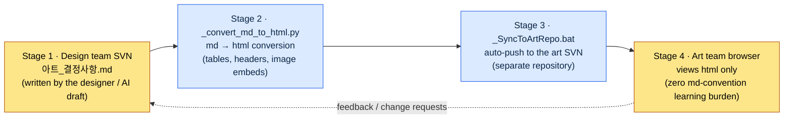

# 9.3 ArtGuide/06_UI Collaboration — Designers Write md; the Art Team Sees Only html

> Primary reader: the UX/UI designer who collaborates daily with a non-design discipline (art) on a mid-size team
> Scaled-down version for solo/hobbyist readers: §9.3.8, "If You're Solo, Just This Much"

When a designer keeps UI decisions in Markdown, work gets clean. You get version control, visible diffs, and a document you can throw at an AI as-is. The problem is that the art team doesn't read Markdown. More precisely, they have no reason to. Tell an artist "grab `아트_결정사항.md` (the art-decisions file) from SVN and take a look," and half of them haven't installed an SVN client, while the other half open it in Notepad, stare at broken `##` headers and table syntax, and ask, "How am I supposed to read this?"

The wrong prescription here is "teach the art team Markdown." An artist's time should go into pushing pixels. Every hour spent learning Markdown conventions, SVN checkouts, and how to read a diff is pure loss. The right prescription is to **automate conversion and delivery on the design side, so that the art team's learning burden drops to zero**. The designer writes md, a script converts it to html, another script pushes it into the art repository, and the art team sees only html in a browser. This chapter runs that pipeline end to end, once — from the seat where AI drafts the decisions, through the automation of conversion and delivery, to what the human actually rejects.

---

## 9.3.1 Where Collaboration Really Breaks Is the 'Format'

Plenty of books explain design–art friction as "ambiguous decision rights" — who decides the color, who decides the function. That split matters, but no matter how well you draw the responsibility chart, **if the art team can't read the chart**, nothing happens. In practice, the place where accidents actually occur is not decision rights but the delivery format.

These are the accidents that actually kept recurring on my project (a mobile-first MMORPG, "Project A" hereafter).

| Accident | Surface cause | Real cause |
|---|---|---|
| Art worked from an outdated decision doc | "I never got the latest one" | Delivery was manual (email attachment), so it slipped through |
| The decision table looked broken | "Why does it look like this?" | The md was opened in Notepad |
| "Where is that decision written down?" | Verbal handoff | The canonical record was scattered across chat |

None of the three is a decision-rights problem. They all happen because **the canonical document is not delivered in a format the art team reads, automatically, always up to date**. That is why this chapter's tool is a delivery pipeline, not a responsibility chart. The split of responsibilities is agreed once and done; delivery has to happen every single time a decision changes.

Start with the actual folder structure. Project A's art guide lives under `workspace/96_ArtGuide/`, split into 7 domains.

```
96_ArtGuide/
├── 00_Common/      # Shared standards (style, color palette, lighting)
├── 01_Character/
├── 02_Animation/
├── 03_Monster/
├── 04_NPC/
├── 05_VFX/
├── 06_UI/          # ← the domain this chapter covers
└── 07_Env/
```

*(In the comments: `00_Common` holds shared standards — style, color palette, lighting; `06_UI` is the domain this chapter covers.)*

And two operational files live in this folder alongside the content: `_convert_md_to_html.py` and `_SyncToArtRepo.bat`. These two files are the spine of this chapter.

---

## 9.3.2 The Four-Stage Sync Pipeline — From the Designer's md to the Art Team's Browser

The whole flow has four stages. The key point: **the human (the designer) touches only the md in stage 1; the remaining three stages are run entirely by scripts**. The art team sees only the html in stage 4. They don't even need to know the md exists.



Here is exactly what each stage does.

**Stage 1 (designer, human)** — Write the decisions in Markdown in `06_UI/아트_결정사항.md`. How to put AI into this seat is the spine of §9.3.4. Decisions are items like "button primary color #3A7BD5" or "minimum touch target 44pt."

**Stage 2 (`_convert_md_to_html.py`, automated)** — Converts md to html. Not a bare conversion: it renders tables so the art team can actually read them, embeds `` image references inline, and attaches a table of contents. Out comes a self-contained html file an artist can open in a browser with a single double-click.

**Stage 3 (`_SyncToArtRepo.bat`, automated)** — Pushes the converted html to **the art team's separate SVN repository**. The separation of the design repository and the art repository is the point. The art team only ever looks at its own repository, and never needs to know the permissions or structure of the design one.

**Stage 4 (art team, human)** — The artist opens the synced html from their own repository in a browser. No Markdown syntax, no SVN commands, no diff-reading to learn. **Zero md-convention learning burden** is both the design goal and the success criterion of this pipeline.

Feedback flows from stage 4 back to stage 1. When art says "this decision looks off," the designer fixes the md, and stages 2–3 run again automatically. Art only has to reopen the updated html.

---

## 9.3.3 Why Automate Conversion and Delivery — The Asymmetry of Learning Burden

Pause here and make the design intent explicit. Converting md to html is trivial in itself. The real design lies in deciding **who absorbs whose learning burden**.

There were two options.

<svg viewBox="0 0 640 300" xmlns="http://www.w3.org/2000/svg" role="img" aria-label="Comparison of two ways to distribute the learning burden — the art team learns md vs the designer absorbs the automation">
  <!-- Left: the wrong option -->
  <rect x="20" y="20" width="280" height="260" rx="10" fill="#1a1014" stroke="#7f1d1d" stroke-width="2"/>
  <text x="160" y="48" fill="#fecaca" font-family="sans-serif" font-size="15" text-anchor="middle" font-weight="bold">Option A — Art team learns md</text>
  <rect x="50" y="70" width="100" height="44" rx="6" fill="#3a1518" stroke="#b91c1c"/>
  <text x="100" y="97" fill="#fca5a5" font-family="sans-serif" font-size="12" text-anchor="middle">Designer</text>
  <text x="100" y="135" fill="#fca5a5" font-family="sans-serif" font-size="11" text-anchor="middle">writes md only</text>
  <line x1="150" y1="92" x2="190" y2="92" stroke="#b91c1c" stroke-width="2" marker-end="url(#arrowR)"/>
  <rect x="190" y="70" width="100" height="44" rx="6" fill="#3a1518" stroke="#b91c1c"/>
  <text x="240" y="91" fill="#fca5a5" font-family="sans-serif" font-size="12" text-anchor="middle">5 artists</text>
  <text x="240" y="107" fill="#fca5a5" font-family="sans-serif" font-size="10" text-anchor="middle">×SVN·md learning</text>
  <text x="160" y="170" fill="#fda4af" font-family="sans-serif" font-size="11" text-anchor="middle">Learning cost = one authoring pass ×</text>
  <text x="160" y="188" fill="#fda4af" font-family="sans-serif" font-size="11" text-anchor="middle">multiplied by artist headcount</text>
  <text x="160" y="222" fill="#f87171" font-family="sans-serif" font-size="12" text-anchor="middle" font-weight="bold">The burden eats into pixel time</text>
  <text x="160" y="240" fill="#f87171" font-family="sans-serif" font-size="12" text-anchor="middle" font-weight="bold">→ rejected</text>
  <!-- Right: the adopted option -->
  <rect x="340" y="20" width="280" height="260" rx="10" fill="#0d1512" stroke="#15803d" stroke-width="2"/>
  <text x="480" y="48" fill="#bbf7d0" font-family="sans-serif" font-size="15" text-anchor="middle" font-weight="bold">Option B — Designer automates</text>
  <rect x="370" y="70" width="100" height="44" rx="6" fill="#0f2417" stroke="#16a34a"/>
  <text x="420" y="91" fill="#86efac" font-family="sans-serif" font-size="12" text-anchor="middle">Designer</text>
  <text x="420" y="107" fill="#86efac" font-family="sans-serif" font-size="10" text-anchor="middle">md + script, once</text>
  <line x1="470" y1="92" x2="510" y2="92" stroke="#16a34a" stroke-width="2" marker-end="url(#arrowG)"/>
  <rect x="510" y="70" width="100" height="44" rx="6" fill="#0f2417" stroke="#16a34a"/>
  <text x="560" y="91" fill="#86efac" font-family="sans-serif" font-size="12" text-anchor="middle">5 artists</text>
  <text x="560" y="107" fill="#86efac" font-family="sans-serif" font-size="10" text-anchor="middle">double-click html</text>
  <text x="480" y="170" fill="#86efac" font-family="sans-serif" font-size="11" text-anchor="middle">Learning cost = designer, once</text>
  <text x="480" y="188" fill="#86efac" font-family="sans-serif" font-size="11" text-anchor="middle">(zero burden on art)</text>
  <text x="480" y="222" fill="#4ade80" font-family="sans-serif" font-size="12" text-anchor="middle" font-weight="bold">Art stays focused on pixels</text>
  <text x="480" y="240" fill="#4ade80" font-family="sans-serif" font-size="12" text-anchor="middle" font-weight="bold">→ persists</text>
  <defs>
    <marker id="arrowR" markerWidth="8" markerHeight="8" refX="6" refY="3" orient="auto"><path d="M0,0 L6,3 L0,6 Z" fill="#b91c1c"/></marker>
    <marker id="arrowG" markerWidth="8" markerHeight="8" refX="6" refY="3" orient="auto"><path d="M0,0 L6,3 L0,6 Z" fill="#16a34a"/></marker>
  </defs>
</svg>

*(In the diagram: option A — the art team learns md; the learning cost is one authoring pass multiplied by the number of artists, the burden eats into pixel time, and the scheme gets rejected. Option B — the designer automates; the learning cost is one designer, once, with zero burden on art; artists stay focused on pixels, and the scheme persists.)*

The point is the asymmetry. In option A, the learning cost multiplies by the number of artists, and it recurs with every new hire. In option B, the designer writes the script once and the marginal cost on the art side is zero. **Pile the burden onto the side that can automate, not the side with more people** — that is rule number one for collaboration tools that cross into a non-design discipline. When this rule breaks — when a collaboration tool forces new learning on the other discipline — that tool stops being used within a quarter or two.

---

## 9.3.4 [Worked Transcript] Drafting the UI Decisions md with AI

I said the designer writes the md in stage 1; here is one full cycle of using AI to draft that md. After a decision meeting you're left with scattered notes — chat messages, whiteboard photos, verbal agreements. Turning them into a canonical decisions md is tedious, and the format drifts every time. That is exactly the kind of job AI is for. The boundary that matters: **the human makes the decisions; the AI only arranges those decisions into a fixed format**.

### Step 1 — Input: The Raw Meeting Memo

```
[UI decision meeting memo — 06_UI skill slots, raw]
- Agreed to enlarge the skill slot buttons. Too small on mobile.
- Art picks the colors. But primary tone stays in the blue family.
- Slot disabled (cooldown) state agreed as gray + number overlay
- Localization... what to do about long skill names? On hold for now
- Oh and long-press should pop the skill description (this is a feature, design confirmed)
```

*In translation, the memo says: we agreed to enlarge the skill-slot buttons — they're too small on mobile; art will pick the colors, but the primary tone stays in the blue family; the slot's disabled (cooldown) state was agreed as gray plus a number overlay; what to do about long localized skill names — on hold for now; and long-press should pop the skill description (a feature, confirmed by design).*

### Step 2 — The Prompt: Forcing the Decision/Hold/Owner Split

```
Attached is the raw memo from the UI decision meeting. Organize it into a decisions Markdown to hand to the art team.
Classify each item as [확정]/[보류]/[아트결정] (확정 = confirmed: design decided, art follows; 보류 = on hold: undecided + reason; 아트결정 = art's call: visual treatment, art decides and design supplies constraints only), and attach one line of rationale/constraint per item — if the memo has no rationale, honestly write '근거 미기재' (no rationale recorded) and don't fill it in with guesses.
Where something can be verified against a public standard, like touch sizes, name the standard, and never invent items that are not in the memo.
Use the table columns |Item|Class|Decision/Constraint|Rationale|Verifiable|, include frontmatter (title, layer: L1), and give me the full document.
```

*In translation, the prompt says: "Attached is the raw memo from the UI decision meeting. Organize it into a decisions Markdown to hand to the art team. Classify every item as [확정]/[보류]/[아트결정] — confirmed (design decided, art follows), on hold (undecided, with the reason), or art's call (visual treatment art decides; design supplies constraints only) — and attach one line of rationale/constraint per item. If the memo has no rationale, write 'no rationale recorded' honestly instead of filling the gap with guesses. Where a public standard applies, like touch sizes, name the standard, and never invent items that are not in the memo. Use the table columns |item|class|decision/constraint|rationale|verifiable|, include frontmatter (title, layer: L1), and give me the full document."*

The weight of this prompt sits not on the cleanup work but on forced classification and a ban on invention. Ask an AI to organize decisions and it will helpfully add "best practices" that were never in the memo. To the art team, those additions read as "decisions design has confirmed." Hence the nails this prompt drives in: the [확정]/[보류]/[아트결정] classification, the rationale requirement, and "if it's not in the memo, don't make it up."

### Step 3 — Claude's Raw Output (Reconstructed from the Actual Session)

```markdown
---
title: 06_UI Decisions — Skill Slots
layer: L1
---

# 06_UI Decisions — Skill Slots

| Item | Class | Decision/Constraint | Rationale | Verifiable |
|---|---|---|---|---|
| Skill slot button size | [확정] | minimum 44×44 pt | mobile touch target, Apple HIG 44pt recommendation | ✅ coordinates/size |
| Primary tone | [아트결정] | keep the blue family (constraint), exact value is art's | memo: "primary tone stays in the blue family" | △ color value |
| Cooldown state treatment | [확정] | gray overlay + remaining number | meeting agreement | ◯ visual review |
| Multilingual skill-name length | [보류] | later meeting | memo: "On hold for now" — long languages (German/Russian) untested | — |
| Long-press skill description | [확정] | long-press → tooltip | confirmed feature (design territory) | ◯ behavior review |
| Slot spacing | [확정] | minimum 8 dp recommended | 근거 미기재 (no rationale recorded) — not in the memo; Material recommended value for reference | ✅ |
```

*In translation, the table rows read: skill-slot button size — [확정] minimum 44×44 pt (mobile touch target, Apple HIG 44pt recommendation; verifiable by coordinates/size). Primary tone — [아트결정] keep the blue family (constraint), exact value is art's (color value partially verifiable). Cooldown state — [확정] gray overlay plus remaining number (meeting agreement; visual review). Multilingual skill-name length — [보류] for a later meeting (memo: "on hold for now" — long languages like German/Russian untested). Long-press skill description — [확정] long-press shows a tooltip (confirmed feature, design territory; behavior review). Slot spacing — [확정] minimum 8 dp recommended; rationale: "no rationale recorded — not in the memo; Material recommended value for reference."*

### Step 4 — Verification and Rejection (The Human's Job)

This output must not go up as the canonical version as-is. One line snags.

It's the last row, `슬롯 간 간격 | 최소 8 dp` (slot spacing | minimum 8 dp). Go back to the memo: spacing **never came up** in the meeting. The AI judged "a mobile UI ought to have a spacing standard too" and helpfully added the Material Design recommended value. That violates rule 5 ("never invent items not in the memo"). The AI did honestly write `근거 미기재` (no rationale recorded), but it should never have created the row at all. If this one line reaches the art team, it reads as "design confirmed 8dp spacing."

So I push back.

```
'Slot spacing' is not in the meeting memo — you added it. Remove it from the table.
Items that look like they need a decision but aren't in the memo go only as candidates under a '## 미결 — 다음 회의 안건' (open items — agenda for the next meeting) section at the bottom, not in the table; the decisions table keeps only items that were actually in the memo.
```

*In translation: "'Slot spacing' is not in the meeting memo — you added it. Remove it from the table. Items that look like they need a decision but aren't in the memo go only as candidates under an '## 미결 — 다음 회의 안건' (open items — agenda for the next meeting) section at the bottom; the decisions table keeps only items that were actually in the memo."*

The AI removed the spacing row from the table and split the candidates out at the bottom: "Agenda for the next meeting: slot spacing standard (currently undecided), multilingual skill-name length handling." Now the decisions table holds only what the meeting actually decided, and the AI's reasonable candidates have been demoted from "confirmed" to "agenda." This separation matters because when the document the art team receives mixes **what is confirmed with what is still under discussion, art will take an undecided item as confirmed and start working on it**.

That one round trip completed stage 1 (the md). Now it leaves human hands and moves to the stage 2–3 automation.

---

## 9.3.5 Stages 2–3 Automation — Humans Don't Touch Conversion or Delivery

The finished md is now handled by scripts. The skeleton of the conversion script is simple.

```python
# _convert_md_to_html.py (skeleton)
# Input: 06_UI/*.md (decisions written by the designer)
# Output: .html with the same name (a self-contained file the art team opens in a browser)

def convert(md_path):
    md_text = read(md_path)
    front, body = split_frontmatter(md_text)          # extract title and layer
    html_body = markdown_to_html(body, extensions=[
        "tables",        # table rendering (fixes the broken tables art saw in Notepad)
        "fenced_code",
    ])
    html_body = embed_images_inline(html_body, base_dir=md_path.parent)
    # ↑ inline-embeds references like  →
    #   art doesn't have to fetch image files separately
    toc = build_toc(html_body)                         # auto-generate the table of contents
    return render_template(title=front["title"], toc=toc, body=html_body)
```

The point is that the conversion isn't a bare md→html pass. It does three more things. **It renders tables properly** (the broken `|---|` the artist used to see in Notepad disappears), **it embeds images inline** (the artist doesn't have to fetch image files separately), and **it auto-generates a table of contents** (when the decision doc grows long, the artist can jump straight to the item they want). These three are what actually make "just look at the html" hold.

The delivery script ties it together like this.

```bat
REM _SyncToArtRepo.bat (skeleton)
REM 1) Convert all md in 06_UI to html
python _convert_md_to_html.py 06_UI\*.md

REM 2) Copy the converted html into the art SVN working copy
xcopy 06_UI\*.html %ART_REPO%\UI\ /Y

REM 3) Auto-commit and push to the art SVN (separate repository)
svn add %ART_REPO%\UI\*.html --force
svn commit %ART_REPO%\UI -m "[auto] 06_UI decisions updated"
```

All the designer does is double-click `_SyncToArtRepo.bat` once (or wire a hook so it runs automatically when a decisions commit lands). Conversion, copying, and the push to the art repository run in one go. The art team updates their repository and the latest html is waiting.

> **How far does AI go here** — You can have AI write this stage 2–3 automation code. "Write a script that takes a folder of md, converts it to html with tables and images included, and pushes it to a separate SVN" is squarely in AI's wheelhouse. But **which decisions to mark as confirmed, and what to hand over as art's call** (§9.3.4), is never delegated to AI. Code goes to the AI, decisions stay with the human — the division this book repeats throughout applies unchanged here.

---

## 9.3.6 Image Prompts Also State 'Design Intent' First

The classic way AI gets misused in art collaboration is image prompts. Designers reach for image-generation AI when handing references to the art team or when visualizing a concept quickly. The common mistake is starting from a description of the result ("blue rounded button, glow effect, 4K").

One of my collaboration principles is `image_prompt_design_intent_first` — **even an image prompt states the design intent first, not a description of the result**.

| Approach | Prompt | Problem / effect |
|---|---|---|
| Result-first (bad) | "Blue rounded button, glow, 4K, game UI" | Art can't ask "why blue?" — the intent evaporates |
| Intent-first (good) | "A skill button that makes the cooldown state instantly legible. Active = a visual pull that makes you want to press it right now; on cooldown = restraint. Tone stays in the primary blue family" | Art reads the intent and can counter-propose a better visual |

The difference is what the art team can do when they receive the prompt. Given only a result description, art either draws it as written or ignores it. **Given the design intent, art can propose its own visual that solves that intent better.** This is how a designer gives direction without trespassing on art's decision territory (the [아트결정] class from §9.3.4). The designer supplies the "what for"; art decides the "how it looks."

So when an image reference goes into the §9.3.4 decisions md, the caption reads not "blue button" but "a slot whose purpose is distinguishing the cooldown state — exact treatment is art's call." The conversion script embeds the caption together with the image into the html, so art receives the image and the intent as one.

---

## 9.3.7 Measurement — What Can Be Counted Honestly

There is a temptation to write this pipeline's effect as a number like "collaboration accidents dropped 70%." Numbers like that, unverified, eat away at the book's credibility. So I separate things honestly.

**What public standards can verify** — The public-standard values that ride along in the decisions — 44pt touch targets, 8dp spacing, 4.5:1 contrast — follow the §9.1 rulebook. They are not invented numbers; they are cited as-is and can be auto-checked with lint.

**Operational metrics that can be measured** — What this pipeline can actually count is this: the number of incidents where art worked from an outdated version (with automated delivery this converges to 0), the time it takes a new art-team hire to open the decisions for the first time (a double-click on html puts it on the order of minutes), and the lag between a decision change and its arrival in the art repository (the script's run time). These three are countable from logs and observation, not from "feel."

**Author's estimate (unverified hypothesis)** — "Fewer misses than in the manual-email days" is clearly the direction, but I did not keep a separate sample, so I won't claim an exact reduction rate. Read it as a direction rather than an absolute value: when delivery hangs on human hands, something will slip in a busy week without fail; when delivery is a script, the misses disappear structurally.

---

## 9.3.8 Try It Yourself — One Step You Can Take Today

> **If you're solo, just this much**: You don't need an art team or SVN. Imagine you're handing UI decisions to a contract artist you commission, or a friend you collaborate with. Take the §9.3.4 prompt as-is and have AI produce a one-page md that sorts the scattered UI decisions in your head into [확정]/[보류]/[아트결정] (confirmed / on hold / art's call). Then find one item the AI "helpfully added" (something not in your notes) and push back: "I never decided this — take it out." That is when the boundary between human and AI in decision cleanup sinks in physically. For conversion, the `markdown` package is enough: one line, `python -m markdown decision.md > decision.html`.

If you're on a team, start with this one step. Don't begin by building grand two-way sync; put in **one line of conversion plus one line of delivery** first. A conversion script that turns the decisions md into html (just the table rendering and image embedding from §9.3.5), and one line that copies the html to wherever art looks — a shared drive or a separate repository. These two lines alone eliminate the most common accident: art opening the md in Notepad and hitting a broken table. The responsibility chart and decision rights come after that.

Summarized as setup → prompt → verify:

| Step | What to do |
|---|---|
| setup | Put in `_convert_md_to_html.py` (conversion) plus one line of delivery (copy/push) first |
| prompt | Use the §9.3.4 prompt to organize meeting memos into an [확정]/[보류]/[아트결정] md |
| verify | Reject the items the AI invented (not in the memo) → conversion and delivery run automatically → art checks only the html |

---

### Key Takeaways
- Where collaboration really breaks is not decision rights but the delivery format.
- The designer writes md and scripts deliver html — zero learning burden on art.
- AI drafts the decision cleanup; the human rejects invented items — code goes to AI, decisions to humans.

### Next Chapter Preview
- 10.1 The `integrity_check` atom roundup — extending UI verification to verification of all game data.
