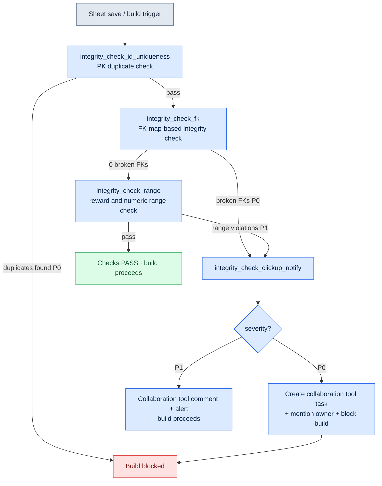

# 10.1 The Integrity-Check Atom — A Cascade That Guards FKs Across 30 Sheets

Friday, 6:40 p.m. We were due to add 12 new quests to the internal build the following Monday. I appended new rows to `quest_table`, filled in the matching rows in the reward sheet, and wired NPC lines into the dialogue sheet. Three sheets, about 50 rows. I scanned them twice with my own eyes, and everything looked fine.

Monday morning, the build broke. One of the new quests referenced a `reward_id` that did not exist in the reward sheet. On Friday evening I had deleted a reward row and re-added it, mistyping a single character in the id. `rwd_q318` became `rwd_q381`. It is exactly the kind of typo human eyes can never catch. The two sheets live in different folders and are touched by different people at different times. At 50 rows, eyes can still catch it. Once more than 30 sheets start referencing each other through foreign keys (FKs), the human eye is no longer a verification tool.

This chapter follows one session I actually ran, showing how a single kind of check atom — `integrity_check_fk` — verifies FK integrity across more than 30 sheets and, when something breaks, notifies the owner through our collaboration tool (a SaaS for managing tasks and schedules — this project uses ClickUp; JIRA and Redmine fill the same seat).

Finding the one line that is off in something someone else built is how I first entered this industry. My first job was QA and review on single-player games, and back then my hands and eyes were the only verification tools I had. Twenty-odd years later, I hand the same job to code — in the very place where the human eye stopped being a verification tool.

---

## 10.1.1 What the Check Must Catch — The Anatomy of a Broken FK

First, a picture of what is being checked. Game data sheets work like a relational database. A column in one sheet points to another sheet's primary key. When that arrow breaks, the game dies at runtime — or worse, quietly displays an empty value.

<svg viewBox="0 0 640 260" xmlns="http://www.w3.org/2000/svg" font-family="sans-serif" font-size="13">
  <rect x="20" y="30" width="150" height="90" rx="6" fill="#eef4ff" stroke="#3b6fb6" stroke-width="1.5"/>
  <text x="95" y="50" text-anchor="middle" font-weight="bold">quest_table</text>
  <line x1="20" y1="60" x2="170" y2="60" stroke="#3b6fb6"/>
  <text x="32" y="78">quest_id (PK)</text>
  <text x="32" y="98" fill="#c0392b">reward_id (FK)</text>
  <text x="32" y="116" fill="#c0392b">npc_id (FK)</text>

  <rect x="250" y="20" width="150" height="60" rx="6" fill="#eafbe7" stroke="#3a9d3a" stroke-width="1.5"/>
  <text x="325" y="40" text-anchor="middle" font-weight="bold">reward_table</text>
  <line x1="250" y1="50" x2="400" y2="50" stroke="#3a9d3a"/>
  <text x="262" y="68">reward_id (PK)</text>

  <rect x="250" y="150" width="150" height="60" rx="6" fill="#eafbe7" stroke="#3a9d3a" stroke-width="1.5"/>
  <text x="325" y="170" text-anchor="middle" font-weight="bold">npc_table</text>
  <line x1="250" y1="180" x2="400" y2="180" stroke="#3a9d3a"/>
  <text x="262" y="198">npc_id (PK)</text>

  <line x1="170" y1="93" x2="250" y2="55" stroke="#3a9d3a" stroke-width="2" marker-end="url(#ok)"/>
  <line x1="170" y1="111" x2="250" y2="175" stroke="#c0392b" stroke-width="2" stroke-dasharray="6 4" marker-end="url(#bad)"/>
  <text x="430" y="120" fill="#c0392b" font-weight="bold">npc_id 'npc_307' →</text>
  <text x="430" y="140" fill="#c0392b">not in npc_table (broken FK)</text>

  <defs>
    <marker id="ok" markerWidth="8" markerHeight="8" refX="6" refY="4" orient="auto"><path d="M0,0 L8,4 L0,8 Z" fill="#3a9d3a"/></marker>
    <marker id="bad" markerWidth="8" markerHeight="8" refX="6" refY="4" orient="auto"><path d="M0,0 L8,4 L0,8 Z" fill="#c0392b"/></marker>
  </defs>
</svg>

The solid green line is a live reference. The value that `quest_table.reward_id` points to actually exists in `reward_table.reward_id`. The dashed red line is a dead reference — some quest's `npc_id` points to an id that is not in `npc_table`. That red dashed line is what `integrity_check_fk` catches.

Project A's data sheets have far more than one or two references like this. More than 30 sheets point at each other, and if you draw every FK arrow, the diagram no longer fits on a single page. Tracing them by hand, every time, is impossible.

---

## 10.1.2 One Session — How the Check Catches a Broken FK, End to End

From here on, this is a session I actually ran. I am not summarizing: the full prompt, the raw output, and the parts I rejected and re-requested are recorded as they happened.

### Step 1 — Have the Checker Read the Sheets and Extract FK Candidates

First I had the checker build the FK map — which column points to which sheet. Registering the FKs of 30 sheets one by one, by hand, is unrealistic, so I had it infer candidates automatically from the column naming convention in the spec sheet (`*_id` points to the sheet of the same name). The full prompt I entered was the following.

> Read the attached spec sheet (the `$스키마` tab) and infer which columns in every data sheet look like foreign keys (FKs). Rules: (1) the column name has the form `xxx_id`, and (2) a sheet named `xxx_table` or `xxx_list` has a PK (primary key) column of the same name — then treat it as an FK candidate. Output the inferences as a JSON list of `{source_sheet, source_column, target_sheet, target_column, confidence}`. For anything the rules cannot settle, mark confidence as low and explain why.

Part of Claude's raw output (copied verbatim, ambiguous items included):

```json
[
  {"source_sheet":"quest_table","source_column":"reward_id",
   "target_sheet":"reward_table","target_column":"reward_id","confidence":"high"},
  {"source_sheet":"quest_table","source_column":"npc_id",
   "target_sheet":"npc_table","target_column":"npc_id","confidence":"high"},
  {"source_sheet":"quest_table","source_column":"prev_quest_id",
   "target_sheet":"quest_table","target_column":"quest_id","confidence":"medium",
   "note":"Name is prev_quest_id, not quest_id, so the rule does not catch it. Presumed self-reference within the same sheet. Needs human confirmation"},
  {"source_sheet":"reward_table","source_column":"item_id",
   "target_sheet":"item_table","target_column":"item_id","confidence":"high"},
  {"source_sheet":"dialogue_table","source_column":"speaker_id",
   "target_sheet":"npc_table","target_column":"npc_id","confidence":"low",
   "note":"Unclear whether speaker_id points to npc_id or to player. Some rows appear to have speaker as 'player'. Cannot be settled"}
]
```

Two of these items did not get waved through. I adopted `prev_quest_id` (a self-reference) as a check target, but added an exception by hand: an empty value (the first quest in a chain) is not a violation. I rejected `dialogue_table.speaker_id` — rows where `speaker` is `'player'` actually exist, so checking this column as an FK would flag every player line as a false violation.

That rejection matters. Use an auto-inferred FK map without human review, and the first run dumps hundreds of false violations on you. The check earns trust only after a human has filtered the map once.

### Step 2 — Define the Check Atom from the Reviewed FK Map

I pinned the filtered FK map as the input to the `integrity_check_fk` atom. The atom format is below. This is the full text of one check atom actually used on Project A.

```yaml
---
name: integrity_check_fk
description: Verify that every source column value exists in the target sheet's PK, per the registered FK map
type: integrity_check
category: data
priority: P0          # broken FKs block the build
execution_time:
  - on_save           # on sheet save, that sheet only
  - on_build          # all FKs at build time
  - nightly           # full run + report at midnight daily
input:
  fk_map: fk_map.reviewed.json   # the map human-reviewed in Steps 1-2
output_format: violation_list
on_violation:
  - notify: clickup           # notify ClickUp on failure
related_atoms:
  - integrity_check_clickup_notify
  - integrity_check_id_uniqueness
---
```

The check logic itself is not long. It is a set-membership test: confirm that each value in the source sheet exists in the target sheet's PK set.

```python
def check_fk(fk_map, sheets):
    violations = []
    for fk in fk_map:
        pk_set = {r[fk["target_column"]] for r in sheets[fk["target_sheet"]]}
        for i, row in enumerate(sheets[fk["source_sheet"]]):
            val = row[fk["source_column"]]
            if val in ("", None):          # empty FK is an exception (rule set in Step 1)
                continue
            if val not in pk_set:
                violations.append({
                    "fk": f'{fk["source_sheet"]}.{fk["source_column"]}',
                    "row": i + 2,          # 1 header row + 1-index
                    "value": val,
                    "target": fk["target_sheet"],
                    "severity": fk.get("severity", "P0"),
                })
    return violations
```

### Step 3 — Run the Check and Catch the FKs That Are Really Broken

I ran the check across all 30 sheets with the reviewed map. The output is the standard `violation_list`. What follows is the actual result from that day (ids and sheet names anonymized; the violation counts and structure are real).

```json
{
  "check": "integrity_check_fk",
  "executed_at": "2026-05-18 09:14:02",
  "input_files": 31,
  "violations": [
    {"fk": "quest_table.reward_id", "row": 318, "value": "rwd_q381",
     "target": "reward_table", "severity": "P0",
     "message": "reward_id 'rwd_q381' not in reward_table. Presumed typo of 'rwd_q318'"},
    {"fk": "quest_table.prev_quest_id", "row": 502, "value": "q_0500",
     "target": "quest_table", "severity": "P0",
     "message": "prev_quest_id 'q_0500' not in quest_table. Presumed notation mismatch (zero-padding) with 'q_500'"}
  ],
  "summary": {"fk_checked": 23, "rows_scanned": 4117, "violations": 2, "passed": 4115}
}
```

The Friday-evening typo (`rwd_q381`) was caught on the first line. The second was a different problem I had not known about. One quest's `prev_quest_id` was `q_0500`, while the actual quest id was `q_500`. A notation mismatch caused by zero-padding. To the human eye the two look identical, but as strings they are different values, and the game, unable to find the prerequisite quest, leaves that quest locked. Had it shipped, it is the kind of defect that generates player support tickets.

The "likely a typo" and "likely zero-padding" notes in the `message` field are where I had the checker go beyond a plain membership failure and also suggest the nearest PK value (by edit distance). It cuts the time a human spends tracing "why did this break?" These guesses are strictly hints, though — the actual corrected value is decided by a human.

---

## 10.1.3 When It Breaks — The Cascade up to Collaboration-Tool Notification

That is the behavior of one check. But a check that catches a violation nobody looks at means nothing. The point is the flow that puts the violation directly in front of its owner. On Project A, a separate atom named `integrity_check_clickup_notify` owns that flow (with an impact score of 294.93 in the JIT metadata, it is one of the highest-rated atoms in the verification bundle — which says that getting an integrity failure to a human matters as much as the check itself).

The full cascade looks like this. The check atoms run in sequence, and a P0 violation at any stage flows into the notification atom.



Two design decisions are baked into this cascade.

First, **the PK duplicate check runs before the FK check.** The FK check assumes that the target sheet's PKs are unique. If the PKs contain duplicates, the question "is this value in the PK set?" stops meaning anything. So the `integrity_check_fk` atom declares `related_atoms: integrity_check_id_uniqueness`, and the cascade fixes the order. If the dependency check fails, the FK check is skipped — running it would produce nothing but false results.

Second, **the strength of the notification splits on severity.** P0 (a broken FK) creates a task in the collaboration tool, mentions the owner registered in the FK map (for `reward_table`, the rewards designer), and blocks the build. P1 (a reward value outside its recommended range — something that needs review rather than something wrong) leaves only a comment and an alert, and the build goes through. Make every violation a build blocker, and people soon learn to ignore build blockers. Blocking is reserved for what truly must be blocked.

The body of the task actually created in the collaboration tool is one `violation_list` entry, converted as-is.

```
[P0] integrity_check_fk violation — build blocked
Sheet: quest_table  |  Column: reward_id  |  Row: 318
Value 'rwd_q381' is not in reward_table.
Nearest candidate: 'rwd_q318' (edit distance 1)
Owner: @rewards_owner  |  Detected: 2026-05-18 09:14  |  Build: nightly-0042
```

Not a single hand touches the path from check result to a person's inbox. Check → classify → create task → mention is one pipeline. What makes this possible is that `violation_list` is a standard output format. Whichever check atom caught the violation, the output structure is the same, so one notification atom receives and handles the results of every check.

---

## 10.1.4 Operating to Reduce False Violations — Leave Review Evidence

Turn a check on for the first time and false violations are guaranteed. The `speaker_id` from Step 1 is one example. Leave them unaddressed and people learn to treat the violation report as "mostly false anyway, safe to skip" — the most common path by which a checker loses its credibility.

Project A blocks that path with a principle named `human_review_attestation_evidence_mandatory`. When you rule something a false violation and carve out an exception, **you must leave evidence of who made that call, when, and why.** Every exception entry in the FK map file (`fk_map.reviewed.json`) carries the following.

```json
{
  "source_sheet": "dialogue_table", "source_column": "speaker_id",
  "excluded": true,
  "review": {
    "by": "Lee Minsoo", "at": "2026-05-18",
    "reason": "speaker_id holds either an npc_id or the 'player' literal. Unsuitable for a single FK check.",
    "follow_up": "Consider reintroducing as a branched check after adding a speaker_type column"
  }
}
```

Without this evidence, when the question "why isn't this column checked?" resurfaces much later, there is nothing to answer it with. So the column goes back into the check, and the hundreds of false violations come back with it. Review evidence keeps the same argument from being fought twice.

---

## Try It Yourself — Setting Up Your First FK Integrity Check

A minimal procedure for readers who want to bring FK checking to their own data sheets.

**setup.** Gather your data sheet folder and the column spec (which columns are PKs and which are FKs) in one place. If you have no spec, the column naming convention (`*_id`) alone is enough to start with.

**prompt.** Enter the following into your checker.

> Infer FK candidates from these data sheets. If an `xxx_id` column points to a PK of the same name in `xxx_table`, treat it as an FK. Output the result as `{source_sheet, source_column, target_sheet, target_column, confidence}` JSON; for anything the rules cannot settle, mark confidence as low and explain why.

**verify.** **Review the output FK map line by line — a human, no exceptions.** Self-references (`prev_*`), mixed-in literals (like `'player'`), and polymorphic references (columns that point to different sheets depending on context) are where automatic inference goes wrong most often. Run the check with the filtered map, then classify each violation from the first run, one by one, as "truly broken" or "false violation." Exclude the false ones, but record the reason in the file.

Walk through these three steps, and the Friday-evening one-character typo stops breaking Monday's build. The check catches the typo in Saturday's small-hours nightly run, and before the owner arrives at work on Monday, a collaboration-tool task is waiting for them.

**Solo Scale-Down.** This check is worth having even if you work alone and have no collaboration tool. Write an FK map of ten or so lines by hand and run nothing but the Python function above, and broken references get caught. Console output or a text file is plenty for notification. The point is not the notification channel — it is the flow itself: a machine catches the reference errors human eyes cannot, and puts them in front of a human.

---

### Key Takeaways
- Past 30 sheets, FK integrity is beyond the reach of human eyes, and a single set-membership check takes over the job.
- An auto-inferred FK map must be reviewed by a human; filtering out false violations and leaving the reasons as evidence is the core of a checker's credibility.
- A check's value does not end at catching the violation; it is completed when the collaboration-tool notification cascade puts that violation in front of its owner.

### Next Chapter Preview
- 10.2 Decision-Integrity 3-Layer Sensors — beyond data integrity, into the more complex verification that catches mismatches between decision and decision, decision and data, and decision and user.
