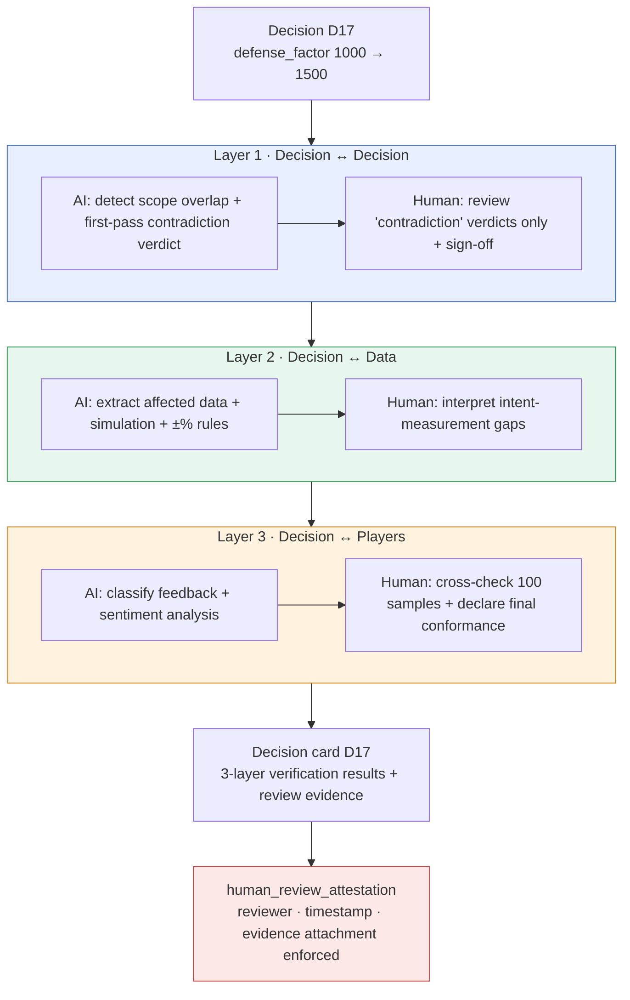

# 10.2 The Decision Verification 3-Layer Sensor — Where Human Review Evidence Lives

At 11 p.m., the nightly job dropped a card into the collaboration tool. The title read `[integrity] D17 부합 측정 미수행 7일 경과` — "D17: conformance measurement not performed, 7 days elapsed." It was an alert that a decision applied a week earlier was still sitting in the build without anyone having confirmed it "actually worked as intended." The data was fine. Sheet formats passed, FKs passed, enums passed. But the decision had not been verified.

That gap is where this chapter starts. Data can be intact while a decision is wrong, and the place to catch that wrongness is somewhere other than the data checks. Split that place into three layers, and state explicitly how far AI assists in each layer and where a human puts the stamp — that is the decision verification 3-layer sensor.

---

## 10.2.1 Even When the Data Passes, the Decision Can Be Wrong

The `check` cascade runs four kinds of checks in one pass — doc-audit (document consistency), data-qa (data quality), integrity, and link (broken cross-references). When all four pass, it means "the data is fine." But a wrong decision can sit on top of fine data.

A reward sheet can be formally flawless while its numbers fuel inflation; FKs can be unique while two quests occupy the same NPC at the same time; voice can be consistent while two characters' relationship settings contradict each other — every data check passes, and the decision is wrong on every count. Data checks ask "are the cells filled in"; decision checks ask "does that value agree with other decisions, other data, and actual players." In accounting terms, the former inspects voucher forms; the latter audits the financial statements for coherence.

So decision verification gets a **separate sensor** from data verification. Bundle them into one check and everything gets flattened into a single pass/fail line — when it fails, you can't tell whether it was a data problem or a decision problem. Separate them and responsibility becomes clear.

---

## 10.2.2 Three Layers, Three Timings, Three Kinds of Reviewers

The core of the 3-layer sensor is that it splits the verification **dimensions** into three. Each layer differs in what it looks at, when it runs, and how the work divides between AI and humans.



In all three layers, the final stamp is a human's — and that stamp is exactly the evidence the `human_review_attestation_evidence_mandatory` atom enforces. What each layer looks at, and who signs off where, comes next, layer by layer.

---

## 10.2.3 Layer 1 — AI Narrows the Field, Humans Review Only the 'Contradictions'

This layer checks whether a new decision collides with existing ones. Decision pairs grow with the square of the decision count — 200 decisions means about 20,000 pairs. No human can read them all. So the AI runs the first filter.

```python
# decision_conflict_check.py — Layer 1 sensor
def check_new_decision(new_decision, existing_decisions):
    conflicts = []
    for existing in existing_decisions:
        if has_overlap(new_decision.scope, existing.scope):   # mechanical 1st pass: scope intersection
            verdict = llm_judge(new_decision, existing)        # AI 2nd pass: contradiction/complement/unrelated
            if verdict.label == "contradiction":
                conflicts.append({
                    "with": existing.id,
                    "label": verdict.label,
                    "reason": verdict.reason,
                    "needs_human_review": True,                # human review flag
                })
    return conflicts
```

`has_overlap` is the mechanical first filter. scope is an atom domain (`combat`, `narrative`, `economy`, and so on), so the intersection computation is exact. Pairs with no overlap are discarded immediately. The 20,000 pairs typically shrink to a few dozen. Only those few dozen go to the AI.

### A Complete Worked Transcript — The Layer 1 Contradiction Verdict

Here I show what actually went back and forth, end to end. No summarizing, and the ambiguous output stays exactly as it was.

**① The Human's Prompt (Full Text)**

```
Judge whether the following two decisions contradict each other.

[Decision A] (2026-03-XX) Combat global cooldown unified at 0.5 seconds across all skills
[Decision B] (2026-04-XX) Healing-type skills exempted from global cooldown application

Verdict format (this format only, no other words):
- label: contradiction | complement | unrelated
- reason: one line
- confidence: 0.0~1.0

Do not guess. If the grounds are weak, lower the confidence.
```

*(The prompt asks whether two decisions contradict each other — decision A unifies the combat global cooldown at 0.5 seconds across all skills; decision B exempts healing-type skills from the global cooldown — and demands a fixed format and nothing else: a label of 모순/보완/무관 (contradiction/complement/unrelated), a one-line reason, and a confidence from 0.0 to 1.0, with no guessing and a lower confidence when the grounds are weak.)*

**② Claude's Raw Output (Unedited)**

```
- label: complement
- reason: Decision B adds an explicit healing-type exception to the 0.5-second unification rule set by decision A, narrowing the rule rather than overturning it.
- confidence: 0.74
```

*(The raw output reads: label — complement; reason — decision B adds an explicit healing-type exception to the 0.5-second unification rule set by decision A, narrowing the rule rather than overturning it; confidence 0.74.)*

**③ The Human's Verification / Rejection**

The verdict is "complement" (보완), confidence 0.74. Under the rules, "complement" and "unrelated" pass automatically, but anything below confidence 0.8 requires a human to at least take one look. The reviewer, team member A, reread the original text of decision B and found something — decision B carried a rider: "however, healing skills also carry their own 1.2-second cooldown." The AI had received only a one-line summary and never got this rider as input. Team member A handled the AI verdict as **accepted, with reinforcement**, and put on record that "the input the AI saw was incomplete."

**④ The Re-Request (After Reinforcing the Input)**

```
[Additional rider] Decision B carries the condition that "healing skills are exempt from
the global cooldown but have their own 1.2-second cooldown." Re-judge including this rider.
```

```
- label: complement
- reason: The 1.2-second self-cooldown is longer than the global 0.5 seconds, so despite the
  exemption healing skills end up with an even longer interval. It does not conflict with A's intent (spam prevention), so the complement is reinforced.
- confidence: 0.91
```

*(The re-request adds the missing rider — healing skills are exempt from the global cooldown but carry their own 1.2-second cooldown — and asks for a new verdict. The new output: label — complement; reason — the 1.2-second self-cooldown is longer than the global 0.5 seconds, so healing skills end up with an even longer interval despite the exemption; this does not conflict with A's intent of preventing spam, so the complement relationship is reinforced; confidence 0.91.)*

The verdict is still "complement," but the reasoning is now solid and confidence rose from 0.74 to 0.91. Team member A signed off here. The point is not the result but the **record of the process** — the AI's first verdict, the input omission a human caught, the reinforced re-request, the final review. These four steps go into the decision card's Layer 1 evidence field exactly as they happened.

This transcript has one principle. **Even the AI's 'complement' and 'unrelated' verdicts never pass unconditionally.** The AI wasn't wrong — the information it received was incomplete, and the one who catches that is the person who knows the decision's original text.

The check runs at three points: immediately when a new decision is added, plus an alert; on pending-atom promotion, check first, then promote; and a nightly re-check of all pairs.

---

## 10.2.4 Layer 2 — AI Does Almost Everything, Humans Interpret the Gaps

This layer measures how a decision landed in the data and whether it matches the intent. It is the easiest to automate and the most precise. If a simulator and data sheets already exist, you only lay verification rules on top.

Take decision `D17` (defense_factor 1000→1500). The sensor automatically pulls the `CombatBalance` sheet, the auto-simulation results, and the affected character data, then compares intent (tank survivability +49%) against measurement (simulation +52%). The conformance rules are quantitative.

| Measured deviation from intent | Action | Who |
|---|---|---|
| Within ±10% | Conformant (auto-pass) | AI |
| ±10–25% | Alert · re-review | Human interprets |
| Over ±25% | Violation · mandatory decision re-review | Human decides |

The human's role here is not "the AI said conformant, so pass." **Interpreting the alert band and the violation band** is the human's job. The D17 simulation came in at +52%, inside ±10%, an automatic pass — but the same simulation spat out one side effect: hybrid character `K_021` got +28% stronger, outside the intent. It wasn't D17's direct intent, so the conformance rule doesn't catch it. The rule passes it, but to a human eye it's an incident — catching that band is why humans exist in Layer 2.

This layer's automation rate is the highest, around 95%. The remaining 5% exists precisely because of this interpretation. A number passing the rules and that number being right for the game are two different questions.

---

## 10.2.5 Layer 3 — AI Classifies, Humans Declare Final Conformance

The hardest of the three. It checks whether the decision actually worked on real players as intended. Its inputs are live metrics from 1–2 weeks after the build ships (average tank survival time, win rate in 5v5 PvP with a tank on the team) and natural-language feedback (forums and social media).

What makes this layer distinctive is that natural-language feedback becomes verification input. About 200 forum posts and about 1,500 social media posts get categorized and sentiment-scored by the AI.

```
[AI feedback classification — tank-related, 1 week collected]
   positive 62%   negative 23% (mostly "tanks got way too strong")   unrelated 15%
```

*(AI feedback classification, one week of tank-related collection: positive 62%, negative 23% — mostly "tanks got way too strong" — unrelated 15%.)*

Stopping here is the trap. AI sentiment classification loses accuracy when Korean and English are mixed (it wavers on whether "탱커 강해졌다 ㅋㅋ" — roughly "tanks got stronger lol" — is praise or sarcasm). So the operating rule is: **every quarter, a human classifies a sample of 100 items by hand and cross-checks them against the AI results.** If the discrepancy exceeds the threshold, that quarter's classification is not trusted and a human reclassifies everything.

The final conformance declaration is made by a human. For D17, the live measurement was +44% (simulation predicted +52%, an 8% error — normal range) and feedback skewed positive. The AI organized the input — "positive majority, within intended range" — and sent it up; **the one who stamped it conformant was a human.** Automation is about 70%, humans 30%. This layer alone can never be fully automated. A machine cannot make the final call on what players mean.

---

## 10.2.6 Human Review Evidence Is Mandatory, Not Optional

If the final stamp in all three layers is a human's, the whole system collapses unless there is **evidence that the stamp was actually placed**. How do you block the case where someone merely says they reviewed and didn't? On Project A, the atom `human_review_attestation_evidence_mandatory` enforces this.

The atom's rule is simple and uncompromising. **If 'AI verdict → human review' happened on any layer of a decision card, then the reviewer's identity, the review timestamp, and review evidence (at least one of: a reinforcement memo, a rejection rationale, or a sample cross-check result) must be attached to the card. If the evidence is empty, the card cannot be promoted to "verification complete."**

When evidence is missing, the `integrity_check_clickup_notify` atom kicks in. On detecting an integrity failure — here, "review stamp present but no evidence" — it immediately creates a card in the collaboration tool. The 11 p.m. card in this chapter's opening scene is exactly this mechanism.

These two atoms pair up to form "verification of the verification." The 3-layer sensor verifies the decision, the attestation atom verifies that a human actually performed that verification, and the notify atom catches missing evidence and reports it. However broad the AI assistance, **the last cell of responsibility is filled with the name of the person who left the evidence.**

---

## 10.2.7 The Decision Card — Where Verification and Evidence Meet on One Page

The unit where the three layers' results and the review evidence converge is the decision card. One card is the complete unit for one decision, and it flows into the quarterly retrospective as input. Below is the structure of the D17 card.

<svg viewBox="0 0 720 430" xmlns="http://www.w3.org/2000/svg" font-family="sans-serif" font-size="13">
  <rect x="10" y="10" width="700" height="410" rx="10" fill="#fafbfc" stroke="#888"/>
  <text x="30" y="40" font-size="16" font-weight="bold">Decision card D17</text>
  <text x="30" y="62" fill="#555">Change: defense_factor 1000 → 1500   ·   Applied 2026-03-XX</text>
  <line x1="30" y1="74" x2="690" y2="74" stroke="#ccc"/>

  <rect x="30" y="86" width="660" height="86" rx="6" fill="#e8f0ff" stroke="#4a72c0"/>
  <text x="42" y="106" font-weight="bold" fill="#2a4a90">Layer 1 · Decision consistency</text>
  <text x="42" y="126">✓ No contradicting decisions   ·   Complement relation with 7 adjacent decisions</text>
  <text x="42" y="146" fill="#b03a3a">Evidence: team member A, 2026-03-XX 14:20, 1 input-omission reinforcement memo</text>
  <text x="42" y="164" fill="#777" font-size="11">AI first verdict → human review (confidence 0.74 → 0.91 after reinforcement)</text>

  <rect x="30" y="180" width="660" height="78" rx="6" fill="#e8f7ed" stroke="#3a9a5a"/>
  <text x="42" y="200" font-weight="bold" fill="#1f6a3a">Layer 2 · Data conformance</text>
  <text x="42" y="220">✓ Sim +52% vs intent +49% (conformant, within ±10%)</text>
  <text x="42" y="240" fill="#c07a1a">⚠ K_021 hybrid +28% outside intent — human interpretation: follow-up decision needed</text>

  <rect x="30" y="266" width="660" height="78" rx="6" fill="#fff3e0" stroke="#d08a2a"/>
  <text x="42" y="286" font-weight="bold" fill="#9a5a10">Layer 3 · Player conformance</text>
  <text x="42" y="306">✓ Live +44% vs sim +52% (8% error, normal)   ·   Feedback skews positive</text>
  <text x="42" y="326" fill="#b03a3a">Evidence: quarterly 100-sample human cross-check done, AI classification agreement 88%</text>

  <rect x="30" y="352" width="660" height="52" rx="6" fill="#fde8e8" stroke="#c04a4a"/>
  <text x="42" y="374" font-weight="bold" fill="#a02020">Overall: ✓ Conformant (K_021 side-effect follow-up decision filed in collaboration tool)</text>
  <text x="42" y="394" fill="#777" font-size="11">attestation check: review evidence attached on all 3 layers confirmed → card promotion allowed</text>
</svg>

The red lines are the point. If the "증거:" (evidence) row of any layer is empty, the attestation atom blocks the card's promotion and the notify atom alerts the collaboration tool. When someone asks six months later, "why did we set defense_factor to 1500?", this one card answers everything — intent, measurement, live results, and the reviewer. Decision cards run on the same metadata flow as the decision-tracking atoms in Part 18.

---

## 10.2.8 Automation Rates and Adoption Order

The three layers automate to different degrees (about 80%, 95%, and 70% respectively, as the preceding sections showed). All three are partially automated and all three end with a human stamp, but overall human workload drops by more than 80%.

Adoption starts with Layer 2. If the simulator and data sheets already exist, you only add verification rules, so it pays off within 1–2 months. Then Layer 1 (small infrastructure, large effect, one more month), and last Layer 3 (the largest infrastructure, also a large effect, another 2–3 months). Trying to bolt on Layer 3 from day one and running aground is the common failure.

> **On the numbers**: the automation rates above and the effect ratios below are based on operational observation of the author's project — **author's estimates (unverified)**. Read them as direction and rough proportion, not as precise measurements. The ±10%/±25% conformance thresholds are actual operating rules, and the atom names (`integrity_check_clickup_notify`, `human_review_attestation_evidence_mandatory`) are real atoms.

Summarized by direction, here is what changed before and after adoption. Decision-contradiction incidents per quarter went from several to nearly zero; the rate of actually running the one-week conformance measurement after a decision went from a fraction to most; the rate of catching side effects before they became incidents went from under half to most. The most meaningful change is traceability — the share of decisions whose background can be retraced long afterward went from a minority to nearly all. The decision cards preserve the game's decision history.

---

## 10.2.9 Common Failures

| Pattern | Remedy |
|---|---|
| Running Layer 1 only (contradiction checks alone) | Add Layers 2 and 3 to cover the missing dimensions |
| Adopting Layer 3 first | Start with Layer 2 — smallest infrastructure first |
| Accepting the AI's 'complement/unrelated' verdicts uncritically | Confidence thresholds + human sample review |
| Stamping the review without attaching evidence | The attestation atom blocks promotion |
| Ignoring missing-evidence alerts | Treat the notify atom's collaboration-tool card as unfinished work |
| Blind trust in AI classification of player feedback | Quarterly human cross-check of 100 samples |

---

### Key Takeaways

- Data integrity and decision consistency are different sensors. Bundle them into one check and failures become ambiguous to interpret.
- In all three layers the AI assists, but a human puts the final stamp. Only the dimension differs; the principle is the same.
- A card with empty review evidence cannot be promoted. The attestation atom performs the verification of the verification.

---

### Try It Yourself — Solo Scale-Down

**setup.** Collect your decision log in one file (decision id, scope, intent, date applied). Fix scope as an enum, like `combat`, `narrative`, `economy`. If you have no simulator, Layer 2 can start as "manual comparison of the related data sheets."

**prompt.** Each time a new decision appears, ask the AI about it against existing decisions, one pair at a time. Fix the format.
```
Judge whether the following two decisions contradict each other.
[Decision A] ...
[Decision B] ...
Output the format only: label(contradiction|complement|unrelated) / reason one line / confidence 0.0~1.0
No guessing. If grounds are weak, lower confidence.
```

*(The prompt: judge whether the two decisions contradict each other; output the format only — a label (contradiction | complement | unrelated), a one-line reason, and a confidence from 0.0 to 1.0; no guessing, and lower the confidence when the grounds are weak.)*

**verify.** For 'contradiction' verdicts and anything below confidence 0.8, reread the original decision text yourself and confirm. Once confirmed, always leave **the reviewer's name, the time, and a memo (one of: reinforcement, rejection, or cross-check)** on the decision card. If the evidence field is empty, do not promote that card to "verification complete" — that one line is the solo version of the attestation atom. Even running solo, leave the evidence for the you of six months from now.
