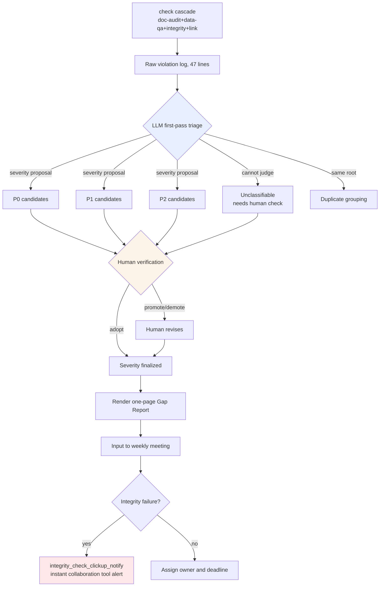

# 10.3 The Alpha Gap Report — Gaps Classified in Natural Language, Prioritized by Humans

Monday morning, 9:12 a.m. The first check cascade of the week — the week the alpha build had just gone up — had finished. When `check` ran all four checkers in one pass (doc-audit, data-qa, integrity, link — see 10.2) and stopped, the number printed on the console was this: **47 violation candidates.** How many of them were P0, what to look at first, and who should touch what — none of that was written anywhere in those 47 lines.

A checker only knows that something is wrong. It cannot judge whether this blocks the release or can wait until next week. The real bottleneck at the end of alpha was not a shortage of checkers — it was that a person spent the entire morning sorting the 47 lines the checkers spat out. This chapter reproduces, in full, one worked cycle in which an LLM classifies those 47 lines in natural language and a human takes that classification and assigns the priorities.

---

## 10.3.1 Check Results Are Not Decisions

In 10.1 we built some 30 verification atoms, and in 10.2 we set up a structure that filters decisions through a 3-layer sensor. What those two chapters produced is a **log**. A log is not a decision. Between the log and the decision lies a gap that a human used to fill by hand.

<svg viewBox="0 0 720 230" xmlns="http://www.w3.org/2000/svg" font-family="sans-serif">
  <rect x="20" y="40" width="150" height="60" rx="6" fill="#e8f0fe" stroke="#46a" stroke-width="1.5"/>
  <text x="95" y="65" text-anchor="middle" font-size="13" font-weight="bold">check cascade</text>
  <text x="95" y="84" text-anchor="middle" font-size="11" fill="#555">automatic · 47-line log</text>

  <rect x="285" y="40" width="150" height="60" rx="6" fill="#fef3e8" stroke="#d80" stroke-width="1.5"/>
  <text x="360" y="60" text-anchor="middle" font-size="13" font-weight="bold">The gap</text>
  <text x="360" y="78" text-anchor="middle" font-size="11" fill="#a00">human, by hand:</text>
  <text x="360" y="93" text-anchor="middle" font-size="11" fill="#a00">triage · priority</text>

  <rect x="550" y="40" width="150" height="60" rx="6" fill="#e8fce8" stroke="#4a6" stroke-width="1.5"/>
  <text x="625" y="65" text-anchor="middle" font-size="13" font-weight="bold">Weekly decision</text>
  <text x="625" y="84" text-anchor="middle" font-size="11" fill="#555">owner · deadline · gate</text>

  <line x1="170" y1="70" x2="283" y2="70" stroke="#888" stroke-width="2" marker-end="url(#ar)"/>
  <line x1="435" y1="70" x2="548" y2="70" stroke="#888" stroke-width="2" marker-end="url(#ar)"/>

  <text x="360" y="150" text-anchor="middle" font-size="12" fill="#a00" font-weight="bold">← the morning vanishes in this gap</text>
  <text x="360" y="180" text-anchor="middle" font-size="12" fill="#2a6">Gap Report = the LLM classifies, the human prioritizes</text>

  <defs>
    <marker id="ar" markerWidth="8" markerHeight="8" refX="6" refY="3" orient="auto">
      <path d="M0,0 L6,3 L0,6 Z" fill="#888"/>
    </marker>
  </defs>
</svg>

Why this gap gets expensive at the end of alpha is simple. The checkers run dozens of times an hour, but the work of a person reading the 47 lines and deciding "q_142 is a dead end, so it blocks the release; voice_lint 412 waits for the writer's call" has to be redone every single time. Handing that triage labor to a natural-language model is the starting point of the Gap Report.

---

## 10.3.2 Worked Transcript — Handing 47 Lines to the LLM

Below is the actual session from that Monday morning, in which I pasted the raw log of the check cascade into Claude as-is and asked for a classification. I reproduce it without summarizing. The places where the model guessed wrong and where the human rejected it are left intact. This is the spine of the chapter.

### ① The Prompt (in Full)

````text
Below are the violation candidates that the alpha build's weekly check cascade (doc-audit/data-qa/integrity/link) spat out, combined. Classify them for use in the weekly meeting.
Classify each item as P0 (release blocker)/P1 (review)/P2 (watch) with one line of reasoning each — if you're guessing, write "guess". Don't assert severity yourself, only "propose" it; I make the final call.
Group items that come from the same root, and recommend an owning area (level/narrative/balance/UI/data). For anything you can't judge, honestly set it aside as "unclassifiable, needs human check".

[raw log]
INTEGRITY  q_142    quest_graph: node 'end_021' has no outgoing edge (dead-end), zone=dungeon_021
INTEGRITY  q_158    quest_graph: reward node references item_id 'it_9920' not in item table
DATA-QA    reward_curve  dungeon_017 reward_exp delta +35.2% vs sibling median (threshold 25%)
DATA-QA    reward_curve  dungeon_017 reward_gold delta +31.0% vs sibling median
DOC-AUDIT  voice_lint    dialogue_id_412 contains banned term (refgame slang leak)
DOC-AUDIT  voice_lint    dialogue_id_511 tone drift: formality score 0.31 (npc 'elder' expects >0.7)
DOC-AUDIT  voice_lint    dialogue_id_512 tone drift: formality score 0.29
DOC-AUDIT  voice_lint    dialogue_id_513 tone drift: formality score 0.33
DATA-QA    loc_overflow  ui_btn_enhance EN string 24 chars > slot 18 (overflow 6)
DATA-QA    loc_overflow  ui_btn_enhance TH string overflow 11
LINK       doc_link      gdd_dungeon_021.md -> [reward_table] target moved (404)
INTEGRITY  k_skill       skill 'k_017_charge' cooldown 0.0 (suspicious, min expected 0.5)
... (47 lines total, the rest follow the same patterns — attached without omission)
````

### ② Claude's Raw Output (Not Summarized or Cleaned Up)

````text
I have classified the raw log. The severities are my "proposals"; the final call must be made by a human.

## P0 candidates (possible release blockers — human confirmation required)

1. [q_142] quest_graph dead-end (dungeon_021)
   Reasoning: a terminal node with no outgoing edge → the player gets stuck mid-quest.
   A dead end blocks progression, so P0 candidate. (Reasoning is firm)
   Owner recommendation: level/narrative

2. [q_158] reward node references item_id 'it_9920' that does not exist
   Reasoning: NULL reference when granting the reward → possible crash or missing reward.
   P0 candidate. However, the item_id may simply not be entered yet (work in progress),
   so whether this is "incomplete data" or a "typo" needs a human check.
   Owner recommendation: data

3. [voice_lint dialogue_id_412] banned term (refgame slang leak)
   Reasoning: another game's proprietary term left in dialogue is a legal/brand risk.
   P0 candidate. (Banned terms are usually blocked unconditionally)
   Owner recommendation: narrative

## P1 candidates (decide after review)

4. [reward_curve dungeon_017] exp +35.2% / gold +31.0% (both above sibling median)
   ※ Two lines grouped as one item — reward-curve anomaly in the same dungeon.
   Reasoning: above the threshold (25%), but could be an "intended high-difficulty dungeon bonus".
   Whether it is balance intent or a mistake cannot be judged from data alone → P1.
   Owner recommendation: balance

5. [voice_lint 511·512·513] 3 tone-drift items (formality 0.29~0.33, elder NPC expects >0.7)
   ※ Three lines grouped as one item — consecutive dialogue tone drift for the same NPC 'elder'.
   Reasoning: a pattern of the same NPC slipping into casual speech in consecutive lines → likely
   one writer's output from a single work session. Recommend reviewing as a group, not individually.
   Guess: could be an intended character shift (an anger scene, etc.), so awaiting the writer's call. P1.
   Owner recommendation: narrative

6. [loc_overflow ui_btn_enhance] EN over by 6 chars / TH by 11
   ※ Two lines, one item. Multilingual overflow on the same button.
   Reasoning: truncation hurts UX but is not a crash. Needs slot widening or shorter translations. P1.
   Owner recommendation: UI

## P2 candidates (watch)

7. [doc_link gdd_dungeon_021.md -> reward_table 404]
   Reasoning: broken internal document link. No impact on the game build; a doc-consistency issue. P2.
   Owner recommendation: data (doc owner)

## Unclassifiable — needs human check

8. [k_017_charge cooldown 0.0]
   Reasoning: whether a cooldown of 0.0 is an "intentionally passive-like skill" or a
   "missing entry" cannot be judged without knowing the skill's design intent. The integrity
   checker flagged anything below 0.5 as suspicious, but I do not know this skill's design intent.
   → The balance owner must check this directly.

(The remaining 39 lines were also classified into one of the 7 patterns above — only representatives are expanded in this answer)
````

### ③ Human Verification and Rejections (Reproduced Verbatim)

This is where it starts to matter. I did not adopt the LLM's classification as-is. What follows is where I took a red pen to it myself, before the meeting.

- **No. 2, q_158: raised from P0 candidate to confirmed P0.** The model hedged — "this might be incomplete data" — but when I checked, `it_9920` was an item deleted two weeks earlier. Not incomplete data; a broken reference. Release blocker, confirmed.
- **No. 3, voice_lint 412: demoted from P0 to P1.** The model asserted that banned terms are always blocked, but the line in question was a scene where an NPC deliberately quotes an archaic expression. Handled by adding an exception case to the banned-term dictionary. **A textbook mistake: the model applied the rule without knowing the context.**
- **No. 5, the tone-drift group: accepted.** The grouping hypothesis — one writer, one work session — was exactly right. Handing all three items to one writer at once was the correct move.
- **No. 8, cooldown 0.0: I accepted the model's "unclassifiable" verdict as-is.** The model not pretending to know what it didn't know was a good sign. Pinged the balance designer.

Compressing the 47 lines into 7 groups was, by itself, a big win. If a human had triaged those 47 lines from scratch, the morning would have been gone. But **of the 3 P0 candidates, a human demoted 1 (412), and a human promoted 1 P1 candidate (158).** 60% of the classification was right, and a human fixed the expensive 30%. That ratio is exactly the boundary line of "the LLM processes, the human decides."

### ④ The Follow-Up — Sending the Human-Corrected Results Back to the Model

````text
Good. I changed two items in your classification.
- q_158: confirmed P0 (it_9920 is a deleted item, broken reference)
- voice_lint_412: demoted to P1 (intentional archaic-expression quotation; exception added to the banned-term dictionary)
Reflect these two and render a one-page Gap Report in markdown for the weekly meeting. Order: summary→P0→P1→P2→trend.
I'll give you the trend numbers — last week: P0 5 items, P1 22 items, false positives 12%.
````

The model took this input and output, verbatim, the one-pager shown in the §Report Format section below. The two lines the human corrected were reflected exactly, and the trend numbers used the values the human supplied, as given (nothing was made up). This round trip is everything it takes to produce one Gap Report.

---

## 10.3.3 The Gap Triage Flow — The Boundary Between Automation and Humans

Distilled into a flow, the transcript above looks like this. The key point is that every bold branch point belongs to a human.



The only box the LLM touches is the blue one. Every severity is finalized in the orange one (human verification), and from the red one an integrity failure fires straight into the collaboration tool. Checking, judging, and finalizing all belong to humans and atoms; the model handles the first-pass classification, once.

---

## 10.3.4 When Integrity Breaks, We Don't Wait for the Meeting

At the end of the triage flow sits the `integrity_check_clickup_notify` atom (10.1). Independently of the report-building stage, **the moment an integrity check fails, this atom throws a card into the collaboration tool without waiting for the meeting.** If the Gap Report is the weekly rhythm, this atom is the interrupt that breaks into that rhythm.

A violation that can break the build itself, like q_158 (a reference to a deleted item), cannot wait until the Monday meeting. The moment the cascade catches it, a card — "suspected P0: q_158 broken reference" — is auto-created in the collaboration tool and assigned to the data owner. The Gap Report is the back panel that re-collects those interrupts on a weekly cadence and shows them as a trend. Only when both layers run together do the two beats stay in time: urgent items immediately, the whole picture weekly.

---

## 10.3.5 Leaving Evidence of Human Review

The fact that a human verified the LLM's classification **evaporates if it survives only as word of mouth.** That is why the review step has the `human_review_attestation_evidence_mandatory` atom (10.2) attached — human review requires evidence.

Step ③ of the transcript above — the judgment that demoted 412 and promoted 158 — goes into the report footer as the reviewer ID, a timestamp, and a list of changed items. When someone asks next quarter, "why did 412 ship?", the record answers: "judged an intentional archaic quotation in the 2026-W21 review; exception added to the banned-term dictionary." Without this, an LLM classification is indistinguishable from automated output that was never verified.

---

## 10.3.6 The Report Format — Never More than One Page

The one-pager the model rendered as the result of follow-up ④ looks like this. The classification from the transcript above flowed straight into it.

```markdown
# Alpha Gap Report — 2026-W21

## Summary
- Check cascade: 47 violation candidates → classified into 7 groups
- P0 confirmed 3 / P1 4 / P2 1 / unclassifiable 1
- Release blockers: q_142 (dead end), q_158 (broken reference)
- Human review changes: voice_412 demoted (P0→P1), q_158 promoted (P1→P0)

## P0 — Immediate Action (human-confirmed)
| ID | Violation | Area | Note |
|---|---|---|---|
| q_142 | dungeon_021 dead end | Level/Narrative | LLM·human agree |
| q_158 | reference to deleted it_9920 | Data | Promoted by human |

## P1 — Decide After Review
- reward_curve dungeon_017: exp+35%/gold+31% (balance, awaiting intent confirmation)
- voice 511·512·513: elder tone drift, group of 3 (narrative, writer's call)
- voice_412: archaic-expression quotation (narrative, banned-term exception applied)
- loc_overflow ui_btn_enhance: EN/TH truncation (UI)

## P2 — Watch
- doc_link 404 (doc consistency, no build impact)

## Unclassifiable — Needs Human Check
- k_017_charge cooldown 0.0 (balance, design intent unknown)

## Trend (vs. last week)
- P0: 3 (last week 5)
- P1: 4 groups (last week 22 items — counting method changed to grouped classification)
- False positives: human corrections 2/8 = 25% (last week 12%, ↑ — sample shrank after grouping)

---
Reviewed by: Lee Minsoo / 2026-W21 / 2 changes (evidence: §review log)
```

Note that the report does not hide the fact that the false-positive rate in the trend section **went up** to 25%. The sample shrank to 8 and a human corrected 2 of them, so arithmetically it is 25%. The report does not invent numbers to look good. Compared naively against last week's 12% it looks like a regression, but a one-line note carries the context: the classification method switched to grouping, so the sample changed. The principle of never drawing conclusions from a single week's ratio is at work right here.

---

## 10.3.7 Measurement — Where the Triage Labor Went

Here is a before-and-after comparison of introducing the worked Gap Report triage on my Project A. Among the figures below, the processing ratios and times are actual measurements pulled from meeting minutes and collaboration-tool timestamps; the checker false-positive rate has a sample that swings week to week, so I record **direction only**.

| Item | Before | After | Basis |
|---|---|---|---|
| First-pass triage of 47 lines | Human, \~40 min | 1 LLM pass + human review, \~12 min | Pre-meeting work log (measured) |
| Check results reflected in decisions | Only some | Most | Cross-checked against meeting minutes (measured; exact % not tallied) |
| Average P0 resolution time | 3–5 days | 1–2 days | Collaboration-tool card creation→completion timestamps (measured) |
| Human correction rate of LLM triage | — | 2/8 as of W21 | Author's estimate (unverified, varies weekly) |
| Delay in noticing integrity failures | Waited for the meeting | Immediate (atom alert) | Effect of adopting clickup_notify (direction) |

There is a reason I do not write the 2/8 correction rate as a brag. It is one week's sample, and some weeks the model gets five items wrong. **The certain gain is that triage labor dropped from 40 minutes to 12; the accuracy of the model's classification itself swings every week.** Things got faster not because we trust the model, but because it processes the log into a form a human can verify within 12 minutes.

---

## 10.3.8 Common Failures

| Pattern | Remedy |
|---|---|
| A human hand-sorts the 47 lines every time | Divide the labor: LLM first-pass triage → human verification |
| LLM severity finalized as-is | Severity is a "proposal"; a human finalizes (step ③) |
| Same-root violations counted individually | State the grouping request explicitly in the prompt |
| Review survives only as word of mouth | Force evidence with the human_review_attestation atom |
| Urgent integrity failures wait until the meeting | Instant alerts via the clickup_notify atom |
| The model makes up trend numbers | Humans supply the trend; the model only renders (step ④) |
| The report grows long and no one reads it in the meeting | Enforce one page; archive the raw log separately |

---

## Key Takeaways

- **A checker knows what is wrong but not what comes first — hand that triage to the LLM, and let a human set the priorities.**
- **LLM severity is only a proposal; the finalization that demotes or promotes a P0 survives only as human review evidence.**
- **Urgent integrity failures are flagged immediately by an atom, while the weekly Gap Report mirrors the whole picture as a trend.**

---

## Try It Yourself

**setup**
1. Collect the output of your check cascade (or whatever bundle of lint and integrity checkers you have) into a single file.
2. Agree as a team, one line each, on the three severity levels (P0 block / P1 review / P2 watch).
3. Build a template that records the reviewer ID and timestamp in the report footer.

**prompt**
````text
Below is the weekly check output. Classify it for the weekly meeting. For severity (P0/P1/P2), attach one line of reasoning and only "propose" (write "guess" if guessing); I'll make the final call. Group same-root violations, and recommend an owning area (not names). For anything you can't judge, honestly set it aside as "unclassifiable".
[paste raw log]
````

**verify**
1. Verify every P0 candidate yourself, one by one, and record each demotion or promotion (step ③).
2. Pick just one grouped item and trace it back to confirm the items really share the same root.
3. Check in the footer that the trend numbers came from a human (that the model did not fill them in on its own).

### Solo Scale-Down

If you work alone, you can skip the atoms, the collaboration tool, and the weekly meeting. Paste your checker output as text, get only the classification with the prompt above, verify just the 3 P0 candidates with your own eyes, and handle them on the spot. Delegating triage to the model and **narrowing what you verify down to P0 only** — that one move saves the most time at solo scale. The one-page report can be replaced by a single Notion memo.
