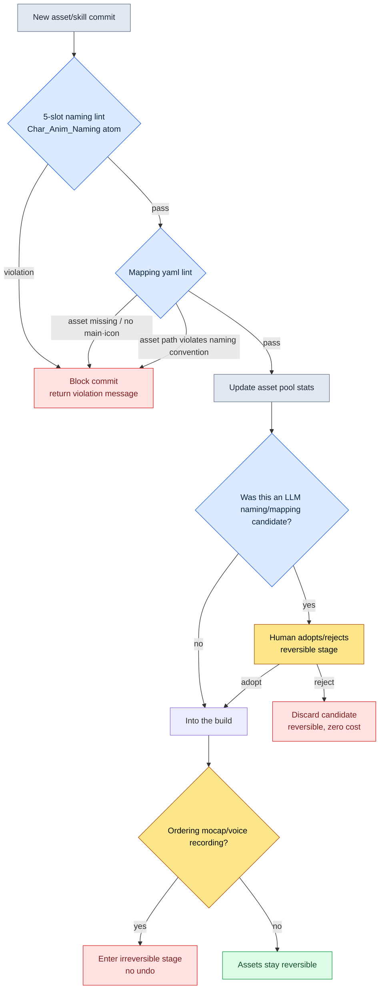

# 11.1 Naming Conventions and Skill-to-Art Mapping

Two days before the sprint deadline, a combat artist dropped a short video into the team messenger. The new warrior class's three-hit combo. The first and second hits had the whirl of the blade; the third made no sound at all. Silence. The artist said they had hooked up every sound; the sound designer said they had delivered every file. Neither was lying. The sound file was definitely in the repository — under the name `combo3_swing_final_real.wav`. The name the game code was looking for was `sfx_K012_combo3_swing.wav`. Not a single character overlaps.

Tracking down this silent hit swallowed that entire afternoon. This is not a problem of one clip or one sound file. As long as people are free to name things however they like, this incident is reborn dozens of times every quarter. This chapter is the story of turning that freedom into rules.

> **Questions This Chapter Answers**
> - At a scale of 10,000 assets, why a name is a rule, not a freedom
> - What class of incidents gets closed off when the naming convention is enforced as an atom and auto-verified with lint
> - A worked transcript where AI drafts the animation, VFX, sound, and icon mapping attached to a single skill and a human adopts it

> **One line for readers outside games.** A pool of 10,000 assets and fbx file-name formats may look like a games-only concern. But the one thing to take away is domain-agnostic — **"the moment you name things freely, search, automation, and linking all lock up together."** At scale, naming has to stop being a matter of taste and become a rule, and only names that have become rules can be found and used by code automatically — a principle that applies to any work involving documents, assets, or customer records.

---

## 11.1.1 The Scale of 10,000 Assets

Project A, which I direct, is a mobile-first MMORPG. The rough scale of its character animation assets is below. The number of player classes and enemy NPC types are actual operating figures; the clip counts and the overall estimate are the author's estimate (unverified).

| Asset | Count |
|---|---|
| Player character classes | 6 |
| Enemy NPC types | 80–100 |
| Average clips per character | 100–150 (author's estimate) |
| Estimated total clips | About 10,000–15,000 (author's estimate) |

Ten thousand. That is ten thousand drawers. Standing in front of 10,000 unlabeled drawers asking "where was that attack motion" is betting on human memory. And that bet always loses. When you cannot find it, one of two things happens: the work takes twice as long, or — since you could not find it — the same motion gets built again. The latter is worse. The asset pool bloats, and later two subtly different copies of the same motion are floating around.

If names are a free-for-all, search is not the only thing that locks up. Automatic routing — "the code finds the animation file from the skill ID by itself" — locks up with it. If no rule can be read out of a name, the code has to carry a hand-written mapping table saying which file to use for each and every skill. And that table grows by hand every time a new character comes in.

---

## 11.1.2 The Five-Slot Naming Format — Pinning It Down as an Atom

Project A's animation file names are fixed to five slots.

```
<role>_<id>_<category>_<action>_<variant>.fbx

char_K001_idle_default_v1.fbx
char_K001_locomotion_walk_forward.fbx
char_K001_combat_attack_combo1_v2.fbx
char_K001_react_hit_heavy.fbx
enemy_E021_combat_skill_aoe_v1.fbx
```

All five slots follow fixed enums. The only slot that allows free input is `id`, and even that one is bound to the form `[A-Z]\d{3}`.

| Slot | Enum count | Examples |
|---|---|---|
| role | 4 | char, enemy, pet, mount |
| id | fixed format | K001, E021, P003, M005 |
| category | 8 | idle, locomotion, combat, react, death, social, cinematic, system |
| action | 10–30 per category | walk, run, attack, skill_aoe, hit_heavy |
| variant | fixed format | default, v1, v2, _short, _long |

The point here is not the format itself but where the format gets entered. Write the naming convention on a single wiki page and it is a label nobody reads. I turned this convention into a single-source-of-truth atom named `Char_Anim_Naming_Convention` and made people, lint, and the LLM all look at this one atom and nothing else. The moment the format is pinned down as an atom instead of a document, naming changes character: from a "recommendation" to a "gate you must pass."

The weakness of the `action` slot is that its enum can grow without bound. So the standard actions are managed as a per-category dictionary.

```yaml
combat:
  - attack_basic
  - attack_combo1
  - attack_combo2
  - skill_<skill_id>
  - parry
  - dodge_forward
  - dodge_back
react:
  - hit_light
  - hit_heavy
  - knockback
  - stagger
  - stun
locomotion:
  - idle
  - walk_forward
  - run_forward
  - sprint
  - jump_start
  - jump_loop
  - jump_land
```

Whether a new action enters the dictionary is decided by procedure. Will three or more characters use it per quarter? Is it genuinely inexpressible with existing actions? Is the category unambiguous? And most importantly — can it be absorbed as a variant? If a variant can handle it, the action list does not grow. An action dictionary staying under 100 entries is a sign of healthy operation. But I do not treat that as a hard ceiling. When a new genre or a new class comes in, 30–40 entries can be added at once. What must be blocked is not a number but unchecked proliferation.

---

## 11.1.3 Lint Blocks the Commit

Once the format is entered as an atom, you need a checker that enforces that atom automatically. A human cannot eyeball five slots every time. Below is the backbone of that lint.

```python
# anim_naming_lint.py
import re, yaml

NAMING_PATTERN = re.compile(
    r"^(?P<role>char|enemy|pet|mount)_"
    r"(?P<id>[A-Z]\d{3})_"
    r"(?P<category>idle|locomotion|combat|react|death|social|cinematic|system)_"
    r"(?P<action>[a-z_]+?)"
    r"(?:_(?P<variant>v\d+|short|long|light|heavy|left|right|forward|back))?"
    r"\.fbx$"
)

ACTION_DICT = yaml.safe_load(open("char_anim_naming_convention.yaml"))

def check(filename):
    m = NAMING_PATTERN.match(filename)
    if not m:
        return f"Naming convention violation (5-slot format mismatch): {filename}"

    category, action = m.group("category"), m.group("action")
    # skill_<id> forms are dynamic actions, so check only the prefix
    base = "skill" if action.startswith("skill_") else action
    if base not in ACTION_DICT.get(category, []):
        return f"Outside action enum ({category}): {action}"

    return None
```

The moment a new fbx enters the repository, this check runs. A violation blocks the commit. What matters here is that violations are not charged to people. Instead of blaming the artist behind the silent hit, the responsibility gets shoved onto the tool: "that name should never have been committable in the first place." People make mistakes; tools block those mistakes. That is the basic posture of a naming system.

Once naming is enforced, automatic routing unlocks in return.

```python
def play_skill_animation(character, skill_id):
    anim_path = f"char_{character.id}_combat_skill_{skill_id}.fbx"
    if not exists(anim_path):
        anim_path = f"char_{character.id}_combat_skill_default.fbx"  # fallback
    play(anim_path)
```

The hand-written mapping table disappears. New characters and new skills can come in, and as long as the animation files are added according to the convention, not a single line of code changes. Go back to the silent hit: if that sound file could only have entered under its convention name `sfx_K012_combo3_swing.wav` — then `combo3_swing_final_real.wav` would have bounced at the commit stage, and that afternoon would have stayed intact.

The variant slot is the safety valve that protects the action enum. Versions of the same motion (v1, v2), lengths (_short, _long), intensities (_light, _heavy), and directions (_forward, _back) are all absorbed as variants instead of letting them fork the action into micro-variants. And the game code can pick that variant by context.

```python
def select_variant(base_action, context):
    if context.distance < 3:
        return f"{base_action}_short"
    if context.distance > 10:
        return f"{base_action}_long"
    return base_action
```

The naming convention becomes a branch point in the code.

---

## 11.1.4 Ten Assets per Skill — The Mapping yaml

If naming is L1, the mapping that ties skills to assets is L2. A single skill usually drags along 2–3 animations, 1–3 VFX, 2–5 sounds, and one UI icon. Call it ten assets on average. With 200 skills, that is roughly 2,000 mapping targets. Managing that scale in a human head is impossible. So each skill gets one yaml file, and that skill's assets are read from that one file only.

```yaml
---
skill_id: skill_K001_combo1
description: K001 combo 1 (3-hit chain)
type: melee_combo
animations:
  - clip: char_K001_combat_attack_combo1_v2.fbx
    role: main
    bone_alignment: spine_03
vfx:
  - asset: vfx_K001_combo1_slash.vfx
    socket: weapon_tip
    timing_ms: [0, 150, 300]
  - asset: vfx_hit_blood_light.vfx
    socket: target
    timing_ms: [150]
sound:
  - asset: sfx_K001_combo1_swing.wav
    volume: 0.8
    timing_ms: 0
  - asset: sfx_hit_metal_light.wav
    volume: 0.6
    timing_ms: 150
ui_icon: icon_skill_K001_combo1.png
ui_tooltip_key: skill_K001_combo1_tooltip
verified: true
---
```

This one file is the entirety of one skill's assets. And every asset path inside this yaml follows the five-slot convention from 11.1. If the naming lint collapses, this mapping collapses with it. The two layers work as a pair.

Once the mapping is gathered in one place, impact tracing unlocks automatically. When you want to overhaul some VFX, there is no need to dig by hand for which skills it touches.

```python
def find_skills_using(asset):
    affected = []
    for path in glob("skills/*.yaml"):
        skill = yaml.safe_load(open(path))
        for cat in ("vfx", "sound", "animations"):
            for entry in skill.get(cat, []):
                if entry.get("asset") == asset or entry.get("clip") == asset:
                    affected.append(skill["skill_id"])
    return affected

# find_skills_using("vfx_hit_blood_light.vfx")
# → ["skill_K001_combo1", "skill_K005_combo2", "skill_E021_attack_basic", ...]
```

The asset-replacement meeting gets the list of affected skills attached automatically. Before anyone can ask "what does changing this affect?", the answer is already sitting next to the meeting notes.

The mapping gets its own lint, too. Does every asset file actually exist? Is there exactly one animations.main and one ui_icon? Does every timing_ms fall within the animation's length? And — does every asset path pass the 11.1 naming convention? That last item is the nail that joins the two layers. It runs automatically at build time.

---

## 11.1.5 The Naming and Mapping Verification Flow

Here is how the naming lint and the mapping lint so far chain into a single gate.



Note that the reversible/irreversible boundary sits at the end of this flow. Editing yaml, LLM candidates, keyframes — all of it is reversible. If you do not like something, discard it; the cost is close to zero. But the moment you move on to motion capture shoots, voice-actor recording sessions, or signature voice casting, things turn irreversible. Actor and studio bookings, recording booths, contracts, and market perception are on the line. That is why every naming, mapping, and persona decision has to be finished right before the irreversible stage — inside the reversible territory of yaml, LLM candidates, and keyframes.

---

## 11.1.6 Worked Transcript — Letting AI Draft a New Skill Mapping

That was the system; now for where AI comes in, shown as an actual session, as-is. This is the scene where the LLM is asked to draft the asset mapping for a new flame skill, `skill_K012_flame_burst`.

**Prompt (in full):**

```
Below are our project's character animation naming convention (atom),
the existing asset pool stats, and one similar skill yaml.

[Naming convention]
<role>_<id>_<category>_<action>_<variant>.fbx
role: char|enemy|pet|mount / category: idle|locomotion|combat|react|death|social|cinematic|system

[Asset pool TOP used assets]
sfx_hit_metal_light.wav (47 skills), vfx_dust_kickup.vfx (38 skills),
vfx_fire_burst_med.vfx (22 skills), sfx_fire_whoosh.wav (19 skills)

[Similar skill yaml]
skill_id: skill_K005_fire_slash / type: melee_fire
animations: [char_K005_combat_attack_fire_v1.fbx]
vfx: [vfx_K005_fire_slash.vfx, vfx_fire_burst_med.vfx]
sound: [sfx_K005_fire_swing.wav, sfx_fire_whoosh.wav]

New skill: skill_K012_flame_burst (K012 warrior, AoE flame explosion, single hit)
Draft the mapping yaml for this skill. Reuse the existing asset pool as much
as possible, and mark any assets that need new production with a [NEW] tag.
```

**Claude's raw output (no summarizing, no cleanup):**

```yaml
skill_id: skill_K012_flame_burst
description: K012 warrior AoE flame explosion (single hit)
type: aoe_fire
animations:
  - clip: char_K012_combat_skill_flame_burst_v1.fbx   # [NEW] new motion needed
    role: main
    bone_alignment: spine_03
vfx:
  - asset: vfx_fire_burst_med.vfx     # reuse (pool: 22 skills)
    socket: ground
    timing_ms: [200]
  - asset: vfx_K012_flame_ring.vfx    # [NEW] new, for AoE expression
    socket: ground
    timing_ms: [200, 350]
sound:
  - asset: sfx_fire_whoosh.wav        # reuse (pool: 19 skills)
    volume: 0.8
    timing_ms: 0
  - asset: sfx_explosion_low.wav      # [NEW] presumed new explosion sound
    volume: 0.9
    timing_ms: 200
ui_icon: icon_skill_K012_flame_burst.png   # [NEW]
ui_tooltip_key: skill_K012_flame_burst_tooltip
verified: false
```

> Note: in `char_K012_combat_skill_flame_burst_v1.fbx` the action is
> `skill_flame_burst`, but it needs checking whether the convention requires
> the `skill_<skill_id>` form for skill actions. The convention does not state
> whether `skill_K012` or `skill_flame_burst` is correct, so this is a guess.

**Human verification/rejection:**

That final note hit the weak spot exactly. It was not that the LLM did not know — the convention atom had that slot written ambiguously. Project A's convention actually uses the `skill_<skill_id>` form, so the correct file name is `char_K012_combat_skill_K012_v1.fbx`. The LLM's `skill_flame_burst` is rejected. And `sfx_explosion_low.wav` was tagged [NEW], but a second look at the asset pool showed `sfx_impact_heavy.wav` already serving as an explosion sound in 47 skills. The pool stats given to the LLM stopped at the TOP 4, so it missed this. New production gets swapped for reuse.

**Follow-up request:**

```
Rewrite with two corrections.
1. The skill action format is skill_<skill_id>. For skill K012, the action is skill_K012.
2. The asset pool has sfx_impact_heavy.wav (47 skills, explosion/impact sound).
   Reuse it instead of producing sfx_explosion_low.wav as new.
The full pool stats are as follows. [All 38 entries attached]
```

In this one cycle, what the LLM did was "a plausible draft," and what the human did was "spot the ambiguity in the convention, spot the gap in the pool stats, and make the reuse call." The LLM has a tendency to stamp [NEW] on candidate assets far too easily, so the reuse judgment stays in human hands to the end. Even so, writing a yaml from a blank screen and correcting a draft you can adopt or reject are very different workloads.

---

## 11.1.7 From Conservative to Progressive — The Stage Where Humans Only Adopt

The transcript above is one scene from the progressive application. Naming and mapping operations split into two stages.

In the conservative stage, people assign names and build mappings, and automation handles only verification (lint) and tracing (`find_skills_using`). Most MMORPG character and asset operations today sit here. In the progressive stage, the LLM produces candidates for naming drafts, mapping drafts, and even NPC persona generation, and the decision left in human hands narrows to one: which candidate to adopt.

For the progressive stage to take hold, three things must be in place. First, a naming-convention lint engine. A naming candidate from the LLM gets adopted only if it passes the same five-slot lint as a human-written one. The rejection of the LLM's `skill_flame_burst` in the transcript above is this gate at work. Second, an NPC persona auto-generator. Decompose character yaml into three axes — voice_profile, anim_set, skill_set — and the LLM can take a description like "a warrior in his fifties, cautious, low voice" and propose candidates for each axis separately. Writing three axes for 100 NPCs from zero, versus picking among a few candidates per persona, are different burdens. Third, a mapping candidate generator. The reverse direction of `find_skills_using` — a search for "existing assets that fit this new skill" — tied to the asset pool stats, proposing reuse candidates per slot. The effect cuts both ways: it lowers new production cost and raises the reuse rate.

All three run on the same infrastructure (yaml, lint, asset pool stats). They only operate when the naming convention and the mapping yaml are aligned as a single source of truth; if the alignment collapses, there is no input to give the LLM in the first place.

It is worth noting that all three were theoretically possible even in the 2010s. They were blocked in three places. Nothing could understand in natural language what a motion was, so no five-slot candidates could be proposed; splitting voice, anim, and skill apart and bundling them back was a domain of human intuition; and finding "a VFX with a similar feel" from a text description was hard. With LLM progress since 2023, all three moved into assistable territory. A large part of the progressive character-asset vision that existed only on paper has shifted into the stage of practical application.

---

## 11.1.8 Measurement — Before and After

A before-and-after comparison of the naming and mapping rollout in Project A. Search time and onboarding duration are directions I actually felt and recorded; the ratio items are measured tallies from quarterly retrospectives. Some absolute figures are, I note, the author's estimate (unverified).

| Item | Before | After |
|---|---|---|
| Motion search time (animator) | 5–10 minutes | 30 seconds |
| Duplicate production rate | 12–15% | 1–2% |
| Routing code changes per new character | 50–100 lines | 0 lines |
| Missing-asset incidents on new skills | 5–8 per quarter | 0–1 |
| Unused asset buildup (share of library) | About 30% | About 8% |
| New animator onboarding | 2 weeks | 3 days |

The last row is the quietest but biggest effect. The naming convention atom itself becomes the onboarding guide. One sentence to a new animator — "name things with these five slots, and when lint blocks you, do what lint says" — and they can work on day one.

---

## 11.1.9 Common Failures

| Pattern | Remedy |
|---|---|
| Naming convention lives only in a wiki doc | Pin it down as a single atom + enforce with lint |
| Unbounded action enum growth | Dictionary + procedure for additions |
| Commits without naming verification | Block commits with automatic lint |
| Hard-coded mapping tables in code | Naming-based automatic routing |
| Micro-forking actions instead of using variants | Absorb into the variant slot |
| Asset mapping scattered across code, sheets, and docs | Consolidate into one yaml file |
| Adopting LLM mapping candidates unverified | Naming lint + human reuse judgment |
| Charging naming violations to people | Strengthen lint; move responsibility to the tool |

---

### Key Takeaways
- At a scale of 10,000 assets, a name is not the author's freedom but a gate that must be passed
- Enter the naming convention as an atom and enforce it with lint, and automatic routing and mapping unlock
- The LLM drafts names and mappings; the human only judges adoption and reuse

### Try It Yourself

**setup** — Define animation file names with the five slots `<role>_<id>_<category>_<action>_<variant>.fbx`, and gather the per-category action dictionary into one yaml file. Declare that yaml your team's single source of truth.

**prompt** — Give the LLM "[naming convention yaml] + [asset pool stats] + [one similar skill yaml]" and ask for a mapping yaml draft for a new skill. State explicitly that it must separate reused assets from assets needing new production (the [NEW] tag).

**verify** — Run every asset path in the LLM's output through the naming lint (the `anim_naming_lint.py` above). If it fails, reject it. Among candidates that pass, a human re-checks the asset pool for every [NEW] tag and judges whether reuse is possible.

### Solo Scale-Down
- Instead of an atom, write the five-slot convention and the action dictionary on a single README page.
- Hook the lint into a git pre-commit hook as a single file, `anim_naming_lint.py`.
- If you have few skills, start with one spreadsheet (skill rows × asset columns) instead of mapping yaml, and move to yaml when you pass 200.
- A free or budget model is enough for LLM mapping drafts. The point is that the human keeps hold of the lint and the reuse judgment.

### Next Chapter Preview
- 11.2 Pet and Mount Systems — in a territory where copying the character pattern wholesale becomes overkill, a variation where a template+instance structure shares 90%, AI mass-produces the instances, and lint verifies them
