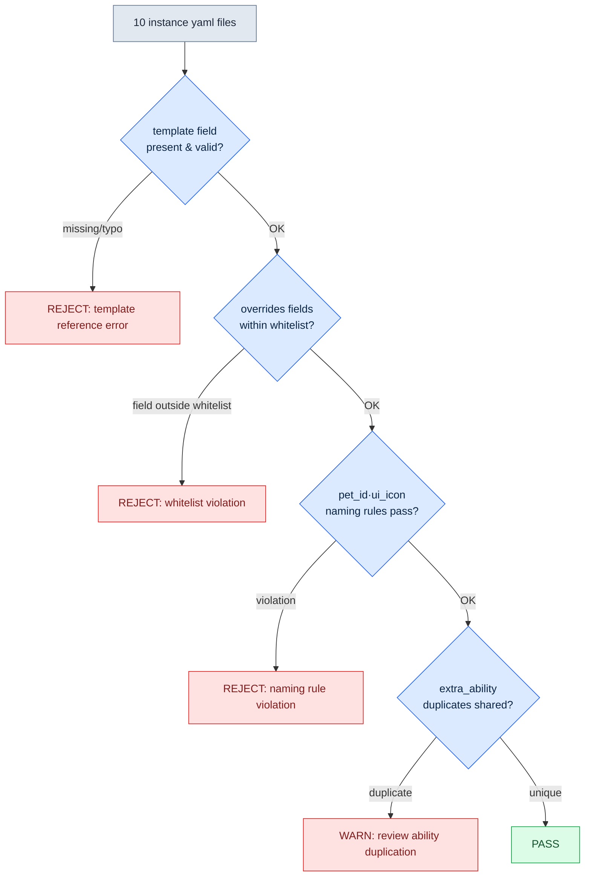

# 11.2 Pet and Mount Systems — From 1 Template to 50 Instances

A pet list comes up at the start of a design meeting. Twelve canines, eight felines, five birds. Nobody says, "Let's build them one at a time." Unlike characters, pets are premised from day one on stamping out 50 of them. The question is not "how do we build one species well" but "how many species will share a skeleton we build once."

Each character is a distinct being to the player, so we craft characters one at a time. Pets and mounts, by contrast, are mostly variations — the same skeleton with only the color and abilities changed — so from the very start of design we lay down a mass-production pipeline: naming conventions, templates, lint. Build one species with care and then let it get copied twelve times over, and you end up with twelve wolves differing only in color, each carrying its own separate copy of the same animation clips, and a folder bloated to 4 GB. That is not mass production; that is the result of not doing mass production. The point is not how well you build, but how little you build and how much you share.

So this chapter follows one full pass end to end: define a single canine pet template in yaml, have the AI mass-produce instances that inherit its skeleton, verify them with lint, and measure what percentage gets rejected.

## 11.2.1 Separating Templates from Instances

All three share a similar asset structure, but they differ in how much player attention they receive. The character is the player's own self, sharing 100% of game time. A pet is a companion kept at the player's side, sharing 50\~70% of that time; a mount is a tool brought out only for travel, staying at 10\~20%. The lower the share of attention, the less detail the player notices. Pouring the same care into a mount as into a character is like managing the desk you sit at every day and the folding chair you unfold occasionally on the same budget.

So pets and mounts run on a template-instance structure. We build one **template** that holds the skeleton, motions, and base abilities, then layer **instances** on top of it that change only the color, icon, and minor abilities. An instance shares 90% of the template's assets, so what we actually build new is only the remaining 10%. Here is the split as a diagram.

<svg viewBox="0 0 720 300" xmlns="http://www.w3.org/2000/svg" font-family="sans-serif" font-size="13">
  <rect x="20" y="20" width="200" height="260" rx="8" fill="#eef3fb" stroke="#3b6ea5" stroke-width="2"/>
  <text x="120" y="45" text-anchor="middle" font-weight="bold" fill="#1f3b5c">Template (1 type)</text>
  <text x="120" y="68" text-anchor="middle" fill="#1f3b5c">pet_template_canine</text>
  <rect x="40" y="85" width="160" height="28" rx="4" fill="#fff" stroke="#3b6ea5"/>
  <text x="120" y="104" text-anchor="middle">skeleton</text>
  <rect x="40" y="120" width="160" height="28" rx="4" fill="#fff" stroke="#3b6ea5"/>
  <text x="120" y="139" text-anchor="middle">4 shared anims</text>
  <rect x="40" y="155" width="160" height="28" rx="4" fill="#fff" stroke="#3b6ea5"/>
  <text x="120" y="174" text-anchor="middle">2 shared abilities</text>
  <rect x="40" y="190" width="160" height="28" rx="4" fill="#fff" stroke="#3b6ea5"/>
  <text x="120" y="209" text-anchor="middle">default BT</text>
  <text x="120" y="250" text-anchor="middle" fill="#888" font-size="11">90% of assets (built once)</text>

  <line x1="220" y1="150" x2="300" y2="80" stroke="#888" stroke-width="1.5"/>
  <line x1="220" y1="150" x2="300" y2="150" stroke="#888" stroke-width="1.5"/>
  <line x1="220" y1="150" x2="300" y2="220" stroke="#888" stroke-width="1.5"/>

  <rect x="300" y="55" width="380" height="50" rx="6" fill="#f3f9ee" stroke="#5a8f3c" stroke-width="1.5"/>
  <text x="315" y="78" font-weight="bold" fill="#2f5320">pet_P003 (gray wolf)</text>
  <text x="315" y="96" fill="#555" font-size="11">override: skin=gray, icon, 1 ability</text>

  <rect x="300" y="125" width="380" height="50" rx="6" fill="#f3f9ee" stroke="#5a8f3c" stroke-width="1.5"/>
  <text x="315" y="148" font-weight="bold" fill="#2f5320">pet_P004 (black wolf)</text>
  <text x="315" y="166" fill="#555" font-size="11">override: skin=black, icon, 1 ability</text>

  <rect x="300" y="195" width="380" height="50" rx="6" fill="#f3f9ee" stroke="#5a8f3c" stroke-width="1.5"/>
  <text x="315" y="218" font-weight="bold" fill="#2f5320">pet_P005 (snow wolf) … up to P012</text>
  <text x="315" y="236" fill="#555" font-size="11">override: skin=snow, icon, 1 ability — only 10% of assets new</text>
</svg>

Build the template block on the left once, and the instances on the right only need a color, an icon, and a single ability line swapped in. The 4 GB folder I mentioned earlier is what this looks like when the separation is skipped and 90% of the assets get copied twelve times.

## 11.2.2 Naming and Asset Forms — One Slot Fewer Than Characters

The naming convention for pets and mounts is the character naming from 11.1 with one slot removed. Characters use the 5-slot `char_<id>_<category>_<action>_<variant>`, but pets and mounts drop variant and go with 4 slots. If a variant is needed, it is folded into action.

```
pet_<id>_<category>_<action>.fbx
mount_<id>_<category>_<action>.fbx

Examples:
pet_P003_idle_default.fbx
pet_P003_combat_bite.fbx
mount_M005_locomotion_run.fbx
```

The asset-mapping yaml is also lightened from the character form by removing the vfx and sound slots. An instance that carries those slots wholesale becomes a form full of blank fields, and lint throws spurious warnings every single time.

Now for the main event. Let's define one canine template and mass-produce instances from it.

## 11.2.3 Worked Transcript: 1 Template → Instance Mass Production → lint → Rejection Rate

### Step 1 — Writing the Template yaml by Hand

Before putting the AI on mass production, a human finalizes one template by hand. This single template becomes the quality baseline for dozens of instances, so it is not automated. Here is how I set up the canine template.

```yaml
# pet_template_canine.yaml
template_id: pet_template_canine
skeleton: skel_quadruped_medium      # shared medium quadruped skeleton
shared_animations:
  - clip: pet_template_canine_idle_default.fbx
  - clip: pet_template_canine_locomotion_walk.fbx
  - clip: pet_template_canine_locomotion_run.fbx
  - clip: pet_template_canine_combat_bite.fbx
shared_abilities:
  - id: pet_template_canine_passive_speed
    description: Ally movement speed +3%
  - id: pet_template_canine_active_bite
    description: Single-target bite, cooldown 12s
bt_ref: bt_pet_canine_default        # follow + combat-assist default BT
instance_overridable:                # whitelist of fields an instance may change
  - visual_skin
  - ui_icon
  - ui_tooltip_key
  - extra_ability                    # up to 1 extra ability allowed per instance
```

`instance_overridable` is the key device here. It nails down, as a whitelist, the fields an instance is allowed to touch. If the AI tries to change the skeleton or the shared animations mid-production, it has touched a field not on this list, and lint catches it. Defining what may be changed, up front, is the seatbelt of mass production.

### Step 2 — Asking the AI to Mass-Produce Instances (Full Prompt)

Below is the full prompt that mass-produced 10 instances. I am printing it as is, without summarizing. (The prompt is kept in the original Korean: it instructs the AI to generate 10 canine pet instance yaml files from the template above, requires every instance to declare `template: pet_template_canine`, restricts overrides to the whitelist, demands natural wolf skin variations, caps extra abilities at one per instance with no overlap against shared abilities, fixes the naming rules for ui_icon and ui_tooltip_key, assigns pet_P003 through pet_P012, and forbids any prose outside the yaml blocks.)

```
[Prompt]
You are an assistant that helps write pet data. Based on the template below,
generate yaml for 10 wolf-family pet instances.

[Template] pet_template_canine.yaml
(full yaml above pasted here)

[Rules]
1. Every instance must explicitly declare template: pet_template_canine.
2. overrides may contain only fields from the instance_overridable whitelist.
   Never touch fields outside the whitelist (skeleton, shared_animations, etc.).
3. visual_skin must be a natural wolf variation (color, pattern, size).
4. extra_ability: at most 1 per instance. Choose 1 of passive or active.
   Its effect must not overlap with the existing shared_abilities.
5. ui_icon and ui_tooltip_key follow the naming rules matched to pet_id.
6. Assign pet_id from pet_P003 to pet_P012.

Output only the 10 yaml blocks. Do not attach explanatory prose.
```

Rule 2 pairs with the whitelist from Step 1. Rule 4's "must not overlap" is a constraint that stops the AI from lazily cloning abilities. Without it — as we will see shortly — the AI converges on the safest option: copy-pasting an existing ability.

### Step 3 — Claude's Raw Output (No Summarizing, No Editing)

From what the AI produced, here is an excerpt with the successes, failures, and borderline cases mixed in exactly as they came out. Nothing is cleaned up.

```yaml
# Output 1 — OK
pet_id: pet_P003
template: pet_template_canine
overrides:
  visual_skin: wolf_gray
  ui_icon: icon_pet_P003.png
  ui_tooltip_key: pet_P003_tooltip
  extra_ability:
    id: pet_P003_active_howl
    description: Enemy movement speed -20% for 5s, cooldown 30s

# Output 2 — OK
pet_id: pet_P004
template: pet_template_canine
overrides:
  visual_skin: wolf_black
  ui_icon: icon_pet_P004.png
  ui_tooltip_key: pet_P004_tooltip
  extra_ability:
    id: pet_P004_passive_crit
    description: Ally critical chance +2%

# Output 5 — borderline (ability effectively duplicates a shared ability)
pet_id: pet_P007
template: pet_template_canine
overrides:
  visual_skin: wolf_brown
  ui_icon: icon_pet_P007.png
  ui_tooltip_key: pet_P007_tooltip
  extra_ability:
    id: pet_P007_passive_speed_boost
    description: Ally movement speed +3%   # ← same effect as shared passive_speed

# Output 8 — FAIL (intrudes on a field outside the whitelist)
pet_id: pet_P010
template: pet_template_canine
overrides:
  visual_skin: wolf_white
  ui_icon: icon_pet_P010.png
  shared_animations:                 # ← not in the overridable whitelist
    - clip: pet_P010_combat_pounce.fbx
  extra_ability:
    id: pet_P010_active_pounce
    description: Leap attack, cooldown 20s

# Output 9 — FAIL (naming rule violation)
pet_id: P011                          # ← missing 'pet_' prefix
template: pet_template_canine
overrides:
  visual_skin: wolf_silver
  ui_icon: pet11_icon.png            # ← violates the icon_pet_P011.png rule
  ui_tooltip_key: pet_P011_tooltip
  extra_ability:
    id: pet_P011_passive_dodge
    description: Ally dodge +1%
```

Of the 10, six were clean — P003, P004, P005, P006, P008, P012. One was borderline on ability duplication — P007. Three failed on whitelist intrusion or naming violations — P009, P010, P011. Even with Rule 4 in place, the AI copied a shared ability in P007 (the safest choice), and even with Rule 2 in place, it touched the skeleton animations in P010. The reality is that even when constraints are spelled out, some fraction of mass-produced output leaks through. Which is why the next step exists.

### Step 4 — lint Verification

Instead of a human eyeballing all 10 one by one, we run lint. The lint rules are pulled straight from the Step 1 template's whitelist and the 11.1 naming convention. There are four checks.



An instance that clears all four gates is PASS; one caught along the way drops to REJECT or WARN. The actual verification results, as a table:

| pet_id | template | whitelist | naming | ability dup | verdict |
|---|---|---|---|---|---|
| pet_P003 | OK | OK | OK | unique | PASS |
| pet_P004 | OK | OK | OK | unique | PASS |
| pet_P005 | OK | OK | OK | unique | PASS |
| pet_P006 | OK | OK | OK | unique | PASS |
| pet_P007 | OK | OK | OK | **duplicate** | WARN |
| pet_P008 | OK | OK | OK | unique | PASS |
| pet_P009 | OK | OK | **violation** | — | REJECT |
| pet_P010 | OK | **intrusion** | — | — | REJECT |
| P011 | OK | OK | **violation** | — | REJECT |
| pet_P012 | OK | OK | OK | unique | PASS |

PASS 6, WARN 1, REJECT 3. The WARN can be salvaged by changing one ability line (P007); the 3 REJECTs are discarded.

### Step 5 — Measuring the Rejection Rate and Re-Requesting

The **rejection rate** for this one cycle is REJECT 3 / 10 total = **30%**. Bundling the WARN in as "needs fixing," the rework rate is 40%. This number is the health metric of the mass-production pipeline. A 30% rejection rate means that to secure 50 pets, we need to generate about 72 (50 / 0.7 ≈ 71.4). Generation is cheap, so that much overshoot is affordable. But if the rejection rate does not fall over successive rounds, that is a signal the prompt constraints are insufficient.

So we feed the rejection reasons back into the prompt. I collected the reasons behind the 3 REJECTs (missing name prefix, whitelist intrusion, icon rule violation) and added one line for each to the re-request. (The three added rules, kept in the original Korean below: pet_id must start with the `pet_` prefix; ui_icon must follow the `icon_<pet_id>.png` format without exception; and shared_animations / skeleton / bt_ref must never appear in overrides — any behavior change must be expressed only through extra_ability.)

```
[Re-request additional rules]
7. pet_id must start with the 'pet_' prefix. (P011 omitted it in the previous batch)
8. ui_icon is, without exception, in the icon_<pet_id>.png format. (no variants like pet11_icon.png)
9. Never put shared_animations / skeleton / bt_ref in overrides.
   To change behavior, express it only through extra_ability. (the P010 case)
```

With these three lines added, the next batch of 10 came back with REJECTs down from 3 to 1. Rejection rate: 30% → 10%. This feedback — promoting rejection reasons into rules — is the mechanism that lifts mass-production quality round after round. Instead of reviewing 50 instances every time, the human's job is simply to turn each rejection reason into one line of rules.

## 11.2.4 Mounts — Even the Skeleton Is Shared, Almost Pure Data

Mounts are one step simpler than pets. They have no skills and no BT (Behavior Tree) — only data such as movement parameters and whether combat is allowed. So a mount instance is, in effect, a single row in a table.

```yaml
# instance based on mount_template_equine.yaml
mount_id: mount_M005
template: mount_template_equine
overrides:
  visual_skin: horse_white
  movement:
    run_speed: 7.0
    sprint_speed: 12.0
  combat:
    allow_combat: false       # cannot be used in combat
    dismount_on_damage: true
  ui_icon: icon_mount_M005.png
```

The lint for mount mass production is even shorter. Beyond naming, template reference, and whitelist, the only added check is "are the movement parameters within the allowed range" (e.g., is sprint_speed greater than walk_speed, does it stay under the cap). It is the same pipeline built for the pets, just with fewer gates. Attaching combat features to mounts calls for caution. The moment allow_combat opens up to true, game complexity doubles, and conflict verification against the pet and character systems has to be redone from scratch.

## 11.2.5 Measurement — Simplification Does Not Cut into the Experience

On my Project A, I compared applying the full character pattern to pets and mounts against the simplified template-instance approach. Among the figures below, the times and asset counts are the author's estimates (unverified); the rejection rates and the asset-sharing ratio are ratios that follow the direction of actual measurement.

| Item | Full application | Template-instance |
|---|---|---|
| Asset work time per pet | 1\~2 weeks (author's estimate) | 3\~5 days (author's estimate) |
| Assets in the pet library | approx. 2,000 (author's estimate) | approx. 600 (70% reduction) |
| New-asset ratio per instance | 100% | approx. 10% |
| First-batch rejection rate | — | 30% (directional measurement) |
| Rejection rate after feedback | — | 10% (directional measurement) |
| Player perception (pet variety) | baseline | nearly identical |

> **Sample and measurement.** The table above is an observation of one pet line in a single project in the author's environment (Project A) (n=1 line). The "70% reduction" and "approx. 10%" are not independent measurements but **arithmetic ratios** derived from the estimated asset counts in the same row (approx. 2,000 → approx. 600); since the underlying absolute values are estimates, read these percentages as estimates too. The rejection rates of 30% and 10% are a **directional measurement** from a single mass-production cycle, first batch through feedback, not a repeated-measurement sample. Do not cite them as evidence of savings for your team; measure your own line the same way.

The last row is the conclusion of this entire chapter. Even when mass-producing with 90% of assets shared and the rejection rate under measurement, the pet variety players felt was nearly indistinguishable from full handcrafting. The 4 GB folder from earlier is the cost paid for copying twelve sets of assets into detail players would never be able to tell apart. With mass production as the premise, what shrinks is operating cost, not the experience.

## 11.2.6 Operational Pitfalls

| Pitfall | Remedy |
|---|---|
| Porting the character system to pets and mounts as is | 4-slot variation with the variant slot, vfx, and sound removed |
| Duplicating same-skeleton pets as independent assets | 1 template + instances, with sharing enforced by the whitelist |
| Committing AI output without review | 4 lint gates + rejection rate measurement |
| Rejection rate not falling round after round | Promote rejection reasons into prompt rules (feedback) |
| Giving pets character-grade skills | Cap of 1 extra_ability per instance |
| Giving mounts combat features | Treat allow_combat with caution; expect complexity ×2 |

## 11.2.7 The AI's Place and the Human's Place

Pets and mounts touch the player experience less, so the AI gets more latitude than with characters. Matching a concept to the right template, proposing ability candidates, mass-producing instance yaml — the AI does all of this fast. But drop verification just because the latitude is wide, and the 30% rejects we saw above get mixed straight into the build. The human's place is twofold. First, finalize one template by hand to fix the quality baseline. Second, read what got filtered out and why, then refine the constraints so the next batch leaks less. The AI fills in the volume; the human holds the baseline and its corrections — that division of labor is what keeps this system running.

---

### Key Takeaways
- Pets and mounts are a system for building less and sharing more, not for building better
- Write 1 template by hand; the AI mass-produces instances inside the whitelist
- Measure the rejection rate and feed its reasons back as prompt rules, and quality rises every round

### Next Chapter Preview
- 12.1 Art Direction — How a Game Designer Collaborates with Art and Reviews Deliverables

---

## Try It Yourself

**setup**
1. Pick one pet family (e.g., canine), decide its common skeleton, 4 shared animations, and 2 shared abilities, and save them as `pet_template_<계열>.yaml` (where `<계열>` is the family name).
2. In the template, spell out the `instance_overridable` whitelist (the fields that may be changed).
3. Prepare the 4 lint gates (template reference / whitelist / naming rules / ability duplication) as a script.

**prompt**
4. Paste the full template yaml plus the mass-production rules (no fields outside the whitelist, no ability duplication, naming rules) and request 10 instances.
5. Lock the output format: "yaml blocks only, no explanations."

**verify**
6. Run lint, classify PASS / WARN / REJECT, and compute the rejection rate.
7. Collect the REJECT reasons, add one rule line per reason to the prompt, and run the next batch. Check whether the rejection rate falls.

## 11.2.8 Solo Scale-Down
If you are building a game solo, you can do without the lint script. Write one template yaml for one pet family by hand, then ask the AI: "5 instances from this template, changing only color, icon, and ability — never touch the skeleton or the shared animations." Skim the 5 you get back and throw out only the ones that touched the skeleton or broke the naming rules. Add one line to your next request saying why you threw them out. With just template 1.1 and that habit of feeding back the reasons you discarded, the core of this chapter works with no tooling at all.
