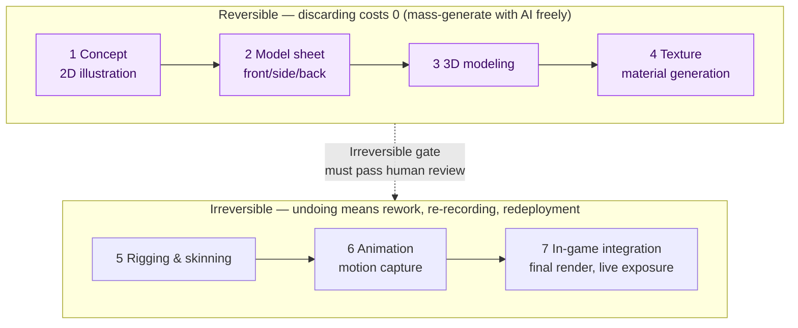
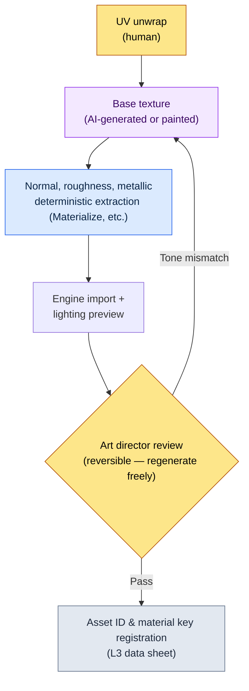

# 12.1 The AI Art Asset Pipeline — Mass-Generate in Reversible Stages, Stop Before the Irreversible Gate

> Primary readers: game designers and art directors who collaborate with an art team (mid-sized teams of 10–50)
> Scaled-down version for solo and hobbyist readers: §12.1.8, "If You're Solo, Just This Much"

I remember the day we pinned 100 sheets of AI-generated concept art to the meeting room wall. Out of the 100 sheets printed in 30 seconds, the art director picked 3, and the other 97 were thrown away on the spot. Someone called that "97% waste." But if they had been drawn by hand, an artist would have spent two weeks getting to those 3. What counted as waste had been flipped on its head.

This chapter is about turning that inversion into an operating practice. The core fits in one line. **With AI art, mass-generate freely in the reversible stages (concept and texture exploration), but place a human-guarded gate before the irreversible stages (final render, motion capture, build integration).** Where discarding costs nothing, throw away 99 sheets; where nothing can be undone, let not a single sheet pass unchecked. How to operate the art tools themselves is well covered in other books, so this chapter focuses only on *where those tools fit safely into a game designer's pipeline*.

---

## 12.1.1 The Art Pipeline Has a Line You Can Turn Back From

An art asset travels seven stages from concept to in-game. Here is the character asset line from my project (hereafter "Project A"), copied as-is. What matters is not the number of stages but the **reversible/irreversible boundary** that runs through the middle of them.



The four stages on the left (concept through texture) are **reversible**. Generate 100 concepts and discard 97, and all you lose is token cost; regenerate a texture five times, and overwriting the file is the end of it. That makes this zone the place where AI mass generation delivers the largest ROI (return on investment). The main production tools are self-hosted Stable Diffusion (SDXL) and ComfyUI. The reason is IP protection — assets never go up to an external closed service, everything runs locally, and a LoRA fine-tuned on the character plus ControlNet keep the same person consistent across repeated generations. Closed tools (Midjourney and the like) are used only sparingly for laying down early mood boards; the real mass generation, where consistency and repeat control matter, runs on SD/ComfyUI.

The three stages on the right (rigging onward) are **irreversible**. Motion capture ties up studio and actor schedules, and once a final render ships in a build and goes live, player memory and community reaction attach to it. Past that point, undoing costs more than making. So a **human-guarded gate** — a quality gate, in software terms — stands on the boundary. No matter how much AI mass-generates in the reversible zone, the only assets that cross into the irreversible are the ones that passed human review.

This one diagram is the skeleton of this chapter. The question "how much should we use AI for art" is really the question "which side of the line is this task on."

---

## 12.1.2 [Worked Transcript] One Concept Batch, from Mass Generation to Discard and Re-Request

This section shows one full cycle of concept mass generation, the first stage of the reversible zone. If you only write the abstraction — "AI generates the concepts" — you cannot tell what actually comes out and what gets discarded. Below is a faithful reproduction of a session from Project A that mass-generated concepts for a senior NPC of the scholars' guild. The prompts can be copied and used as-is; the outputs are a reconstruction of the actual session.

### Step 1 — Input: State the Design Intent First

Here is where people most often get it wrong: starting the prompt with a visual description. The company feedback atom `image_prompt_design_intent_first` pins down the opposite principle — **for image prompts too, design intent comes first**. Not a string of appearance adjectives, but what function and narrative this character carries in the game, stated up front.

```yaml
# concept_brief_scholar_senior.yaml — concept mass-generation input
asset_id: npc_scholar_senior_01
role: Senior of the scholars' guild — the first to observe the seal weakening
function: Main-quest-giving NPC (an informant the player must trust)
narrative_seed:
  - Has recorded the seal's veins from the bell tower for 30 years
  - Hides emotion behind numbers (scholarly_strict tone)
style_anchor: semi-realistic, painted, East Asian fantasy   # fixed from the L0 vision
forbidden: anime style · modern clothing · generic fantasy wizard robe
```

`function` and `narrative_seed` come before appearance. The input has to carry "why this character must look this way" before you can judge, among the mass-generated results, "why this one is better."

### Step 2 — Prompt: Mass-Generate, but Enforce Format and Taboos

```
Based on the attached concept_brief, generate 6 proposed directions for the character concept.
This is exploratory mass generation — not finals, but candidates for the art director to pick from.

Rules:
1) Translate function and narrative_seed into visuals. No mere prettiness.
   (e.g., "hides emotion behind numbers" → how does it show in expression, props, posture)
2) Do not stray from style_anchor. The forbidden items are absolutely off-limits.
3) The 6 proposals must differ enough from one another. 6 micro-variations have no exploration value.
4) Attach a one-line intent rationale to each proposal (why this direction fits the function).
5) Separately flag any proposal you suspect 'may conflict with style_anchor'.

Output format: (proposal no. | key visual | intent rationale | conflict flag). No other explanation.
```

Visual description takes up almost none of this prompt. Most of it is spent locking down the output format and nailing the taboos in place. Give AI free rein and it regresses to the mean of its training data — the generic fantasy wizard. **The duty to translate intent into visuals, the fixed style_anchor, the forced diversity across six proposals, and the escape hatch of "report it if you suspect a conflict"** are the four bolts that block that regression.

### Step 3 — Claude's Output (Reconstructed, Excerpt)

```
| No | Key visual                                                | Intent rationale                                    | Flag |
|----|-----------------------------------------------------------|-----------------------------------------------------|------|
| 1  | Brass magnifier permanently mounted, ink-stained fingers  | Observation is identity — the tool made flesh       |      |
| 2  | Expressionless old scholar, gauge scrolls in hand         | Hides emotion behind numbers = blank face + records |      |
| 3  | Bell tower backdrop, the seal's vein-light fading behind  | The workplace explains the person                   |      |
| 4  | Ornate star-embroidered robe, mana orb in hand            | Emphasizes majesty                                  | ★    |
| 5  | One glass eye, the mark of a lifetime of observation      | The body's price for 30 years on the job            |      |
| 6  | Young, neat scholar, looks-first emphasis                 | Likability first                                    | ★    |
```

The most valuable thing in this output is not the table but the **two rows marked ★**. On proposal 4 (the ornate wizard robe with a mana orb) and proposal 6 (looks-first), the AI itself reported "this may conflict with style_anchor/forbidden." Without the escape hatch in rule 5, those two proposals would have slipped into the table wearing the same face as the other four. Making the AI raise its own hand over the suspicious spots — that is what separates controlled mass generation from a free-for-all.

### Step 4 — Verification and Rejection (the Human's Seat)

I do not take this output as-is. The art director checks the six proposals against the brief once. In this actual session, the verdicts split like this.

- **Proposal 4: discarded.** Exactly as the AI reported. "A star-embroidered robe holding a mana orb" is a head-on violation of `forbidden: 일반 판타지 마법사 로브` (generic fantasy wizard robe). This character is not someone who casts magic but someone who *observes and records* it. A function mistranslation.
- **Proposal 6: discarded.** Looks-first contradicts `narrative_seed: 30년 직무의 신체 대가` (the body's price for 30 years on the job). This NPC's credibility comes from the wear of someone who has done the work for a long time. A young, clean face cuts into the narrative.
- **Proposals 1 and 5 adopted, 2 and 3 held.** Proposal 1 (the magnifying glass become part of the body) and proposal 5 (the glass eye) landed squarely on the intent that tools and duty shape the person.

The two discards here are not a loss. Drawn by hand, it would have taken days to learn that those two directions were wrong; mass generation spread six proposals out at once and weeded them out within an hour.

### Step 5 — Re-Request

```
Merge the directions of proposal 1 (magnifier made flesh) and proposal 5 (glass eye).
- Integrate the brass magnifier + one glass eye into a single figure
- Emotion suppressed (scholarly_strict): expression blank, duty spoken only through props
- Re-confirm forbidden: wizard robe, mana orb, looks-first emphasis all banned
This is the step that produces the 'single final candidate' to hand to the art director for manual finishing.
```

The AI answered with a single direction that merged the magnifying glass and the glass eye into one old scholar, and that one sheet went to the concept artist's desk to be finished by hand. **Mass generation (6 proposals) → discard (2) → convergence (1) → human finish** — one cycle closes here. What the AI produced was not the final asset but the breadth of candidates for the art director to choose from.

This one lap is the Show standard for this entire book. Unless you watch, at least once and all the way through, what the AI emits, what gets discarded, and what a human finishes, the sentence "we mass-generated concepts with AI" is hollow.

---

## 12.1.3 A High Discard Rate Is a Signal of Deep Exploration

In the session above, 2 of the 6 proposals were discarded. Across the concept line as a whole, the discards pile far higher. Of the 100 sheets pinned to the meeting room wall, 3 were adopted.

Let me handle this ratio honestly. It is a directional figure from hand-counting a few concept sessions in the early adoption period, not a precise population ratio (author's estimate, unverified — it swings widely with character personality and brief quality). So the right reading is not "exactly what percent" but the direction: **compared to the hand-drawn days, we became far freer to discard**.

What matters is that a 0% discard rate is not the goal. When one sheet of paper is expensive, you polish that one sheet to the end. When 100 sheets print in 30 seconds, throwing away 99 costs nothing, and the breadth of exploration widens accordingly. **A rising discard rate is a signal that exploration is getting deeper.** Operations that try to lower the discard rate itself — say, pressure like "if the AI made it, let's use it whenever we can" — cut down the value of exploration along with it. The reason proposals 4 and 6 in §12.1.2 could be discarded without hesitation was that discarding cost zero.

---

## 12.1.4 Texture Mass Generation — The Second Seat in the Reversible Zone

Alongside concept, the other high-ROI seat in the reversible zone is texture — the stage that generates the materials applied to 3D models. Here too, the cells where AI goes in and the cells determinism owns split cleanly.



AI enters exactly one cell: the **base texture**. PBR maps such as normal, roughness, and metallic are not left to AI to produce differently every time; a deterministic extraction tool owns them. The same base has to yield the same maps for materials to stay consistent. This is the same division of labor as the city generator in §6.2, where the reward curve was never handed to AI and the rulebook held it — **what determinism can guarantee goes to code; what needs exploration goes to AI.**

Even the base texture is not an AI fit for every asset. Where fine detail decides the game's identity — a character's face — the human hand still comes first. That is why, when the review gate catches a "tone mismatch," the asset is sent back for regeneration rather than auto-discarded. Everything up to this point sits left of the line — the reversible zone, where any number of re-runs loses nothing.

---

## 12.1.5 The Irreversible Gate — Consistency Verification and Visual Regression

Just before the line is crossed, assets mass-generated in the reversible zone are checked for clashes with the grain of the whole game. This is a spot where human eyes alone leak, so code takes the first pass.

```python
# visual_regression.py — detect unintended changes on asset swap (skeleton)
# Input: asset ID + before/after render captures under identical conditions
# Output: change grade (alert to the human review gate)

def compare_renders(asset_id, before_png, after_png, threshold=(1.0, 5.0)):
    diff = pixel_diff(before_png, after_png)   # normalized 0~100
    if diff > threshold[1]:
        return ("BLOCK", f"{asset_id}: major change {diff:.1f}% — no irreversible entry before review")
    elif diff > threshold[0]:
        return ("WARN",  f"{asset_id}: minor change {diff:.1f}% — intent confirmation needed")
    else:
        return ("PASS",  f"{asset_id}: no change")
```

These 30 lines catch the "swapped one texture and another character's shadow broke" accident *before* it enters the irreversible zone. The important design point is that `BLOCK` is not an automatic discard — **it only raises an alert to the review gate**. If code also kills intended changes (redesigns), the artists will be saying "turn it off" within a quarter or two. The machine picks the suspects; a human decides what crosses into the irreversible.

The other thing review catches is **style consistency**. AI output differs minutely on every run, so a human takes the last look at whether the mass-generated concepts and textures hold the game's grain. Only what passes this gate moves on to rigging, motion capture, and final render — the irreversible stages. Once motion is captured and shipped in a build, a consistency accident can only be fixed by rework, re-recording, and redeployment.

---

## 12.1.6 Only Decisions Cross to the Art Team — md→html→sync

Even when game designers mass-generate concepts and textures with AI, the art team that actually draws is a separate organization. The heart of this collaboration is making sure **the art team never has to learn the design team's tools or conventions**. Project A's art guide (`96_ArtGuide/`) solves this with automation.

Art decisions are written in md by the design team, `_convert_md_to_html.py` converts them to html, and `_SyncToArtRepo.bat` pushes them to a separate art repository. The art team sees only the html in that repo — they never need to know the md conventions or the design team's SVN (the pipeline diagram is in §12.2.4).

And these decision documents are split into 7 domains (`00_Common` and `01_Character` through `07_Env`), each holding its own style rules and merging at an integration gate. This is the ArtGuide's 7 areas covered in the next chapter (12.2), but here is the gist in advance — **split the style rulebook into 7 drawers instead of one box, and the mass-generation prompt gets pulled from a drawer instead of being reassembled in an artist's head every time.** The `style_anchor` and `forbidden` in §12.1.2 are inputs that came straight out of those drawers. The rulebook has to be separated out for mass-generated results not to regress to the generic-fantasy mean.

That said, not every game needs all 7 areas. For a casual genre, two drawers — character and environment — are plenty. Separate gradually; keep the interface narrow.

---

## 12.1.7 How to Handle Numbers and Risks Honestly

The numbers in this chapter come in only three kinds. (1) **Directions and ratios** — "100 generated, 3 adopted" is a directional figure from my own experience (unverified), so read it not as an absolute value but as the direction "in the reversible zone, the cost of discarding converges to zero." (2) **Measured values** — the visual-regression change rate (`diff %`), the count of consistency accidents, and the count of BLOCK events come out of `visual_regression.py` as numbers, so meetings can speak in numbers instead of "feelings." By contrast, "retention went up" is not decided by art alone, so I do not assert causation there.

(3) **Risks stay inside the operating cost.** The three risks of AI art — training-data copyright, style-consistency damage, and artists' jobs — belong inside the ROI calculation, not outside it. My policy is: AI used aggressively in the reversible zone, final assets that cross into the irreversible finished by hand, and the AI-output ratio of assets that go directly into the build held at zero as a principle. But this is one policy, not the answer — some teams use only models with explicit licenses and take AI all the way to final assets. Legal policy differs by company, and this book offers not the answer but a way to draw the line.

Of the three risks, the one most often missed is the third. Unless AI is positioned not as "a mass-production machine that replaces artists" but as "an assistant that widens exploration and strengthens artists' decision-making power," the tool will be rejected by the organization even if it succeeds on the KPIs. This is also the spot nailed down by the feedback atom `design_intent_vs_automation_boundary` (design intent vs. automation boundary).

---

## 12.1.8 Common Failures

| Pattern | Why It Fails | Remedy |
|---|---|---|
| Putting AI concepts straight into the build as final assets | The irreversible stage is passed without human review | A gate before the line (§12.1.1) |
| Starting the prompt with appearance description | Function mistranslation — regression to the pretty wizard | Design intent first (§12.1.2, `image_prompt_design_intent_first`) |
| The 6 generated proposals are micro-variations | No exploration value, nothing worth discarding | Force diversity (§12.1.2) |
| Trying to lower the discard rate | Cuts exploration depth along with it | Read reversible-zone discards as a signal (§12.1.3) |
| AI-generating even the texture PBR maps | Material consistency wobbles with every call | Separate deterministic extraction (§12.1.4) |
| Swapping assets without visual regression | Unintended changes leak into the irreversible | The `visual_regression.py` gate (§12.1.5) |

---

## 12.1.9 Try It Yourself — One Step You Can Take Today

> **If You're Solo, Just This Much**: You don't need an art team or data sheets. Pick one NPC from your own game (or a game you love), write `function` and `narrative_seed` *before* appearance in the `concept_brief` format of §12.1.2, paste the 6-proposal generation prompt as-is, and run it once. Then pick the one proposal among the six that misses the intent and push back — "this is a function mistranslation; discard it and retry." Discarding in the reversible zone being exploration, not loss, will sink in through your hands.

If you're on a team, start with this one step. **Draw the reversible/irreversible boundary explicitly, in one line, across your pipeline** (§12.1.1). Agree on which stages are "free to discard" and where "expensive to undo" begins, and put a human review gate on that boundary. Once the line is drawn, the fight you used to restart from scratch every time — "how far should we use AI" — becomes a single ruling: "which side of the line is this task on."

Summarized as setup → prompt → verify — **setup**: define the reversible/irreversible boundary and the review gate in your pipeline. **prompt**: input the design intent first in the §12.1.2 format and mass-generate six proposals, enforcing taboos, diversity, and self-reporting. **verify**: in the reversible zone, pick one intent mistranslation yourself and close one full cycle of discard and re-request; before entering the irreversible, run `visual_regression.py` to catch unintended changes.

---

### Key Takeaways
- In the reversible zone (concept, texture), mass-generate; before the irreversible gate, human review.
- A rising discard rate is a signal of deeper exploration, not of tool failure.
- For image prompts too, input the design intent first, not the appearance.

### Next Chapter Preview
- 12.2 The ArtGuide's 7 Areas — Split the Style Rulebook into 7 Drawers to Keep Mass Generation Consistent

---
