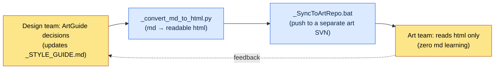

# 12.2 The Seven Areas of ArtGuide (Character, Animation, Monster, NPC, VFX, UI, Environment)

The Thursday integrated review. The moment we put seven new assets side by side on the same screen, we all laughed at once. The scholar character was a somber, gray-toned silhouette, and the skill VFX (visual effects) bursting right next to him was neon pink. Both were perfect decisions within their own areas. The character director had followed his own `_STYLE_GUIDE.md` to the letter, and the VFX artist had faithfully followed my spec: "make it highly visible." Nobody was wrong, yet placed on the same screen, two different games were at war.

That scene is both the reason ArtGuide gets split into seven areas and the reason the seven must be tied back together. The ArtGuide is the game's visual constitution. Splitting it into areas gives each area's director autonomy and speeds up decisions; failing to bind them back together through integrated reviews lets accidents like that neon pink pile up quarter after quarter. Where the designer puts a hand on this balance is the whole of this chapter.

---

## 12.2.1 One Diagram: The Actual Structure of the Seven Areas

In the design repository of Project A — the mobile-first MMORPG with an East Asian fantasy tone where I worked as design director — there is a folder named `96_ArtGuide/`. The number `96` exists so that, under the repository's sort rules, the art guide lands near the end, and below it the folder splits into seven domains. This is not some abstract "art folder for the project" — what follows is the folder's actual substructure.

<svg viewBox="0 0 760 360" xmlns="http://www.w3.org/2000/svg" font-family="sans-serif" font-size="13">
  <rect x="300" y="10" width="160" height="40" rx="6" fill="#2c3e50"/>
  <text x="380" y="35" fill="#fff" text-anchor="middle" font-size="14">96_ArtGuide/</text>
  <line x1="380" y1="50" x2="380" y2="70" stroke="#888" stroke-width="1.5"/>
  <line x1="70" y1="70" x2="690" y2="70" stroke="#888" stroke-width="1.5"/>
  <!-- 7 domain boxes -->
  <g>
    <rect x="20" y="70" width="100" height="70" rx="5" fill="#e8f0fe" stroke="#4285f4"/>
    <text x="70" y="92" text-anchor="middle" font-weight="bold">00_Common</text>
    <text x="70" y="112" text-anchor="middle" font-size="11">Shared rules</text>
    <text x="70" y="128" text-anchor="middle" font-size="11">palette·rules</text>
  </g>
  <g>
    <rect x="130" y="70" width="100" height="70" rx="5" fill="#fce8e6" stroke="#ea4335"/>
    <text x="180" y="92" text-anchor="middle" font-weight="bold">01_Character</text>
    <text x="180" y="112" text-anchor="middle" font-size="11">Player</text>
    <text x="180" y="128" text-anchor="middle" font-size="11">characters</text>
  </g>
  <g>
    <rect x="240" y="70" width="100" height="70" rx="5" fill="#e6f4ea" stroke="#34a853"/>
    <text x="290" y="92" text-anchor="middle" font-weight="bold">02_Animation</text>
    <text x="290" y="112" text-anchor="middle" font-size="11">All</text>
    <text x="290" y="128" text-anchor="middle" font-size="11">animations</text>
  </g>
  <g>
    <rect x="350" y="70" width="100" height="70" rx="5" fill="#fef7e0" stroke="#fbbc04"/>
    <text x="400" y="92" text-anchor="middle" font-weight="bold">03_Monster</text>
    <text x="400" y="112" text-anchor="middle" font-size="11">Enemy NPC</text>
    <text x="400" y="128" text-anchor="middle" font-size="11">visuals</text>
  </g>
  <g>
    <rect x="460" y="70" width="100" height="70" rx="5" fill="#e8f0fe" stroke="#4285f4"/>
    <text x="510" y="92" text-anchor="middle" font-weight="bold">04_NPC</text>
    <text x="510" y="112" text-anchor="middle" font-size="11">Friendly NPC</text>
    <text x="510" y="128" text-anchor="middle" font-size="11">relations·voice</text>
  </g>
  <g>
    <rect x="570" y="70" width="100" height="70" rx="5" fill="#fce8e6" stroke="#ea4335"/>
    <text x="620" y="92" text-anchor="middle" font-weight="bold">05_VFX</text>
    <text x="620" y="112" text-anchor="middle" font-size="11">Visual effects</text>
    <text x="620" y="128" text-anchor="middle" font-size="11">skills·staging</text>
  </g>
  <g>
    <rect x="680" y="70" width="70" height="70" rx="5" fill="#e6f4ea" stroke="#34a853"/>
    <text x="715" y="92" text-anchor="middle" font-weight="bold" font-size="11">06_UI</text>
    <text x="715" y="112" text-anchor="middle" font-size="10">screen·HUD</text>
    <text x="715" y="128" text-anchor="middle" font-size="10">(9.3)</text>
  </g>
  <!-- 07 on second row -->
  <line x1="380" y1="140" x2="380" y2="170" stroke="#888" stroke-width="1"/>
  <g>
    <rect x="300" y="170" width="160" height="60" rx="5" fill="#fef7e0" stroke="#fbbc04"/>
    <text x="380" y="195" text-anchor="middle" font-weight="bold">07_Environment</text>
    <text x="380" y="216" text-anchor="middle" font-size="11">Background·props·landmarks</text>
  </g>
  <!-- footer note -->
  <text x="380" y="280" text-anchor="middle" font-size="12" fill="#555">Each domain = one director/senior's autonomy + per-domain _STYLE_GUIDE.md (constitution)</text>
  <text x="380" y="305" text-anchor="middle" font-size="12" fill="#555">00_Common = shared upper-level rules spanning all seven domains (color·material·period tone)</text>
</svg>

The diagram makes two points. First, the seven domains sit side by side with equal autonomy. Picture an office floor with seven studios in a row. Each room's owner holds the decision rights for that room, but when they pass each other in the hallway, the sense that they are making the same game must never be lost. Second, `00_Common` sits on top of them. The shared rules all seven rooms must follow — the overall color palette, the material standards, the period tone — live here. `06_UI` is the same domain as the UI collaboration standard covered in 9.1.3, so in this chapter I only draw the boundary and move on.

## 12.2.2 How Deeply the Designer Gets Involved Varies by Area

The designer does not intervene in all seven domains with the same intensity. The principle — the designer decides intent and narrative, art decides the visuals — applies equally to every domain, but how far intent pulls the visuals along differs by domain.

| Area | Designer Involvement | The Line the Designer Must Not Cross |
|---|---|---|
| 01_Character | Strong | Concept, personality, faction, role. Not facial proportions or brushwork |
| 02_Animation | Moderate | The "type and response" of skill motions. Not frame timing |
| 03_Monster | Strong | Enemy concept, faction, ecology. Not scale-pattern details |
| 04_NPC | Strong | Role, relationships, voice_profile. Not costume embroidery |
| 05_VFX | Weak | "Slow projectile, big explosion, purple." Not particle counts |
| 06_UI | Strong | Information structure and priority (9.3). Not pixel margins |
| 07_Environment | Moderate | Mood and landmark intent. Not tree polygons |

The right-hand column is the real content of this table. Even in domains marked "strong," there is a line the designer must not cross. Drive the character concept hard, but the moment you touch facial proportions, the character director's autonomy collapses. And the boundary between strong and weak itself shifts with genre. In a horror game, VFX carries the fear, so designer involvement strengthens; in a casual puzzle game, character involvement actually weakens. The table above reflects Project A's genre — it is not a universal law.

## 12.2.3 The Domain's Constitution: _STYLE_GUIDE.md

Each domain runs on a standard bundle of documents. Here is the actual file layout of the `01_Character/` domain.

```
01_Character/
├── _STYLE_GUIDE.md          — overall character style (the constitution)
├── _COLOR_PALETTE.md        — color & material guide
├── _PROPORTION_REFERENCE.md — proportion & silhouette rules
├── _DO_AND_DONT.md          — allowed & forbidden
├── individual/              — per-character sheets
│   ├── K_001_director.md
│   ├── K_007_scholar.md
│   └── ...
└── _REVIEW_LOG.md           — review history
```

*(The annotations, in Korean: `_STYLE_GUIDE.md` — overall character style (the constitution); `_COLOR_PALETTE.md` — color and material guide; `_PROPORTION_REFERENCE.md` — proportion and silhouette rules; `_DO_AND_DONT.md` — allowed and forbidden; `individual/` — per-character sheets; `_REVIEW_LOG.md` — review history.)*

`_STYLE_GUIDE.md` is the domain's constitution. Every individual character sheet (`individual/`) is a variation built on top of that constitution. If the constitution wobbles, every character under it wobbles, so this one file is the most frequently reviewed document in the domain. Its skeleton looks like this.

```markdown
---
title: 01_Character Style Guide
layer: L1
---

## 1. Tone
- Korean fantasy mood, set before the 19th-century Industrial Revolution
- Realistic proportions (7~7.5 heads, no chibi deformation)

## 2. Color
- Saturation: moderate (60~70% of photoreal)
- Main palette: inherited from 00_Common
- Accent colors per character (1~2)

## 3. Costume Rules
- Costume distinguishes faction (scholar → gray + purple accent)
- Costume detail follows occupation and rank

## 4. DO
- Identifiable by silhouette alone at a 5m distance
- Express faction identity visually

## 5. DON'T
- Japanese anime style
- Non-period elements (modern clothing·props)
- Excessive saturation
```

*(The skeleton, in Korean — 1. Tone: a Korean fantasy mood set before the 19th-century Industrial Revolution; realistic proportions (7–7.5 heads, no chibi deformation). 2. Color: moderate saturation (60–70% of photoreal); main palette: inherited from 00_Common; one or two accent colors per character. 3. Costume rules: costume distinguishes faction (scholar → gray + purple accent); detail follows occupation and rank. 4. DO: identifiable by silhouette alone at 5 m; express faction identity visually. 5. DON'T: Japanese anime style; non-period elements (modern clothing or props); excessive saturation.)*

One line in there matters most. Under `## 2. 색상` (Color), the line "메인 팔레트: 00_Common 상속" — "main palette: inherited from 00_Common." It states explicitly that the character domain does not define its own colors but inherits the upper-level shared rules. This single line is the structural device that blocks the neon-pink accident from the opening. If every domain's `_STYLE_GUIDE.md` inherits at least its colors from `00_Common`, color collisions are shut down at the constitutional level.

## 12.2.4 How to Bring Non-Designers into the Collaboration

Here we hit the most down-to-earth problem Project A actually faced. The art team does not read Markdown. To be precise: you must not force them to. The cost of teaching artists git diff, frontmatter, and Markdown heading hierarchies almost always exceeds whatever collaboration efficiency the teaching buys. The moment you push the design team's tools onto the art team as-is, collaboration actually slows down.

So Project A's pipeline comes down to one line: the design team decides in md, and the art team only ever sees html.



The heart of it is two automation assets. `_convert_md_to_html.py` converts a domain's Markdown guides into html that artists can read comfortably in a browser. Color palettes render as actual color chips; DO/DON'T renders as visual contrast. `_SyncToArtRepo.bat` pushes that html not into the design repository but into a **separate, art-only repository**. The reason for splitting repositories is simple. If artists pull only their own repository, they are never exposed to the design team's internal md history, drafts still in progress, or other domains' decision processes. What an artist sees is only the readable end product of confirmed decisions. The cost of learning Markdown drops to zero.

This structure adds one responsibility to the designer. Whenever you update the md, you must run the convert-and-sync steps. Update without syncing, and the art team paints today's art from yesterday's decisions. If that one gap between deciding and delivering sits empty, neither autonomy nor integration means anything.

## 12.2.5 Image Prompts Are Decisions Too: Design Intent First

As an extension of non-designer collaboration, there is one principle a designer must keep when using generative AI at the concept stage. Project A's internal rule is named `image_prompt_design_intent_first` — spelled out, "in an image prompt, write the design intent first."

The common failure when exploring concepts with generated images is a prompt filled with nothing but a description of how the result should look: "an East Asian man in his fifties in a gray dopo — a traditional Korean overcoat — calm expression, photorealistic." That prompt produces a picture, but it carries nothing about **why it should be that way**, so the art director gets lost when trying to vary that picture. The design-intent-first principle forces an intent block above the prompt.

```
[Design Intent]
- Role: spiritual pillar of the scholar faction, the player's first mentor
- What must read: a "scholar, non-combatant" silhouette even at 5m
- Faction signal: scholar = gray + purple accent (inherited from 00_Common)
- Forbidden: carrying weapons, ornate armor (misread as a combat class)

[Prompt]
A male East Asian scholar in his fifties in a gray dopo, purple coat-ribbon accent,
no weapons, calm and studious expression, pre-19th-century Korean fantasy,
realistic 7.5-head proportions, moderate saturation, ...
```

*(In Korean — [Design intent]: role — spiritual pillar of the scholar faction, the player's first mentor; what must read — a "scholar, non-combatant" silhouette even at 5 m; faction signal — scholar = gray + purple accent (inherited from 00_Common); forbidden — carrying weapons or ornate armor (would be misread as a combat class). [Prompt]: a male East Asian scholar in his fifties in a gray dopo, purple coat-ribbon accent, no weapons, calm and studious expression, pre-19th-century Korean fantasy, realistic 7.5-head proportions, moderate saturation, ...)*

With the intent block sitting above the prompt, the image becomes part of a decision. When the next person generates the same character in a different pose, they are not copying the look — they are satisfying the intent all over again. Even when an image gets discarded, the discussion can be "which part of the intent failed to read?" A prompt that records only the look ends at "I just like this one better" and leaves nothing to verify against; a prompt led by intent leaves a record of what was satisfied and what was missed.

This is where tool choice locks into the intent-first principle. To repeatedly generate "the same character in a different pose" true to intent, a prompt alone is not enough. Project A's tool split follows §12.1.1 — for production runs, self-hosted Stable Diffusion (SDXL)/ComfyUI with a character LoRA (locking face and costume) and ControlNet (pose and silhouette), so the "readable at 5 m" demand in the intent block holds even as poses change, and the IP stays protected as well. Closed tools (Midjourney and the like) are used only for early mood boards.

## 12.2.6 Worked Transcript: One Cycle of a Character Concept Spec

To see how domain autonomy and designer involvement actually run, let me follow one cycle in `01_Character` from start to finish. What follows is a reconstruction of real work in which I handed the AI the draft concept spec for the scholar character (`K_007_scholar`). Nothing is summarized — the awkward output and my rejection are included as they happened.

**① The Prompt I Gave the AI (Full Text)**

```
You are the character-concept assistant writer for our project. Following the
rules below, write a draft concept spec for K_007_scholar in Markdown.

Rules:
- Comply with 01_Character/_STYLE_GUIDE.md: pre-19th-century Korean fantasy,
  7~7.5-head proportions, moderate saturation, no Japanese anime style.
- Inherit colors from the 00_Common palette; the scholar faction accent is purple.
- Always include all 5 voice_profile items (tone/verbal tics/forbidden words/default emotion/forms of address).
- Decide only as far as concept, personality, faction, and role; leave visual
  details like facial proportions or brushwork blank (the character director's autonomous territory).
- Output in the individual/ character-sheet format.
```

*(The prompt, in Korean: "You are the character-concept assistant writer for our project. Following the rules below, write a draft concept spec for K_007_scholar in Markdown." The rules: comply with `01_Character/_STYLE_GUIDE.md` — pre-19th-century Korean fantasy, 7–7.5-head proportions, moderate saturation, no Japanese anime style; inherit colors from the 00_Common palette, with purple as the scholar faction's accent; always include the five voice_profile items (tone / verbal tics / forbidden words / default emotion / forms of address); decide only as far as concept, personality, faction, and role, leaving visual details like facial proportions or brushwork blank as the character director's territory; output in the individual/ character-sheet format.)*

**② Claude's Raw Output (Failure Included, Untouched)**

```markdown
# K_007 Scholar

## Role
Spiritual pillar of the scholar faction and the player's first mentor.

## Appearance
- Height 180cm, 7.5-head proportions, lean build
- White beard, deep wrinkles, piercing eyes
- Gray dopo with a purple coat ribbon
- ★ Recommended: faintly glowing golden eyes to heighten the air of mystery

## Personality
Erudite but not arrogant; strict yet warm toward his students.

## voice_profile
- Tone: slow and calm
- Verbal tic: "...geureohane", drawing out the ends of sentences
- Default emotion: equanimity
- Form of address: calls the player "young friend"
```

*(The raw output, in Korean: a sheet titled "K_007 Scholar." Role: spiritual pillar of the scholar faction and the player's first mentor. Appearance: 180 cm, 7.5-head proportions, lean build; white beard, deep wrinkles, piercing eyes; gray dopo with a purple coat ribbon; plus a starred line — "Recommended: faintly glowing golden eyes to heighten the air of mystery." Personality: erudite but not arrogant, strict yet warm toward his students. voice_profile: tone — slow and calm; verbal tic — an archaic scholar's ending, "...geureohane," drawing out the ends of sentences; default emotion — equanimity; form of address — calls the player "young friend.")*

**③ My Verification and Rejection (What Was Wrong, and Why)**

The output had two defects. First, the "★ 추천" (starred recommendation) line under `## 외형` (Appearance): the golden eyes. That is plain overreach. A visual detail like eye color belongs to the character director's autonomous territory, and the AI nailed it down at the concept stage. Leave it in, and the director either folds his own judgment — "design already decided this" — or ignores it and collides. One of the two. Second, `voice_profile` has four items, not five. "Forbidden words" is missing entirely. What a mentor character will never say is as important as his personality, and the AI dropped it.

**④ The Re-Request (Correcting Exactly Two Places)**

```
Fix exactly two things.
1. Delete the "golden eyes" recommendation line from ## Appearance. Eye color
   is the character director's decision territory. The appearance section goes only as
   far as silhouette, build, and faction color; leave specific colors and materials blank as "(director's decision)".
2. Add the missing "forbidden words" item to voice_profile. Spell out what a
   scholar-mentor would never say (profanity, vulgar jokes, modern vocabulary).
```

*(The re-request, in Korean: "Fix exactly two things. 1. Delete the 'golden eyes' recommendation line from ## 외형 (Appearance). Eye color is the character director's decision territory. The appearance section goes only as far as silhouette, build, and faction color — leave specific colors and materials blank as '(director's decision).' 2. Add the missing 'forbidden words' item to voice_profile. Spell out what a scholar-mentor would never say: profanity, vulgar jokes, modern vocabulary.")*

The lesson of this cycle is not the tool but the boundary. The AI produced a plausible draft fast, but it crossed the line the designer must not cross (visual detail) on my behalf, and it dropped something that absolutely had to be there (forbidden words). The standard of verification was not "is it well written?" but "did it respect the boundaries of domain autonomy?" As long as AI is used for character concepts, this boundary review must stay in human hands, all the way through.

## 12.2.7 How to Tie Cross-Area Consistency Back Together

Give seven domains autonomy and mismatches appear between them, like the neon pink in the opening. The recurring types are well known.

| Mismatch Type | Real Example |
|---|---|
| Character–environment tone gap | The character is somber, but the background is flamboyant — they drift apart |
| Character–VFX color collision | Gray-toned character, neon-pink skill VFX |
| Blurred NPC–monster boundary | A friendly NPC reads as threateningly as a monster |
| UI–character color mismatch | Cold-toned UI, warm-toned characters |

The device that catches these mismatches is the weekly integrated review. The procedure is simple.

```
Weekly ArtGuide integrated review (Thursdays)
─────────────────────────────────
1. Randomly pull 5~10 of that week's new assets
2. Place them together on the same screen (in-game simulation)
3. Seven domain directors + game director review simultaneously
4. Mismatch found → reinforce that domain's _STYLE_GUIDE
   or the 00_Common upper-level rules
```

*(The procedure, in Korean: Weekly ArtGuide integrated review, Thursdays — 1. randomly pull 5–10 of that week's new assets; 2. place them together on one screen, simulating in-game; 3. the seven domain directors plus the game director review simultaneously; 4. on finding a mismatch, reinforce that domain's _STYLE_GUIDE or the 00_Common upper-level rules.)*

Steps 3 and 4 are the heart of it. The domain directors review **simultaneously**, and a discovered mismatch is not closed out by fixing the individual asset — it is fed back into the guide documents. Recolor that one neon-pink asset to gray and call it done, and the same accident returns next week. Add a rule to `00_Common` instead — "skill VFX saturation stays within +20% of the character palette's saturation" — and the same accident is structurally closed off. This cycle, accumulating four times a month, is the only guardrail that keeps autonomy from hardening into silos.

## 12.2.8 Autonomy Is Not Distributed Responsibility but Redistributed Decision Time

Here is what the seven-area split changed, drawn from running Project A. Among the figures below, the cycle lengths and hours are the **author's estimates (unverified)**, based on my operating experience — read them not as precise measurements but as the direction, and the rough ratio, of before versus after the split.

| Item | Before the Split | After the Split | Nature |
|---|---|---|---|
| Art decision cycle | 1–2 weeks | 3–5 days | Author's estimate (unverified) |
| Cross-area consistency incidents | Several per quarter | Markedly fewer | Direction only |
| Game director's art review hours | Many hours a week | Greatly reduced | Direction only |
| Onboarding a new area director | Months | About a month | Author's estimate (unverified) |
| Art asset discard rate | High | Lower | Direction only |

Read the table honestly, and the only thing you can assert is that every item moved in the same direction. The clearest effect is that the game director's time was reclaimed. Without autonomy, every art decision had to cross one person's desk — the game director's. Paper piles up on a single desk. Split into seven areas, the paper spread across seven desks. The total amount of paper is the same, but no desk collapses.

And the most common misunderstanding needs cutting off right here. Autonomy is not distributed responsibility. It is redistributed time. Domain directors deciding their own areas does not mean the game's overall visual responsibility shatters into seven pieces. At the integrated review, those seven come back to one table, and final visual responsibility still converges on one person. The moment autonomy becomes a pretext for dodging responsibility — the moment "that's outside my domain" becomes a catchphrase — the neon pink from the opening ships in the build as nobody's problem.

One caveat. Seven-area autonomy is a function of scale. On a small team (up to about 10 people), it is outright over-engineering. At the stage where one director wears five hats, you need not seven domain guides but a single integrated guide. Autonomy starts earning its keep only when the desks run short.

## 12.2.9 Common Failures and Remedies

| Pattern | Remedy |
|---|---|
| Every decision funnels to the game director, with no area split | Adopt seven-area autonomy (but only from mid-size, 10–50 people, onward) |
| No domain _STYLE_GUIDE | Make writing each domain's constitution a gate |
| No cross-area integrated verification | Weekly integrated review + feeding findings back into the guides |
| Designer decides down to visual details | Spec only intent and narrative; details belong to the director |
| Autonomy hardens into silos | Feed back into 00_Common at the integrated review |
| md updated, sync skipped | Make `_convert_md_to_html.py` → `_SyncToArtRepo.bat` a habit |
| Image prompts are appearance-only | Lead with the design-intent block (`image_prompt_design_intent_first`) |

---

### Key Takeaways
- The balance between seven-area autonomy and the weekly integrated review is the substance of the ArtGuide.
- The designer goes as far as intent and narrative; visual details are the domain directors' autonomous territory.
- Autonomy is not distributed responsibility but a redistribution of decision time.

### Next Chapter Preview
- 12.3 From Design Doc to Concept to In-Game Asset

---

## Try It Yourself

**setup** — Start with the one domain that takes the most work (usually `01_Character`). In the domain folder, create `_STYLE_GUIDE.md` (the constitution), `_COLOR_PALETTE.md`, `_DO_AND_DONT.md`, and `individual/`. In the color section, be sure to enter the one line "main palette: inherited from 00_Common."

**prompt** — When drafting an individual asset sheet with AI, state in the prompt: (1) the rules from that domain's `_STYLE_GUIDE.md`, (2) "decide only as far as concept and narrative, and leave visual details blank as '(director's decision),'" and (3) the required items that must not be dropped (e.g., all five voice_profile items). For an image prompt, write the `[설계 의도]` (design intent) block above the appearance description first.

**verify** — When the output comes back, review it not for "is it well written?" but for "did it respect the boundaries of domain autonomy?" Check exactly two things: ① did the AI decide visual details the designer must not cross into, and ② are any required items missing? Point at exactly the places that are off and re-request. Every Thursday, gather 5–10 new assets on one screen and look at them together with the domain directors, simultaneously. Feed mismatches back into the guide documents (`00_Common` or the domain `_STYLE_GUIDE`), not into individual assets.

**Solo Scale-Down** — If you are making a game alone, do not create seven domains. Put the color palette, period tone, and DO/DON'T on a single `00_Common` sheet, and divide character, environment, and VFX into sections with nothing more than headers. When you hand an asset to the AI, paste that one sheet into the prompt whole and add, "flag anywhere this guide is violated." For the integrated review: once a week, alone, a five-minute ritual of putting that week's work on one screen and looking at it. You simply have no one to share autonomy with — the skeleton of one constitution sheet plus one weekly alignment earns its keep on a team of one just the same.
