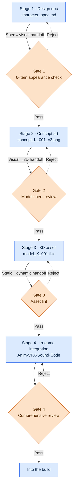
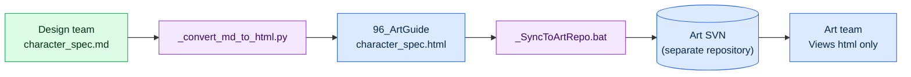

# 12.3 Design Doc → Concept → In-Game Asset Flow

Near the end of a sprint, a concept artist dropped a character draft into the team messenger. "This is the scholar guild senior, right?" The figure on screen was a man in his thirties wearing leather armor. The game design document (GDD) — the design doc, from here on — said a woman in her forties in a gray scholar's gown. When we traced where things had gone off, it turned out the materials the concept artist had received were a two-month-old version of the design doc, and the appearance guide had changed twice in the meantime. The only person who knew it had changed was the designer.

This incident is not a technical problem. It is a flow problem. It takes 4–8 weeks on average for one page of a design doc to become an asset inside the game, and over that span, the information for a single character passes hand to hand — from the designer's head to the concept artist, to the modeler, to the animator. At every handoff the format can drift, and if a drifted handoff gets accepted anyway, the receiver fills the blanks with guesses. Two months later, the guess comes back as one line in the team messenger.

This chapter is about taking that hand-to-hand flow off one person's memory and putting it on a system.

---

## 12.3.1 Hand to Hand — Four Stages and the Handoff Points

On Project A, a character asset travels a four-stage path. What matters is not the stages themselves but the handoff points between them. Incidents do not break out inside a stage; they break out at the moment an asset is handed from one stage to the next.

Rather than explain this flow in prose, it should be drawn as a diagram — and across the 24 parts of this book, instead of drawing boxes by hand, I have asked Claude for mermaid code and rendered it. This chapter applies that very technique to its own body: the technique proving itself in its own text. Below is the unedited render of what Claude returned when I asked for "the spec→asset four-stage flow as mermaid, with the handoff gates visible."



A gate stands at each of the three handoff points (spec→visual, visual→3D, static→dynamic). A gate is the front desk that checks the paperwork's format before passing it to the next department. If the format does not match, the item is rejected (the dotted line) and returns to the previous stage. If a non-conforming document gets accepted anyway, the next department fills the blanks with guesses. The messenger incident is what happens when Gate 1 does not exist.

The advantage of mermaid shows in this drawing. When you need to add one more gate or reorder the stages, you do not redraw boxes — you edit one line of text. Because the diagram is text, it becomes a version-control target and gets committed right alongside the design doc.

---

## 12.3.2 Stage 1 — The Design Doc Is the Root of Every Input

The flow starts from a single markdown spec. This document is the input to all three stages that follow. A blank here does not disappear; it gets pushed downstream and turns into a guess.

Below is the `character_spec` template as actually written. The `related_atoms` field connects this spec to the JIT atom system (see Part 11).

```markdown
---
title: Scholar Guild Senior K_001 Character Spec
type: character_spec
layer: L2
related_atoms: [character_K_001, voice_profile_K_001]
status: draft
---

## 1. Identity
- Name: (TBD)
- Role: scholar guild senior, main NPC, recruitable as a companion
- Faction: scholar_guild
- Personality: 학자_엄격 (strict scholar), authoritative but fair

## 2. Appearance Guide
- Age: 40s
- Gender: female
- Build: slightly taller than average (around 170cm)
- Outfit: gray + purple accents, scholar's gown, glasses

## 3. Expression & Posture
- Default: calm, corners of the mouth turned down
- Anger: silence + cutting off eye contact
- Sorrow: changes the subject, minimal facial change

## 4. In-Game Role
- Appears in main quest chapters 1·5·12
- Issues 8 side quests
- Joins as a companion in chapter 7

## 5. Voice & Lines
- voice_profile: scholar_K_001
- 3 representative lines:
  - "Is that a story with no record behind it?"
  - "Do not decide on emotion. Data comes first."
  - "...So that is your choice. Understood."

## 6. References
- Images of 5 real scholars (legal review done)
- Reference the character tone of refgame
```

The six appearance items (age, gender, build, and outfit in section 2, plus expression and posture in section 3) become Gate 1's checklist. The two lines that caused the messenger incident — "woman in her forties / gray gown" — are exactly this section. Had Gate 1 been working, the six appearance items in the concept artist's materials would have been checked against the current design doc before the handoff.

### Worked Transcript — One Round Trip to Fill the Blanks in the Design Doc

Instead of filling the whole spec by hand from zero, I lock down only the identity and role, and have Claude draft the appearance and expression sections. Below is one actual round trip, in full. Nothing is summarized.

**Prompt (in full):**

> The identity and role of the character below are final. Based on them, draft the "2. Appearance Guide" and "3. Expression & Posture" sections of the character_spec.
> - Role: scholar guild senior, main NPC, recruitable as a companion
> - Personality: 학자_엄격 (strict scholar), authoritative but fair
> - Faction: scholar_guild
> Constraints: refgame tone (Eastern fantasy, low saturation). The appearance must be distinguishable from the other main NPCs by silhouette alone. Expressions must be restrained — anger and sorrow are never shown directly.

**Claude's raw output (verbatim, untouched):**

> ## 2. Appearance Guide
> - Age: late 40s
> - Gender: female
> - Build: slim, around 165cm (※ needs a decision — express "authoritative" through height or through posture? I recommend posture)
> - Outfit: dark navy scholar's robes, silver-thread embroidery (※ I don't know the faction color palette. Does scholar_guild have a designated color?)
>
> ## 3. Expression & Posture
> - Default: upright stance with the chin slightly raised, gaze aimed slightly above the other person
> - Anger: speaks less; only the tone turns cold
> - Sorrow: replaced by turning to look out a window; the face barely changes
>
> One more thing: if she "can join as a companion," you will also need combat expressions — is that outside the scope of this spec?

**Human verification and veto:**

I accepted half of this output. The Expression & Posture section went in almost as-is — it caught the "restrained" constraint exactly, and "sorrow replaced by turning to look out a window" is a good detail the design doc did not have. The appearance I rejected, for two reasons. First, it set the build to "slim, 165cm," while the finalized design doc said "slightly taller than average, 170cm." Claude had been given only the identity and role, so it could not know the build — it guessed. That is precisely the guess a gate exists to block. Second, the navy outfit fits the refgame tone but clashes with our game's scholar_guild colors (gray + purple). The question Claude raised ("Does the faction have a designated color?") had pointed at exactly this clash in advance.

**Re-request:**

> Good. Expression & posture: accepted. Redo the appearance with these values fixed: build = slightly taller than average, 170cm; outfit = gray scholar's gown + purple accents (the scholar_guild colors); wears glasses. Combat expressions are out of scope for this spec — drop them.

What this single round trip teaches is that the spot where Claude filled a blank with a guess was exactly a blank in the design doc. When Claude hit a value it did not know, it split two ways. For the faction color and the combat expressions, it raised them as questions — "I don't know this" — and those questions flagged the omissions before the gate checklist did. For the build, it papered over the unknown with a plausible number and no marker. As long as the latter exists, the human pass that checks line by line against the finalized design doc cannot be skipped.

---

## 12.3.3 Stage 2 — Concept Art, and Gate 1

The finalized design doc moves to the concept artist. The flow is the same concept workflow as §12.1.2: mass-produce dozens to hundreds of images with AI, curate down to a handful, hand-polish one to three candidates, then build the model sheet (front, side, back).

What matters is Gate 1, standing at the end of this stage. Before the model sheet moves on to stage 3 (3D), the following five items are checked.

| Item | Pass criterion |
|---|---|
| Matches the design doc's six appearance items | Outfit, build, age, gender, expression, posture match the current design doc |
| Silhouette distinction among main NPCs | Identifiable from other characters by silhouette alone |
| Complies with ArtGuide `01_Character/_STYLE_GUIDE` | No violations of the domain style guide |
| No contradiction with voice_profile | The visual impression does not clash with the vocal impression |
| Legibility at reduced size | Still recognizable when shrunk to UI or minimap size |

This is where the `image_prompt_design_intent_first` atom does its work. When the concept artist writes a prompt, they do not lead with appearance words like "gray-gowned female scholar"; they lead with the design intent from the design doc ("authoritative but fair," "a scholar who keeps emotion in check"). Mass-produce hundreds of images from appearance keywords alone and you get a pile where the gown color is right but the eyes are not a scholar's — putting intent first is how you shrink that "appearance right, impression wrong" pile in advance. The production tools are the same as §12.1.1 and §12.2.5 — self-hosted SD (SDXL)/ComfyUI with a character LoRA (locking face and outfit) plus ControlNet (locking pose and silhouette), so the face does not fall apart even across hundreds of shots of the same character in different poses.

Gate 1's first item, "matches the design doc's six appearance items," is the direct latch against the messenger incident. Because the concept draft is checked against the current design doc before it hardens into a model sheet, a drift introduced by working from a two-month-old version gets caught right here.

---

## 12.3.4 Working with Non-Designers — md for the Design Team Only, html for the Art Team Only

One operational asymmetry needs pointing out here. Every spec we have seen so far is markdown, but concept artists and 3D modelers did not join a game studio to read markdown. So Project A applies the one-way conversion pipeline from §12.2.4 ("the design team decides in md; the art team sees only html") to the spec→asset flow as well. The md decisions made by the design team are converted to html and pushed into a separate art SVN, and the art team reads only the html — their md learning cost is zero.



`_convert_md_to_html.py` turns the md into readable html, and `_SyncToArtRepo.bat` pushes the result to the art SVN, not the design SVN. The reason for keeping two repositories is the same as the PC separation principle — protecting one side's workflow from being overwritten by the other. Conversion always runs one way, design → art, and even if the art team touches the html, nothing flows back into the design md.

The destination of that conversion, `96_ArtGuide`, is divided into 7 domains (`00_Common`, `01_Character` through `07_Env`). Each domain governs itself with its own `_STYLE_GUIDE`, while `00_Common` binds the conventions shared across all domains (saturation range, naming, resolution) — the structural diagram is in §12.2.1. Gate 1's third checklist item is exactly compliance with this `01_Character/_STYLE_GUIDE`.

---

## 12.3.5 Stage 3 — 3D Assets and Automated Lint

Once the model sheet moves into the 3D stage, it goes through 8 processes: high-poly modeling → retopology (game-ready low-poly) → UV unwrap → texturing → rigging and skinning → test poses → review. This is the stage where AI is weakest. 3D generative models cannot yet deliver game-quality retopology and UVs, so people and traditional tools play the lead.

Instead, this stage gets Gate 3 — automated asset lint. No one counts polygons by hand each time; the asset is checked automatically the moment it is committed.

| Check | Pass condition |
|---|---|
| Polygon count | Standard range per character (my operating baseline: 40,000–80,000) |
| Texture resolution | 2048×2048 standard |
| UV unwrap efficiency | 80% or more of the area utilized |
| Bone count | Conforms to the standard bone set |
| Asset naming | Follows the Part 11 naming convention |

When a violation is caught, the responsible 3D artist gets a notification. A check that used to depend on a sharp human eye has been moved into determinism. Items like polygon count and resolution have unambiguous right answers, so they belong neither to AI nor to humans but to a lint script.

One irreversible step appears here: the render process that bakes textures. A texture, once baked, cannot be unbaked, so Gate 3 runs once more right before the render. Stage 4's motion capture is likewise irreversible — a capture session cannot be redone short of calling back the actors and the equipment. Gates in front of irreversible steps are run more strictly than the others.

---

## 12.3.6 Stage 4 — In-Game Integration and the Comprehensive Review

Animation, VFX, sound, and code merge into the 3D asset, and the character appears inside the game for the first time. This is the stage where every discipline converges, and Gate 4 (the comprehensive review) is the final latch.

| Review item | Owner |
|---|---|
| Matches the design doc's intent | Designer |
| Visual tone and consistency | Art director |
| Animation naturalness | Animation director |
| In-game legibility | Game director |
| Performance (frame cost) | Tech art |

Five people spend 30 minutes to an hour per character. The lint at this stage is run automatically by the asset–resource mapping (`Skill_Art_Resource_Mapping`), checking that the resources actually wired in-game match the resources the design doc points to. In the integration stage, AI's role is confined to visual regression testing and lint automation — not deciding what to show, but the deterministic work of comparing yesterday's frame against today's, pixel by pixel, for unintended differences.

---

## 12.3.7 When a Change Touches One Stage, Everything Downstream Shakes

The messenger incident that opened this chapter was actually two incidents stacked on top of each other. One was the absence of Gate 1 (mismatched materials passed through); the other was the absence of change tracking (the appearance guide changed twice and the fact never propagated downstream). What blocks the second incident is change impact tracking.

When the materials for any stage of a character change, every artifact downstream is affected. Compute this by hand every time and you will, without fail, miss something. So we keep a tool that looks at the position in the chain and scrapes out the downstream artifacts automatically.

```python
# spec_change_impact.py
# When any point in the chain changes, collect every downstream asset.

CHAIN = ["spec", "concept", "model", "texture", "rig", "anim", "vfx", "ingame"]

def find_downstream_artifacts(spec_id, changed_field):
    artifacts = []
    chain_position = get_chain_position(changed_field)   # e.g.: "외형.의상" → "spec"(0)
    for stage in CHAIN[chain_position + 1:]:              # everything downstream of spec
        artifacts.extend(get_artifacts(spec_id, stage))
    return artifacts

# Usage: what if K_001's outfit changes?
changed = find_downstream_artifacts("K_001", "외형.의상")
# → ["concept_K_001_v3.png", "model_K_001.fbx",
#     "texture_K_001_diffuse.png", "rig_K_001.fbx", ...]
```

If `changed_field` is `"외형.의상"` (appearance.outfit), the chain position is 0 (spec), and everything downstream — concept, model, texture, rig — lands on the impact list. That list goes out to the owners as automatic notifications. In the desk approval-tray metaphor: the moment tray 1 is edited, red flags pop up on trays 2 through 8, and every flagged tray goes back into the review queue. The messenger incident happened precisely because this flag did not exist — tray 1 (the design doc's appearance section) changed twice, and no flag was planted on tray 2 (the concept).

---

## 12.3.8 Measurement — The Effect of Four-Stage Standardization

Below is the before/after comparison of standardization on Project A, which I ran. The absolute times and counts are the author's estimate (unverified); what you can trust is the direction and the rough ratios.

| Item | Before standardization | After standardization | Direction |
|---|---|---|---|
| One character (design doc → in-game) | 8–12 weeks | 4–6 weeks | Roughly halved |
| Guess-driven incidents between stages | 10–15 per quarter | 2–3 per quarter | Sharp drop |
| Missed-change incidents | 8–10 per quarter | 1–2 per quarter | Sharp drop |
| Comprehensive review time (per character) | Scattered, repeated (4–6 hours total) | A focused 30 minutes–1 hour | Concentrated |
| Onboarding a new character designer | About 2 months | About 1 month | Roughly halved |

The character cycle dropped to roughly half. But do not misread this number. Standardization is not a conveyor that stamps out every character at the same speed. Main characters still get close to 8 weeks; bit parts finish in 4. What standardization did was not make the speed uniform — it made the per-stage time differentials hold steady without wobble. When a standard drifts into control, it comes back as an incident that cuts into the artists' creative time — the purpose of standardization is to eliminate guesses and omissions, not to compress time.

---

## 12.3.9 Where AI Belongs at Each Stage

| Stage | AI's role | Strength |
|---|---|---|
| 1. Design doc | Draft assistance, asking about omissions (designer reviews) | Strong |
| 2. Concept | Stable Diffusion (SDXL)/ComfyUI mass production (LoRA, ControlNet), LLM prompts | Strong |
| 3. 3D | Generative models immature; people and traditional tools lead | Weak |
| 4. Integration | Visual regression and lint automation | Deterministic |

AI is strong in stages 1 and 2, people carry stage 3, and deterministic tools own stage 4. Once this split settles in, responsibility at each stage becomes clear — where the AI's draft ends and where the human's decision begins, with no confusion at the gate.

---

## 12.3.10 Common Failures and Their Fixes

| Pattern | Fix |
|---|---|
| The design doc omits the six appearance/expression items | Make it a mandatory stage-1 check; have the AI ask about omissions |
| Skipping the concept-stage gate | Force the six-item appearance check before the model sheet hardens |
| Computing change impact by hand | Automate tracking with spec_change_impact |
| Saving the comprehensive review for one big pass at the end | Distribute gates across the stages |
| Building without asset lint | Auto-block at Gate 3 |
| Forcing every character into 4 weeks | Keep the per-stage time differentials |

The first and third rows are the direct fixes for the messenger incident that opened this chapter.

---

### Key Takeaways
- Incidents do not break out inside stages but at the handoff points between them — gates hold those points.
- A blank in the design doc does not disappear; it gets pushed downstream and becomes a guess.
- Automated change impact tracking is the single biggest guardrail against missed-change incidents.

### Next Chapter Preview
- 13.1 FAQ and Metagame Analysis — Where Data and KPIs Begin

---

## Try It Yourself — A Minimal spec→asset Flow

**setup**
1. Create one `character_spec.md` template (six sections — identity, the six appearance items, expression, role, voice, references — with a `related_atoms` field).
2. Set up an md→html conversion script (something like `_convert_md_to_html.py`) and share only the html with the art team.
3. Attach a gate checklist to each of the 4 handoff points (six appearance items / model sheet / asset lint / comprehensive review).

**prompt**
> The identity and role in the character_spec below are final. Draft the "Appearance Guide" and "Expression & Posture" sections, but do not guess unknown values — mark them as questions. Constraints: refgame tone, distinguishable by silhouette alone, restrained expressions.

**verify**
1. Check every value the AI guessed (especially build and colors) line by line against the finalized design doc — if anything is off, reject and re-request with the values fixed.
2. Pass all five items of the Gate 1 checklist before handing off to the model sheet.
3. Deliberately change one appearance line and confirm that `spec_change_impact` spits out the exact downstream asset list.

### Solo Scale-Down
If you work alone, the conversion pipeline, the art SVN, and the five-person review are overkill. Keep just two things. (1) One `character_spec.md` template — the six appearance items mandatory, blanks forbidden. (2) Every time you change the appearance, write one line at the bottom of the spec, by hand, listing the downstream files the change touches. Even without tooling, that one line blocks missed-change incidents.
