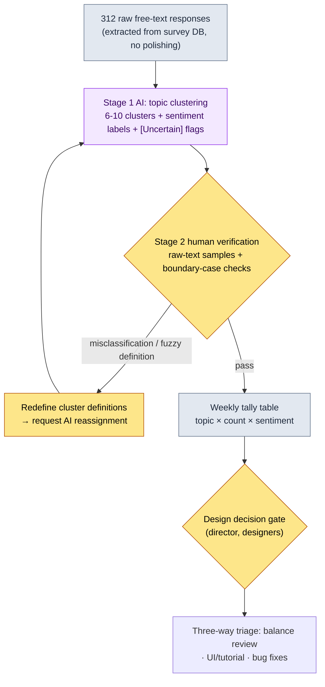
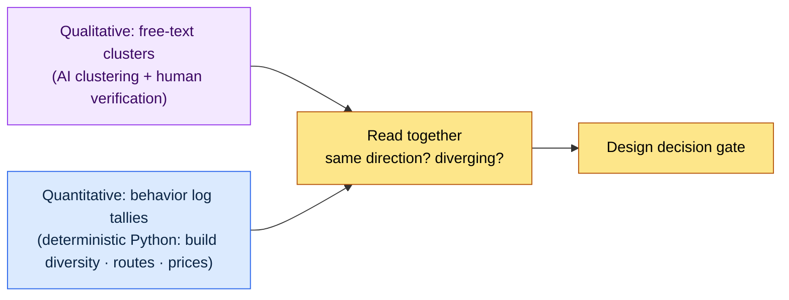

# 13.1 Hundreds of Free-Text Responses into Topics — AI Does the Clustering, People Do the Diagnosis

> Primary audience: MMORPG designers who need to read user feedback and the metagame (mid-size teams of 10–50)
> Scaled-down version for solo/hobbyist readers: §13.1.8 "If You're on Your Own, Just This Much"

The morning after we shipped an update, I remember the screen showing 312 entries piled up in the free-text field of our in-game survey. They ranged from one-line fragments to five-line rants. Nobody on the design team read all 312. To be precise, nobody could. Whoever skimmed them walked into the meeting with an impression like "seems like a lot of people say enhancement is brutal" — and that impression was an illusion created by the five loudest entries. What the 312 responses actually said, nobody knew.

This chapter covers how to be able to say "what, and how many" without a person reading all 312. The core is twofold. First, hand the tedious classification — **grouping hundreds of free-text responses into topics and labeling sentiment** — to AI. Second, do not take AI's clusters at face value: a person **catches one misclassification, rejects it, and re-requests**. The general theory of FAQ and metagame analysis is in other books; this chapter focuses only on *running that analysis as an AI workflow*.

---

## 13.1.1 Free-Text Responses Are Something You Classify, Not Something You Read

FAQs and free-text responses are a mirror showing the gap between the game the designer intended and the game users actually experience. If the same question hits the information desk 30 times a day, you don't hire more staff — you redesign the signage. The problem is counting that "30 times." Free-text responses are not structured logs, so `GROUP BY` doesn't work on them. "Enhancement is too expensive" and "I can't progress because I can't earn enough currency" are the same topic but different strings. Grouping them by eye takes two or three hours for 312 entries, and the grouping criteria wobble from person to person.

This is where AI belongs. Free-text classification is (1) high-volume, (2) tedious, and (3) requires natural-language semantic judgment — that is, deterministic code can't do it, and having a person do it is expensive. But one thing must be nailed down before launch: **what AI produces is a topic cluster (a hypothesis), not a confirmed diagnosis.** "38% enhancement complaints" is just a result of AI attaching labels; it must not flow directly into a decision like "nerf enhancement." The principle that runs through all of Part 13 applies unchanged here — KPI definitions and final diagnosis belong to people; natural-language grouping and first-pass labeling belong to AI.

The real value of automation also lives at this point. When classification is automated, the key gain is not that the analysis itself gets faster — it's that **the 312-entry signal arrives on your desk every week, already classified**. The value of automation is signal exposure, not time savings (team-ops concept `automation_signal_value_over_time_savings`). It's the difference between letters piling up in a mailbox and mail sorted and delivered to the right department every day.

---

## 13.1.2 [Worked Transcript] 312 Free-Text Responses → Topic Clusters

Here is one full cycle of how this actually runs. Below is a faithful reproduction of a session clustering in-game survey free-text responses from my project (a mobile-first MMORPG, hereafter "Project A"). The input prompts can be copied as is; the outputs are reconstructed from the actual session.

### Step 1 — Input: Throw In the Free Text As Is (No Processing)

First, extract the raw free-text responses in a machine-readable form. This just means pulling from the survey DB — you're not writing anything new. What matters is putting them in **raw, with typos, profanity, and one-word answers intact — no polishing, no summarizing**. Classification accuracy goes up the rawer the source text is.

```jsonl
# survey_freetext_2026-W21.jsonl (excerpt, 6 of 312 entries)
{"id": 0041, "text": "enhancement costs are insane -_- can't gather the currency to get to +10"}
{"id": 0088, "text": "boss patterns are fun but the rewards are way too stingy"}
{"id": 0102, "text": "guild war matchmaking takes forever, waited over 5 min"}
{"id": 0156, "text": "can't enhance without paying, you call this a game"}
{"id": 0203, "text": "new dungeon atmosphere is great, music too"}
{"id": 0274, "text": "why didn't the reward come in the mail? seems like a bug"}
```

### Step 2 — Prompt: Ask for Clusters, but Force Categories, Evidence, and Uncertainty Reporting

```
Take the attached survey_freetext_2026-W21.jsonl (312 free-text survey responses), group them
into 6-10 topics, and label each response negative/neutral/positive. Don't split too finely;
each response goes in exactly one cluster. If it doesn't fit, put it in Other. For each cluster,
output a table with count, share, dominant sentiment, and one representative quote. If you're not
confident about an assignment, don't force it — pull it into an [Uncertain] list with a one-line
reason each. No commentary: just (a) cluster definitions (b) the tally table (c) the [Uncertain] list.
```

In this prompt, only the first two lines actually ask for classification; everything else is a constraint that boxes in the shape of the output. Give AI free rein and it will splinter the clusters into 20, or force every response into a bucket somewhere. What prevents that is **the four guardrails: a cluster-count cap (6–10), single assignment, three-way sentiment, and the escape hatch — "if you're not confident, pull it into [Uncertain]."** Classification accuracy comes from this fence.

### Step 3 — Claude's Output (Reconstructed, Excerpt)

```
(a) Cluster definitions
C1 Enhancement/progression cost — complaints that enhancement and currency acquisition are excessive
C2 Spending pressure            — perception that non-paying/light-spending players are shut out of progression
C3 Content reward shortage      — feedback that rewards for bosses, dungeons, etc. are stingy relative to play
C4 Matchmaking/wait time        — complaints that guild war and matchmaking queues run long
C5 Content praise               — positive reactions to the new dungeon, presentation, music, etc.
C6 Bugs/missing rewards         — reports of undelivered rewards and errors
Other                           — one-offs that fit none of the six above

(b) Tally table
| Cluster | Count | Share | Dominant sentiment | Representative quote                       |
|----------|------|------|----------|--------------------------------------------|
| C1 Enhancement cost | 71 | 23%  | Negative     | "enhancement costs are insane -_- can't gather the currency to get to +10" |
| C2 Spending pressure | 58 | 19%  | Negative     | "can't enhance without paying, you call this a game"        |
| C3 Reward shortage | 49 | 16%  | Negative     | "boss patterns are fun but the rewards are way too stingy"        |
| C4 Matchmaking wait | 34 | 11%  | Negative     | "guild war matchmaking takes forever, waited over 5 min"      |
| C5 Content praise| 41 | 13%  | Positive     | "new dungeon atmosphere is great, music too"          |
| C6 Bugs/rewards | 28 | 9%   | Negative     | "why didn't the reward come in the mail? seems like a bug"                |
| Other       | 31 | 10%  | Mixed     | (many one-offs)                                 |

(c) [Uncertain] list (4 entries)
- id 0088 "boss patterns are fun but the rewards are way too stingy"
  → Assigned to C3 (reward shortage), but the first half also overlaps C5 (praise). Compound response.
- id 0156 "can't enhance without paying" → On the C1/C2 boundary. Sent to C2.
- (2 more)
```

The most valuable part of this output is not the tally table but **the [Uncertain] list at the bottom**. That is where the AI reports the uncertainty of its own assignments and hands them over to a person. A good prompt makes it possible for the AI to say "I'm not confident about this one."

### Step 4 — Verification and Rejection (the Human's Seat)

This output must not go into a report as is. A person spot-checks the raw text directly. In this actual session, one entry got caught.

While unfolding the 58 entries in C2 (spending pressure) and skimming the raw text, `id 0156 "can't enhance without paying, you call this a game"` caught my eye. The AI had sent it to C2 (spending pressure). But the primary pain in this sentence is not "paying" — it's **"can't enhance"**, which is C1 (enhancement cost). The user hit the enhancement wall and named spending as the cause of that wall; spending itself is not the core of the complaint. Yes, C1 and C2 are adjacent and easy to confuse — but if this counts toward C2, the "enhancement cost" signal looks smaller than 23%, and the enhancement curve that actually needs attention slips down the priority list. It's a boundary case where one misclassification can change the direction of a decision.

So I reject and re-request.

```
The C1 (enhancement cost) / C2 (spending pressure) boundary is getting blurry. Redraw it:
if the primary pain is the progression wall itself, it's C1; if it's the fairness complaint
of being shut out unless you pay, it's C2. id 0156 is C1 — "can't enhance" is the core.
Reassign the boundary cases by this rule and report only the counts that changed.
```

The AI redrew the boundary and moved 9 entries from C2 to C1. As a result, C1 went from 71 to 80 entries (26%) and C2 from 58 to 49 (16%). **The picture — enhancement cost as the single largest topic — stayed the same, but its size sharpened from 23% to 26%.** One round trip brings the signal's outline into focus. The reassignment count (9 entries) and the share change are values actually counted in this session (sample of 312, single week).

One thing to make clear here: the person did not reject "because the AI was wrong." The C2 assignment was defensible as an interpretation. What the person did was **sharpen the cluster definition (= the KPI definition) and feed it back to the AI**. The definition is the person's; the labor of re-combing 312 entries with that definition is the AI's.

---

## 13.1.3 The Pipeline — From Free-Text Responses to the Decision Gate

Run the session above automatically every week and it becomes a pipeline. Human hands touch only two places: setting sharp cluster definitions (front) and the gate connecting classification results to decisions (back). The grouping and labeling of 312 entries in between is the AI's run.



The decisive design choice is that Stage 2 (human verification) does not auto-pass AI output. Make it auto-pass, and a boundary the AI drew wrong once will distort the signal in the same direction every week. The AI surfaces the suspect candidates (the [Uncertain] list), but whether to revise the cluster definitions is decided by a person. And the tally table is not a decision in itself — it is only **input to the decision gate**. "C1 enhancement cost 26%" is a signal that makes the director look into the enhancement curve, not an automatic nerf trigger.

---

## 13.1.4 The Metagame — Reading Free-Text Responses Against Behavior Logs

If free-text responses are "what users said," the metagame is "what users actually did." After launch, play patterns the designer never intended take root — that is the metagame. Things like the build meta (convergence on specific skill combinations), the routing meta (preferred farming routes), and the trading meta (user-agreed prices that diverge from official rates). Unlike free-text responses, these are **measured quantitatively from behavior logs**, and deterministic code (Python) does the tallying. This is not a place for AI.

The key is to **read the two together**. In the session above, C1 (enhancement cost) complaints were the largest at 26%. If, in the same week, the behavior logs show the build diversity index (concentration of top skill combinations) dropping, then two signals point the same way: "in words and in behavior, players are converging on one build and one progression path." When quantitative and qualitative agree, the decision gains conviction. Conversely, if the free-text responses are quiet but the behavior logs show convergence on a single build, that may be a danger signal of users feeling friction without saying so (= just before quiet churn).



Here too the division of labor is clean. Behavior log tallying is done by **code, not AI**. Build share and trade prices are deterministic figures whose answers must not vary from call to call. AI is used only for grouping the unstructured text of free-text responses; quantitative KPIs are nailed down by code.

---

## 13.1.5 Where the Numbers in This Chapter Come From

The percentages in this chapter follow the principle of "One Promise" in the preface. The "C1 23%→26%, 9 reassigned" in §13.1.2 are values actually counted on a sample of 312 (a single week), so they should be read not as absolutes but as a *direction*: "enhancement cost is the single largest topic." No causal claims are made — there is no table like "we did FAQ analysis and retention went up." What this workflow can actually measure is three things: the number of misclassifications a person overturned in cluster verification (zero is a signal the verification was perfunctory), the time it took to produce the weekly tally, and whether the quantitative and qualitative signals agree.

---

## 13.1.6 Rejection and Re-Request Are Not Tool Failure — They Are the Gate's Signal

In §13.1.2, a person overturned 9 entries assigned to C2. Run verification weekly and you get zero-to-a-few such overturns every time. What matters is that **zero overturns is not the goal**. If verification overturns nothing, one of two things happened — the AI was perfect (rare), or the verifier stamped approval without looking at the raw text. The latter is overwhelmingly more common.

The verification gate is actually working when one or two boundary cases get caught each week and the cluster definitions sharpen a little because of them. This is the concrete form of the general principle that a person must periodically sample-check AI classification accuracy. The misclassification that scatters the same user type across different topics accumulates week after week if you trust automated classification without review.

---

## 13.1.7 Common Failures

| Pattern | Why it fails | Remedy |
|---|---|---|
| Only skimming free-text responses by eye | Illusion of the 5 loudest entries representing all 312 | Full classification via AI clustering (§13.1.2) |
| Delegating wholesale: "AI, analyze the user feedback" | Clusters splinter into 20, or forced assignments | Cluster-count cap, single assignment, mandatory [Uncertain] |
| Reporting the AI tally table without verification | A boundary misclassification changes the decision's direction | Check raw-text samples and boundary cases directly |
| Wiring tally shares straight into decisions | Auto-triggering "26% complaints, so nerf" | The tally table is only input to the decision gate |
| Reading only qualitative, ignoring behavior logs | Missing the quiet churn that never speaks | Read quantitative (code) and qualitative (AI) together (§13.1.4) |
| Having AI tally quantitative KPIs | Figures shift per call, destabilizing balance | Build and price tallies belong to deterministic code |

The third is the one most often missed. The tally table looks clean, so you want to trust it as is. But like the single entry id 0156, one misclassification at a boundary can flip the entire priority order. Verification is not re-reading all 312 entries — it is checking **only the boundary cases of the two or three largest clusters** against the raw text.

---

## 13.1.8 Try It Yourself — One Step You Can Take Today

> **If you're on your own, just this much**: You don't need a survey DB. Collect just 30–50 store reviews or community posts for your game (or a game you love) as text, paste in the prompt from §13.1.2 verbatim, and run it once. Pick one assignment among the resulting clusters that makes you go "this looks off," and push back: "this response's primary pain is a different topic — redefine and reassign." You will feel in your hands what bundle of judgments clustering really is.

If you're on a team, start with this one step. Extract one week of free-text responses as `survey_freetext_YYYY-Www.jsonl` with no polishing, and run it once through the prompt in §13.1.2. Then check only the boundary cases of the two largest clusters against the raw text. Sharpen the cluster definitions once, and from then on the same prompt accumulates a reproducible weekly tally automatically.

---

### Key Takeaways
- Free-text responses are not material to read but material to classify exhaustively with AI.
- Cluster definitions (= KPI definitions) belong to people; grouping the 312 entries belongs to AI.
- Zero overturns in verification is a signal that someone just stamped approval.

### Next Chapter Preview
- 13.2 KPI Definition and Tracking — a diagnostic sheet trimmed to 5–7 indicators, and measurement traps
