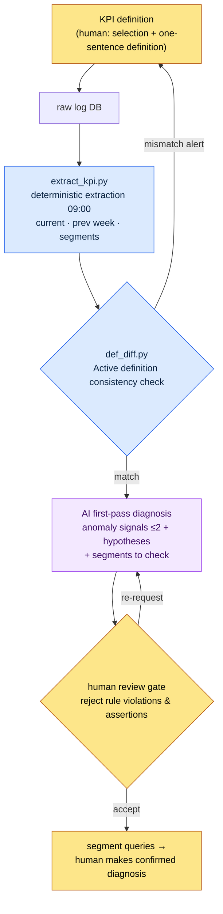

# 13.2 KPI Definition and Tracking — Humans Define, AI Diagnoses Anomaly Signals

> Primary audience: live ops/data designers responsible for operational metrics, on a mid-sized (10–50 person) team
> Scaled-down version for solo/hobbyist readers: §13.2.8 "If you're solo, just this much"

The same scene repeated every Monday morning. The data team's daily dashboard capture went up on the meeting screen, someone said, "DAU (daily active users) looks a bit down," and someone else answered, "That's because of last week's maintenance." The numbers were right there, but the mental work of judging whether a number was **an anomaly signal or noise** started over from scratch every week. And the verdict differed depending on who was talking.

Let me state this chapter's conclusion up front. In KPI work, humans have exactly two jobs: **defining what to adopt as KPIs**, and **deciding whether to promote an anomaly signal the AI raised to a confirmed diagnosis or reject it**. The two tasks wedged in between — pulling numbers out of the raw logs at the same time every day, and drafting in natural language what moved against the previous week — go to deterministic code and to AI, respectively. The general theory of KPI definition (cut the list to 5–7, watch out for Goodhart's law) is well covered in other books, so this chapter focuses only on *the place where those definitions run through an AI workflow*.

---

## 13.2.1 KPI Definition Is the Human's Job — What Comes After Is Not

There are two judgment calls in KPI operations that only a human can make. First, **what to adopt as KPIs**. Second, **nailing each KPI's definition down to a single sentence**. Both are value judgments about the game and cannot be delegated to AI. The decision "we count Active as 5+ minutes of play" carries inside it what the game considers healthy.

The problem is that once a definition wobbles, every number built on top of it wobbles with it. If one query counts "Active User" as *one login* and another as *10 minutes plus one hunt*, DAU diverges wholesale. That is why protecting **the consistency of the definition** matters more than the definition itself — it is half of operations. And consistency checking is a job for code, not for a human head (§13.2.5).

What happens after the definitions are nailed down is not the human's seat. The daily extraction that pulls numbers at the same time every day, and the first-pass write-up that scans week-over-week movements for anomaly candidates — both repeat daily, and when humans do them the standard drifts from day to day. They are exactly the kind of work to hand down to machines and models. Extraction goes to determinism (code); the first-pass diagnosis goes to AI. The human only takes the candidates the AI raises and decides **confirm or reject**.

| Step | Who | Why There |
|---|---|---|
| KPI selection and definition | Human | Value judgment about the game; cannot be delegated |
| Daily raw extraction | Code (deterministic) | Same input → same number; regression-verifiable |
| First-pass anomaly write-up vs. previous week | AI | Natural-language summarization suits AI — but only up to "hypothesis" |
| Confirmed diagnosis; ordering segment checks | Human | Promotes/rejects AI hypotheses; the seat of accountability |

This division of labor is the skeleton of this entire chapter. Below, I run one cycle all the way through.

---

## 13.2.2 [Worked Transcript] Daily Dashboard Raw → Automated Anomaly Write-Up

To show how this actually runs, here is one full cycle from input to human verdict. The following reconstructs, in anonymized form, a daily KPI diagnosis session from my project (a mobile-first MMORPG, hereafter "Project A"). The raw log schema, the extraction code structure, and the prompt are carried over from the real tools; the numbers are placeholder values to show the format, not measured KPIs.

### Step 1 — Input: Raw Numbers from the Deterministic Extractor

First, code pulls the KPIs from the log DB at 09:00 every day. The AI does not produce these numbers — it only receives them. The extraction output is a JSON that lines the day up against the same weekday of the previous week.

```json
// kpi_daily_2026-06-05.json — produced by extract_kpi.py (LLM input)
{
  "date": "2026-06-05",
  "compare_to": "2026-05-29",   // same weekday of previous week (Fri)
  "active_def": "min10_hunt1", // Active definition ID in effect
  "L0": {
    "ltv_12m_est":   {"v": 0,    "prev": 0,    "delta_pct": null},
    "d30_retention": {"v": 0,    "prev": 0,    "delta_pct": null}
  },
  "L1": {
    "dau":            {"v": 0, "prev": 0, "delta_pct": -0.0},
    "session_len_min":{"v": 0, "prev": 0, "delta_pct": -0.0},
    "sessions_per_u": {"v": 0, "prev": 0, "delta_pct": 0.0},
    "d7_retention":   {"v": 0, "prev": 0, "delta_pct": 0.0}
  },
  "segments": {
    "dau_by_platform": {"ios": 0, "aos": 0},
    "dau_by_region":   {"kr": 0, "sea": 0},
    "dau_by_newbie":   {"d0_7": 0, "d8plus": 0}
  }
}
```

The values are left zeroed out. The structure is what matters. Each KPI carries a current value, a previous-week value, and a delta percentage, and at the very bottom rides the **segment breakdown** (platform, region, new vs. existing). For the AI to get past "DAU dropped" to "check which segment it dropped in," this breakdown has to be in the input.

### Step 2 — The Prompt: Enforce Format, Evidence, and "No Confirmed Diagnoses"

```
The attached kpi_daily_2026-06-05.json is the daily KPI auto-extracted at 09:00, and
compare_to is the same weekday of the previous week. From L0~L1, pick at most 2 that
qualify as anomaly signals — ones whose week-over-week change falls outside the usual
weekday variance. If you don't know the usual variance, don't make it up; write "unknown"
and drop it. For each candidate give the metric, the change, 1~2 hypotheses for the cause,
and the segments to check — but write causes strictly as hypotheses, never as confirmed
facts. No asserting events or patches that aren't in the logs. Point only to segments
inside the attached segments object. If zero candidates, output only "0 candidates,
nothing notable."
Output 5 lines per candidate (metric/change/hypothesis/segments to check/confidence
high-mid-low), no prose.
```

What characterizes this prompt is that the five rule lines are almost all prohibitions. Given freedom, AI dresses a KPI diagnosis up into a plausible confirmed narrative ("DAU fell because the attendance event ended" — asserting an event that is nowhere in the logs). So I hammer in **no confirmed diagnoses, hypotheses only, segments only from the input, say "unknown" when you don't know** — drawing the line the AI must not cross before it starts.

### Step 3 — Claude's Output (Raw, Excerpt)

Below is a reconstruction of what the LLM actually produced. I have not summarized or polished it; the spot where the third item quietly breaks a rule is left in as is.

```
[Anomaly signal candidates — 2]

Candidate 1
- Metric: session_len_min (average session length)
- Change: down vs. previous Friday (delta_pct negative). Largest negative change in L1.
- Hypotheses: (a) new-user (d0_7) sessions may be shorter, dragging the average down
        (b) sessions may be ending early on a specific iOS build
- Segments to check: session length split by dau_by_newbie (d0_7 vs d8plus),
                dau_by_platform (ios vs aos)
- Confidence: mid

Candidate 2
- Metric: d7_retention
- Change: slight rise vs. previous week (positive), but small in absolute terms.
- Hypothesis: possibly noise. No data on usual weekday variance, so cannot determine
  whether this is anomalous.
- Segment to check: dau_by_newbie (d0_7) cohort retention
- Confidence: low

[Note] The recent end of the attendance event appears to be the cause of the session
length drop.
```

The first two candidates followed the rules. Hypotheses were written as hypotheses, segments were pointed to inside the input, and candidate 2 lowered its own confidence to "low," saying it "cannot determine without usual variance data." This is what good output looks like — the AI reported its own limits.

The problem is the single `[Note]` line at the bottom. It **asserts "the end of the attendance event" — which is nowhere in the logs — as the cause.** That is a violation of rule 3. It gets caught in the next step.

### Step 4 — Verification and Rejection (the Human's Seat)

Three calls to make.

First, **the rule violation.** The `[Note]` line asserted an event absent from the input JSON as if it were fact. The event calendar was not part of this input, so this is information the AI could not have known. This line is **rejected**.

Second, **candidate 1 is accepted.** The session length drop is real, and the two branches the AI proposed (new-user cohort / iOS build) can actually be checked against the input segments. Accepted — but it is still **an anomaly signal, not a confirmed cause.** The human's job is to run the segment queries and determine which of the two it is.

Third, **candidate 2 is held.** The AI itself said "cannot determine," and the absolute change is small. Until the usual weekday variance (per-weekday standard deviation) is added to the extraction code, it stays filed as noise. That is **homework for the code side** — when the AI reported "I don't know the usual variance," it was in fact pointing at a defect in the input data.

So I send a follow-up request.

```
Delete the [Note] line at the bottom — it asserts an attendance event that isn't in the
input. Keep only candidate 1, and rewrite it as a one-line action: split the session
length drop into a d0_7/d8plus × ios/aos 2x2 and "check which cell dropped the most."
No cause assertions, check actions only.
```

One round trip and it is done. The AI deleted the `[Note]` line and answered again with a single check action: "look at the d0_7 × iOS cell's session length first." That output passed the rules, and the human runs the query — and only if it confirms that the new iOS cohort cell did in fact drop the most — does the **confirmed diagnosis** get issued: "new-user iOS onboarding session drop-off." The diagnosis is made by a human, all the way to the end.

> **The point**: the AI only knows "where to look." "What the cause is" gets confirmed by a human, after splitting the segments and checking. If the prompt does not enforce this boundary, the AI slides into a plausible confirmed narrative every time.

---

## 13.2.3 The KPI Pipeline — At a Glance

Pin the cycle above down as a diagram, and every daily diagnosis from then on travels the same road. You can see at a glance that human hands touch only two places, at either end (definition and confirmation).



The three branches carry different colors. **The blue family (extraction, definition diff) is deterministic**, guaranteeing the same result for the same input. **Only the single AI box in the middle is non-deterministic**, which is why code holds it from both sides. **The confirmed diagnosis at the far end is human.** The spot where the `[Note]` line got caught in §13.2.2 is exactly the "F human review gate."

---

## 13.2.4 The Four Traps of KPI Definition — What Shakes Definitions

Before handing the first-pass diagnosis to AI, there are four traps lurking in the definitions humans must nail down. Miss the traps, and the input JSON of §13.2.2 itself means something different every day.

**Trap 1 — The definition of Active.** Whether "Active User" means *one login*, *5+ minutes*, or *10 minutes plus one hunt* splits DAU by multiples. Fix the definition as an ID (`min10_hunt1`) and ship it inside the input JSON (the `active_def` field in step 1 of §13.2.2). If this ID differs across queries, the diff in §13.2.5 catches it.

**Trap 2 — When retention is measured.** Whether the "7" in "7-day retention" means *exactly the 7th day after signup*, *any day within 7 days*, or *the 8th day* changes the value. This is an area where industry standards wobble, so the only option is to write your own definition down and keep it consistent.

**Trap 3 — Outlier handling.** A small number of highly active users pulls the average up. So L0–L1 are read with the **median** alongside the mean. A shift in the distribution often means more than a shift in the mean. Feed the AI diagnosis prompt averages only, and the AI looks at averages only — and misses the distribution shift.

**Trap 4 — Measurement time.** Morning, afternoon, and late-night readings differ. Operational automation standardizes on **extraction at 09:00 every day, same time** (step 1 of §13.2.2). If the time wobbles, the week-over-week comparison collapses.

What these four traps have in common is that *it is the definition that shakes, not the value*. So the most dangerous incident is not "DAU dropped" but "yesterday's DAU and today's DAU were computed under **different definitions**." Human eyes almost never catch it. Code does.

---

## 13.2.5 Catching Active-Definition Mismatches in Code — def_diff

The quietest KPI incident is two queries computing the same name (`DAU`) under different definitions. If the dashboard query counts DAU by `min10_hunt1` while the marketing report query counts it by `login1`, two people walk into the same meeting holding different DAUs and start doubting each other. This is not something a human can catch by comparing SQL line by line, so the definition is pulled out as metadata and code diffs it.

```python
# def_diff.py — KPI definition consistency check (skeleton)
# Premise: each query declares the Active definition ID it uses, as metadata.
#   e.g., in the dashboard.sql header:  -- @active_def: min10_hunt1

CANON = {                      # canonical definitions (nailed down once by a human)
    "DAU":          "min10_hunt1",
    "d7_retention": "signup_plus7_exact",
}

def parse_active_def(sql_path):
    # read -- @active_def: <id> from the SQL comment header
    for line in open(sql_path, encoding="utf-8"):
        if line.strip().startswith("-- @active_def:"):
            return line.split(":", 1)[1].strip()
    return None  # a missing declaration is an incident too

def diff(query_registry):
    issues = []
    for kpi, sql_path in query_registry.items():
        declared = parse_active_def(sql_path)
        canon = CANON.get(kpi)
        if declared is None:
            issues.append(f"[MISS] {kpi}: no definition declared in {sql_path}")
        elif declared != canon:
            issues.append(
                f"[DIFF] {kpi}: {sql_path} computes with '{declared}' "
                f"but canon is '{canon}'. Same name, different definition — not comparable."
            )
    return issues
```

These 30 lines eliminate the meeting that opens with "why is your DAU different from mine?" When code prints `[DIFF] DAU: marketing_report.sql computes with 'login1' but canon is 'min10_hunt1'`, there is nothing left to debate. Fix the query or change the canon — one or the other. Once definitions are checked by code, you gain the guarantee that the AI diagnosis of §13.2.2 always runs **on top of the same definitions**. An AI diagnosis built on shaky definitions is plausible nonsense.

This check is deterministic, so it goes on CI. It runs automatically on every query commit. It is an area never delegated to AI — definition consistency is comparison, not judgment, and putting a non-deterministic model in the loop increases incidents rather than reducing them.

---

## 13.2.6 The Value of Automation Is Signal Exposure, Not Time Saved

Once this pipeline is in place, the first boast that comes to mind is "diagnosis takes less time now." The real value lies elsewhere. Among my team's operating concepts there is a one-liner named `automation_signal_value_over_time_savings` — **the value of automation lies not in the time saved but in the signals exposed.**

Before KPI automation, a signal like a session length drop was visible only when someone happened to stare at the graph. After automation, "two anomaly signals vs. last week" lands on the desk in natural language at 09:00 every day. What shrank is analysis time; what changed is **how many days it takes to become aware of the signal**. What used to require a lucky glance is now forcibly exposed every day.

So this tool's success is not measured as "diagnosis takes N fewer minutes." It is measured as **time to first awareness of an anomaly signal (signal → recognition)**. If that direction breaks — that is, if the AI summary prints "nothing notable" every day until nobody reads it — the tool has saved time while killing the signal, and within a quarter or two it becomes dead weight.

---

## 13.2.7 Where This Chapter's Numbers Come From

The numbers in this chapter follow the principle of "One Promise" from the preface. The KPI figures that appear (DAU, session length deltas) are all placeholder values to show the format, not measurements — read them as *structure*, not absolute values. KPI definitions (Active, retention) have no single industry-agreed standard, so the conclusion is "write your own definition down" (§13.2.4). Three things actually are measurable: the count of definition mismatches `def_diff` catches (target: 0), the share of AI diagnosis candidates a human rejects, and the time to anomaly-signal recognition. Conversely, I assert no causal claims like "KPI automation lifted retention."

---

## 13.2.8 Try It Yourself — One Step You Can Take Today

> **If you're solo, just this much**: You don't need a log DB. For your own game (or a game you love), pick just 3 KPIs you would check daily and write each definition in one sentence ("Active = started at least one match"). Then jot down yesterday's and today's values by hand — two lines — paste in the prompt from §13.2.2, and have the AI "write anomaly candidates as hypotheses only, confirmed diagnoses forbidden." Find the one line where the AI quietly asserts something and push back — "that fact isn't in the logs, remove it" — and where the human's seat sits in KPI diagnosis will sink in through your hands.

If you're on a team, start with this one step. Pick 5–8 KPIs and first establish the convention of one `-- @active_def: <id>` line in every query's SQL header. Then put the `def_diff.py` skeleton from §13.2.5 (canon dict + header parsing + diff) on CI. The AI diagnosis pipeline comes after that. The definition consistency check alone blocks the quietest incident first — "your DAU and my DAU are different."

---

## 13.2.9 Common Failures

| Pattern | Why It Fails | Remedy |
|---|---|---|
| A dashboard with 30 KPIs laid out | Nobody can find the red, so nobody looks daily | Compress to 5–8 across L0–L1 |
| A different Active definition per query | Same name, different numbers → distrust in meetings | `def_diff.py` CI gate (§13.2.5) |
| Delegating "diagnose the cause" to AI wholesale | Asserts events that aren't in the logs | Hypotheses only; segments only from the input (§13.2.2) |
| Accepting AI diagnoses uncritically | Plausible confirmed narratives leak into decision inputs | Reject assertions at the human review gate |
| Feeding averages only as input | Both AI and humans miss distribution shifts | Include medians and segment breakdowns (§13.2.4) |
| Evaluating automation as "time saved" only | Passes even if the summary prints nothing but "nothing notable" | Measure time to signal recognition (§13.2.6) |

The fourth is the one missed most often. AI summaries are smooth, and you want to take them at face value. Like the `[Note]` line in §13.2.2, one smooth assertion that passes without being rejected becomes a fake cause feeding into next quarter's decisions. The human's seat is not in writing the summary — it is in rejecting the summary's assertions.

---

### Key Takeaways
- KPI definition and confirmed diagnosis belong to humans; extraction and first-pass diagnosis belong to code and AI.
- AI diagnosis goes only as far as "hypothesis" — reject any cause assertion that isn't in the logs.
- Same name, different definition is the quietest incident; def_diff catches it in code.

### Next Chapter Preview
- 13.3 Data-Driven Decision Making — The Strengths and Traps of Data
