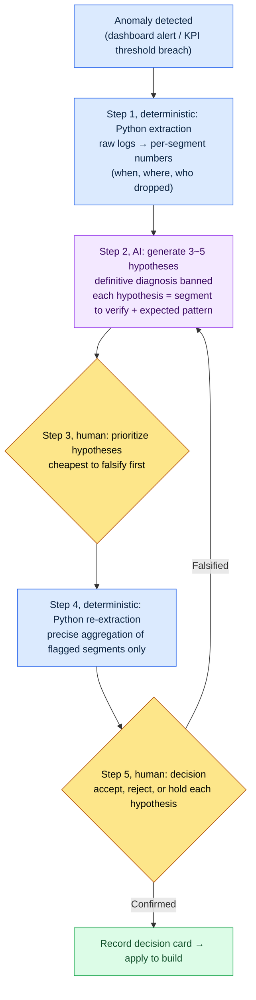

# 13.3 From Anomalous Metrics to Decisions — AI Proposes Hypotheses, Humans Decide

> Primary readers: data owners and directors who make quarterly decisions from KPIs (mid-size teams, 10–50 people)
> Scaled-down version for solo/hobbyist readers: §13.3.9, "If You're Solo, Just This Much"

One Monday morning I saw a single red line on the dashboard. Thirty-day retention had visibly broken from the previous week. Everyone in the meeting room offered a cause. Someone blamed the new hunting ground we had patched in the week before, someone blamed a competitor's new season, someone just said "seasonal factors." All of it sounded plausible. The problem was that by the end of that afternoon we had not even agreed on what to verify. Five hypotheses, and not a single segment chosen for verification.

This chapter is about how to end that kind of morning. The core fits in one line: **when you see an anomalous metric, don't ask AI for a definitive diagnosis — ask it for 3–5 verifiable hypotheses.** The AI does not declare "retention dropped because of X." It produces a verification design — "if X is true, this segment should look like this" — and a human makes the decision. The general theory of data-driven work is covered well enough in other books, so this chapter focuses only on *running that theory as an AI workflow*.

---

## 13.3.1 Humans Define the KPIs, AI Assists with Interpretation

First, I nail down the boundary. This entire chapter stands on one sentence. **Humans decide what the KPIs are; AI only helps lay out, quickly, the hypotheses about why a KPI moved when it moved.**

If this boundary collapses, data-driven work itself collapses. Hand KPI definition to AI and "whatever is easy to measure" becomes the KPI; hand diagnosis to AI as well and a plausible-sounding definitive sentence skips human verification and goes straight to a decision. So I open exactly one slot to AI — the stretch after an anomaly is caught and before a human decides: the stretch of "what should we suspect, and what should we check."

This division of labor shares the same spine as the earlier chapters of Part 13. Python extracts from raw logs deterministically (13.1), humans fix the KPI definitions and hierarchy (13.2), and in this chapter AI takes on only the *interpretation assist* when an anomaly shows up on top of that. Extraction is deterministic, definition is human, interpretation assist is AI. Keeping the three unmixed is the safety mechanism of this whole part.

My project (a mobile-first MMORPG, hereafter "Project A") has real logs underpinning this assist: under the team memory folder, `_economy_log/` (token and time economy logs), `_scores_latest.json` (a metric score cache), and `_roi_report.md` (an ROI (return on investment) report). The worked transcript in this chapter takes anomaly signals extracted from these logs as its input.

---

## 13.3.2 The Decision Loop — AI Gets Exactly One Slot

Before anything else, I pin down the full loop from one anomalous metric to a decision as a diagram. In this diagram AI occupies exactly one box: "hypothesis generation." Everything before it (extraction) and after it (verification and decision) belongs to humans and code.



Human hands touch three places: defining what counts as anomalous (the very front, already done in 13.2), choosing which hypothesis to verify first (step 3), and making the final decision (step 5). The tedious log aggregation in between is Python's job; laying out hypotheses fast is AI's. **There is no box in this loop where AI issues a definitive diagnosis.** Hypotheses exist to be falsified, and a falsification loops you back to step 2.

---

## 13.3.3 [Worked Transcript] Retention Drop — Getting 3–5 Hypotheses

Here is one full cycle of how this actually runs. Below is a reconstruction of the session behind that Monday-morning retention drop. The input prompts can be copied verbatim, and the outputs faithfully reconstruct the actual session.

### Step 1 — Input: Hand Over the Anomaly Signal Python Extracted, as Is

The human does not start by tossing in a feeling that "retention dropped." We toss in the per-segment numbers table that Python extracted deterministically. Nothing here is written fresh — it is extraction only, from `_economy_log`/event logs.

```python
# retention_break_extract.py (skeleton) — segment breakdown of the anomalous window
# Input: daily cohort retention logs
# Output: which segments dropped, and by how much (table for LLM input)
def extract_break(rows, kpi="d30_retention", baseline_weeks=4):
    base = mean([r[kpi] for r in rows if r.week < target_week][-baseline_weeks:])
    cur  = [r for r in rows if r.week == target_week]
    return [
        {"segment": s.name,
         "baseline": round(base_by_seg[s.name], 3),
         "current":  round(s.value, 3),
         "delta_pct": round((s.value/base_by_seg[s.name]-1)*100, 1),
         "n": s.sample_size}          # sample size — small n means low confidence; pass it along
        for s in cur
    ]
```

The table this script spits out is the first input for the AI. The key point is that the sample size (`n`) travels with it. If you want the AI not to mistake the wobble of a small segment for a cause, the warning has to be carried by the data, not by a human.

```
# retention_break_2026Q2W3.txt (extraction result, excerpt)
segment                          baseline  current  delta_pct       n
new (signed up <7d)                  0.41     0.31     -24.4%   8,200
returning (30d+ dormant)             0.28     0.27      -3.6%   1,100
paying                               0.62     0.60      -3.2%   2,400
non-paying                           0.34     0.25     -26.5%  14,900
new_hunting_ground_played            0.39     0.22     -43.6%   3,050
new_hunting_ground_not_played        0.40     0.38      -5.0%  11,200
```

### Step 2 — Prompt: Ban Diagnosis, Force Hypotheses and Verification Design

```
The attached retention_break_2026Q2W3.txt is the per-segment change in d30 retention
that Python extracted (baseline = average of the previous 4 weeks, current = this week,
n = sample size). Non-paying and new_hunting_ground_played dropped hard. Do not diagnose
the cause — build 3~5 verifiable hypotheses only. For each hypothesis, exactly these
four lines: the hypothesis in one sentence / the segment to verify (how to split it
further) / the pattern we'd see if it's right / the falsification condition that would
show it's wrong. Don't use small-sample segments (n<2000) as core evidence; if you do,
state the limitation. Sort the hypotheses by cheapest to falsify first, and mark
anything the data can't settle as 'needs human judgment'. Output only the list of
hypothesis cards, no narration.
```

There is not one line in this prompt that says "find the cause." Instead it specifies only the skeleton a hypothesis must have and the lines not to cross. Give the AI free rein and it will produce a plausible definitive sentence like "it's probably the new hunting ground's difficulty," and once that sentence lands in the meeting notes, it becomes a decision without verification. The guards against that are these four: **no definitive statements; a mandatory verification segment, expected pattern, and falsification condition per hypothesis; sorting by falsification cost; and "what can't be settled goes to humans."** They are what turn the output from a diagnosis into a verification design.

### Step 3 — Claude's Output (Raw, Reconstructed)

```
[Hypothesis 1] (cheapest to falsify)
Hypothesis: the new hunting ground's difficulty became an entry barrier for non-paying new users and amplified churn within 7 days.
Verification segment: re-split the new_hunting_ground_played segment into 'early-death count' brackets (0~2 / 3~5 / 6+).
Expected pattern: if the hypothesis is right, the d7→d30 churn rate should spike in the 6+ early-deaths bracket.
Falsification condition: reject if there is no monotonic relationship between death count and churn rate.

[Hypothesis 2]
Hypothesis: the cause is not the new hunting ground itself but other changes bundled into the same patch (reward curve, UI).
Verification segment: retention of users who did not play the new hunting ground but logged in after the patch.
Expected pattern: if the not-played segment also fell, the hunting ground is not the culprit.
Falsification condition: if the not-played segment holds its baseline (around -5%), reject this hypothesis and move toward hypothesis 1.

[Hypothesis 3]
Hypothesis: an external factor (a competitor's new season) churned non-paying users across the board; the hunting ground is unrelated.
Verification segment: 2×2 cross table of paying/non-paying × played/not-played the new hunting ground.
Expected pattern: if it's external, non-paying users fall evenly regardless of whether they played the hunting ground.
Falsification condition: if the drop is concentrated in new_hunting_ground_played, the external-factor theory weakens.

[Hypothesis 4] (needs human judgment)
Hypothesis: a measurement problem — this week's cohort definition or log collection changed.
Verification segment: (data can't settle this) a human must check whether a telemetry schema change shipped with the patch.
Expected pattern: if the schema changed, the drop may be a measurement artifact rather than real.
Falsification condition: reject once the log pipeline is confirmed unchanged.

Note: the 'returning' segment (n=1,100) has a small sample, so its -3.6% was not treated as a signal.
```

The most valuable part of this output is Hypothesis 4 — the place where the AI reported its own limits: "the data can't settle this; a human needs to check whether the telemetry schema changed." A good prompt makes it possible for the AI to say "I don't know." And the last line — excluding the segment with a sample of 1,100 from the signals on its own — is the trace of rule 3 at work.

### Step 4 — Verification and Decision (Where Humans and Python Belong)

You must not carry these hypothesis cards straight into a decision. A human sets the priority, and Python aggregates again.

Hypothesis 2 was the cheapest to falsify. The new_hunting_ground_not_played segment was already in the step 1 table — `-5.0%`. It held its baseline. In other words, users who skipped the hunting ground were fine. **Hypothesis 2 was rejected on the spot, and hypothesis 3 (a broad drop from external factors) weakened at the same time.** If the cause were external, the not-played segment should have fallen too. The drop was concentrated in users who *played* the new hunting ground.

So we narrowed to hypothesis 1 and ran Python again. Re-splitting new_hunting_ground_played by early-death count showed d30 churn standing out in the 6+ deaths bracket (direction: the more deaths, the steeper the churn — a monotonic relationship; exact figures measured by build telemetry, only the direction here). It matched hypothesis 1's expected pattern.

Hypothesis 4 remained. A human checked the patch notes — no telemetry schema change. The measurement-artifact possibility was rejected. Now the ingredients for a decision were in place.

> **[Step 5, Human Decision — Decision Card]**
>
> - **Accepted**: the early difficulty of the new hunting ground (early-death frequency) is the primary driver of non-paying new-user churn. Next build: A/B test lowering enemy density and HP in the level 1–5 range.
> - **Rejected**: the external-factor theory (hypothesis 3), the measurement-artifact theory (hypothesis 4).
> - **On hold**: the reward curve (the residue of hypothesis 2) — reopen if the drop persists after the hunting ground difficulty adjustment.
> - **AI's role on record**: 0 diagnoses; 4 hypotheses plus verification designs. The decision was human.

One cycle of input (anomaly signal) → extraction → hypotheses → verification → decision closes here. The AI never once said "the cause is this." It only laid the road for verification. This is the Show standard of this chapter — the sentence "AI analyzed the data" is empty unless you have watched, at least once and end to end, what was hypothesized, what was falsified, and what a human decided.

---

## 13.3.4 Why Definitive Diagnosis Is Banned

The difference between hypothesis generation and definitive diagnosis looks trivial, but it separates safe decisions from unsafe ones. Put side by side, the difference is plain.

| | Definitive diagnosis (banned) | Hypothesis generation (this chapter's way) |
|---|---|---|
| AI output | "The retention drop is caused by the new hunting ground's difficulty" | "Difficulty hypothesis — look at the early-death 6+ bracket; if this, it's right; if that, it's wrong" |
| Human's next move | Take dictation and decide | Try to falsify, cheapest hypothesis first |
| When it's wrong | The wrong decision ships straight into the build | Rejected at the verification stage, cost 0 |
| Accountability | "The AI said so" (responsibility evaporates) | A human picked the hypothesis and decided (responsibility is clear) |

The real danger of definitive diagnosis is not its accuracy but that **it makes people skip verification**. One plausible sentence puts the room's doubts to sleep. A hypothesis card, by contrast, is itself homework — "go check this" — so structurally it cannot pass into a decision without verification. That is why I keep AI as a hypothesis generator, not a diagnostic machine.

---

## 13.3.5 Goodhart Early Warning — AI Flags KPI Distortion First

The deepest trap in data-driven work is Goodhart's law: *"when a measure becomes a target, it ceases to be a good measure."* Set DAU as the target and DAU alone inflates through artificial notifications while long-term retention erodes. The problem is that this distortion usually surfaces as side effects **long after the decision was made**.

So I bring AI in one slot earlier. Before a decision proposal goes into the build, I first ask the AI: "if we target this KPI, how could it be gamed?" This is not diagnosis — it's a *red team*. We deliberately make it hunt for the holes in our own decision.

> **[Goodhart early-warning prompt]**
>
> This quarter's target KPI is d7 retention +5%p, and the draft lever is a major buff to
> the 7-day consecutive login rewards. Act as the red team for this decision: give me a
> table of 3 Goodhart distortion scenarios that could arise from targeting this KPI, the
> guard metrics that would break alongside each scenario, and the monitoring segment
> that would catch the distortion early. No definitive claims — phrase each as "this could happen."

What the AI returned was not a definitive prophecy but a list of places to be suspicious of. The essentials:

| Goodhart distortion scenario (hypothesis) | Guard metrics that break with it | Early monitoring |
|---|---|---|
| Logging in for the stamp without playing core content | Battles per session, hunting ground entry rate | Alert when d7 retention ↑ and battle count ↓ occur together |
| Reward inflation breaking the economy | Currency sink/source ratio, item market prices | Track the widening sink–source gap in `_economy_log` |
| Cliff churn right after the login streak ends | d8–d14 retention (right after rewards end) | Don't watch d7 alone — pair it with d14 |

The value of this table is not that it is correct but that **it pairs up guard metrics before the decision**. If we're going to target d7 retention, we put the "battle count" and "d14 retention" the AI flagged on the same screen and watch them together. Then the moment d7 rises while battle count falls — the moment Goodhart distortion begins — gets caught before the side effects accumulate to quarter's end. This habit of pairing a KPI with guard metrics, instead of targeting a single KPI, is how the "5–7 KPI balance" set in 13.2 actually operates at the decision stage.

One thing worth pinning here. The value the AI created in this red team is not "time saved." It does not take a human long to think of these three scenarios. The real value is that **it exposes the distortion signals right where the decision is being made** — the signaling effect of pulling guard metrics nobody usually watches onto the decision table. The value of automation lies not in saving time but in making normally invisible signals visible (Project A team memory concept `automation_signal_value_over_time_savings`).

---

## 13.3.6 AI Hypotheses Carry Different Weight for Different Decisions

Hypothesis generation is not equally useful for every decision. How much to trust AI hypotheses changes with the decision's time horizon and data density.

| Decision type | Data density | Where AI hypotheses stand |
|---|---|---|
| Skill balance number change | High (rich sims and logs) | Run the hypothesis→verify→decide loop as is; AI assist is strong |
| UI component change | High (A/B testable) | Same; AI hypotheses valid |
| Whether to ship new content | Medium (only similar-content references) | Hypotheses are reference material; decision weight shifts to humans |
| Long-term vision, new domains | Low (no precedent) | The loop itself doesn't run — humans decide; AI only enumerates risks |

The rule is simple. **The thicker the data behind a decision, the more you run the §13.3.2 loop as is; the thinner the data, the more AI steps down from hypothesis generator to risk-checklist writer.** Trying to solve long-term vision with data is dangerous because, where future data does not exist, an AI will fabricate plausible hypotheses out of past data, and those hypotheses drag the vision back toward the past. Decisions in data-free territory are not to be dodged or offloaded onto AI — they remain the seat where a human takes responsibility and decides.

> **[Signpost — If Embeddings Could Map Topics and Cohorts into Coordinates (Still Premature)]**
>
> Read this as a research trend, not a prescription. The same embedding idea opens up in two places in Part 13. One is the free-form responses of §13.1 — clustering unstructured natural language with sentence embeddings would let you express the [ambiguous] boundary cases of §13.1.2 as "distance between two topic centroids," and flag responses far from every centroid as "a new topic emerging." The other is the behavior logs of §13.1.4 — embedding play logs could reveal "emergent cohorts" nobody predefined, as clusters in vector space (the "map" of Appendix M), feeding them in as candidate "segments to verify" for the §13.3 hypothesis loop (it punches one hole in the limitation §13.3.3 assumed: segments predefined by humans). But a cluster is a hypothesis, not a cause; small clusters are not signals (the same seat as §13.3.3's sample-size warning); and naming the clusters — the labeling — is still human work (§13.1.1). Above all, a live incident can erupt in a dimension the compression threw away. So I file this idea in exactly the same place as the "dimension vector" lead in the economy chapter, §8.2.7 (conceptual intuition in Appendix M) — on the same telemetry soil, with the same restraint. It is a signpost for teams with telemetry solidly laid down to revisit a few years from now; the thing to do today is to run the §13.3.2 loop honestly.

---

## 13.3.7 Where This Chapter's Numbers Come From

The numbers in this chapter follow the principle of the preface's "One Promise." Goodhart's law is a public proposition formalized by Charles Goodhart in 1975; Project A's `_economy_log`, `_roi_report.md`, and `_scores_latest.json` are real team memory artifacts; and the rule that notifies via ClickUp on an integrity failure, `integrity_check_clickup_notify`, is a live operational atom with a score of 294.93 (Appendix A.3.6, A.3.1). In §13.3.3, only the *direction* — "churn is steeper in the early-death 6+ bracket" — was confirmed through hypothesis verification; absolute values were left to build telemetry. The segment table (baseline 0.41 and so on) is an *illustrative construction* to show the shape of the workflow, not published measurements from a specific quarter — what to memorize is the structure, not the numbers.

---

## 13.3.8 Common Failures

| Pattern | Why it fails | Remedy |
|---|---|---|
| Asking the AI "what's the cause" | A plausible definitive sentence becomes a decision without verification | Ban diagnosis; force 3–5 hypotheses + falsification conditions (§13.3.3) |
| Treating a small segment's wobble as a signal | Mistakes noise for a cause | Pass `n` along at the extraction stage and state the threshold |
| Going straight to a single-KPI target | Goodhart distortion erupts at quarter's end | AI red team before deciding + paired guard metrics (§13.3.5) |
| Deciding long-term, data-free questions with data | Past-built hypotheses drag down the future vision | Tier the AI's role by data density (§13.3.6) |
| Accepting hypotheses without verification | A hypothesis masquerades as a conclusion | Falsify cheapest-first; use the not-played segment |

The third one detonates last. d7 retention rises, the decision looks like a success, and two months later the d14 cliff and the battle-count drop arrive together. The 30 minutes spent running the AI red team *before* the decision buys back those two months.

---

## 13.3.9 Try It Yourself — One Step You Can Take Today

> **If you're solo, just this much**: you don't need a log pipeline. Pick one recently bent number from your own game (or from the public metrics of a game you follow). Toss that number to the AI — but instead of "tell me the cause," ask for "no definitive diagnosis; 3 verifiable hypotheses, each with a falsification condition." Pick the one hypothesis that is cheapest to check and split the data yourself, once. You will feel in your bones how different "receiving a diagnosis" and "verifying a hypothesis" are for the safety of a decision.

If you're on a team, start with this one step. When your anomaly extraction script emits per-segment numbers, add one line so it **always outputs the sample size (`n`) too** (the `retention_break_extract.py` of §13.3.3). And the next time you set a KPI target, run the Goodhart red-team prompt of §13.3.5 once and enter one pair of guard metrics into the decision card. With just these two, "the AI diagnosed the cause" turns into "the AI laid out hypotheses, and a human verified and decided."

---

### Key Takeaways
- Ask the AI for 3–5 verifiable hypotheses, not a definitive diagnosis.
- Make a verification segment, an expected pattern, and a falsification condition mandatory for every hypothesis.
- Run a Goodhart red team before the decision and pair up guard metrics in advance.

### Next Chapter Preview
- 14.1 From 30 PC HUD Elements to 10 on Mobile — Where Per-Platform Decisions Begin
