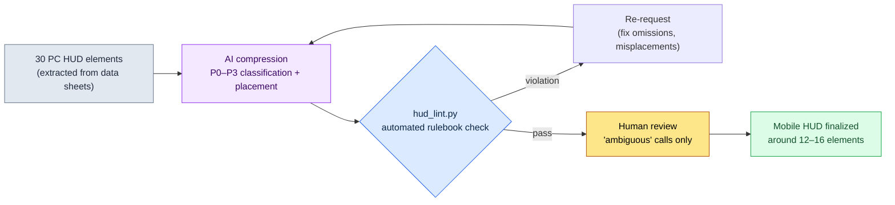

# 14.1 From 30 PC HUD Elements to 10 on Mobile — Constraints as a Rulebook, Compression by AI

> Primary audience: UX and systems designers on mobile-first projects (mid-size teams of 10–50)
> Scaled-down version for solo/hobbyist readers: §14.1.7, "If You're Solo, Just This Much"

I remember the day we first put the combat HUD that ran fine in the PC build onto a mobile screen. Half the screen was buried under gauges, icons, the minimap, and the quest tracker — and the character itself was nowhere to be seen. Every single element looked necessary. The problem was that "what do we cut" turned back into a from-scratch fight at every meeting. Someone wanted to save the minimap; someone else wanted to save the chat window. Because the rationale was "feel," the conclusion came out different every time.

This chapter is about ending that fight. There are two keys. First, turn mobile constraints from "feel" into a **verifiable rulebook**. Second, hand the tedious, repetitive compression work — cutting 30 PC elements down to 10 for mobile — to the AI, and have humans do only the **review that catches rulebook violations**. General mobile UX knowledge already fills plenty of other books, so this chapter focuses solely on *running that knowledge through an AI workflow*.

---

## 14.1.1 Mobile Constraints Are a Rulebook, Not a List of Cautions

Plenty of books lay out mobile constraints in a table. The screen is small, fingers are thick, sessions are short, the battery drains. All true — but memorizing that table won't answer the meeting-room question, "So is this button OK or not?" Constraints have to become **numeric pass/fail criteria** before AI and humans draw the same line.

Fortunately, most mobile input constraints have already been nailed down by platform vendors as public guidelines. Public standards like the 44pt touch target (HIG), 48dp (Material), 4.5:1 contrast (WCAG), and 8dp spacing follow the §9.1 rulebook; here I keep inline only the one this chapter's lint uses directly — the **44pt minimum touch target (HIG)**. These are numbers nobody needs to make up. Only when you can say "this button is 38pt, below the HIG 44pt" instead of "this button feels a bit small" do you get the same verdict whether a human or an AI is making the call.

I add one more line on top — for mobile MMORPGs, the landscape two-handed grip is the standard: pressable elements go in the two bottom corners, and consumables/slots go in the bottom center (why landscape is the standard and what the three-zone model is are covered in §9.1). Every placement verdict in this chapter assumes that landscape two-handed grip.

Put the platform criteria side by side with PC, and the starting point of compression becomes obvious. PC is precise and high-capacity (it can carry 30–50 elements); mobile landscape is confined to the two-thumb corners, so 12–16 is the ceiling (full comparison table in the §9.1 rulebook — author's estimate, unverified). So the essence of mobile work is not "design" but **"priority-compressing 30–50 PC elements into the 12–16 of mobile landscape."** And this compression is tedious by hand, and the baseline drifts every time you redo it — it is the job of applying the same rules over and over without tiring, which fits exactly the division of labor where AI drafts and a human reviews.

---

## 14.1.2 [Worked Transcript] 30 PC HUD Elements → Mobile Priority Compression

Here is one full cycle of how I actually run it. Below is a faithful reproduction of a combat-HUD compression session from my own project (a mobile-first MMORPG, "Project A" hereafter). The input prompts can be copied and used as-is; the outputs are reconstructions of the actual session.

### Step 1 — Input: Feed the PC HUD Spec as Is

First, turn the PC HUD element list into a machine-readable table. This already lives in the data sheets, so it is extraction, not new writing.

```yaml
# hud_pc_inventory.yaml — current HUD in the PC build (excerpt, 12 of 30 elements)
- id: hp_bar          # HP bar
  현재위치: top-left
  상시노출: true
  조작가능: false
- id: mp_bar          # MP bar
  현재위치: top-left
  상시노출: true
  조작가능: false
- id: skill_slots     # 12 skill slots
  현재위치: bottom-center
  상시노출: true
  조작가능: true
- id: minimap         # minimap
  현재위치: top-right
  상시노출: true
  조작가능: true
- id: quest_tracker   # quest tracker
  현재위치: right side
  상시노출: true
  조작가능: false
- id: chat            # chat window
  현재위치: bottom-left
  상시노출: true
  조작가능: true
# ... buff_bar, party_frame, target_frame, exp_bar, currency, mail_alert ...
```

### Step 2 — Prompt: Nail Down the Classification Format and the One-Line Rationale

```
Take the attached hud_pc_inventory.yaml (the 30 current HUD elements in the PC build)
and priority-compress it for mobile landscape two-handed grip. Classify each element
from P0 (always required during combat) to P3 (remove or contextual exposure), and
keep the always-on total (P0–P1) at 16 or fewer. For interactive elements
(조작가능:true), propose placement in the thumb-reach corners (bottom-left = movement,
bottom-right = skills). Attach a one-line rationale to every classification, and don't
force a call on ambiguous ones — flag them separately and hand them to a human.
Output the table only (element | class | zone | rationale | ambiguous), no commentary.
```

Note that in this prompt, the instruction to compress is a single line; everything else is fencing that pens in the output. Give the AI freedom and it regurgitates the generic-RPG average. So I pre-load **the classification criterion (P0–P1 ≤ 16), the output format (a table), the rationale requirement, and the escape hatch — "hand ambiguous ones to a human."** The quality of the compression is decided by these four fences.

### Step 3 — Claude's Output (Reconstruction, Excerpt)

```
| Element     | Class | Zone                    | Rationale                                    | Ambiguous |
|-------------|-------|-------------------------|----------------------------------------------|-----------|
| hp_bar      | P0    | top, fixed              | death-critical, needs checking every 0.5s    |           |
| skill_slots | P0    | bottom-right (R thumb)  | core controls, must sit in right-thumb corner|           |
| mp_bar      | P0    | top, fixed              | decides whether skills can fire, always needed|          |
| target_frame| P0    | top center              | target HP check, core combat read            |           |
| minimap     | P1    | top-right, shrunk       | direction check, can shrink/fade in combat   |           |
| buff_bar    | P1    | below hp_bar            | buff-expiry check, icons can shrink          |           |
| quest_tracker| P2   | menu toggle             | not needed in combat, toggle outside combat  |           |
| chat        | P2    | bottom-left tab         | auto-hide in combat, tap to expand           | ★         |
| party_frame | P1    | left side, shrunk       | promote to P0 in party play (conditional)    | ★         |
| mail_alert  | P3    | contextual              | shows briefly only on receipt                |           |
| exp_bar     | P3    | bottom 1px line         | low info value, a thin line is enough        |           |
| currency    | P2    | inside menu             | not needed in combat                         |           |

Always-on total (P0+P1): 7 (rule 2 pass: ≤16)
2 ambiguous items (chat, party_frame) need a human decision:
- chat: consider promoting to P1 if the game leans heavily social
- party_frame: classification splits by solo/party context
```

The most valuable part of this output is not the table but **the two lines at the bottom — "2 ambiguous items."** That is the AI reporting its own limits and handing the judgment to a human. Leave an escape hatch in the prompt, and instead of fabricating an answer, the AI plants a flag where it doesn't know.

### Step 4 — Verification and Veto (the Human's Job)

Don't accept this output as-is. Run it against the rulebook once. In this actual session, one item got caught.

The AI placed `party_frame` at "left side, shrunk" — but in a landscape grip, the left-center of the screen is a zone neither thumb reaches (the left hand is tied to bottom-left movement, the right hand to bottom-right skills). Yet the party frame is an **interactive element** that needs taps (targeting party members). That violates rule 3 ("interactive elements go in the easy thumb corners"). The AI missed the `조작가능` flag on party_frame. The cause: party_frame's `조작가능` field was empty in the input yaml — a data defect on the human side.

So I re-request.

```
party_frame is an interactive element that needs taps for targeting party members
(it was missing from the earlier input). Re-place it under the rule that interactive
elements must sit in the thumb-reach corners. Propose separately for solo play and
party play.
```

One round trip and it's done. The AI answered again with "hidden" for solo play and "promoted to bottom-right (easy)" for party play, and that decision passed the rulebook. **Compressing 30 elements by hand from scratch takes half a day; AI draft + rulebook review + one round trip stays under an hour** (author's estimate — the exact time saved varies by team and element count, so read it less as an absolute value and more as the structural difference between "by hand from scratch" and "draft + review").

---

## 14.1.3 Finger Zones — Both Corners and the Bottom Center

Pin down the "finger zones" that kept coming up in the session above as one diagram, and every placement verdict afterward gets faster. On a phone held in landscape, the bottom — where fingers reach and eyes go often — splits into three spots. The left thumb reaches the bottom-left corner (movement), the right thumb the bottom-right corner (skills), and **the bottom center between the two thumbs** is where consumables, auto-use items, and skill slots go. It isn't twitch input, but it is an important glance zone where you see at a glance what you use or what auto-consumes, and press it occasionally. P0 controls and slots are green; the top and upper center — where fingers never go and you only read — are red.

<svg viewBox="0 0 660 340" xmlns="http://www.w3.org/2000/svg" role="img" aria-label="Two-thumb reach zones on a landscape mobile screen">
  <!-- phone outline (landscape) -->
  <rect x="20" y="30" width="620" height="280" rx="30" ry="30" fill="#0f1117" stroke="#3a3f4b" stroke-width="3"/>
  <rect x="34" y="44" width="592" height="252" rx="14" ry="14" fill="#11151d"/>
  <!-- top status band (red — hard to reach) -->
  <rect x="34" y="44" width="592" height="62" fill="#7f1d1d" opacity="0.42"/>
  <text x="330" y="80" fill="#fecaca" font-family="sans-serif" font-size="13" text-anchor="middle">Hard — top &amp; upper center (status only: HP · MP · target, read-only)</text>
  <!-- center game view -->
  <text x="330" y="205" fill="#5b6675" font-family="sans-serif" font-size="14" text-anchor="middle">Game view (where the combat happens)</text>
  <!-- bottom-left thumb corner (green) -->
  <path d="M34 296 L34 146 A150 150 0 0 1 184 296 Z" fill="#14532d" opacity="0.7"/>
  <path d="M34 146 A150 150 0 0 1 184 296" fill="none" stroke="#22c55e" stroke-width="2.5" stroke-dasharray="5 4"/>
  <text x="92" y="250" fill="#bbf7d0" font-family="sans-serif" font-size="13" text-anchor="middle" font-weight="bold">L thumb</text>
  <text x="92" y="270" fill="#bbf7d0" font-family="sans-serif" font-size="12" text-anchor="middle">Move</text>
  <!-- bottom-right thumb corner (green) -->
  <path d="M626 296 L626 146 A150 150 0 0 0 476 296 Z" fill="#14532d" opacity="0.7"/>
  <path d="M626 146 A150 150 0 0 0 476 296" fill="none" stroke="#22c55e" stroke-width="2.5" stroke-dasharray="5 4"/>
  <text x="568" y="250" fill="#bbf7d0" font-family="sans-serif" font-size="13" text-anchor="middle" font-weight="bold">R thumb</text>
  <text x="568" y="270" fill="#bbf7d0" font-family="sans-serif" font-size="12" text-anchor="middle">Skills</text>
  <!-- bottom-center slot bar (amber — consumables, quick slots, auto items) -->
  <text x="330" y="238" fill="#b45309" font-family="sans-serif" font-size="12" text-anchor="middle" font-weight="bold">Bottom center — consumables · quick slots · auto</text>
  <rect x="256" y="248" width="148" height="44" rx="8" fill="#f59e0b" opacity="0.45" stroke="#f59e0b" stroke-width="2" stroke-dasharray="5 4"/>
  <circle cx="295" cy="270" r="12" fill="#fbbf24"/><text x="295" y="274" fill="#000" font-size="8" text-anchor="middle">Potion</text>
  <circle cx="330" cy="270" r="12" fill="#fbbf24"/><text x="330" y="274" fill="#000" font-size="8" text-anchor="middle">Auto</text>
  <circle cx="365" cy="270" r="12" fill="#fbbf24"/><text x="365" y="274" fill="#000" font-size="8" text-anchor="middle">Slot</text>
  <!-- example HUD dots -->
  <circle cx="70" cy="72" r="9" fill="#ef4444"/><text x="70" y="76" fill="#fff" font-size="9" text-anchor="middle">HP</text>
  <circle cx="125" cy="72" r="9" fill="#ef4444"/><text x="125" y="76" fill="#fff" font-size="9" text-anchor="middle">MP</text>
  <circle cx="330" cy="60" r="9" fill="#ef4444"/><text x="330" y="64" fill="#fff" font-size="8" text-anchor="middle">TGT</text>
  <circle cx="588" cy="72" r="10" fill="#ef4444"/><text x="588" y="76" fill="#fff" font-size="8" text-anchor="middle">Map</text>
  <circle cx="92" cy="232" r="17" fill="#22c55e"/><text x="92" y="236" fill="#000" font-size="9" text-anchor="middle">Move</text>
  <circle cx="556" cy="240" r="14" fill="#22c55e"/><text x="556" y="244" fill="#000" font-size="9" text-anchor="middle">Skill</text>
  <circle cx="592" cy="210" r="13" fill="#22c55e"/><text x="592" y="214" fill="#000" font-size="9" text-anchor="middle">Skill</text>
  <circle cx="582" cy="272" r="12" fill="#22c55e"/><text x="582" y="276" fill="#000" font-size="8" text-anchor="middle">Skill</text>
</svg>

The rule is simple. **Read-only information (HP/MP/target health) can live in the red (top and upper center) — fingers never need to go there.** Conversely, **pressable elements must be inside the finger zones (green and amber)** — movement and skills in the two bottom corners; consumables, auto-use items, quick slots, and skill slots in the bottom center. All three are spots where fingers reach and eyes visit often. This one picture explains why party_frame got caught in §14.1.2 — a pressable element was placed in the left-center (a reading zone), not in a finger zone.

---

## 14.1.4 The Rulebook as Code — Automated Layout Lint

Check by eye every time whether a compressed plan honors the rulebook, and you will miss things again. Of the five rules in §14.1.1, the ones decidable by coordinates and size should be reviewed by code. Humans spend time only on the "ambiguous" calls that code can't make.

```python
# hud_lint.py — mobile HUD layout-plan verification (skeleton)
# Input: the AI-proposed layout plan (per-element coordinates, size, 조작가능, 분류)
# Output: list of rulebook violations

MIN_TAP_PT = 44       # Apple HIG minimum touch target (pt)

def in_action_zone(e, w, h):
    """Finger-reach zones in landscape grip: bottom-left/right corners + bottom-center slot bar."""
    x, y = e["x"] / w, e["y"] / h
    bottom = y > 0.55
    left_corner  = bottom and x < 0.30                 # left thumb = movement
    right_corner = bottom and x > 0.70                 # right thumb = skills
    center_slot  = (y > 0.72) and (0.35 <= x <= 0.65)  # bottom center = consumables/quick slots
    return left_corner or right_corner or center_slot

def lint(elements, screen_w, screen_h):
    issues = []
    for e in elements:
        # Rule A: interactive/slot elements must sit in the finger zones (both corners + bottom center)
        if e["조작가능"] and not in_action_zone(e, screen_w, screen_h):
            issues.append(f"[A] {e['id']}: interactive/slot element placed outside finger zones "
                          f"(x={e['x']}, y={e['y']})")
        # Rule B: minimum touch-target size (HIG 44pt)
        if e["조작가능"] and min(e["w"], e["h"]) < MIN_TAP_PT:
            issues.append(f"[B] {e['id']}: touch target {min(e['w'], e['h'])}pt "
                          f"< {MIN_TAP_PT}pt (below HIG)")
    # Rule C: total always-on P0/P1
    onscreen = [e for e in elements if e["분류"] in ("P0", "P1")]
    if len(onscreen) > 16:
        issues.append(f"[C] {len(onscreen)} always-on elements > 16 (overcrowded)")
    return issues
```

With these 30 lines, "isn't this button a bit small?" stops being a discussion topic in meetings and becomes a verdict. When the code prints `[B] skill_slots: touch target 40pt < 44pt (below HIG)`, there is no need to gather opinions. You fix it. This is the lint gate from 9.1 (HUD) carried over to the mobile dimension — the division where code catches what is deterministically decidable and humans take what is non-deterministic and judgment-based holds on mobile just the same.

Here is the full cycle at a glance.



Human hands touch only two places: putting clean input data in (the very front), and making the ambiguous judgments the rulebook can't catch (the very back). The tedious 30-element compression in between is run by the AI and the lint.

---

## 14.1.5 Where the Numbers in This Chapter Come From

A short record of the sources for the numbers in this chapter (for the book-wide policy on numbers, see "One Promise" in the preface). The 44pt touch target (HIG), 48dp (Material), and 4.5:1 contrast (WCAG) are official platform standards; "8–12 always-on info elements" and "compression: half a day → one hour" are the author's experience-based estimates (unverified), so read them as *direction* rather than absolute values. The metrics actually measurable on a mobile HUD are rulebook violation count (lint 0), always-on element count (target ≤12), and mis-tap rate (telemetry); outcome metrics like retention are not decided by the HUD alone, so I don't assert causation.

---

## 14.1.6 Common Failures

| Pattern | Why it fails | Fix |
|---|---|---|
| Porting the PC HUD shrunk as-is | 30 elements bury a 6-inch screen; the game disappears | The compression session in §14.1.2 |
| Wholesale delegation — "AI, build me a mobile UI" | Without a rulebook you get the generic-RPG average | Feed the rulebook (§14.1.1) into the prompt first |
| Reviewing the compressed plan by eye only | Touch-size and thumb-zone violations slip through every time | Automated verification with `hud_lint.py` |
| "Let's just cut this" meetings with no rationale | The conclusion changes every time | Force P0–P3 + a one-line rationale |

---

## 14.1.7 Try It Yourself — One Step You Can Take Today

> **If you're solo, just this much**: You don't need data sheets. Write down 10–15 PC HUD elements of your own game (or a game you love) by hand, turn them into yaml, paste in the prompt from §14.1.2 as-is, and run it once. Find one item where you disagree with the AI's classification and push back — "justify this again" — and you'll feel in your bones what bundle of judgments compression really is.

If you're on a team, start with this one step. Extract the current HUD element list into `hud_pc_inventory.yaml` (it's already in your data sheets), and pin down the three rulebook lines of §14.1.4's `hud_lint.py` (touch size, thumb zones, total count) as code first. With the rulebook in place, you can measure an AI compression plan and a human draft against the same line.

---

### Key Takeaways
- Turn mobile constraints into a lintable rulebook, not a table to memorize (HIG 44pt, WCAG 4.5:1).
- The 30-to-10 compression goes to the AI, rulebook-violation review goes to code, and only the ambiguous judgments go to humans.
- Pressable elements inside the two bottom corners, readable information up top — this one line decides the layout.

### Next Chapter Preview
- 14.2 Managing Per-Platform Differences (iOS/Android/PC) with AI
