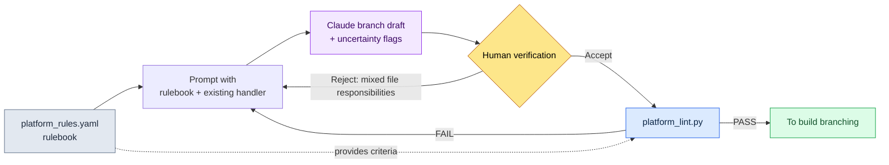

# 14.2 Platform Differences (iOS / Android / PC)

The day we first put the alpha build on PC, a screenshot appeared in the design team's messenger channel. The virtual joystick that filled the bottom of the screen on mobile was floating, palm-sized, in the middle of a 27-inch monitor. Someone added one line: "How am I supposed to grab this with a mouse?" The core logic was fine. Combat, inventory, quests — all of it ran as before. Exactly one thing had broken: the places where input and screen had been pinned to mobile assumptions.

Shipping the same game to iOS, Android, and PC looks like it should triple the operational load, but in practice it does not. There is one core logic, and three platform adaptation layers attach to it. The problem is that "where the core ends and the adaptation layer begins" is hard for a person to judge case by case. A branch that works on iOS but breaks only on Android, a key mapping that only matters on PC — these differences do not all fit in one head. So the heart of this chapter is a workflow that **codifies platform constraints into a rulebook**, has AI generate branch drafts grounded in that rulebook, and finally has **lint catch the rule violations**.

---

## 14.2.1 What Differs Across the Three Platforms

First, the terrain of the differences. Below is the platform constraint table we put together on Project A (a mobile-first MMORPG where I serve as design director) while evaluating a secondary PC release. Where a number is based on a public standard, I noted the source; the rest are values agreed internally on the project.

| Area | iOS | Android | PC |
|---|---|---|---|
| Input | Touch | Touch (+ some keyboards) | Keyboard, mouse, gamepad |
| Minimum touch target | 44pt (Apple HIG) | 48dp (Material) | Click — not applicable |
| Screen | 4.7–6.7 inches | 4.5–7 inches (high variance) | 21–32 inches |
| Payments | App Store | Google Play | In-house / Steam |
| Notifications | APNs | FCM | OS / in-house |
| Save data | iCloud | Google Drive / in-house | Steam Cloud / in-house |
| OS replacement cycle | 1–2 years | 1 year (heavy fragmentation) | 5–10 years |

iOS and Android differ in their payment, save, and notification *APIs*, but what the user sees and how they control the game are almost identical. PC differs wholesale in input, screen, and visual effects. So the operational load, counter to intuition, is closer to ×2 than ×3 — because the distance between iOS and Android is short.

What matters here is not the table itself but turning it into **a rulebook that machines read, not a document that humans read**. That is what lets AI use it as grounding when generating branch drafts, and lets lint catch violations.

---

## 14.2.2 The Line Between Core and the Platform Layers

Project A's folder structure attaches three platform adaptation layers to a single core.

```
game/
├── core/                  — game logic (platform-agnostic)
│   ├── combat/  inventory/  narrative/  ...
├── platform/              — platform adaptation layers
│   ├── ios/      → input/  payment/  notification/
│   ├── android/  → input/  payment/  notification/
│   └── pc/       → input/  payment/  ui/
└── shared/                — used by all (utilities · rendering)
```

There is one rule. **core never calls platform by name.** The moment core contains a statement like `if platform == "ios"`, the layer separation collapses. Take input: core only knows the intent "use skill 1" (`InputIntent.SKILL_1`); whether that intent is extracted from touch coordinates or from the keyboard's `1` is the responsibility of each platform layer.

Draw this line and the next step becomes possible: adding a new platform means filling in a single folder under `platform/` without touching core. The figure below shows, on one page, how this line actually splits.

<svg viewBox="0 0 720 360" xmlns="http://www.w3.org/2000/svg" font-family="sans-serif" font-size="13">
  <rect x="0" y="0" width="720" height="360" fill="#fbfbfd"/>
  <!-- core -->
  <rect x="270" y="20" width="180" height="70" rx="8" fill="#1d3557" />
  <text x="360" y="50" fill="#fff" text-anchor="middle" font-weight="bold">core/</text>
  <text x="360" y="70" fill="#cdd9e8" text-anchor="middle" font-size="11">Game logic · platform-agnostic</text>
  <text x="360" y="84" fill="#cdd9e8" text-anchor="middle" font-size="11">InputIntent · PaymentInterface</text>
  <!-- arrows down -->
  <line x1="360" y1="90" x2="130" y2="150" stroke="#888" stroke-width="1.5" marker-end="url(#a)"/>
  <line x1="360" y1="90" x2="360" y2="150" stroke="#888" stroke-width="1.5" marker-end="url(#a)"/>
  <line x1="360" y1="90" x2="590" y2="150" stroke="#888" stroke-width="1.5" marker-end="url(#a)"/>
  <defs>
    <marker id="a" markerWidth="8" markerHeight="8" refX="6" refY="3" orient="auto">
      <path d="M0,0 L6,3 L0,6 Z" fill="#888"/>
    </marker>
  </defs>
  <!-- platform boxes -->
  <g>
    <rect x="40" y="150" width="180" height="120" rx="8" fill="#e8f0f8" stroke="#1d3557"/>
    <text x="130" y="173" text-anchor="middle" font-weight="bold" fill="#1d3557">platform/ios</text>
    <text x="130" y="196" text-anchor="middle" font-size="11">touch → intent</text>
    <text x="130" y="214" text-anchor="middle" font-size="11">StoreKit · APNs</text>
    <text x="130" y="232" text-anchor="middle" font-size="11">targets ≥ 44pt</text>
    <text x="130" y="256" text-anchor="middle" font-size="10" fill="#777">iCloud saves</text>
  </g>
  <g>
    <rect x="270" y="150" width="180" height="120" rx="8" fill="#e8f0f8" stroke="#1d3557"/>
    <text x="360" y="173" text-anchor="middle" font-weight="bold" fill="#1d3557">platform/android</text>
    <text x="360" y="196" text-anchor="middle" font-size="11">touch → intent</text>
    <text x="360" y="214" text-anchor="middle" font-size="11">Play Billing · FCM</text>
    <text x="360" y="232" text-anchor="middle" font-size="11">targets ≥ 48dp</text>
    <text x="360" y="256" text-anchor="middle" font-size="10" fill="#777">fragmentation handling</text>
  </g>
  <g>
    <rect x="500" y="150" width="180" height="120" rx="8" fill="#f8efe8" stroke="#9a4f1d"/>
    <text x="590" y="173" text-anchor="middle" font-weight="bold" fill="#9a4f1d">platform/pc</text>
    <text x="590" y="196" text-anchor="middle" font-size="11">key/mouse → intent</text>
    <text x="590" y="214" text-anchor="middle" font-size="11">Steam · OS notifications</text>
    <text x="590" y="232" text-anchor="middle" font-size="11">gamepad · key-mapping UI</text>
    <text x="590" y="256" text-anchor="middle" font-size="10" fill="#777">varied resolutions</text>
  </g>
  <!-- shared -->
  <rect x="270" y="300" width="180" height="44" rx="8" fill="#ddd" />
  <text x="360" y="327" text-anchor="middle" fill="#333">shared/ — utilities · rendering</text>
  <text x="360" y="290" text-anchor="middle" font-size="10" fill="#9a4f1d">PC differs wholesale in input, screen, and visuals (orange)</text>
</svg>

The iOS and Android boxes share the same blue family and only PC is orange — the size of the difference is shown in color. The asymmetry of the operational load is visible here at a glance.

---

## 14.2.3 The Rulebook: Making the Differences Machine-Readable

The key turning point is here. Write platform constraints into a prose document and people forget them. Instead, gather them into a single **declarative rulebook file**. Below is an excerpt from the `platform_rules.yaml` we use on Project A (I trimmed the actual file down to the core rules for this chapter).

```yaml
# platform/platform_rules.yaml
targets:
  ios:
    min_touch_pt: 44          # Apple HIG
    contrast_ratio: 4.5       # WCAG SC1.4.3
    gamepad: optional         # iOS 17+ standard
    forbidden_in_core: ["import platform.ios", "StoreKit", "APNs"]
  android:
    min_touch_dp: 48          # Material
    contrast_ratio: 4.5
    forbidden_in_core: ["import platform.android", "BillingClient", "FCM"]
  pc:
    min_target_px: 24         # WCAG SC2.5.8 (pointer)
    input: ["keyboard", "mouse", "gamepad"]
    forbidden_in_core: ["import platform.pc", "SteamAPI"]
required_intents: ["MOVE_FORWARD", "ATTACK", "SKILL_1", "SKILL_2"]
```

This one file does three things at once: (1) the **spec** AI reads when generating branch drafts, (2) the **criteria** lint verifies against, and (3) the **single source** where people record what was agreed. `forbidden_in_core` matters most — it is the list of tokens that must never appear inside the core folder, which gives lint a mechanical basis for catching layer violations.

---

## 14.2.4 Worked Transcript: Rulebook → AI Branch Draft → Verification

Now I walk through a real task from start to finish. The situation: preparing the secondary PC release, an input handler that existed only on mobile needs a PC branch. Grounded in the rulebook, I get a draft PC input adapter from Claude, verify it with lint, and complete one full cycle including rejection and re-request.

### 1) The Prompt (Verbatim)

> Below are an excerpt from our project's platform rulebook and the existing iOS input handler.
>
> [the platform_rules.yaml excerpt above, pasted in]
>
> ```python
> # platform/ios/input/touch_handler.py
> from core.input.input_intent import InputIntent
>
> def map_touch_to_intent(touch_event):
>     if touch_event.location in skill_button_1_area:
>         return InputIntent.SKILL_1
>     if touch_event.is_drag_up:
>         return InputIntent.MOVE_FORWARD
>     return None
> ```
>
> Using this as reference, draft `platform/pc/input/keyboard_handler.py`. Constraints: (1) import core, but never import platform.ios/android, (2) map all 4 `required_intents`, (3) separate the key mapping into a dict so users can change it. Flag anything you are not sure about.

### 2) Claude's Raw Output (No Summarizing, No Cleanup)

> Here is a draft. I pulled the key mapping out into a dict at the top of the module so users can customize it.
>
> ```python
> # platform/pc/input/keyboard_handler.py
> from core.input.input_intent import InputIntent
>
> DEFAULT_KEYMAP = {
>     "w": InputIntent.MOVE_FORWARD,
>     "1": InputIntent.SKILL_1,
>     "2": InputIntent.SKILL_2,
>     # ATTACK assumed on left mouse click — no keyboard default assigned
> }
>
> def map_keyboard_to_intent(key_event, keymap=DEFAULT_KEYMAP):
>     return keymap.get(key_event.key.lower())
>
> def map_mouse_to_intent(mouse_event):
>     if mouse_event.button == "left":
>         return InputIntent.ATTACK
>     return None
> ```
>
> ⚠️ Where I am not confident: `required_intents` includes ATTACK, and I mapped it to the **mouse**, not the keyboard. The rulebook does not specify whether `required_intents` means "OK as long as it is mapped on some input device" or "everything handled within a single handler," so I assumed the former. If it is the latter, lint may flag ATTACK as missing.

### 3) Human Verification / Rejection

The ⚠️ spot Claude flagged was exactly the trap. Our lint (`platform_lint.py`) checks `required_intents` coverage **per platform**, not **per handler file**. Even if ATTACK is missing from `keyboard_handler.py`, it passes as long as it exists on the `mouse_handler` side. But the output Claude produced put the mouse mapping inside the `keyboard_handler.py` file — file responsibilities got mixed. Structurally it would pass, but it violates our folder rule (separate files per input device). **Rejected.**

The rejection reasons fit in two lines: (1) split the mouse mapping into a separate `mouse_handler.py`. (2) Make ATTACK usable from the keyboard too, with `Space` as a fallback.

### 4) Re-request → Lint Pass

After the re-request, I ran the split version through `platform_lint.py`. Lint reads the rulebook and checks the following.

```
$ python platform_lint.py platform/pc/
[core-leak]    PASS  — 0 forbidden tokens inside core/
[intent-cover] PASS  — pc: MOVE_FORWARD, ATTACK, SKILL_1, SKILL_2 (4/4)
[touch-target] SKIP  — pc uses min_target_px=24 (checked separately in the UI layer)
[no-cross-import] PASS — platform.pc does not reference platform.ios/android
```

`intent-cover` landing at 4/4 is the point. Whether the AI-generated draft meets the rulebook's criteria was settled by a script, not by human eyes. That one line replaces the re-checking a person used to do in their head, every time, in multi-platform operations.

Compressed into a diagram, the cycle looks like this.



The center of this structure is that the rulebook supplies the criteria to **both** the prompt and lint. AI generates, a human judges, lint confirms — all three roles look at the same rulebook.

---

## 14.2.5 Build Branching: Same Core, Different Assembly

Once the handlers are in place, the build is simple assembly. core and shared are fixed; only the platform folder swaps out.

```
[core/ + shared/ + platform/ios/]      → iOS build
[core/ + shared/ + platform/android/]  → Android build
[core/ + shared/ + platform/pc/]       → PC build
```

In CI we run these three **in parallel, not sequentially**, and run `platform_lint.py` automatically right after each build. Run them sequentially and build time triples; drop the lint and rule violations survive all the way to deployment. Parallel builds plus automatic lint — those two are the minimum requirements of multi-platform CI.

Release cycles differ per platform, so a passing build does not mean simultaneous deployment. iOS review usually takes 1–3 days, which makes frequent releases a conservative bet; Android propagates within hours, so you can ship more often; Steam sits around 1–2 days. The same change ships last on iOS, so hotfix schedules are always back-calculated from iOS.

---

## 14.2.6 UI Variants: 80 Common · 15 Variant · 5 Exclusive

Beneath the code, the screens split too. In my experience, the recommended distribution is 80% common components, 15% platform variants (differing only in size and position), and 5% platform-exclusive. This ratio shifts with genre, though — a casual puzzle game pushes common up to 90%, while an MMORPG grows more variants because of the input differences.

Exclusive components are where a platform's appeal lives, so forcing everything into common is not the answer. Mobile's virtual joystick and vibration, PC's key-mapping UI and gamepad settings — things meaningful only on that platform belong here. But once exclusive passes 30%, that is a signal of operational load, not appeal — put a `platform-specific-ratio` warning in lint and the build will point it out even when people forget.

This is also the boundary of AI assistance. Platform differences are mostly deterministic rule territory, so AI is used to **generate** branch drafts that satisfy the rulebook rather than to explore candidates freely. Input mapping recommendations, converting Figma mocks into platform variants, adapting text across languages × platforms — that is roughly where AI genuinely adds value, and its output must always pass lint. Adapter standardization comes before progressive automation.

---

## 14.2.7 What the Separation Is Worth — And the Common Pitfalls

The biggest payoff of layer separation is **the speed of adding a new platform**. Pile if-statements onto a single code base to bolt on PC and the cost approaches building a new game; fill in `platform/pc/` without touching core and that time shrinks dramatically. The speedup ratio varies by project, so I will not assert a specific multiplier — but in our internal review, we estimated the secondary PC schedule at less than half of the single-codebase assumption (author's estimate, unverified). As side effects, platform-specific incidents stay isolated, and the reliability of core changes goes up (fix one place and it propagates consistently to all three builds).

The pitfalls we step on most often, and their prescriptions:

| Pitfall | Prescription |
|---|---|
| `if platform == ...` branches multiplying inside core | Block with the `forbidden_in_core` lint; separate into adapters |
| Reviewing AI branch drafts with human eyes only | Confirm intent-cover with `platform_lint.py` |
| Cramming all input device mappings into one file | Separate handlers per device (keyboard/mouse) |
| Exclusive components at 30%+ | `platform-specific-ratio` warning; consider commonizing |
| Deploying to all three platforms the moment the build passes | Back-calculate from iOS, following the release-cycle differences |

What the pitfalls share is that "someone tried to hold the line from memory." Write it in the rulebook and wire it into lint, and the build remembers even when people forget.

---

### Key Takeaways
- Platform constraints must be codified in a rulebook file, not prose, so that AI and lint see the same criteria
- AI generates branch drafts grounded in the rulebook, humans judge, and lint confirms compliance
- The operational load is ×2, not ×3 — the iOS–Android distance is short, and only PC is far

### Next Chapter Preview
- 14.3 Touch / Mouse Input Design — The Essential Difference Between the Two Inputs

---

## Try It Yourself

**setup.** Create `platform/platform_rules.yaml` in your project and, like the excerpt above, write per-platform `min_touch`, `contrast_ratio`, `forbidden_in_core`, and `required_intents`. Do not make the numbers up — take them from public standards (for public standards like the 44pt/48dp touch targets and the 4.5:1 contrast ratio, follow the §9.1 rulebook; the PC pointer target of 24px is WCAG SC2.5.8).

**prompt.** Paste the rulebook excerpt together with one existing platform's handler, and ask: "Follow this rulebook and draft a `platform/<new-platform>/input/` handler. Never include `forbidden_in_core` tokens, map all of `required_intents`, and mark anything you are not sure about with ⚠️."

**verify.** Run a `platform_lint.py` (a 40-line script is enough) that reads the rulebook and checks: (1) 0 `forbidden_in_core` tokens inside the core folder, (2) all `required_intents` mapped per platform, (3) no cross-imports between platform folders. If even one check FAILs, go back to the prompt, write down the rejection reason, and re-request.

### Solo Scale-Down
If you work alone and have no build CI, shrink the rulebook from YAML to a one-page markdown checklist. Three lines will do: "targets ≥ 44pt, no platform imports in core, all 4 intents mapped." Instead of a lint script, hand the AI your result and tell it: "Judge each of these 3 checklist items as pass or fail, one by one." That stands in for the human re-check. The point is not the scale of the tooling — it is writing the criteria down outside your head, and separating generation from verification.
