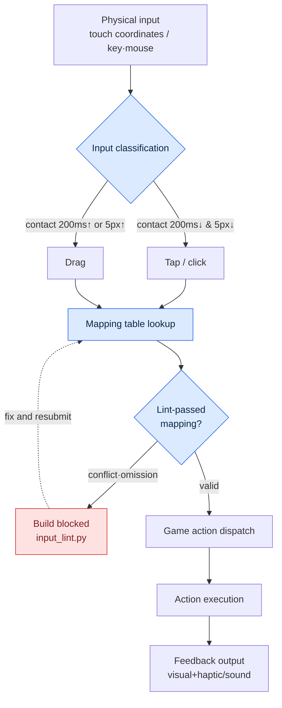

# 14.3 Touch / Mouse Input Design

Team member B picked up the QA build, gripped the phone in one hand, and frowned. "I tapped the skill three times, but it only fired twice." Looking at the screen, at the exact moment the thumb pressed the skill button, that same finger was covering a third of the area next to it. The problem never once appeared when testing with a mouse. A mouse has no fingers.

That scene sums up the essence of touch versus mouse in one line. Both are inputs that "point at a spot," but one pointing tool covers the screen and the other does not. This is where the need to solve the same action differently for the two inputs begins. In this chapter I first sort out the differences between the two inputs, then follow a single worked-transcript spine all the way through: getting an input mapping proposed by AI, then verifying conflicts and reachability myself.

---

## 14.3.1 The Fundamental Differences Between the Two Inputs

Finger thickness, screen occlusion, multi-touch limits, and precision all differ. Before pinning this down in a table, let's get a feel for it with one image. A mouse cursor is a 1-pixel pen nib; a finger is a stamp nearly a centimeter across. The nib can write, but one letter at a time. The stamp prints fast, but it cannot write — and the moment it presses down, you can no longer see the paper.

| Property | Touch | Mouse |
|---|---|---|
| Precision | About 7–10mm (finger contact area) | 1px granularity |
| Occlusion | Finger covers the area around the contact point | None |
| Hover | Nearly impossible (contact = input) | Free (movement ≠ input) |
| Simultaneous inputs | 2–10-point multi-touch | Left, right, middle, wheel |
| Drag/tap distinction | Must be inferred from time and distance | Click/drag unambiguous |
| Haptic feedback | Available | Mostly none |

The two rows with the biggest design impact are "occlusion" and "hover." Occlusion dictates where results get displayed, and the absence of hover means an entire information channel — the tooltip — disappears on mobile. The other four rows are mostly details derived from these two.

Public standards nail these differences down in numbers — open standards like 44pt touch targets (HIG), 48dp (Material), 4.5:1 contrast, and 24 CSS pixels for touch targets (WCAG SC2.5.8) follow the §9.1 rulebook. These numbers are products of human anatomy and measurement, not taste, so when it comes time to verify a mapping, the yardstick you hold up is ultimately these same standards.

## 14.3.2 Mapping by Game Action

Movement, attack, and skills — resolving these three actions for the two inputs splits as follows. Having three options per action does not mean there is no right answer; it means the game's identity forces the choice.

- Movement — touch: ⓐ virtual joystick (left side) ⓑ screen tap → auto-move ⓒ drag → camera rotation / mouse: ⓐ WASD ⓑ click → auto-move ⓒ mouse movement → camera
- Attack — touch: ⓐ attack button tap ⓑ tap enemy → auto-attack ⓒ swipe → combo / mouse: ⓐ left click ⓑ click enemy → auto-attack ⓒ repeated clicks → combo
- Skills — touch: ⓐ slot tap ⓑ long-press slot to aim ⓒ gesture / mouse: ⓐ keys 1–8 ⓑ key + mouse aim ⓒ macro

On Project A, the mobile-first MMORPG I work on, movement uses an ⓐ+ⓑ hybrid on mobile (joystick and auto-move side by side), and WASD plus auto-move on PC. Attack is ⓑ+ⓐ on mobile (tap enemy, then button); PC offers a free choice of ⓐ or ⓑ. Skills are ⓐ on mobile, or ⓑ when targeting; PC layers mouse aiming on top of keys 1–8. Same game, same actions — and yet the mapping table comes out as two sheets. That fact is this entire chapter.

The problem is that the longer the mapping table grows, the better conflicts hide. What happens when long-pressing a slot (skill aiming) and dragging the screen (camera rotation) overlap in the same region? Keys 1–8 are taken by skills, and someone proposes 1 as the inventory shortcut too? Scanning the table by eye, you miss it. That is why we need a workflow where AI proposes the mapping but verification is handed to a tool.

## 14.3.3 Worked Transcript — AI Mapping Proposal and Lint Verification

From here on is the spine of this chapter. I carry over one full cycle in its entirety: getting a draft PC keyboard/mouse mapping proposed by Claude, having a human verify the output, running a conflict-and-reachability lint, rejecting, and re-requesting. I do not summarize. Raw output contains mistakes, and the point is to watch the process of catching them.

### The Prompt (in Full)

> You are designing the input mapping for a PC MMORPG. Propose JSON that maps the action list below to keyboard/mouse.
>
> Actions: movement (forward/back/left/right), run, jump, basic attack, skills 1–8, inventory, map, character window, menu, camera lock toggle, zoom in/out, context menu (secondary action), auto-move toggle.
>
> Constraints:
> - Follow industry conventions (WASD movement, ESC menu, etc.).
> - Do not assign two actions to a single physical key/button.
> - Each entry has `action`, `input`, `note` fields.
> Output the JSON array only.

### Claude's Raw Output (Verbatim, Untouched)

```json
[
  {"action": "move_forward",  "input": "W",      "note": "standard movement"},
  {"action": "move_back",     "input": "S",      "note": "standard movement"},
  {"action": "move_left",     "input": "A",      "note": "standard movement"},
  {"action": "move_right",    "input": "D",      "note": "standard movement"},
  {"action": "run",           "input": "Shift",  "note": "run while held"},
  {"action": "jump",          "input": "Space",  "note": "standard"},
  {"action": "attack_basic",  "input": "Mouse1", "note": "left click, primary action"},
  {"action": "skill_1",       "input": "1",      "note": ""},
  {"action": "skill_2",       "input": "2",      "note": ""},
  {"action": "skill_3",       "input": "3",      "note": ""},
  {"action": "skill_4",       "input": "4",      "note": ""},
  {"action": "skill_5",       "input": "5",      "note": ""},
  {"action": "skill_6",       "input": "6",      "note": ""},
  {"action": "skill_7",       "input": "7",      "note": ""},
  {"action": "skill_8",       "input": "8",      "note": ""},
  {"action": "inventory",     "input": "I",      "note": "Tab is ceded to target switching"},
  {"action": "map",           "input": "M",      "note": ""},
  {"action": "character",     "input": "C",      "note": ""},
  {"action": "menu",          "input": "Escape", "note": "standard"},
  {"action": "cam_lock",      "input": "Mouse3", "note": "wheel click toggles camera lock"},
  {"action": "zoom_in",       "input": "WheelUp",   "note": ""},
  {"action": "zoom_out",      "input": "WheelDown", "note": ""},
  {"action": "context_menu",  "input": "Mouse2", "note": "right click, secondary action"},
  {"action": "auto_move",     "input": "Mouse2", "note": "double right-click for auto-move"}
]
```

The output looks clean. That is what makes it dangerous. Look at the bottom two lines. `context_menu` and `auto_move` are both assigned to `Mouse2` (right click). Even though the constraints clearly said "do not assign two actions to a single key," the model overlapped them anyway, attaching the excuse "distinguished by double-click" in the `note`. This is why AI output must never go straight into the build. A person scanning the table easily misses the conflict between lines 22 and 23 out of 23, and the model rationalizes its own conflict.

So I hand verification to code, not eyes. I run a small lint that checks conflicts (duplicate inputs) and reachability (missing required actions, placement outside the two-thumb corners).

```python
# input_lint.py — input mapping conflict and reachability check
import json, sys
from collections import defaultdict

REQUIRED = {"move_forward","move_back","move_left","move_right",
            "attack_basic","menu","inventory","map"}

def lint(mapping):
    errors, warns = [], []
    seen = defaultdict(list)
    for m in mapping:
        seen[m["input"]].append(m["action"])
    # 1) Conflict: two or more actions on the same input
    for inp, acts in seen.items():
        if len(acts) > 1:
            errors.append(f"CONFLICT  {inp} <- {', '.join(acts)}")
    # 2) Reachability: missing required actions
    actions = {m["action"] for m in mapping}
    for r in sorted(REQUIRED - actions):
        errors.append(f"MISSING   required action '{r}'")
    # 3) Warn on empty note (design intent not recorded)
    for m in mapping:
        if not m["note"].strip():
            warns.append(f"NO_NOTE   {m['action']} ({m['input']})")
    return errors, warns

data = json.load(open(sys.argv[1], encoding="utf-8"))
errs, warns = lint(data)
for e in errs:  print("[ERROR]", e)
for w in warns: print("[WARN] ", w)
print(f"\n=> {len(errs)} error(s), {len(warns)} warning(s)")
sys.exit(1 if errs else 0)
```

Saving the JSON above as `claude_map.json` and running the lint, the actual output is this.

```
[ERROR] CONFLICT  Mouse2 <- context_menu, auto_move
[WARN]  NO_NOTE   skill_1 (1)
[WARN]  NO_NOTE   skill_2 (2)
[WARN]  NO_NOTE   skill_3 (3)
... (same for skill_4~8)

=> 1 error(s), 8 warning(s)
```

The lint pinpointed the single conflict the human eye had missed. The reachability check passed (all 8 required actions present). The 8 empty `note` entries are warnings only and do not block the build, but they expose a debt: design intent left unrecorded. Now I send it back to the model with the grounds for rejection.

### Human Rejection + Re-request

> Rejected: the lint shows context_menu and auto_move overlapping on `Mouse2`. Double-click discrimination adds right-click latency and misfires in combat. Split auto_move onto a separate input. Also, the notes for skill_1\~8 are empty — fill in one line each on what category of skill the slot holds.

### Claude's Revised Output (Excerpt: Conflict Resolution Only)

```json
  {"action": "context_menu", "input": "Mouse2",      "note": "right click = secondary/context action only"},
  {"action": "auto_move",    "input": "Numpad0",     "note": "auto-move toggle, physically separated from combat keys"},
  ...
  {"action": "skill_1", "input": "1", "note": "primary melee skill"},
  {"action": "skill_8", "input": "8", "note": "emergency dodge/survival skill — at the pinky's reach limit, consider remapping to Q"}
```

The last line of the revised output is interesting. The model flagged a reachability issue on its own, self-reporting that "the 8 key is at the pinky's reach limit." That is exactly the same topic as the reachability verification we cover in the next section. Run the lint again and it passes with `0 error(s)`. The core is this: AI produces a 23-line draft fast, but the draft's legality is guaranteed by human-defined rules (the REQUIRED set, the definition of a conflict) and by code. The model proposes, the tool judges, the human decides.

## 14.3.4 Input Flow — From Mapping to Screen

Draw the path by which one physical input becomes a game action, and you can see where the lint above slots in.



A physical input entering at the top left is first classified as a tap or a drag (the 200ms/5px criteria in the next section). The classified input then looks up the mapping table — and the diagram's key point is that the table must pass `input_lint.py` before it enters the build. With a conflict or an omission, it never reaches the dispatch stage; it gets blocked. Mapping verification should be finished before runtime, at the build gate.

## 14.3.5 Five Principles of Touch Design

Now suppose the mapping has passed; we design the surface where that mapping meets the finger.

**Principle 1 — Minimum touch area.** Apple HIG 44pt and Material 48dp are the floor. On an HD screen, sizing buttons around 100px (200px in 2x Retina environments) satisfies both standards at once. Drop below this and the intro's "three taps, two fires" shows up as a statistic.

**Principle 2 — Thumb reach zones.** For mobile MMORPGs, the landscape two-handed grip is the standard: pressable elements go in the two bottom corners, and consumables/slots in the bottom center (for the basis of the three-zone model, see §9.1). P0 actions (left = movement, right = attack and skills) stay inside the two bottom corners; information that is rarely watched goes to the top, beyond the reach limit. The key fact for input design: even combined, the two corners cover less than half the screen. The SVG below shows the two-thumb reach zones and the bottom-center slot bar in landscape mode.

<svg viewBox="0 0 420 240" xmlns="http://www.w3.org/2000/svg" role="img" aria-label="Two-thumb reach zones in landscape mode">
  <rect x="10" y="10" width="400" height="220" rx="14" fill="#f7f7fa" stroke="#333" stroke-width="2"/>
  <!-- Left thumb fan -->
  <path d="M 30 230 A 150 150 0 0 1 180 80 L 30 80 Z" fill="#3a7bd5" opacity="0.20"/>
  <path d="M 30 230 A 95 95 0 0 1 125 135 L 30 135 Z" fill="#3a7bd5" opacity="0.40"/>
  <!-- Right thumb fan -->
  <path d="M 390 230 A 150 150 0 0 0 240 80 L 390 80 Z" fill="#d5533a" opacity="0.20"/>
  <path d="M 390 230 A 95 95 0 0 0 295 135 L 390 135 Z" fill="#d5533a" opacity="0.40"/>
  <!-- Top center rectangle -->
  <rect x="150" y="22" width="120" height="50" rx="6" fill="#999" opacity="0.18"/>
  <text x="210" y="52" font-size="12" text-anchor="middle" fill="#444">Top = out of reach (info)</text>
  <!-- Bottom-center slot bar (amber — consumables/quick slots) -->
  <rect x="160" y="178" width="100" height="36" rx="6" fill="#f59e0b" opacity="0.35" stroke="#f59e0b" stroke-width="1.5" stroke-dasharray="4 3"/>
  <text x="210" y="200" font-size="10" text-anchor="middle" fill="#92400e">Bottom center = consumables·quick slots</text>
  <text x="78" y="205" font-size="12" text-anchor="middle" fill="#1c4a8a">Left thumb</text>
  <text x="342" y="205" font-size="12" text-anchor="middle" fill="#8a2a1c">Right thumb</text>
  <text x="78" y="160" font-size="10" text-anchor="middle" fill="#1c4a8a">Easy</text>
  <text x="342" y="160" font-size="10" text-anchor="middle" fill="#8a2a1c">Easy</text>
  <text x="210" y="225" font-size="11" text-anchor="middle" fill="#555">Dark = P0 button placement / light = reach limit</text>
</svg>

The dark fan is where the thumb lands without strain; the light fan is the limit reached only by stretching the hand. If the "8 key at the pinky's limit" the model reported in 14.3.3 is the PC edition of the problem, the mobile edition is the mistake of placing a P0 button in this light zone.

**Principle 3 — Avoiding occlusion.** A finger does not cover only the contact point; the whole hand above it covers the screen. Tap a bottom-right skill and roughly a quarter of the bottom right goes invisible. So display the results of an action (damage numbers, state changes) in areas fingers do not touch. The hand gripping the left joystick intrudes on the character and minimap positions, so the minimap moves to the top right.

**Principle 4 — Drag/tap distinction.** Unlike a mouse, touch must infer the user's intent from time and distance. Unify on one criterion across the entire game — for example, contact within 200ms with movement within 5px is a tap; anything beyond is a drag. When these two numbers wobble, intent failures pile up: "I tried to tap and my character rolled." The branch point in the mermaid diagram above is exactly this judgment.

**Principle 5 — Haptics.** Vibration is the only channel that communicates without the screen being watched. But give every input a vibration and it becomes noise. Plain taps: none; skill use: short; risky actions like purchase confirmation: strong; enemy kills: subtle — keep it within 4–5 variants.

## 14.3.6 Five Principles of Mouse Design

The mouse enjoys three luxuries touch does not have: hover, multiple buttons, and cursor precision.

**Principle 1 — Hover.** A mouse can point without pressing. Rest it on a skill slot and a tooltip with name, cooldown, and description appears; click and the skill is used. Touch has no such in-between state, so hover is a channel through which PC can layer on more information. The caveat: information that depends on hover alone has nowhere to go in the mobile edition — something to be conscious of back at the 14.3.3 mapping stage.

**Principle 2 — Multiple buttons.** Left click is the primary action, right click is secondary/context, wheel click resets the camera, the wheel zooms. The conflict the lint caught above was precisely a case of stacking two actions on this right click. Trying to fill every button just because they exist is how conflicts get made.

**Principle 3 — Keyboard conventions.** ESC = menu, M = map, 1–8 = skills, WASD = movement, Shift = run, Space = jump. Users should be able to guess without learning. Keys that deviate from convention get their justification written in `note` — the decision in 14.3.3 to cede Tab to target switching instead of inventory is one example.

**Principle 4 — Camera control.** Rotate the camera with mouse drag, but toggle clearly between a game mode that locks the cursor to the screen and a UI mode that releases it. When this toggle is ambiguous, you get the confusion of closing a menu only to have the cursor vanish.

**Principle 5 — Macro and automation allowances.** How far to allow auto-attack and auto-move is a question of game identity. Loosen it too much and PC becomes a screen full of macros; ban it outright and the entry barrier rises for users coming over from mobile. The answer is picking the point on the spectrum that fits the game's color, not either extreme.

## 14.3.7 Common to Both — Unified Input Feedback

The principles differ per platform, but the "feel" a user gets from the same action must stay the same when the platform changes. A user moving from mobile to PC should not have to relearn what a glowing button means.

| Situation | Touch | Mouse |
|---|---|---|
| Input recognized | Button glow + short haptic | Button glow + click sound |
| Input failed | Button shake + haptic | Button shake + warning sound |
| Cooldown in progress | Radial gauge | Radial gauge |
| Ready again | Glow + haptic | Glow + sound |

The visual channel (glow, shake, gauge) is identical on both sides; only the secondary channel splits into haptic vs. sound per platform. This consistency cuts the learning cost for multi-platform users in half.

## 14.3.8 Common Failures and Fixes

| Pattern | Fix |
|---|---|
| Buttons below the standard floor (44pt/48dp) | Enforce around 100px |
| Results displayed in the finger-occluded zone | Move to a non-occluded zone |
| Haptic overuse | Keep within 4–5 variants |
| Two actions stacked on right click | Block the conflict with lint, then split |
| Hover-only information carried to mobile as is | On mobile, substitute tap/long-press channels |
| Hard-locked key mapping | Allow user customization |
| Forcing identical mapping on both platforms | Natural mapping per platform |

The fourth row of this table is the conclusion of the 14.3.3 worked transcript. Scanning the table by eye, the right-click conflict is missed almost every time; hang the lint on the build gate and it is caught almost every time.

---

### Key Takeaways
- Touch is a stamp whose finger covers the screen; the mouse is a pen nib that covers nothing — port one side's UX as is and it clashes with the hand.
- AI proposes the input mapping, but lint judges conflicts and reachability — the human eye misses the one conflicting line out of 23.
- Unify the visual feedback channel across both platforms; split only the secondary channel into haptic vs. sound.

### Next Chapter Preview
- 15.1 Live Ops — the Cycle a Game Lives Through After Launch

---

### Try It Yourself (setup → prompt → verify)

1. **setup** — Collect your action list and constraints in one file (movement, attack, skills, UI, camera). Put the `input_lint.py` above in your project. Replace the `REQUIRED` set with your own game's required actions.
2. **prompt** — Use the full prompt from 14.3.3 as is, swapping in only your action list. Pin the output format to a JSON array only.
3. **verify** — Run the returned JSON through `python input_lint.py claude_map.json`. Until ERROR reaches 0, re-request with explicit grounds for rejection (conflicting inputs, missing actions). Log WARN (empty notes) separately as unrecorded-design-intent debt.

### Solo Scale-Down
If you are building a small game alone, shrink the tooling. With fewer than 10 actions, a 20-line lint that keeps only two checks — the `REQUIRED` set and "duplicate input" detection — is enough. Get the mapping from AI, filter only the conflicts through this mini lint, then press the buttons on a real device to see whether your thumb (or pinky) reaches. The model proposes, code judges conflicts, your own hand judges reach — hold to these three and it works at any scale.
