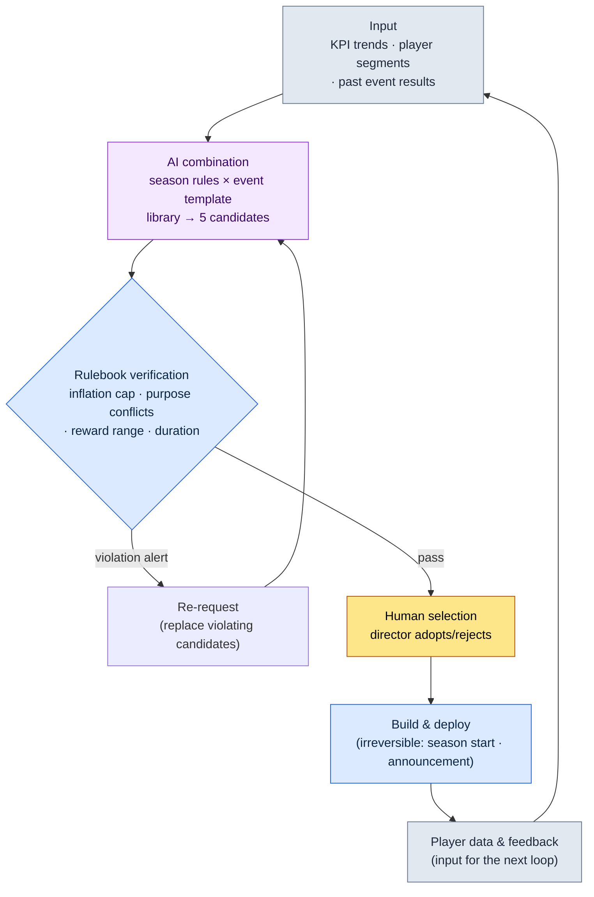

# 15.1 Live Ops Overview — AI Combines Event Candidates, the Rulebook Filters Them, and a Human Chooses

> Primary audience: a game designer taking charge of live operations (live ops) for the first time after launch, on a mid-size team (10–50 people)
> Scaled-down version for solo/hobbyist readers: §15.1.7, "If you're solo, just this much"
>
> **Premise**: I ran live ops on a globally launched mobile MMORPG, including its P2E (play-to-earn) economy, and I write this chapter by combining that experience with the pre-launch AI workflow on my current project. The worked transcript is the result of actually running the "input → AI combination → rulebook verification → human selection" pattern once on live ops formats. Estimates and observations are labeled as estimates and observations, and no made-up KPI table is included.

The office on the morning after launch is not the office from before launch. The milestone is over, yet the work does not shrink — only its unit gets smaller. Schedules that ran in quarters split into weeks, days, and hours. And every week, the same question returns to the meeting room: "What event are we running this weekend?"

If that question restarts from a blank page every week, the live ops team burns out fast. This chapter is about taking that question off the blank page. The core is twofold. First, instead of squeezing out events and seasons from scratch every time, accumulate them as a **library of proven formats**. Second, hand the tedious drafting — "combine those formats into 5 candidates for next week" — to AI, and let the human decide only **which of the candidates that passed rulebook verification to adopt**. Building from zero and picking one of five are very different workloads.

---

## 15.1.1 Live Ops Is a Loop, Not a Feeling

Plenty of books teach the standard live ops cycle as a table to memorize: report on Monday, prepare on Tuesday and Wednesday, deploy on Friday. All true — but memorizing the table never shows you how the decision that comes back every week, "this week's event," actually gets made. The essence of live ops is not a schedule but a **closed loop** — candidates appear, pass verification, a human picks, the build ships, and player data comes back as the input for the next candidates. One full turn.

On top of this loop, the four tracks of live ops — content, events, balance, and customer support (CS) — each run at their own speed. Content runs monthly to quarterly, events weekly to monthly, balance weekly to biweekly, and CS daily and hourly. When the four tracks run separately, the same player data produces a different decision every week. So the goal of this chapter is to tie the four tracks into a single loop, and to shape one cell of that loop — event candidate generation — into a form AI can run.



Human hands touch this loop in exactly two places: at the top, where the input (KPIs, segments, past results) is fed in clean, and at the spot where someone decides which of the verified candidates goes live. The tedious work in between — squeezing out 5 combinations and filtering rule violations — is run by AI and the rulebook. And the single line at the bottom — the player data created by the shipped event flows back in as input — is what makes this loop live ops. Pre-launch design ships once and is done; in live ops, the result becomes the next input.

The two libraries that feed this loop (season rules and event templates) are detailed in §15.2, and the last cell (automatic classification of player feedback) in §15.3. This chapter focuses on going around the loop once, all the way.

---

## 15.1.2 [Worked Transcript] Combining 5 Event Candidates → Rulebook Verification → Human Selection

Here is one full cycle, end to end, of how this actually runs. Below is a reproduction of a session in which I took the "library combination → rulebook verification → human selection" pattern — verified in my pre-launch content tooling — and ran it once on live ops formats (season rules + event templates). The input prompts can be copied and used as they are; the outputs are a reconstruction of that session.

### Step 1 — Input: Hand Over the Library and the Current State as They Are

First, put the two ingredients for combination in a form a machine can read: the event template library (proven formats) and the season rule library — plus this week's current state (KPIs and segments). The libraries are built once and reused every week.

```yaml
# event_templates.yaml — library of proven event templates (excerpt, 4 of 9)
- id: tpl_attendance      # daily login rewards
  purpose: [acquisition, reactivation]
  recommended_duration: 7–14 days
  reward_tier: low–mid
- id: tpl_coop_raid       # co-op raid
  purpose: [engagement, community]
  recommended_duration: 3–7 days
  reward_tier: mid–high
- id: tpl_pvp_season      # competitive season
  purpose: [community, engagement]
  recommended_duration: 14–28 days
  reward_tier: high
- id: tpl_limited_package # limited-time package
  purpose: [revenue]
  recommended_duration: 3–7 days
  reward_tier: high (purchase-linked)

# season_rules.yaml — season rule fragments (excerpt)
season_inflation_cap: high-tier reward events ≤ 3 per quarter
purpose_conflict_rule: no two [revenue]-purpose events in the same week
overlap_rule: no two high-reward events at the same time (fatigue, inflation)

# current_state.yaml — this week's state
week: 2026-W23
revenue_events_last_2_weeks: 1 (quarterly high-tier total: 2)
DAU_trend: gradual decline (-6% over the last 4 weeks; 'caution' zone by industry observation)
key_segment: rising share of lapsed players likely to return
upcoming_external_events: none
```

### Step 2 — Prompt: Ask for Combinations, but Enforce Format and Rules

```
Using the attached template, season-rule, and current-state YAML files, combine exactly 5 event candidates for next week.
Do not invent new mechanics — use combinations of the attached templates only. Flag any season-rule violations yourself,
and add one line per candidate explaining why it fits the current signals (DAU decline, lapsed-player return).
Spread the purposes so they don't all skew toward revenue, and flag anything ambiguous and hand it to me.
Table only; columns: candidate, template combo, primary purpose, duration, rule violation, rationale, ambiguous.
```

Notice that not one of the five lines of rules says *what to make*. Every one of them is a constraint — "answer within this frame, based on this evidence." Give AI free rein and it spits out the average event of a generic RPG. **Restrict the materials to the library (rule 1), require a self-check against the season rules (rule 2), require a rationale tied to the current signals (rule 3), spread the purposes (rule 4), and leave an escape hatch — "if it's ambiguous, hand it to the human" (rule 5).** Together, the five lines define not the shape of the candidates but their qualifications.

### Step 3 — Claude's Output (Reconstruction, Excerpt)

Below is the raw output, unsummarized. Rule violations and ambiguity flags are mixed in.

```
| Cand. | Template combo               | Primary purpose         | Duration | Rule violation | Rationale                                              | Ambig. |
|-------|------------------------------|-------------------------|----------|----------------|--------------------------------------------------------|--------|
| C1    | tpl_attendance               | reactivation            | 10 days  | none           | directly targets rising lapsed-return share; reward 'mid' | -      |
| C2    | tpl_coop_raid                | engagement              | 5 days   | none           | login incentive during DAU decline; stirs community      | -      |
| C3    | tpl_attendance+tpl_coop_raid | reactivation+engagement | 7 days   | none           | logins pull returners + raid retains them; combo synergy | -      |
| C4    | tpl_pvp_season               | community               | 21 days  | none           | long season lifts the retention curve itself             | ★      |
| C5    | tpl_limited_package          | revenue                 | 5 days   | ★violation     | quarter already at 2 high-tier → adding nears/exceeds cap | -      |

Rule check results:
- C5: risk of violating season_inflation_cap. This quarter already has 2
  high-tier reward events. Adding C5 makes 3, right at the cap. A revenue
  push during a DAU decline can add to player fatigue — it also runs
  against the current signals.
- C4: no rule violation, but a 21-day PvP season occupies 3 weeks, not
  just this one. Whether it fits as a "this week" candidate is an ops
  policy call → flagged as ambiguous.
- C1, C2, and C3 pass the rules and align with the current signals
  (lapsed players, DAU).
```

The most valuable part of this output is not the table but the **three rule-check lines at the bottom**. The AI caught and flagged C5's inflation violation on its own, and handed C4 to the human with "no violation, but judgment may differ." A good prompt lets AI report its own limits and pass the ball to the human.

### Step 4 — Verification and Selection (the Human's Part)

You do not accept this output as is. Run it through the rulebook once more, and then a human picks. In this session, two calls actually split.

First, **C5 is rejected**. The AI had already flagged the inflation violation, and the rulebook code (§15.1.3) returned the same verdict. It hits the quarterly high-tier cap, and a revenue push during a decline in daily active users (DAU) runs against the current signals. There is nothing to debate. Out it goes.

Next is **C4 (the 21-day PvP season)** — the one the AI flagged as ambiguous. No rule is violated, but this is not a "this week's event"; it is a "this season" decision. It is not something to settle on the spot in a one-week loop — it belongs in the integrated season meeting. So it is held out of this week's candidates and pulled aside as a season calendar agenda item.

From the remaining C1, C2, and C3, the director picks. The best fit for the current signals (a rising share of returning lapsed players + a gradual DAU decline) was **C3 (login rewards + co-op raid combined)**. Login rewards pull lapsed players back in, and the raid holds on to the players it pulled in — that combined synergy matched this week's signals. C1 and C2 stay in the candidate pool for next week.

One candidate was not finished here. After deciding to adopt C3, it turned out the last day of the 7-day run overlapped with an upcoming scheduled maintenance day. So one re-request goes around.

```
We adopt C3. However, the last day of the 7-day run overlaps with a scheduled maintenance day.
Adjust the duration and propose again, so that maintenance does not cut off participation at the end of the event.
Keep the total reward amount the same and only move the schedule earlier.
```

The AI answered again with the start date moved up a day so the event ends before maintenance, and that adjustment passed the rulebook. Input → AI combination → rulebook verification → human selection → schedule re-adjustment: the cycle closes here.

This one full turn is the standard of Show this entire book holds itself to. Unless you watch, at least once and all the way through, what the AI combines, what the rulebook filters, and what the human picks and rejects, the sentence "we generate event candidates with AI" is hollow.

---

## 15.1.3 The Rulebook as Code — Automatic Candidate Verification

Check by eye every week whether the candidates respect the season rules, and you will miss things — again. Of the three rules in §15.1.2, whatever can be judged numerically should be reviewed by code. Humans spend their time only on the "ambiguous" and the "selection" that code cannot catch.

```python
# event_lint.py — verifies next week's event candidates (skeleton)
# Input: candidate list combined by AI + season rules + quarterly running state
# Output: list of rule violations (alerts, not auto-rejection)

def lint(candidates, season, quarter_state):
    issues = []
    high_used = quarter_state["high_reward_count"]  # high-tier count so far this quarter
    for c in candidates:
        # Rule A: inflation cap (high tier ≤ 3 per quarter)
        if c["reward_tier"] == "high" and high_used + 1 > season["inflation_cap"]:
            issues.append(f"[A] {c['id']}: adding a high-tier event exceeds the quarterly cap "
                          f"of {season['inflation_cap']} (currently {high_used})")
        # Rule B: no two [revenue]-purpose events in the same week
    sales = [c for c in candidates if "revenue" in c["purpose"]]
    if len(sales) > 1:
        issues.append(f"[B] {len(sales)} [revenue]-purpose candidates at once → limit to 1")
        # Rule C: purpose skew (if one purpose is a majority of the 5, spread is insufficient)
    from collections import Counter
    top = Counter(c["primary_purpose"] for c in candidates).most_common(1)[0]
    if top[1] > len(candidates) // 2:
        issues.append(f"[C] purpose '{top[0]}' appears {top[1]} times — skewed (insufficient spread)")
    return issues
```

This code settles the meeting-room back-and-forth — "isn't this reward too generous?" — with a single line of numbers. When the code prints `[A] tpl_limited_package: adding a high-tier event exceeds the quarterly cap of 3 (currently 2)`, there is nothing to debate. You drop it. This is the lint gate from §14.1 (mobile HUD) carried over to the live ops level — the division of labor where code catches what determinism can catch and humans take what requires judgment holds in operations just the same.

One thing is different, though. Even when this lint finds a violation, it does **not** automatically discard the candidate. It only raises an alert. It is the same design we saw in the city generator in §6.2. Attach auto-rejecting verification, and the machine also kills intended variations — say, a campaign decision to run a revenue event knowing full well where the quarterly cap stands. The machine surfaces suspect candidates; whether they live or die is the director's call. Rejecting C5 in §15.1.2 was not the lint killing it, either — it was a human decision made after seeing the lint's alert.

---

## 15.1.4 Before and After Launch — What Changes

The loop above differs decisively from the pre-launch design loop on two points. Rather than listing a table, I will pin down exactly these two.

First, **the result becomes the next input.** Before launch, a game design document flows one way: you write it, and it flows through to the build. In live ops, the player data this week's event creates (participation, churn, revenue, feedback) comes back as the input (`current_state.yaml`) for next week's candidate combination. The bottom arrow in the §15.1.1 loop is that return. So the KPI of live ops is not "get it right once" but "adjust to the signals every week."

Second, **experiments get cheaper, but the irreversible points get sharper.** Before launch, a single decision shaped a quarter; live, you run a one-week event, and if it misses, you change it next week. Rollback-friendly experiments multiply. But **a season start and an event announcement are irreversible.** The principle from §5.4.5 — "recording and casting = irreversible steps" — applies as is. Season rules and rewards that players have already seen leave a mark on community perception even if you "cancel" them. So every verification in the §15.1.1 loop — AI combination, rulebook, human selection — must finish in the reversible stage, **before** entering the irreversible cell of build and announcement. Holding C4 (the 21-day season) out of this week's snap decision and sending it up to the season meeting follows the same principle — the bigger the irreversible point of a decision, the longer the reversible review it gets.

These two points make live ops a different job from pre-launch design. The rest — time units shifting from quarters to weeks, feedback shifting from beta tests to real time — derives from these two axes.

---

## 15.1.5 From Conservative to Progressive Application

The worked transcript in §15.1.2 is a scene from the progressive application: AI combined the candidates, and the human decided the adoption. But not every team gets there from day one. There are stages.

In the **conservative application**, humans originate the candidates. The ops team designs the events directly in the Monday meeting, writes the season rules by hand, and classifies player feedback manually. Automation covers only measurement (the KPI dashboard) and regression checks (build verification). By industry observation, most live MMORPG operations today are close to this stage.

In the **progressive application**, AI drafts even the "event candidate proposals" and the "feedback classification." §15.1.2 is a scene of the former; the latter (automatic feedback clustering) appears in §15.3. Human decisions narrow to meta-decisions: which candidate to adopt, and how to take the feedback AI has classified.

For the progressive application to take root, three things must be in place: a **library** in which event templates and season rules are separated and accumulated as recombinable units (the `event_templates.yaml` in §15.1.2 is its seed), a **candidate generator** that takes the current signals as input and produces draft candidates (the prompt in §15.1.2), and **clustering** that automatically classifies incoming feedback (§15.3). That these three share the same skeleton as §5.3.12 (the world Behavior Tree (BT) and the quest cloud) and §8.1.8 (progressive balancing) is this book's consistent message — different domains, same structure: accumulate verified pieces as a library, let AI propose combinations, and let a human adopt.

Let me make one thing clear here. Ideas like the library, the candidate generator, and clustering were theoretically possible even in the 2010s. What blocked them was that AI could not write the **natural language players actually read** — event announcements, rule explanations — and could not summarize and classify hundreds to thousands of feedback items a day in natural language. After the advances in large language models (LLMs) from 2023 onward, those two walls got lower, and a large part of progressive operations that had existed only on paper moved into the realm of the feasible.

---

## 15.1.6 Common Failures

| Pattern | Why It Fails | Remedy |
|---|---|---|
| Designing events from a blank page every week | The ops team burns out fast; candidate quality swings with the team's condition | Accumulate an event template library (§15.1.2) |
| Wholesale delegation — "AI, make me an event" | Without a library and rules, you get the average of generic RPGs | Restrict the materials + force a season-rule self-check (§15.1.2) |
| Reviewing candidates by eye only | Inflation and purpose skew slip through every week | Verify automatically with `event_lint.py` (§15.1.3) |
| Making the lint auto-reject | The machine kills intended campaign decisions too | Alerts only; adoption is the director's call (§15.1.3) |
| Settling irreversible decisions on the spot in the weekly loop | Rolling back after a season announcement leaves a mark on the community | Split big decisions out to the season meeting (§15.1.4) |
| Chasing a single KPI (DAU or revenue) | Player fatigue accumulates; candidates get adopted against the signals | Feed multi-axis signals into current_state (§15.1.2) |

---

## 15.1.7 Try It Yourself — One Step You Can Take Today

Try just one step, in **setup → prompt → verify** order.

- **setup**: Write down, by hand, 4–5 proven event formats from your own game (or a game you have operated) in the `event_templates.yaml` format — purpose, duration, and reward tier only. Three one-line season rules are enough: an inflation cap, a purpose-conflict ban, and an overlap ban.
- **prompt**: Paste the prompt from §15.1.2 as is, fill in this week's state (KPI direction, key segments) in `current_state.yaml`, and run it once.
- **verify**: Of the 5 candidates that come out, pick one that violates a rule and push back yourself: "This hits the inflation cap — drop it and try again." Watching how the AI replaces it teaches you, hands on, what bundle of judgments an event combination really is.

> **If you're solo, just this much**: You don't need the library YAML or the lint code. Recall just 5–6 events from the last quarter of a game you love and write them down in three columns — purpose, duration, reward. That alone shows you the game wasn't squeezing events out of a blank page every week; it was rotating formats. That table is your first template library.

If you're on a team, start with this one step: gather the events from the last one or two quarters, normalize them into `event_templates.yaml` (proven formats only), and put the three season rules into code first with `event_lint.py`. With a library and rules in place, you can measure AI-combined candidates and human drafts with the same ruler.

---

### Key Takeaways
- Live ops is not a schedule but a closed loop — the result becomes the next input.
- Event candidate combination goes to AI, rule violations to lint, adoption to the director.
- Season starts and announcements are irreversible — finish every verification in the reversible stage before them.

### Next Chapter Preview
- 15.2 Event and Season Operations — How to Build the Template Library and the Season Rules
